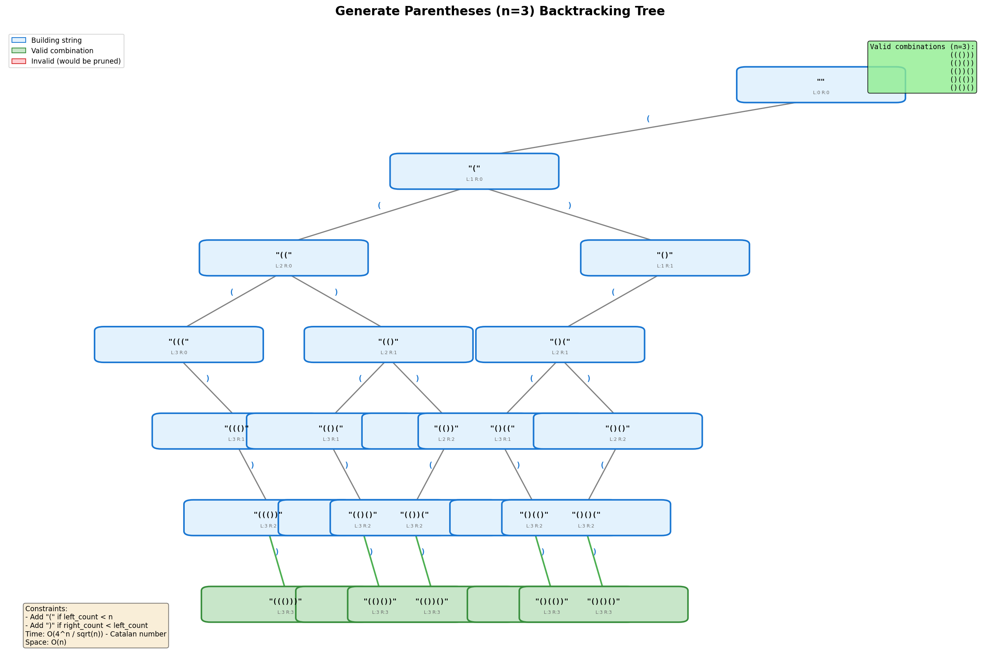
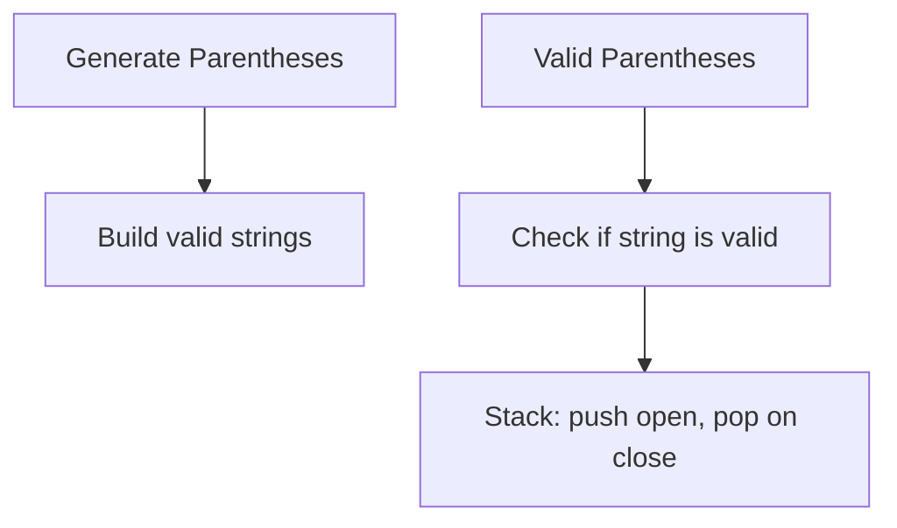
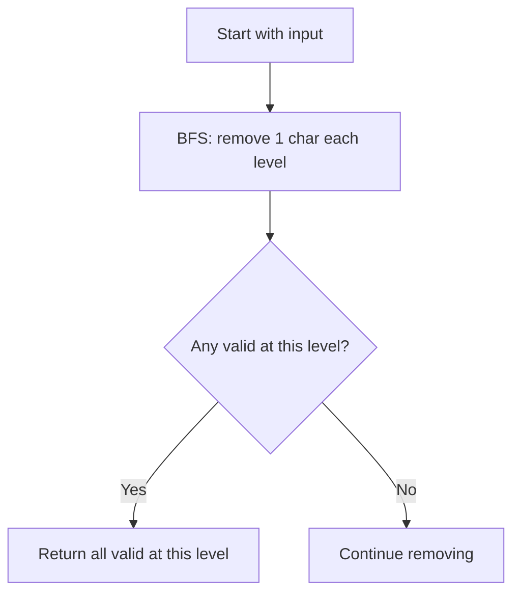
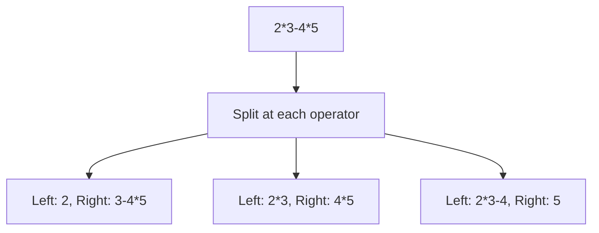

# Generate Parentheses

> **LeetCode**: [22. Generate Parentheses](https://leetcode.com/problems/generate-parentheses/)
> **Difficulty**: Medium
> **Pattern**: Backtracking with Constraints

---

## Problem Statement

Given `n` pairs of parentheses, write a function to generate all combinations of well-formed parentheses.

---

## Examples

### Example 1
```text
Input: n = 3
Output: ["((()))", "(()())", "(())()", "()(())", "()()()"]
```

### Example 2
```text
Input: n = 1
Output: ["()"]
```

---

## Constraints

- `1 <= n <= 8`

---

## Backtracking Tree Visualization



### Key Constraints

At any point in building the string:
1. **Can add `(`** if: `left_count < n`
2. **Can add `)`** if: `right_count < left_count`

These constraints ensure we never have more `)` than `(` at any prefix.

```text
Valid:   ( ( ) )    - at every prefix, #( >= #)
         1 2 1 0    <- balance (open parens count)

Invalid: ( ) ) (    - prefix "())" has more ) than (
         1 0 -1     <- balance goes negative = INVALID
```

---

## Backtracking Template

```python
def generateParenthesis(n):
    """
    Template for generating valid parentheses.

    Constraints:
    - Add '(' if left < n
    - Add ')' if right < left
    """
    result = []

    def backtrack(s, left, right):
        # BASE CASE: complete string
        if len(s) == 2 * n:
            result.append(s)
            return

        # Try adding '('
        if left < n:
            backtrack(s + '(', left + 1, right)

        # Try adding ')'
        if right < left:
            backtrack(s + ')', left, right + 1)

    backtrack('', 0, 0)
    return result
```

---

## Solutions

### Solution

::: code-group
```python [Python]
def generateParenthesis(n: int) -> list:
    """
    Generate all valid parentheses combinations.

    Time Complexity: O(4^n / sqrt(n)) - Catalan number
    Space Complexity: O(n) for recursion depth
    """
    result = []

    def backtrack(s, left, right):
        if len(s) == 2 * n:
            result.append(s)
            return

        if left < n:
            backtrack(s + '(', left + 1, right)

        if right < left:
            backtrack(s + ')', left, right + 1)

    backtrack('', 0, 0)
    return result


# Test
print(generateParenthesis(3))
# Output: ['((()))', '(()())', '(())()', '()(())', '()()()']
```

```java [Java]
public List<String> generateParenthesis(int n) {
    List<String> result = new ArrayList<>();
    backtrack(result, new StringBuilder(), 0, 0, n);
    return result;
}

private void backtrack(List<String> result, StringBuilder path,
                       int open, int close, int n) {
    if (path.length() == 2 * n) {
        result.add(path.toString());
        return;
    }
    if (open < n) {
        path.append('(');
        backtrack(result, path, open + 1, close, n);
        path.deleteCharAt(path.length() - 1);
    }
    if (close < open) {
        path.append(')');
        backtrack(result, path, open, close + 1, n);
        path.deleteCharAt(path.length() - 1);
    }
}
```
:::

::: info Complexity: Time O(4^n / sqrt(n)) · Space O(n)
- **Time:** The number of valid parentheses combinations is the nth Catalan number, which is bounded by O(4^n / sqrt(n)). String concatenation is O(n) per call.
- **Space:** Maximum recursion depth is 2n (total characters to place), but the call stack at any time has at most O(n) frames.
:::

### Solution 2: Backtracking with List (More Efficient)

```python
def generateParenthesis_list(n: int) -> list:
    """
    Use list instead of string concatenation for efficiency.

    String concatenation creates new strings; list append is O(1).

    Time Complexity: O(4^n / sqrt(n))
    Space Complexity: O(n)
    """
    result = []

    def backtrack(path, left, right):
        if len(path) == 2 * n:
            result.append(''.join(path))
            return

        if left < n:
            path.append('(')
            backtrack(path, left + 1, right)
            path.pop()

        if right < left:
            path.append(')')
            backtrack(path, left, right + 1)
            path.pop()

    backtrack([], 0, 0)
    return result


# Test
print(generateParenthesis_list(3))
```

::: info Complexity: Time O(4^n / sqrt(n)) · Space O(n)
- **Time:** Same Catalan number bound. Using list with append/pop is O(1) amortized per character, more efficient than string concatenation.
- **Space:** Recursion depth is O(n), plus the path list stores at most 2n characters.
:::

### Solution 3: Iterative with BFS

```python
from collections import deque

def generateParenthesis_bfs(n: int) -> list:
    """
    BFS approach using a queue.

    Time Complexity: O(4^n / sqrt(n))
    Space Complexity: O(4^n / sqrt(n)) for queue
    """
    result = []
    queue = deque([('', 0, 0)])  # (string, left_count, right_count)

    while queue:
        s, left, right = queue.popleft()

        if len(s) == 2 * n:
            result.append(s)
            continue

        if left < n:
            queue.append((s + '(', left + 1, right))

        if right < left:
            queue.append((s + ')', left, right + 1))

    return result


# Test
print(generateParenthesis_bfs(3))
```

::: info Complexity: Time O(4^n / sqrt(n)) · Space O(4^n / sqrt(n))
- **Time:** BFS explores the same search space as DFS backtracking, bounded by the Catalan number.
- **Space:** The queue stores all partial strings at the current BFS level, which can grow to store all valid combinations.
:::

### Solution 4: Dynamic Programming

```python
def generateParenthesis_dp(n: int) -> list:
    """
    DP approach: Build solutions from smaller subproblems.

    For n pairs, we can decompose as:
    ( [inside] ) [outside]

    where [inside] has i pairs and [outside] has n-1-i pairs.

    Time Complexity: O(4^n / sqrt(n))
    Space Complexity: O(4^n / sqrt(n))
    """
    if n == 0:
        return ['']

    dp = [[] for _ in range(n + 1)]
    dp[0] = ['']

    for i in range(1, n + 1):
        for j in range(i):
            # j pairs inside, i-1-j pairs outside
            for inside in dp[j]:
                for outside in dp[i - 1 - j]:
                    dp[i].append('(' + inside + ')' + outside)

    return dp[n]


# Test
print(generateParenthesis_dp(3))
# Output: ['()()()', '()(())', '(())()', '(()())', '((()))']
```

::: info Complexity: Time O(4^n / sqrt(n)) · Space O(4^n / sqrt(n))
- **Time:** Builds solutions by combining smaller subproblems; total work is proportional to the number of valid parentheses strings.
- **Space:** The dp array stores all valid combinations for each value from 0 to n, requiring space proportional to the Catalan number.
:::

### Solution 5: Closure Number

```python
def generateParenthesis_closure(n: int) -> list:
    """
    Based on closure number concept.

    A valid sequence has the form: (A)B
    where A and B are valid sequences with |A| + |B| = n - 1 pairs.

    Time Complexity: O(4^n / sqrt(n))
    Space Complexity: O(4^n / sqrt(n))
    """
    if n == 0:
        return ['']

    result = []
    for c in range(n):
        for left in generateParenthesis_closure(c):
            for right in generateParenthesis_closure(n - 1 - c):
                result.append('(' + left + ')' + right)

    return result


# Test
print(generateParenthesis_closure(3))
```

::: info Complexity: Time O(4^n / sqrt(n)) · Space O(4^n / sqrt(n))
- **Time:** Recursively generates all combinations by decomposing into (A)B form, where |A| + |B| = n-1 pairs.
- **Space:** Recursion depth can reach O(n), and intermediate results for all subproblems are stored (memoization would help repeated calls).
:::

---

## Complexity Analysis

The number of valid parentheses combinations is the **nth Catalan number**:

$$C_n = \frac{1}{n+1} \binom{2n}{n} = \frac{(2n)!}{(n+1)! \cdot n!}$$

| n | Catalan Number C_n |
|---|-------------------|
| 1 | 1 |
| 2 | 2 |
| 3 | 5 |
| 4 | 14 |
| 5 | 42 |
| 6 | 132 |
| 7 | 429 |
| 8 | 1430 |

**Time Complexity**: O(4^n / sqrt(n)) - bounded by Catalan number
**Space Complexity**: O(n) for recursion depth

---

## Why These Constraints Work

### Constraint 1: `left < n`
We can only add `(` if we haven't used all n of them.

### Constraint 2: `right < left`
We can only add `)` if there's an unmatched `(` to close.

```
Building "(()"
- Current: "("  -> left=1, right=0
- Add '(':  "((" -> left=2, right=0 (left < 3, OK)
- Add ')': "(()" -> left=2, right=1 (right < left, OK)

Invalid attempt "())" would require:
- Current: "()" -> left=1, right=1
- Add ')':  "())" -> right=2 > left=1, NOT ALLOWED!
```

---

## Common Mistakes

### 1. Using Wrong Condition
```python
# WRONG - allows invalid sequences
if right < n:  # Should be: right < left
    backtrack(s + ')', left, right + 1)

# CORRECT
if right < left:  # Only close if there's an open to match
    backtrack(s + ')', left, right + 1)
```

### 2. Missing Base Case
```python
# WRONG - infinite recursion
def backtrack(s, left, right):
    if left < n:
        backtrack(s + '(', left + 1, right)
    if right < left:
        backtrack(s + ')', left, right + 1)
    # Missing: when to stop and add to result!

# CORRECT
def backtrack(s, left, right):
    if len(s) == 2 * n:  # Complete string!
        result.append(s)
        return
    # ... rest of code
```

### 3. Inefficient String Concatenation
```python
# SLOW for large n - creates new strings each time
backtrack(s + '(', left + 1, right)

# FASTER - use list and join at the end
path.append('(')
backtrack(path, left + 1, right)
path.pop()
```

---

## Related Problems

::: details Valid Parentheses (LeetCode 20)
**Problem:** Given a string with (){}[], determine if the input string is valid (properly nested and matched).

**Key Insight:** Validation vs generation. Use stack to match opening/closing brackets.



**Approach:** Stack-based validation. Push opening brackets, pop and match on closing brackets.

**Complexity:** O(n) time, O(n) space

**Link:** [LeetCode 20](https://leetcode.com/problems/valid-parentheses/)
:::

::: details Longest Valid Parentheses (LeetCode 32)
**Problem:** Find the length of the longest valid (well-formed) parentheses substring.

**Key Insight:** Optimization problem requiring DP or stack to track valid substring lengths.

```mermaid
graph TD
    A[Approach 1: DP] --> B[dp[i] = longest valid ending at i]
    C[Approach 2: Stack] --> D[Store indices, calculate lengths]
```

**Approach:** DP: dp[i] = 2 + dp[i-1] + dp[i-dp[i-1]-2] when s[i]=')', s[i-dp[i-1]-1]='('.

**Complexity:** O(n) time, O(n) space

**Link:** [LeetCode 32](https://leetcode.com/problems/longest-valid-parentheses/)
:::

::: details Remove Invalid Parentheses (LeetCode 301)
**Problem:** Remove minimum number of invalid parentheses to make input valid. Return all possible results.

**Key Insight:** BFS to find all strings with minimum removals that are valid.



**Approach:** BFS level-by-level removal. First level with valid strings is the answer.

**Complexity:** O(2^n) time worst case, O(n) space

**Link:** [LeetCode 301](https://leetcode.com/problems/remove-invalid-parentheses/)
:::

::: details Different Ways to Add Parentheses (LeetCode 241)
**Problem:** Given expression with +, -, *, return all possible results from computing in different orders.

**Key Insight:** Divide and conquer - split at each operator, recursively solve left and right.



**Approach:** For each operator, recursively compute left and right, combine all results.

**Complexity:** O(C_n) Catalan number time, O(C_n) space

**Link:** [LeetCode 241](https://leetcode.com/problems/different-ways-to-add-parentheses/)
:::

---

## Interview Tips

1. **Start with constraints**: Explain when we can add `(` and `)`
2. **Draw the tree**: Show how constraints prune invalid branches
3. **Mention Catalan numbers**: Shows mathematical understanding
4. **Discuss optimization**: List vs string for path building
5. **Know the DP approach**: Shows versatility

---

## Key Takeaways

1. **Two simple rules**:
   - Add `(` if `left < n`
   - Add `)` if `right < left`
2. **No explicit backtracking needed** (string immutable in Python)
3. **Catalan number** gives exact count of valid combinations
4. **Use list + join** for efficient string building
5. **DP decomposition**: `(A)B` where A and B are valid sequences

---

*Last updated: January 2026*
