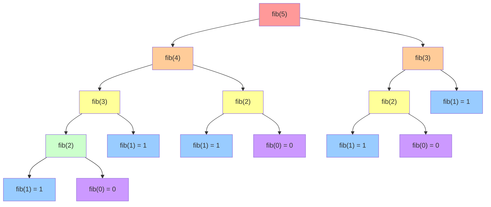
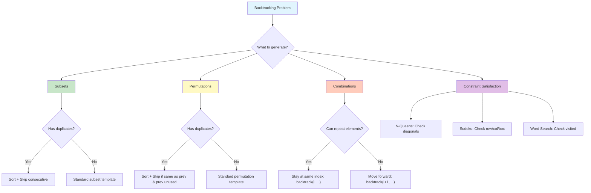

# Recursion & Backtracking

> **Solving problems by breaking them into subproblems**

---

## Overview

**Recursion** is a programming technique where a function calls itself to solve smaller instances of the same problem. It is one of the most fundamental and powerful concepts in computer science, forming the basis for many algorithms including tree traversals, divide and conquer, and backtracking.

**Backtracking** is an algorithmic technique that incrementally builds candidates for solutions and abandons ("backtracks") a candidate as soon as it determines the candidate cannot lead to a valid solution. It explores all possible paths through a decision tree, pruning branches that violate constraints.

### Core Concepts

| Concept | Definition | Example |
|---------|------------|---------|
| **Base Case** | Condition that stops recursion | `if n <= 1: return 1` |
| **Recursive Case** | Function calls itself with smaller input | `return n * factorial(n-1)` |
| **Backtracking** | Undo choices that lead to invalid states | Remove last element, try next |
| **Pruning** | Skip branches that cannot yield valid solutions | Early termination on constraint violation |
| **Memoization** | Cache results to avoid redundant computation | Store computed values in dict/array |

### When to Use Recursion

| Use Case | Why Recursion Works Well |
|----------|-------------------------|
| **Tree/Graph traversals** | Natural representation of hierarchical structure |
| **Divide and Conquer** | Problems that split into independent subproblems |
| **Combinatorial problems** | Generate all permutations, combinations, subsets |
| **Backtracking problems** | Explore solution space with constraint checking |
| **Mathematical definitions** | Factorial, Fibonacci, GCD naturally recursive |

### When to Consider Alternatives

| Scenario | Better Alternative |
|----------|-------------------|
| Deep recursion (>1000 levels) | Iterative with explicit stack |
| Overlapping subproblems | Dynamic programming with tabulation |
| Tail recursion | Loop transformation (Python doesn't optimize tail calls) |
| Simple iterations | for/while loops |

---

## Document Structure

| Problem | Difficulty | Pattern | Link |
|---------|------------|---------|------|
| Fibonacci Sequence | Easy | Basic Recursion | [Link](./fibonacci) |
| Factorial | Easy | Basic Recursion | [Link](./factorial) |
| Climbing Stairs | Easy | Recursion + Memoization | [Link](./climbing-stairs) |
| Subsets | Medium | Backtracking | [Link](./subsets) |
| Subsets II | Medium | Backtracking + Duplicates | [Link](./subsets-ii) |
| Permutations | Medium | Backtracking | [Link](./permutations) |
| Permutations II | Medium | Backtracking + Duplicates | [Link](./permutations-ii) |
| Combination Sum | Medium | Backtracking | [Link](./combination-sum) |
| Combination Sum II | Medium | Backtracking + Duplicates | [Link](./combination-sum-ii) |
| Letter Combinations of Phone | Medium | Backtracking | [Link](./letter-combinations) |
| Generate Parentheses | Medium | Backtracking + Constraints | [Link](./generate-parentheses) |
| Palindrome Partitioning | Medium | Backtracking | [Link](./palindrome-partitioning) |
| Word Search | Medium | Grid Backtracking | [Link](./word-search) |
| N-Queens | Hard | Classic Backtracking | [Link](./n-queens) |
| N-Queens II | Hard | Classic Backtracking | [Link](./n-queens-ii) |
| Sudoku Solver | Hard | Constraint Backtracking | [Link](./sudoku-solver) |
| Word Search II | Hard | Trie + Backtracking | [Link](./word-search-ii) |

---

## Recursion Tree Visualization

Understanding recursion requires visualizing the call tree. Each node represents a function call, and edges represent the recursive calls made.

### Fibonacci Example (Mermaid)



**Key Insight:** Notice the redundant calculations - `fib(3)` is computed twice, `fib(2)` is computed three times. This exponential growth ($O(2^n)$) is why memoization is crucial.

---

## Call Stack Animation (ASCII)

Visualizing how the call stack grows and shrinks during recursion.

### Fibonacci Call Stack

```
CALL STACK VISUALIZATION: fib(4)
================================

Step 1: fib(4) called
┌─────────────────────┐
│  fib(4)             │ <- Top of stack
└─────────────────────┘

Step 2: fib(4) calls fib(3)
┌─────────────────────┐
│  fib(3)             │ <- Top of stack
├─────────────────────┤
│  fib(4) [waiting]   │
└─────────────────────┘

Step 3: fib(3) calls fib(2)
┌─────────────────────┐
│  fib(2)             │ <- Top of stack
├─────────────────────┤
│  fib(3) [waiting]   │
├─────────────────────┤
│  fib(4) [waiting]   │
└─────────────────────┘

Step 4: fib(2) calls fib(1)
┌─────────────────────┐
│  fib(1) -> return 1 │ <- Base case!
├─────────────────────┤
│  fib(2) [waiting]   │
├─────────────────────┤
│  fib(3) [waiting]   │
├─────────────────────┤
│  fib(4) [waiting]   │
└─────────────────────┘

Step 5: fib(1) returns, fib(2) calls fib(0)
┌─────────────────────┐
│  fib(0) -> return 0 │ <- Base case!
├─────────────────────┤
│  fib(2) [has 1]     │
├─────────────────────┤
│  fib(3) [waiting]   │
├─────────────────────┤
│  fib(4) [waiting]   │
└─────────────────────┘

Step 6: fib(0) returns, fib(2) = 1 + 0 = 1
┌─────────────────────┐
│  fib(2) -> return 1 │ <- Returns!
├─────────────────────┤
│  fib(3) [has 1]     │
├─────────────────────┤
│  fib(4) [waiting]   │
└─────────────────────┘

[... continues until all calls resolve ...]

Final: fib(4) = 3
```

### Factorial Call Stack (Simpler Example)

```
factorial(4) called
│
├── factorial(3) called
│   │
│   ├── factorial(2) called
│   │   │
│   │   ├── factorial(1) called
│   │   │   │
│   │   │   └── return 1  (BASE CASE)
│   │   │
│   │   └── return 2 * 1 = 2
│   │
│   └── return 3 * 2 = 6
│
└── return 4 * 6 = 24

RESULT: factorial(4) = 24
```

---

## Visual Guides


---

## Backtracking Template

The "Choose-Explore-Unchoose" framework is the foundation of all backtracking solutions.

### Generic Backtracking Template

```python
def backtrack(candidates, path, result, start=0):
    """
    Generic backtracking template.

    Args:
        candidates: List of available choices
        path: Current partial solution being built
        result: List to store all valid solutions
        start: Index to start exploring (prevents duplicates)
    """
    # BASE CASE: Check if current path is a valid solution
    if is_solution(path):
        result.append(path[:])  # Add COPY of path
        return  # Optional: remove if need all solutions

    # PRUNING: Early termination if constraints violated
    if not is_valid(path):
        return

    # EXPLORE: Try all possible choices
    for i in range(start, len(candidates)):
        candidate = candidates[i]

        # Skip duplicates (if needed)
        if i > start and candidates[i] == candidates[i-1]:
            continue

        # CHOOSE: Add candidate to current path
        path.append(candidate)

        # RECURSE: Explore with this choice
        backtrack(candidates, path, result, i + 1)  # i + 1 for combinations, i for repetition allowed

        # UNCHOOSE: Remove candidate (backtrack)
        path.pop()

    return result
```

### Pattern Variations

| Variation | Key Difference | `start` Parameter |
|-----------|---------------|-------------------|
| **Combinations** | Each element used once | `i + 1` (move forward) |
| **Permutations** | Order matters, each used once | Use `visited` set instead |
| **With Repetition** | Elements can repeat | `i` (stay at same index) |
| **With Duplicates** | Input has duplicate elements | Skip if `candidates[i] == candidates[i-1]` |

---

## Backtracking Tree Visualization

### Generating Subsets of [1, 2, 3]

```
                         []
                   Include 1?
                /              \
              /                  \
           [1]                    []
       Include 2?             Include 2?
        /      \              /       \
      /          \          /           \
   [1,2]        [1]       [2]           []
  Inc 3?       Inc 3?    Inc 3?       Inc 3?
  /    \       /    \    /    \       /    \
[1,2,3] [1,2] [1,3] [1] [2,3] [2]   [3]   []

All subsets: [], [1], [2], [3], [1,2], [1,3], [2,3], [1,2,3]
```

### N-Queens Backtracking (4x4 Board)

```
Trying to place 4 queens on a 4x4 board:

Row 0: Try col 0     Row 0: Try col 1     Row 0: Try col 2
    Q . . .              . Q . .              . . Q .
    . . . .              . . . .              . . . .
    . . . .              . . . .              . . . .
    . . . .              . . . .              . . . .

    |                        |                    |
    v                        v                    v

Row 1: Try cols...   Row 1: Try col 3     Row 1: Try col 0
    Q . . .              . Q . .              . . Q .
    . . Q X (conflict!)  . . . Q              Q . . .
                              |                   |
    BACKTRACK!               v                   v

                     Row 2: conflict      Row 2: Try col 3
                             on all              . . Q .
                             cols!               Q . . .
                                                 . . . Q
                         BACKTRACK!                  |
                                                     v

                                             Row 3: Try col 1
                                                 . . Q .
                                                 Q . . .
                                                 . . . Q
                                                 . Q . .

                                                 SUCCESS!
```

---

## Classic Recursion Problems

### 1. Fibonacci with Memoization

```python
# Naive recursive (O(2^n) time)
def fib_naive(n):
    if n <= 1:
        return n
    return fib_naive(n - 1) + fib_naive(n - 2)

# Memoized recursive (O(n) time, O(n) space)
def fib_memo(n, memo={}):
    if n in memo:
        return memo[n]
    if n <= 1:
        return n
    memo[n] = fib_memo(n - 1, memo) + fib_memo(n - 2, memo)
    return memo[n]

# Using functools (Pythonic way)
from functools import lru_cache

@lru_cache(maxsize=None)
def fib_cached(n):
    if n <= 1:
        return n
    return fib_cached(n - 1) + fib_cached(n - 2)

# Bottom-up DP (O(n) time, O(1) space)
def fib_dp(n):
    if n <= 1:
        return n
    prev, curr = 0, 1
    for _ in range(2, n + 1):
        prev, curr = curr, prev + curr
    return curr
```

### 2. Subsets (Power Set)

```python
def subsets(nums):
    """
    Generate all subsets of nums.
    Time: O(n * 2^n), Space: O(n) for recursion depth
    """
    result = []

    def backtrack(start, path):
        # Every path is a valid subset
        result.append(path[:])

        for i in range(start, len(nums)):
            path.append(nums[i])
            backtrack(i + 1, path)
            path.pop()

    backtrack(0, [])
    return result

# Example: subsets([1, 2, 3])
# Output: [[], [1], [1,2], [1,2,3], [1,3], [2], [2,3], [3]]
```

### 3. Permutations

```python
def permutations(nums):
    """
    Generate all permutations of nums.
    Time: O(n! * n), Space: O(n)
    """
    result = []

    def backtrack(path, remaining):
        if not remaining:
            result.append(path[:])
            return

        for i in range(len(remaining)):
            # Choose
            path.append(remaining[i])
            new_remaining = remaining[:i] + remaining[i+1:]

            # Explore
            backtrack(path, new_remaining)

            # Unchoose
            path.pop()

    backtrack([], nums)
    return result

# Alternative using swap (in-place)
def permutations_swap(nums):
    result = []

    def backtrack(start):
        if start == len(nums):
            result.append(nums[:])
            return

        for i in range(start, len(nums)):
            nums[start], nums[i] = nums[i], nums[start]  # Swap
            backtrack(start + 1)
            nums[start], nums[i] = nums[i], nums[start]  # Unswap

    backtrack(0)
    return result
```

### 4. Combination Sum

```python
def combination_sum(candidates, target):
    """
    Find all unique combinations that sum to target.
    Same number can be used multiple times.
    Time: O(n^(target/min)), Space: O(target/min)
    """
    result = []

    def backtrack(start, path, remaining):
        if remaining == 0:
            result.append(path[:])
            return
        if remaining < 0:
            return

        for i in range(start, len(candidates)):
            path.append(candidates[i])
            # Use 'i' (not i+1) because same element can be reused
            backtrack(i, path, remaining - candidates[i])
            path.pop()

    backtrack(0, [], target)
    return result

# Example: combination_sum([2, 3, 6, 7], 7)
# Output: [[2, 2, 3], [7]]
```

### 5. N-Queens

```python
def solve_n_queens(n):
    """
    Find all valid N-Queens configurations.
    Time: O(n!), Space: O(n)
    """
    result = []

    # Track columns and diagonals under attack
    cols = set()
    pos_diag = set()  # row + col is constant
    neg_diag = set()  # row - col is constant

    board = [['.'] * n for _ in range(n)]

    def backtrack(row):
        if row == n:
            result.append([''.join(r) for r in board])
            return

        for col in range(n):
            # Check if position is safe
            if col in cols or (row + col) in pos_diag or (row - col) in neg_diag:
                continue

            # Place queen
            cols.add(col)
            pos_diag.add(row + col)
            neg_diag.add(row - col)
            board[row][col] = 'Q'

            # Move to next row
            backtrack(row + 1)

            # Remove queen (backtrack)
            cols.remove(col)
            pos_diag.remove(row + col)
            neg_diag.remove(row - col)
            board[row][col] = '.'

    backtrack(0)
    return result
```

---

## Decision Tree for Backtracking Problems



---

## Common Patterns and Templates

### Pattern 1: Handling Duplicates in Input

```python
def subsets_with_dup(nums):
    """Handle duplicates in subset generation."""
    result = []
    nums.sort()  # CRITICAL: Sort first!

    def backtrack(start, path):
        result.append(path[:])

        for i in range(start, len(nums)):
            # Skip duplicates at the same decision level
            if i > start and nums[i] == nums[i - 1]:
                continue

            path.append(nums[i])
            backtrack(i + 1, path)
            path.pop()

    backtrack(0, [])
    return result
```

### Pattern 2: Grid Backtracking (Word Search)

```python
def word_search(board, word):
    """Search for word in 2D grid."""
    rows, cols = len(board), len(board[0])

    def backtrack(r, c, idx):
        if idx == len(word):
            return True  # Found complete word

        # Boundary and match check
        if (r < 0 or r >= rows or c < 0 or c >= cols or
            board[r][c] != word[idx]):
            return False

        # Mark as visited (in-place)
        temp = board[r][c]
        board[r][c] = '#'

        # Explore 4 directions
        found = (backtrack(r + 1, c, idx + 1) or
                 backtrack(r - 1, c, idx + 1) or
                 backtrack(r, c + 1, idx + 1) or
                 backtrack(r, c - 1, idx + 1))

        # Restore (backtrack)
        board[r][c] = temp

        return found

    for r in range(rows):
        for c in range(cols):
            if backtrack(r, c, 0):
                return True
    return False
```

### Pattern 3: Constraint-Based Backtracking (Sudoku)

```python
def solve_sudoku(board):
    """Solve Sudoku using backtracking."""

    def is_valid(board, row, col, num):
        num_str = str(num)

        # Check row
        if num_str in board[row]:
            return False

        # Check column
        if any(board[r][col] == num_str for r in range(9)):
            return False

        # Check 3x3 box
        box_row, box_col = 3 * (row // 3), 3 * (col // 3)
        for r in range(box_row, box_row + 3):
            for c in range(box_col, box_col + 3):
                if board[r][c] == num_str:
                    return False

        return True

    def backtrack():
        # Find next empty cell
        for r in range(9):
            for c in range(9):
                if board[r][c] == '.':
                    # Try digits 1-9
                    for num in range(1, 10):
                        if is_valid(board, r, c, num):
                            board[r][c] = str(num)

                            if backtrack():
                                return True

                            board[r][c] = '.'  # Backtrack

                    return False  # No valid digit found

        return True  # All cells filled

    backtrack()
```

---

## Time & Space Complexity Analysis

### Recursion Complexity

| Problem | Time | Space | Notes |
|---------|------|-------|-------|
| Fibonacci (naive) | $O(2^n)$ | $O(n)$ | Exponential without memoization |
| Fibonacci (memo) | $O(n)$ | $O(n)$ | Each subproblem solved once |
| Factorial | $O(n)$ | $O(n)$ | Linear recursion depth |
| Tower of Hanoi | $O(2^n)$ | $O(n)$ | Each move doubles |

### Backtracking Complexity

| Problem | Time | Space | Notes |
|---------|------|-------|-------|
| Subsets | $O(n \cdot 2^n)$ | $O(n)$ | $2^n$ subsets, $O(n)$ to copy each |
| Permutations | $O(n \cdot n!)$ | $O(n)$ | $n!$ permutations, $O(n)$ to copy |
| Combination Sum | $O(n^{T/M})$ | $O(T/M)$ | T=target, M=min candidate |
| N-Queens | $O(n!)$ | $O(n)$ | Worst case tries all arrangements |
| Sudoku | $O(9^{81})$ | $O(1)$ | Worst case, usually much faster |

### Recursion Depth Considerations

```python
# Python default recursion limit is ~1000
import sys
sys.setrecursionlimit(10000)  # Increase if needed

# Better: Convert to iteration for deep recursion
def factorial_iterative(n):
    result = 1
    for i in range(2, n + 1):
        result *= i
    return result
```

---

## Google Interview Focus

Based on recent Google SDE interview patterns, these recursion/backtracking topics are frequently tested:

### High Priority Topics

1. **Subsets/Combinations** - Generate all possible combinations with/without duplicates
2. **Permutations** - Generate all orderings, handle duplicates
3. **Word Search** - Grid-based backtracking with visited tracking
4. **Generate Parentheses** - Constraint-based generation
5. **Combination Sum** - Find combinations that sum to target

### Common Google Backtracking Questions

| Question Type | Example Problem | Key Insight |
|--------------|-----------------|-------------|
| Subset Generation | Subsets, Subsets II | Include/exclude decision at each element |
| Permutation | Permutations, Letter Combinations | Order matters, try each remaining element |
| Combination | Combination Sum I/II | Track running sum, handle repetition |
| Grid Search | Word Search, Robot Room Cleaner | Mark visited, explore 4 directions |
| Constraint Satisfaction | N-Queens, Sudoku | Validate before placing, track constraints |
| String Building | Generate Parentheses, IP Addresses | Balance constraints, length limits |

### Common Mistakes to Avoid

1. **Forgetting to make a copy** - `result.append(path[:])` not `result.append(path)`
2. **Not sorting for duplicate handling** - Always sort input when skipping duplicates
3. **Wrong index in recursive call** - `i` vs `i + 1` vs `start + 1` matters!
4. **Not restoring state** - Always undo changes after recursive call
5. **Stack overflow** - Convert to iteration for deep recursion

### What Interviewers Look For

1. **Clarifying Questions**
   - Are there duplicate elements in the input?
   - Can elements be reused?
   - Do we need all solutions or just one?
   - What are the constraints on input size?

2. **Problem-Solving Approach**
   - Identify it as a backtracking problem
   - Explain the decision tree structure
   - Discuss pruning opportunities
   - Walk through an example

3. **Code Quality**
   - Clean backtracking template usage
   - Proper state management (choose/unchoose)
   - Handle edge cases (empty input, no solution)
   - Clear variable names

4. **Complexity Analysis**
   - Explain exponential nature
   - Identify pruning benefits
   - Discuss space from recursion stack

---

## Visual Learning Resources

### Interactive Visualizers

- [Recursion Tree Visualizer (VisuAlgo)](https://visualgo.net/en/recursion) - Interactive recursion tree and DAG visualization
- [Algorithm Visualizer](https://algorithm-visualizer.org/) - Step-by-step backtracking animations
- [Labuladong Algorithm Visualization](https://labuladong.online/en/algo/intro/visualize/) - Hover to see choose/unchoose path
- [Backtracking Visualizer (GitHub)](https://github.com/MohamedMahmoudHassan/Backtracking-Visualizer) - Sudoku, N-Queens, Knight's Tour

### Educational Resources

- [A Tree-Based Introduction to Backtracking](https://avikdas.com/2020/02/25/a-tree-based-introduction-to-backtracking.html) - Excellent conceptual overview
- [Hello Interview - Backtracking Overview](https://www.hellointerview.com/learn/code/backtracking/overview) - Interview-focused guide
- [GeeksforGeeks - Top 20 Backtracking Problems](https://www.geeksforgeeks.org/dsa/top-20-backtracking-algorithm-interview-questions/) - Curated problem list
- [Interviewing.io - Recursion Interview Questions](https://interviewing.io/recursion-interview-questions) - Tips for senior engineers

### Video Tutorials

- [NeetCode - Backtracking Playlist](https://neetcode.io/roadmap) - Visual problem explanations
- [Back To Back SWE - Recursion Series](https://www.youtube.com/c/BackToBackSWE) - Detailed walkthroughs

---

## Practice Progression

### Week 1: Recursion Foundations

| Day | Focus | Problems |
|-----|-------|----------|
| 1 | Basic Recursion | Fibonacci, Factorial, Sum of N |
| 2 | Recursion on Arrays | Reverse Array, Binary Search |
| 3 | Recursion on Strings | Palindrome Check, Reverse String |

### Week 2: Backtracking Basics

| Day | Focus | Problems |
|-----|-------|----------|
| 4 | Subsets | Subsets, Subsets II |
| 5 | Permutations | Permutations, Permutations II |
| 6 | Combinations | Combination Sum, Combination Sum II |

### Week 3: Advanced Backtracking

| Day | Focus | Problems |
|-----|-------|----------|
| 7 | String Backtracking | Generate Parentheses, Letter Combinations |
| 8 | Grid Backtracking | Word Search, N-Queens |
| 9 | Constraint Problems | Sudoku Solver, Word Search II |

---

## Quick Reference Card

### Backtracking Template Cheat Sheet

```
CHOOSE-EXPLORE-UNCHOOSE Pattern:
--------------------------------
for each choice:
    1. CHOOSE: Make the choice (modify state)
    2. EXPLORE: Recurse with updated state
    3. UNCHOOSE: Undo the choice (restore state)
```

### When to Use Each Variation

| If the problem asks for... | Use this approach |
|---------------------------|-------------------|
| All subsets | Include/exclude each element |
| All permutations | Swap elements or use visited set |
| Combinations summing to target | Track running sum, prune if exceeded |
| Valid arrangements (N-Queens) | Check constraints before placing |
| Path in grid | Mark visited, restore after |

### Key Formulas

```
Subsets:         2^n possible subsets
Permutations:    n! arrangements
Combinations:    C(n,k) = n! / (k! * (n-k)!)
N-Queens:        Upper bound: n! arrangements
```

---

## Resources

### Recommended Practice

- [LeetCode Backtracking Tag](https://leetcode.com/tag/backtracking/)
- [LeetCode Recursion Tag](https://leetcode.com/tag/recursion/)
- [NeetCode Roadmap - Backtracking](https://neetcode.io/roadmap)
- [Grind 75 - Recursion Problems](https://www.techinterviewhandbook.org/grind75)

### Further Reading

- [HackerRank - Recursion and Backtracking](https://www.hackerrank.com/interview/interview-preparation-kit/recursion-backtracking/challenges)
- [InterviewBit - Backtracking Course](https://www.interviewbit.com/courses/programming/backtracking/)
- [Design Gurus - Backtracking Interview Tips](https://www.designgurus.io/answers/detail/what-are-the-tips-for-solving-backtracking-problems-in-interviews)
- [Tech Interview Handbook - Recursion](https://www.techinterviewhandbook.org/algorithms/recursion/)

---

*Last updated: January 2026*

*Recursion and backtracking are fundamental techniques that appear in many interview problems. Master the "Choose-Explore-Unchoose" pattern, understand when to use different variations, and practice visualizing the decision tree. The key to solving these problems efficiently is identifying pruning opportunities early.*

---

## Sources

- [GeeksforGeeks - Top 20 Backtracking Algorithm Interview Questions](https://www.geeksforgeeks.org/dsa/top-20-backtracking-algorithm-interview-questions/)
- [Interviewing.io - Recursion Interview Questions](https://interviewing.io/recursion-interview-questions)
- [Design Gurus - Is Backtracking Important for an Interview?](https://www.designgurus.io/answers/detail/is-backtracking-important-for-an-interview)
- [Hello Interview - Backtracking Overview](https://www.hellointerview.com/learn/code/backtracking/overview)
- [VisuAlgo - Recursion Tree Visualization](https://visualgo.net/en/recursion)
- [A Tree-Based Introduction to Backtracking](https://avikdas.com/2020/02/25/a-tree-based-introduction-to-backtracking.html)
- [Algorithm Visualizer](https://algorithm-visualizer.org/)
- [GitHub - Backtracking Visualizer](https://github.com/MohamedMahmoudHassan/Backtracking-Visualizer)
