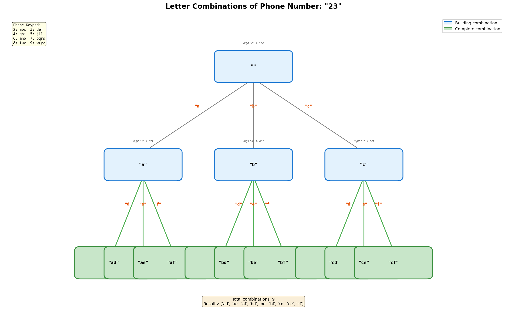
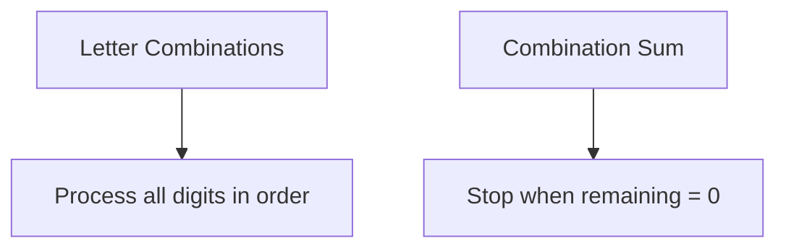
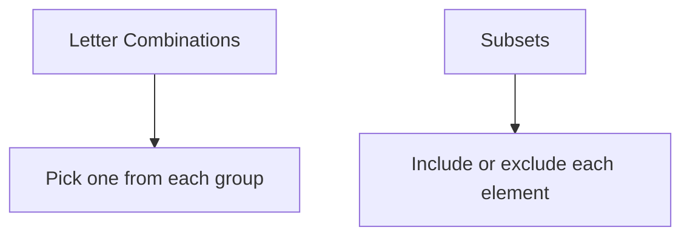
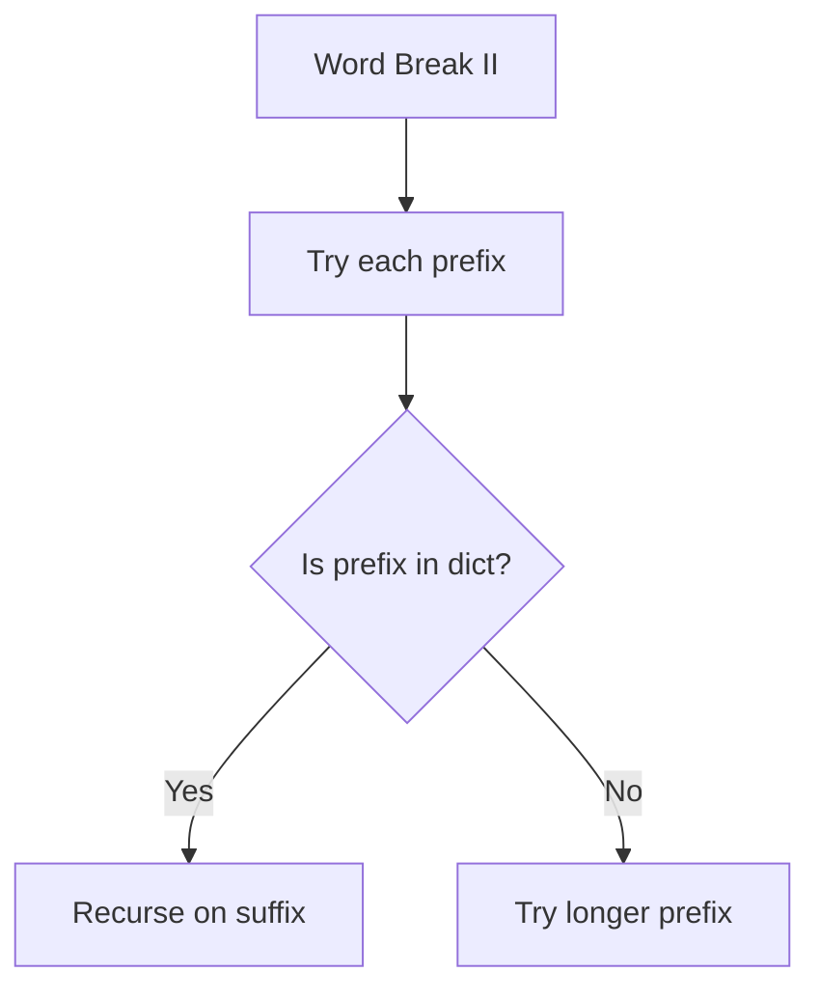

# Letter Combinations of a Phone Number

> **LeetCode**: [17. Letter Combinations of a Phone Number](https://leetcode.com/problems/letter-combinations-of-a-phone-number/)
> **Difficulty**: Medium
> **Pattern**: Backtracking

---

## Problem Statement

Given a string containing digits from `2-9` inclusive, return all possible letter combinations that the number could represent. Return the answer in **any order**.

A mapping of digits to letters (just like on the telephone buttons) is given below. Note that 1 does not map to any letters.

```text
2 -> abc    3 -> def    4 -> ghi    5 -> jkl
6 -> mno    7 -> pqrs   8 -> tuv    9 -> wxyz
```

---

## Examples

### Example 1
```text
Input: digits = "23"
Output: ["ad", "ae", "af", "bd", "be", "bf", "cd", "ce", "cf"]
```

### Example 2
```text
Input: digits = ""
Output: []
```

### Example 3
```text
Input: digits = "2"
Output: ["a", "b", "c"]
```

---

## Constraints

- `0 <= digits.length <= 4`
- `digits[i]` is a digit in the range `['2', '9']`

---

## Backtracking Tree Visualization



### Decision Tree for "23"

```text
                   ""
            /      |      \
          "a"     "b"     "c"       <- digit 2 (abc)
         /|\     /|\     /|\
        d e f   d e f   d e f       <- digit 3 (def)

Result: ["ad", "ae", "af", "bd", "be", "bf", "cd", "ce", "cf"]
```

---

## Backtracking Template

```python
def letterCombinations(digits):
    """
    Template for letter combinations.

    At each level, iterate through all letters for that digit.
    """
    if not digits:
        return []

    phone_map = {
        '2': 'abc', '3': 'def', '4': 'ghi', '5': 'jkl',
        '6': 'mno', '7': 'pqrs', '8': 'tuv', '9': 'wxyz'
    }

    result = []

    def backtrack(index, path):
        # BASE CASE: processed all digits
        if index == len(digits):
            result.append(''.join(path))
            return

        # Get letters for current digit
        letters = phone_map[digits[index]]

        # Try each letter
        for letter in letters:
            path.append(letter)          # CHOOSE
            backtrack(index + 1, path)   # EXPLORE
            path.pop()                   # UNCHOOSE

    backtrack(0, [])
    return result
```

---

## Solutions

### Solution 1: Backtracking (Recommended)

```python
def letterCombinations(digits: str) -> list:
    """
    Generate all letter combinations using backtracking.

    Time Complexity: O(4^n * n) where n = len(digits)
        - At most 4 choices per digit (for 7 and 9)
        - n to build each string
    Space Complexity: O(n) for recursion depth
    """
    if not digits:
        return []

    phone_map = {
        '2': 'abc', '3': 'def', '4': 'ghi', '5': 'jkl',
        '6': 'mno', '7': 'pqrs', '8': 'tuv', '9': 'wxyz'
    }

    result = []

    def backtrack(index, path):
        if index == len(digits):
            result.append(''.join(path))
            return

        for letter in phone_map[digits[index]]:
            path.append(letter)
            backtrack(index + 1, path)
            path.pop()

    backtrack(0, [])
    return result


# Test
print(letterCombinations("23"))
# Output: ['ad', 'ae', 'af', 'bd', 'be', 'bf', 'cd', 'ce', 'cf']
```

::: info Complexity: Time O(4^n * n) · Space O(n)
- **Time:** Each digit maps to 3-4 letters (7 and 9 have 4). In the worst case, all digits are 7 or 9, giving 4^n combinations. Building each combination string takes O(n).
- **Space:** Recursion depth equals the number of digits (n), plus the path list stores at most n characters.
:::

### Solution 2: Iterative (BFS-like)

```python
def letterCombinations_iterative(digits: str) -> list:
    """
    Build combinations iteratively.

    Start with empty combination, then extend with each digit.

    Time Complexity: O(4^n * n)
    Space Complexity: O(4^n * n) for storing intermediate results
    """
    if not digits:
        return []

    phone_map = {
        '2': 'abc', '3': 'def', '4': 'ghi', '5': 'jkl',
        '6': 'mno', '7': 'pqrs', '8': 'tuv', '9': 'wxyz'
    }

    result = ['']

    for digit in digits:
        temp = []
        for combination in result:
            for letter in phone_map[digit]:
                temp.append(combination + letter)
        result = temp

    return result


# Test
print(letterCombinations_iterative("23"))
# Output: ['ad', 'ae', 'af', 'bd', 'be', 'bf', 'cd', 'ce', 'cf']
```

::: info Complexity: Time O(4^n * n) · Space O(4^n * n)
- **Time:** For each digit, we extend every existing combination with each letter for that digit, multiplying the number of combinations.
- **Space:** Stores all intermediate combinations; after processing all digits, stores up to 4^n strings of length n.
:::

### Solution 3: Using itertools.product

```python
from itertools import product

def letterCombinations_product(digits: str) -> list:
    """
    Use itertools.product for Cartesian product.

    Time Complexity: O(4^n * n)
    Space Complexity: O(4^n * n)
    """
    if not digits:
        return []

    phone_map = {
        '2': 'abc', '3': 'def', '4': 'ghi', '5': 'jkl',
        '6': 'mno', '7': 'pqrs', '8': 'tuv', '9': 'wxyz'
    }

    letter_groups = [phone_map[d] for d in digits]
    return [''.join(combo) for combo in product(*letter_groups)]


# Test
print(letterCombinations_product("23"))
```

::: info Complexity: Time O(4^n * n) · Space O(4^n * n)
- **Time:** itertools.product computes the Cartesian product of all letter groups, yielding 4^n tuples, each joined into a string of length n.
- **Space:** The product generator is lazy, but the list comprehension materializes all combinations.
:::

### Solution 4: Using functools.reduce

```python
from functools import reduce

def letterCombinations_reduce(digits: str) -> list:
    """
    Functional approach using reduce.

    Time Complexity: O(4^n * n)
    Space Complexity: O(4^n * n)
    """
    if not digits:
        return []

    phone_map = {
        '2': 'abc', '3': 'def', '4': 'ghi', '5': 'jkl',
        '6': 'mno', '7': 'pqrs', '8': 'tuv', '9': 'wxyz'
    }

    return reduce(
        lambda acc, digit: [a + c for a in acc for c in phone_map[digit]],
        digits,
        ['']
    )


# Test
print(letterCombinations_reduce("23"))
```

::: info Complexity: Time O(4^n * n) · Space O(4^n * n)
- **Time:** Reduce processes digits left to right, extending the accumulator with all combinations at each step.
- **Space:** The accumulator list grows to hold all combinations; intermediate results are stored at each reduction step.
:::

### Solution 5: BFS with Queue

```python
from collections import deque

def letterCombinations_bfs(digits: str) -> list:
    """
    BFS approach with explicit queue.

    Time Complexity: O(4^n * n)
    Space Complexity: O(4^n * n)
    """
    if not digits:
        return []

    phone_map = {
        '2': 'abc', '3': 'def', '4': 'ghi', '5': 'jkl',
        '6': 'mno', '7': 'pqrs', '8': 'tuv', '9': 'wxyz'
    }

    queue = deque([''])

    for digit in digits:
        for _ in range(len(queue)):
            current = queue.popleft()
            for letter in phone_map[digit]:
                queue.append(current + letter)

    return list(queue)


# Test
print(letterCombinations_bfs("23"))
```

::: info Complexity: Time O(4^n * n) · Space O(4^n * n)
- **Time:** BFS processes level by level (one digit per level), generating all combinations by the final level.
- **Space:** The queue holds all partial combinations at the current level; after all digits, it contains all 4^n final combinations.
:::

---

## Complexity Analysis

| Approach | Time | Space | Notes |
|----------|------|-------|-------|
| Backtracking | O(4^n * n) | O(n) | Most memory efficient |
| Iterative | O(4^n * n) | O(4^n * n) | Stores all intermediate |
| itertools.product | O(4^n * n) | O(4^n * n) | Pythonic |
| BFS | O(4^n * n) | O(4^n * n) | Queue overhead |

### Why O(4^n)?

- Digits 7 and 9 have 4 letters
- In worst case, all digits are 7 or 9
- Total combinations: 4 * 4 * ... * 4 = 4^n

For typical input:
- Average ~3.25 letters per digit
- ~3.25^n combinations

---

## Iterative Process Visualization

```text
digits = "23"
phone_map: 2->"abc", 3->"def"

Initial: result = ['']

After digit '2':
  For '' in result:
    '' + 'a' = 'a'
    '' + 'b' = 'b'
    '' + 'c' = 'c'
  result = ['a', 'b', 'c']

After digit '3':
  For 'a' in result:
    'a' + 'd' = 'ad'
    'a' + 'e' = 'ae'
    'a' + 'f' = 'af'
  For 'b' in result:
    'b' + 'd' = 'bd'
    'b' + 'e' = 'be'
    'b' + 'f' = 'bf'
  For 'c' in result:
    'c' + 'd' = 'cd'
    'c' + 'e' = 'ce'
    'c' + 'f' = 'cf'
  result = ['ad', 'ae', 'af', 'bd', 'be', 'bf', 'cd', 'ce', 'cf']
```

---

## Common Mistakes

### 1. Forgetting Empty Input Case
```python
# WRONG - fails on empty string
def wrong(digits):
    phone_map = {...}
    result = ['']  # Would return [''] instead of []
    for digit in digits:
        # ...
    return result

# CORRECT - check for empty input
def correct(digits):
    if not digits:  # Handle empty string!
        return []
    # ...
```

### 2. Using Wrong Index
```python
# WRONG - using digit value instead of digit character
phone_map[int(digits[index])]  # Error: dict key is string

# CORRECT - use the character directly
phone_map[digits[index]]  # '2' -> 'abc'
```

### 3. Not Copying Path
```python
# WRONG for list-based approach
result.append(path)  # All entries point to same list!

# CORRECT
result.append(''.join(path))  # Create new string
# or
result.append(path[:])  # Create copy of list
```

---

## Pattern Recognition

This problem is a **Cartesian Product** problem:
- For "23": `{a,b,c} x {d,e,f}`
- Each digit provides a set of choices
- Result is all combinations, one from each set

Similar to:
- Password cracking (all combinations)
- Menu combinations (one item from each category)
- Configuration generation

---

## Related Problems

::: details Generate Parentheses (LeetCode 22)
**Problem:** Generate all valid combinations of n pairs of parentheses.

**Key Insight:** Constrained generation - can only add ) if count < open count.

```mermaid
graph TD
    A[Letter Combinations] --> B[Fixed choices per position]
    C[Generate Parentheses] --> D[Constrained choices]
    D --> E[Add ( if open < n]
    D --> F[Add ) if close < open]
```

**Approach:** Track open/close counts, add characters based on validity constraints.

**Complexity:** O(4^n / sqrt(n)) - Catalan number

**Link:** [Local Solution](./generate-parentheses.md)
:::

::: details Combination Sum (LeetCode 39)
**Problem:** Find all combinations that sum to target, elements can be reused.

**Key Insight:** Different constraint - sum target instead of fixed positions.



**Approach:** Backtrack with remaining sum, prune when remaining < 0.

**Complexity:** O(n^(target/min)) time

**Link:** [Local Solution](./combination-sum.md)
:::

::: details Subsets (LeetCode 78)
**Problem:** Return all possible subsets of distinct integers.

**Key Insight:** Binary choice (include/exclude) vs multiple choice (pick one letter).



**Approach:** At each element, choose to include or exclude, generating 2^n subsets.

**Complexity:** O(n * 2^n) time

**Link:** [Local Solution](./subsets.md)
:::

::: details Word Break II (LeetCode 140)
**Problem:** Given a string and dictionary, return all sentences where string can be segmented into dictionary words.

**Key Insight:** Similar Cartesian product structure - all combinations of valid word segmentations.



**Approach:** Backtrack trying each valid prefix, recurse on remaining suffix.

**Complexity:** O(2^n * n) worst case

**Link:** [LeetCode 140](https://leetcode.com/problems/word-break-ii/)
:::

---

## Interview Tips

1. **Clarify mapping**: Make sure you know the phone keypad mapping
2. **Handle edge case**: Empty input returns empty list
3. **Discuss tradeoffs**: Backtracking (O(n) space) vs iterative (O(4^n) space)
4. **Mention product**: Show familiarity with itertools
5. **Walk through example**: Use "23" to demonstrate algorithm

---

## Key Takeaways

1. **Classic Cartesian product problem** using backtracking
2. **Variable branching factor**: Different digits have different letter counts
3. **Index-based recursion**: Process one digit at a time
4. **Multiple valid approaches**: Backtracking, iterative, reduce, product
5. **Empty input edge case** is important to handle

---

*Last updated: January 2026*
