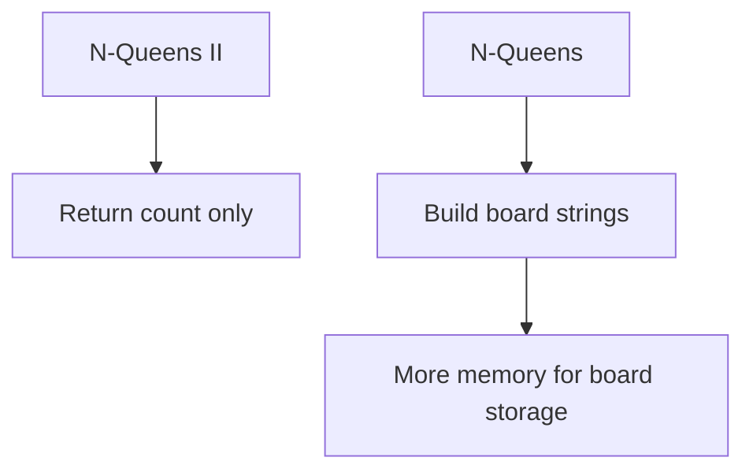
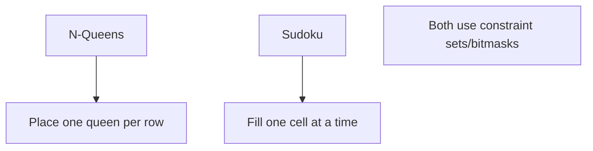
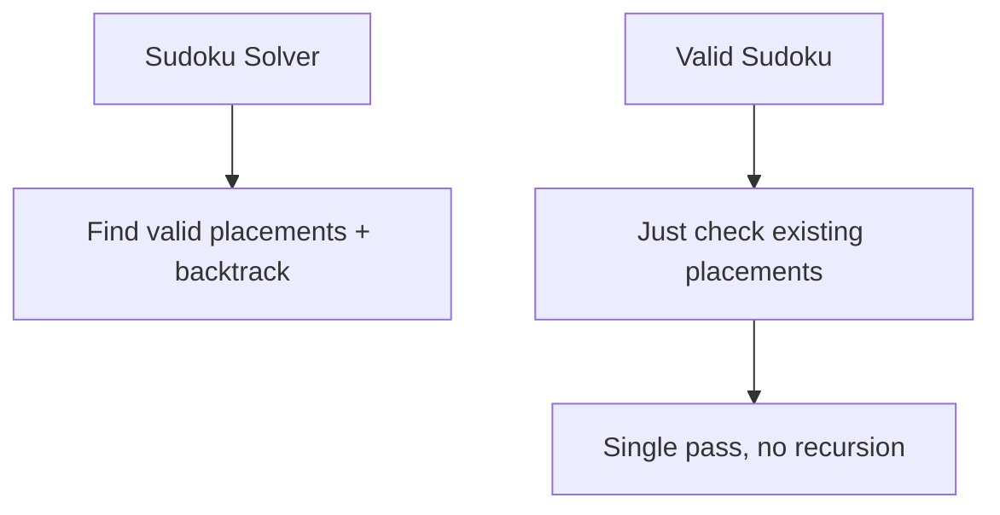

# N-Queens II

> **LeetCode**: [52. N-Queens II](https://leetcode.com/problems/n-queens-ii/)
> **Difficulty**: Hard
> **Pattern**: Backtracking (Count Only)

---

## Problem Statement

The **n-queens** puzzle is the problem of placing `n` queens on an `n x n` chessboard such that no two queens attack each other.

Given an integer `n`, return the **number of distinct solutions** to the n-queens puzzle.

---

## Examples

### Example 1
```
Input: n = 4
Output: 2
Explanation: There are two distinct solutions to the 4-queens puzzle.
```

### Example 2
```
Input: n = 1
Output: 1
```

---

## Constraints

- `1 <= n <= 9`

---

## Key Difference from N-Queens

| Aspect | N-Queens | N-Queens II |
|--------|----------|-------------|
| Return | All board configurations | Just the count |
| Build board | Yes | No |
| Complexity | Same | Slightly simpler code |

Since we only need to count, we don't need to construct the actual board!

---

## Solutions

### Solution 1: Backtracking with Sets (Recommended)

```python
def totalNQueens(n: int) -> int:
    """
    Count N-Queens solutions using backtracking.

    Simpler than N-Queens since we don't build boards.

    Time Complexity: O(n!)
    Space Complexity: O(n)
    """
    cols = set()
    pos_diag = set()
    neg_diag = set()

    def backtrack(row):
        if row == n:
            return 1  # Found one solution

        count = 0
        for col in range(n):
            if col in cols or (row + col) in pos_diag or (row - col) in neg_diag:
                continue

            # Place queen
            cols.add(col)
            pos_diag.add(row + col)
            neg_diag.add(row - col)

            # Count solutions from this placement
            count += backtrack(row + 1)

            # Remove queen
            cols.remove(col)
            pos_diag.remove(row + col)
            neg_diag.remove(row - col)

        return count

    return backtrack(0)


# Test
print(totalNQueens(4))  # Output: 2
print(totalNQueens(8))  # Output: 92
```

::: info Complexity: Time O(n!) · Space O(n)
- **Time:** At each row, available columns are reduced by constraints. Upper bound is n! placements explored due to column and diagonal restrictions.
- **Space:** Three sets store at most n elements each, plus O(n) recursion depth. No board storage needed since we only count.
:::

### Solution 2: Using Nonlocal Counter

```python
def totalNQueens_nonlocal(n: int) -> int:
    """
    Alternative using nonlocal counter variable.

    Time Complexity: O(n!)
    Space Complexity: O(n)
    """
    count = 0
    cols = set()
    pos_diag = set()
    neg_diag = set()

    def backtrack(row):
        nonlocal count

        if row == n:
            count += 1
            return

        for col in range(n):
            if col in cols or (row + col) in pos_diag or (row - col) in neg_diag:
                continue

            cols.add(col)
            pos_diag.add(row + col)
            neg_diag.add(row - col)

            backtrack(row + 1)

            cols.remove(col)
            pos_diag.remove(row + col)
            neg_diag.remove(row - col)

    backtrack(0)
    return count


# Test
print(totalNQueens_nonlocal(4))  # Output: 2
```

::: info Complexity: Time O(n!) · Space O(n)
- **Time:** Same exploration pattern as Solution 1; nonlocal counter is simply a different way to accumulate the count.
- **Space:** Three sets for constraint tracking, plus recursion depth of n. The nonlocal counter uses O(1) additional space.
:::

### Solution 3: Bitmask (Fastest)

```python
def totalNQueens_bitmask(n: int) -> int:
    """
    Bit manipulation for maximum speed.

    Time Complexity: O(n!)
    Space Complexity: O(n)
    """
    def backtrack(row, cols, pos_diag, neg_diag):
        if row == n:
            return 1

        count = 0
        # Available positions: bits that are 0 in all three masks
        available = ((1 << n) - 1) & ~(cols | pos_diag | neg_diag)

        while available:
            # Get the rightmost 1 bit
            pos = available & (-available)
            # Remove it from available
            available &= available - 1

            # Recurse with updated masks
            # pos_diag shifts left (up-right), neg_diag shifts right (up-left)
            count += backtrack(
                row + 1,
                cols | pos,
                (pos_diag | pos) << 1,
                (neg_diag | pos) >> 1
            )

        return count

    return backtrack(0, 0, 0, 0)


# Test
print(totalNQueens_bitmask(4))   # Output: 2
print(totalNQueens_bitmask(8))   # Output: 92
print(totalNQueens_bitmask(9))   # Output: 352
```

::: info Complexity: Time O(n!) · Space O(n)
- **Time:** Bitmask operations (AND, OR, shift) are O(1), making conflict detection faster than set lookups in practice.
- **Space:** Three integers (bitmasks) replace the sets, using O(1) extra space. Recursion depth remains O(n).
:::

### Solution 4: Memoization Attempt (Interesting but not effective)

```python
def totalNQueens_memo(n: int) -> int:
    """
    Attempting memoization - but state space is too large.

    This actually doesn't help much for N-Queens because
    the state (cols, pos_diag, neg_diag) rarely repeats.

    Included to show why N-Queens isn't easily memoized.
    """
    memo = {}

    def backtrack(row, cols, pos_diag, neg_diag):
        if row == n:
            return 1

        state = (row, cols, pos_diag, neg_diag)
        if state in memo:
            return memo[state]

        count = 0
        for col in range(n):
            col_bit = 1 << col
            if cols & col_bit or pos_diag & col_bit or neg_diag & col_bit:
                continue

            count += backtrack(
                row + 1,
                cols | col_bit,
                (pos_diag | col_bit) << 1,
                (neg_diag | col_bit) >> 1
            )

        memo[state] = count
        return count

    return backtrack(0, 0, 0, 0)


# Test
print(totalNQueens_memo(4))  # Output: 2
```

::: info Complexity: Time O(n!) · Space O(n!)
- **Time:** Same O(n!) exploration; memoization rarely helps because the state (row, cols, diagonals) rarely repeats across different search paths.
- **Space:** The memo dictionary can grow large but states rarely repeat, so it mostly adds overhead rather than benefit.
:::

### Solution 5: Precomputed Lookup (For Competitive Programming)

```python
def totalNQueens_lookup(n: int) -> int:
    """
    Precomputed values for instant O(1) lookup.

    Useful when you need to answer many queries quickly.
    """
    solutions = {
        1: 1,
        2: 0,
        3: 0,
        4: 2,
        5: 10,
        6: 4,
        7: 40,
        8: 92,
        9: 352,
        10: 724,
        11: 2680,
        12: 14200,
        13: 73712,
        14: 365596,
        15: 2279184,
    }
    return solutions.get(n, 0)


# Test
print(totalNQueens_lookup(8))  # Output: 92
```

::: info Complexity: Time O(1) · Space O(1)
- **Time:** Direct dictionary lookup using precomputed values; no computation at runtime.
- **Space:** The dictionary is constant size (known values up to n=15 or so), stored statically.
:::

---

## Complexity Analysis

| Approach | Time | Space | Notes |
|----------|------|-------|-------|
| Sets | O(n!) | O(n) | Clear and readable |
| Bitmask | O(n!) | O(n) | Fastest in practice |
| Memoization | O(n!) | O(n!) | State rarely repeats |
| Lookup | O(1) | O(1) | For precomputed values |

---

## Bit Manipulation Explained

```python
# Example for n=4

# available = ~(cols | pos_diag | neg_diag) & ((1 << n) - 1)
# If cols=0010, pos_diag=0100, neg_diag=0001
# blocked = 0010 | 0100 | 0001 = 0111
# available = ~0111 & 1111 = 1000 (only column 3 is free)

# Get rightmost bit: pos = available & (-available)
# For available = 1000: pos = 1000 & 0111+1 = 1000

# Remove rightmost bit: available &= available - 1
# For available = 1000: 1000 & 0111 = 0000

# Diagonal shifts for next row:
# pos_diag << 1: attacks move left (from queen's perspective going up)
# neg_diag >> 1: attacks move right
```

---

## Number of Solutions Table

| n | Solutions |
|---|-----------|
| 1 | 1 |
| 2 | 0 |
| 3 | 0 |
| 4 | 2 |
| 5 | 10 |
| 6 | 4 |
| 7 | 40 |
| 8 | 92 |
| 9 | 352 |
| 10 | 724 |

---

## When to Use N-Queens II vs N-Queens

| Scenario | Use |
|----------|-----|
| Need actual board layouts | N-Queens |
| Just need count | N-Queens II |
| Interview asks for "all solutions" | N-Queens |
| Interview asks "how many" | N-Queens II |

---

## Common Mistakes

### 1. Returning Wrong Type
```python
# WRONG - returns list instead of int
def wrong(n):
    results = []
    def backtrack(row):
        if row == n:
            results.append(True)  # Should just count!
    return results  # Returns list, not int

# CORRECT
def correct(n):
    def backtrack(row):
        if row == n:
            return 1  # Return count
        # ...
        return count
```

### 2. Forgetting to Return Count from Recursion
```python
# WRONG - doesn't propagate count
def backtrack(row):
    count = 0
    for col in range(n):
        if valid:
            backtrack(row + 1)  # Missing: count += ...
    return count

# CORRECT
def backtrack(row):
    count = 0
    for col in range(n):
        if valid:
            count += backtrack(row + 1)  # Accumulate!
    return count
```

---

## Related Problems

::: details N-Queens (LeetCode 51)
**Problem:** Return all distinct solutions to the n-queens puzzle as board configurations.

**Key Insight:** Same constraint logic, but builds actual board representations.



**Approach:** Same backtracking with sets/bitmasks, but construct board strings at base case.

**Complexity:** O(n!) time, O(n^2) space for boards

**Link:** [Local Solution](./n-queens.md)
:::

::: details Sudoku Solver (LeetCode 37)
**Problem:** Solve a Sudoku puzzle by filling the empty cells.

**Key Insight:** Same constraint satisfaction pattern - track valid placements and backtrack.



**Approach:** Track row/col/box constraints, try digits 1-9, backtrack on invalid state.

**Complexity:** O(9^empty_cells) worst case

**Link:** [Local Solution](./sudoku-solver.md)
:::

::: details Valid Sudoku (LeetCode 36)
**Problem:** Check if a 9x9 Sudoku board is valid (no duplicate in row/col/3x3 box).

**Key Insight:** Validation only - no backtracking needed, just constraint checking.



**Approach:** Use 9 sets for rows, 9 for columns, 9 for boxes. Single pass to check duplicates.

**Complexity:** O(81) = O(1) time, O(81) = O(1) space

**Link:** [LeetCode 36](https://leetcode.com/problems/valid-sudoku/)
:::

---

## Interview Tips

1. **Mention it's simpler** than N-Queens since no board building
2. **Return count from recursion** - cleaner than using global/nonlocal
3. **Know the bitmask approach** for performance discussions
4. **Memorize a few values**: 4->2, 8->92 to verify your solution
5. **Explain why memoization doesn't help** much here

---

## Key Takeaways

1. **Simpler than N-Queens** - just count, don't build boards
2. **Return count from recursion** for clean code
3. **Bitmask is fastest** but harder to explain
4. **Same O(n!) complexity** as N-Queens
5. **Good interview warmup** before full N-Queens

---

*Last updated: January 2026*
