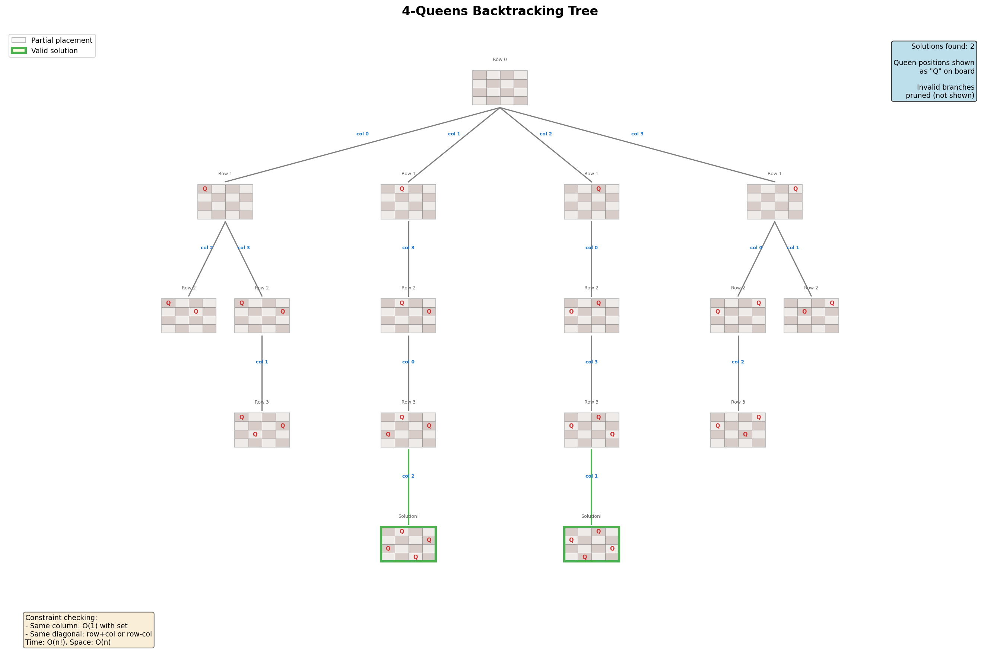
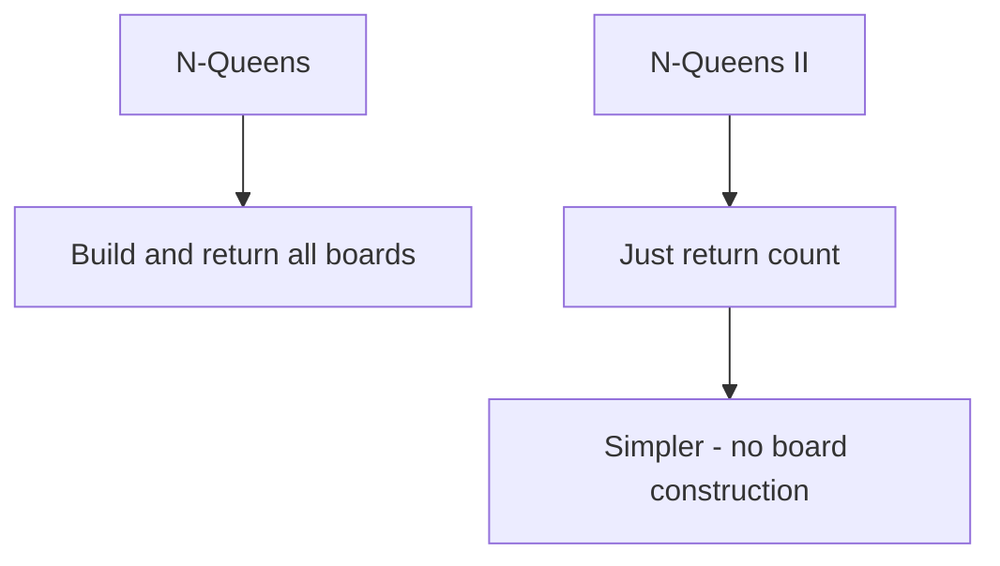
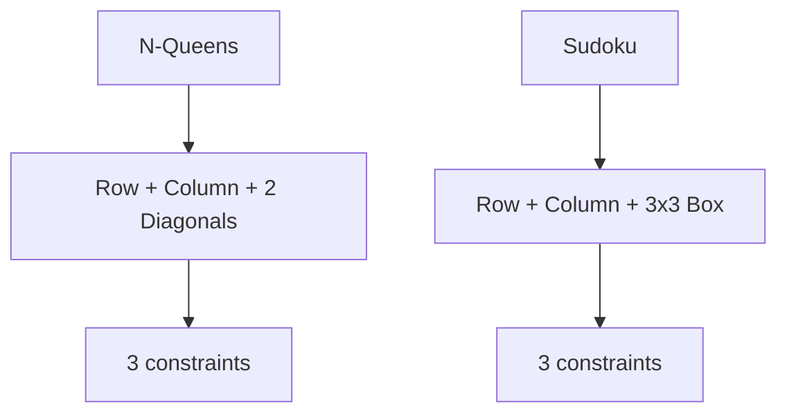
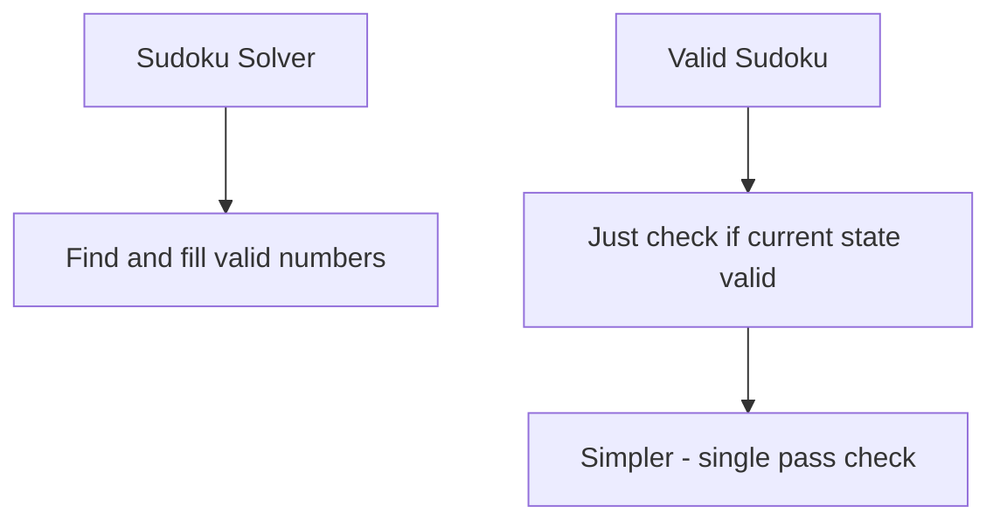

# N-Queens

> **LeetCode**: [51. N-Queens](https://leetcode.com/problems/n-queens/)
> **Difficulty**: Hard
> **Pattern**: Classic Backtracking, Constraint Satisfaction

---

## Problem Statement

The **n-queens** puzzle is the problem of placing `n` queens on an `n x n` chessboard such that no two queens attack each other.

Given an integer `n`, return all distinct solutions to the n-queens puzzle. You may return the answer in **any order**.

Each solution contains a distinct board configuration of the n-queens' placement, where `'Q'` and `'.'` both indicate a queen and an empty space, respectively.

---

## Examples

### Example 1
```text
Input: n = 4
Output: [[".Q..","...Q","Q...","..Q."],["..Q.","Q...","...Q",".Q.."]]
Explanation: There exist two distinct solutions to the 4-queens puzzle.
```

### Example 2
```text
Input: n = 1
Output: [["Q"]]
```

---

## Constraints

- `1 <= n <= 9`

---

## Backtracking Tree Visualization



### Understanding Queen Attacks

A queen can attack along:
1. **Same row** (horizontal)
2. **Same column** (vertical)
3. **Diagonals** (both directions)

```text
X . . X . . X .    Q attacks all cells marked X
. X . X . X . .
. . X X X . . .
X X X Q X X X X    All directions blocked!
. . X X X . . .
. X . X . X . .
X . . X . . X .
. . . X . . . X
```

---

## Key Insight: Diagonal Tracking

For an n x n board:
- **Positive diagonal** (/) : `row + col` is constant
- **Negative diagonal** (\) : `row - col` is constant

```text
Positive diagonals (row + col):
    0   1   2   3
  +---+---+---+---+
0 | 0 | 1 | 2 | 3 |
  +---+---+---+---+
1 | 1 | 2 | 3 | 4 |
  +---+---+---+---+
2 | 2 | 3 | 4 | 5 |
  +---+---+---+---+
3 | 3 | 4 | 5 | 6 |
  +---+---+---+---+

Negative diagonals (row - col):
    0   1   2   3
  +---+---+---+---+
0 | 0 |-1 |-2 |-3 |
  +---+---+---+---+
1 | 1 | 0 |-1 |-2 |
  +---+---+---+---+
2 | 2 | 1 | 0 |-1 |
  +---+---+---+---+
3 | 3 | 2 | 1 | 0 |
  +---+---+---+---+
```

---

## Backtracking Template

```python
def solveNQueens(n):
    """
    N-Queens backtracking template.

    Track:
    - cols: columns with queens
    - pos_diag: positive diagonals (row + col)
    - neg_diag: negative diagonals (row - col)
    """
    result = []
    cols = set()
    pos_diag = set()  # row + col
    neg_diag = set()  # row - col
    board = [['.'] * n for _ in range(n)]

    def backtrack(row):
        if row == n:
            result.append([''.join(r) for r in board])
            return

        for col in range(n):
            # Check if position is safe
            if col in cols or (row + col) in pos_diag or (row - col) in neg_diag:
                continue

            # Place queen
            cols.add(col)
            pos_diag.add(row + col)
            neg_diag.add(row - col)
            board[row][col] = 'Q'

            # Explore next row
            backtrack(row + 1)

            # Remove queen (backtrack)
            cols.remove(col)
            pos_diag.remove(row + col)
            neg_diag.remove(row - col)
            board[row][col] = '.'

    backtrack(0)
    return result
```

---

## Solutions

### Solution

::: code-group
```python [Python]
def solveNQueens(n: int) -> list:
    """
    Solve N-Queens using backtracking with O(1) conflict checking.

    Time Complexity: O(n!) - upper bound
    Space Complexity: O(n) for tracking sets and recursion
    """
    result = []
    cols = set()
    pos_diag = set()
    neg_diag = set()
    board = [['.'] * n for _ in range(n)]

    def backtrack(row):
        if row == n:
            result.append([''.join(r) for r in board])
            return

        for col in range(n):
            if col in cols or (row + col) in pos_diag or (row - col) in neg_diag:
                continue

            # Place queen
            cols.add(col)
            pos_diag.add(row + col)
            neg_diag.add(row - col)
            board[row][col] = 'Q'

            backtrack(row + 1)

            # Remove queen
            cols.remove(col)
            pos_diag.remove(row + col)
            neg_diag.remove(row - col)
            board[row][col] = '.'

    backtrack(0)
    return result


# Test
print(solveNQueens(4))
# Output: [['.Q..', '...Q', 'Q...', '..Q.'], ['..Q.', 'Q...', '...Q', '.Q..']]
```

```java [Java]
public List<List<String>> solveNQueens(int n) {
    List<List<String>> result = new ArrayList<>();
    boolean[] cols = new boolean[n];
    boolean[] posDiag = new boolean[2 * n]; // row + col, range [0, 2n-2]
    boolean[] negDiag = new boolean[2 * n]; // row - col + n, range [1, 2n-1]
    int[] board = new int[n]; // board[row] = col of queen in that row
    Arrays.fill(board, -1);
    backtrack(result, board, cols, posDiag, negDiag, 0, n);
    return result;
}

private void backtrack(List<List<String>> result, int[] board,
                       boolean[] cols, boolean[] posDiag, boolean[] negDiag,
                       int row, int n) {
    if (row == n) {
        List<String> solution = new ArrayList<>();
        for (int r = 0; r < n; r++) {
            char[] rowChars = new char[n];
            Arrays.fill(rowChars, '.');
            rowChars[board[r]] = 'Q';
            solution.add(new String(rowChars));
        }
        result.add(solution);
        return;
    }
    for (int col = 0; col < n; col++) {
        int pd = row + col;
        int nd = row - col + n; // offset to keep index non-negative
        if (cols[col] || posDiag[pd] || negDiag[nd]) continue;
        // Place queen
        cols[col] = true;
        posDiag[pd] = true;
        negDiag[nd] = true;
        board[row] = col;
        backtrack(result, board, cols, posDiag, negDiag, row + 1, n);
        // Remove queen
        cols[col] = false;
        posDiag[pd] = false;
        negDiag[nd] = false;
        board[row] = -1;
    }
}
```
:::

::: info Complexity: Time O(n!) · Space O(n)
- **Time:** At row 0, we have n choices; row 1 has at most n-1 (column blocked), and diagonal constraints further reduce choices. Upper bound is n! due to these constraints.
- **Space:** Three sets (cols, pos_diag, neg_diag) each hold at most n elements, plus O(n) recursion depth and O(n^2) for the board.
:::

### Solution 2: Using Column Array

```python
def solveNQueens_array(n: int) -> list:
    """
    Alternative: Store queen positions in an array.
    queens[row] = col means queen at (row, col).

    Time Complexity: O(n!)
    Space Complexity: O(n)
    """
    result = []
    queens = [-1] * n  # queens[row] = column of queen in that row

    def is_safe(row, col):
        for prev_row in range(row):
            prev_col = queens[prev_row]
            # Check column
            if prev_col == col:
                return False
            # Check diagonals
            if abs(prev_row - row) == abs(prev_col - col):
                return False
        return True

    def backtrack(row):
        if row == n:
            # Build board representation
            board = []
            for r in range(n):
                row_str = '.' * queens[r] + 'Q' + '.' * (n - 1 - queens[r])
                board.append(row_str)
            result.append(board)
            return

        for col in range(n):
            if is_safe(row, col):
                queens[row] = col
                backtrack(row + 1)
                queens[row] = -1  # Optional: will be overwritten anyway

    backtrack(0)
    return result


# Test
print(solveNQueens_array(4))
```

::: info Complexity: Time O(n! * n) · Space O(n)
- **Time:** Same O(n!) exploration, but is_safe() checks all previously placed queens (O(n) per call), adding a factor of n.
- **Space:** The queens array stores n positions; recursion depth is n; no additional set storage needed.
:::

### Solution 3: Bitmask Optimization

```python
def solveNQueens_bitmask(n: int) -> list:
    """
    Use bit manipulation for O(1) conflict checking.

    Bits represent which columns/diagonals are attacked.

    Time Complexity: O(n!)
    Space Complexity: O(n)
    """
    result = []
    queens = []

    def backtrack(row, cols, pos_diag, neg_diag):
        if row == n:
            board = []
            for col in queens:
                board.append('.' * col + 'Q' + '.' * (n - 1 - col))
            result.append(board)
            return

        # Available positions: not attacked by any queen
        available = ((1 << n) - 1) & ~(cols | pos_diag | neg_diag)

        while available:
            # Get rightmost available position
            pos = available & (-available)
            available &= available - 1  # Remove this position

            col = bin(pos - 1).count('1')  # Convert bit to column index
            queens.append(col)

            # Shift diagonals for next row
            backtrack(
                row + 1,
                cols | pos,
                (pos_diag | pos) << 1,
                (neg_diag | pos) >> 1
            )

            queens.pop()

    backtrack(0, 0, 0, 0)
    return result


# Test
print(solveNQueens_bitmask(4))
```

::: info Complexity: Time O(n!) · Space O(n)
- **Time:** Bitmask operations are O(1), making conflict checking constant time. Exploration pattern remains O(n!).
- **Space:** Three integers (bitmasks) replace the sets; queens list stores column positions; recursion depth is n.
:::

### Solution 4: Iterative with Stack

```python
def solveNQueens_iterative(n: int) -> list:
    """
    Iterative approach using explicit stack.

    Time Complexity: O(n!)
    Space Complexity: O(n)
    """
    result = []
    queens = []

    def is_safe(row, col):
        for r, c in enumerate(queens):
            if c == col or abs(r - row) == abs(c - col):
                return False
        return True

    def build_board():
        return ['.' * c + 'Q' + '.' * (n - 1 - c) for c in queens]

    # Stack: (row, start_col)
    stack = [(0, 0)]

    while stack:
        row, start_col = stack.pop()

        # Backtrack if necessary
        while len(queens) > row:
            queens.pop()

        # Try columns from start_col
        found = False
        for col in range(start_col, n):
            if is_safe(row, col):
                queens.append(col)

                if row == n - 1:
                    result.append(build_board())
                    queens.pop()
                else:
                    # Continue with next row, but save current position
                    stack.append((row, col + 1))
                    stack.append((row + 1, 0))
                    found = True
                    break

        if not found and queens:
            # Backtrack: try next column in previous row
            pass  # Stack will handle this

    return result


# Test
print(solveNQueens_iterative(4))
```

::: info Complexity: Time O(n! * n) · Space O(n)
- **Time:** Iterative approach with explicit stack explores the same O(n!) search space; is_safe check is O(n) per placement.
- **Space:** Stack stores (row, start_col) pairs; queens list stores at most n positions; board construction is O(n^2) per solution.
:::

---

## Complexity Analysis

| Approach | Time | Space | Notes |
|----------|------|-------|-------|
| Sets | O(n!) | O(n) | O(1) conflict check |
| Array | O(n! * n) | O(n) | O(n) conflict check per placement |
| Bitmask | O(n!) | O(n) | Fastest in practice |

### Why O(n!)?

- Row 0: n choices
- Row 1: at most n-1 choices (one column blocked)
- Row 2: at most n-2 choices
- ...
- Upper bound: n * (n-1) * (n-2) * ... * 1 = n!

In practice, diagonal constraints reduce this significantly.

---

## Number of Solutions

| n | Solutions |
|---|-----------|
| 1 | 1 |
| 2 | 0 |
| 3 | 0 |
| 4 | 2 |
| 5 | 10 |
| 6 | 4 |
| 7 | 40 |
| 8 | 92 |
| 9 | 352 |

---

## Common Mistakes

### 1. Forgetting Diagonal Attacks
```python
# WRONG - only checks column
if col in cols:
    continue

# CORRECT - check column AND both diagonals
if col in cols or (row + col) in pos_diag or (row - col) in neg_diag:
    continue
```

### 2. Wrong Diagonal Formula
```python
# WRONG - using same formula for both diagonals
pos_diag.add(row + col)
neg_diag.add(row + col)  # Should be row - col!

# CORRECT
pos_diag.add(row + col)   # / diagonal
neg_diag.add(row - col)   # \ diagonal
```

### 3. Not Restoring State
```python
# WRONG - forgets to remove from sets
board[row][col] = 'Q'
cols.add(col)
backtrack(row + 1)
board[row][col] = '.'
# Missing: cols.remove(col), etc.

# CORRECT - restore all state
board[row][col] = 'Q'
cols.add(col)
pos_diag.add(row + col)
neg_diag.add(row - col)
backtrack(row + 1)
board[row][col] = '.'
cols.remove(col)
pos_diag.remove(row + col)
neg_diag.remove(row - col)
```

---

## Related Problems

::: details N-Queens II (LeetCode 52)
**Problem:** Return the count of distinct solutions to the n-queens puzzle.

**Key Insight:** Same algorithm, but just count instead of building boards.



**Approach:** Same backtracking, return count from recursion instead of building board strings.

**Complexity:** O(n!) time, O(n) space

**Link:** [Local Solution](./n-queens-ii.md)
:::

::: details Sudoku Solver (LeetCode 37)
**Problem:** Solve a Sudoku puzzle by filling empty cells.

**Key Insight:** Similar constraint satisfaction - row, column, and box constraints.



**Approach:** Track row/col/box constraints with sets or bitmasks, backtrack on invalid placement.

**Complexity:** O(9^empty_cells) worst case

**Link:** [Local Solution](./sudoku-solver.md)
:::

::: details Valid Sudoku (LeetCode 36)
**Problem:** Determine if a 9x9 Sudoku board is valid (no repetitions in row/col/box).

**Key Insight:** Just validation, no solving needed. Same constraint tracking pattern.



**Approach:** Use sets for each row, column, and 3x3 box. Check for duplicates in single pass.

**Complexity:** O(1) time (fixed 9x9 board), O(1) space

**Link:** [LeetCode 36](https://leetcode.com/problems/valid-sudoku/)
:::

---

## Interview Tips

1. **Explain the constraint tracking**: columns, positive diagonals, negative diagonals
2. **Show diagonal math**: `row + col` and `row - col` constants
3. **Mention O(1) conflict checking** with sets
4. **Draw small example**: 4-queens is a good size
5. **Know the count variant**: N-Queens II is simpler (just return count)

---

## Key Takeaways

1. **Classic backtracking problem** - place row by row
2. **Three constraints to track**: column, positive diagonal, negative diagonal
3. **Diagonal formulas**: `row + col` (/) and `row - col` (\)
4. **Sets enable O(1) conflict checking**
5. **Bitmask is fastest** but harder to understand
6. **O(n!) upper bound** but diagonals help prune

---

*Last updated: January 2026*
