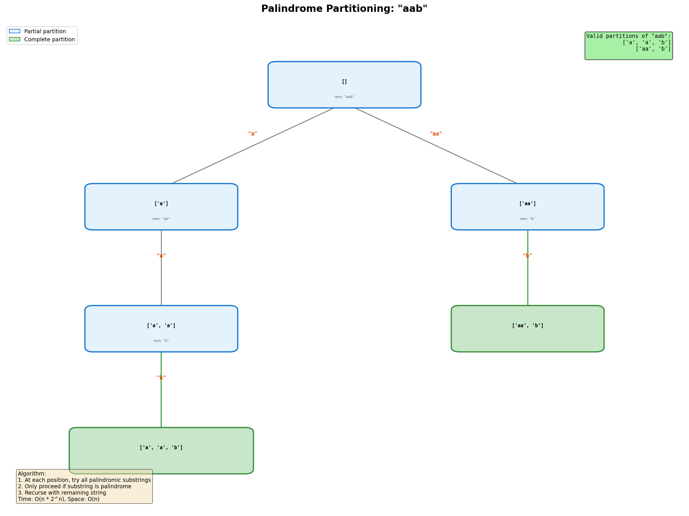
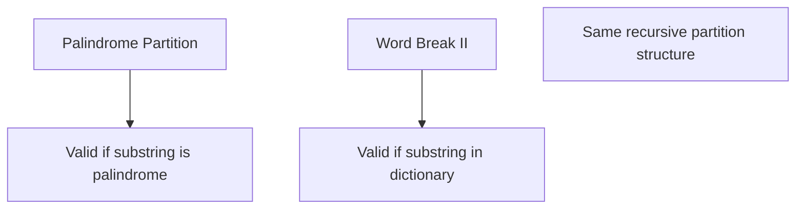

# Palindrome Partitioning

> **LeetCode**: [131. Palindrome Partitioning](https://leetcode.com/problems/palindrome-partitioning/)
> **Difficulty**: Medium
> **Pattern**: Backtracking

---

## Problem Statement

Given a string `s`, partition `s` such that every substring of the partition is a **palindrome**. Return all possible palindrome partitionings of `s`.

---

## Examples

### Example 1
```text
Input: s = "aab"
Output: [["a", "a", "b"], ["aa", "b"]]
```

### Example 2
```text
Input: s = "a"
Output: [["a"]]
```

### Example 3
```text
Input: s = "aabb"
Output: [["a", "a", "b", "b"], ["a", "a", "bb"], ["aa", "b", "b"], ["aa", "bb"]]
```

---

## Constraints

- `1 <= s.length <= 16`
- `s` contains only lowercase English letters

---

## Backtracking Tree Visualization



### Decision Tree for "aab"

At each position, try all possible palindromic substrings starting there:

```text
                    "" (remaining: "aab")
                   /       \
            ["a"]          ["aa"]
       (rem: "ab")        (rem: "b")
         /    \              |
   ["a","a"]  X           ["aa","b"]
   (rem:"b")  ("ab" not    (complete!)
      |        palindrome)
  ["a","a","b"]
   (complete!)

Result: [["a","a","b"], ["aa","b"]]
```

---

## Backtracking Template

```python
def partition(s):
    """
    Palindrome partitioning template.

    At each position, try all palindromic substrings starting there.
    Only proceed if the substring is a palindrome.
    """
    result = []

    def is_palindrome(sub):
        return sub == sub[::-1]

    def backtrack(start, path):
        # BASE CASE: reached end of string
        if start == len(s):
            result.append(path[:])
            return

        # Try all possible substrings from start
        for end in range(start + 1, len(s) + 1):
            substring = s[start:end]

            # Only proceed if substring is palindrome
            if is_palindrome(substring):
                path.append(substring)
                backtrack(end, path)
                path.pop()

    backtrack(0, [])
    return result
```

---

## Solutions

### Solution 1: Basic Backtracking

```python
def partition(s: str) -> list:
    """
    Find all palindrome partitions using backtracking.

    Time Complexity: O(n * 2^n)
        - 2^n possible partitions
        - O(n) to check each palindrome
    Space Complexity: O(n) for recursion depth
    """
    result = []

    def is_palindrome(sub):
        return sub == sub[::-1]

    def backtrack(start, path):
        if start == len(s):
            result.append(path[:])
            return

        for end in range(start + 1, len(s) + 1):
            substring = s[start:end]
            if is_palindrome(substring):
                path.append(substring)
                backtrack(end, path)
                path.pop()

    backtrack(0, [])
    return result


# Test
print(partition("aab"))
# Output: [['a', 'a', 'b'], ['aa', 'b']]
```

::: info Complexity: Time O(n * 2^n) · Space O(n)
- **Time:** There are 2^(n-1) ways to partition (n-1 cut positions), and each palindrome check takes O(n) time, giving O(n * 2^n).
- **Space:** Recursion depth is at most n (one substring per level), plus the current path stores at most n substrings.
:::

### Solution 2: With DP Palindrome Pre-computation

```python
def partition_dp(s: str) -> list:
    """
    Optimize palindrome checking with DP.

    Pre-compute all palindrome substrings for O(1) lookup.

    Time Complexity: O(n^2 + 2^n)
        - O(n^2) for palindrome DP
        - O(2^n) for backtracking
    Space Complexity: O(n^2) for palindrome DP
    """
    n = len(s)

    # Pre-compute palindromes
    # is_palin[i][j] = True if s[i:j+1] is palindrome
    is_palin = [[False] * n for _ in range(n)]

    # Single characters are palindromes
    for i in range(n):
        is_palin[i][i] = True

    # Check substrings of length 2+
    for length in range(2, n + 1):
        for i in range(n - length + 1):
            j = i + length - 1
            if s[i] == s[j]:
                if length == 2:
                    is_palin[i][j] = True
                else:
                    is_palin[i][j] = is_palin[i + 1][j - 1]

    result = []

    def backtrack(start, path):
        if start == n:
            result.append(path[:])
            return

        for end in range(start, n):
            if is_palin[start][end]:  # O(1) lookup!
                path.append(s[start:end + 1])
                backtrack(end + 1, path)
                path.pop()

    backtrack(0, [])
    return result


# Test
print(partition_dp("aab"))
```

::: info Complexity: Time O(n^2 + 2^n) · Space O(n^2)
- **Time:** O(n^2) to pre-compute all palindrome substrings in the DP table, then O(2^n) backtracking with O(1) palindrome lookups.
- **Space:** The is_palin table is n x n, storing boolean values for all substring pairs (i, j).
:::

### Solution 3: With Memoized Palindrome Check

```python
from functools import lru_cache

def partition_memo(s: str) -> list:
    """
    Memoize palindrome checks without full pre-computation.

    Time Complexity: O(n * 2^n)
    Space Complexity: O(n^2) for memoization
    """
    result = []

    @lru_cache(maxsize=None)
    def is_palindrome(i, j):
        if i >= j:
            return True
        if s[i] != s[j]:
            return False
        return is_palindrome(i + 1, j - 1)

    def backtrack(start, path):
        if start == len(s):
            result.append(path[:])
            return

        for end in range(start, len(s)):
            if is_palindrome(start, end):
                path.append(s[start:end + 1])
                backtrack(end + 1, path)
                path.pop()

    backtrack(0, [])
    return result


# Test
print(partition_memo("aab"))
```

::: info Complexity: Time O(n * 2^n) · Space O(n^2)
- **Time:** Same O(2^n) backtracking; palindrome checks are lazily computed and cached via @lru_cache, avoiding redundant work.
- **Space:** The lru_cache can store up to O(n^2) entries (all possible (i, j) pairs), plus O(n) recursion depth.
:::

### Solution 4: Iterative with Stack

```python
def partition_iterative(s: str) -> list:
    """
    Iterative approach using explicit stack.

    Time Complexity: O(n * 2^n)
    Space Complexity: O(n * 2^n)
    """
    def is_palindrome(sub):
        return sub == sub[::-1]

    result = []
    stack = [(0, [])]  # (start_index, current_partition)

    while stack:
        start, path = stack.pop()

        if start == len(s):
            result.append(path)
            continue

        for end in range(start + 1, len(s) + 1):
            substring = s[start:end]
            if is_palindrome(substring):
                stack.append((end, path + [substring]))

    return result


# Test
print(partition_iterative("aab"))
```

::: info Complexity: Time O(n * 2^n) · Space O(n * 2^n)
- **Time:** Same exploration as recursive approach; iterative stack traverses the same decision space.
- **Space:** The stack can hold multiple partial partitions; in the worst case, many paths are stored simultaneously before completion.
:::

---

## Complexity Analysis

| Approach | Time | Space | Notes |
|----------|------|-------|-------|
| Basic | O(n * 2^n) | O(n) | Recomputes palindromes |
| DP Pre-compute | O(n^2 + 2^n) | O(n^2) | O(1) palindrome lookup |
| Memoized | O(n * 2^n) | O(n^2) | Lazy palindrome computation |

### Why O(2^n)?

For a string of length n, there are n-1 positions where we can cut or not cut.
- Cut at position i: creates a new partition boundary
- Don't cut: extends current substring

This gives 2^(n-1) possible ways to partition.

---

## DP Palindrome Table Visualization

```text
For s = "aab":

      0   1   2
    +---+---+---+
  0 | T | T | F |   is_palin[0][1] = s[0]==s[1] = "aa" is palindrome
    +---+---+---+
  1 |   | T | F |   is_palin[1][2] = "ab" is NOT palindrome
    +---+---+---+
  2 |   |   | T |   is_palin[2][2] = "b" is palindrome (single char)
    +---+---+---+

Diagonal: All True (single characters)
is_palin[i][j] = s[i]==s[j] AND is_palin[i+1][j-1]
```

---

## Common Mistakes

### 1. Wrong Index in Range
```python
# WRONG - excludes last character
for end in range(start, len(s)):  # Should be len(s) + 1 for slicing
    substring = s[start:end]  # s[start:len(s)-1] misses last char

# CORRECT - slice goes up to (but not including) end
for end in range(start + 1, len(s) + 1):
    substring = s[start:end]  # s[start:len(s)] includes all
```

### 2. Off-by-One in DP Lookup
```python
# WRONG - using wrong indices
if is_palin[start][end]:  # end is exclusive in slice but inclusive in DP!
    path.append(s[start:end + 1])

# CORRECT - match indices properly
for end in range(start, n):
    if is_palin[start][end]:  # end is INCLUSIVE here
        path.append(s[start:end + 1])  # slice needs end + 1
```

### 3. Modifying Path Without Copy
```python
# WRONG - all results point to same list
result.append(path)

# CORRECT - append a copy
result.append(path[:])
```

---

## Related Problems

::: details Palindrome Partitioning II (LeetCode 132)
**Problem:** Return the minimum cuts needed to partition string into palindromes.

**Key Insight:** Optimization (min cuts) vs enumeration (all partitions) - use DP instead of backtracking.

```mermaid
graph TD
    A[Palindrome Partitioning] --> B[Find ALL palindrome partitions]
    C[Palindrome Partitioning II] --> D[Find MIN cuts count]
    D --> E[DP: dp[i] = min cuts for s[0:i]]
```

**Approach:** DP with dp[i] = min cuts to partition s[0:i]. Use is_palindrome DP table for O(1) checks.

**Complexity:** O(n^2) time, O(n^2) space

**Link:** [LeetCode 132](https://leetcode.com/problems/palindrome-partitioning-ii/)
:::

::: details Longest Palindromic Substring (LeetCode 5)
**Problem:** Return the longest palindromic substring in s.

**Key Insight:** Same DP table construction for palindrome checking.

```mermaid
graph TD
    A[Palindrome Table] --> B[is_palin[i][j] = s[i:j+1] is palindrome]
    B --> C[Used in Partitioning]
    B --> D[Used in Longest Substring]
```

**Approach:** Expand around center OR DP table. Track longest while building table.

**Complexity:** O(n^2) time, O(1) space (expand) or O(n^2) (DP)

**Link:** [LeetCode 5](https://leetcode.com/problems/longest-palindromic-substring/)
:::

::: details Subsets (LeetCode 78)
**Problem:** Return all possible subsets of distinct integers.

**Key Insight:** Same backtracking structure - at each position, make choices and recurse.

```mermaid
graph TD
    A[Subsets] --> B[Include/exclude each element]
    C[Palindrome Partition] --> D[Try each cut position]
    E[Both: backtrack(start, path)]
```

**Approach:** Similar template - add to result, iterate choices, recurse, backtrack.

**Complexity:** O(n * 2^n) time

**Link:** [Local Solution](./subsets.md)
:::

::: details Word Break II (LeetCode 140)
**Problem:** Return all sentences where string can be segmented into dictionary words.

**Key Insight:** Same partition structure - instead of palindrome check, check if prefix in dictionary.



**Approach:** At each position, try all valid word prefixes, recurse on suffix.

**Complexity:** O(2^n * n) worst case

**Link:** [LeetCode 140](https://leetcode.com/problems/word-break-ii/)
:::

---

## Interview Tips

1. **Start with brute force**: Show basic backtracking first
2. **Identify repeated work**: Palindrome checks are O(n) each
3. **Optimize with DP**: Pre-compute palindrome table for O(1) lookup
4. **Discuss tradeoffs**: O(n^2) extra space vs repeated computation
5. **Walk through example**: Use "aab" to demonstrate branching

---

## Key Takeaways

1. **Partition problem = backtracking at cut points**
2. **Only proceed if substring is palindrome** - this prunes the tree
3. **DP pre-computation** reduces palindrome check from O(n) to O(1)
4. **2^n possible partitions** in worst case
5. **Common pattern**: Similar to word break and subset problems

---

*Last updated: January 2026*
