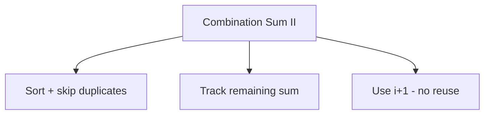

# Permutations II

> **LeetCode**: [47. Permutations II](https://leetcode.com/problems/permutations-ii/)
> **Difficulty**: Medium
> **Pattern**: Backtracking with Duplicate Handling

---

## Problem Statement

Given a collection of numbers, `nums`, that might contain **duplicates**, return all possible **unique permutations** in any order.

---

## Examples

### Example 1
```text
Input: nums = [1, 1, 2]
Output: [[1, 1, 2], [1, 2, 1], [2, 1, 1]]
```

### Example 2
```text
Input: nums = [1, 2, 3]
Output: [[1, 2, 3], [1, 3, 2], [2, 1, 3], [2, 3, 1], [3, 1, 2], [3, 2, 1]]
```

---

## Constraints

- `1 <= nums.length <= 8`
- `-10 <= nums[i] <= 10`

---

## Key Insight: Handling Duplicates

The challenge is avoiding duplicate permutations when input has duplicate values.

**Strategy:**
1. **Sort the array** to group duplicates
2. **Skip a duplicate if its previous duplicate hasn't been used**

### Why This Works

```text
nums = [1, 1', 2] (1 and 1' are duplicates)

WITHOUT skip condition:
- [1, 1', 2] and [1', 1, 2] would both be generated (same result!)

WITH skip condition "skip if prev duplicate unused":
- When at position 0, we use 1 first
- When trying 1' at position 0, we see 1 wasn't used at position 0
  (because we already backtracked), so we SKIP 1'
- This ensures 1 always comes before 1' in any permutation
```

---

## Backtracking Template with Duplicates

```python
def permuteUnique(nums):
    """
    Template for permutations with duplicate handling.

    Key rule: A duplicate can only be used if its previous
    duplicate was ALREADY used in the current permutation.
    """
    result = []
    nums.sort()  # Group duplicates together
    used = [False] * len(nums)

    def backtrack(path):
        if len(path) == len(nums):
            result.append(path[:])
            return

        for i in range(len(nums)):
            # Skip if already used
            if used[i]:
                continue

            # CRITICAL: Skip duplicate if prev duplicate not used
            if i > 0 and nums[i] == nums[i-1] and not used[i-1]:
                continue

            used[i] = True
            path.append(nums[i])
            backtrack(path)
            path.pop()
            used[i] = False

    backtrack([])
    return result
```

---

## Solutions

### Solution

::: code-group
```python [Python]
def permuteUnique(nums: list) -> list:
    """
    Generate unique permutations using backtracking.

    Time Complexity: O(n * n!)
    Space Complexity: O(n)

    Key: Sort + skip if prev duplicate is unused
    """
    result = []
    nums.sort()
    used = [False] * len(nums)

    def backtrack(path):
        if len(path) == len(nums):
            result.append(path[:])
            return

        for i in range(len(nums)):
            # Skip if current element is used
            if used[i]:
                continue

            # Skip duplicate: only proceed if prev duplicate is used
            # This ensures we only generate one ordering of duplicates
            if i > 0 and nums[i] == nums[i-1] and not used[i-1]:
                continue

            used[i] = True
            path.append(nums[i])
            backtrack(path)
            path.pop()
            used[i] = False

    backtrack([])
    return result


# Test
print(permuteUnique([1, 1, 2]))
# Output: [[1, 1, 2], [1, 2, 1], [2, 1, 1]]
```

```java [Java]
public List<List<Integer>> permuteUnique(int[] nums) {
    List<List<Integer>> result = new ArrayList<>();
    Arrays.sort(nums);
    boolean[] used = new boolean[nums.length];
    backtrack(result, new ArrayList<>(), nums, used);
    return result;
}

private void backtrack(List<List<Integer>> result,
                       List<Integer> path,
                       int[] nums,
                       boolean[] used) {
    if (path.size() == nums.length) {
        result.add(new ArrayList<>(path)); // deep copy
        return;
    }
    for (int i = 0; i < nums.length; i++) {
        if (used[i]) continue;
        // Skip duplicate: only use nums[i] if its predecessor was used
        if (i > 0 && nums[i] == nums[i - 1] && !used[i - 1]) continue;
        used[i] = true;
        path.add(nums[i]);
        backtrack(result, path, nums, used);
        path.remove(path.size() - 1);
        used[i] = false;
    }
}
```
:::

::: info Complexity: Time O(n * n!) · Space O(n)
- **Time:** In the worst case (all unique elements), we generate n! permutations, each requiring O(n) to copy. Duplicate skipping reduces actual work.
- **Space:** The used array is O(n), plus recursion depth of n, plus path storage.
:::

### Solution 2: Using Counter (No Explicit Used Array)

```python
from collections import Counter

def permuteUnique_counter(nums: list) -> list:
    """
    Use Counter to naturally handle duplicates.

    Intuition: Track counts instead of used flags.
    Decrement count when using, increment when backtracking.

    Time Complexity: O(n * n!)
    Space Complexity: O(n)
    """
    result = []
    counter = Counter(nums)

    def backtrack(path):
        if len(path) == len(nums):
            result.append(path[:])
            return

        for num in counter:
            if counter[num] > 0:
                # Use this number
                path.append(num)
                counter[num] -= 1

                backtrack(path)

                # Restore
                path.pop()
                counter[num] += 1

    backtrack([])
    return result


# Test
print(permuteUnique_counter([1, 1, 2]))
# Output: [[1, 1, 2], [1, 2, 1], [2, 1, 1]]
```

::: info Complexity: Time O(n * n!) · Space O(n)
- **Time:** Iterates through unique keys in the counter; generates up to n! permutations with O(n) copy time each.
- **Space:** Counter stores at most n entries, plus O(n) recursion depth and path storage.
:::

### Solution 3: Swap Method with Deduplication

```python
def permuteUnique_swap(nums: list) -> list:
    """
    Swap-based approach with set to track used values at each level.

    Time Complexity: O(n * n!)
    Space Complexity: O(n)
    """
    result = []

    def backtrack(start):
        if start == len(nums):
            result.append(nums[:])
            return

        seen = set()  # Track values we've tried at this position
        for i in range(start, len(nums)):
            if nums[i] in seen:
                continue  # Skip duplicate values at this position
            seen.add(nums[i])

            nums[start], nums[i] = nums[i], nums[start]
            backtrack(start + 1)
            nums[start], nums[i] = nums[i], nums[start]

    backtrack(0)
    return result


# Test
print(permuteUnique_swap([1, 1, 2]))
# Output: [[1, 1, 2], [1, 2, 1], [2, 1, 1]]
```

::: info Complexity: Time O(n * n!) · Space O(n)
- **Time:** Generates permutations via swapping; the seen set at each level prevents duplicate values from being placed at the same position.
- **Space:** The seen set at each recursion level stores at most n values, plus O(n) recursion depth.
:::

### Solution 4: Using itertools with Set

```python
from itertools import permutations

def permuteUnique_builtin(nums: list) -> list:
    """
    Use itertools and set for deduplication.

    Time Complexity: O(n * n!)
    Space Complexity: O(n!)
    """
    return [list(p) for p in set(permutations(nums))]


# Test
print(permuteUnique_builtin([1, 1, 2]))
```

::: info Complexity: Time O(n * n!) · Space O(n!)
- **Time:** itertools.permutations generates all n! permutations (including duplicates), then set deduplication removes redundant ones.
- **Space:** The set stores all unique permutation tuples, which can be up to n! entries in the worst case.
:::

---

## Visual: Understanding the Skip Condition

```text
nums = [1, 1, 2] (sorted)
used = [F, F, F]

backtrack([]):
    i=0 (val=1): used[0]=T, path=[1]
        i=1 (val=1): used[1]=T, path=[1,1]
            i=2 (val=2): used[2]=T, path=[1,1,2] -> ADD
        i=2 (val=2): used[2]=T, path=[1,2]
            i=1 (val=1): used[1]=T, path=[1,2,1] -> ADD

    i=1 (val=1): nums[1]==nums[0] and NOT used[0]? YES -> SKIP!

    i=2 (val=2): used[2]=T, path=[2]
        i=0 (val=1): used[0]=T, path=[2,1]
            i=1 (val=1): used[1]=T, path=[2,1,1] -> ADD
        i=1 (val=1): nums[1]==nums[0] and NOT used[0]? YES -> SKIP!

Result: [[1,1,2], [1,2,1], [2,1,1]]
```

---

## Complexity Analysis

| Approach | Time | Space | Notes |
|----------|------|-------|-------|
| Used Array | O(n * n!) | O(n) | Most common |
| Counter | O(n * n!) | O(n) | Elegant alternative |
| Swap + Set | O(n * n!) | O(n) | Memory efficient |
| itertools + Set | O(n * n!) | O(n!) | Less efficient |

---

## Alternative Skip Conditions

Both of these are valid:

```python
# Version 1: Skip if prev duplicate NOT used (RECOMMENDED)
if i > 0 and nums[i] == nums[i-1] and not used[i-1]:
    continue

# Version 2: Skip if prev duplicate IS used
if i > 0 and nums[i] == nums[i-1] and used[i-1]:
    continue
```

Both work but produce results in different orders. Version 1 is more common.

### Why Both Work

```text
For [1, 1', 2]:

Version 1 (skip if prev NOT used):
- Forces 1 to always come BEFORE 1' in the used order
- Generates: [1,1',2], [1,2,1'], [2,1,1']

Version 2 (skip if prev IS used):
- Forces 1 to always come AFTER 1' in the used order
- Generates: [1',1,2], [1',2,1], [2,1',1]

Both have 3 unique permutations, just in different orders!
```

---

## Common Mistakes

### 1. Forgetting to Sort
```python
# WRONG - skip condition won't work without sort
def wrong(nums):
    used = [False] * len(nums)
    def backtrack(path):
        for i in range(len(nums)):
            if i > 0 and nums[i] == nums[i-1] and not used[i-1]:
                continue  # Won't catch all duplicates!

# CORRECT
def correct(nums):
    nums.sort()  # MUST sort first!
    # ... rest of code
```

### 2. Confusing with Subsets Duplicate Handling
```python
# SUBSETS: skip if i > start (same level in tree)
if i > start and nums[i] == nums[i-1]:
    continue

# PERMUTATIONS: skip if prev duplicate not used
if i > 0 and nums[i] == nums[i-1] and not used[i-1]:
    continue
```

---

## Comparison: Permutations vs Permutations II

| Aspect | Permutations | Permutations II |
|--------|--------------|-----------------|
| Input | Unique elements | May have duplicates |
| Pre-processing | None | Sort array |
| Skip condition | None | `i > 0 and nums[i] == nums[i-1] and not used[i-1]` |
| Output size | Always n! | <= n! |

---

## Related Problems

::: details Permutations (LeetCode 46)
**Problem:** Given an array of distinct integers, return all possible permutations.

**Key Insight:** No duplicate handling needed - simpler base case.

```mermaid
graph TD
    A[Permutations] --> B[No sorting needed]
    A --> C[No skip condition]
    D[Permutations II] --> E[Sort first]
    D --> F[Skip if nums[i] == nums[i-1] AND !used[i-1]]
```

**Approach:** Track used[] array without any duplicate skipping logic.

**Complexity:** O(n * n!) time, O(n) space

**Link:** [Local Solution](./permutations.md)
:::

::: details Subsets II (LeetCode 90)
**Problem:** Given an integer array that may contain duplicates, return all unique subsets.

**Key Insight:** Uses same duplicate handling concept but for combinations, not permutations.

```mermaid
graph TD
    A[Key Difference] --> B[Subsets II: i > start AND nums[i] == nums[i-1]]
    A --> C[Permutations II: !used[i-1] AND nums[i] == nums[i-1]]
```

**Approach:** Sort + skip duplicates at same recursion LEVEL (i > start check).

**Complexity:** O(n * 2^n) time, O(n) space

**Link:** [Local Solution](./subsets-ii.md)
:::

::: details Combination Sum II (LeetCode 40)
**Problem:** Find unique combinations that sum to target, each element used once, input may have duplicates.

**Key Insight:** Combines duplicate handling with target sum constraint.



**Approach:** Same skip pattern as Subsets II plus sum pruning.

**Complexity:** O(2^n) time, O(n) space

**Link:** [Local Solution](./combination-sum-ii.md)
:::

---

## Interview Tips

1. **Always ask** if there can be duplicates in input
2. **State the approach**: Sort + skip if prev duplicate unused
3. **Explain why it works**: Ensures only one ordering of duplicates
4. **Mention Counter alternative** if they want cleaner code
5. **Know both skip conditions** and be able to explain why both work

---

## Key Takeaways

1. **Sort + skip condition** is the standard pattern for handling duplicates
2. **Skip if prev duplicate NOT used** ensures consistent ordering of duplicates
3. **Counter approach** is elegant and naturally handles duplicates
4. **Swap method with seen set** is most memory efficient
5. **This pattern is fundamental** - appears in many backtracking problems

---

*Last updated: January 2026*
