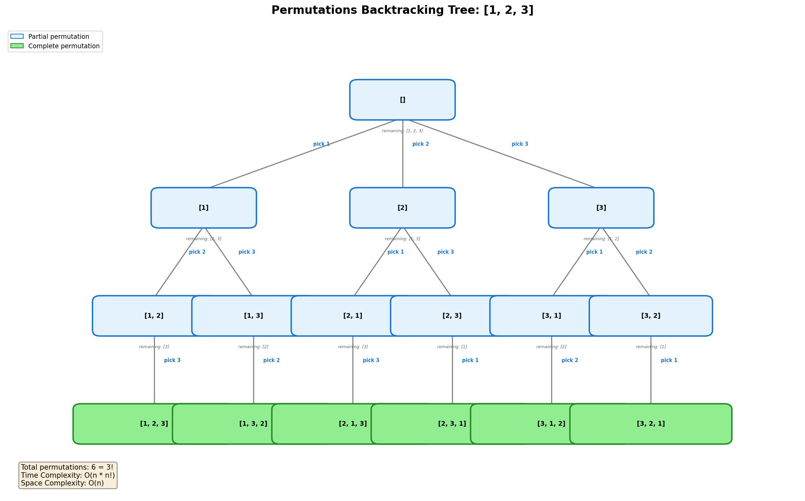
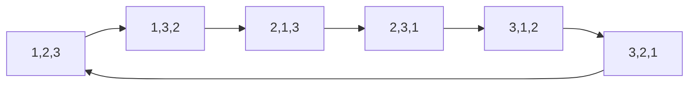
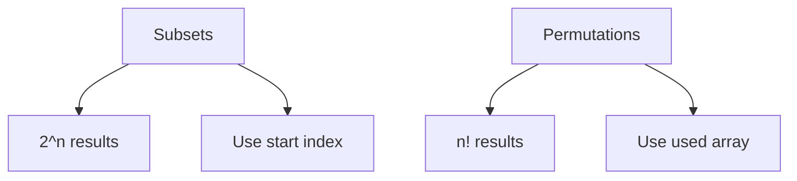
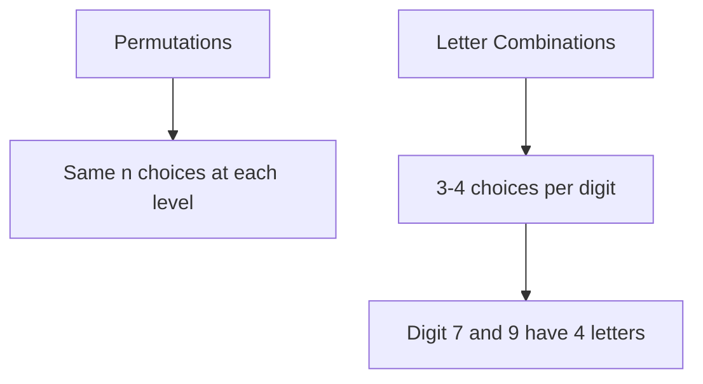

# Permutations

> **LeetCode**: [46. Permutations](https://leetcode.com/problems/permutations/)
> **Difficulty**: Medium
> **Pattern**: Backtracking

---

## Problem Statement

Given an array `nums` of **distinct** integers, return all the possible permutations. You can return the answer in **any order**.

---

## Examples

### Example 1
```text
Input: nums = [1, 2, 3]
Output: [[1,2,3], [1,3,2], [2,1,3], [2,3,1], [3,1,2], [3,2,1]]
```

### Example 2
```text
Input: nums = [0, 1]
Output: [[0, 1], [1, 0]]
```

### Example 3
```text
Input: nums = [1]
Output: [[1]]
```

---

## Constraints

- `1 <= nums.length <= 6`
- `-10 <= nums[i] <= 10`
- All the integers of `nums` are **unique**

---

## Backtracking Tree Visualization



### Decision Tree Structure

For permutations, at each position we can choose **any unused element**.

```text
                       []
              /        |        \
           [1]        [2]        [3]
          /   \      /   \      /   \
       [1,2] [1,3] [2,1] [2,3] [3,1] [3,2]
         |     |     |     |     |     |
     [1,2,3][1,3,2][2,1,3][2,3,1][3,1,2][3,2,1]
```

**Key Difference from Subsets:**
- Subsets: elements can only go forward (use `start` index)
- Permutations: any unused element can be chosen (track `used`)

---

## Backtracking Template

```python
def permute(nums):
    """
    Backtracking template for permutations.

    Key insight: At each position, try ALL unused elements.
    Use a 'used' set or remaining list to track what's available.
    """
    result = []

    def backtrack(path, remaining):
        # BASE CASE: all elements used
        if not remaining:
            result.append(path[:])
            return

        # Try each remaining element
        for i in range(len(remaining)):
            # CHOOSE
            path.append(remaining[i])
            new_remaining = remaining[:i] + remaining[i+1:]

            # EXPLORE
            backtrack(path, new_remaining)

            # UNCHOOSE
            path.pop()

    backtrack([], nums[:])
    return result
```

---

## Solutions

### Solution

::: code-group
```python [Python]
def permute(nums: list) -> list:
    """
    Generate all permutations using backtracking.

    Time Complexity: O(n * n!)
        - n! permutations
        - O(n) to copy each permutation
    Space Complexity: O(n) for recursion depth
    """
    result = []

    def backtrack(path, remaining):
        if not remaining:
            result.append(path[:])
            return

        for i in range(len(remaining)):
            path.append(remaining[i])
            # Create new remaining list excluding current element
            backtrack(path, remaining[:i] + remaining[i+1:])
            path.pop()

    backtrack([], nums)
    return result


# Test
print(permute([1, 2, 3]))
# Output: [[1,2,3], [1,3,2], [2,1,3], [2,3,1], [3,1,2], [3,2,1]]
```

```java [Java]
public List<List<Integer>> permute(int[] nums) {
    List<List<Integer>> result = new ArrayList<>();
    List<Integer> remaining = new ArrayList<>();
    for (int n : nums) remaining.add(n);
    backtrack(result, new ArrayList<>(), remaining);
    return result;
}

private void backtrack(List<List<Integer>> result,
                       List<Integer> path,
                       List<Integer> remaining) {
    if (remaining.isEmpty()) {
        result.add(new ArrayList<>(path)); // deep copy
        return;
    }
    for (int i = 0; i < remaining.size(); i++) {
        int val = remaining.get(i);
        path.add(val);
        List<Integer> newRemaining = new ArrayList<>(remaining);
        newRemaining.remove(i);
        backtrack(result, path, newRemaining);
        path.remove(path.size() - 1);
    }
}
```
:::

::: info Complexity: Time O(n * n!) · Space O(n)
- **Time:** There are n! permutations, and each permutation requires O(n) to copy into the result. Creating remaining lists also adds O(n) per recursive call.
- **Space:** Recursion depth is n (one element added per level), plus the path list of length up to n.
:::

### Solution 2: Backtracking with Used Set

```python
def permute_used(nums: list) -> list:
    """
    Generate permutations using a 'used' set to track visited elements.

    Time Complexity: O(n * n!)
    Space Complexity: O(n)
    """
    result = []
    used = [False] * len(nums)

    def backtrack(path):
        if len(path) == len(nums):
            result.append(path[:])
            return

        for i in range(len(nums)):
            if used[i]:
                continue

            # CHOOSE
            path.append(nums[i])
            used[i] = True

            # EXPLORE
            backtrack(path)

            # UNCHOOSE
            path.pop()
            used[i] = False

    backtrack([])
    return result


# Test
print(permute_used([1, 2, 3]))
```

::: info Complexity: Time O(n * n!) · Space O(n)
- **Time:** n! permutations are generated, each requiring O(n) time to copy. The used array check is O(n) per recursive call.
- **Space:** The used boolean array is O(n), plus recursion depth of n, plus path storage of length n.
:::

### Solution 3: Backtracking with Swap (In-Place)

```python
def permute_swap(nums: list) -> list:
    """
    Generate permutations by swapping elements in-place.

    Time Complexity: O(n * n!)
    Space Complexity: O(n) for recursion (O(1) extra space)

    This approach modifies the array in place by swapping.
    """
    result = []

    def backtrack(start):
        if start == len(nums):
            result.append(nums[:])
            return

        for i in range(start, len(nums)):
            # SWAP to choose nums[i] at position start
            nums[start], nums[i] = nums[i], nums[start]

            # EXPLORE
            backtrack(start + 1)

            # SWAP BACK (unchoose)
            nums[start], nums[i] = nums[i], nums[start]

    backtrack(0)
    return result


# Test
print(permute_swap([1, 2, 3]))
```

::: info Complexity: Time O(n * n!) · Space O(n)
- **Time:** Generates n! permutations, copying each in O(n). Swapping operations are O(1) but happen throughout the recursion tree.
- **Space:** Only O(n) for recursion depth; no extra used array needed since we swap in-place.
:::

### Solution 4: Iterative (Insert at All Positions)

```python
def permute_iterative(nums: list) -> list:
    """
    Generate permutations iteratively by inserting elements.

    Process:
    [1] -> [[1]]
    [2] -> [[2,1], [1,2]]
    [3] -> [[3,2,1], [2,3,1], [2,1,3], [3,1,2], [1,3,2], [1,2,3]]

    Time Complexity: O(n * n!)
    Space Complexity: O(1) not counting output
    """
    result = [[]]

    for num in nums:
        new_result = []
        for perm in result:
            # Insert num at every possible position
            for i in range(len(perm) + 1):
                new_result.append(perm[:i] + [num] + perm[i:])
        result = new_result

    return result


# Test
print(permute_iterative([1, 2, 3]))
```

::: info Complexity: Time O(n * n!) · Space O(n * n!)
- **Time:** For each of n elements, we insert into all positions of existing permutations, growing from 1! to n! permutations.
- **Space:** We store all intermediate permutations; at each step, the result list contains all permutations built so far.
:::

### Solution 5: Using itertools

```python
from itertools import permutations

def permute_builtin(nums: list) -> list:
    """
    Use Python's built-in permutations function.

    Time Complexity: O(n * n!)
    Space Complexity: O(1)
    """
    return [list(p) for p in permutations(nums)]


# Test
print(permute_builtin([1, 2, 3]))
```

::: info Complexity: Time O(n * n!) · Space O(1)
- **Time:** The itertools.permutations function generates n! permutations; converting each tuple to a list is O(n).
- **Space:** The generator yields permutations one at a time, using constant extra space internally.
:::

---

## Complexity Analysis

| Approach | Time | Space | Notes |
|----------|------|-------|-------|
| Remaining List | O(n * n!) | O(n) | Creates new lists |
| Used Set | O(n * n!) | O(n) | In-place tracking |
| Swap | O(n * n!) | O(n) | Most space efficient |
| Iterative | O(n * n!) | O(n * n!) | Stores intermediate results |

### Why O(n!)?

- First position: n choices
- Second position: n-1 choices
- Third position: n-2 choices
- ...
- Total permutations: n * (n-1) * (n-2) * ... * 1 = n!

---

## Visual: Swap Method Execution

```text
nums = [1, 2, 3]

backtrack(0):
    i=0: swap(0,0) -> [1,2,3]
        backtrack(1):
            i=1: swap(1,1) -> [1,2,3]
                backtrack(2):
                    i=2: swap(2,2) -> [1,2,3]
                        backtrack(3): ADD [1,2,3]
            i=2: swap(1,2) -> [1,3,2]
                backtrack(2):
                    backtrack(3): ADD [1,3,2]
                swap back -> [1,2,3]

    i=1: swap(0,1) -> [2,1,3]
        backtrack(1):
            i=1: [2,1,3]
                backtrack(3): ADD [2,1,3]
            i=2: [2,3,1]
                backtrack(3): ADD [2,3,1]

    i=2: swap(0,2) -> [3,2,1]
        ...
        ADD [3,2,1], [3,1,2]
```

---

## Comparison: Subsets vs Permutations

| Aspect | Subsets | Permutations |
|--------|---------|--------------|
| Order matters? | No | Yes |
| Size of result | 2^n | n! |
| Elements used | Any subset | All elements |
| Index tracking | `start` (move forward) | `used` set or `remaining` |
| Example | [1,2] == [2,1] | [1,2] != [2,1] |

---

## Common Mistakes

### 1. Using start index (wrong for permutations)
```python
# WRONG - this generates combinations, not permutations
def wrong(nums):
    def backtrack(start, path):
        for i in range(start, len(nums)):  # Wrong!
            path.append(nums[i])
            backtrack(i + 1, path)  # Wrong!
            path.pop()

# CORRECT - check all indices, track used
def correct(nums):
    def backtrack(path, remaining):
        for i in range(len(remaining)):  # All indices
            path.append(remaining[i])
            backtrack(path, remaining[:i] + remaining[i+1:])
            path.pop()
```

### 2. Forgetting to copy path
```python
# WRONG
result.append(path)  # Appends reference!

# CORRECT
result.append(path[:])  # Copy!
```

### 3. Not restoring state in swap method
```python
# WRONG - forgets to swap back
def backtrack(start):
    nums[start], nums[i] = nums[i], nums[start]
    backtrack(start + 1)
    # Missing: nums[start], nums[i] = nums[i], nums[start]

# CORRECT
def backtrack(start):
    nums[start], nums[i] = nums[i], nums[start]
    backtrack(start + 1)
    nums[start], nums[i] = nums[i], nums[start]  # Restore!
```

---

## Related Problems

::: details Permutations II (LeetCode 47)
**Problem:** Given an array that may contain duplicates, return all unique permutations.

**Key Insight:** Add duplicate skipping logic - sort first, skip when nums[i] == nums[i-1] and previous not used.

```mermaid
graph TD
    A[Permutations] --> B[No duplicate handling]
    C[Permutations II] --> D[Sort + skip duplicates]
    D --> E{nums[i] == nums[i-1]?}
    E -->|Yes, !used[i-1]| F[Skip]
```

**Approach:** Track used[] array, skip if same as previous AND previous was not used in current path.

**Complexity:** O(n * n!) time, O(n) space

**Link:** [Local Solution](./permutations-ii.md)
:::

::: details Next Permutation (LeetCode 31)
**Problem:** Rearrange numbers into the lexicographically next greater permutation. If impossible, rearrange to lowest order.

**Key Insight:** Find the pivot point (first decreasing element from right), swap with next larger element, reverse suffix.



**Approach:** Find rightmost ascending pair, swap with ceiling, reverse suffix.

**Complexity:** O(n) time, O(1) space

**Link:** [LeetCode 31](https://leetcode.com/problems/next-permutation/)
:::

::: details Subsets (LeetCode 78)
**Problem:** Return all possible subsets (power set) of distinct integers.

**Key Insight:** Order does NOT matter in subsets vs DOES matter in permutations.



**Approach:** Use start index to prevent going backward - [1,2] and [2,1] are same subset.

**Complexity:** O(n * 2^n) time, O(n) space

**Link:** [Local Solution](./subsets.md)
:::

::: details Letter Combinations of a Phone Number (LeetCode 17)
**Problem:** Given digits 2-9, return all possible letter combinations.

**Key Insight:** Variable number of choices at each position (digit mapping) vs fixed choices (elements).



**Approach:** Map digits to letters, recurse through digits choosing one letter at each position.

**Complexity:** O(4^n * n) time, O(n) space

**Link:** [Local Solution](./letter-combinations.md)
:::

---

## Interview Tips

1. **Clarify if order matters**: Permutations (yes) vs Combinations (no)
2. **Ask about duplicates**: Use [Permutations II](./permutations-ii.md) approach if yes
3. **Choose the right method**:
   - Used set: Most intuitive
   - Remaining list: Cleaner code
   - Swap: Best space efficiency
4. **Walk through the decision tree** to explain the algorithm
5. **Mention n! factorial complexity** upfront

---

## Key Takeaways

1. **Permutations = all orderings of elements**
2. **Track used elements** instead of using start index
3. **Three main approaches**: remaining list, used set, swap
4. **O(n * n!) complexity** is unavoidable - n! permutations exist
5. **Swap method is most space-efficient** but harder to understand
6. **Python's itertools.permutations** is available but know backtracking!

---

*Last updated: January 2026*
