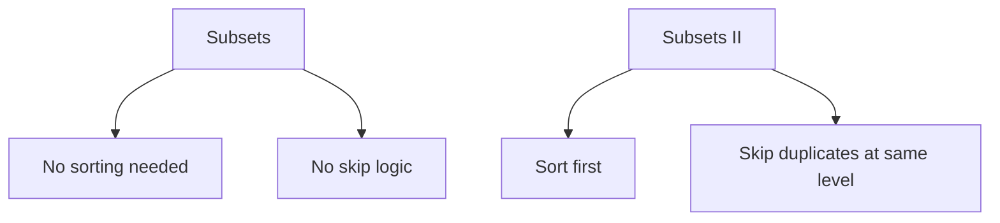
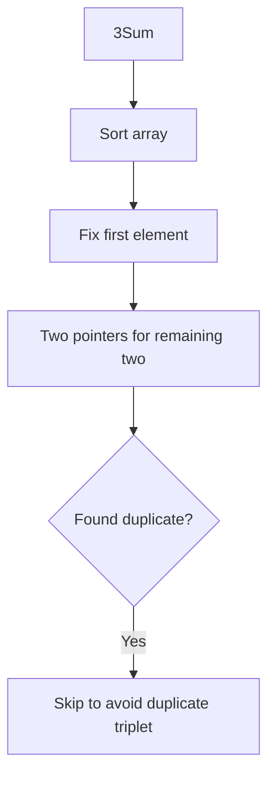

# Subsets II

> **LeetCode**: [90. Subsets II](https://leetcode.com/problems/subsets-ii/)
> **Difficulty**: Medium
> **Pattern**: Backtracking with Duplicate Handling

---

## Problem Statement

Given an integer array `nums` that may contain **duplicates**, return all possible subsets (the power set).

The solution set **must not** contain duplicate subsets. Return the solution in **any order**.

---

## Examples

### Example 1
```text
Input: nums = [1, 2, 2]
Output: [[], [1], [1, 2], [1, 2, 2], [2], [2, 2]]

Note: [2] appears only once, not twice!
```

### Example 2
```text
Input: nums = [0]
Output: [[], [0]]
```

### Example 3
```text
Input: nums = [4, 4, 4, 1, 4]
Output: [[], [1], [1, 4], [1, 4, 4], [1, 4, 4, 4], [1, 4, 4, 4, 4],
         [4], [4, 4], [4, 4, 4], [4, 4, 4, 4]]
```

---

## Constraints

- `1 <= nums.length <= 10`
- `-10 <= nums[i] <= 10`

---

## Key Insight: Handling Duplicates

The key difference from [Subsets](./subsets.md) is that input may contain duplicates.

**Strategy:**
1. **Sort the array** first to group duplicates together
2. **Skip duplicates at the same level** of the decision tree

```text
For nums = [1, 2, 2]:

WITHOUT duplicate handling:      WITH duplicate handling:
        []                              []
      / | \                           / | \
    [1] [2] [2]  <- DUPLICATE!      [1] [2] SKIP
                                         |
                                       [2,2]
```

---

## Backtracking Template with Duplicates

```python
def subsetsWithDup(nums):
    """
    Template for subset generation with duplicate handling.

    Key modifications:
    1. SORT the input first
    2. SKIP duplicates at the same decision level
    """
    result = []
    nums.sort()  # CRITICAL: Sort to group duplicates!

    def backtrack(start, path):
        result.append(path[:])

        for i in range(start, len(nums)):
            # SKIP duplicates at same level
            if i > start and nums[i] == nums[i - 1]:
                continue

            path.append(nums[i])
            backtrack(i + 1, path)
            path.pop()

    backtrack(0, [])
    return result
```

---

## Solutions

### Solution 1: Backtracking with Sorting (Recommended)

```python
def subsetsWithDup(nums: list) -> list:
    """
    Generate all unique subsets using backtracking.

    Time Complexity: O(n * 2^n)
    Space Complexity: O(n) for recursion depth

    Key: Sort + skip consecutive duplicates at same level
    """
    result = []
    nums.sort()  # Group duplicates together

    def backtrack(start, path):
        result.append(path[:])

        for i in range(start, len(nums)):
            # Skip duplicates: if current element equals previous
            # AND we're not at the start of this level
            if i > start and nums[i] == nums[i - 1]:
                continue

            path.append(nums[i])
            backtrack(i + 1, path)
            path.pop()

    backtrack(0, [])
    return result


# Test
print(subsetsWithDup([1, 2, 2]))
# Output: [[], [1], [1, 2], [1, 2, 2], [2], [2, 2]]
```

::: info Complexity: Time O(n * 2^n) · Space O(n)
- **Time:** In the worst case (all unique elements), we generate 2^n subsets, each taking O(n) to copy. Duplicate skipping reduces actual work but worst case remains.
- **Space:** Recursion depth is at most n, one level per element in the sorted array.
:::

### Solution 2: Iterative with Deduplication

```python
def subsetsWithDup_iterative(nums: list) -> list:
    """
    Iterative approach with smart handling of duplicates.

    Insight: When adding a duplicate, only add to subsets
    that were created in the previous iteration.

    Time Complexity: O(n * 2^n)
    Space Complexity: O(1) not counting output
    """
    nums.sort()
    result = [[]]
    start = 0

    for i in range(len(nums)):
        # If duplicate, start from where we left off
        # Otherwise, start from beginning
        if i > 0 and nums[i] == nums[i - 1]:
            start_idx = start
        else:
            start_idx = 0

        # Save starting point for next iteration
        start = len(result)

        # Add current number to applicable subsets
        for j in range(start_idx, start):
            result.append(result[j] + [nums[i]])

    return result


# Test
print(subsetsWithDup_iterative([1, 2, 2]))
# Output: [[], [1], [2], [1, 2], [2, 2], [1, 2, 2]]
```

::: info Complexity: Time O(n * 2^n) · Space O(1)
- **Time:** Iterates through each element, doubling the result size at most. For duplicates, only new subsets from previous iteration are extended.
- **Space:** No recursion stack; only the result list is used (not counting output space).
:::

### Solution 3: Using Set for Deduplication

```python
def subsetsWithDup_set(nums: list) -> list:
    """
    Use set with tuples to automatically deduplicate.

    Time Complexity: O(n * 2^n)
    Space Complexity: O(2^n) for the set
    """
    result = set()

    def backtrack(start, path):
        result.add(tuple(path))  # Tuple is hashable

        for i in range(start, len(nums)):
            path.append(nums[i])
            backtrack(i + 1, path)
            path.pop()

    nums.sort()  # Still need to sort for consistent tuples
    backtrack(0, [])
    return [list(s) for s in result]


# Test
print(subsetsWithDup_set([1, 2, 2]))
# Output: [[], [1], [2], [1, 2], [2, 2], [1, 2, 2]]
```

::: info Complexity: Time O(n * 2^n) · Space O(2^n)
- **Time:** Backtracking generates up to 2^n subsets, converting each to a hashable tuple for deduplication.
- **Space:** The set stores up to 2^n unique tuples, plus O(n) recursion depth.
:::

### Solution 4: Bit Manipulation with Set

```python
def subsetsWithDup_bits(nums: list) -> list:
    """
    Bit manipulation with set for deduplication.

    Time Complexity: O(n * 2^n)
    Space Complexity: O(2^n)
    """
    nums.sort()
    n = len(nums)
    result = set()

    for mask in range(1 << n):
        subset = tuple(nums[i] for i in range(n) if mask & (1 << i))
        result.add(subset)

    return [list(s) for s in result]


# Test
print(subsetsWithDup_bits([1, 2, 2]))
```

::: info Complexity: Time O(n * 2^n) · Space O(2^n)
- **Time:** Iterates through all 2^n bitmasks, building a subset of length up to n for each mask.
- **Space:** The set stores all unique subsets as tuples; final conversion to list adds overhead.
:::

---

## Visual: Why the Skip Condition Works

```text
nums = [1, 2, 2] (sorted)

Decision tree with skip condition:

Level 0 (start=0):
  []
  Try i=0 (val=1): proceed
  Try i=1 (val=2): proceed
  Try i=2 (val=2): i>start AND nums[2]==nums[1] -> SKIP!

Level 1 from [1] (start=1):
  [1]
  Try i=1 (val=2): proceed
  Try i=2 (val=2): i>start AND nums[2]==nums[1] -> SKIP!

Level 1 from [2] (start=2):
  [2]
  Try i=2 (val=2): i==start, so proceed
  [2, 2]

Result: [[], [1], [1,2], [1,2,2], [2], [2,2]]
        (No duplicates!)
```

---

## Complexity Analysis

| Approach | Time | Space | Notes |
|----------|------|-------|-------|
| Backtracking + Sort | O(n * 2^n) | O(n) | Most efficient |
| Iterative | O(n * 2^n) | O(1) | Harder to understand |
| Set Deduplication | O(n * 2^n) | O(2^n) | Extra space for set |
| Bit Manipulation | O(n * 2^n) | O(2^n) | Extra space for set |

---

## Common Mistakes

### 1. Forgetting to Sort
```python
# WRONG - won't work without sorting
def wrong(nums):
    result = []
    def backtrack(start, path):
        result.append(path[:])
        for i in range(start, len(nums)):
            if i > start and nums[i] == nums[i-1]:  # Won't work!
                continue
            path.append(nums[i])
            backtrack(i + 1, path)
            path.pop()
    backtrack(0, [])
    return result

# Input [2, 1, 2] would fail without sort!

# CORRECT - always sort first
def correct(nums):
    result = []
    nums.sort()  # ESSENTIAL!
    # ... rest of code
```

### 2. Wrong Skip Condition
```python
# WRONG - skips too much
if nums[i] == nums[i-1]:  # No i > start check!
    continue

# CORRECT - only skip at same decision level
if i > start and nums[i] == nums[i-1]:
    continue
```

### 3. Confusing with Permutations
```python
# This is for SUBSETS (combinations)
# Use start index, skip only at same level
for i in range(start, len(nums)):
    if i > start and nums[i] == nums[i-1]:
        continue

# For PERMUTATIONS with duplicates:
# Use visited array, skip if prev duplicate is unused
for i in range(len(nums)):
    if visited[i]:
        continue
    if i > 0 and nums[i] == nums[i-1] and not visited[i-1]:
        continue
```

---

## Comparison: Subsets vs Subsets II

| Aspect | Subsets | Subsets II |
|--------|---------|------------|
| Input | Unique elements | May have duplicates |
| Pre-processing | None | Sort array |
| Skip condition | None | `i > start and nums[i] == nums[i-1]` |
| Output size | Always 2^n | May be less than 2^n |

---

## Related Problems

::: details Subsets (LeetCode 78)
**Problem:** Given an array of unique integers, return all possible subsets (power set).

**Key Insight:** This is the foundation - no duplicate handling needed.



**Approach:** Standard backtracking with include/exclude decision at each element.

**Complexity:** O(n * 2^n) time, O(n) space

**Link:** [Local Solution](./subsets.md)
:::

::: details Permutations II (LeetCode 47)
**Problem:** Given an array that may contain duplicates, return all unique permutations.

**Key Insight:** Same duplicate handling concept - sort first, then skip when nums[i] == nums[i-1] and i-1 not used.

```mermaid
graph TD
    A[Permutations II] --> B[Sort array]
    B --> C{nums[i] == nums[i-1]?}
    C -->|Yes| D{used[i-1]?}
    D -->|No| E[Skip - would create duplicate]
    D -->|Yes| F[Use - different position]
```

**Approach:** Track used[] array and skip duplicates when previous duplicate was not used in current path.

**Complexity:** O(n * n!) time, O(n) space

**Link:** [Local Solution](./permutations-ii.md)
:::

::: details Combination Sum II (LeetCode 40)
**Problem:** Find unique combinations where each element used at most once, may contain duplicates.

**Key Insight:** Exact same skip logic as Subsets II, plus target sum constraint.

```mermaid
graph TD
    A[Skip condition] --> B[i > start AND nums[i] == nums[i-1]]
    C[Additional constraint] --> D[remaining == 0 for valid result]
```

**Approach:** Sort + skip duplicates + track remaining sum + move to i+1 (no reuse).

**Complexity:** O(2^n) time, O(n) space

**Link:** [Local Solution](./combination-sum-ii.md)
:::

::: details 3Sum (LeetCode 15)
**Problem:** Find all unique triplets in array that sum to zero.

**Key Insight:** Uses same skip duplicates pattern to avoid duplicate triplets.



**Approach:** Sort + iterate first element (skip duplicates) + two pointers (skip duplicates).

**Complexity:** O(n^2) time, O(1) space (excluding output)

**Link:** [LeetCode 15](https://leetcode.com/problems/3sum/)
:::

---

## Interview Tips

1. **Immediately ask** if input can have duplicates
2. **State the pattern**: "Sort + skip duplicates at same level"
3. **Explain the skip condition**: `i > start` ensures we don't skip the first occurrence
4. **Walk through an example** with [1, 2, 2] to demonstrate
5. **Mention the iterative approach** as an alternative

---

## Key Takeaways

1. **Always sort first** when handling duplicates
2. **Skip condition: `i > start and nums[i] == nums[i-1]`**
   - `i > start` ensures we process at least one duplicate
   - `nums[i] == nums[i-1]` detects duplicates
3. **This pattern is reusable** across many backtracking problems
4. **Set-based deduplication works** but uses more space
5. **The iterative approach** tracks where to start for each duplicate

---

*Last updated: January 2026*
