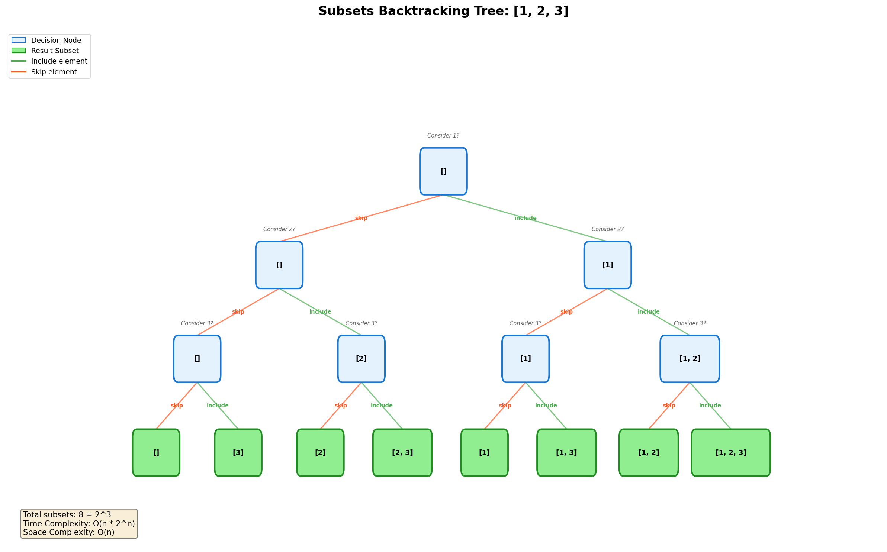
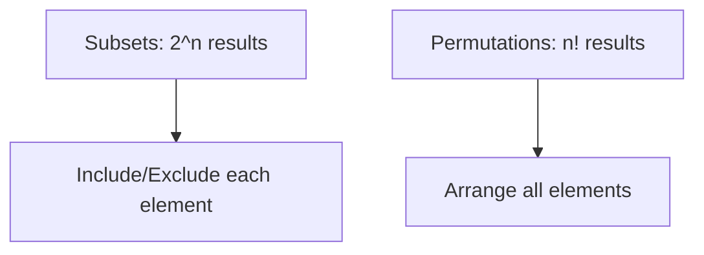
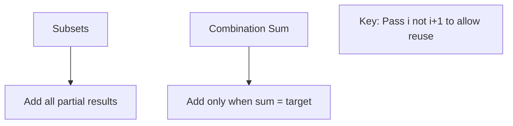
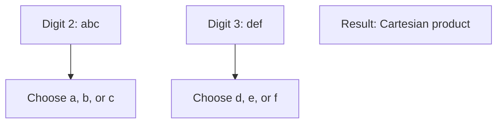

# Subsets

> **LeetCode**: [78. Subsets](https://leetcode.com/problems/subsets/)
> **Difficulty**: Medium
> **Pattern**: Backtracking, Bit Manipulation

---

## Problem Statement

Given an integer array `nums` of **unique** elements, return all possible subsets (the power set).

The solution set **must not** contain duplicate subsets. Return the solution in **any order**.

---

## Examples

### Example 1
```
Input: nums = [1, 2, 3]
Output: [[], [1], [2], [1, 2], [3], [1, 3], [2, 3], [1, 2, 3]]
```

### Example 2
```
Input: nums = [0]
Output: [[], [0]]
```

---

## Constraints

- `1 <= nums.length <= 10`
- `-10 <= nums[i] <= 10`
- All the numbers of `nums` are **unique**

---

## Backtracking Tree Visualization



### Decision Tree Structure

For each element, we make a binary decision:
- **Include** the element in the current subset
- **Skip** the element

```
                        []
                   /         \
              [1]              []
            /     \          /    \
        [1,2]    [1]      [2]      []
        /  \    /  \     /  \     /  \
    [1,2,3][1,2][1,3][1][2,3][2] [3] []
```

Every leaf node is a valid subset!

---

## Backtracking Template

```python
def subsets(nums):
    """
    Backtracking template for subset generation.

    Key insight: Every partial path is a valid subset!
    No need to check if path is "complete" - just add it.
    """
    result = []

    def backtrack(start, path):
        # Every path is a valid subset - add it!
        result.append(path[:])  # IMPORTANT: add copy, not reference

        # Explore: try adding each remaining element
        for i in range(start, len(nums)):
            path.append(nums[i])      # CHOOSE
            backtrack(i + 1, path)    # EXPLORE (i+1 to avoid duplicates)
            path.pop()                # UNCHOOSE (backtrack)

    backtrack(0, [])
    return result
```

---

## Solutions

### Solution 1: Backtracking (Recommended)

```python
def subsets(nums: list) -> list:
    """
    Generate all subsets using backtracking.

    Time Complexity: O(n * 2^n)
        - 2^n subsets
        - O(n) to copy each subset
    Space Complexity: O(n)
        - Recursion depth
        - Not counting output space
    """
    result = []

    def backtrack(start, path):
        # Add current subset (every path is valid)
        result.append(path[:])

        # Try adding each remaining element
        for i in range(start, len(nums)):
            path.append(nums[i])
            backtrack(i + 1, path)
            path.pop()

    backtrack(0, [])
    return result


# Test
print(subsets([1, 2, 3]))
# Output: [[], [1], [1, 2], [1, 2, 3], [1, 3], [2], [2, 3], [3]]
```

::: info Complexity: Time O(n * 2^n) · Space O(n)
- **Time:** There are 2^n subsets (power set), and each subset requires O(n) to copy into the result list.
- **Space:** Recursion depth is at most n (the length of nums), not counting the output storage.
:::

### Solution 2: Cascading (Iterative)

```python
def subsets_iterative(nums: list) -> list:
    """
    Build subsets iteratively by adding each element to existing subsets.

    Time Complexity: O(n * 2^n)
    Space Complexity: O(1) - not counting output

    Process:
    Start: [[]]
    Add 1: [[], [1]]
    Add 2: [[], [1], [2], [1,2]]
    Add 3: [[], [1], [2], [1,2], [3], [1,3], [2,3], [1,2,3]]
    """
    result = [[]]

    for num in nums:
        # Add num to each existing subset
        result += [subset + [num] for subset in result]

    return result


# Test
print(subsets_iterative([1, 2, 3]))
# Output: [[], [1], [2], [1, 2], [3], [1, 3], [2, 3], [1, 2, 3]]
```

::: info Complexity: Time O(n * 2^n) · Space O(1)
- **Time:** For each of n elements, we double the result list (creating 2^n total subsets), and list concatenation is O(current size).
- **Space:** No additional space beyond the output; we only use the result list itself.
:::

### Solution 3: Bit Manipulation

```python
def subsets_bits(nums: list) -> list:
    """
    Generate subsets using bit manipulation.

    Intuition: Each subset corresponds to a binary number from 0 to 2^n - 1
    - Bit i = 0: exclude nums[i]
    - Bit i = 1: include nums[i]

    Example for n=3:
    000 -> []
    001 -> [1]
    010 -> [2]
    011 -> [1, 2]
    100 -> [3]
    101 -> [1, 3]
    110 -> [2, 3]
    111 -> [1, 2, 3]

    Time Complexity: O(n * 2^n)
    Space Complexity: O(1) - not counting output
    """
    n = len(nums)
    result = []

    for mask in range(1 << n):  # 0 to 2^n - 1
        subset = []
        for i in range(n):
            if mask & (1 << i):  # Check if bit i is set
                subset.append(nums[i])
        result.append(subset)

    return result


# Test
print(subsets_bits([1, 2, 3]))
# Output: [[], [1], [2], [1, 2], [3], [1, 3], [2, 3], [1, 2, 3]]
```

::: info Complexity: Time O(n * 2^n) · Space O(1)
- **Time:** We iterate through 2^n bitmasks, and for each mask we check n bits to build the subset.
- **Space:** Only temporary variables for the mask and current subset; no recursion stack needed.
:::

### Solution 4: Include/Exclude Pattern

```python
def subsets_include_exclude(nums: list) -> list:
    """
    Alternative backtracking with explicit include/exclude decisions.

    This pattern makes the binary decision tree more explicit.

    Time Complexity: O(n * 2^n)
    Space Complexity: O(n)
    """
    result = []

    def backtrack(index, path):
        if index == len(nums):
            result.append(path[:])
            return

        # Choice 1: Include nums[index]
        path.append(nums[index])
        backtrack(index + 1, path)
        path.pop()

        # Choice 2: Exclude nums[index]
        backtrack(index + 1, path)

    backtrack(0, [])
    return result


# Test
print(subsets_include_exclude([1, 2, 3]))
# Output: [[1, 2, 3], [1, 2], [1, 3], [1], [2, 3], [2], [3], []]
```

::: info Complexity: Time O(n * 2^n) · Space O(n)
- **Time:** The decision tree has 2^n leaf nodes (one per subset), and copying each subset takes O(n).
- **Space:** Maximum recursion depth is n (one level per element in nums).
:::

---

## Complexity Analysis

| Approach | Time | Space | Notes |
|----------|------|-------|-------|
| Backtracking | O(n * 2^n) | O(n) | Most intuitive for interviews |
| Cascading | O(n * 2^n) | O(1) | Iterative approach |
| Bit Manipulation | O(n * 2^n) | O(1) | Elegant but less intuitive |
| Include/Exclude | O(n * 2^n) | O(n) | Explicit decision tree |

### Why O(n * 2^n)?

- **2^n subsets** exist (power set size)
- **O(n) to copy** each subset into result
- Total: O(n * 2^n)

---

## Visual: Backtracking Execution

```
backtrack(0, [])
    result = [[]]
    |
    +-- backtrack(1, [1])
    |       result = [[], [1]]
    |       |
    |       +-- backtrack(2, [1, 2])
    |       |       result = [[], [1], [1,2]]
    |       |       |
    |       |       +-- backtrack(3, [1, 2, 3])
    |       |               result = [[], [1], [1,2], [1,2,3]]
    |       |
    |       +-- backtrack(3, [1, 3])
    |               result = [[], [1], [1,2], [1,2,3], [1,3]]
    |
    +-- backtrack(2, [2])
    |       result = [..., [2]]
    |       |
    |       +-- backtrack(3, [2, 3])
    |               result = [..., [2,3]]
    |
    +-- backtrack(3, [3])
            result = [..., [3]]

Final: [[], [1], [1,2], [1,2,3], [1,3], [2], [2,3], [3]]
```

---

## Common Mistakes

### 1. Not Copying the Path
```python
# WRONG - all elements point to same list!
def subsets_wrong(nums):
    result = []
    def backtrack(start, path):
        result.append(path)  # Appends reference, not copy!
        for i in range(start, len(nums)):
            path.append(nums[i])
            backtrack(i + 1, path)
            path.pop()
    backtrack(0, [])
    return result  # All elements will be empty []!

# CORRECT
def subsets_correct(nums):
    result = []
    def backtrack(start, path):
        result.append(path[:])  # Append COPY using [:]
        # or: result.append(list(path))
```

### 2. Wrong Start Index
```python
# WRONG - causes duplicates [1,2] and [2,1]
def backtrack(path):
    for i in range(len(nums)):  # Starts from 0 each time
        path.append(nums[i])
        backtrack(path)
        path.pop()

# CORRECT - start from current index to avoid duplicates
def backtrack(start, path):
    for i in range(start, len(nums)):
        path.append(nums[i])
        backtrack(i + 1, path)  # i + 1, not start + 1!
        path.pop()
```

---

## Related Problems

::: details Subsets II (LeetCode 90)
**Problem:** Given an integer array that may contain duplicates, return all possible subsets without duplicate subsets.

**Key Insight:** Sort array first, skip duplicates at the same recursion level.

```mermaid
graph TD
    A[Start] --> B{Include nums[i]?}
    B -->|Yes| C[Add to path, recurse]
    B -->|No| D{Is duplicate?}
    D -->|Yes, i > start| E[Skip]
    D -->|No| F[Continue]
```

**Approach:** Backtracking with duplicate skipping - if nums[i] == nums[i-1] and i > start, skip.

**Complexity:** O(n * 2^n) time, O(n) space

**Link:** [Local Solution](./subsets-ii.md)
:::

::: details Permutations (LeetCode 46)
**Problem:** Given an array of distinct integers, return all possible permutations.

**Key Insight:** Unlike subsets where order doesn't matter, permutations use ALL elements in EVERY ORDER.



**Approach:** Track used elements instead of start index. Every element can appear at any position.

**Complexity:** O(n * n!) time, O(n) space

**Link:** [Local Solution](./permutations.md)
:::

::: details Combination Sum (LeetCode 39)
**Problem:** Find all unique combinations of candidates that sum to target. Same number may be used unlimited times.

**Key Insight:** Similar to subsets but with constraint (sum = target) and element reuse allowed.



**Approach:** Backtracking with remaining sum tracking. Use index i (not i+1) to allow element reuse.

**Complexity:** O(n^(target/min)) time, O(target/min) space

**Link:** [Local Solution](./combination-sum.md)
:::

::: details Letter Combinations of a Phone Number (LeetCode 17)
**Problem:** Given a string of digits 2-9, return all possible letter combinations.

**Key Insight:** Different choices at each level (not include/exclude, but which letter from the digit's mapping).



**Approach:** Index-based recursion through digits, iterate through letter choices at each level.

**Complexity:** O(4^n * n) time, O(n) space

**Link:** [Local Solution](./letter-combinations.md)
:::

---

## Interview Tips

1. **Recognize the pattern**: "All possible" usually means backtracking
2. **Draw the decision tree** before coding
3. **Remember to copy**: `path[:]` not `path`
4. **Use start index** to avoid generating duplicates like [1,2] and [2,1]
5. **Know multiple approaches**: Backtracking, iterative, bit manipulation

---

## Key Takeaways

1. **Every node in the recursion tree is a valid subset** - no base case needed to add to result
2. **Start index prevents duplicates** - only consider elements after current position
3. **Choose-Explore-Unchoose** pattern is fundamental
4. **2^n subsets exist** for n elements - power set
5. **Bit manipulation offers elegant alternative** - each subset maps to a binary number

---

*Last updated: January 2026*
