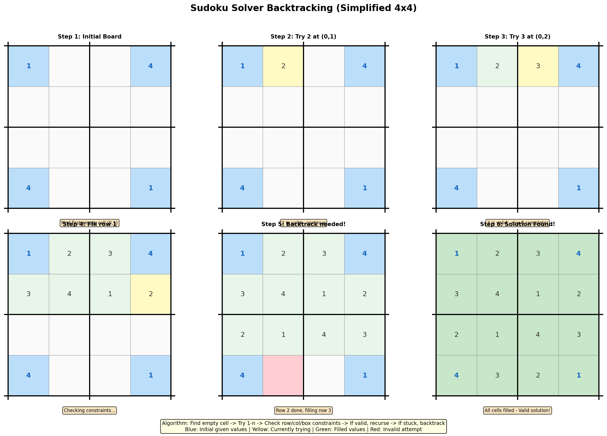
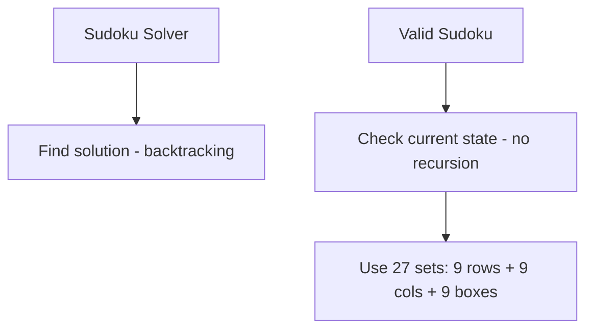
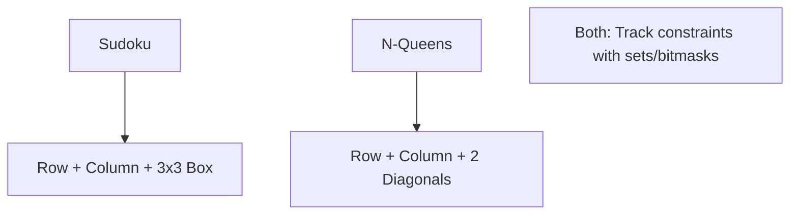

# Sudoku Solver

> **LeetCode**: [37. Sudoku Solver](https://leetcode.com/problems/sudoku-solver/)
> **Difficulty**: Hard
> **Pattern**: Constraint Backtracking

---

## Problem Statement

Write a program to solve a Sudoku puzzle by filling the empty cells.

A sudoku solution must satisfy **all of the following rules**:

1. Each of the digits `1-9` must occur exactly once in each row.
2. Each of the digits `1-9` must occur exactly once in each column.
3. Each of the digits `1-9` must occur exactly once in each of the 9 `3x3` sub-boxes of the grid.

The `'.'` character indicates empty cells.

---

## Examples

### Example 1
```
Input:
[["5","3",".",".","7",".",".",".","."],
 ["6",".",".","1","9","5",".",".","."],
 [".","9","8",".",".",".",".","6","."],
 ["8",".",".",".","6",".",".",".","3"],
 ["4",".",".","8",".","3",".",".","1"],
 ["7",".",".",".","2",".",".",".","6"],
 [".","6",".",".",".",".","2","8","."],
 [".",".",".","4","1","9",".",".","5"],
 [".",".",".",".","8",".",".","7","9"]]

Output:
[["5","3","4","6","7","8","9","1","2"],
 ["6","7","2","1","9","5","3","4","8"],
 ["1","9","8","3","4","2","5","6","7"],
 ["8","5","9","7","6","1","4","2","3"],
 ["4","2","6","8","5","3","7","9","1"],
 ["7","1","3","9","2","4","8","5","6"],
 ["9","6","1","5","3","7","2","8","4"],
 ["2","8","7","4","1","9","6","3","5"],
 ["3","4","5","2","8","6","1","7","9"]]
```

---

## Constraints

- `board.length == 9`
- `board[i].length == 9`
- `board[i][j]` is a digit or `'.'`
- It is **guaranteed** that the input board has only one solution.

---

## Sudoku Solver Visualization



### Constraint Checking

```
For cell (row, col), check:

1. ROW: No same digit in board[row][:]
2. COLUMN: No same digit in board[:][col]
3. 3x3 BOX: No same digit in the containing 3x3 sub-grid

Box index calculation:
box_row = (row // 3) * 3
box_col = (col // 3) * 3

For row=5, col=7:
box_row = (5 // 3) * 3 = 3
box_col = (7 // 3) * 3 = 6
Check cells (3,6) to (5,8)
```

---

## Backtracking Template

```python
def solveSudoku(board):
    """
    Sudoku solver template.

    Find empty cell -> Try 1-9 -> Check constraints -> Recurse -> Backtrack
    """
    def is_valid(board, row, col, num):
        # Check row
        if num in board[row]:
            return False

        # Check column
        if any(board[r][col] == num for r in range(9)):
            return False

        # Check 3x3 box
        box_row, box_col = 3 * (row // 3), 3 * (col // 3)
        for r in range(box_row, box_row + 3):
            for c in range(box_col, box_col + 3):
                if board[r][c] == num:
                    return False

        return True

    def backtrack():
        # Find next empty cell
        for r in range(9):
            for c in range(9):
                if board[r][c] == '.':
                    # Try digits 1-9
                    for num in '123456789':
                        if is_valid(board, r, c, num):
                            board[r][c] = num
                            if backtrack():
                                return True
                            board[r][c] = '.'  # Backtrack
                    return False  # No valid digit found
        return True  # All cells filled

    backtrack()
```

---

## Solutions

### Solution 1: Basic Backtracking

```python
def solveSudoku(board: list) -> None:
    """
    Solve Sudoku using basic backtracking.

    Time Complexity: O(9^(empty cells)) worst case
    Space Complexity: O(81) for recursion depth
    """
    def is_valid(row, col, num):
        # Check row
        if num in board[row]:
            return False

        # Check column
        for r in range(9):
            if board[r][col] == num:
                return False

        # Check 3x3 box
        box_row, box_col = 3 * (row // 3), 3 * (col // 3)
        for r in range(box_row, box_row + 3):
            for c in range(box_col, box_col + 3):
                if board[r][c] == num:
                    return False

        return True

    def backtrack():
        for r in range(9):
            for c in range(9):
                if board[r][c] == '.':
                    for num in '123456789':
                        if is_valid(r, c, num):
                            board[r][c] = num
                            if backtrack():
                                return True
                            board[r][c] = '.'
                    return False
        return True

    backtrack()


# Test
board = [["5","3",".",".","7",".",".",".","."],
         ["6",".",".","1","9","5",".",".","."],
         [".","9","8",".",".",".",".","6","."],
         ["8",".",".",".","6",".",".",".","3"],
         ["4",".",".","8",".","3",".",".","1"],
         ["7",".",".",".","2",".",".",".","6"],
         [".","6",".",".",".",".","2","8","."],
         [".",".",".","4","1","9",".",".","5"],
         [".",".",".",".","8",".",".","7","9"]]
solveSudoku(board)
for row in board:
    print(row)
```

::: info Complexity: Time O(9^empty) · Space O(81)
- **Time:** In the worst case, we try 9 digits for each empty cell. With E empty cells, worst case is 9^E attempts. Constraint checking is O(27) per cell.
- **Space:** Recursion depth is at most 81 (all cells empty). The board itself is O(81) = O(1) since it is fixed size.
:::

### Solution 2: With Set-Based Constraint Tracking (Faster)

::: code-group

```python [Python]
def solveSudoku_sets(board: list) -> None:
    """
    Use sets for O(1) constraint checking.

    Pre-populate sets with existing values, then check in O(1).

    Time Complexity: O(9^(empty cells)) but faster checks
    Space Complexity: O(81)
    """
    # Initialize constraint sets
    rows = [set() for _ in range(9)]
    cols = [set() for _ in range(9)]
    boxes = [set() for _ in range(9)]

    # Fill in existing values
    empty_cells = []
    for r in range(9):
        for c in range(9):
            if board[r][c] != '.':
                num = board[r][c]
                rows[r].add(num)
                cols[c].add(num)
                boxes[(r // 3) * 3 + c // 3].add(num)
            else:
                empty_cells.append((r, c))

    def backtrack(idx):
        if idx == len(empty_cells):
            return True

        r, c = empty_cells[idx]
        box_idx = (r // 3) * 3 + c // 3

        for num in '123456789':
            if num not in rows[r] and num not in cols[c] and num not in boxes[box_idx]:
                # Place number
                board[r][c] = num
                rows[r].add(num)
                cols[c].add(num)
                boxes[box_idx].add(num)

                if backtrack(idx + 1):
                    return True

                # Backtrack
                board[r][c] = '.'
                rows[r].remove(num)
                cols[c].remove(num)
                boxes[box_idx].remove(num)

        return False

    backtrack(0)


# Test
board = [["5","3",".",".","7",".",".",".","."],
         ["6",".",".","1","9","5",".",".","."],
         [".","9","8",".",".",".",".","6","."],
         ["8",".",".",".","6",".",".",".","3"],
         ["4",".",".","8",".","3",".",".","1"],
         ["7",".",".",".","2",".",".",".","6"],
         [".","6",".",".",".",".","2","8","."],
         [".",".",".","4","1","9",".",".","5"],
         [".",".",".",".","8",".",".","7","9"]]
solveSudoku_sets(board)
for row in board:
    print(row)
```

```java [Java]
import java.util.*;

class Solution {
    // rows[r][d], cols[c][d], boxes[b][d] = true means digit d+1 is used
    private boolean[][] rows = new boolean[9][9];
    private boolean[][] cols = new boolean[9][9];
    private boolean[][] boxes = new boolean[9][9];
    private List<int[]> emptyCells = new ArrayList<>();
    private char[][] board;

    public void solveSudoku(char[][] board) {
        this.board = board;

        // Initialize constraints and collect empty cells
        for (int r = 0; r < 9; r++) {
            for (int c = 0; c < 9; c++) {
                if (board[r][c] != '.') {
                    int d = board[r][c] - '1';
                    int b = (r / 3) * 3 + c / 3;
                    rows[r][d] = true;
                    cols[c][d] = true;
                    boxes[b][d] = true;
                } else {
                    emptyCells.add(new int[]{r, c});
                }
            }
        }

        backtrack(0);
    }

    private boolean backtrack(int idx) {
        if (idx == emptyCells.size()) return true;

        int r = emptyCells.get(idx)[0];
        int c = emptyCells.get(idx)[1];
        int b = (r / 3) * 3 + c / 3;

        for (int d = 0; d < 9; d++) {
            if (!rows[r][d] && !cols[c][d] && !boxes[b][d]) {
                // Place digit
                board[r][c] = (char) ('1' + d);
                rows[r][d] = cols[c][d] = boxes[b][d] = true;

                if (backtrack(idx + 1)) return true;

                // Backtrack
                board[r][c] = '.';
                rows[r][d] = cols[c][d] = boxes[b][d] = false;
            }
        }
        return false;
    }
}
```

:::

::: info Complexity: Time O(9^empty) · Space O(81)
- **Time:** Same exponential worst case, but constraint checking is O(1) using pre-populated sets instead of O(27) linear scans.
- **Space:** 27 sets (9 rows + 9 columns + 9 boxes) each storing at most 9 elements, plus the empty_cells list.
:::

### Solution 3: With Bit Manipulation (Fastest)

```python
def solveSudoku_bits(board: list) -> None:
    """
    Use bitmasks for fastest constraint checking.

    Each bit represents whether a digit is available.
    Available = 1, Used = 0

    Time Complexity: O(9^(empty cells)) with fastest checks
    Space Complexity: O(27) for bitmasks
    """
    # Bitmasks: bit i = 1 means digit i+1 is available
    rows = [0x1FF] * 9  # All 9 bits set (1-9 available)
    cols = [0x1FF] * 9
    boxes = [0x1FF] * 9

    empty_cells = []

    # Initialize with existing values
    for r in range(9):
        for c in range(9):
            if board[r][c] != '.':
                bit = 1 << (int(board[r][c]) - 1)
                rows[r] &= ~bit
                cols[c] &= ~bit
                boxes[(r // 3) * 3 + c // 3] &= ~bit
            else:
                empty_cells.append((r, c))

    def backtrack(idx):
        if idx == len(empty_cells):
            return True

        r, c = empty_cells[idx]
        box_idx = (r // 3) * 3 + c // 3

        # Available digits: intersection of row, col, box
        available = rows[r] & cols[c] & boxes[box_idx]

        while available:
            # Get lowest set bit
            bit = available & (-available)
            available &= available - 1  # Remove this bit

            # Convert bit to digit
            num = str(bin(bit).count('0'))

            # Place digit
            board[r][c] = num
            rows[r] &= ~bit
            cols[c] &= ~bit
            boxes[box_idx] &= ~bit

            if backtrack(idx + 1):
                return True

            # Backtrack
            board[r][c] = '.'
            rows[r] |= bit
            cols[c] |= bit
            boxes[box_idx] |= bit

        return False

    backtrack(0)


# Test
board = [["5","3",".",".","7",".",".",".","."],
         ["6",".",".","1","9","5",".",".","."],
         [".","9","8",".",".",".",".","6","."],
         ["8",".",".",".","6",".",".",".","3"],
         ["4",".",".","8",".","3",".",".","1"],
         ["7",".",".",".","2",".",".",".","6"],
         [".","6",".",".",".",".","2","8","."],
         [".",".",".","4","1","9",".",".","5"],
         [".",".",".",".","8",".",".","7","9"]]
solveSudoku_bits(board)
for row in board:
    print(row)
```

::: info Complexity: Time O(9^empty) · Space O(27)
- **Time:** Same worst-case complexity, but bitmask operations (AND, OR, XOR) are constant-time CPU operations, making this the fastest in practice.
- **Space:** Only 27 integers (bitmasks) for constraint tracking plus the empty_cells list. More memory-efficient than sets.
:::

### Solution 4: With Most Constrained Cell Selection (MRV Heuristic)

```python
def solveSudoku_mrv(board: list) -> None:
    """
    Choose the most constrained cell first (Minimum Remaining Values).

    This heuristic often finds solutions faster by failing early.

    Time Complexity: O(9^(empty cells)) but better average case
    Space Complexity: O(81)
    """
    rows = [set() for _ in range(9)]
    cols = [set() for _ in range(9)]
    boxes = [set() for _ in range(9)]

    # Initialize
    for r in range(9):
        for c in range(9):
            if board[r][c] != '.':
                num = board[r][c]
                rows[r].add(num)
                cols[c].add(num)
                boxes[(r // 3) * 3 + c // 3].add(num)

    def get_candidates(r, c):
        """Get valid candidates for cell (r, c)."""
        if board[r][c] != '.':
            return set()
        box_idx = (r // 3) * 3 + c // 3
        used = rows[r] | cols[c] | boxes[box_idx]
        return set('123456789') - used

    def find_mrv_cell():
        """Find empty cell with fewest candidates."""
        min_candidates = 10
        best_cell = None
        for r in range(9):
            for c in range(9):
                if board[r][c] == '.':
                    candidates = get_candidates(r, c)
                    if len(candidates) < min_candidates:
                        min_candidates = len(candidates)
                        best_cell = (r, c, candidates)
                        if min_candidates == 0:
                            return best_cell  # No valid options, fail fast
        return best_cell

    def backtrack():
        result = find_mrv_cell()
        if result is None:
            return True  # All cells filled

        r, c, candidates = result
        if not candidates:
            return False  # No valid digit for this cell

        box_idx = (r // 3) * 3 + c // 3

        for num in candidates:
            board[r][c] = num
            rows[r].add(num)
            cols[c].add(num)
            boxes[box_idx].add(num)

            if backtrack():
                return True

            board[r][c] = '.'
            rows[r].remove(num)
            cols[c].remove(num)
            boxes[box_idx].remove(num)

        return False

    backtrack()
```

::: info Complexity: Time O(9^empty) · Space O(81)
- **Time:** Same worst-case, but MRV heuristic dramatically improves average case by choosing cells with fewest valid options first, causing earlier pruning.
- **Space:** 27 sets for constraints, plus O(81) for find_mrv_cell scanning. The heuristic adds overhead but reduces total nodes explored.
:::

---

## Complexity Analysis

| Approach | Time | Space | Notes |
|----------|------|-------|-------|
| Basic | O(9^81) worst | O(81) | Simple but slow checks |
| Sets | O(9^81) worst | O(81) | O(1) constraint checks |
| Bitmask | O(9^81) worst | O(27) | Fastest in practice |
| MRV | O(9^81) worst | O(81) | Better average case |

### Practical Performance

For typical Sudoku puzzles (~40-50 empty cells):
- Most puzzles solved in < 10,000 recursive calls
- MRV heuristic often reduces by 10x
- Bitmask provides ~3x speedup over basic

---

## Box Index Formula Explained

```
For a 9x9 Sudoku with 3x3 boxes:

Box indices:
0 1 2
3 4 5
6 7 8

For cell (row, col):
box_row = row // 3     (which box row: 0, 1, or 2)
box_col = col // 3     (which box col: 0, 1, or 2)
box_idx = box_row * 3 + box_col

Example:
Cell (5, 7): box_row = 1, box_col = 2
box_idx = 1 * 3 + 2 = 5

This maps to the center-right box.
```

---

## Common Mistakes

### 1. Forgetting to Backtrack
```python
# WRONG - doesn't restore state
board[r][c] = num
if backtrack():
    return True
# Missing: board[r][c] = '.'

# CORRECT
board[r][c] = num
if backtrack():
    return True
board[r][c] = '.'  # Restore!
```

### 2. Returning Wrong Value
```python
# WRONG - always returns False
def backtrack():
    for r in range(9):
        for c in range(9):
            if board[r][c] == '.':
                for num in '123456789':
                    if is_valid(r, c, num):
                        board[r][c] = num
                        backtrack()  # Missing: if backtrack(): return True
                        board[r][c] = '.'
                return False
    # Missing: return True for success!

# CORRECT
def backtrack():
    for r in range(9):
        for c in range(9):
            if board[r][c] == '.':
                for num in '123456789':
                    if is_valid(r, c, num):
                        board[r][c] = num
                        if backtrack():
                            return True
                        board[r][c] = '.'
                return False
    return True  # Success!
```

---

## Related Problems

::: details Valid Sudoku (LeetCode 36)
**Problem:** Check if current Sudoku board state is valid (no rule violations).

**Key Insight:** Just validation - no backtracking needed, single pass check.



**Approach:** Use sets for each row, column, and box. Single pass to detect duplicates.

**Complexity:** O(81) = O(1) time, O(81) = O(1) space

**Link:** [LeetCode 36](https://leetcode.com/problems/valid-sudoku/)
:::

::: details N-Queens (LeetCode 51)
**Problem:** Place n queens on n x n board so no two attack each other.

**Key Insight:** Same constraint satisfaction pattern - row, column, diagonal constraints.



**Approach:** Place row by row, track columns and both diagonals, backtrack on conflict.

**Complexity:** O(n!) time, O(n) space

**Link:** [Local Solution](./n-queens.md)
:::

::: details Word Squares (LeetCode 425)
**Problem:** Find all word squares from given list of words.

**Key Insight:** Similar constraint propagation - each word placement constrains future choices.

```mermaid
graph TD
    A[Word Square] --> B[word[i][j] must equal word[j][i]]
    B --> C[Row i determines column i prefix]
    C --> D[Use Trie for prefix lookup]
```

**Approach:** Build Trie. Place words row by row. Use column prefixes to find valid next words.

**Complexity:** O(n * 26^L) where L = word length, n = number of words

**Link:** [LeetCode 425](https://leetcode.com/problems/word-squares/)
:::

---

## Interview Tips

1. **Start with basic backtracking**: Show clear understanding
2. **Explain constraint checking**: Row, column, box
3. **Optimize incrementally**: Basic -> Sets -> Bits
4. **Mention heuristics**: MRV for better average case
5. **Handle edge cases**: Empty board, invalid input

---

## Key Takeaways

1. **Three constraints**: Row, column, and 3x3 box
2. **Box index formula**: `(row // 3) * 3 + col // 3`
3. **Set-based tracking** gives O(1) constraint checks
4. **Bitmasks are fastest** but harder to implement
5. **MRV heuristic** improves average case significantly
6. **Guaranteed one solution** simplifies problem

---

*Last updated: January 2026*
