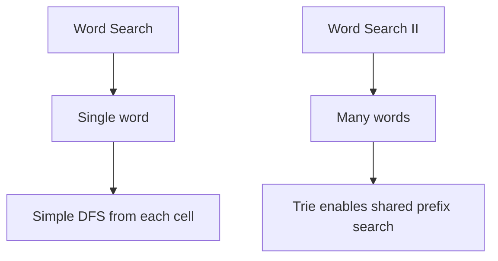
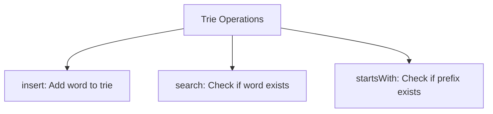
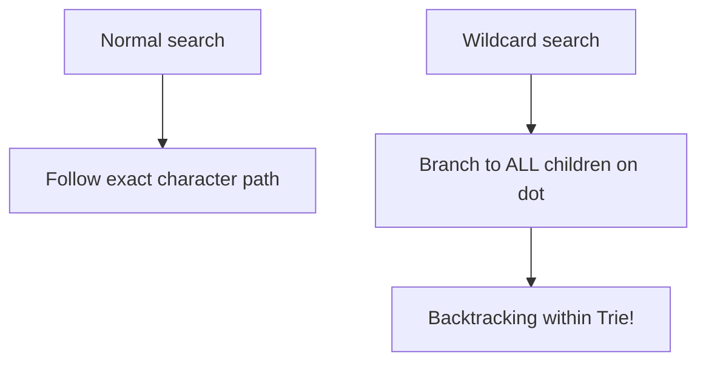
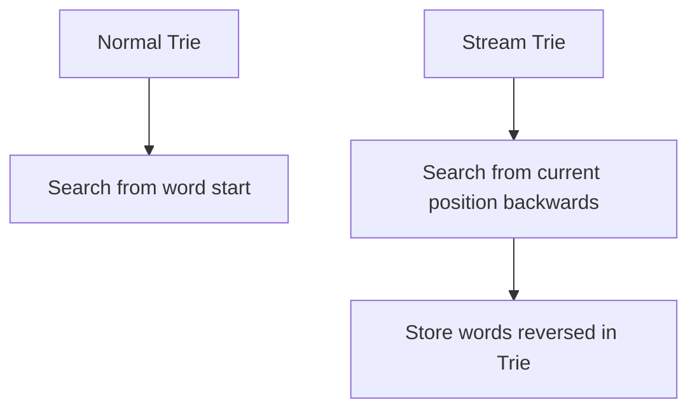

# Word Search II

> **LeetCode**: [212. Word Search II](https://leetcode.com/problems/word-search-ii/)
> **Difficulty**: Hard
> **Pattern**: Trie + Backtracking

---

## Problem Statement

Given an `m x n` board of characters and a list of strings `words`, return all words on the board.

Each word must be constructed from letters of sequentially adjacent cells, where adjacent cells are horizontally or vertically neighboring. The same letter cell may not be used more than once in a word.

---

## Examples

### Example 1
```
Input: board = [["o","a","a","n"],
                ["e","t","a","e"],
                ["i","h","k","r"],
                ["i","f","l","v"]],
       words = ["oath","pea","eat","rain"]
Output: ["eat","oath"]
```

### Example 2
```
Input: board = [["a","b"],["c","d"]],
       words = ["abcb"]
Output: []
```

---

## Constraints

- `m == board.length`
- `n == board[i].length`
- `1 <= m, n <= 12`
- `board[i][j]` is a lowercase English letter
- `1 <= words.length <= 3 * 10^4`
- `1 <= words[i].length <= 10`
- `words[i]` consists of lowercase English letters
- All the strings of `words` are unique

---

## Why Use a Trie?

### Naive Approach (Too Slow)
Search for each word separately: O(m * n * 4^L * W)
- W = number of words
- Each word requires a full grid search

### Trie Approach (Efficient)
Build a Trie from all words, then search once: O(m * n * 4^L)
- Multiple words share common prefixes
- Prune paths that don't match any word prefix
- Find all matching words in a single traversal

---

## Trie Structure

```
Words: ["eat", "oath", "oat"]

         root
        /    \
       e      o
       |      |
       a      a
       |      |
       t*     t*
              |
              h*

* = end of word

When searching, if current path matches no Trie prefix,
we can stop early - no word starts with this prefix!
```

---

## Backtracking Template

```python
def findWords(board, words):
    """
    Trie + Backtracking template.

    1. Build Trie from words
    2. DFS from each cell, following Trie paths
    3. Add word when reaching Trie end node
    """
    # Build Trie
    trie = {}
    for word in words:
        node = trie
        for char in word:
            node = node.setdefault(char, {})
        node['$'] = word  # Mark end of word, store word itself

    result = []
    rows, cols = len(board), len(board[0])

    def backtrack(r, c, parent):
        char = board[r][c]
        node = parent.get(char)

        if not node:
            return  # No word has this prefix

        # Found a word
        if '$' in node:
            result.append(node['$'])
            del node['$']  # Prevent duplicates

        # Mark visited
        board[r][c] = '#'

        # Explore 4 directions
        for dr, dc in [(0, 1), (0, -1), (1, 0), (-1, 0)]:
            nr, nc = r + dr, c + dc
            if 0 <= nr < rows and 0 <= nc < cols and board[nr][nc] != '#':
                backtrack(nr, nc, node)

        # Restore
        board[r][c] = char

        # Prune: remove empty nodes to speed up future searches
        if not node:
            del parent[char]

    for r in range(rows):
        for c in range(cols):
            if board[r][c] in trie:
                backtrack(r, c, trie)

    return result
```

---

## Solutions

### Solution 1: Trie + Backtracking (Recommended)

```python
def findWords(board: list, words: list) -> list:
    """
    Find all words using Trie + Backtracking.

    Time Complexity: O(m * n * 4^L + W * L)
        - W * L to build Trie
        - m * n * 4^L for backtracking
    Space Complexity: O(W * L) for Trie
    """
    # Build Trie
    trie = {}
    for word in words:
        node = trie
        for char in word:
            node = node.setdefault(char, {})
        node['$'] = word  # Store complete word at leaf

    result = []
    rows, cols = len(board), len(board[0])

    def backtrack(r, c, parent):
        char = board[r][c]
        node = parent.get(char)

        if not node:
            return

        # Found a word
        if '$' in node:
            result.append(node['$'])
            del node['$']  # Avoid duplicates

        # Mark visited
        board[r][c] = '#'

        # Explore neighbors
        for dr, dc in [(0, 1), (0, -1), (1, 0), (-1, 0)]:
            nr, nc = r + dr, c + dc
            if 0 <= nr < rows and 0 <= nc < cols and board[nr][nc] != '#':
                backtrack(nr, nc, node)

        # Restore
        board[r][c] = char

        # Optimization: prune empty nodes
        if not node:
            del parent[char]

    for r in range(rows):
        for c in range(cols):
            if board[r][c] in trie:
                backtrack(r, c, trie)

    return result


# Test
board = [["o","a","a","n"],["e","t","a","e"],["i","h","k","r"],["i","f","l","v"]]
words = ["oath","pea","eat","rain"]
print(findWords(board, words))  # ['oath', 'eat']
```

::: info Complexity: Time O(m * n * 4^L + W * L) · Space O(W * L)
- **Time:** O(W * L) to build the Trie from W words of average length L. O(m * n * 4^L) for backtracking where we start from each cell and explore up to 4^L paths.
- **Space:** The Trie stores W words with average length L. Recursion depth is at most L. Trie pruning reduces space over time.
:::

### Solution 2: With TrieNode Class

```python
class TrieNode:
    def __init__(self):
        self.children = {}
        self.word = None  # Store complete word at end

class Solution:
    def findWords(self, board: list, words: list) -> list:
        """
        Object-oriented Trie implementation.
        """
        # Build Trie
        root = TrieNode()
        for word in words:
            node = root
            for char in word:
                if char not in node.children:
                    node.children[char] = TrieNode()
                node = node.children[char]
            node.word = word

        result = []
        rows, cols = len(board), len(board[0])

        def backtrack(r, c, node):
            char = board[r][c]
            child = node.children.get(char)

            if not child:
                return

            if child.word:
                result.append(child.word)
                child.word = None  # Prevent duplicates

            board[r][c] = '#'

            for dr, dc in [(0, 1), (0, -1), (1, 0), (-1, 0)]:
                nr, nc = r + dr, c + dc
                if 0 <= nr < rows and 0 <= nc < cols and board[nr][nc] != '#':
                    backtrack(nr, nc, child)

            board[r][c] = char

            # Prune empty branches
            if not child.children:
                del node.children[char]

        for r in range(rows):
            for c in range(cols):
                if board[r][c] in root.children:
                    backtrack(r, c, root)

        return result


# Test
sol = Solution()
board = [["o","a","a","n"],["e","t","a","e"],["i","h","k","r"],["i","f","l","v"]]
words = ["oath","pea","eat","rain"]
print(sol.findWords(board, words))  # ['oath', 'eat']
```

::: info Complexity: Time O(m * n * 4^L + W * L) · Space O(W * L)
- **Time:** Same as Solution 1; the TrieNode class is just an object-oriented organization of the same logic.
- **Space:** TrieNode objects store children dict and word reference. Total space is proportional to total characters across all words.
:::

### Solution 3: Without Trie Pruning (Simpler but Slower)

```python
def findWords_simple(board: list, words: list) -> list:
    """
    Simpler version without pruning.

    Less efficient but easier to understand.
    """
    # Build Trie
    trie = {}
    for word in words:
        node = trie
        for char in word:
            node = node.setdefault(char, {})
        node['#'] = word

    result = set()  # Use set to handle duplicates
    rows, cols = len(board), len(board[0])

    def backtrack(r, c, node):
        if r < 0 or r >= rows or c < 0 or c >= cols:
            return
        if board[r][c] not in node:
            return

        char = board[r][c]
        child = node[char]

        if '#' in child:
            result.add(child['#'])

        board[r][c] = '*'

        backtrack(r + 1, c, child)
        backtrack(r - 1, c, child)
        backtrack(r, c + 1, child)
        backtrack(r, c - 1, child)

        board[r][c] = char

    for r in range(rows):
        for c in range(cols):
            backtrack(r, c, trie)

    return list(result)


# Test
board = [["o","a","a","n"],["e","t","a","e"],["i","h","k","r"],["i","f","l","v"]]
words = ["oath","pea","eat","rain"]
print(findWords_simple(board, words))  # ['oath', 'eat']
```

::: info Complexity: Time O(m * n * 4^L + W * L) · Space O(W * L)
- **Time:** Same asymptotic complexity, but without pruning, the Trie never shrinks, so redundant traversals occur after words are found.
- **Space:** Uses a set for results (handles duplicates differently), but overall Trie space remains O(W * L). No pruning means Trie stays full.
:::

---

## Complexity Analysis

| Approach | Time | Space | Notes |
|----------|------|-------|-------|
| Trie + Backtracking | O(m*n*4^L) | O(W*L) | W=words, L=avg length |
| Naive (per word) | O(m*n*4^L*W) | O(L) | Too slow |
| With Pruning | O(m*n*4^L) | O(W*L) | Best in practice |

### Key Optimizations

1. **Trie Pruning**: Remove empty branches after finding words
2. **In-place Marking**: Use '#' instead of visited set
3. **Store Word at Leaf**: Avoid reconstructing word from path

---

## Comparison: Word Search vs Word Search II

| Aspect | Word Search | Word Search II |
|--------|-------------|----------------|
| Words | Single word | Multiple words |
| Data Structure | None | Trie |
| Complexity | O(m*n*4^L) | O(m*n*4^L) total |
| Per-word overhead | Full search | Shared via Trie |

---

## Common Mistakes

### 1. Not Handling Duplicates
```python
# WRONG - may add same word multiple times
if '#' in node:
    result.append(node['#'])  # Could be added again!

# CORRECT - remove after finding
if '#' in node:
    result.append(node['#'])
    del node['#']  # Prevent duplicates
```

### 2. Not Pruning Trie
```python
# SLOW - Trie never shrinks
# After finding all words with prefix "oat",
# the branch still exists, causing unnecessary traversal

# OPTIMIZED - prune empty branches
if not node:
    del parent[char]
```

### 3. Wrong Trie End Marker
```python
# CONFUSING - '$' might conflict with single-char words
node['end'] = True  # Better than just True

# BETTER - store the word itself
node['$'] = word  # Can retrieve word directly
```

---

## Related Problems

::: details Word Search (LeetCode 79)
**Problem:** Check if a single word exists in the grid.

**Key Insight:** Single word - simple backtracking is sufficient, no Trie needed.



**Approach:** Try each cell as starting point, DFS matching characters, backtrack on mismatch.

**Complexity:** O(m * n * 4^L) per word

**Link:** [Local Solution](./word-search.md)
:::

::: details Implement Trie (LeetCode 208)
**Problem:** Implement a Trie with insert, search, and startsWith methods.

**Key Insight:** Foundation for Word Search II - understanding Trie structure is essential.



**Approach:** Nested dictionaries or TrieNode class with children map and isEnd flag.

**Complexity:** O(L) for all operations where L = word length

**Link:** [LeetCode 208](https://leetcode.com/problems/implement-trie-prefix-tree/)
:::

::: details Design Add and Search Words (LeetCode 211)
**Problem:** Support adding words and searching with '.' wildcard matching any character.

**Key Insight:** Trie with backtracking for wildcard - try all children when encountering '.'.



**Approach:** Trie structure. On '.', recursively try all children.

**Complexity:** O(L) insert, O(26^L) worst case search with all wildcards

**Link:** [LeetCode 211](https://leetcode.com/problems/design-add-and-search-words-data-structure/)
:::

::: details Stream of Characters (LeetCode 1032)
**Problem:** Check if any word from dictionary ends at current position in character stream.

**Key Insight:** Reverse Trie - store words reversed, search backwards in stream.



**Approach:** Build reverse Trie. Maintain buffer of recent chars. On query, search buffer backwards.

**Complexity:** O(L) per query where L = max word length

**Link:** [LeetCode 1032](https://leetcode.com/problems/stream-of-characters/)
:::

---

## Interview Tips

1. **Start with Word Search I solution** then extend to Trie
2. **Explain why Trie is needed**: Multiple words share prefixes
3. **Draw the Trie structure** for example words
4. **Mention optimizations**: Pruning, in-place marking
5. **Discuss complexity savings**: W * search vs single search

---

## Key Takeaways

1. **Trie enables efficient multi-word search** by sharing prefixes
2. **Store complete word at leaf** for easy retrieval
3. **Prune Trie as you find words** to avoid redundant searches
4. **Delete word after finding** to prevent duplicates
5. **Same backtracking pattern** as Word Search, just with Trie guidance

---

*Last updated: January 2026*
