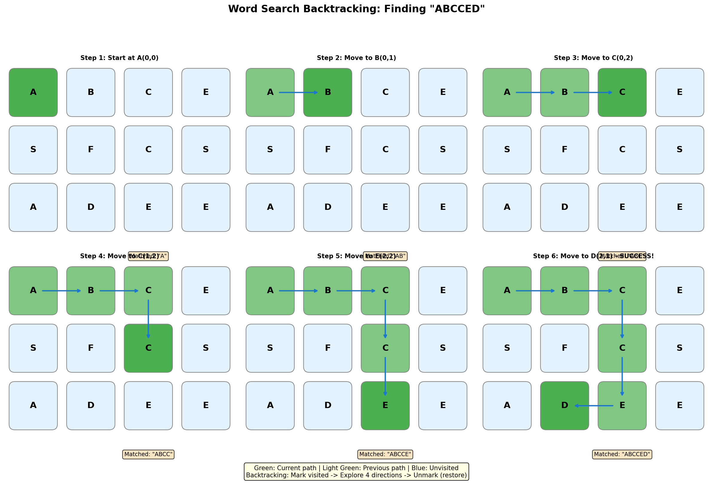
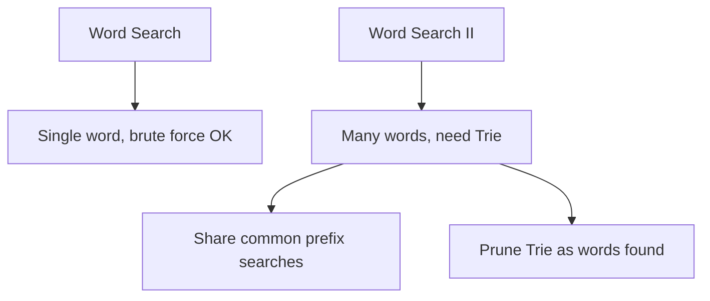
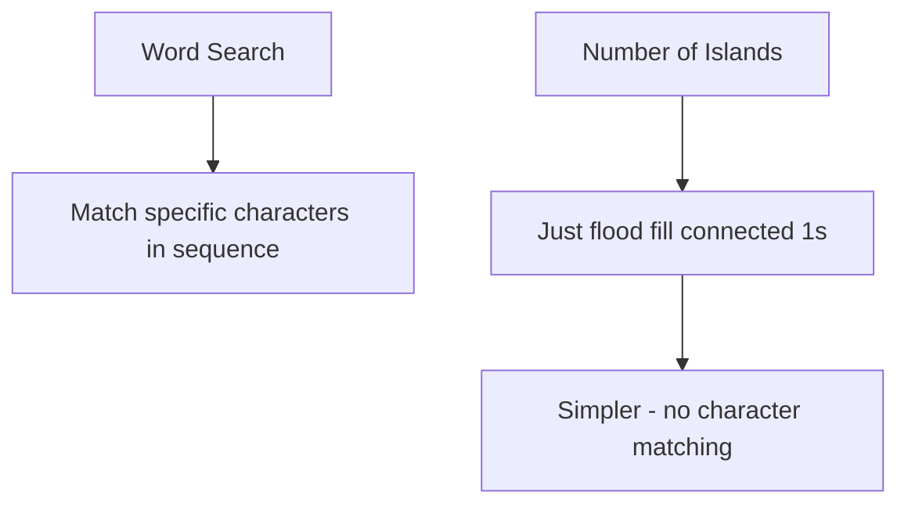
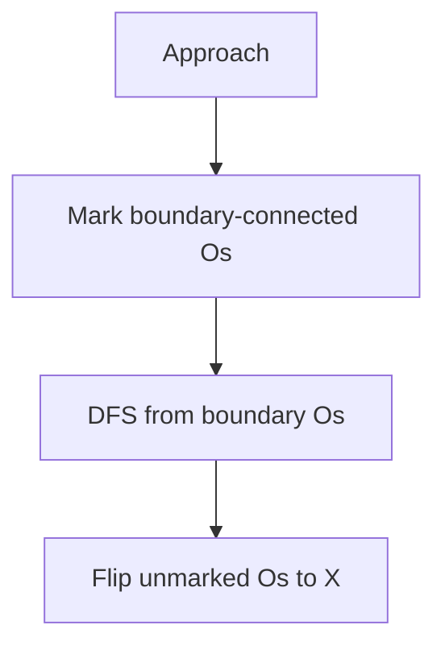
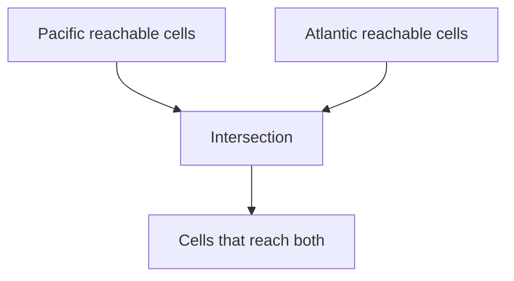

# Word Search

> **LeetCode**: [79. Word Search](https://leetcode.com/problems/word-search/)
> **Difficulty**: Medium
> **Pattern**: Grid Backtracking

---

## Problem Statement

Given an `m x n` grid of characters `board` and a string `word`, return `true` if `word` exists in the grid.

The word can be constructed from letters of sequentially adjacent cells, where adjacent cells are horizontally or vertically neighboring. The same letter cell may not be used more than once.

---

## Examples

### Example 1
```
Input: board = [["A","B","C","E"],
                ["S","F","C","S"],
                ["A","D","E","E"]], word = "ABCCED"
Output: true
```

### Example 2
```
Input: board = [["A","B","C","E"],
                ["S","F","C","S"],
                ["A","D","E","E"]], word = "SEE"
Output: true
```

### Example 3
```
Input: board = [["A","B","C","E"],
                ["S","F","C","S"],
                ["A","D","E","E"]], word = "ABCB"
Output: false
```

---

## Constraints

- `m == board.length`
- `n == board[i].length`
- `1 <= m, n <= 6`
- `1 <= word.length <= 15`
- `board` and `word` consists of only lowercase and uppercase English letters

---

## Grid Backtracking Visualization



### Search Process for "ABCCED"

```
Board:
    A  B  C  E
    S  F  C  S
    A  D  E  E

Finding "ABCCED":

Step 1: Find 'A' at (0,0)
    [A] B  C  E      Start here
     S  F  C  S
     A  D  E  E

Step 2: Move to 'B' at (0,1)
     A [B] C  E      Path: A -> B
     S  F  C  S
     A  D  E  E

Step 3: Move to 'C' at (0,2)
     A  B [C] E      Path: A -> B -> C
     S  F  C  S
     A  D  E  E

Step 4: Move to 'C' at (1,2)
     A  B  C  E      Path: A -> B -> C -> C
     S  F [C] S
     A  D  E  E

Step 5: Move to 'E' at (2,2)
     A  B  C  E      Path: A -> B -> C -> C -> E
     S  F  C  S
     A  D [E] E

Step 6: Move to 'D' at (2,1)
     A  B  C  E      Path: A -> B -> C -> C -> E -> D
     S  F  C  S      COMPLETE! Return True
     A [D] E  E
```

---

## Backtracking Template

```python
def exist(board, word):
    """
    Grid backtracking template.

    Key steps:
    1. Try each cell as starting point
    2. DFS in 4 directions
    3. Mark visited, restore on backtrack
    """
    rows, cols = len(board), len(board[0])

    def backtrack(r, c, idx):
        # BASE CASE: found complete word
        if idx == len(word):
            return True

        # BOUNDARY/VALIDITY CHECK
        if (r < 0 or r >= rows or c < 0 or c >= cols or
            board[r][c] != word[idx]):
            return False

        # MARK VISITED (in-place)
        temp = board[r][c]
        board[r][c] = '#'

        # EXPLORE 4 directions
        found = (backtrack(r + 1, c, idx + 1) or
                 backtrack(r - 1, c, idx + 1) or
                 backtrack(r, c + 1, idx + 1) or
                 backtrack(r, c - 1, idx + 1))

        # RESTORE (backtrack)
        board[r][c] = temp

        return found

    # Try each cell as starting point
    for r in range(rows):
        for c in range(cols):
            if backtrack(r, c, 0):
                return True

    return False
```

---

## Solutions

### Solution 1: Basic Backtracking (Recommended)

```python
def exist(board: list, word: str) -> bool:
    """
    Find word in grid using backtracking.

    Time Complexity: O(m * n * 4^L) where L = len(word)
    Space Complexity: O(L) for recursion depth
    """
    rows, cols = len(board), len(board[0])

    def backtrack(r, c, idx):
        if idx == len(word):
            return True

        if (r < 0 or r >= rows or c < 0 or c >= cols or
            board[r][c] != word[idx]):
            return False

        # Mark as visited
        temp = board[r][c]
        board[r][c] = '#'

        # Explore all 4 directions
        found = (backtrack(r + 1, c, idx + 1) or
                 backtrack(r - 1, c, idx + 1) or
                 backtrack(r, c + 1, idx + 1) or
                 backtrack(r, c - 1, idx + 1))

        # Restore
        board[r][c] = temp

        return found

    for r in range(rows):
        for c in range(cols):
            if backtrack(r, c, 0):
                return True

    return False


# Test
board = [["A","B","C","E"],["S","F","C","S"],["A","D","E","E"]]
print(exist(board, "ABCCED"))  # True
print(exist(board, "SEE"))     # True
print(exist(board, "ABCB"))    # False
```

::: info Complexity: Time O(m * n * 4^L) · Space O(L)
- **Time:** We try each of m*n cells as a starting point. From each cell, we can branch in 4 directions, exploring up to 4^L paths where L is the word length.
- **Space:** Recursion depth equals word length L. In-place board modification (using '#') avoids extra visited storage.
:::

### Solution 2: With Direction Array

```python
def exist_directions(board: list, word: str) -> bool:
    """
    Using direction array for cleaner code.

    Time Complexity: O(m * n * 4^L)
    Space Complexity: O(L)
    """
    rows, cols = len(board), len(board[0])
    directions = [(0, 1), (0, -1), (1, 0), (-1, 0)]

    def backtrack(r, c, idx):
        if idx == len(word):
            return True

        if (r < 0 or r >= rows or c < 0 or c >= cols or
            board[r][c] != word[idx]):
            return False

        temp = board[r][c]
        board[r][c] = '#'

        for dr, dc in directions:
            if backtrack(r + dr, c + dc, idx + 1):
                board[r][c] = temp
                return True

        board[r][c] = temp
        return False

    for r in range(rows):
        for c in range(cols):
            if backtrack(r, c, 0):
                return True

    return False


# Test
board = [["A","B","C","E"],["S","F","C","S"],["A","D","E","E"]]
print(exist_directions(board, "ABCCED"))  # True
```

::: info Complexity: Time O(m * n * 4^L) · Space O(L)
- **Time:** Same complexity; using a direction array is just a cleaner code organization without affecting performance.
- **Space:** Still O(L) for recursion depth; the directions list is constant size (4 elements).
:::

### Solution 3: With Visited Set (Alternative)

```python
def exist_visited_set(board: list, word: str) -> bool:
    """
    Using a visited set instead of modifying board.

    Doesn't modify input but uses more space.

    Time Complexity: O(m * n * 4^L)
    Space Complexity: O(L) for recursion + O(L) for visited
    """
    rows, cols = len(board), len(board[0])

    def backtrack(r, c, idx, visited):
        if idx == len(word):
            return True

        if (r < 0 or r >= rows or c < 0 or c >= cols or
            (r, c) in visited or
            board[r][c] != word[idx]):
            return False

        visited.add((r, c))

        found = (backtrack(r + 1, c, idx + 1, visited) or
                 backtrack(r - 1, c, idx + 1, visited) or
                 backtrack(r, c + 1, idx + 1, visited) or
                 backtrack(r, c - 1, idx + 1, visited))

        visited.remove((r, c))

        return found

    for r in range(rows):
        for c in range(cols):
            if backtrack(r, c, 0, set()):
                return True

    return False


# Test
board = [["A","B","C","E"],["S","F","C","S"],["A","D","E","E"]]
print(exist_visited_set(board, "ABCCED"))  # True
```

::: info Complexity: Time O(m * n * 4^L) · Space O(L)
- **Time:** Same worst-case complexity. The visited set provides the same functionality as in-place marking.
- **Space:** O(L) for both recursion depth and the visited set (which stores at most L cell coordinates along the current path).
:::

### Solution 4: With Pruning Optimization

```python
from collections import Counter

def exist_optimized(board: list, word: str) -> bool:
    """
    Optimized with frequency-based pruning.

    If board doesn't have enough letters, return False early.
    Also, reverse word if first char is more common than last.

    Time Complexity: O(m * n * 4^L)
    Space Complexity: O(m * n + L)
    """
    rows, cols = len(board), len(board[0])

    # Count letters in board
    board_count = Counter(c for row in board for c in row)
    word_count = Counter(word)

    # Check if board has all required letters
    for char, count in word_count.items():
        if board_count.get(char, 0) < count:
            return False

    # Reverse word if first char is more common (start from rarer char)
    if board_count.get(word[0], 0) > board_count.get(word[-1], 0):
        word = word[::-1]

    def backtrack(r, c, idx):
        if idx == len(word):
            return True

        if (r < 0 or r >= rows or c < 0 or c >= cols or
            board[r][c] != word[idx]):
            return False

        temp = board[r][c]
        board[r][c] = '#'

        found = (backtrack(r + 1, c, idx + 1) or
                 backtrack(r - 1, c, idx + 1) or
                 backtrack(r, c + 1, idx + 1) or
                 backtrack(r, c - 1, idx + 1))

        board[r][c] = temp
        return found

    for r in range(rows):
        for c in range(cols):
            if backtrack(r, c, 0):
                return True

    return False


# Test
board = [["A","B","C","E"],["S","F","C","S"],["A","D","E","E"]]
print(exist_optimized(board, "ABCCED"))  # True
```

::: info Complexity: Time O(m * n * 4^L) · Space O(m * n + L)
- **Time:** Same worst-case, but pruning (frequency check, starting from rarer character) improves average case significantly.
- **Space:** O(m * n) for the board character counter, O(L) for word counter, plus O(L) recursion depth.
:::

---

## Complexity Analysis

| Approach | Time | Space | Notes |
|----------|------|-------|-------|
| Basic | O(m*n*4^L) | O(L) | L = word length |
| With Set | O(m*n*4^L) | O(L) | Doesn't modify board |
| Optimized | O(m*n*4^L) | O(m*n+L) | Better average case |

### Why O(4^L)?

- At each cell, we can move in 4 directions
- We make up to L moves for a word of length L
- Upper bound: 4^L paths (though many get pruned)

In practice, much faster due to:
- Character mismatches prune early
- Visited cells block paths
- Board boundaries limit options

---

## Common Mistakes

### 1. Forgetting to Restore State
```python
# WRONG - board is permanently modified
def backtrack(r, c, idx):
    board[r][c] = '#'  # Mark visited
    result = backtrack(r+1, c, idx+1) or ...
    return result  # Forgot to restore!

# CORRECT
def backtrack(r, c, idx):
    temp = board[r][c]
    board[r][c] = '#'
    result = backtrack(r+1, c, idx+1) or ...
    board[r][c] = temp  # Restore!
    return result
```

### 2. Checking Bounds After Access
```python
# WRONG - accesses board before bounds check
def backtrack(r, c, idx):
    if board[r][c] != word[idx]:  # May crash!
        return False
    if r < 0 or r >= rows:  # Too late!
        return False

# CORRECT - bounds check first
def backtrack(r, c, idx):
    if r < 0 or r >= rows or c < 0 or c >= cols:
        return False
    if board[r][c] != word[idx]:
        return False
```

### 3. Using 8 Directions Instead of 4
```python
# WRONG - diagonals aren't "adjacent" in this problem
directions = [(0,1), (0,-1), (1,0), (-1,0), (1,1), (1,-1), (-1,1), (-1,-1)]

# CORRECT - only horizontal and vertical
directions = [(0, 1), (0, -1), (1, 0), (-1, 0)]
```

---

## Related Problems

::: details Word Search II (LeetCode 212)
**Problem:** Given a board and list of words, find all words that exist on the board.

**Key Insight:** Multiple words - use Trie to share prefix searches.



**Approach:** Build Trie from words, DFS on grid following Trie paths, prune after finding words.

**Complexity:** O(m * n * 4^L) total vs O(m * n * 4^L * W) naive

**Link:** [Local Solution](./word-search-ii.md)
:::

::: details Number of Islands (LeetCode 200)
**Problem:** Count number of islands (groups of connected 1s) in a grid.

**Key Insight:** Same grid DFS pattern but simpler - just flood fill, no word matching.



**Approach:** DFS/BFS from each unvisited land cell, mark entire island as visited, count islands.

**Complexity:** O(m * n) time, O(m * n) space for visited or stack

**Link:** [LeetCode 200](https://leetcode.com/problems/number-of-islands/)
:::

::: details Surrounded Regions (LeetCode 130)
**Problem:** Capture regions surrounded by 'X'. Flip all 'O' not on boundary to 'X'.

**Key Insight:** Reverse thinking - find 'O's connected to boundary, flip the rest.



**Approach:** DFS from boundary 'O's, mark as safe. Then flip all unmarked 'O's to 'X'.

**Complexity:** O(m * n) time, O(m * n) space

**Link:** [LeetCode 130](https://leetcode.com/problems/surrounded-regions/)
:::

::: details Pacific Atlantic Water Flow (LeetCode 417)
**Problem:** Find cells where water can flow to both Pacific and Atlantic oceans.

**Key Insight:** Reverse flow - DFS from ocean edges inward to find reachable cells.



**Approach:** DFS from Pacific edge, DFS from Atlantic edge, return intersection.

**Complexity:** O(m * n) time, O(m * n) space

**Link:** [LeetCode 417](https://leetcode.com/problems/pacific-atlantic-water-flow/)
:::

---

## Interview Tips

1. **Start with the approach**: Explain backtracking with in-place marking
2. **Handle edge cases**: Empty word, empty board
3. **Discuss the marking strategy**: In-place vs visited set
4. **Mention optimizations**: Letter frequency check, reverse word
5. **Walk through example**: Trace path on small grid

---

## Key Takeaways

1. **Grid backtracking template**: bounds check -> match check -> mark -> explore -> restore
2. **In-place marking** with special character saves space
3. **4 directions only** - not 8 (diagonals not adjacent)
4. **Return True early** when found - don't explore all paths
5. **Pruning helps**: Character frequency pre-check

---

*Last updated: January 2026*
