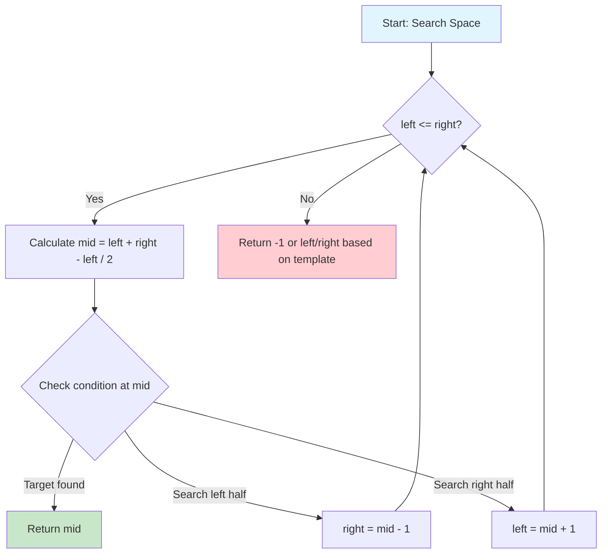
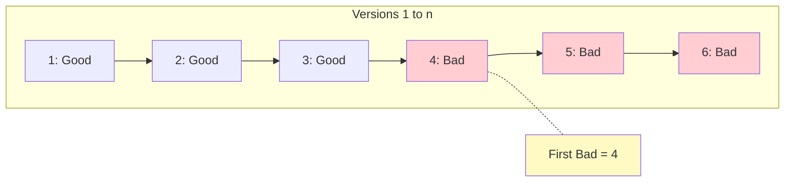
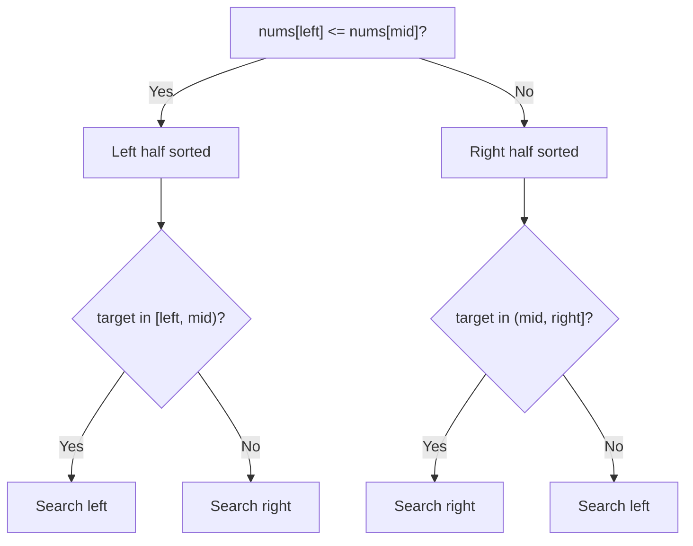
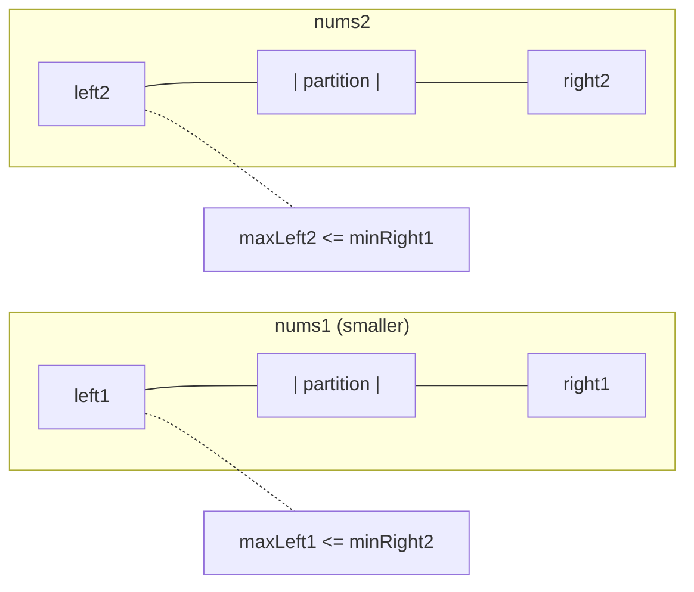

# Binary Search

> **$O(\log n)$ search in sorted/monotonic data**

---

## Overview

Binary Search is one of the most fundamental and efficient searching algorithms, with a time complexity of **$O(\log n)$**. It works by repeatedly dividing the search space in half until the target is found or the search space is exhausted.

### When to Use Binary Search

1. **Sorted Arrays**: The classic use case - searching for an element in a sorted array
2. **Monotonic Functions**: When there's a monotonic relationship (always increasing or decreasing)
3. **Search Space Reduction**: When you can eliminate half of the possibilities with each comparison
4. **Optimization Problems**: Finding minimum/maximum values that satisfy a condition
5. **Answer Range Problems**: When the answer lies between a range L to R with monotonic behavior

### Key Insight

Binary search is applicable whenever you can answer a **yes/no question** about your search space, and the answers form a pattern like:
- `F F F F F T T T T` (find first True)
- `T T T T T F F F F` (find last True)

---

## Visual Guides

### Binary Search Step-by-Step


### Search Space Halving (O(log n))


### Left Bound vs Right Bound


### Linear vs Binary Search


---

## The Three Templates

### Template 1: Basic (Find Exact Match)

Use when searching for an **exact value** in a sorted array.

```python
def binary_search(nums, target):
    """
    Find exact match in sorted array.
    Returns index if found, -1 otherwise.

    Time: O(log n), Space: O(1)
    """
    left, right = 0, len(nums) - 1

    while left <= right:
        mid = left + (right - left) // 2  # Prevents overflow

        if nums[mid] == target:
            return mid
        elif nums[mid] < target:
            left = mid + 1
        else:
            right = mid - 1

    return -1
```

::: info Complexity: Time O(log n) · Space O(1)
- **Time:** Each iteration halves search space; at most log2(n) comparisons to find target or exhaust space
- **Space:** Only constant variables for left, right, and mid pointers
:::

**Key Points:**
- Loop condition: `left <= right` (inclusive bounds)
- Search space: `[left, right]`
- Termination: when `left > right` (search space empty)
- Returns: exact index or -1

### Template 2: Left Bound (First Occurrence / Lower Bound)

Use when finding the **first position** where condition is true, or **insert position**.

```python
def search_left(nums, target):
    """
    Find leftmost position where target could be inserted.
    Returns first index where nums[i] >= target.

    This is equivalent to bisect_left.
    Time: O(log n), Space: O(1)
    """
    left, right = 0, len(nums)  # Note: right = len(nums), not len(nums) - 1

    while left < right:
        mid = left + (right - left) // 2

        if nums[mid] < target:
            left = mid + 1
        else:
            right = mid  # Don't exclude mid, it could be the answer

    return left

def find_first_occurrence(nums, target):
    """Find first occurrence of target in sorted array."""
    idx = search_left(nums, target)
    if idx < len(nums) and nums[idx] == target:
        return idx
    return -1
```

::: info Complexity: Time O(log n) · Space O(1)
- **Time:** Each iteration shrinks search space by half until left == right
- **Space:** Only constant space for pointer variables
:::

**Key Points:**
- Loop condition: `left < right` (non-inclusive right)
- Search space: `[left, right)`
- When condition is true: `right = mid` (keep mid in search space)
- Termination: when `left == right` (single element)
- Returns: leftmost valid position

### Template 3: Right Bound (Last Occurrence / Upper Bound)

Use when finding the **last position** of an element.

```python
def search_right(nums, target):
    """
    Find rightmost position where target could be inserted.
    Returns first index where nums[i] > target.

    This is equivalent to bisect_right.
    Time: O(log n), Space: O(1)
    """
    left, right = 0, len(nums)

    while left < right:
        mid = left + (right - left) // 2

        if nums[mid] <= target:
            left = mid + 1  # Move past elements <= target
        else:
            right = mid

    return left  # This is the insertion point

def find_last_occurrence(nums, target):
    """Find last occurrence of target in sorted array."""
    idx = search_right(nums, target) - 1
    if idx >= 0 and nums[idx] == target:
        return idx
    return -1
```

::: info Complexity: Time O(log n) · Space O(1)
- **Time:** Same as left bound - logarithmic search for rightmost position
- **Space:** Constant space for pointer variables
:::

**Key Points:**
- Difference from Template 2: condition is `nums[mid] <= target`
- Returns position AFTER the last occurrence
- Subtract 1 to get actual last occurrence

---

## Universal Template (Minimizing k)

A powerful generalized template that works for most binary search problems:

```python
def binary_search_universal(search_space, condition):
    """
    Find minimum k in search_space such that condition(k) is True.

    Pattern: F F F F T T T T
             ^       ^
             |       First True (what we want)
             Last False
    """
    left, right = min(search_space), max(search_space) + 1

    while left < right:
        mid = left + (right - left) // 2

        if condition(mid):
            right = mid      # Condition is True, search left for smaller k
        else:
            left = mid + 1   # Condition is False, search right

    return left  # Minimum k where condition(k) is True
```

**To adapt this template:**
1. Define the **search space** (all possible answers)
2. Design the **condition function** that returns True/False
3. Initialize boundaries to include all possibilities

---

## Mermaid Diagram



### Search Space Reduction Visualization

```
Initial:  [1, 2, 3, 4, 5, 6, 7, 8, 9, 10]  Target: 7
           L                          R

Step 1:   [1, 2, 3, 4, 5, 6, 7, 8, 9, 10]  mid=5, 5<7, go right
           L              M           R

Step 2:   [1, 2, 3, 4, 5, 6, 7, 8, 9, 10]  mid=8, 8>7, go left
                          L     M     R

Step 3:   [1, 2, 3, 4, 5, 6, 7, 8, 9, 10]  mid=6, 6<7, go right
                          L  M  R

Step 4:   [1, 2, 3, 4, 5, 6, 7, 8, 9, 10]  mid=7, FOUND!
                             LMR
```

---

## Python bisect Module

Python's built-in `bisect` module provides optimized binary search functions:

```python
import bisect

# Example array with duplicates
arr = [1, 3, 3, 3, 5, 7, 9]

# bisect_left: leftmost position to insert (first occurrence)
bisect.bisect_left(arr, 3)   # Returns 1 (first index where 3 appears)

# bisect_right (or bisect): rightmost position to insert (after last occurrence)
bisect.bisect_right(arr, 3)  # Returns 4 (index after last 3)
bisect.bisect(arr, 3)        # Same as bisect_right

# insort_left: insert element maintaining sorted order (left position)
bisect.insort_left(arr, 4)   # arr becomes [1, 3, 3, 3, 4, 5, 7, 9]

# insort_right: insert element (right position)
bisect.insort_right(arr, 4)  # Inserts after existing 4s if any
```

### Practical Uses of bisect

```python
import bisect

# 1. Check if element exists
def binary_search_exists(arr, target):
    idx = bisect.bisect_left(arr, target)
    return idx < len(arr) and arr[idx] == target

# 2. Count occurrences in sorted array
def count_occurrences(arr, target):
    left = bisect.bisect_left(arr, target)
    right = bisect.bisect_right(arr, target)
    return right - left

# 3. Find range [first, last] of target
def find_range(arr, target):
    left = bisect.bisect_left(arr, target)
    right = bisect.bisect_right(arr, target) - 1
    if left <= right and arr[left] == target:
        return [left, right]
    return [-1, -1]

# 4. Find closest element
def find_closest(arr, target):
    idx = bisect.bisect_left(arr, target)
    if idx == 0:
        return arr[0]
    if idx == len(arr):
        return arr[-1]
    # Compare with neighbors
    if arr[idx] - target < target - arr[idx-1]:
        return arr[idx]
    return arr[idx-1]
```

---

## Beyond Sorted Arrays

### Binary Search on Answer

When the problem asks for an **optimal value** in a range, and you can verify if a value is feasible, use binary search on the answer space.

**Pattern Recognition:**
- "Find the minimum X such that..."
- "Find the maximum X such that..."
- "What is the smallest/largest value where..."

```python
# Example: Minimum capacity to ship within D days (LeetCode 1011)
def shipWithinDays(weights, days):
    """
    Find minimum ship capacity to deliver all packages within 'days' days.

    Search space: [max(weights), sum(weights)]
    Condition: can we ship with this capacity in <= days?
    """
    def can_ship(capacity):
        current_load = 0
        days_needed = 1

        for weight in weights:
            if current_load + weight > capacity:
                days_needed += 1
                current_load = 0
            current_load += weight

        return days_needed <= days

    # Binary search on answer
    left = max(weights)      # Minimum: at least carry heaviest item
    right = sum(weights)     # Maximum: carry everything at once

    while left < right:
        mid = (left + right) // 2
        if can_ship(mid):
            right = mid      # Can ship, try smaller capacity
        else:
            left = mid + 1   # Can't ship, need larger capacity

    return left
```

::: info Complexity: Time O(n * log(sum(weights) - max(weights))) · Space O(1)
- **Time:** Binary search over capacity range O(log(range)); each iteration simulates shipping O(n)
- **Space:** Only constant space for counters and pointers
:::

### Koko Eating Bananas (LeetCode 875)

```python
def minEatingSpeed(piles, h):
    """
    Find minimum eating speed to finish all bananas in h hours.

    Search space: [1, max(piles)]
    """
    def can_finish(speed):
        hours = 0
        for pile in piles:
            hours += (pile + speed - 1) // speed  # Ceiling division
        return hours <= h

    left, right = 1, max(piles)

    while left < right:
        mid = (left + right) // 2
        if can_finish(mid):
            right = mid
        else:
            left = mid + 1

    return left
```

::: info Complexity: Time O(n * log(max(piles))) · Space O(1)
- **Time:** Binary search over speed range [1, max(piles)]; each iteration computes hours for all piles O(n)
- **Space:** Only constant space for loop variables
:::

### Split Array Largest Sum (LeetCode 410)

```python
def splitArray(nums, k):
    """
    Split array into k subarrays minimizing the largest sum.

    Search space: [max(nums), sum(nums)]
    """
    def can_split(max_sum):
        count = 1
        current_sum = 0

        for num in nums:
            if current_sum + num > max_sum:
                count += 1
                current_sum = 0
            current_sum += num

        return count <= k

    left, right = max(nums), sum(nums)

    while left < right:
        mid = (left + right) // 2
        if can_split(mid):
            right = mid
        else:
            left = mid + 1

    return left
```

::: info Complexity: Time O(n * log(sum(nums) - max(nums))) · Space O(1)
- **Time:** Binary search on max subarray sum range; O(n) greedy split count per iteration
- **Space:** Only constant space for split tracking
:::

---

## Classic Problems

### 1. Search in Rotated Sorted Array (LeetCode 33)

```python
def search_rotated(nums, target):
    """
    Search in a rotated sorted array.

    Key insight: One half is always sorted.
    Time: O(log n), Space: O(1)
    """
    left, right = 0, len(nums) - 1

    while left <= right:
        mid = (left + right) // 2

        if nums[mid] == target:
            return mid

        # Left half is sorted
        if nums[left] <= nums[mid]:
            if nums[left] <= target < nums[mid]:
                right = mid - 1
            else:
                left = mid + 1
        # Right half is sorted
        else:
            if nums[mid] < target <= nums[right]:
                left = mid + 1
            else:
                right = mid - 1

    return -1
```

::: info Complexity: Time O(log n) · Space O(1)
- **Time:** Each iteration determines which half is sorted and eliminates the other half
- **Space:** Only constant space for pointers
:::

### 2. Find Minimum in Rotated Sorted Array (LeetCode 153)

```python
def findMin(nums):
    """
    Find minimum element in rotated sorted array.

    Time: O(log n), Space: O(1)
    """
    left, right = 0, len(nums) - 1

    while left < right:
        mid = (left + right) // 2

        if nums[mid] > nums[right]:
            # Minimum is in right half
            left = mid + 1
        else:
            # Minimum is in left half (including mid)
            right = mid

    return nums[left]
```

::: info Complexity: Time O(log n) · Space O(1)
- **Time:** Binary search comparing mid with right to determine which half contains minimum
- **Space:** Only constant pointer variables
:::

### 3. Find Peak Element (LeetCode 162)

```python
def findPeakElement(nums):
    """
    Find a peak element (greater than neighbors).

    Key insight: If mid < mid+1, peak exists on right.
    Time: O(log n), Space: O(1)
    """
    left, right = 0, len(nums) - 1

    while left < right:
        mid = (left + right) // 2

        if nums[mid] < nums[mid + 1]:
            left = mid + 1  # Peak is on the right
        else:
            right = mid     # Peak is on the left (including mid)

    return left
```

::: info Complexity: Time O(log n) · Space O(1)
- **Time:** Binary search following ascending slope toward guaranteed peak
- **Space:** Only constant space for pointers
:::

### 4. Search a 2D Matrix (LeetCode 74)

```python
def searchMatrix(matrix, target):
    """
    Search in row-wise and column-wise sorted matrix.
    Treat as 1D sorted array.

    Time: O(log(m*n)), Space: O(1)
    """
    if not matrix or not matrix[0]:
        return False

    m, n = len(matrix), len(matrix[0])
    left, right = 0, m * n - 1

    while left <= right:
        mid = (left + right) // 2
        # Convert 1D index to 2D
        row, col = mid // n, mid % n
        val = matrix[row][col]

        if val == target:
            return True
        elif val < target:
            left = mid + 1
        else:
            right = mid - 1

    return False
```

::: info Complexity: Time O(log(m*n)) · Space O(1)
- **Time:** Matrix treated as 1D sorted array; binary search over m*n elements
- **Space:** Only constant space for index conversion and pointers
:::

### 5. First and Last Position (LeetCode 34)

```python
def searchRange(nums, target):
    """
    Find first and last position of target.

    Time: O(log n), Space: O(1)
    """
    def find_first():
        left, right = 0, len(nums)
        while left < right:
            mid = (left + right) // 2
            if nums[mid] < target:
                left = mid + 1
            else:
                right = mid
        return left

    def find_last():
        left, right = 0, len(nums)
        while left < right:
            mid = (left + right) // 2
            if nums[mid] <= target:
                left = mid + 1
            else:
                right = mid
        return left - 1

    first = find_first()
    if first == len(nums) or nums[first] != target:
        return [-1, -1]

    return [first, find_last()]
```

::: info Complexity: Time O(log n) · Space O(1)
- **Time:** Two binary searches - one for first occurrence, one for last
- **Space:** Only constant space for pointers
:::

### 6. Find K Closest Elements (LeetCode 658)

```python
def findClosestElements(arr, k, x):
    """
    Find k closest elements to x.

    Binary search for the left bound of the window.
    Time: O(log(n-k) + k), Space: O(1)
    """
    left, right = 0, len(arr) - k

    while left < right:
        mid = (left + right) // 2

        # Compare distances from x to window boundaries
        if x - arr[mid] > arr[mid + k] - x:
            left = mid + 1
        else:
            right = mid

    return arr[left:left + k]
```

::: info Complexity: Time O(log(n-k) + k) · Space O(1)
- **Time:** Binary search for window start O(log(n-k)); slicing result O(k)
- **Space:** Only constant space for binary search; output slice not counted
:::

---

## Google Interview Applications

Based on recent interview patterns, here are key binary search applications frequently seen in Google interviews:

### 1. Median of Two Sorted Arrays (LeetCode 4) - Hard

```python
def findMedianSortedArrays(nums1, nums2):
    """
    Find median of two sorted arrays in O(log(min(m,n))).

    Key insight: Binary search on partition point.
    """
    if len(nums1) > len(nums2):
        nums1, nums2 = nums2, nums1

    m, n = len(nums1), len(nums2)
    left, right = 0, m

    while left <= right:
        partition1 = (left + right) // 2
        partition2 = (m + n + 1) // 2 - partition1

        maxLeft1 = float('-inf') if partition1 == 0 else nums1[partition1 - 1]
        minRight1 = float('inf') if partition1 == m else nums1[partition1]

        maxLeft2 = float('-inf') if partition2 == 0 else nums2[partition2 - 1]
        minRight2 = float('inf') if partition2 == n else nums2[partition2]

        if maxLeft1 <= minRight2 and maxLeft2 <= minRight1:
            if (m + n) % 2 == 0:
                return (max(maxLeft1, maxLeft2) + min(minRight1, minRight2)) / 2
            else:
                return max(maxLeft1, maxLeft2)
        elif maxLeft1 > minRight2:
            right = partition1 - 1
        else:
            left = partition1 + 1

    return 0.0
```

::: info Complexity: Time O(log(min(m,n))) · Space O(1)
- **Time:** Binary search on smaller array to find partition point; constant work per iteration
- **Space:** Only constant space for partition indices and boundary values
:::

### 2. Allocate Books / Painter's Partition

```python
def allocate_books(books, students):
    """
    Minimize maximum pages allocated to any student.

    Common Google interview problem.
    """
    if len(books) < students:
        return -1

    def can_allocate(max_pages):
        students_needed = 1
        current_pages = 0

        for pages in books:
            if current_pages + pages > max_pages:
                students_needed += 1
                current_pages = 0
            current_pages += pages

        return students_needed <= students

    left, right = max(books), sum(books)

    while left < right:
        mid = (left + right) // 2
        if can_allocate(mid):
            right = mid
        else:
            left = mid + 1

    return left
```

::: info Complexity: Time O(n * log(sum(books) - max(books))) · Space O(1)
- **Time:** Binary search on max pages range; O(n) allocation check per iteration
- **Space:** Only constant space for tracking allocation
:::

### 3. Aggressive Cows / Magnetic Force Between Balls (LeetCode 1552)

```python
def maxDistance(position, m):
    """
    Place m balls to maximize minimum distance between any two.

    Binary search on the answer (minimum distance).
    """
    position.sort()

    def can_place(min_dist):
        count = 1
        last_pos = position[0]

        for i in range(1, len(position)):
            if position[i] - last_pos >= min_dist:
                count += 1
                last_pos = position[i]

        return count >= m

    left, right = 1, position[-1] - position[0]

    while left < right:
        mid = (left + right + 1) // 2  # Note: +1 for maximization
        if can_place(mid):
            left = mid
        else:
            right = mid - 1

    return left
```

::: info Complexity: Time O(n * log(max_distance)) · Space O(n) for sorting
- **Time:** Sort positions O(n log n); binary search on distance with O(n) placement check
- **Space:** Sorting may require O(n) auxiliary space
:::

### 4. Capacity To Ship Packages (Variation with deadlines)

Google often adds constraints like deadlines or costs:

```python
def min_cost_shipping(weights, days, costs):
    """
    Find minimum cost ship that can deliver within days.
    Ships have different capacities and costs.
    """
    def can_deliver(capacity):
        current = 0
        days_needed = 1
        for w in weights:
            if current + w > capacity:
                days_needed += 1
                current = 0
            current += w
        return days_needed <= days

    # Sort ships by capacity, find minimum capacity that works
    valid_ships = []
    for capacity, cost in costs:
        if can_deliver(capacity):
            valid_ships.append((cost, capacity))

    return min(valid_ships)[0] if valid_ships else -1
```

---

## Common Mistakes and Tips

### Mistakes to Avoid

1. **Integer Overflow**: Use `mid = left + (right - left) // 2` instead of `mid = (left + right) // 2`

2. **Wrong Loop Condition**:
   - `left <= right` for Template 1 (exact match)
   - `left < right` for Templates 2 and 3 (boundary search)

3. **Off-by-One Errors**: Be careful with `right = len(nums)` vs `right = len(nums) - 1`

4. **Infinite Loops**: Ensure `left` or `right` always changes in each iteration

5. **Missing Edge Cases**: Handle empty arrays, single elements, and not-found cases

### Tips for Interviews

1. **Clarify the Problem**: Ask about duplicates, sorted order, and expected output

2. **Identify the Pattern**:
   - Exact match -> Template 1
   - First occurrence / lower bound -> Template 2
   - Last occurrence / upper bound -> Template 3
   - Optimization -> Binary search on answer

3. **Define Search Space**: Always clearly identify `left` and `right` boundaries

4. **Design Condition Function**: For "binary search on answer" problems, the condition function is key

5. **Test with Examples**: Walk through with small examples to verify correctness

---

## Practice Problems by Difficulty

### Easy

::: details Binary Search (LeetCode 704)
**Problem:** Given a sorted array of integers and a target value, return the index if the target is found, otherwise return -1.

**Key Insight:** Classic binary search on a sorted array - the foundation of all binary search problems.

**Approach:** Initialize left and right pointers, repeatedly calculate mid and compare with target. Narrow search space by half each iteration.

**Complexity:** O(log n) time, O(1) space
:::

::: details Search Insert Position (LeetCode 35)
**Problem:** Given a sorted array and a target, return the index if found, or the index where it would be inserted to maintain sorted order.

**Key Insight:** This is essentially finding the leftmost position where `nums[i] >= target` (lower bound).

**Approach:** Use left bound binary search template. When loop ends, `left` points to the insertion position regardless of whether target exists.

**Complexity:** O(log n) time, O(1) space
:::

::: details First Bad Version (LeetCode 278)
**Problem:** Given n versions where all versions after the first bad one are also bad, find the first bad version using an API `isBadVersion(version)`.

**Key Insight:** Binary search for the boundary between good (False) and bad (True) versions. Pattern: `G G G G B B B B` - find first Bad.

**Approach:** Use left bound template. If `isBadVersion(mid)` is True, search left (including mid); otherwise search right.

**Complexity:** O(log n) time, O(1) space


:::

::: details Sqrt(x) (LeetCode 69)
**Problem:** Given a non-negative integer x, return the square root of x rounded down to the nearest integer.

**Key Insight:** Binary search on the answer space [0, x]. Find the largest integer `k` where `k * k <= x`.

**Approach:** Search space is [1, x/2] for x >= 2. For each mid, if `mid * mid <= x`, record mid as potential answer and search right; otherwise search left.

**Complexity:** O(log x) time, O(1) space
:::

### Medium

::: details Search in Rotated Sorted Array (LeetCode 33)
**Problem:** Search for a target in a rotated sorted array with distinct values. Return index or -1.

**Key Insight:** At least one half of the array is always sorted. Determine which half is sorted, then check if target lies within that sorted range.

**Approach:** Compare `nums[left]` with `nums[mid]` to identify sorted half. If target is in sorted half's range, search there; otherwise search the other half.

**Complexity:** O(log n) time, O(1) space


:::

::: details Find First and Last Position (LeetCode 34)
**Problem:** Given a sorted array with duplicates, find the starting and ending position of a given target value.

**Key Insight:** Run two binary searches - one for left bound (first occurrence) and one for right bound (last occurrence).

**Approach:** Use `bisect_left` to find first position where `nums[i] >= target`. Use modified search to find first position where `nums[i] > target`, then subtract 1.

**Complexity:** O(log n) time, O(1) space
:::

::: details Find Peak Element (LeetCode 162)
**Problem:** Find a peak element (strictly greater than neighbors) in an array. Boundaries are considered -infinity.

**Key Insight:** If `nums[mid] < nums[mid+1]`, a peak must exist on the right (rising slope). Otherwise, peak is on left or at mid.

**Approach:** Binary search without a target. Compare mid with mid+1 to decide direction. Guaranteed to find a peak due to boundary conditions.

**Complexity:** O(log n) time, O(1) space
:::

::: details Koko Eating Bananas (LeetCode 875)
**Problem:** Koko eats bananas at speed k per hour. Find minimum k to finish all piles within h hours.

**Key Insight:** Binary search on the answer (eating speed). The condition `canFinish(speed)` is monotonic - if Koko can finish at speed k, she can finish at any speed > k.

**Approach:** Search space: [1, max(piles)]. For each speed, calculate total hours needed (ceiling division). Find minimum speed where hours <= h.

**Complexity:** O(n * log(max(piles))) time, O(1) space
:::

::: details Capacity To Ship Packages (LeetCode 1011)
**Problem:** Ship packages with given weights within D days. Find minimum ship capacity.

**Key Insight:** Binary search on capacity. Similar to Koko - the feasibility function is monotonic.

**Approach:** Search space: [max(weights), sum(weights)]. For each capacity, greedily count days needed. Find minimum capacity where days <= D.

**Complexity:** O(n * log(sum)) time, O(1) space
:::

::: details Find K Closest Elements (LeetCode 658)
**Problem:** Given a sorted array, find k elements closest to target x, returned in sorted order.

**Key Insight:** Binary search for the left boundary of the k-element window. Compare distances from x to window endpoints.

**Approach:** Search for optimal left index in range [0, n-k]. Compare `x - arr[mid]` with `arr[mid+k] - x` to decide direction.

**Complexity:** O(log(n-k) + k) time, O(1) space
:::

### Hard

::: details Median of Two Sorted Arrays (LeetCode 4)
**Problem:** Find the median of two sorted arrays in O(log(min(m,n))) time.

**Key Insight:** Binary search to partition both arrays such that all elements on left <= all elements on right. The partition point determines the median.

**Approach:** Binary search on the smaller array. For partition at i in nums1, the corresponding partition in nums2 is `(m+n+1)/2 - i`. Validate: `maxLeft1 <= minRight2` and `maxLeft2 <= minRight1`.

**Complexity:** O(log(min(m,n))) time, O(1) space


:::

::: details Split Array Largest Sum (LeetCode 410)
**Problem:** Split array into k subarrays to minimize the largest subarray sum.

**Key Insight:** Binary search on the answer (maximum subarray sum). If we can split with max sum X, we can also split with any sum > X.

**Approach:** Search space: [max(nums), sum(nums)]. For each max_sum, greedily count minimum splits needed. Find minimum max_sum that allows <= k splits.

**Complexity:** O(n * log(sum)) time, O(1) space
:::

::: details Minimize Max Distance to Gas Station (LeetCode 774)
**Problem:** Add k gas stations to minimize the maximum distance between adjacent stations.

**Key Insight:** Binary search on the answer (max distance). For a given distance D, count how many stations needed to ensure all gaps <= D.

**Approach:** For each gap, stations needed = floor(gap / D). Sum all stations needed and check if <= k. Use floating-point binary search with precision 10^-6.

**Complexity:** O(n * log(maxGap / precision)) time, O(1) space
:::

::: details Divide Chocolate (LeetCode 1231)
**Problem:** Cut chocolate bar into k+1 pieces. You get the piece with minimum sweetness. Maximize your piece's sweetness.

**Key Insight:** Binary search to maximize the minimum (opposite of Split Array). If you can get sweetness X, you might be able to get more.

**Approach:** Search space: [min(sweetness), sum//(k+1)]. For each target sweetness, greedily count how many pieces >= target can be formed. Maximize target where pieces >= k+1.

**Complexity:** O(n * log(sum)) time, O(1) space
:::

---

## Summary

| Template | Loop Condition | Use Case | Returns |
|----------|---------------|----------|---------|
| Basic | `left <= right` | Exact match | Index or -1 |
| Left Bound | `left < right` | First occurrence | Leftmost valid index |
| Right Bound | `left < right` | Last occurrence | `left - 1` after loop |
| On Answer | `left < right` | Optimization | Minimum valid value |

**Key Takeaway**: Master the universal template and practice identifying when binary search applies - not just on sorted arrays, but on any problem with a monotonic search space.

---

## References

- [LeetCode Binary Search Explore Card](https://leetcode.com/explore/learn/card/binary-search/)
- [Powerful Ultimate Binary Search Template - LeetCode Discuss](https://leetcode.com/discuss/general-discussion/786126/python-powerful-ultimate-binary-search-template-solved-many-problems)
- [Binary Search Thought Process: 4 Templates](https://leetcode.com/discuss/study-guide/2306130/Binary-Search-Thought-Process:-4-Templates/)
- [Binary Search On Answer Template](https://leetcode.com/discuss/study-guide/3444552/binary-search-on-answer-template-generic-template/)
- [Top Binary Search Interview Questions - TakeUForward](https://takeuforward.org/binary-search/top-binary-search-interview-questions-structured-path-with-video-solutions)
- [Most Asked Binary Search Interview Questions - GeeksforGeeks](https://www.geeksforgeeks.org/dsa/most-asked-binary-search-interview-questions/)
- [Binary Search Interview Questions - Interviewing.io](https://interviewing.io/binary-search-interview-questions)
- [Google DS & Algo Interview Preparation Roadmap 2025](https://medium.com/@prashant558908/google-ds-algo-interview-preparation-roadmap-2025-974d15cb10cd)
