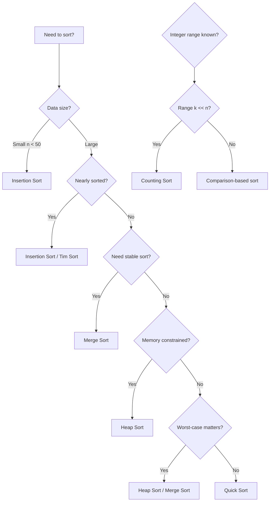
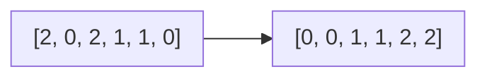
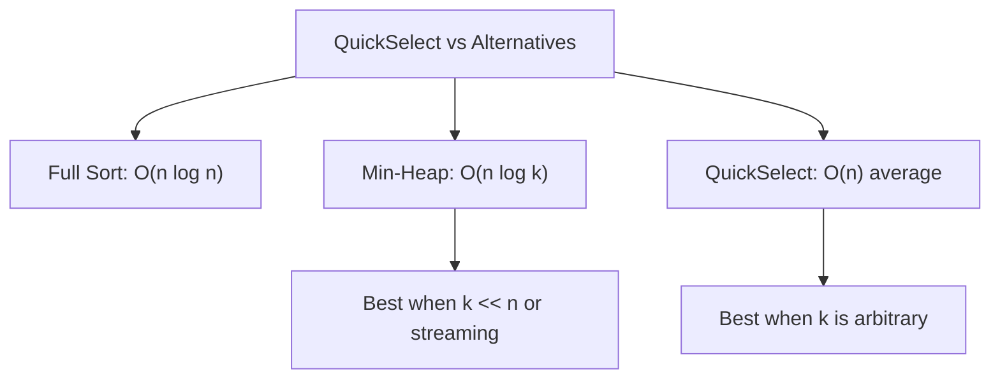

# Searching & Sorting

> **Fundamental algorithms for ordered data operations**

---

## Overview

Searching and sorting algorithms form the bedrock of computer science and are essential for any technical interview. These algorithms teach fundamental concepts like divide-and-conquer, time-space tradeoffs, and algorithm optimization that apply across all areas of programming.

**Why master these algorithms?**
- **Ubiquitous application**: Nearly every real-world system relies on efficient data organization and retrieval
- **Interview frequency**: Quick Sort, Merge Sort, and Binary Search are among the most commonly tested algorithms at top tech companies
- **Foundation for advanced topics**: Understanding these basics unlocks more complex algorithms like graph traversal and dynamic programming
- **Optimization mindset**: Learning when to use O(n log n) vs O(n^2) algorithms develops critical thinking about efficiency

---

## Document Structure

| Topic | Type | Complexity | Link |
|-------|------|------------|------|
| Sorting Algorithms | Concept | Various | [Link](./sorting-algorithms) |
| Binary Search | Concept | O(log n) | [Link](./binary-search) |
| Search in Rotated Array | Pattern | O(log n) | [Link](./rotated-array-search) |
| Two Pointer Technique | Pattern | O(n) | [Link](./two-pointer) |
| Sliding Window | Pattern | O(n) | [Link](./sliding-window) |
| Counting Sort & Radix Sort | Concept | O(n + k) | [Link](./non-comparison-sorts) |
| Quick Select | Concept | O(n) avg | [Link](./quick-select) |
| Merge Intervals | Pattern | O(n log n) | [Link](./merge-intervals) |

---

## Sorting Algorithm Comparison

| Algorithm | Best | Average | Worst | Space | Stable | In-Place |
|-----------|------|---------|-------|-------|--------|----------|
| Bubble Sort | O(n) | O(n^2) | O(n^2) | O(1) | Yes | Yes |
| Selection Sort | O(n^2) | O(n^2) | O(n^2) | O(1) | No | Yes |
| Insertion Sort | O(n) | O(n^2) | O(n^2) | O(1) | Yes | Yes |
| Merge Sort | O(n log n) | O(n log n) | O(n log n) | O(n) | Yes | No |
| Quick Sort | O(n log n) | O(n log n) | O(n^2) | O(log n) | No | Yes |
| Heap Sort | O(n log n) | O(n log n) | O(n log n) | O(1) | No | Yes |
| Counting Sort | O(n + k) | O(n + k) | O(n + k) | O(k) | Yes | No |
| Radix Sort | O(nk) | O(nk) | O(nk) | O(n + k) | Yes | No |
| Tim Sort | O(n) | O(n log n) | O(n log n) | O(n) | Yes | No |

> **Note**: Tim Sort (and its successor Powersort in Python 3.11+) is the default sorting algorithm in Python and Java for objects. Java uses Dual-Pivot Quicksort for primitives.

---

## When to Use Which Sort

### Decision Flowchart



### Algorithm Selection Guide

| Scenario | Recommended Algorithm | Reason |
|----------|----------------------|--------|
| General purpose | Quick Sort | Best average-case performance |
| Guaranteed O(n log n) | Merge Sort / Heap Sort | No worst-case degradation |
| Nearly sorted data | Insertion Sort | O(n) for nearly sorted |
| Memory constrained | Heap Sort | O(1) auxiliary space |
| Stable sort required | Merge Sort | Maintains relative order |
| Small integer range | Counting Sort | Linear time O(n + k) |
| Linked list sorting | Merge Sort | No random access needed |
| External sorting | Merge Sort | Efficient for disk I/O |
| Parallel processing | Merge Sort | Naturally parallelizable |

---

## Python Sorting Tips

```python
# Built-in sorted() vs list.sort()
arr = [3, 1, 4, 1, 5, 9, 2, 6]

sorted_arr = sorted(arr)  # Returns NEW sorted list, original unchanged
arr.sort()                # Sorts IN-PLACE, returns None

# Custom key function
students = [("Alice", 85), ("Bob", 92), ("Charlie", 78)]
sorted(students, key=lambda x: x[1])  # Sort by score
sorted(students, key=lambda x: x[1], reverse=True)  # Descending

# Multiple sort criteria
data = [("Alice", 85, 22), ("Bob", 85, 20), ("Charlie", 78, 25)]
sorted(data, key=lambda x: (-x[1], x[2]))  # By score desc, then age asc

# Using operator module (faster)
from operator import itemgetter, attrgetter
sorted(students, key=itemgetter(1))  # Sort by second element

# Sorting with custom objects
from functools import total_ordering

@total_ordering
class Student:
    def __init__(self, name, score):
        self.name = name
        self.score = score

    def __eq__(self, other):
        return self.score == other.score

    def __lt__(self, other):
        return self.score < other.score

# Sort by absolute value
sorted([-5, 2, -3, 1, -4], key=abs)  # [1, 2, -3, -4, -5]

# Case-insensitive string sort
sorted(["Banana", "apple", "Cherry"], key=str.lower)
```

---

## Binary Search Variants

Binary search goes beyond simple element lookup. Mastering these variants is crucial for interviews.

### Standard Binary Search

```python
def binary_search(arr, target):
    left, right = 0, len(arr) - 1

    while left <= right:
        mid = left + (right - left) // 2  # Prevents overflow

        if arr[mid] == target:
            return mid
        elif arr[mid] < target:
            left = mid + 1
        else:
            right = mid - 1

    return -1  # Not found
```

### Find Left Bound (First Occurrence)

```python
def find_left_bound(arr, target):
    """Find the first occurrence of target."""
    left, right = 0, len(arr) - 1
    result = -1

    while left <= right:
        mid = left + (right - left) // 2

        if arr[mid] == target:
            result = mid
            right = mid - 1  # Continue searching left
        elif arr[mid] < target:
            left = mid + 1
        else:
            right = mid - 1

    return result
```

### Find Right Bound (Last Occurrence)

```python
def find_right_bound(arr, target):
    """Find the last occurrence of target."""
    left, right = 0, len(arr) - 1
    result = -1

    while left <= right:
        mid = left + (right - left) // 2

        if arr[mid] == target:
            result = mid
            left = mid + 1  # Continue searching right
        elif arr[mid] < target:
            left = mid + 1
        else:
            right = mid - 1

    return result
```

### Using Python's bisect Module

```python
import bisect

arr = [1, 2, 2, 2, 3, 4, 5]

# bisect_left: leftmost position to insert target
bisect.bisect_left(arr, 2)   # Returns 1 (first 2's position)

# bisect_right: rightmost position to insert target
bisect.bisect_right(arr, 2)  # Returns 4 (after last 2)

# Insert while maintaining sorted order
bisect.insort_left(arr, 2.5)  # Inserts 2.5 in correct position
```

### Binary Search on Answer Space

```python
def find_minimum_capacity(weights, days):
    """
    Find minimum ship capacity to ship all packages within 'days'.
    Example of binary search on answer space.
    """
    left = max(weights)       # Minimum possible capacity
    right = sum(weights)      # Maximum possible capacity

    def can_ship(capacity):
        current_load = 0
        days_needed = 1
        for weight in weights:
            if current_load + weight > capacity:
                days_needed += 1
                current_load = weight
            else:
                current_load += weight
        return days_needed <= days

    while left < right:
        mid = left + (right - left) // 2
        if can_ship(mid):
            right = mid
        else:
            left = mid + 1

    return left
```

---

## Common Interview Patterns

### Pattern 1: Search in Rotated Sorted Array

```python
def search_rotated(nums, target):
    left, right = 0, len(nums) - 1

    while left <= right:
        mid = left + (right - left) // 2

        if nums[mid] == target:
            return mid

        # Left half is sorted
        if nums[left] <= nums[mid]:
            if nums[left] <= target < nums[mid]:
                right = mid - 1
            else:
                left = mid + 1
        # Right half is sorted
        else:
            if nums[mid] < target <= nums[right]:
                left = mid + 1
            else:
                right = mid - 1

    return -1
```

### Pattern 2: Find Peak Element

```python
def find_peak(nums):
    left, right = 0, len(nums) - 1

    while left < right:
        mid = left + (right - left) // 2

        if nums[mid] < nums[mid + 1]:
            left = mid + 1  # Peak is on the right
        else:
            right = mid     # Peak is on the left (or mid)

    return left
```

### Pattern 3: 2D Matrix Search

```python
def search_matrix(matrix, target):
    """
    Search in a row-wise and column-wise sorted matrix.
    Start from top-right corner.
    """
    if not matrix or not matrix[0]:
        return False

    rows, cols = len(matrix), len(matrix[0])
    row, col = 0, cols - 1

    while row < rows and col >= 0:
        if matrix[row][col] == target:
            return True
        elif matrix[row][col] > target:
            col -= 1
        else:
            row += 1

    return False
```

---

## Interview Focus Areas

Based on interview patterns at top tech companies, focus on these areas:

### High Priority Topics

1. **Binary Search Variations**: First/last occurrence, rotated arrays, 2D matrix search
2. **Quick Sort Implementation**: Understanding partition logic and pivot selection
3. **Merge Sort**: Especially for linked lists and external sorting scenarios
4. **Custom Comparators**: Writing complex sorting logic with multiple criteria
5. **Binary Search on Answer Space**: Finding optimal values (e.g., minimum capacity problems)

### Common Mistakes to Avoid

- **Off-by-one errors**: Carefully handle `left <= right` vs `left < right`
- **Integer overflow**: Use `left + (right - left) // 2` instead of `(left + right) // 2`
- **Edge cases**: Empty arrays, single elements, all duplicates
- **Infinite loops**: Ensure search space shrinks in every iteration

### Interview Tips

1. **Clarify constraints first**: Is the array sorted? Are there duplicates? What to return if not found?
2. **Discuss complexity upfront**: Explain why you're choosing a particular algorithm
3. **Test with edge cases**: Empty input, single element, all same elements, target at boundaries
4. **Consider stability requirements**: Ask if relative order matters for equal elements

---

## Practice Problems

### Sorting

::: details Sort Colors - Dutch National Flag (LeetCode 75)
**Problem:** Given an array with elements 0, 1, and 2 (red, white, blue), sort them in-place so same colors are adjacent in order 0, 1, 2.

**Key Insight:** Three-way partition using three pointers: `low` (boundary for 0s), `mid` (current), and `high` (boundary for 2s).

**Approach:** If `nums[mid] == 0`, swap with low and advance both. If `nums[mid] == 2`, swap with high and decrement high only. If 1, just advance mid.

**Complexity:** O(n) time (single pass), O(1) space


:::

::: details Merge Intervals (LeetCode 56)
**Problem:** Given an array of intervals, merge all overlapping intervals and return non-overlapping intervals.

**Key Insight:** After sorting by start time, two intervals overlap if `current.start <= previous.end`.

**Approach:** Sort by start time. For each interval, if it overlaps with the last merged interval, extend the end; otherwise, add it as a new interval.

**Complexity:** O(n log n) time (sorting dominates), O(n) space for output
:::

::: details Largest Number (LeetCode 179)
**Problem:** Given a list of non-negative integers, arrange them to form the largest possible number (as a string).

**Key Insight:** Custom comparator: for numbers a and b, compare strings `a+b` vs `b+a`. If `"330" > "303"`, then 3 should come before 30.

**Approach:** Convert to strings, sort using custom comparator `(a, b) -> compare(b+a, a+b)`. Handle edge case where result starts with "0".

**Complexity:** O(n log n * k) time where k is average digit length, O(n) space
:::

::: details Meeting Rooms II (LeetCode 253)
**Problem:** Given meeting time intervals, return the minimum number of conference rooms required.

**Key Insight:** Track when rooms become free using a min-heap of end times. If earliest ending meeting ends before new meeting starts, reuse that room.

**Approach:** Sort by start time. Use min-heap to track room end times. For each meeting, if `heap[0] <= start`, pop (room freed). Always push current end time.

**Complexity:** O(n log n) time, O(n) space for heap
:::

::: details Kth Largest Element (LeetCode 215)
**Problem:** Find the kth largest element in an unsorted array (not the kth distinct element).

**Key Insight:** QuickSelect achieves O(n) average by only recursing into the partition containing the target index.

**Approach:** Partition array around pivot. If pivot index equals target, done. If pivot index > target, recurse left; otherwise recurse right. Use random pivot to avoid O(n^2) worst case.

**Complexity:** O(n) average, O(n^2) worst case time; O(1) space


:::

### Binary Search

::: details Search in Rotated Sorted Array (LeetCode 33)
**Problem:** Search for a target in a rotated sorted array with distinct values.

**Key Insight:** At any point, at least one half of the array is sorted. Identify which half is sorted, then check if target lies within that range.

**Approach:** Compare `nums[left]` with `nums[mid]` to find sorted half. Check if target is in sorted half's range to decide search direction.

**Complexity:** O(log n) time, O(1) space
:::

::: details Find First and Last Position (LeetCode 34)
**Problem:** Find the starting and ending position of a target value in a sorted array with duplicates.

**Key Insight:** Use two binary searches: one for lower bound (first occurrence) and one for upper bound (after last occurrence).

**Approach:** Left bound: shrink right when `nums[mid] >= target`. Right bound: shrink left when `nums[mid] <= target`. Subtract 1 from right bound result.

**Complexity:** O(log n) time, O(1) space
:::

::: details Search a 2D Matrix (LeetCode 74)
**Problem:** Search for a value in an m x n matrix where each row is sorted and first element of each row > last element of previous row.

**Key Insight:** Treat the 2D matrix as a 1D sorted array. Convert 1D index to 2D: `row = idx // cols`, `col = idx % cols`.

**Approach:** Binary search on range [0, m*n - 1]. Convert mid to 2D coordinates to compare values.

**Complexity:** O(log(m*n)) time, O(1) space
:::

::: details Find Peak Element (LeetCode 162)
**Problem:** Find any peak element (strictly greater than neighbors). Boundaries treated as negative infinity.

**Key Insight:** If `nums[mid] < nums[mid+1]`, there must be a peak to the right (rising slope leads to peak or boundary).

**Approach:** Binary search comparing mid with mid+1. Move toward the ascending direction. Guaranteed to find peak.

**Complexity:** O(log n) time, O(1) space
:::

::: details Median of Two Sorted Arrays (LeetCode 4)
**Problem:** Find the median of two sorted arrays in O(log(min(m,n))) time.

**Key Insight:** Binary search to find partition point in smaller array. Corresponding partition in larger array is determined by half-length constraint.

**Approach:** For partition i in nums1, partition j in nums2 is `(m+n+1)/2 - i`. Valid when `maxLeft1 <= minRight2` and `maxLeft2 <= minRight1`.

**Complexity:** O(log(min(m,n))) time, O(1) space
:::

::: details Capacity to Ship Packages (LeetCode 1011)
**Problem:** Find minimum ship capacity to ship all packages within D days.

**Key Insight:** Binary search on answer (capacity). Feasibility is monotonic: if capacity X works, any capacity > X also works.

**Approach:** Search space [max(weights), sum(weights)]. For each capacity, greedily count days needed. Find minimum capacity where days <= D.

**Complexity:** O(n * log(sum)) time, O(1) space
:::

---

## References

- [Sorting and Searching Cheatsheet - Tech Interview Handbook](https://www.techinterviewhandbook.org/algorithms/sorting-searching/)
- [Sorting Algorithm Cheat Sheet - Interview Cake](https://www.interviewcake.com/sorting-algorithm-cheat-sheet)
- [Binary Search Interview Questions - Interviewing.io](https://interviewing.io/binary-search-interview-questions)
- [Top Binary Search Questions - TakeUForward](https://takeuforward.org/binary-search/top-binary-search-interview-questions-structured-path-with-video-solutions)
- [Sorting Interview Questions - Interviewing.io](https://interviewing.io/sorting-interview-questions)
- [Binary Search Problems - LeetCode](https://leetcode.com/problem-list/binary-search/)
- [Sorting Algorithms - GeeksforGeeks](https://www.geeksforgeeks.org/dsa/sorting-algorithms/)
- [50 Binary Search Questions - IGotAnOffer](https://igotanoffer.com/blogs/tech/binary-search-interview-questions)
