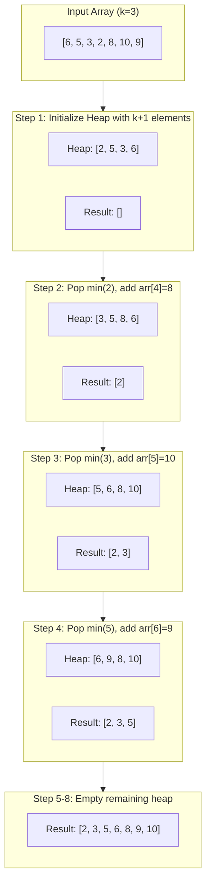
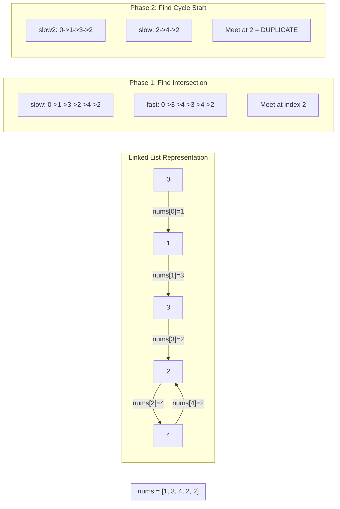
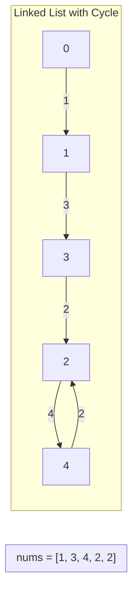
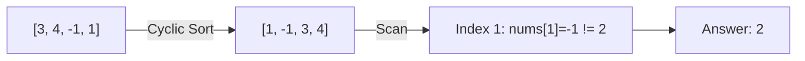

# K-Messed Array & Finding Duplicates

> **Specialized sorting and search techniques for nearly sorted arrays and duplicate detection**

---

## K-Messed Array Sort (Sort Nearly Sorted Array)

### Problem Statement

Given an array where each element is at most **k positions away** from its sorted position, sort the array efficiently. This type of array is also known as a **k-sorted array** or **nearly sorted array**.

**Key Insight**: An element at index `i` in the sorted array can only appear at indices `i-k` to `i+k` in the input array.

### Example

```
Input: arr = [6, 5, 3, 2, 8, 10, 9], k = 3
Output: [2, 3, 5, 6, 8, 9, 10]

Explanation:
- Element 2 is at index 3, should be at index 0 (distance = 3 <= k)
- Element 3 is at index 2, should be at index 1 (distance = 1 <= k)
- Element 5 is at index 1, should be at index 2 (distance = 1 <= k)
- And so on...
```

### Approach: Min Heap of Size k+1

The optimal approach uses a **min heap** of size `k+1`:

1. **Why k+1?** Since each element is at most k positions away from its target, the smallest element that should go at position 0 must be within the first k+1 elements.

2. **Sliding Window**: Maintain a heap of k+1 elements. The minimum of this window is guaranteed to be the next element in sorted order.

3. **Process**: Extract min from heap, add to result, then add the next element from the array.

### Mermaid Diagram



### Solution (Python)

```python
import heapq
from typing import List

def sort_k_messed(arr: List[int], k: int) -> List[int]:
    """
    Sort a k-messed array where each element is at most k positions
    away from its sorted position.

    Args:
        arr: The nearly sorted input array
        k: Maximum distance any element is from its sorted position

    Returns:
        The fully sorted array
    """
    if not arr or k < 0:
        return arr

    n = len(arr)
    # Create min heap with first k+1 elements
    # (or all elements if array is smaller than k+1)
    heap_size = min(k + 1, n)
    heap = arr[:heap_size]
    heapq.heapify(heap)

    result = []

    # Process remaining elements
    for i in range(heap_size, n):
        # Pop smallest element and add to result
        result.append(heapq.heappop(heap))
        # Add next element to heap
        heapq.heappush(heap, arr[i])

    # Empty remaining elements from heap
    while heap:
        result.append(heapq.heappop(heap))

    return result


# In-place version (modifies original array)
def sort_k_messed_inplace(arr: List[int], k: int) -> None:
    """
    Sort k-messed array in-place.
    """
    if not arr or k < 0:
        return

    n = len(arr)
    heap_size = min(k + 1, n)
    heap = arr[:heap_size]
    heapq.heapify(heap)

    write_idx = 0

    for i in range(heap_size, n):
        arr[write_idx] = heapq.heappop(heap)
        write_idx += 1
        heapq.heappush(heap, arr[i])

    while heap:
        arr[write_idx] = heapq.heappop(heap)
        write_idx += 1
```

::: info Complexity: Time O(n log k) · Space O(k)
- **Time:** Initialize heap O(k log k); for each of remaining n-k elements: heappop + heappush = O(log k); total O(n log k)
- **Space:** Heap maintains at most k+1 elements at any time
:::

### Complexity Analysis

| Aspect | Complexity | Explanation |
|--------|------------|-------------|
| **Time** | O(n log k) | Each of n elements: O(log k) heap operation |
| **Space** | O(k) | Heap maintains at most k+1 elements |

### Why This Works

```
For position i in sorted output:
- The element must come from positions [i-k, i+k] in input
- At step i, we've already placed elements 0 to i-1
- Remaining candidates are in positions [i, i+k] of input
- These are exactly the k+1 elements in our heap
- The minimum of these MUST be the correct element for position i
```

### Alternative Approaches

| Approach | Time | Space | Notes |
|----------|------|-------|-------|
| **Min Heap** | O(n log k) | O(k) | Optimal for large k |
| **Insertion Sort** | O(n * k) | O(1) | Better for k < 12 |
| **Bubble Sort** | O(n * k) | O(1) | k passes needed |

---

## Find the Duplicate Number (LeetCode 287)

### Problem Statement

Given an array `nums` containing `n + 1` integers where each integer is in the range `[1, n]` inclusive, find the **one repeated number**.

**Constraints:**
- You must **not modify** the array
- You must use only **O(1) extra space**
- There is only **one duplicate number**, but it could be repeated more than once

### Example

```
Input: nums = [1, 3, 4, 2, 2]
Output: 2

Input: nums = [3, 1, 3, 4, 2]
Output: 3
```

### Approach: Floyd's Cycle Detection (Tortoise and Hare)

**Key Insight**: Treat the array as a linked list where `value` at index `i` points to the next index.

```
nums = [1, 3, 4, 2, 2]
Index:  0  1  2  3  4

Traversal:
0 -> nums[0]=1 -> nums[1]=3 -> nums[3]=2 -> nums[2]=4 -> nums[4]=2 -> nums[2]=4 -> ...
                                           ^                          |
                                           |__________________________|
                                                    CYCLE!
```

The duplicate creates a cycle because two indices point to the same value.

### Mermaid Diagram



### Solution (Python)

```python
from typing import List

def findDuplicate(nums: List[int]) -> int:
    """
    Find the duplicate number using Floyd's Cycle Detection.

    The array is treated as a linked list where nums[i] points to
    the next node. Since there's a duplicate, there must be a cycle.

    Time: O(n), Space: O(1)
    """
    # Phase 1: Find the intersection point in the cycle
    # Tortoise moves one step, Hare moves two steps
    slow = nums[0]
    fast = nums[0]

    while True:
        slow = nums[slow]           # Move one step
        fast = nums[nums[fast]]     # Move two steps
        if slow == fast:
            break

    # Phase 2: Find the entrance to the cycle (the duplicate)
    # Reset one pointer to start, move both one step at a time
    slow2 = nums[0]
    while slow2 != slow:
        slow2 = nums[slow2]
        slow = nums[slow]

    return slow
```

::: info Complexity: Time O(n) · Space O(1)
- **Time:** Phase 1 finds intersection in at most 2n steps; Phase 2 finds cycle entrance in at most n steps
- **Space:** Only uses two pointer variables regardless of array size
:::

```python
# Alternative: Binary Search on value range
def findDuplicate_binary_search(nums: List[int]) -> int:
    """
    Binary search approach - O(n log n) time, O(1) space.

    For a value mid, count numbers <= mid.
    If count > mid, duplicate is in [1, mid].
    Otherwise, duplicate is in [mid+1, n].
    """
    left, right = 1, len(nums) - 1

    while left < right:
        mid = (left + right) // 2
        count = sum(1 for num in nums if num <= mid)

        if count > mid:
            right = mid
        else:
            left = mid + 1

    return left
```

::: info Complexity: Time O(n log n) · Space O(1)
- **Time:** Binary search O(log n) iterations; each iteration counts elements <= mid in O(n)
- **Space:** Only constant space for pointers and count variable
:::

### Why Floyd's Algorithm Works

```
Mathematical Proof:

Let:
- F = distance from start to cycle entrance
- C = cycle length
- a = distance from cycle entrance to meeting point

When slow and fast meet:
- slow traveled: F + a
- fast traveled: F + a + nC (for some integer n)

Since fast travels 2x speed:
2(F + a) = F + a + nC
F + a = nC
F = nC - a

This means: starting from meeting point, traveling F steps
lands at cycle entrance. Starting from beginning and traveling
F steps also lands at cycle entrance.

Hence, they meet at the cycle entrance = duplicate number!
```

### Complexity Analysis

| Approach | Time | Space | Modifies Array |
|----------|------|-------|----------------|
| **Floyd's Cycle** | O(n) | O(1) | No |
| **Binary Search** | O(n log n) | O(1) | No |
| **Sorting** | O(n log n) | O(1) | Yes |
| **HashSet** | O(n) | O(n) | No |
| **Negative Marking** | O(n) | O(1) | Yes |

---

## Find All Duplicates in Array (LeetCode 442)

### Problem Statement

Given an integer array `nums` of length `n` where all integers are in the range `[1, n]` and each integer appears **once or twice**, return an array of all the integers that appear **twice**.

**Constraint**: Solve in O(n) time and O(1) extra space (excluding output).

### Example

```
Input: nums = [4, 3, 2, 7, 8, 2, 3, 1]
Output: [2, 3]

Input: nums = [1, 1, 2]
Output: [1]
```

### Approach: Negative Marking

Use the array itself as a hash map by negating values at indices corresponding to seen numbers.

```
nums = [4, 3, 2, 7, 8, 2, 3, 1]

Process 4: Mark index 3 negative -> [4, 3, 2, -7, 8, 2, 3, 1]
Process 3: Mark index 2 negative -> [4, 3, -2, -7, 8, 2, 3, 1]
Process 2: Mark index 1 negative -> [4, -3, -2, -7, 8, 2, 3, 1]
Process 7: Mark index 6 negative -> [4, -3, -2, -7, 8, 2, -3, 1]
Process 8: Mark index 7 negative -> [4, -3, -2, -7, 8, 2, -3, -1]
Process 2: Index 1 already negative -> DUPLICATE! Add 2
Process 3: Index 2 already negative -> DUPLICATE! Add 3
Process 1: Mark index 0 negative -> [-4, -3, -2, -7, 8, 2, -3, -1]
```

### Solution (Python)

```python
from typing import List

def findDuplicates(nums: List[int]) -> List[int]:
    """
    Find all duplicates using negative marking technique.

    Since values are in range [1, n], we can use index = value - 1
    to mark visited numbers by negating the value at that index.

    Time: O(n), Space: O(1) excluding output
    """
    result = []

    for num in nums:
        # Get the index corresponding to this number
        idx = abs(num) - 1

        # If value at idx is negative, we've seen this number before
        if nums[idx] < 0:
            result.append(abs(num))
        else:
            # Mark as seen by negating
            nums[idx] = -nums[idx]

    return result


# Alternative: Cyclic sort approach
def findDuplicates_cyclic_sort(nums: List[int]) -> List[int]:
    """
    Cyclic sort approach - place each number at its correct index.
    Numbers that can't be placed correctly are duplicates.

    Time: O(n), Space: O(1)
    """
    i = 0
    while i < len(nums):
        correct_idx = nums[i] - 1
        if nums[i] != nums[correct_idx]:
            # Swap to correct position
            nums[i], nums[correct_idx] = nums[correct_idx], nums[i]
        else:
            i += 1

    # Numbers not at their correct position are duplicates
    return [nums[i] for i in range(len(nums)) if nums[i] != i + 1]
```

::: info Complexity: Time O(n) · Space O(1) excluding output
- **Time:** findDuplicates: single pass with O(1) operations per element; cyclic sort: each element swapped at most once
- **Space:** Both use array itself as hash map; no additional data structures needed
:::

### Complexity Analysis

| Aspect | Complexity |
|--------|------------|
| **Time** | O(n) |
| **Space** | O(1) excluding output |

---

## Number Finder: Missing Numbers

### Find Missing Number (Range 0 to n)

Given an array of `n` distinct numbers in range `[0, n]`, find the missing number.

```python
from typing import List

def missingNumber_sum(nums: List[int]) -> int:
    """
    Sum formula approach.
    Expected sum of [0, n] = n * (n + 1) // 2
    Missing = Expected - Actual

    Time: O(n), Space: O(1)
    """
    n = len(nums)
    expected_sum = n * (n + 1) // 2
    return expected_sum - sum(nums)


def missingNumber_xor(nums: List[int]) -> int:
    """
    XOR approach - more robust against integer overflow.

    XOR properties:
    - a ^ a = 0 (number XOR itself = 0)
    - a ^ 0 = a (number XOR 0 = number)
    - XOR is commutative and associative

    XOR all indices [0, n] with all values.
    All paired numbers cancel out, leaving the missing number.

    Time: O(n), Space: O(1)
    """
    result = len(nums)  # Start with n
    for i, num in enumerate(nums):
        result ^= i ^ num
    return result


# Example
nums = [3, 0, 1]  # Missing: 2
print(missingNumber_xor(nums))  # Output: 2
```

::: info Complexity: Time O(n) · Space O(1)
- **Time:** Sum approach: single pass to compute sum; XOR approach: single pass XORing indices and values
- **Space:** Both use only constant space for result variable
:::

### Find All Missing Numbers (Range 1 to n)

Given array of `n` integers where each is in `[1, n]`, find all numbers in `[1, n]` that don't appear.

```python
def findDisappearedNumbers(nums: List[int]) -> List[int]:
    """
    Find all missing numbers using negative marking.

    Time: O(n), Space: O(1) excluding output
    """
    # Mark indices corresponding to present numbers
    for num in nums:
        idx = abs(num) - 1
        if nums[idx] > 0:
            nums[idx] = -nums[idx]

    # Indices with positive values have missing numbers
    return [i + 1 for i in range(len(nums)) if nums[i] > 0]


# Example
nums = [4, 3, 2, 7, 8, 2, 3, 1]
print(findDisappearedNumbers(nums))  # Output: [5, 6]
```

::: info Complexity: Time O(n) · Space O(1) excluding output
- **Time:** Two passes: one to mark indices, one to collect missing numbers
- **Space:** Uses input array for marking; output list not counted
:::

### Find First Missing Positive

Find the smallest positive integer not in the array.

```python
def firstMissingPositive(nums: List[int]) -> int:
    """
    Find first missing positive using cyclic sort.

    Key insight: Answer must be in range [1, n+1]
    Place each number in [1, n] at its correct index (num-1).

    Time: O(n), Space: O(1)
    """
    n = len(nums)

    # Place each number at its correct index
    i = 0
    while i < n:
        # Target index for nums[i]
        target = nums[i] - 1

        # Swap if: number is in valid range and not at correct position
        if 0 < nums[i] <= n and nums[i] != nums[target]:
            nums[i], nums[target] = nums[target], nums[i]
        else:
            i += 1

    # Find first position where number doesn't match
    for i in range(n):
        if nums[i] != i + 1:
            return i + 1

    return n + 1


# Example
nums = [3, 4, -1, 1]
print(firstMissingPositive(nums))  # Output: 2
```

::: info Complexity: Time O(n) · Space O(1)
- **Time:** Cyclic sort places each number at most once; final scan is O(n)
- **Space:** In-place swapping uses only constant auxiliary space
:::

---

## Summary: Technique Selection Guide

### When to Use Each Technique

| Problem Type | Best Technique | Time | Space |
|-------------|---------------|------|-------|
| K-sorted array | Min Heap | O(n log k) | O(k) |
| Single duplicate (no modify) | Floyd's Cycle | O(n) | O(1) |
| Single duplicate (can modify) | Negative Marking | O(n) | O(1) |
| All duplicates | Negative Marking | O(n) | O(1) |
| Missing number (0 to n) | XOR or Sum | O(n) | O(1) |
| All missing numbers | Negative Marking | O(n) | O(1) |
| First missing positive | Cyclic Sort | O(n) | O(1) |

### Pattern Recognition

```
If values are in range [1, n] and array size is n:
    -> Consider index-as-hash techniques
    -> Negative marking
    -> Cyclic sort

If array is nearly sorted (k-sorted):
    -> Min heap of size k+1

If looking for cycle/duplicate without extra space:
    -> Floyd's Tortoise and Hare
```

---

## Google Interview Applications

These problems frequently appear in Google interviews because they test:

1. **Heap Understanding**: K-messed array sort tests heap operations and window sliding concepts.

2. **Mathematical Thinking**: Floyd's cycle detection requires understanding the mathematical proof behind the algorithm.

3. **Space Optimization**: Using array indices as hash values demonstrates creative thinking about space constraints.

4. **Constraint Handling**: Problems like "Find Duplicate Number" with multiple constraints (no modify, O(1) space) test ability to work within limitations.

### Common Follow-up Questions

| Problem | Follow-up Questions |
|---------|-------------------|
| K-Messed Sort | What if k is unknown? Can you detect k first? |
| Find Duplicate | What if there are multiple duplicates? |
| Missing Numbers | What if the range is [a, b] instead of [1, n]? |
| All Duplicates | Can you restore the original array after finding duplicates? |

### Practice Problems

::: details Find the Duplicate Number (LeetCode 287)
**Problem:** Given an array of n+1 integers where each integer is in the range [1, n] inclusive, find the one repeated number without modifying the array and using only O(1) extra space.

**Key Insight:** Treat the array as a linked list where `nums[i]` points to the next index. The duplicate creates a cycle because two indices point to the same value.

**Approach:** Use Floyd's Tortoise and Hare cycle detection. Phase 1: Find intersection point using slow (1 step) and fast (2 steps) pointers. Phase 2: Reset one pointer to start, move both at same pace to find cycle entrance (the duplicate).

**Complexity:** O(n) time, O(1) space


:::

::: details Find All Duplicates in Array (LeetCode 442)
**Problem:** Given an array of n integers where each is in range [1, n] and appears once or twice, find all integers that appear twice. Must run in O(n) time with O(1) extra space.

**Key Insight:** Since values are in range [1, n], use values as indices. Mark visited indices by negating the value at that position; if already negative, it's a duplicate.

**Approach:** For each number, compute `idx = abs(num) - 1`. If `nums[idx] < 0`, add `abs(num)` to result (duplicate found). Otherwise, negate `nums[idx]` to mark as seen.

**Complexity:** O(n) time, O(1) space (excluding output)
:::

::: details Missing Number (LeetCode 268)
**Problem:** Given an array of n distinct numbers in range [0, n], find the only number in the range that is missing.

**Key Insight:** Use mathematical properties: either Gauss sum formula or XOR. XOR approach: `a ^ a = 0` and `a ^ 0 = a`, so XORing all indices with all values leaves only the missing number.

**Approach:** XOR all indices [0, n] with all array values. Paired numbers cancel out (XOR to 0), leaving only the missing number. Alternative: Sum formula `n*(n+1)/2 - sum(nums)`.

**Complexity:** O(n) time, O(1) space
:::

::: details Find All Numbers Disappeared in Array (LeetCode 448)
**Problem:** Given an array of n integers where `nums[i]` is in range [1, n], return all integers in [1, n] that do not appear. Must use O(1) extra space (output doesn't count).

**Key Insight:** Use the array itself as a hash map by negating values at indices corresponding to seen numbers.

**Approach:** For each number, mark `nums[abs(num) - 1]` as negative if positive. After marking, indices with positive values indicate missing numbers (those indices + 1 were never seen).

**Complexity:** O(n) time, O(1) space (excluding output)
:::

::: details First Missing Positive (LeetCode 41)
**Problem:** Given an unsorted integer array, return the smallest positive integer not present. Must run in O(n) time with O(1) auxiliary space.

**Key Insight:** The answer must be in range [1, n+1] for an array of length n. Use cyclic sort to place each positive number x at index x-1.

**Approach:** Swap each number in range [1, n] to its correct position (value x goes to index x-1). Then scan array: first index i where `nums[i] != i+1` gives answer i+1. If all match, return n+1.

**Complexity:** O(n) time, O(1) space


:::

::: details Set Mismatch (LeetCode 645)
**Problem:** A set originally contained numbers 1 to n. One number got duplicated (replacing another). Given the corrupted array, find [duplicate, missing].

**Key Insight:** Combine duplicate detection with missing number detection using negative marking or XOR/sum approach.

**Approach:** Use negative marking: for each number, mark its corresponding index negative. If already negative, that's the duplicate. After marking, the index that's still positive indicates the missing number.

**Complexity:** O(n) time, O(1) space
:::

---

## References

- [Sort a Nearly K Sorted Array - DevGlan](https://www.devglan.com/datastructure/sort-a-nearly-k-sorted-array)
- [Nearly Sorted Algorithm - GeeksforGeeks](https://www.geeksforgeeks.org/dsa/nearly-sorted-algorithm/)
- [Sort a k-sorted array - Techie Delight](https://www.techiedelight.com/sort-k-sorted-array/)
- [Find the Duplicate Number - LeetCode](https://leetcode.com/problems/find-the-duplicate-number/solutions/650942/Proof-of-Floyd%27s-cycle-detection-algorithm-Find-the-Duplicate-Number/)
- [Floyd's Tortoise and Hare - Medium](https://medium.programmerscareer.com/leetcode-287-golang-find-the-duplicate-number-medium-floyds-tortoise-and-hare-and-binary-97c0afe49e65)
- [Find the Duplicate Number - AlgoMap](https://algomap.io/question-bank/find-the-duplicate-number)
