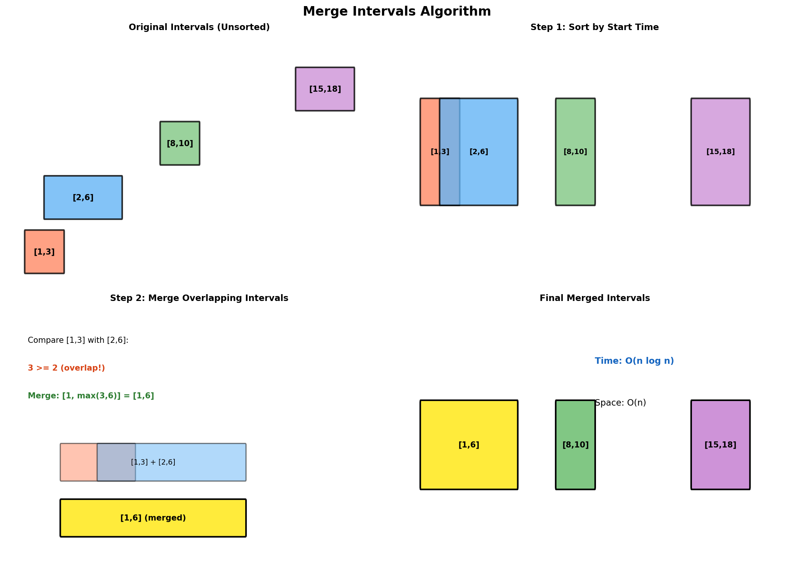

# Merge Intervals

> **$O(n \log n)$ algorithm for combining overlapping intervals**

---

## Overview

Interval problems involve working with ranges defined by start and end points. The most common operation is merging overlapping intervals, which appears frequently in scheduling, calendar applications, and range queries.

### Visual Representation



### Interval Relationships

Two intervals `[a, b]` and `[c, d]` where `a <= c` (sorted by start) can have these relationships:

| Relationship | Condition | Example |
|-------------|-----------|---------|
| **No overlap** | `b < c` | [1,3] and [5,7] |
| **Overlap** | `b >= c` | [1,4] and [3,6] |
| **Contains** | `b >= d` | [1,6] and [2,4] |
| **Same start** | `a == c` | [1,4] and [1,6] |

---

## Core Algorithm: Merge Overlapping Intervals

### Algorithm Steps

1. **Sort intervals by start time**
2. **Initialize result with first interval**
3. **For each subsequent interval**:
   - If it overlaps with last in result: merge them
   - Otherwise: add it as new interval

### Implementation

::: code-group

```python [Python]
def merge_intervals(intervals: list[list[int]]) -> list[list[int]]:
    """
    Merge all overlapping intervals.

    Args:
        intervals: List of [start, end] intervals

    Returns:
        List of merged non-overlapping intervals

    Time: O(n log n) for sorting
    Space: O(n) for result (O(log n) or O(n) for sorting)
    """
    if not intervals:
        return []

    # Sort by start time
    intervals.sort(key=lambda x: x[0])

    merged = [intervals[0]]

    for current in intervals[1:]:
        last = merged[-1]

        if current[0] <= last[1]:
            # Overlapping: merge by extending end
            last[1] = max(last[1], current[1])
        else:
            # Non-overlapping: add as new interval
            merged.append(current)

    return merged


# Example usage
intervals = [[1, 3], [2, 6], [8, 10], [15, 18]]
print(merge_intervals(intervals))
# Output: [[1, 6], [8, 10], [15, 18]]

intervals = [[1, 4], [4, 5]]
print(merge_intervals(intervals))
# Output: [[1, 5]] (touching intervals are merged)
```

```java [Java]
public int[][] merge(int[][] intervals) {
    if (intervals == null || intervals.length == 0) return new int[0][];

    Arrays.sort(intervals, (a, b) -> Integer.compare(a[0], b[0]));

    List<int[]> merged = new ArrayList<>();
    merged.add(intervals[0]);

    for (int i = 1; i < intervals.length; i++) {
        int[] last = merged.get(merged.size() - 1);
        int[] current = intervals[i];

        if (current[0] <= last[1]) {
            last[1] = Math.max(last[1], current[1]);
        } else {
            merged.add(current);
        }
    }
    return merged.toArray(new int[0][]);
}
```

:::

::: info Complexity: Time O(n log n) · Space O(n)
- **Time:** Sorting dominates at O(n log n); single pass through sorted intervals O(n)
- **Space:** Output array stores up to n intervals; sorting may require O(n) or O(log n) depending on implementation
:::

### Using Tuples (Immutable)

```python
def merge_intervals_tuples(intervals: list[tuple[int, int]]) -> list[tuple[int, int]]:
    """
    Merge intervals represented as tuples.

    Returns new tuples instead of modifying in place.
    """
    if not intervals:
        return []

    sorted_intervals = sorted(intervals, key=lambda x: x[0])
    merged = [sorted_intervals[0]]

    for start, end in sorted_intervals[1:]:
        last_start, last_end = merged[-1]

        if start <= last_end:
            # Merge: create new tuple with extended end
            merged[-1] = (last_start, max(last_end, end))
        else:
            merged.append((start, end))

    return merged
```

::: info Complexity: Time O(n log n) · Space O(n)
- **Time:** Same as list version - sorting O(n log n) dominates
- **Space:** Creates new tuples for merged result; sorted copy of input
:::

---

## Interval Insert and Merge

::: code-group

```python [Python]
def insert_interval(intervals: list[list[int]], new_interval: list[int]) -> list[list[int]]:
    """
    Insert a new interval into sorted non-overlapping intervals and merge.

    Time: O(n), Space: O(n)
    """
    result = []
    i = 0
    n = len(intervals)
    new_start, new_end = new_interval

    # Add all intervals that come before new_interval
    while i < n and intervals[i][1] < new_start:
        result.append(intervals[i])
        i += 1

    # Merge overlapping intervals with new_interval
    while i < n and intervals[i][0] <= new_end:
        new_start = min(new_start, intervals[i][0])
        new_end = max(new_end, intervals[i][1])
        i += 1
    result.append([new_start, new_end])

    # Add remaining intervals
    while i < n:
        result.append(intervals[i])
        i += 1

    return result


# Example usage
intervals = [[1, 3], [6, 9]]
new_interval = [2, 5]
print(insert_interval(intervals, new_interval))
# Output: [[1, 5], [6, 9]]

intervals = [[1, 2], [3, 5], [6, 7], [8, 10], [12, 16]]
new_interval = [4, 8]
print(insert_interval(intervals, new_interval))
# Output: [[1, 2], [3, 10], [12, 16]]
```

```java [Java]
public int[][] insert(int[][] intervals, int[] newInterval) {
    List<int[]> result = new ArrayList<>();
    int i = 0;
    int n = intervals.length;
    int newStart = newInterval[0], newEnd = newInterval[1];

    // Add all intervals ending before newInterval starts
    while (i < n && intervals[i][1] < newStart) {
        result.add(intervals[i++]);
    }

    // Merge overlapping intervals
    while (i < n && intervals[i][0] <= newEnd) {
        newStart = Math.min(newStart, intervals[i][0]);
        newEnd   = Math.max(newEnd,   intervals[i][1]);
        i++;
    }
    result.add(new int[]{newStart, newEnd});

    // Add remaining intervals
    while (i < n) {
        result.add(intervals[i++]);
    }

    return result.toArray(new int[0][]);
}
```

:::

::: info Complexity: Time O(n) · Space O(n)
- **Time:** Single pass through already-sorted intervals; each interval examined once
- **Space:** Result array stores merged intervals (at most n)
:::

---

## Meeting Rooms Problems

### Check If Can Attend All Meetings

```python
def can_attend_meetings(intervals: list[list[int]]) -> bool:
    """
    Check if a person can attend all meetings (no overlaps).

    Time: O(n log n), Space: O(1)
    """
    intervals.sort(key=lambda x: x[0])

    for i in range(1, len(intervals)):
        if intervals[i][0] < intervals[i - 1][1]:
            return False

    return True


# Example usage
meetings = [[0, 30], [5, 10], [15, 20]]
print(can_attend_meetings(meetings))  # False

meetings = [[7, 10], [2, 4]]
print(can_attend_meetings(meetings))  # True
```

::: info Complexity: Time O(n log n) · Space O(1)
- **Time:** Sorting takes O(n log n); single pass to check overlaps O(n)
- **Space:** Only constant space for comparison; sorting may be in-place
:::

### Minimum Meeting Rooms Required

```python
import heapq

def min_meeting_rooms(intervals: list[list[int]]) -> int:
    """
    Find minimum number of conference rooms required.

    Approach 1: Use a min-heap to track end times.
    When a new meeting starts, check if any room is free.

    Time: O(n log n), Space: O(n)
    """
    if not intervals:
        return 0

    # Sort by start time
    intervals.sort(key=lambda x: x[0])

    # Min-heap of end times (rooms in use)
    rooms = []
    heapq.heappush(rooms, intervals[0][1])

    for i in range(1, len(intervals)):
        start, end = intervals[i]

        # If earliest ending meeting ends before this one starts
        if rooms[0] <= start:
            heapq.heappop(rooms)  # Reuse that room

        heapq.heappush(rooms, end)

    return len(rooms)


def min_meeting_rooms_sweep(intervals: list[list[int]]) -> int:
    """
    Alternative: Line sweep algorithm.

    Create events for start (+1) and end (-1) times.
    Track maximum concurrent meetings.

    Time: O(n log n), Space: O(n)
    """
    events = []

    for start, end in intervals:
        events.append((start, 1))   # Meeting starts
        events.append((end, -1))    # Meeting ends

    # Sort by time, with ends before starts at same time
    events.sort(key=lambda x: (x[0], x[1]))

    max_rooms = current_rooms = 0

    for time, delta in events:
        current_rooms += delta
        max_rooms = max(max_rooms, current_rooms)

    return max_rooms


# Example usage
intervals = [[0, 30], [5, 10], [15, 20]]
print(min_meeting_rooms(intervals))       # 2
print(min_meeting_rooms_sweep(intervals)) # 2
```

::: info Complexity: Time O(n log n) · Space O(n)
- **Time:** Both approaches: O(n log n) for sorting; heap version does O(n log n) heap operations, sweep does O(n) scan
- **Space:** Heap version stores up to n end times; sweep version creates 2n events
:::

---

## Interval Intersection

```python
def interval_intersection(
    first_list: list[list[int]],
    second_list: list[list[int]]
) -> list[list[int]]:
    """
    Find intersection of two lists of sorted intervals.

    Two pointers approach: advance the pointer with earlier end time.

    Time: O(m + n), Space: O(1) excluding output
    """
    result = []
    i = j = 0

    while i < len(first_list) and j < len(second_list):
        a_start, a_end = first_list[i]
        b_start, b_end = second_list[j]

        # Check for intersection
        start = max(a_start, b_start)
        end = min(a_end, b_end)

        if start <= end:
            result.append([start, end])

        # Advance pointer with earlier end time
        if a_end < b_end:
            i += 1
        else:
            j += 1

    return result


# Example usage
first = [[0, 2], [5, 10], [13, 23], [24, 25]]
second = [[1, 5], [8, 12], [15, 24], [25, 26]]
print(interval_intersection(first, second))
# Output: [[1, 2], [5, 5], [8, 10], [15, 23], [24, 24], [25, 25]]
```

::: info Complexity: Time O(m + n) · Space O(1) excluding output
- **Time:** Both lists already sorted; two pointers traverse each list once
- **Space:** Only constant space for pointers; output list not counted
:::

---

## Remove Covered Intervals

```python
def remove_covered_intervals(intervals: list[list[int]]) -> int:
    """
    Remove intervals that are covered by another interval.

    Interval [a,b] is covered by [c,d] if c <= a and b <= d.

    Approach: Sort by start ascending, then by end descending.
    An interval is covered if its end <= the maximum end seen so far.

    Time: O(n log n), Space: O(1)
    """
    # Sort: by start ascending, then by end descending
    intervals.sort(key=lambda x: (x[0], -x[1]))

    count = 0
    max_end = 0

    for start, end in intervals:
        if end > max_end:
            count += 1
            max_end = end
        # else: this interval is covered

    return count


# Example usage
intervals = [[1, 4], [3, 6], [2, 8]]
print(remove_covered_intervals(intervals))  # 2 ([1,4] not covered, [3,6] covered by [2,8] so removed)

intervals = [[1, 4], [2, 3]]
print(remove_covered_intervals(intervals))  # 1 ([2,3] is covered by [1,4])
```

::: info Complexity: Time O(n log n) · Space O(1)
- **Time:** Sorting by start (then end descending) O(n log n); single pass O(n)
- **Space:** Only constant space for max_end tracker; sorting typically in-place
:::

---

## Non-Overlapping Intervals

```python
def erase_overlap_intervals(intervals: list[list[int]]) -> int:
    """
    Find minimum number of intervals to remove for non-overlapping set.

    Greedy: Sort by end time, always keep the interval that ends earliest.
    This leaves maximum room for future intervals.

    Time: O(n log n), Space: O(1)
    """
    if not intervals:
        return 0

    # Sort by end time
    intervals.sort(key=lambda x: x[1])

    count = 0
    prev_end = float('-inf')

    for start, end in intervals:
        if start >= prev_end:
            # No overlap, keep this interval
            prev_end = end
        else:
            # Overlap, remove current interval (count it)
            count += 1

    return count


# Example usage
intervals = [[1, 2], [2, 3], [3, 4], [1, 3]]
print(erase_overlap_intervals(intervals))  # 1 (remove [1,3])

intervals = [[1, 2], [1, 2], [1, 2]]
print(erase_overlap_intervals(intervals))  # 2
```

::: info Complexity: Time O(n log n) · Space O(1)
- **Time:** Sorting by end time O(n log n); greedy pass O(n)
- **Space:** Only constant space for prev_end and count variables
:::

---

## Interval Scheduling Maximization

```python
def max_non_overlapping_intervals(intervals: list[list[int]]) -> int:
    """
    Find maximum number of non-overlapping intervals.

    Classic greedy: sort by end time, greedily pick earliest ending.

    Time: O(n log n), Space: O(1)
    """
    if not intervals:
        return 0

    intervals.sort(key=lambda x: x[1])

    count = 1
    prev_end = intervals[0][1]

    for start, end in intervals[1:]:
        if start >= prev_end:
            count += 1
            prev_end = end

    return count


# Example usage
intervals = [[1, 3], [2, 4], [3, 5], [4, 6]]
print(max_non_overlapping_intervals(intervals))  # 2
```

::: info Complexity: Time O(n log n) · Space O(1)
- **Time:** Sorting by end time O(n log n); greedy selection O(n)
- **Space:** Only constant space for tracking count and previous end
:::

---

## Employee Free Time

```python
def employee_free_time(schedule: list[list[list[int]]]) -> list[list[int]]:
    """
    Find common free time among all employees.

    schedule[i] is list of intervals for employee i.

    Approach: Flatten all intervals, merge them, find gaps.

    Time: O(n log n) where n = total intervals
    Space: O(n)
    """
    # Flatten all intervals
    all_intervals = []
    for employee in schedule:
        for interval in employee:
            all_intervals.append(interval)

    # Sort by start time
    all_intervals.sort(key=lambda x: x[0])

    # Merge intervals
    merged = [all_intervals[0][:]]  # Copy first interval

    for start, end in all_intervals[1:]:
        if start <= merged[-1][1]:
            merged[-1][1] = max(merged[-1][1], end)
        else:
            merged.append([start, end])

    # Find gaps
    free_time = []
    for i in range(1, len(merged)):
        free_time.append([merged[i - 1][1], merged[i][0]])

    return free_time


# Example usage
schedule = [[[1, 2], [5, 6]], [[1, 3]], [[4, 10]]]
print(employee_free_time(schedule))  # [[3, 4]]
```

::: info Complexity: Time O(n log n) · Space O(n) where n = total intervals
- **Time:** Flatten all intervals O(n); sort O(n log n); merge O(n); find gaps O(n)
- **Space:** Flattened array stores all n intervals; merged array up to n
:::

---

## Data Structure for Intervals

### Interval Tree (Conceptual)

For problems requiring efficient interval queries (find overlapping intervals), consider using an Interval Tree or Segment Tree.

```python
class Interval:
    """Simple interval class."""
    def __init__(self, start: int, end: int):
        self.start = start
        self.end = end

    def overlaps(self, other: 'Interval') -> bool:
        return self.start <= other.end and other.start <= self.end

    def __repr__(self):
        return f"[{self.start}, {self.end}]"


# For interview purposes, usually a sorted list + binary search suffices
import bisect

class IntervalSet:
    """Simple interval set with binary search."""

    def __init__(self):
        self.intervals = []  # Sorted by start

    def add(self, start: int, end: int) -> None:
        """Add interval and merge overlapping."""
        new = [start, end]
        idx = bisect.bisect_left(self.intervals, new)

        # Merge with previous if overlapping
        if idx > 0 and self.intervals[idx - 1][1] >= start:
            idx -= 1
            new[0] = min(new[0], self.intervals[idx][0])

        # Merge with following intervals
        while idx < len(self.intervals) and self.intervals[idx][0] <= new[1]:
            new[1] = max(new[1], self.intervals[idx][1])
            self.intervals.pop(idx)

        self.intervals.insert(idx, new)

    def query(self, point: int) -> bool:
        """Check if point is covered by any interval."""
        idx = bisect.bisect_right(self.intervals, [point, float('inf')]) - 1
        if idx >= 0:
            return self.intervals[idx][0] <= point <= self.intervals[idx][1]
        return False
```

---

## Common Patterns Summary

| Pattern | Sort By | Key Insight |
|---------|---------|-------------|
| **Merge overlapping** | Start | Extend end if overlap |
| **Max non-overlapping** | End | Greedy pick earliest end |
| **Min rooms** | Start | Heap tracks room end times |
| **Min removals** | End | Keep earliest ending |
| **Intersection** | Both sorted | Two pointers |

---

## Complexity Analysis

| Problem | Time | Space | Technique |
|---------|------|-------|-----------|
| Merge intervals | $O(n \log n)$ | $O(n)$ | Sort + merge |
| Insert interval | $O(n)$ | $O(n)$ | Linear scan |
| Meeting rooms I | $O(n \log n)$ | $O(1)$ | Sort + check |
| Meeting rooms II | $O(n \log n)$ | $O(n)$ | Sort + heap |
| Interval intersection | $O(m + n)$ | $O(1)$ | Two pointers |
| Non-overlapping | $O(n \log n)$ | $O(1)$ | Greedy |

---

## Related LeetCode Problems

| Problem | Difficulty | Pattern |
|---------|------------|---------|
| Merge Intervals | Medium | [Sort + Merge](https://leetcode.com/problems/merge-intervals/) |
| Insert Interval | Medium | [Linear Scan](https://leetcode.com/problems/insert-interval/) |
| Meeting Rooms | Easy | [Sort](https://leetcode.com/problems/meeting-rooms/) |
| Meeting Rooms II | Medium | [Sort + Heap](https://leetcode.com/problems/meeting-rooms-ii/) |
| Non-overlapping Intervals | Medium | [Greedy](https://leetcode.com/problems/non-overlapping-intervals/) |
| Interval List Intersections | Medium | [Two Pointers](https://leetcode.com/problems/interval-list-intersections/) |
| Remove Covered Intervals | Medium | [Sort](https://leetcode.com/problems/remove-covered-intervals/) |
| Employee Free Time | Hard | [Merge](https://leetcode.com/problems/employee-free-time/) |

---

## Interview Tips

1. **Clarify interval type**: Open `(a,b)` or closed `[a,b]`? Does `[1,3]` and `[3,5]` overlap?
2. **Ask about sorting**: Is input pre-sorted? This changes complexity
3. **Consider edge cases**: Empty input, single interval, fully overlapping, adjacent intervals
4. **Draw it out**: Visualize intervals on a number line
5. **Know the greedy insight**: For max/min problems, sorting by end time is usually key

---

## References

- [Interval Scheduling - Wikipedia](https://en.wikipedia.org/wiki/Interval_scheduling)
- [Merge Intervals - Tech Interview Handbook](https://www.techinterviewhandbook.org/algorithms/interval/)
- [Greedy Interval Scheduling - GeeksforGeeks](https://www.geeksforgeeks.org/activity-selection-problem-greedy-algo-1/)
- [Interval Problems - LeetCode](https://leetcode.com/tag/intervals/)
