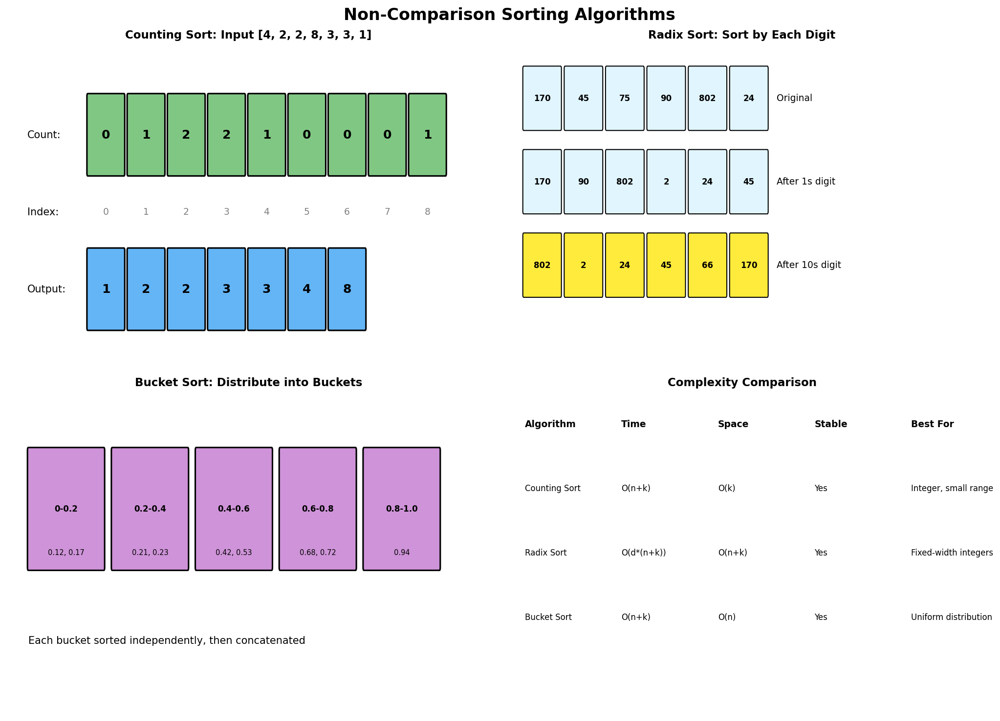
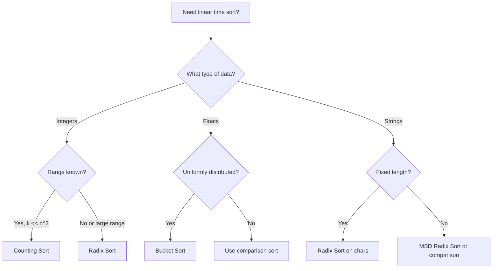

# Non-Comparison Sorting Algorithms

> **$O(n)$ sorting by exploiting data properties instead of comparisons**

---

## Overview

Non-comparison sorts achieve linear time complexity by not comparing elements to each other. Instead, they exploit specific properties of the data (like integer range or digit structure) to place elements directly into their correct positions.

### Visual Representation



### Comparison Sort Lower Bound

Comparison-based sorting has a theoretical lower bound of $\Omega(n \log n)$ because:
- Each comparison gives 1 bit of information
- We need to distinguish between $n!$ possible orderings
- This requires $\log(n!) = \Omega(n \log n)$ comparisons

Non-comparison sorts bypass this by using additional information about the data.

### When to Use Non-Comparison Sorts

| Algorithm | Best Use Case | Constraints |
|-----------|--------------|-------------|
| **Counting Sort** | Small integer range | $k \ll n^2$ |
| **Radix Sort** | Fixed-width integers, strings | Digits must be bounded |
| **Bucket Sort** | Uniformly distributed floats | Known distribution |

---

## Counting Sort

Counting sort works by counting the occurrences of each distinct element, then placing elements in their correct positions based on cumulative counts.

### Algorithm

1. **Count**: Count occurrences of each element
2. **Accumulate**: Convert counts to cumulative positions
3. **Place**: Place each element in its sorted position

### Implementation

```python
def counting_sort(arr: list[int]) -> list[int]:
    """
    Sort non-negative integers using counting sort.

    Time: O(n + k) where k is the range of input
    Space: O(n + k)
    """
    if not arr:
        return arr

    # Find range
    max_val = max(arr)
    min_val = min(arr)
    range_size = max_val - min_val + 1

    # Count occurrences
    count = [0] * range_size
    for num in arr:
        count[num - min_val] += 1

    # Reconstruct sorted array
    result = []
    for i in range(range_size):
        result.extend([i + min_val] * count[i])

    return result


def counting_sort_stable(arr: list[int]) -> list[int]:
    """
    Stable version of counting sort.

    Uses cumulative counts to determine final positions.
    Process input from right to left to maintain stability.

    Time: O(n + k), Space: O(n + k)
    """
    if not arr:
        return arr

    max_val = max(arr)
    min_val = min(arr)
    range_size = max_val - min_val + 1

    # Count occurrences
    count = [0] * range_size
    for num in arr:
        count[num - min_val] += 1

    # Cumulative count (position of last occurrence + 1)
    for i in range(1, range_size):
        count[i] += count[i - 1]

    # Build output array (process right to left for stability)
    output = [0] * len(arr)
    for i in range(len(arr) - 1, -1, -1):
        num = arr[i]
        count[num - min_val] -= 1
        output[count[num - min_val]] = num

    return output


# Example usage
arr = [4, 2, 2, 8, 3, 3, 1]
print(counting_sort(arr))  # [1, 2, 2, 3, 3, 4, 8]
```

::: info Complexity: Time O(n + k) · Space O(n + k) where k is the range
- **Time:** Two passes over input O(n); one pass over count array O(k); building output O(n)
- **Space:** Count array of size k; output array of size n (stable version also needs output array)
:::

### Sorting Objects by Key

```python
def counting_sort_by_key(arr: list[tuple], key_index: int, max_key: int) -> list[tuple]:
    """
    Sort array of tuples by a specific key using counting sort.

    Useful as a subroutine for radix sort.

    Time: O(n + k), Space: O(n + k)
    """
    count = [0] * (max_key + 1)

    # Count occurrences of each key
    for item in arr:
        count[item[key_index]] += 1

    # Cumulative count
    for i in range(1, len(count)):
        count[i] += count[i - 1]

    # Build output (right to left for stability)
    output = [None] * len(arr)
    for i in range(len(arr) - 1, -1, -1):
        key = arr[i][key_index]
        count[key] -= 1
        output[count[key]] = arr[i]

    return output


# Example: Sort students by grade
students = [("Alice", 85), ("Bob", 92), ("Charlie", 85), ("Diana", 78)]
sorted_students = counting_sort_by_key(
    [(s[0], s[1] // 10) for s in students],  # Convert to ranges
    key_index=1,
    max_key=9
)
print(sorted_students)
```

::: info Complexity: Time O(n + k) · Space O(n + k)
- **Time:** Count occurrences O(n); cumulative sum O(k); place elements O(n)
- **Space:** Count array of size k+1; output array of size n
:::

---

## Radix Sort

Radix sort processes digits from least significant to most significant (LSD) or vice versa (MSD), using a stable sort (usually counting sort) at each digit position.

### LSD Radix Sort (Least Significant Digit First)

```python
def radix_sort(arr: list[int]) -> list[int]:
    """
    Sort non-negative integers using LSD radix sort.

    Process digits from least significant to most significant.
    Use counting sort as the stable sorting subroutine.

    Time: O(d * (n + k)) where d = number of digits, k = base
    Space: O(n + k)
    """
    if not arr:
        return arr

    # Handle negative numbers by separating them
    max_val = max(arr)

    # Process each digit
    exp = 1
    while max_val // exp > 0:
        arr = counting_sort_by_digit(arr, exp)
        exp *= 10

    return arr


def counting_sort_by_digit(arr: list[int], exp: int) -> list[int]:
    """Stable sort by a specific digit position."""
    n = len(arr)
    output = [0] * n
    count = [0] * 10  # Decimal digits 0-9

    # Count occurrences of each digit
    for num in arr:
        digit = (num // exp) % 10
        count[digit] += 1

    # Cumulative count
    for i in range(1, 10):
        count[i] += count[i - 1]

    # Build output (right to left for stability)
    for i in range(n - 1, -1, -1):
        digit = (arr[i] // exp) % 10
        count[digit] -= 1
        output[count[digit]] = arr[i]

    return output


# Example usage
arr = [170, 45, 75, 90, 802, 24, 2, 66]
print(radix_sort(arr))  # [2, 24, 45, 66, 75, 90, 170, 802]
```

::: info Complexity: Time O(d * (n + k)) · Space O(n + k) where d = digits, k = base (10)
- **Time:** d iterations (one per digit); each iteration does O(n + k) counting sort
- **Space:** Count array of size 10 (decimal); output array of size n reused each iteration
:::

### Radix Sort with Negative Numbers

```python
def radix_sort_with_negatives(arr: list[int]) -> list[int]:
    """
    Radix sort that handles negative numbers.

    Approach: Separate negatives and positives, sort each, combine.

    Time: O(d * (n + k)), Space: O(n)
    """
    if not arr:
        return arr

    # Separate positive and negative
    negatives = [-x for x in arr if x < 0]
    positives = [x for x in arr if x >= 0]

    # Sort each part
    sorted_negatives = radix_sort(negatives) if negatives else []
    sorted_positives = radix_sort(positives) if positives else []

    # Combine: negatives (reversed and negated) + positives
    return [-x for x in reversed(sorted_negatives)] + sorted_positives


# Example usage
arr = [170, -45, 75, -90, 802, 24, -2, 66]
print(radix_sort_with_negatives(arr))
# Output: [-90, -45, -2, 24, 66, 75, 170, 802]
```

::: info Complexity: Time O(d * (n + k)) · Space O(n)
- **Time:** Separate negatives O(n); sort each part O(d * n); combine O(n)
- **Space:** Two temporary arrays for positives and negatives; radix sort uses O(n) auxiliary
:::

### Radix Sort for Strings

```python
def radix_sort_strings(strings: list[str]) -> list[str]:
    """
    Sort strings of equal length using radix sort.

    Process from rightmost character to leftmost.

    Time: O(d * n) where d = string length
    Space: O(n)
    """
    if not strings:
        return strings

    # Assume all strings have same length
    str_len = len(strings[0])

    # Process from last character to first
    for pos in range(str_len - 1, -1, -1):
        strings = counting_sort_by_char(strings, pos)

    return strings


def counting_sort_by_char(strings: list[str], pos: int) -> list[str]:
    """Sort strings by character at given position."""
    n = len(strings)
    output = [""] * n
    count = [0] * 256  # ASCII characters

    for s in strings:
        char_idx = ord(s[pos])
        count[char_idx] += 1

    for i in range(1, 256):
        count[i] += count[i - 1]

    for i in range(n - 1, -1, -1):
        char_idx = ord(strings[i][pos])
        count[char_idx] -= 1
        output[count[char_idx]] = strings[i]

    return output


# Example usage
words = ["dog", "cat", "bat", "car", "bar"]
print(radix_sort_strings(words))
# Output: ['bar', 'bat', 'car', 'cat', 'dog']
```

::: info Complexity: Time O(d * n) · Space O(n) where d = string length
- **Time:** d iterations (one per character position); each iteration O(n + 256) for ASCII counting sort
- **Space:** Output array of size n; count array of size 256 (ASCII)
:::

---

## Bucket Sort

Bucket sort distributes elements into buckets, sorts each bucket, then concatenates the results. It works best when input is uniformly distributed.

### Implementation

```python
def bucket_sort(arr: list[float]) -> list[float]:
    """
    Sort floats in range [0, 1) using bucket sort.

    1. Create n buckets
    2. Distribute elements into buckets
    3. Sort each bucket (using insertion sort for small buckets)
    4. Concatenate buckets

    Time: O(n) average, O(n^2) worst
    Space: O(n)
    """
    if not arr:
        return arr

    n = len(arr)

    # Create empty buckets
    buckets = [[] for _ in range(n)]

    # Distribute elements into buckets
    for num in arr:
        bucket_idx = int(num * n)
        # Handle edge case where num == 1.0
        if bucket_idx == n:
            bucket_idx = n - 1
        buckets[bucket_idx].append(num)

    # Sort each bucket
    for bucket in buckets:
        insertion_sort(bucket)

    # Concatenate buckets
    result = []
    for bucket in buckets:
        result.extend(bucket)

    return result


def insertion_sort(arr: list) -> None:
    """In-place insertion sort for small arrays."""
    for i in range(1, len(arr)):
        key = arr[i]
        j = i - 1
        while j >= 0 and arr[j] > key:
            arr[j + 1] = arr[j]
            j -= 1
        arr[j + 1] = key


# Example usage
arr = [0.897, 0.565, 0.656, 0.1234, 0.665, 0.3434]
print(bucket_sort(arr))
# Output: [0.1234, 0.3434, 0.565, 0.656, 0.665, 0.897]
```

::: info Complexity: Time O(n) average, O(n^2) worst · Space O(n)
- **Time:** Distribute to buckets O(n); sort each bucket (insertion sort O(k^2) per bucket, but average O(1) per element with uniform distribution)
- **Space:** n buckets total containing n elements; insertion sort is in-place within each bucket
:::

### Bucket Sort for Integers

```python
def bucket_sort_integers(arr: list[int], bucket_size: int = 10) -> list[int]:
    """
    Bucket sort for integers with configurable bucket size.

    Time: O(n + k) where k = number of buckets
    Space: O(n)
    """
    if not arr:
        return arr

    min_val, max_val = min(arr), max(arr)

    # Determine number of buckets
    bucket_count = (max_val - min_val) // bucket_size + 1
    buckets = [[] for _ in range(bucket_count)]

    # Distribute elements
    for num in arr:
        bucket_idx = (num - min_val) // bucket_size
        buckets[bucket_idx].append(num)

    # Sort each bucket and concatenate
    result = []
    for bucket in buckets:
        bucket.sort()  # Use built-in sort for simplicity
        result.extend(bucket)

    return result


# Example usage
arr = [29, 25, 3, 49, 9, 37, 21, 43]
print(bucket_sort_integers(arr))
# Output: [3, 9, 21, 25, 29, 37, 43, 49]
```

::: info Complexity: Time O(n + k) where k = number of buckets · Space O(n)
- **Time:** Distribute O(n); sort each bucket (uses built-in sort, O(m log m) per bucket with m elements, but total O(n log(n/k)) average)
- **Space:** k buckets containing n elements total
:::

---

## Algorithm Comparison

| Algorithm | Time (Avg) | Time (Worst) | Space | Stable | In-Place |
|-----------|-----------|--------------|-------|--------|----------|
| **Counting Sort** | $O(n + k)$ | $O(n + k)$ | $O(k)$ | Yes | No |
| **Radix Sort** | $O(d(n + k))$ | $O(d(n + k))$ | $O(n + k)$ | Yes | No |
| **Bucket Sort** | $O(n)$ | $O(n^2)$ | $O(n)$ | Yes | No |

Where:
- $n$ = number of elements
- $k$ = range of values (counting) or base (radix)
- $d$ = number of digits

---

## When to Use Each



### Decision Guide

| Scenario | Recommended | Reason |
|----------|-------------|--------|
| Ages (0-150) | Counting Sort | Small, fixed range |
| Phone numbers | Radix Sort | Fixed width, 10 digits |
| Uniformly distributed [0,1) | Bucket Sort | Even distribution |
| Large sparse integers | Comparison Sort | $k$ too large for linear |
| Variable-length strings | Comparison Sort | Radix inefficient |

---

## Practical Applications

### 1. Sort Students by Grade

```python
def sort_by_grade(students: list[tuple[str, int]]) -> list[tuple[str, int]]:
    """
    Sort students by grade (0-100) using counting sort.

    Time: O(n + 101) = O(n)
    """
    # Count students at each grade
    count = [[] for _ in range(101)]
    for name, grade in students:
        count[grade].append((name, grade))

    # Flatten
    result = []
    for grade_list in count:
        result.extend(grade_list)

    return result
```

::: info Complexity: Time O(n) · Space O(n)
- **Time:** Single pass distributing students into grade buckets O(n); flattening buckets O(n)
- **Space:** 101 buckets for grades 0-100; total n student records stored
:::

### 2. Sort IP Addresses

```python
def sort_ip_addresses(ips: list[str]) -> list[str]:
    """
    Sort IP addresses using radix sort on octets.

    Time: O(4n) = O(n) since IP has 4 octets
    """
    # Convert to tuples of integers
    ip_tuples = [tuple(map(int, ip.split('.'))) for ip in ips]

    # Radix sort by each octet (from right to left)
    for pos in range(3, -1, -1):
        ip_tuples = counting_sort_tuples(ip_tuples, pos)

    # Convert back to strings
    return ['.'.join(map(str, t)) for t in ip_tuples]


def counting_sort_tuples(arr: list[tuple], pos: int) -> list[tuple]:
    """Sort tuples by value at given position (0-255 range)."""
    count = [[] for _ in range(256)]
    for t in arr:
        count[t[pos]].append(t)

    result = []
    for bucket in count:
        result.extend(bucket)
    return result
```

::: info Complexity: Time O(4n) = O(n) · Space O(n)
- **Time:** 4 radix sort passes (one per octet); each pass O(n + 256) for bucket distribution
- **Space:** 256 buckets for each octet value; n IP tuples stored
:::

### 3. Sort Dates

```python
def sort_dates(dates: list[str]) -> list[str]:
    """
    Sort dates in YYYY-MM-DD format using radix sort.

    Time: O(n) for fixed-width date strings
    """
    return radix_sort_strings(dates)


# Example
dates = ["2023-12-25", "2022-01-01", "2023-06-15", "2022-12-31"]
print(sort_dates(dates))
# Output: ['2022-01-01', '2022-12-31', '2023-06-15', '2023-12-25']
```

::: info Complexity: Time O(n) · Space O(n)
- **Time:** Fixed-width date strings (10 chars) processed with 10 radix sort passes - O(10n) = O(n)
- **Space:** Output array of size n; count array of size 256
:::

---

## Common Mistakes

### 1. Ignoring Range Check for Counting Sort

```python
# WRONG: Will create huge array
def counting_sort_bad(arr):
    count = [0] * (max(arr) + 1)  # If max is 10^9, this crashes!

# CORRECT: Check if range is reasonable
def counting_sort_safe(arr):
    range_size = max(arr) - min(arr) + 1
    if range_size > len(arr) ** 2:
        return sorted(arr)  # Fall back to comparison sort
    # ... proceed with counting sort
```

### 2. Not Maintaining Stability in Radix Sort

```python
# WRONG: Processing left to right is unstable
for i in range(n):
    # Places elements in order they appear, not reverse

# CORRECT: Process right to left
for i in range(n - 1, -1, -1):
    # Maintains relative order of equal elements
```

### 3. Wrong Bucket Index Calculation

```python
# WRONG: Can cause index out of bounds
bucket_idx = int(num * n)  # If num == 1.0, idx == n which is out of bounds

# CORRECT: Handle edge case
bucket_idx = min(int(num * n), n - 1)
```

---

## Related LeetCode Problems

| Problem | Difficulty | Algorithm |
|---------|------------|-----------|
| Sort Colors | Medium | [Counting](https://leetcode.com/problems/sort-colors/) |
| Maximum Gap | Hard | [Bucket/Radix](https://leetcode.com/problems/maximum-gap/) |
| H-Index | Medium | [Counting](https://leetcode.com/problems/h-index/) |
| Top K Frequent Elements | Medium | [Bucket](https://leetcode.com/problems/top-k-frequent-elements/) |
| Sort Characters By Frequency | Medium | [Bucket](https://leetcode.com/problems/sort-characters-by-frequency/) |

---

## Interview Tips

1. **Know when NOT to use**: If range is huge or data isn't suitable, use comparison sort
2. **Mention stability**: Explain why you process right-to-left in radix/counting sort
3. **Discuss tradeoffs**: Linear time but higher space; limited applicability
4. **Consider hybrid**: Bucket sort + insertion sort for small buckets
5. **Edge cases**: Empty array, single element, all same values, negative numbers

---

## References

- [Non-Comparison Sorts - MIT OpenCourseWare](https://ocw.mit.edu/courses/6-006-introduction-to-algorithms-fall-2011/resources/lecture-7-counting-sort-radix-sort-lower-bounds-for-sorting/)
- [Radix Sort - GeeksforGeeks](https://www.geeksforgeeks.org/radix-sort/)
- [Counting Sort - Wikipedia](https://en.wikipedia.org/wiki/Counting_sort)
- [Bucket Sort - GeeksforGeeks](https://www.geeksforgeeks.org/bucket-sort-2/)
