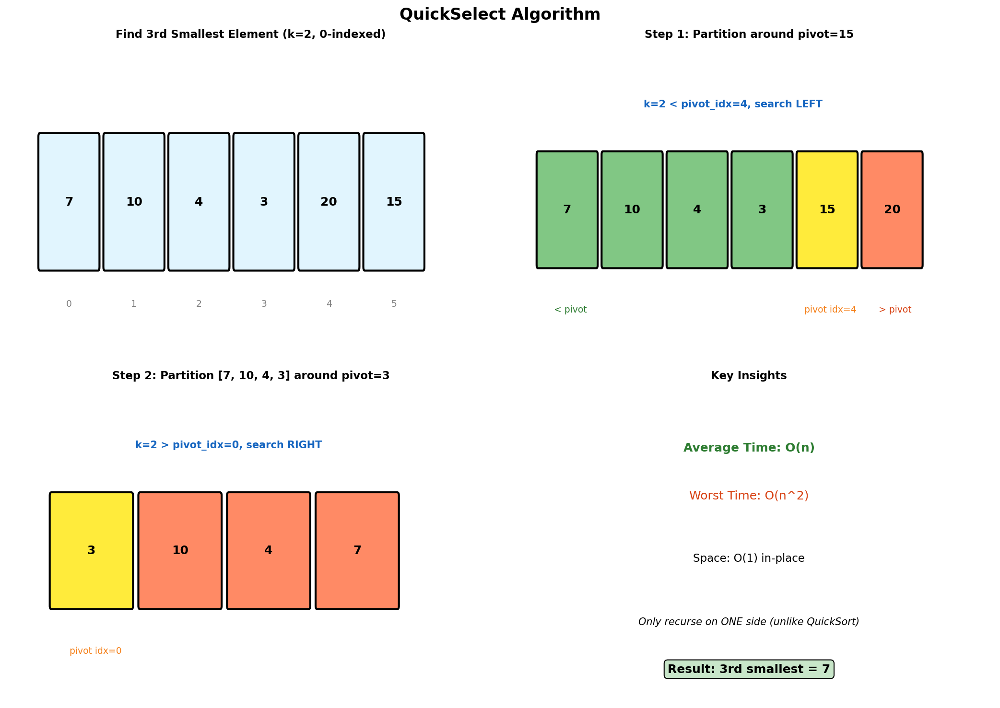

# QuickSelect Algorithm

> **$O(n)$ average time selection of the k-th smallest/largest element**

---

## Overview

QuickSelect is a selection algorithm to find the k-th smallest (or largest) element in an unordered list. It's based on the same partitioning scheme as QuickSort but only recurses into one partition, giving it an average time complexity of $O(n)$ instead of $O(n \log n)$.

### Visual Representation



### Key Insight

Unlike QuickSort which recursively sorts both partitions, QuickSelect only needs to recurse into the partition that contains the k-th element. This reduces the work from $O(n \log n)$ to $O(n)$ on average.

| Algorithm | Recursion | Average Time | Worst Time |
|-----------|-----------|--------------|------------|
| QuickSort | Both partitions | $O(n \log n)$ | $O(n^2)$ |
| QuickSelect | One partition | $O(n)$ | $O(n^2)$ |

---

## Algorithm Steps

1. **Choose a Pivot**: Select a pivot element (random selection helps avoid worst case)
2. **Partition**: Rearrange so elements less than pivot are left, greater are right
3. **Compare Pivot Position with k**:
   - If `pivot_idx == k`: Found the k-th element
   - If `pivot_idx > k`: Recurse on left partition
   - If `pivot_idx < k`: Recurse on right partition

---

## Implementation

### Basic QuickSelect

::: code-group

```python [Python]
def quickselect(arr: list[int], k: int) -> int:
    """
    Find the k-th smallest element (0-indexed).

    Args:
        arr: Unsorted array
        k: Index of element to find (0-indexed, 0 = smallest)

    Returns:
        The k-th smallest element

    Time: O(n) average, O(n^2) worst
    Space: O(1) iterative, O(log n) recursive
    """
    if k < 0 or k >= len(arr):
        raise ValueError("k is out of bounds")

    return quickselect_helper(arr, 0, len(arr) - 1, k)


def quickselect_helper(arr: list[int], left: int, right: int, k: int) -> int:
    """Recursive helper for quickselect."""
    if left == right:
        return arr[left]

    # Partition and get pivot's final position
    pivot_idx = partition(arr, left, right)

    if pivot_idx == k:
        return arr[pivot_idx]
    elif pivot_idx > k:
        return quickselect_helper(arr, left, pivot_idx - 1, k)
    else:
        return quickselect_helper(arr, pivot_idx + 1, right, k)


def partition(arr: list[int], left: int, right: int) -> int:
    """
    Lomuto partition scheme.
    Places pivot in correct position and returns its index.
    """
    pivot = arr[right]
    i = left - 1

    for j in range(left, right):
        if arr[j] <= pivot:
            i += 1
            arr[i], arr[j] = arr[j], arr[i]

    arr[i + 1], arr[right] = arr[right], arr[i + 1]
    return i + 1


# Example usage
arr = [3, 2, 1, 5, 6, 4]
print(quickselect(arr.copy(), 0))  # 1 (smallest)
print(quickselect(arr.copy(), 2))  # 3 (3rd smallest)
print(quickselect(arr.copy(), 5))  # 6 (largest)
```

```java [Java]
public int quickselect(int[] arr, int k) {
    if (k < 0 || k >= arr.length) throw new IllegalArgumentException("k out of bounds");
    return quickselectHelper(arr, 0, arr.length - 1, k);
}

private int quickselectHelper(int[] arr, int left, int right, int k) {
    if (left == right) return arr[left];

    int pivotIdx = partition(arr, left, right);

    if (pivotIdx == k) return arr[pivotIdx];
    else if (pivotIdx > k) return quickselectHelper(arr, left, pivotIdx - 1, k);
    else return quickselectHelper(arr, pivotIdx + 1, right, k);
}

private int partition(int[] arr, int left, int right) {
    int pivot = arr[right];
    int i = left - 1;

    for (int j = left; j < right; j++) {
        if (arr[j] <= pivot) {
            i++;
            int tmp = arr[i]; arr[i] = arr[j]; arr[j] = tmp;
        }
    }
    int tmp = arr[i + 1]; arr[i + 1] = arr[right]; arr[right] = tmp;
    return i + 1;
}
```

:::

::: info Complexity: Time O(n) average, O(n^2) worst · Space O(log n) average
- **Time:** Average case partitions reduce search space by half each time: n + n/2 + n/4 + ... = O(n); worst case always picks extreme pivot: n + (n-1) + ... = O(n^2)
- **Space:** Recursive call stack depth is O(log n) average, O(n) worst case
:::

### QuickSelect with Random Pivot

::: code-group

```python [Python]
import random

def quickselect_random(arr: list[int], k: int) -> int:
    """
    QuickSelect with randomized pivot selection.

    Random pivot avoids worst-case O(n^2) on sorted/reverse-sorted input.

    Time: O(n) expected, Space: O(1)
    """
    def partition_random(left: int, right: int) -> int:
        # Choose random pivot and swap to end
        pivot_idx = random.randint(left, right)
        arr[pivot_idx], arr[right] = arr[right], arr[pivot_idx]

        pivot = arr[right]
        i = left - 1

        for j in range(left, right):
            if arr[j] <= pivot:
                i += 1
                arr[i], arr[j] = arr[j], arr[i]

        arr[i + 1], arr[right] = arr[right], arr[i + 1]
        return i + 1

    left, right = 0, len(arr) - 1

    while left <= right:
        pivot_idx = partition_random(left, right)

        if pivot_idx == k:
            return arr[pivot_idx]
        elif pivot_idx > k:
            right = pivot_idx - 1
        else:
            left = pivot_idx + 1

    return arr[left]


# Example usage
arr = [7, 10, 4, 3, 20, 15]
print(quickselect_random(arr.copy(), 2))  # 7 (3rd smallest)
```

```java [Java]
public int quickselectRandom(int[] arr, int k) {
    Random rand = new Random();
    int left = 0, right = arr.length - 1;

    while (left <= right) {
        // Random pivot swap to end
        int pivotIdx = left + rand.nextInt(right - left + 1);
        int tmp = arr[pivotIdx]; arr[pivotIdx] = arr[right]; arr[right] = tmp;

        int pivot = arr[right];
        int i = left - 1;
        for (int j = left; j < right; j++) {
            if (arr[j] <= pivot) {
                i++;
                tmp = arr[i]; arr[i] = arr[j]; arr[j] = tmp;
            }
        }
        tmp = arr[i + 1]; arr[i + 1] = arr[right]; arr[right] = tmp;
        pivotIdx = i + 1;

        if (pivotIdx == k) return arr[pivotIdx];
        else if (pivotIdx > k) right = pivotIdx - 1;
        else left = pivotIdx + 1;
    }
    return arr[left];
}
```

:::

::: info Complexity: Time O(n) expected · Space O(1)
- **Time:** Random pivot selection ensures expected balanced partitions, achieving O(n) expected time
- **Space:** Iterative implementation uses only constant space for pointers and loop variables
:::

### Median of Medians (Guaranteed O(n))

```python
def quickselect_mom(arr: list[int], k: int) -> int:
    """
    QuickSelect with Median of Medians pivot selection.

    Guarantees O(n) worst-case by choosing a good pivot.

    Time: O(n) guaranteed, Space: O(log n)
    """
    if len(arr) == 1:
        return arr[0]

    def median_of_medians(arr: list[int]) -> int:
        """Find a good pivot using median of medians."""
        # Divide into groups of 5
        sublists = [arr[i:i + 5] for i in range(0, len(arr), 5)]

        # Find median of each group
        medians = [sorted(sublist)[len(sublist) // 2] for sublist in sublists]

        # Recursively find median of medians
        if len(medians) <= 5:
            return sorted(medians)[len(medians) // 2]
        return quickselect_mom(medians, len(medians) // 2)

    def partition_with_pivot(arr: list[int], pivot: int) -> tuple[list, list, list]:
        """Three-way partition around pivot."""
        less = [x for x in arr if x < pivot]
        equal = [x for x in arr if x == pivot]
        greater = [x for x in arr if x > pivot]
        return less, equal, greater

    pivot = median_of_medians(arr)
    less, equal, greater = partition_with_pivot(arr, pivot)

    if k < len(less):
        return quickselect_mom(less, k)
    elif k < len(less) + len(equal):
        return equal[0]
    else:
        return quickselect_mom(greater, k - len(less) - len(equal))


# Example usage
arr = [12, 3, 5, 7, 4, 19, 26]
print(quickselect_mom(arr.copy(), 3))  # 7 (4th smallest)
```

::: info Complexity: Time O(n) guaranteed · Space O(log n)
- **Time:** Median of medians guarantees pivot eliminates at least 30% of elements; recurrence T(n) = T(n/5) + T(7n/10) + O(n) = O(n)
- **Space:** Recursive stack depth for median finding and partitioning is O(log n)
:::

---

## Common Applications

### Kth Largest Element

```python
def find_kth_largest(nums: list[int], k: int) -> int:
    """
    Find the k-th largest element (1-indexed).

    k=1 returns the largest element.

    Time: O(n) average
    """
    # k-th largest = (n-k)-th smallest (0-indexed)
    return quickselect_random(nums, len(nums) - k)


# Example usage
nums = [3, 2, 1, 5, 6, 4]
print(find_kth_largest(nums.copy(), 2))  # 5 (2nd largest)
```

::: info Complexity: Time O(n) average · Space O(1)
- **Time:** Single QuickSelect call to find (n-k)th smallest element
- **Space:** In-place partitioning uses only constant auxiliary space
:::

### Top K Elements

```python
def top_k_elements(nums: list[int], k: int) -> list[int]:
    """
    Find the top k largest elements (not necessarily sorted).

    Uses QuickSelect to find the k-th largest, then collects all >= it.

    Time: O(n) average
    """
    if k >= len(nums):
        return nums

    # Find the k-th largest value
    kth_largest = find_kth_largest(nums.copy(), k)

    # Collect all elements >= kth_largest
    result = [x for x in nums if x >= kth_largest]

    # Handle duplicates: ensure exactly k elements
    if len(result) > k:
        count = result.count(kth_largest)
        excess = len(result) - k
        result = [x for x in nums if x > kth_largest]
        result.extend([kth_largest] * (k - len(result)))

    return result


# Example usage
nums = [3, 2, 1, 5, 6, 4]
print(top_k_elements(nums, 3))  # [5, 6, 4] or similar
```

::: info Complexity: Time O(n) average · Space O(k) for output
- **Time:** QuickSelect O(n) to find kth largest; O(n) to collect all elements >= threshold
- **Space:** Output list stores k elements; QuickSelect modifies array in-place
:::

### Find Median

```python
def find_median(nums: list[int]) -> float:
    """
    Find the median of an array.

    Time: O(n) average
    """
    n = len(nums)

    if n % 2 == 1:
        # Odd length: return middle element
        return float(quickselect_random(nums.copy(), n // 2))
    else:
        # Even length: return average of two middle elements
        lower = quickselect_random(nums.copy(), n // 2 - 1)
        upper = quickselect_random(nums.copy(), n // 2)
        return (lower + upper) / 2


# Example usage
print(find_median([3, 1, 2, 5, 4]))    # 3.0
print(find_median([3, 1, 2, 4]))       # 2.5
```

::: info Complexity: Time O(n) average · Space O(n) for array copy
- **Time:** One or two QuickSelect calls depending on odd/even length
- **Space:** Creates copy of array to avoid modifying original during selection
:::

### Kth Smallest in Matrix

```python
def kth_smallest_matrix(matrix: list[list[int]], k: int) -> int:
    """
    Find k-th smallest element in a sorted matrix.

    Note: Binary search on value range is often better for this problem,
    but QuickSelect works on the flattened array.

    Time: O(n^2) for n x n matrix
    """
    # Flatten the matrix
    flat = [elem for row in matrix for elem in row]
    return quickselect_random(flat, k - 1)


# Example usage
matrix = [
    [1, 5, 9],
    [10, 11, 13],
    [12, 13, 15]
]
print(kth_smallest_matrix(matrix, 8))  # 13
```

::: info Complexity: Time O(n^2) for n x n matrix · Space O(n^2)
- **Time:** Flattening matrix O(n^2); QuickSelect on flattened array O(n^2) average
- **Space:** Flattened array stores all n^2 elements
:::

---

## Hoare Partition Scheme

An alternative partitioning method that's slightly faster in practice:

::: code-group

```python [Python]
def quickselect_hoare(arr: list[int], k: int) -> int:
    """
    QuickSelect using Hoare partition scheme.

    Hoare partition is faster as it does fewer swaps on average.
    """
    def partition_hoare(left: int, right: int) -> int:
        pivot = arr[left]
        i = left - 1
        j = right + 1

        while True:
            i += 1
            while arr[i] < pivot:
                i += 1

            j -= 1
            while arr[j] > pivot:
                j -= 1

            if i >= j:
                return j

            arr[i], arr[j] = arr[j], arr[i]

    left, right = 0, len(arr) - 1

    while True:
        if left == right:
            return arr[left]

        pivot_idx = partition_hoare(left, right)

        if k <= pivot_idx:
            right = pivot_idx
        else:
            left = pivot_idx + 1


# Example usage
arr = [3, 2, 3, 1, 2, 4, 5, 5, 6]
print(quickselect_hoare(arr.copy(), 4))  # 3
```

```java [Java]
public int quickselectHoare(int[] arr, int k) {
    int left = 0, right = arr.length - 1;

    while (true) {
        if (left == right) return arr[left];

        int pivotPos = partitionHoare(arr, left, right);

        if (k <= pivotPos) {
            right = pivotPos;
        } else {
            left = pivotPos + 1;
        }
    }
}

private int partitionHoare(int[] arr, int left, int right) {
    int pivot = arr[left];
    int i = left - 1;
    int j = right + 1;

    while (true) {
        do { i++; } while (arr[i] < pivot);
        do { j--; } while (arr[j] > pivot);

        if (i >= j) return j;

        int tmp = arr[i]; arr[i] = arr[j]; arr[j] = tmp;
    }
}
```

:::

::: info Complexity: Time O(n) average · Space O(1)
- **Time:** Hoare partition does fewer swaps than Lomuto on average; same O(n) average complexity
- **Space:** Iterative implementation uses only constant space for pointers
:::

---

## Three-Way Partition (Dutch National Flag)

Useful when there are many duplicate elements:

```python
def quickselect_3way(arr: list[int], k: int) -> int:
    """
    QuickSelect with three-way partitioning.

    Better for arrays with many duplicates.

    Time: O(n) average
    """
    def partition_3way(left: int, right: int):
        """
        Three-way partition: < pivot | == pivot | > pivot

        Returns (lt, gt) where:
        - arr[left:lt] < pivot
        - arr[lt:gt+1] == pivot
        - arr[gt+1:right+1] > pivot
        """
        pivot = arr[left]
        lt = left      # arr[left:lt] < pivot
        gt = right     # arr[gt+1:right+1] > pivot
        i = left + 1   # Current element

        while i <= gt:
            if arr[i] < pivot:
                arr[lt], arr[i] = arr[i], arr[lt]
                lt += 1
                i += 1
            elif arr[i] > pivot:
                arr[gt], arr[i] = arr[i], arr[gt]
                gt -= 1
            else:
                i += 1

        return lt, gt

    left, right = 0, len(arr) - 1

    while left <= right:
        lt, gt = partition_3way(left, right)

        if k < lt:
            right = lt - 1
        elif k > gt:
            left = gt + 1
        else:
            return arr[k]

    return arr[left]


# Example usage (many duplicates)
arr = [1, 2, 2, 2, 2, 2, 3, 4, 5]
print(quickselect_3way(arr.copy(), 4))  # 2
```

::: info Complexity: Time O(n) average · Space O(1)
- **Time:** Three-way partitioning handles duplicates efficiently by grouping equal elements together, avoiding repeated processing
- **Space:** In-place partitioning with three pointers uses only constant auxiliary space
:::

---

## Complexity Analysis

### Time Complexity

| Case | Complexity | When |
|------|-----------|------|
| Best | $O(n)$ | Pivot splits evenly |
| Average | $O(n)$ | Random pivot |
| Worst | $O(n^2)$ | Pivot always at extreme |

**Average case recurrence**: $T(n) = T(n/2) + O(n) = O(n)$

**Worst case recurrence**: $T(n) = T(n-1) + O(n) = O(n^2)$

### Space Complexity

| Implementation | Space |
|----------------|-------|
| Recursive | $O(\log n)$ average, $O(n)$ worst |
| Iterative | $O(1)$ |
| Median of Medians | $O(\log n)$ |

---

## QuickSelect vs Alternatives

| Method | Time | Space | Notes |
|--------|------|-------|-------|
| **QuickSelect** | $O(n)$ avg | $O(1)$ | Best for single k |
| **Heap (size k)** | $O(n \log k)$ | $O(k)$ | Good when $k \ll n$ |
| **Full Sort** | $O(n \log n)$ | $O(1)$ | Needed if multiple queries |
| **Counting Sort** | $O(n + r)$ | $O(r)$ | If range $r$ is small |

```mermaid
flowchart TD
    A[Find k-th element?] --> B{How many queries?}

    B -->|Single query| C[QuickSelect O(n)]
    B -->|Multiple queries| D{Can preprocess?}

    D -->|Yes| E[Sort once O(n log n)]
    D -->|No| F{Stream data?}

    F -->|Yes| G[Heap O(n log k)]
    F -->|No| C
```

---

## Common Mistakes

### 1. Off-by-One with k Index

```python
# WRONG: Confusing 0-indexed vs 1-indexed
def kth_largest(nums, k):
    return quickselect(nums, k)  # Should be len(nums) - k

# CORRECT
def kth_largest(nums, k):
    return quickselect(nums, len(nums) - k)  # 0-indexed
```

### 2. Modifying Original Array

```python
# WRONG: QuickSelect modifies in-place
result = quickselect(nums, k)  # nums is now modified!

# CORRECT: Copy if original needed
result = quickselect(nums.copy(), k)
```

### 3. Not Handling Equal Elements

```python
# WRONG: Can loop infinitely with duplicates
while arr[left] < pivot:
    left += 1
while arr[right] > pivot:
    right -= 1

# CORRECT: Use <= and >= or three-way partition
# Or ensure progress even with duplicates
```

---

## Related LeetCode Problems

| Problem | Difficulty | Notes |
|---------|------------|-------|
| Kth Largest Element in an Array | Medium | [Classic QuickSelect](https://leetcode.com/problems/kth-largest-element-in-an-array/) |
| Top K Frequent Elements | Medium | [QuickSelect + Count](https://leetcode.com/problems/top-k-frequent-elements/) |
| K Closest Points to Origin | Medium | [QuickSelect on distances](https://leetcode.com/problems/k-closest-points-to-origin/) |
| Kth Smallest Element in a Sorted Matrix | Medium | [Binary Search better](https://leetcode.com/problems/kth-smallest-element-in-a-sorted-matrix/) |
| Find Median from Data Stream | Hard | [Two Heaps better](https://leetcode.com/problems/find-median-from-data-stream/) |
| Wiggle Sort II | Medium | [QuickSelect + 3-way](https://leetcode.com/problems/wiggle-sort-ii/) |

---

## Interview Tips

1. **Know when to use**: Single query for k-th element -> QuickSelect; multiple queries -> sort or heap
2. **Mention randomization**: Always use random pivot to avoid $O(n^2)$
3. **Clarify k indexing**: Is k 0-indexed or 1-indexed? Smallest or largest?
4. **Handle duplicates**: Mention three-way partition if relevant
5. **Space consideration**: QuickSelect is in-place, which is often preferred

---

## References

- [QuickSelect - Wikipedia](https://en.wikipedia.org/wiki/Quickselect)
- [Median of Medians - Wikipedia](https://en.wikipedia.org/wiki/Median_of_medians)
- [Selection Algorithm - MIT OpenCourseWare](https://ocw.mit.edu/courses/6-046j-introduction-to-algorithms-sma-5503-fall-2005/)
- [Kth Largest Element - Tech Interview Handbook](https://www.techinterviewhandbook.org/algorithms/sorting-searching/)
