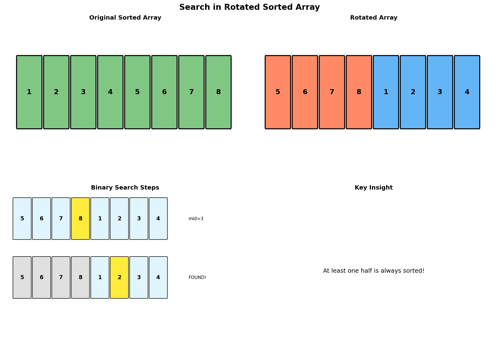

# Search in Rotated Sorted Array

> **$O(\log n)$ search in a rotated sorted array using modified binary search**

---

## Overview

A rotated sorted array is a sorted array that has been rotated at some pivot point. For example, `[1, 2, 3, 4, 5, 6, 7]` might become `[4, 5, 6, 7, 1, 2, 3]` after being rotated at index 3. The challenge is to search for an element in this rotated array while maintaining $O(\log n)$ time complexity.

### Visual Representation



### Key Insight

**At least one half of the array is always sorted!** This property allows us to determine which half to search in using binary search.

When we pick a mid element:
- If `nums[left] <= nums[mid]`: The left half `[left, mid]` is sorted
- Otherwise: The right half `[mid, right]` is sorted

---

## Problem Variants

| Variant | Description | Key Consideration |
|---------|-------------|-------------------|
| **Basic** | No duplicates, find target | Standard modified binary search |
| **With Duplicates** | Contains duplicates | May degrade to $O(n)$ worst case |
| **Find Minimum** | Find the smallest element | Find the rotation point |
| **Find Rotation Count** | How many times was it rotated? | Index of minimum element |

---

## Implementation

### Variant 1: Search in Rotated Array (No Duplicates)

::: code-group

```python [Python]
def search_rotated(nums: list[int], target: int) -> int:
    """
    Search for target in rotated sorted array without duplicates.

    Args:
        nums: Rotated sorted array (no duplicates)
        target: Value to search for

    Returns:
        Index of target if found, -1 otherwise

    Time: O(log n), Space: O(1)
    """
    if not nums:
        return -1

    left, right = 0, len(nums) - 1

    while left <= right:
        mid = left + (right - left) // 2

        if nums[mid] == target:
            return mid

        # Determine which half is sorted
        if nums[left] <= nums[mid]:
            # Left half is sorted
            if nums[left] <= target < nums[mid]:
                # Target is in the sorted left half
                right = mid - 1
            else:
                # Target is in the unsorted right half
                left = mid + 1
        else:
            # Right half is sorted
            if nums[mid] < target <= nums[right]:
                # Target is in the sorted right half
                left = mid + 1
            else:
                # Target is in the unsorted left half
                right = mid - 1

    return -1


# Example usage
nums = [4, 5, 6, 7, 0, 1, 2]
print(search_rotated(nums, 0))   # Output: 4
print(search_rotated(nums, 3))   # Output: -1
print(search_rotated(nums, 5))   # Output: 1
```

```java [Java]
public int search(int[] nums, int target) {
    if (nums == null || nums.length == 0) return -1;

    int left = 0, right = nums.length - 1;

    while (left <= right) {
        int mid = left + (right - left) / 2;

        if (nums[mid] == target) return mid;

        if (nums[left] <= nums[mid]) {
            // Left half sorted
            if (nums[left] <= target && target < nums[mid]) {
                right = mid - 1;
            } else {
                left = mid + 1;
            }
        } else {
            // Right half sorted
            if (nums[mid] < target && target <= nums[right]) {
                left = mid + 1;
            } else {
                right = mid - 1;
            }
        }
    }
    return -1;
}
```

:::

::: info Complexity: Time O(log n) · Space O(1)
- **Time:** Each iteration halves the search space by determining which half is sorted and whether target lies within that range
- **Space:** Uses only constant variables for left, right, and mid pointers
:::

### Variant 2: Search with Duplicates

::: code-group

```python [Python]
def search_rotated_duplicates(nums: list[int], target: int) -> bool:
    """
    Search for target in rotated sorted array that may contain duplicates.

    Key difference: When nums[left] == nums[mid] == nums[right],
    we cannot determine which half is sorted, so we shrink from both ends.

    Args:
        nums: Rotated sorted array (may have duplicates)
        target: Value to search for

    Returns:
        True if target exists, False otherwise

    Time: O(n) worst case (all duplicates), O(log n) average
    Space: O(1)
    """
    if not nums:
        return False

    left, right = 0, len(nums) - 1

    while left <= right:
        mid = left + (right - left) // 2

        if nums[mid] == target:
            return True

        # Handle duplicates: cannot determine sorted half
        if nums[left] == nums[mid] == nums[right]:
            left += 1
            right -= 1
        elif nums[left] <= nums[mid]:
            # Left half is sorted
            if nums[left] <= target < nums[mid]:
                right = mid - 1
            else:
                left = mid + 1
        else:
            # Right half is sorted
            if nums[mid] < target <= nums[right]:
                left = mid + 1
            else:
                right = mid - 1

    return False


# Example usage
nums = [2, 5, 6, 0, 0, 1, 2]
print(search_rotated_duplicates(nums, 0))   # Output: True
print(search_rotated_duplicates(nums, 3))   # Output: False
```

```java [Java]
public boolean searchWithDuplicates(int[] nums, int target) {
    if (nums == null || nums.length == 0) return false;

    int left = 0, right = nums.length - 1;

    while (left <= right) {
        int mid = left + (right - left) / 2;

        if (nums[mid] == target) return true;

        if (nums[left] == nums[mid] && nums[mid] == nums[right]) {
            left++;
            right--;
        } else if (nums[left] <= nums[mid]) {
            if (nums[left] <= target && target < nums[mid]) {
                right = mid - 1;
            } else {
                left = mid + 1;
            }
        } else {
            if (nums[mid] < target && target <= nums[right]) {
                left = mid + 1;
            } else {
                right = mid - 1;
            }
        }
    }
    return false;
}
```

:::

::: info Complexity: Time O(n) worst case, O(log n) average · Space O(1)
- **Time:** When nums[left] == nums[mid] == nums[right], we can only shrink bounds by 1 each side, causing O(n) in worst case (all duplicates); average case remains O(log n)
- **Space:** Only constant space for pointer variables
:::

### Variant 3: Find Minimum Element

::: code-group

```python [Python]
def find_min(nums: list[int]) -> int:
    """
    Find the minimum element in a rotated sorted array (no duplicates).

    The minimum is at the rotation point where the sequence breaks.

    Args:
        nums: Rotated sorted array (no duplicates)

    Returns:
        The minimum element

    Time: O(log n), Space: O(1)
    """
    left, right = 0, len(nums) - 1

    # If array is not rotated (or rotated n times)
    if nums[left] < nums[right]:
        return nums[left]

    while left < right:
        mid = left + (right - left) // 2

        if nums[mid] > nums[right]:
            # Minimum is in the right half
            left = mid + 1
        else:
            # Minimum is in the left half (including mid)
            right = mid

    return nums[left]


def find_min_with_duplicates(nums: list[int]) -> int:
    """
    Find minimum in rotated sorted array with duplicates.

    Time: O(n) worst case, O(log n) average
    Space: O(1)
    """
    left, right = 0, len(nums) - 1

    while left < right:
        mid = left + (right - left) // 2

        if nums[mid] > nums[right]:
            left = mid + 1
        elif nums[mid] < nums[right]:
            right = mid
        else:
            # nums[mid] == nums[right], can't determine
            right -= 1

    return nums[left]


# Example usage
print(find_min([3, 4, 5, 1, 2]))           # Output: 1
print(find_min([4, 5, 6, 7, 0, 1, 2]))     # Output: 0
print(find_min_with_duplicates([2, 2, 2, 0, 1]))  # Output: 0
```

```java [Java]
public int findMin(int[] nums) {
    int left = 0, right = nums.length - 1;

    if (nums[left] < nums[right]) return nums[left];

    while (left < right) {
        int mid = left + (right - left) / 2;

        if (nums[mid] > nums[right]) {
            left = mid + 1;
        } else {
            right = mid;
        }
    }
    return nums[left];
}

public int findMinWithDuplicates(int[] nums) {
    int left = 0, right = nums.length - 1;

    while (left < right) {
        int mid = left + (right - left) / 2;

        if (nums[mid] > nums[right]) {
            left = mid + 1;
        } else if (nums[mid] < nums[right]) {
            right = mid;
        } else {
            right--;
        }
    }
    return nums[left];
}
```

:::

::: info Complexity: Time O(log n) for no duplicates, O(n) worst case with duplicates · Space O(1)
- **Time:** find_min uses standard binary search O(log n); find_min_with_duplicates degrades to O(n) when duplicates prevent determining sorted half
- **Space:** Constant space for pointer variables in both implementations
:::

### Variant 4: Find Rotation Count

::: code-group

```python [Python]
def find_rotation_count(nums: list[int]) -> int:
    """
    Find how many times the array was rotated.

    The rotation count equals the index of the minimum element.

    Args:
        nums: Rotated sorted array (no duplicates)

    Returns:
        Number of rotations (0 to n-1)

    Time: O(log n), Space: O(1)
    """
    left, right = 0, len(nums) - 1

    # Not rotated
    if nums[left] <= nums[right]:
        return 0

    while left < right:
        mid = left + (right - left) // 2

        if nums[mid] > nums[right]:
            left = mid + 1
        else:
            right = mid

    return left


# Example usage
print(find_rotation_count([7, 9, 11, 12, 5]))      # Output: 4
print(find_rotation_count([3, 4, 5, 1, 2]))        # Output: 3
print(find_rotation_count([1, 2, 3, 4, 5]))        # Output: 0 (not rotated)
```

```java [Java]
public int findRotationCount(int[] nums) {
    int left = 0, right = nums.length - 1;

    if (nums[left] <= nums[right]) return 0;

    while (left < right) {
        int mid = left + (right - left) / 2;

        if (nums[mid] > nums[right]) {
            left = mid + 1;
        } else {
            right = mid;
        }
    }
    return left;
}
```

:::

::: info Complexity: Time O(log n) · Space O(1)
- **Time:** Identical to find_min - binary search finds the rotation point (minimum element index) in logarithmic time
- **Space:** Only constant space for left, right, and mid pointers
:::

---

## Algorithm Walkthrough

### Example: Search for 0 in `[4, 5, 6, 7, 0, 1, 2]`

| Step | Left | Right | Mid | nums[mid] | Analysis |
|------|------|-------|-----|-----------|----------|
| 1 | 0 | 6 | 3 | 7 | Left sorted [4,5,6,7]. 0 not in [4,7), go right |
| 2 | 4 | 6 | 5 | 1 | Right sorted [1,2]. 0 not in (1,2], go left |
| 3 | 4 | 4 | 4 | 0 | Found! Return 4 |

### Decision Tree

```mermaid
flowchart TD
    A[Is nums[left] <= nums[mid]?] -->|Yes| B[Left half sorted]
    A -->|No| C[Right half sorted]

    B --> D{Is target in [left, mid)?}
    D -->|Yes| E[Search left: right = mid - 1]
    D -->|No| F[Search right: left = mid + 1]

    C --> G{Is target in (mid, right]?}
    G -->|Yes| H[Search right: left = mid + 1]
    G -->|No| I[Search left: right = mid - 1]
```

---

## Edge Cases

```python
def test_edge_cases():
    # Empty array
    assert search_rotated([], 5) == -1

    # Single element
    assert search_rotated([1], 1) == 0
    assert search_rotated([1], 0) == -1

    # Two elements
    assert search_rotated([2, 1], 1) == 1
    assert search_rotated([2, 1], 2) == 0

    # Not rotated (or rotated n times)
    assert search_rotated([1, 2, 3, 4, 5], 3) == 2

    # Target at boundaries
    assert search_rotated([4, 5, 6, 7, 0, 1, 2], 4) == 0
    assert search_rotated([4, 5, 6, 7, 0, 1, 2], 2) == 6

    # Target at rotation point
    assert search_rotated([4, 5, 6, 7, 0, 1, 2], 0) == 4

    print("All edge cases passed!")

test_edge_cases()
```

---

## Common Mistakes

### 1. Incorrect Boundary Comparison

```python
# WRONG: Using < instead of <=
if nums[left] < nums[mid]:  # Fails when left == mid

# CORRECT: Use <=
if nums[left] <= nums[mid]:
```

### 2. Forgetting to Handle Duplicates

```python
# WRONG: Treating duplicates like non-duplicates
# When nums[left] == nums[mid] == nums[right], we can't determine sorted half

# CORRECT: Shrink from both ends
if nums[left] == nums[mid] == nums[right]:
    left += 1
    right -= 1
```

### 3. Off-by-One in Range Checks

```python
# WRONG: Incorrect range boundaries
if nums[left] <= target <= nums[mid]:  # Should not include mid

# CORRECT: Exclude mid (already checked)
if nums[left] <= target < nums[mid]:
```

---

## Complexity Analysis

| Variant | Time Complexity | Space Complexity | Notes |
|---------|----------------|------------------|-------|
| No duplicates | $O(\log n)$ | $O(1)$ | Standard binary search |
| With duplicates | $O(n)$ worst | $O(1)$ | Degrades when all same |
| Find minimum | $O(\log n)$ | $O(1)$ | Binary search variant |
| With duplicates min | $O(n)$ worst | $O(1)$ | Same degradation |

---

## Related LeetCode Problems

| Problem | Difficulty | Link |
|---------|------------|------|
| Search in Rotated Sorted Array | Medium | [LC 33](https://leetcode.com/problems/search-in-rotated-sorted-array/) |
| Search in Rotated Sorted Array II | Medium | [LC 81](https://leetcode.com/problems/search-in-rotated-sorted-array-ii/) |
| Find Minimum in Rotated Sorted Array | Medium | [LC 153](https://leetcode.com/problems/find-minimum-in-rotated-sorted-array/) |
| Find Minimum in Rotated Sorted Array II | Hard | [LC 154](https://leetcode.com/problems/find-minimum-in-rotated-sorted-array-ii/) |

---

## Interview Tips

1. **Clarify first**: Ask if there are duplicates - this significantly changes the approach
2. **Draw it out**: Visualize the rotation to understand which half is sorted
3. **Handle edge cases**: Empty array, single element, not rotated
4. **Explain the key insight**: One half is always sorted
5. **Mention complexity tradeoff**: Duplicates can degrade to $O(n)$

---

## References

- [Binary Search - Tech Interview Handbook](https://www.techinterviewhandbook.org/algorithms/binary-search/)
- [Rotated Array Problems - LeetCode](https://leetcode.com/tag/binary-search/)
- [Binary Search Interview Questions - Interviewing.io](https://interviewing.io/binary-search-interview-questions)
