```mermaid
graph TD
    subgraph "Rotated Array: [4,5,6,7,0,1,2]"
        A["Original: [0,1,2,4,5,6,7]"] --> B["Pivot at index 4"]
        B --> C["Rotated: [4,5,6,7,0,1,2]"]
    end

    subgraph "Binary Search Process"
        D["left=0, right=6, mid=3"] --> E{"nums[mid]=7, target=0"}
        E --> F["Left half [4,5,6,7] is sorted"]
        F --> G{"Is 0 in range [4,7]?"}
        G -->|No| H["Search right half"]
        H --> I["left=4, right=6, mid=5"]
        I --> J{"nums[mid]=1, target=0"}
        J --> K["Right half [1,2] is sorted"]
        K --> L{"Is 0 in range [1,2]?"}
        L -->|No| M["Search left half"]
        M --> N["left=4, right=4, mid=4"]
        N --> O["nums[4]=0 == target, Return 4"]
    end
```

# Rotated Arrays & Binary Search Applications

> **Advanced binary search in modified sorted arrays**

---

## Overview

This guide covers advanced binary search applications that go beyond simple sorted array searches. These problems are frequently asked in Google and other top tech company interviews because they test:

1. **Modified binary search** - Adapting binary search to non-standard sorted structures
2. **Binary search on answer** - Searching for an optimal value rather than an element
3. **Peak finding** - Binary search without a target value

---

## Search in Rotated Sorted Array

### Problem Statement

There is an integer array `nums` sorted in ascending order (with **distinct** values). Prior to being passed to your function, `nums` is possibly rotated at an unknown pivot index `k` (1 <= k < nums.length).

Given the array `nums` after the possible rotation and an integer `target`, return the index of `target` if it is in `nums`, or `-1` if it is not in `nums`.

You must write an algorithm with **O(log n)** runtime complexity.

**LeetCode 33** - [Search in Rotated Sorted Array](https://leetcode.com/problems/search-in-rotated-sorted-array/)

### Example

```
Input: nums = [4,5,6,7,0,1,2], target = 0
Output: 4

Input: nums = [4,5,6,7,0,1,2], target = 3
Output: -1

Input: nums = [1], target = 0
Output: -1
```

### Approach

The key insight is that **at least one half of the array is always sorted** after rotation. By determining which half is sorted at each step, we can decide where to move the search window.

**Algorithm:**
1. Find the middle element
2. Determine which half is sorted (compare `nums[left]` with `nums[mid]`)
3. Check if target lies within the sorted half
4. Eliminate the half that cannot contain the target

### Mermaid Diagram



### Solution

::: code-group

```python [Python]
def search(nums: list[int], target: int) -> int:
    """
    Search for target in a rotated sorted array.

    Time Complexity: O(log n)
    Space Complexity: O(1)
    """
    left, right = 0, len(nums) - 1

    while left <= right:
        mid = (left + right) // 2

        # Found the target
        if nums[mid] == target:
            return mid

        # Left half is sorted
        if nums[left] <= nums[mid]:
            # Target is in the sorted left half
            if nums[left] <= target < nums[mid]:
                right = mid - 1
            else:
                left = mid + 1
        # Right half is sorted
        else:
            # Target is in the sorted right half
            if nums[mid] < target <= nums[right]:
                left = mid + 1
            else:
                right = mid - 1

    return -1
```

```java [Java]
public int search(int[] nums, int target) {
    int left = 0, right = nums.length - 1;

    while (left <= right) {
        int mid = left + (right - left) / 2;

        if (nums[mid] == target) return mid;

        // Left half is sorted
        if (nums[left] <= nums[mid]) {
            if (nums[left] <= target && target < nums[mid]) {
                right = mid - 1;
            } else {
                left = mid + 1;
            }
        } else {
            // Right half is sorted
            if (nums[mid] < target && target <= nums[right]) {
                left = mid + 1;
            } else {
                right = mid - 1;
            }
        }
    }
    return -1;
}
```

:::

::: info Complexity: Time O(log n) · Space O(1)
- **Time:** Binary search halves the search space each iteration, requiring at most log(n) comparisons to find target or determine absence
- **Space:** Only uses a constant number of variables (left, right, mid pointers) regardless of input size
:::

### Step-by-Step Walkthrough

```
nums = [4,5,6,7,0,1,2], target = 0

Iteration 1:
  left=0, right=6, mid=3
  nums[mid]=7
  nums[left]=4 <= nums[mid]=7, so left half [4,5,6,7] is sorted
  Is 4 <= 0 < 7? No
  Move to right half: left = 4

Iteration 2:
  left=4, right=6, mid=5
  nums[mid]=1
  nums[left]=0 <= nums[mid]=1, so left half [0,1] is sorted
  Is 0 <= 0 < 1? Yes
  Move to left half: right = 4

Iteration 3:
  left=4, right=4, mid=4
  nums[mid]=0 == target
  Return 4
```

---

## Search in Rotated Sorted Array II (With Duplicates)

### Problem Statement

Same as above, but the array may contain **duplicates**. Return `true` if target exists, `false` otherwise.

**LeetCode 81** - [Search in Rotated Sorted Array II](https://leetcode.com/problems/search-in-rotated-sorted-array-ii/)

### Solution

::: code-group

```python [Python]
def search_with_duplicates(nums: list[int], target: int) -> bool:
    """
    Search in rotated sorted array with duplicates.

    Time Complexity: O(n) worst case, O(log n) average
    Space Complexity: O(1)
    """
    left, right = 0, len(nums) - 1

    while left <= right:
        mid = (left + right) // 2

        if nums[mid] == target:
            return True

        # Handle duplicates - cannot determine which half is sorted
        if nums[left] == nums[mid] == nums[right]:
            left += 1
            right -= 1
        # Left half is sorted
        elif nums[left] <= nums[mid]:
            if nums[left] <= target < nums[mid]:
                right = mid - 1
            else:
                left = mid + 1
        # Right half is sorted
        else:
            if nums[mid] < target <= nums[right]:
                left = mid + 1
            else:
                right = mid - 1

    return False
```

```java [Java]
public boolean searchWithDuplicates(int[] nums, int target) {
    int left = 0, right = nums.length - 1;

    while (left <= right) {
        int mid = left + (right - left) / 2;

        if (nums[mid] == target) return true;

        // Cannot determine sorted half
        if (nums[left] == nums[mid] && nums[mid] == nums[right]) {
            left++;
            right--;
        } else if (nums[left] <= nums[mid]) {
            if (nums[left] <= target && target < nums[mid]) {
                right = mid - 1;
            } else {
                left = mid + 1;
            }
        } else {
            if (nums[mid] < target && target <= nums[right]) {
                left = mid + 1;
            } else {
                right = mid - 1;
            }
        }
    }
    return false;
}
```

:::

::: info Complexity: Time O(n) worst case, O(log n) average · Space O(1)
- **Time:** When all elements are duplicates (e.g., [1,1,1,1,1]), we can only shrink by 1 each step, degenerating to O(n); on average with random data, it remains O(log n)
- **Space:** Uses only constant space for pointers
:::

### Key Difference

When `nums[left] == nums[mid] == nums[right]`, we cannot determine which half is sorted, so we shrink both boundaries. This leads to **O(n)** worst-case complexity (e.g., `[1,1,1,1,1,1,1]`).

---

## Find Minimum in Rotated Sorted Array

### Problem Statement

Given the sorted rotated array `nums` of **unique** elements, return the minimum element of this array.

**LeetCode 153** - [Find Minimum in Rotated Sorted Array](https://leetcode.com/problems/find-minimum-in-rotated-sorted-array/)

### Example

```
Input: nums = [3,4,5,1,2]
Output: 1

Input: nums = [4,5,6,7,0,1,2]
Output: 0

Input: nums = [11,13,15,17]
Output: 11
```

### Approach

The minimum element is at the **pivot point** - where the rotation occurred. We use binary search to find where the sorted order breaks.

### Solution

::: code-group

```python [Python]
def findMin(nums: list[int]) -> int:
    """
    Find minimum element in rotated sorted array.

    Time Complexity: O(log n)
    Space Complexity: O(1)
    """
    left, right = 0, len(nums) - 1

    while left < right:
        mid = (left + right) // 2

        # If mid element is greater than right element,
        # minimum is in the right half
        if nums[mid] > nums[right]:
            left = mid + 1
        else:
            # Minimum is in the left half (including mid)
            right = mid

    return nums[left]
```

```java [Java]
public int findMin(int[] nums) {
    int left = 0, right = nums.length - 1;

    while (left < right) {
        int mid = left + (right - left) / 2;

        if (nums[mid] > nums[right]) {
            left = mid + 1;
        } else {
            right = mid;
        }
    }
    return nums[left];
}
```

:::

::: info Complexity: Time O(log n) · Space O(1)
- **Time:** Each iteration eliminates half the search space by comparing mid with right boundary to determine which half contains the minimum
- **Space:** Only uses constant variables for pointers
:::

### Find Minimum with Duplicates

```python
def findMin_with_duplicates(nums: list[int]) -> int:
    """
    Find minimum in rotated sorted array with duplicates.

    Time Complexity: O(n) worst case, O(log n) average
    Space Complexity: O(1)
    """
    left, right = 0, len(nums) - 1

    while left < right:
        mid = (left + right) // 2

        if nums[mid] > nums[right]:
            left = mid + 1
        elif nums[mid] < nums[right]:
            right = mid
        else:
            # nums[mid] == nums[right], cannot determine
            right -= 1

    return nums[left]
```

::: info Complexity: Time O(n) worst case, O(log n) average · Space O(1)
- **Time:** Similar to search with duplicates - when nums[mid] == nums[right], we can only safely decrement right by 1, potentially requiring n steps
- **Space:** Constant space for pointer variables
:::

---

## Koko Eating Bananas

### Problem Statement

Koko loves to eat bananas. There are `n` piles of bananas, the `ith` pile has `piles[i]` bananas. The guards have gone and will come back in `h` hours.

Koko can decide her bananas-per-hour eating speed of `k`. Each hour, she chooses some pile of bananas and eats `k` bananas from that pile. If the pile has less than `k` bananas, she eats all of them instead and will not eat any more bananas during this hour.

Return the **minimum** integer `k` such that she can eat all the bananas within `h` hours.

**LeetCode 875** - [Koko Eating Bananas](https://leetcode.com/problems/koko-eating-bananas/)

### Example

```
Input: piles = [3,6,7,11], h = 8
Output: 4

Explanation:
At speed k=4:
- Pile 3: ceil(3/4) = 1 hour
- Pile 6: ceil(6/4) = 2 hours
- Pile 7: ceil(7/4) = 2 hours
- Pile 11: ceil(11/4) = 3 hours
Total: 1+2+2+3 = 8 hours <= h
```

### Approach

This is a classic **"binary search on the answer"** problem. Instead of searching for an element in an array, we search for the optimal value that satisfies a condition.

**Key Insight:** The function `can_finish(speed)` is **monotonic**:
- If Koko can finish at speed `k`, she can finish at any speed `> k`
- If Koko cannot finish at speed `k`, she cannot finish at any speed `< k`

**Search Space:**
- Minimum speed: `1` (must eat at least 1 banana per hour)
- Maximum speed: `max(piles)` (never need to eat faster than the largest pile)

### Mermaid Diagram


### Solution

::: code-group

```python [Python]
import math

def minEatingSpeed(piles: list[int], h: int) -> int:
    """
    Find minimum eating speed to finish all bananas in h hours.

    Time Complexity: O(n * log(max(piles)))
    Space Complexity: O(1)
    """
    def can_finish(speed: int) -> bool:
        """Check if Koko can finish all bananas at given speed."""
        hours = sum(math.ceil(pile / speed) for pile in piles)
        return hours <= h

    left, right = 1, max(piles)

    while left < right:
        mid = (left + right) // 2

        if can_finish(mid):
            # Can finish, try to find smaller speed
            right = mid
        else:
            # Cannot finish, need faster speed
            left = mid + 1

    return left
```

```java [Java]
public int minEatingSpeed(int[] piles, int h) {
    int left = 1;
    int right = 0;
    for (int p : piles) right = Math.max(right, p);

    while (left < right) {
        int mid = left + (right - left) / 2;

        long hours = 0;
        for (int pile : piles) {
            hours += (pile + mid - 1) / mid; // ceiling division
        }

        if (hours <= h) {
            right = mid;
        } else {
            left = mid + 1;
        }
    }
    return left;
}
```

:::

::: info Complexity: Time O(n * log(max(piles))) · Space O(1)
- **Time:** Binary search over answer space [1, max(piles)] takes O(log(max(piles))) iterations; each iteration checks all n piles to compute total hours
- **Space:** Only uses constant variables for the binary search and hour calculation
:::

### Alternative Without Math.ceil

```python
def minEatingSpeed_alt(piles: list[int], h: int) -> int:
    """Alternative implementation without math.ceil."""
    def hours_needed(speed: int) -> int:
        # (pile + speed - 1) // speed is equivalent to ceil(pile / speed)
        return sum((pile + speed - 1) // speed for pile in piles)

    left, right = 1, max(piles)

    while left < right:
        mid = (left + right) // 2

        if hours_needed(mid) <= h:
            right = mid
        else:
            left = mid + 1

    return left
```

::: info Complexity: Time O(n * log(max(piles))) · Space O(1)
- **Time:** Same as above - binary search on speed range with O(n) verification at each step using integer ceiling division
- **Space:** Constant space for loop variables and counters
:::

### Complexity

- **Time:** O(n * log(max(piles))) where n is the number of piles
  - Binary search: O(log(max(piles))) iterations
  - Each iteration: O(n) to check all piles
- **Space:** O(1)

---

## Find Peak Element

### Problem Statement

A peak element is an element that is strictly greater than its neighbors. Given an integer array `nums`, find a peak element, and return its index. If the array contains multiple peaks, return the index to **any** of the peaks.

You may imagine that `nums[-1] = nums[n] = -infinity`. This means the edges are always "lower" than adjacent elements.

**LeetCode 162** - [Find Peak Element](https://leetcode.com/problems/find-peak-element/)

### Example

```
Input: nums = [1,2,3,1]
Output: 2 (nums[2] = 3 is a peak)

Input: nums = [1,2,1,3,5,6,4]
Output: 5 (nums[5] = 6 is a peak, or index 1 also valid)
```

### Approach

The key insight is that if `nums[mid] < nums[mid+1]`, then there **must** be a peak to the right (because the boundary is -infinity). Similarly, if `nums[mid] > nums[mid+1]`, a peak exists to the left (or mid is the peak).

### Solution

::: code-group

```python [Python]
def findPeakElement(nums: list[int]) -> int:
    """
    Find any peak element in the array.

    Time Complexity: O(log n)
    Space Complexity: O(1)
    """
    left, right = 0, len(nums) - 1

    while left < right:
        mid = (left + right) // 2

        if nums[mid] < nums[mid + 1]:
            # Peak must be on the right
            left = mid + 1
        else:
            # Peak is on the left or at mid
            right = mid

    return left
```

```java [Java]
public int findPeakElement(int[] nums) {
    int left = 0, right = nums.length - 1;

    while (left < right) {
        int mid = left + (right - left) / 2;

        if (nums[mid] < nums[mid + 1]) {
            left = mid + 1;
        } else {
            right = mid;
        }
    }
    return left;
}
```

:::

::: info Complexity: Time O(log n) · Space O(1)
- **Time:** Each comparison eliminates half the array by following the ascending slope toward a guaranteed peak (boundary conditions ensure peak exists)
- **Space:** Only constant space for pointer variables
:::

### Visual Explanation

```
nums = [1, 2, 1, 3, 5, 6, 4]
               ^        ^
            peak      peak

Binary search always moves toward a rising slope:
- If nums[mid] < nums[mid+1]: go right (ascending)
- If nums[mid] > nums[mid+1]: go left (we found a descent)
```

---

## Similar Problems - Binary Search on Answer

### Capacity To Ship Packages (LeetCode 1011)

```python
def shipWithinDays(weights: list[int], days: int) -> int:
    """Find minimum ship capacity to ship all packages in 'days' days."""
    def can_ship(capacity: int) -> bool:
        day_count = 1
        current_load = 0
        for weight in weights:
            if current_load + weight > capacity:
                day_count += 1
                current_load = weight
            else:
                current_load += weight
        return day_count <= days

    left = max(weights)  # At least the heaviest package
    right = sum(weights)  # All packages in one day

    while left < right:
        mid = (left + right) // 2
        if can_ship(mid):
            right = mid
        else:
            left = mid + 1

    return left
```

::: info Complexity: Time O(n * log(sum(weights) - max(weights))) · Space O(1)
- **Time:** Binary search over capacity range [max(weights), sum(weights)] with O(n) greedy simulation at each step to count required days
- **Space:** Constant space for counters and pointers
:::

### Split Array Largest Sum (LeetCode 410)

```python
def splitArray(nums: list[int], k: int) -> int:
    """Minimize the largest sum among k subarrays."""
    def can_split(max_sum: int) -> bool:
        splits = 1
        current_sum = 0
        for num in nums:
            if current_sum + num > max_sum:
                splits += 1
                current_sum = num
            else:
                current_sum += num
        return splits <= k

    left = max(nums)
    right = sum(nums)

    while left < right:
        mid = (left + right) // 2
        if can_split(mid):
            right = mid
        else:
            left = mid + 1

    return left
```

::: info Complexity: Time O(n * log(sum(nums) - max(nums))) · Space O(1)
- **Time:** Binary search on maximum subarray sum range with O(n) greedy count of splits at each step
- **Space:** Constant space for tracking split count and current sum
:::

---

## Interview Applications

These binary search patterns appear frequently in technical interviews:

### Common Variations Asked

1. **Rotated Array Problems:**
   - Search for a target in rotated array (with/without duplicates)
   - Find minimum element in rotated array
   - Find rotation count (how many times was array rotated?)

2. **Binary Search on Answer:**
   - Koko Eating Bananas style optimization
   - Shipping packages within days
   - Splitting arrays to minimize maximum

3. **Peak Finding:**
   - Find peak in mountain array
   - Valid peak index problems

### Interview Tips

1. **Identify the pattern:**
   - Modified sorted array -> Rotated array pattern
   - "Find minimum/maximum X such that condition is satisfied" -> Binary search on answer
   - Monotonic function -> Binary search applicable

2. **Edge cases to consider:**
   - Single element array
   - Array not rotated (fully sorted)
   - Duplicates handling
   - Integer overflow in `(left + right) / 2`

3. **Template Selection:**
   - `while left <= right` when searching for exact element
   - `while left < right` when searching for boundary/minimum

---

## Complexity Summary

| Problem | Time | Space |
|---------|------|-------|
| Search in Rotated Array | O(log n) | O(1) |
| Search Rotated (duplicates) | O(n) worst | O(1) |
| Find Minimum | O(log n) | O(1) |
| Koko Eating Bananas | O(n log m) | O(1) |
| Find Peak Element | O(log n) | O(1) |

---

## References

- [LeetCode 33: Search in Rotated Sorted Array](https://leetcode.com/problems/search-in-rotated-sorted-array/)
- [LeetCode 81: Search in Rotated Sorted Array II](https://leetcode.com/problems/search-in-rotated-sorted-array-ii/)
- [LeetCode 153: Find Minimum in Rotated Sorted Array](https://leetcode.com/problems/find-minimum-in-rotated-sorted-array/)
- [LeetCode 875: Koko Eating Bananas](https://leetcode.com/problems/koko-eating-bananas/)
- [LeetCode 162: Find Peak Element](https://leetcode.com/problems/find-peak-element/)
- [Algo.Monster: Search in Rotated Sorted Array](https://algo.monster/liteproblems/33)
- [Algo.Monster: Koko Eating Bananas](https://algo.monster/liteproblems/875)
- [NeetCode: Eating Bananas](https://neetcode.io/problems/eating-bananas/question)
- [GeeksforGeeks: Rotated Array Search](https://www.geeksforgeeks.org/dsa/search-an-element-in-a-sorted-and-pivoted-array/)
- [TakeUForward: Koko Eating Bananas Tutorial](https://takeuforward.org/binary-search/koko-eating-bananas)
