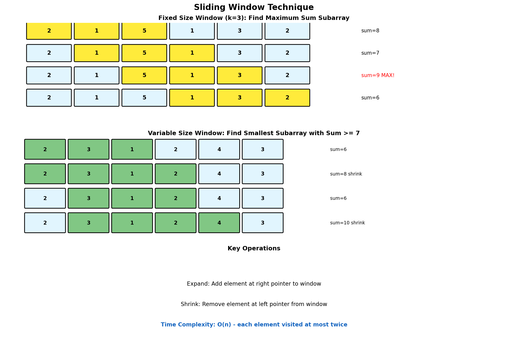
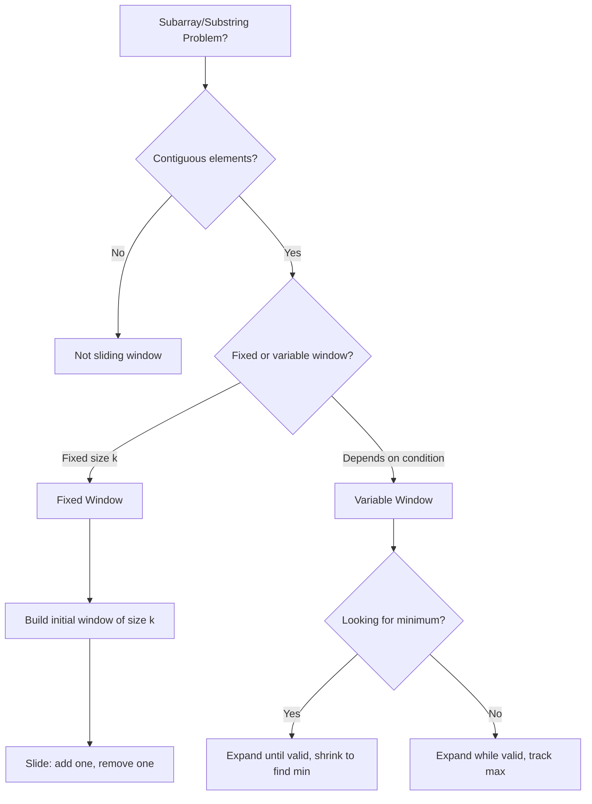

# Sliding Window Technique

> **$O(n)$ subarray/substring processing with a moving window**

---

## Overview

The Sliding Window technique maintains a window (contiguous subarray or substring) that expands or shrinks as it slides through data. It transforms nested $O(n^2)$ loops into linear $O(n)$ solutions by reusing computations from the previous window position.

### Visual Representation



### Two Types of Sliding Windows

| Type | Window Size | When to Use |
|------|-------------|-------------|
| **Fixed Size** | Constant k | Max sum of k elements, averages of k-sized windows |
| **Variable Size** | Dynamic | Smallest subarray with sum >= target, longest substring without repeats |

---

## Fixed Size Window

### Template

```python
def fixed_window_template(arr: list, k: int):
    """
    Fixed-size sliding window template.

    1. Build initial window of size k
    2. Slide window: add one element, remove one element
    3. Track result at each position

    Time: O(n), Space: O(1) or O(k) depending on problem
    """
    n = len(arr)
    if n < k:
        return None

    # Build initial window
    window_sum = sum(arr[:k])
    result = window_sum  # or initialize based on problem

    # Slide the window
    for i in range(k, n):
        # Add new element (entering window)
        window_sum += arr[i]
        # Remove old element (leaving window)
        window_sum -= arr[i - k]
        # Update result
        result = max(result, window_sum)  # or min, etc.

    return result
```

### Maximum Sum of K Consecutive Elements

::: code-group

```python [Python]
def max_sum_subarray(nums: list[int], k: int) -> int:
    """
    Find maximum sum of any contiguous subarray of size k.

    Time: O(n), Space: O(1)
    """
    if len(nums) < k:
        return -1

    # Build initial window
    window_sum = sum(nums[:k])
    max_sum = window_sum

    # Slide the window
    for i in range(k, len(nums)):
        window_sum += nums[i] - nums[i - k]
        max_sum = max(max_sum, window_sum)

    return max_sum


# Example usage
nums = [2, 1, 5, 1, 3, 2]
print(max_sum_subarray(nums, 3))  # Output: 9 (subarray [5, 1, 3])
```

```java [Java]
public int maxSumSubarray(int[] nums, int k) {
    if (nums.length < k) return -1;

    int windowSum = 0;
    for (int i = 0; i < k; i++) windowSum += nums[i];
    int maxSum = windowSum;

    for (int i = k; i < nums.length; i++) {
        windowSum += nums[i] - nums[i - k];
        maxSum = Math.max(maxSum, windowSum);
    }
    return maxSum;
}
```

:::

::: info Complexity: Time O(n) · Space O(1)
- **Time:** Initial window built in O(k); sliding takes O(n-k) with O(1) per slide (add new, subtract old)
- **Space:** Only constant variables for window sum and max tracking
:::

### Maximum of Each K-Size Window

::: code-group

```python [Python]
from collections import deque

def max_sliding_window(nums: list[int], k: int) -> list[int]:
    """
    Find maximum element in each window of size k.

    Uses monotonic decreasing deque:
    - Front of deque always has index of max in current window
    - Remove indices outside window
    - Remove smaller elements (they'll never be max)

    Time: O(n), Space: O(k)
    """
    if not nums or k == 0:
        return []

    result = []
    dq = deque()  # Stores indices, values at indices are decreasing

    for i in range(len(nums)):
        # Remove indices outside current window
        while dq and dq[0] < i - k + 1:
            dq.popleft()

        # Remove smaller elements (won't be max)
        while dq and nums[dq[-1]] < nums[i]:
            dq.pop()

        dq.append(i)

        # Add to result once window is complete
        if i >= k - 1:
            result.append(nums[dq[0]])

    return result


# Example usage
nums = [1, 3, -1, -3, 5, 3, 6, 7]
print(max_sliding_window(nums, 3))
# Output: [3, 3, 5, 5, 6, 7]
```

```java [Java]
public int[] maxSlidingWindow(int[] nums, int k) {
    if (nums == null || nums.length == 0 || k == 0) return new int[0];

    int n = nums.length;
    int[] result = new int[n - k + 1];
    Deque<Integer> dq = new ArrayDeque<>(); // stores indices

    for (int i = 0; i < n; i++) {
        // Remove indices outside window
        while (!dq.isEmpty() && dq.peekFirst() < i - k + 1) dq.pollFirst();

        // Remove indices of smaller elements
        while (!dq.isEmpty() && nums[dq.peekLast()] < nums[i]) dq.pollLast();

        dq.offerLast(i);

        if (i >= k - 1) result[i - k + 1] = nums[dq.peekFirst()];
    }
    return result;
}
```

:::

::: info Complexity: Time O(n) · Space O(k)
- **Time:** Each element processed once with O(1) amortized deque operations (each element added/removed at most once)
- **Space:** Monotonic deque stores at most k indices at any time
:::

### Moving Averages

```python
class MovingAverage:
    """
    Calculate moving average of last k elements.

    Time: O(1) per next(), Space: O(k)
    """
    def __init__(self, k: int):
        self.k = k
        self.window = deque()
        self.window_sum = 0

    def next(self, val: int) -> float:
        # Add new element
        self.window.append(val)
        self.window_sum += val

        # Remove oldest if window exceeds k
        if len(self.window) > self.k:
            self.window_sum -= self.window.popleft()

        return self.window_sum / len(self.window)


# Example usage
ma = MovingAverage(3)
print(ma.next(1))   # 1.0
print(ma.next(10))  # 5.5
print(ma.next(3))   # 4.67
print(ma.next(5))   # 6.0 (window: [10, 3, 5])
```

::: info Complexity: Time O(1) per next() · Space O(k)
- **Time:** Each next() call does constant work: append, potentially popleft, and arithmetic
- **Space:** Deque stores at most k elements for the sliding window
:::

---

## Variable Size Window

### Template

```python
def variable_window_template(arr: list, condition):
    """
    Variable-size sliding window template.

    1. Expand window by moving right pointer
    2. Shrink window when condition violated
    3. Track optimal result

    Time: O(n), Space: depends on problem
    """
    left = 0
    result = 0  # or float('inf') for minimum

    for right in range(len(arr)):
        # Expand: add arr[right] to window state

        # Shrink while condition is violated
        while condition_violated():
            # Remove arr[left] from window state
            left += 1

        # Update result with current valid window
        result = max(result, right - left + 1)

    return result
```

### Longest Substring Without Repeating Characters

::: code-group

```python [Python]
def length_of_longest_substring(s: str) -> int:
    """
    Find length of longest substring without repeating characters.

    Window shrinks when we see a duplicate character.

    Time: O(n), Space: O(min(m, n)) where m is charset size
    """
    char_index = {}  # Last seen index of each character
    left = 0
    max_length = 0

    for right, char in enumerate(s):
        # If char seen and in current window, shrink window
        if char in char_index and char_index[char] >= left:
            left = char_index[char] + 1

        char_index[char] = right
        max_length = max(max_length, right - left + 1)

    return max_length


# Alternative using set
def length_of_longest_substring_set(s: str) -> int:
    """Using a set instead of hashmap."""
    char_set = set()
    left = 0
    max_length = 0

    for right in range(len(s)):
        while s[right] in char_set:
            char_set.remove(s[left])
            left += 1

        char_set.add(s[right])
        max_length = max(max_length, right - left + 1)

    return max_length


# Example usage
print(length_of_longest_substring("abcabcbb"))  # 3 ("abc")
print(length_of_longest_substring("bbbbb"))     # 1 ("b")
print(length_of_longest_substring("pwwkew"))    # 3 ("wke")
```

```java [Java]
public int lengthOfLongestSubstring(String s) {
    Map<Character, Integer> charIndex = new HashMap<>();
    int left = 0, maxLength = 0;

    for (int right = 0; right < s.length(); right++) {
        char c = s.charAt(right);
        if (charIndex.containsKey(c) && charIndex.get(c) >= left) {
            left = charIndex.get(c) + 1;
        }
        charIndex.put(c, right);
        maxLength = Math.max(maxLength, right - left + 1);
    }
    return maxLength;
}
```

:::

::: info Complexity: Time O(n) · Space O(min(m, n)) where m is charset size
- **Time:** Each character visited at most twice (once by right pointer, once by left pointer adjustment)
- **Space:** HashMap stores at most min(charset size, string length) character-index pairs; set version uses O(min(m, n))
:::

### Minimum Size Subarray Sum

::: code-group

```python [Python]
def min_subarray_len(target: int, nums: list[int]) -> int:
    """
    Find minimal length subarray with sum >= target.

    Expand until sum >= target, then shrink to find minimum.

    Time: O(n), Space: O(1)
    """
    left = 0
    current_sum = 0
    min_length = float('inf')

    for right in range(len(nums)):
        # Expand window
        current_sum += nums[right]

        # Shrink while condition satisfied
        while current_sum >= target:
            min_length = min(min_length, right - left + 1)
            current_sum -= nums[left]
            left += 1

    return min_length if min_length != float('inf') else 0


# Example usage
print(min_subarray_len(7, [2, 3, 1, 2, 4, 3]))  # 2 ([4, 3])
print(min_subarray_len(4, [1, 4, 4]))           # 1 ([4])
print(min_subarray_len(11, [1, 1, 1, 1, 1]))    # 0 (impossible)
```

```java [Java]
public int minSubArrayLen(int target, int[] nums) {
    int left = 0, currentSum = 0, minLength = Integer.MAX_VALUE;

    for (int right = 0; right < nums.length; right++) {
        currentSum += nums[right];

        while (currentSum >= target) {
            minLength = Math.min(minLength, right - left + 1);
            currentSum -= nums[left++];
        }
    }
    return minLength == Integer.MAX_VALUE ? 0 : minLength;
}
```

:::

::: info Complexity: Time O(n) · Space O(1)
- **Time:** Left pointer moves at most n times total across all iterations; right pointer moves n times - overall O(n)
- **Space:** Only constant variables for sum tracking and length
:::

### Longest Substring with At Most K Distinct Characters

```python
def longest_k_distinct(s: str, k: int) -> int:
    """
    Find longest substring with at most k distinct characters.

    Time: O(n), Space: O(k)
    """
    from collections import defaultdict

    char_count = defaultdict(int)
    left = 0
    max_length = 0

    for right in range(len(s)):
        # Expand window
        char_count[s[right]] += 1

        # Shrink while more than k distinct characters
        while len(char_count) > k:
            char_count[s[left]] -= 1
            if char_count[s[left]] == 0:
                del char_count[s[left]]
            left += 1

        max_length = max(max_length, right - left + 1)

    return max_length


# Example usage
print(longest_k_distinct("eceba", 2))   # 3 ("ece")
print(longest_k_distinct("aa", 1))      # 2 ("aa")
```

::: info Complexity: Time O(n) · Space O(k)
- **Time:** Each character processed once by right pointer; left pointer moves at most n times total across all iterations
- **Space:** HashMap stores at most k distinct character counts
:::

### Minimum Window Substring

::: code-group

```python [Python]
from collections import Counter

def min_window(s: str, t: str) -> str:
    """
    Find minimum window in s that contains all characters of t.

    Time: O(n + m), Space: O(m) where m = len(t)
    """
    if not s or not t or len(s) < len(t):
        return ""

    # Count characters needed
    need = Counter(t)
    required = len(need)  # Number of unique chars needed
    have = 0  # Number of unique chars we have enough of

    window_counts = {}
    left = 0
    min_len = float('inf')
    result = ""

    for right in range(len(s)):
        # Expand window
        char = s[right]
        window_counts[char] = window_counts.get(char, 0) + 1

        # Check if we have enough of this char
        if char in need and window_counts[char] == need[char]:
            have += 1

        # Shrink while we have all required characters
        while have == required:
            # Update result
            if right - left + 1 < min_len:
                min_len = right - left + 1
                result = s[left:right + 1]

            # Shrink from left
            left_char = s[left]
            window_counts[left_char] -= 1
            if left_char in need and window_counts[left_char] < need[left_char]:
                have -= 1
            left += 1

    return result


# Example usage
print(min_window("ADOBECODEBANC", "ABC"))  # "BANC"
print(min_window("a", "a"))                 # "a"
print(min_window("a", "aa"))                # ""
```

```java [Java]
public String minWindow(String s, String t) {
    if (s.isEmpty() || t.isEmpty() || s.length() < t.length()) return "";

    Map<Character, Integer> need = new HashMap<>();
    for (char c : t.toCharArray()) need.merge(c, 1, Integer::sum);

    int required = need.size(), have = 0;
    Map<Character, Integer> window = new HashMap<>();
    int left = 0, minLen = Integer.MAX_VALUE, start = 0;

    for (int right = 0; right < s.length(); right++) {
        char c = s.charAt(right);
        window.merge(c, 1, Integer::sum);
        if (need.containsKey(c) && window.get(c).equals(need.get(c))) have++;

        while (have == required) {
            if (right - left + 1 < minLen) {
                minLen = right - left + 1;
                start  = left;
            }
            char lc = s.charAt(left);
            window.merge(lc, -1, Integer::sum);
            if (need.containsKey(lc) && window.get(lc) < need.get(lc)) have--;
            left++;
        }
    }
    return minLen == Integer.MAX_VALUE ? "" : s.substring(start, start + minLen);
}
```

:::

::: info Complexity: Time O(n + m) · Space O(m) where m = len(t)
- **Time:** O(m) to build character count; O(n) for sliding window where each character visited at most twice
- **Space:** Two hashmaps storing at most m distinct characters from pattern t
:::

---

## Subarray Product Problems

### Maximum Product Subarray (Fixed Start)

```python
def num_subarray_product_less_than_k(nums: list[int], k: int) -> int:
    """
    Count subarrays with product < k.

    Key insight: When we add a new element, it creates
    (right - left + 1) new subarrays ending at right.

    Time: O(n), Space: O(1)
    """
    if k <= 1:
        return 0

    left = 0
    product = 1
    count = 0

    for right in range(len(nums)):
        product *= nums[right]

        while product >= k:
            product //= nums[left]
            left += 1

        # All subarrays ending at right with product < k
        count += right - left + 1

    return count


# Example usage
print(num_subarray_product_less_than_k([10, 5, 2, 6], 100))  # 8
```

::: info Complexity: Time O(n) · Space O(1)
- **Time:** Each element processed once; left pointer moves at most n times total ensuring linear time
- **Space:** Only constant variables for product tracking and counting
:::

---

## String Permutation Problems

### Permutation in String

```python
def check_inclusion(s1: str, s2: str) -> bool:
    """
    Check if s2 contains a permutation of s1.

    Fixed-size window of len(s1), check if char counts match.

    Time: O(n), Space: O(1) since charset is fixed
    """
    if len(s1) > len(s2):
        return False

    s1_count = Counter(s1)
    window_count = Counter(s2[:len(s1)])

    if s1_count == window_count:
        return True

    for i in range(len(s1), len(s2)):
        # Add new char
        window_count[s2[i]] += 1

        # Remove old char
        old_char = s2[i - len(s1)]
        window_count[old_char] -= 1
        if window_count[old_char] == 0:
            del window_count[old_char]

        if s1_count == window_count:
            return True

    return False


# Example usage
print(check_inclusion("ab", "eidbaooo"))  # True
print(check_inclusion("ab", "eidboaoo"))  # False
```

::: info Complexity: Time O(n) · Space O(1)
- **Time:** Build initial window O(m); slide through remaining n-m positions with O(1) counter comparison at each step
- **Space:** Two Counter objects with at most 26 lowercase letters (constant for fixed charset)
:::

### Find All Anagrams

```python
def find_anagrams(s: str, p: str) -> list[int]:
    """
    Find starting indices of p's anagrams in s.

    Time: O(n), Space: O(1)
    """
    if len(p) > len(s):
        return []

    p_count = Counter(p)
    window_count = Counter(s[:len(p)])
    result = []

    if p_count == window_count:
        result.append(0)

    for i in range(len(p), len(s)):
        # Add new char
        window_count[s[i]] += 1

        # Remove old char
        old_char = s[i - len(p)]
        window_count[old_char] -= 1
        if window_count[old_char] == 0:
            del window_count[old_char]

        if p_count == window_count:
            result.append(i - len(p) + 1)

    return result


# Example usage
print(find_anagrams("cbaebabacd", "abc"))  # [0, 6]
```

::: info Complexity: Time O(n) · Space O(1)
- **Time:** Similar to check_inclusion - single pass with O(1) counter operations per position
- **Space:** Fixed size counters for alphabet (26 characters maximum)
:::

---

## Decision Flowchart



---

## Common Mistakes

### 1. Not Handling Empty/Small Input

```python
# WRONG: May crash
def max_sum(nums, k):
    window = sum(nums[:k])  # Crashes if len(nums) < k

# CORRECT: Check bounds
def max_sum(nums, k):
    if len(nums) < k:
        return -1
    window = sum(nums[:k])
```

### 2. Wrong Window Size Calculation

```python
# WRONG: Off by one
window_size = right - left  # Missing +1

# CORRECT
window_size = right - left + 1
```

### 3. Not Cleaning Up Data Structure

```python
# WRONG: Memory leak in char counts
char_count[s[left]] -= 1
left += 1

# CORRECT: Remove zero counts
char_count[s[left]] -= 1
if char_count[s[left]] == 0:
    del char_count[s[left]]
left += 1
```

---

## Complexity Summary

| Problem Type | Time | Space |
|-------------|------|-------|
| Fixed window | $O(n)$ | $O(1)$ or $O(k)$ |
| Variable window | $O(n)$ | $O(1)$ or $O(k)$ |
| Max of each window | $O(n)$ | $O(k)$ with deque |
| Minimum window substring | $O(n + m)$ | $O(m)$ |

---

## Related LeetCode Problems

| Problem | Difficulty | Type |
|---------|------------|------|
| Maximum Average Subarray I | Easy | [Fixed](https://leetcode.com/problems/maximum-average-subarray-i/) |
| Sliding Window Maximum | Hard | [Fixed + Deque](https://leetcode.com/problems/sliding-window-maximum/) |
| Longest Substring Without Repeating Characters | Medium | [Variable](https://leetcode.com/problems/longest-substring-without-repeating-characters/) |
| Minimum Size Subarray Sum | Medium | [Variable](https://leetcode.com/problems/minimum-size-subarray-sum/) |
| Minimum Window Substring | Hard | [Variable](https://leetcode.com/problems/minimum-window-substring/) |
| Permutation in String | Medium | [Fixed](https://leetcode.com/problems/permutation-in-string/) |
| Find All Anagrams in a String | Medium | [Fixed](https://leetcode.com/problems/find-all-anagrams-in-a-string/) |
| Longest Repeating Character Replacement | Medium | [Variable](https://leetcode.com/problems/longest-repeating-character-replacement/) |

---

## Interview Tips

1. **Identify the window type**: Fixed size or variable size?
2. **Define window state**: What do you need to track? (sum, count, set)
3. **Define valid window**: What makes a window valid/invalid?
4. **Expand first, then shrink**: For variable windows, expand until condition met, then shrink
5. **Watch for off-by-one**: Window size is `right - left + 1`

---

## References

- [Sliding Window - Tech Interview Handbook](https://www.techinterviewhandbook.org/algorithms/sliding-window/)
- [Sliding Window Problems - LeetCode](https://leetcode.com/tag/sliding-window/)
- [Sliding Window Pattern - educative.io](https://www.educative.io/courses/grokking-the-coding-interview/xlwjwxZLWQJ)
