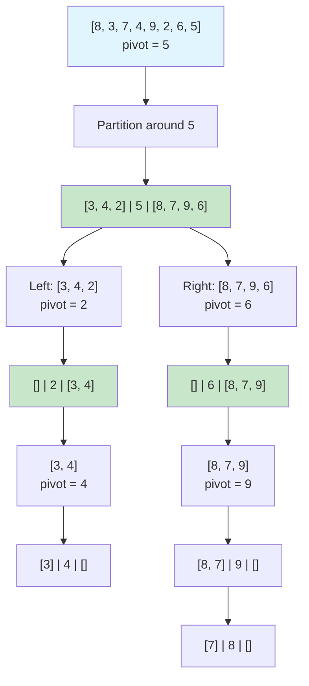
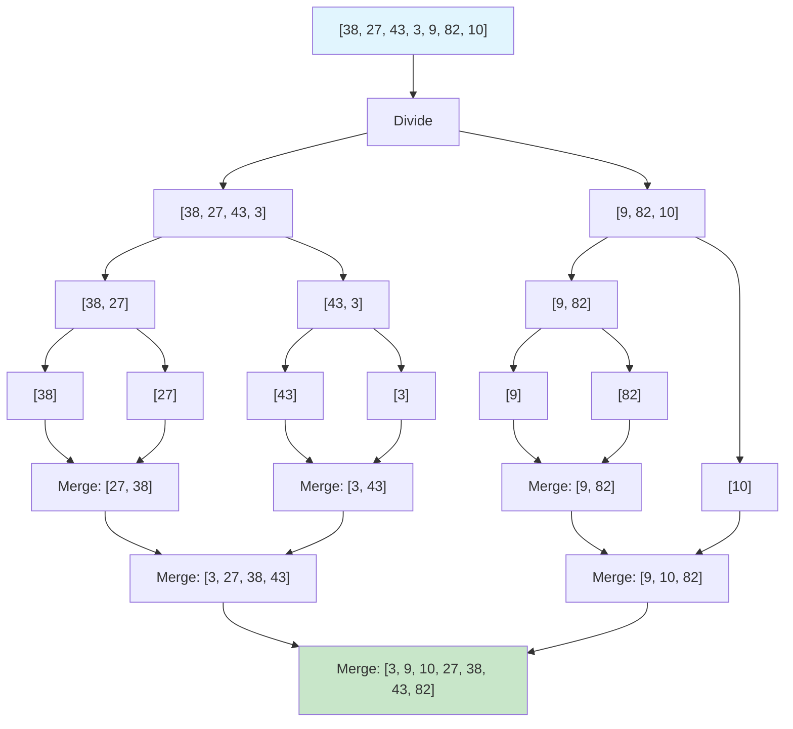
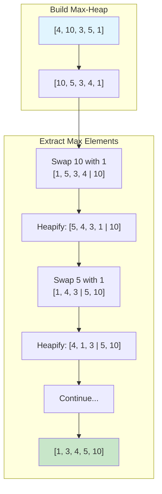
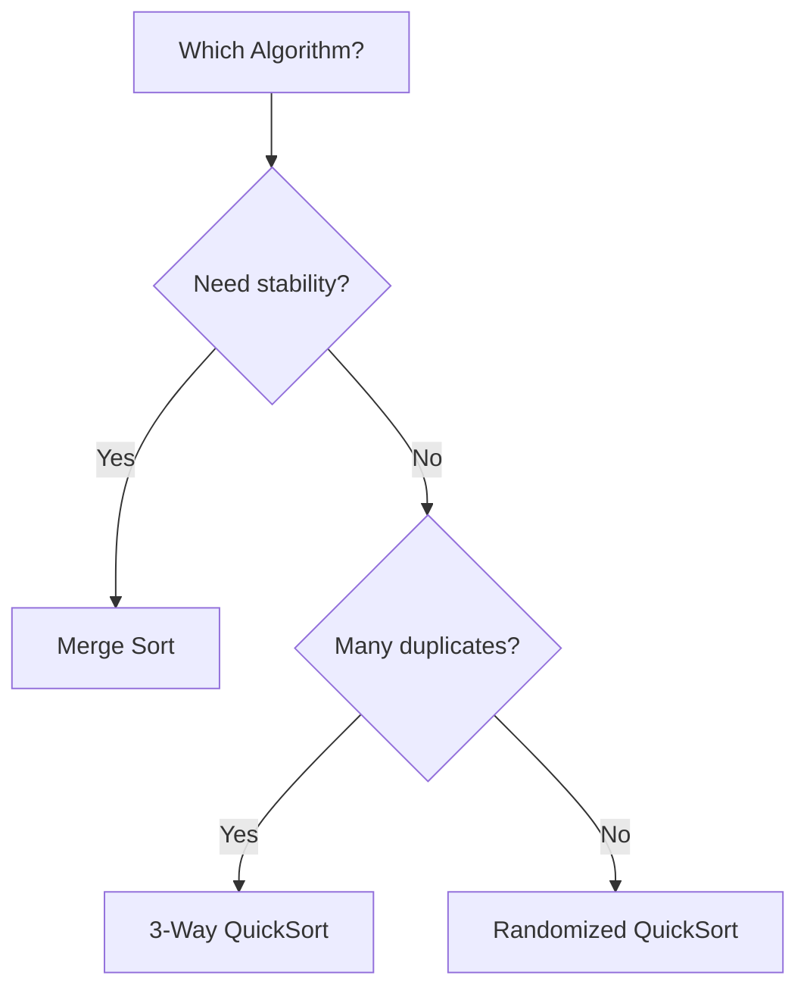
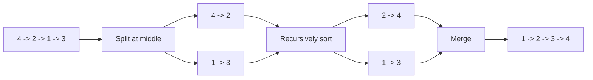

# Sorting Algorithms

> **Fundamental algorithms every engineer must know**

---

## Overview

Sorting is one of the most fundamental operations in computer science. A sorting algorithm rearranges elements of a list into a specific order (typically numerical or lexicographical, ascending or descending). Efficient sorting is critical because it optimizes the performance of other algorithms like binary search and merge operations that require sorted input.

### Why Sorting Matters

1. **Search Optimization**: Binary search requires sorted data for $O(\log n)$ lookups
2. **Data Organization**: Makes data easier to analyze and visualize
3. **Duplicate Detection**: Finding duplicates becomes $O(n)$ with sorted data
4. **Algorithm Prerequisites**: Many algorithms assume sorted input (merge operations, set operations)

### Comparison vs Non-Comparison Sorts

| Category | Examples | Lower Bound | Use Case |
|----------|----------|-------------|----------|
| **Comparison-Based** | Quick Sort, Merge Sort, Heap Sort | $O(n \log n)$ | General purpose, any comparable data |
| **Non-Comparison Based** | Counting Sort, Radix Sort, Bucket Sort | $O(n)$ | Integer data within known range |

Comparison sorts compare pairs of elements to determine order and cannot be faster than $O(n \log n)$ on average. Non-comparison sorts exploit properties of the data (like integer ranges) to achieve linear time but have more restricted use cases.

### Key Properties to Consider

- **Time Complexity**: How does runtime scale with input size?
- **Space Complexity**: How much extra memory is needed?
- **Stability**: Do equal elements maintain their relative order?
- **In-Place**: Can it sort with $O(1)$ extra space?
- **Adaptivity**: Does it run faster on partially sorted data?

---

## Visual Guides

### QuickSort Partitioning
<!-- TODO: Add visualization  -->

### MergeSort Divide & Conquer
<!-- TODO: Add visualization  -->

### Algorithm Comparison
<!-- TODO: Add visualization  -->

### Sorting Stability
<!-- TODO: Add visualization  -->

---

## Quick Sort

Quick Sort is the most widely used sorting algorithm in practice. It uses a divide-and-conquer strategy with in-place partitioning, making it memory-efficient and cache-friendly.

### Algorithm

1. **Choose a Pivot**: Select an element as the pivot (commonly the last element, first element, or median-of-three)
2. **Partition**: Rearrange elements so that:
   - All elements less than pivot are on the left
   - All elements greater than pivot are on the right
   - The pivot is in its final sorted position
3. **Recurse**: Apply the same process to left and right subarrays

### Mermaid Diagram



### Implementation

::: code-group

```python [Python]
def quicksort(arr, low=0, high=None):
    """
    Quick Sort implementation using Lomuto partition scheme.
    Sorts array in-place.

    Args:
        arr: List to sort
        low: Starting index (default 0)
        high: Ending index (default last element)

    Returns:
        Sorted array (same reference, modified in-place)
    """
    if high is None:
        high = len(arr) - 1

    if low < high:
        pivot_idx = partition(arr, low, high)
        quicksort(arr, low, pivot_idx - 1)
        quicksort(arr, pivot_idx + 1, high)
    return arr

def partition(arr, low, high):
    """
    Lomuto partition scheme: uses last element as pivot.
    Rearranges array so elements < pivot are left, > pivot are right.

    Returns:
        Final index of pivot element
    """
    pivot = arr[high]  # Choose last element as pivot
    i = low - 1        # Index of smaller element

    for j in range(low, high):
        if arr[j] <= pivot:
            i += 1
            arr[i], arr[j] = arr[j], arr[i]

    # Place pivot in its correct position
    arr[i + 1], arr[high] = arr[high], arr[i + 1]
    return i + 1


# Example usage
arr = [64, 34, 25, 12, 22, 11, 90]
print(f"Original: {arr}")
quicksort(arr)
print(f"Sorted:   {arr}")
# Output: [11, 12, 22, 25, 34, 64, 90]
```

```java [Java]
public void quicksort(int[] arr, int low, int high) {
    if (low < high) {
        int pivotIdx = partition(arr, low, high);
        quicksort(arr, low, pivotIdx - 1);
        quicksort(arr, pivotIdx + 1, high);
    }
}

private int partition(int[] arr, int low, int high) {
    int pivot = arr[high];
    int i = low - 1;

    for (int j = low; j < high; j++) {
        if (arr[j] <= pivot) {
            i++;
            int tmp = arr[i]; arr[i] = arr[j]; arr[j] = tmp;
        }
    }
    int tmp = arr[i + 1]; arr[i + 1] = arr[high]; arr[high] = tmp;
    return i + 1;
}
```

:::

::: info Complexity: Time O(n log n) average, O(n^2) worst · Space O(log n) average
- **Time:** Average case with balanced partitions: T(n) = 2T(n/2) + O(n) = O(n log n); worst case with extreme pivots: O(n^2)
- **Space:** Recursive call stack depth is O(log n) average, O(n) worst case
:::

### Optimized Quick Sort with Randomization

```python
import random

def quicksort_randomized(arr, low=0, high=None):
    """
    Quick Sort with random pivot selection.
    Avoids worst-case O(n^2) on sorted/reverse-sorted input.
    """
    if high is None:
        high = len(arr) - 1

    if low < high:
        pivot_idx = randomized_partition(arr, low, high)
        quicksort_randomized(arr, low, pivot_idx - 1)
        quicksort_randomized(arr, pivot_idx + 1, high)
    return arr

def randomized_partition(arr, low, high):
    """Randomly select pivot and partition."""
    pivot_idx = random.randint(low, high)
    arr[pivot_idx], arr[high] = arr[high], arr[pivot_idx]
    return partition(arr, low, high)
```

::: info Complexity: Time O(n log n) expected · Space O(log n)
- **Time:** Random pivot selection ensures expected balanced partitions, avoiding O(n^2) worst case on sorted inputs
- **Space:** Same recursive stack depth as basic quicksort
:::

### Three-Way Quick Sort (For Duplicates)

```python
def quicksort_3way(arr, low=0, high=None):
    """
    Three-way Quick Sort: handles duplicate keys efficiently.
    Partitions into: [< pivot] [= pivot] [> pivot]
    """
    if high is None:
        high = len(arr) - 1

    if low >= high:
        return arr

    lt, gt = low, high
    pivot = arr[low]
    i = low + 1

    while i <= gt:
        if arr[i] < pivot:
            arr[lt], arr[i] = arr[i], arr[lt]
            lt += 1
            i += 1
        elif arr[i] > pivot:
            arr[gt], arr[i] = arr[i], arr[gt]
            gt -= 1
        else:
            i += 1

    quicksort_3way(arr, low, lt - 1)
    quicksort_3way(arr, gt + 1, high)
    return arr
```

::: info Complexity: Time O(n log n) average · Space O(log n)
- **Time:** Three-way partitioning groups equal elements together, efficiently handling duplicates without redundant comparisons
- **Space:** Same recursive stack depth; in-place partitioning uses constant auxiliary space per level
:::

### Complexity

| Case | Time | When It Occurs |
|------|------|----------------|
| **Best** | $O(n \log n)$ | Pivot divides array into equal halves |
| **Average** | $O(n \log n)$ | Random data with good pivot selection |
| **Worst** | $O(n^2)$ | Already sorted or all elements equal |

- **Space Complexity**: $O(\log n)$ average for recursion stack, $O(n)$ worst case
- **Stability**: Not stable (equal elements may change relative order)
- **In-Place**: Yes ($O(1)$ auxiliary space aside from recursion)

### When Quick Sort Struggles

- Already sorted or reverse-sorted arrays (use randomized pivot)
- Many duplicate elements (use 3-way partitioning)
- Small subarrays (switch to insertion sort for n < 10)

---

## Merge Sort

Merge Sort is a stable, divide-and-conquer algorithm with guaranteed $O(n \log n)$ performance. It is preferred when stability is required or when sorting linked lists.

### Algorithm

1. **Divide**: Split the array into two halves
2. **Conquer**: Recursively sort each half
3. **Merge**: Combine the two sorted halves into one sorted array



### Implementation

::: code-group

```python [Python]
def mergesort(arr):
    """
    Merge Sort implementation.
    Creates new arrays during merge (not in-place).

    Args:
        arr: List to sort

    Returns:
        New sorted list
    """
    if len(arr) <= 1:
        return arr

    mid = len(arr) // 2
    left = mergesort(arr[:mid])
    right = mergesort(arr[mid:])

    return merge(left, right)

def merge(left, right):
    """
    Merge two sorted arrays into one sorted array.
    Uses two pointers technique.
    """
    result = []
    i = j = 0

    while i < len(left) and j < len(right):
        if left[i] <= right[j]:  # <= ensures stability
            result.append(left[i])
            i += 1
        else:
            result.append(right[j])
            j += 1

    # Append remaining elements
    result.extend(left[i:])
    result.extend(right[j:])
    return result


# Example usage
arr = [64, 34, 25, 12, 22, 11, 90]
sorted_arr = mergesort(arr)
print(f"Original: {arr}")
print(f"Sorted:   {sorted_arr}")
```

```java [Java]
public int[] mergesort(int[] arr) {
    if (arr.length <= 1) return arr;

    int mid = arr.length / 2;
    int[] left  = mergesort(Arrays.copyOfRange(arr, 0, mid));
    int[] right = mergesort(Arrays.copyOfRange(arr, mid, arr.length));
    return merge(left, right);
}

private int[] merge(int[] left, int[] right) {
    int[] result = new int[left.length + right.length];
    int i = 0, j = 0, k = 0;

    while (i < left.length && j < right.length) {
        if (left[i] <= right[j]) {   // <= preserves stability
            result[k++] = left[i++];
        } else {
            result[k++] = right[j++];
        }
    }
    while (i < left.length)  result[k++] = left[i++];
    while (j < right.length) result[k++] = right[j++];
    return result;
}
```

:::

::: info Complexity: Time O(n log n) · Space O(n)
- **Time:** Guaranteed O(n log n) in all cases - always divides in half and merges in O(n)
- **Space:** Creates new arrays during merge; total O(n) auxiliary space for temporary arrays
:::

### In-Place Merge Sort (Space Optimized)

```python
def mergesort_inplace(arr, left=0, right=None):
    """
    In-place Merge Sort using auxiliary array for merging.
    Modifies original array.
    """
    if right is None:
        right = len(arr) - 1

    if left < right:
        mid = (left + right) // 2
        mergesort_inplace(arr, left, mid)
        mergesort_inplace(arr, mid + 1, right)
        merge_inplace(arr, left, mid, right)

def merge_inplace(arr, left, mid, right):
    """Merge two sorted subarrays within the same array."""
    # Create temporary arrays
    left_arr = arr[left:mid + 1]
    right_arr = arr[mid + 1:right + 1]

    i = j = 0
    k = left

    while i < len(left_arr) and j < len(right_arr):
        if left_arr[i] <= right_arr[j]:
            arr[k] = left_arr[i]
            i += 1
        else:
            arr[k] = right_arr[j]
            j += 1
        k += 1

    while i < len(left_arr):
        arr[k] = left_arr[i]
        i += 1
        k += 1

    while j < len(right_arr):
        arr[k] = right_arr[j]
        j += 1
        k += 1
```

::: info Complexity: Time O(n log n) · Space O(n)
- **Time:** Same as standard merge sort - divide and merge operations remain unchanged
- **Space:** Still requires O(n) for temporary arrays during merge; modifies input in-place
:::

### Bottom-Up Merge Sort (Iterative)

```python
def mergesort_iterative(arr):
    """
    Iterative (bottom-up) Merge Sort.
    Avoids recursion overhead.
    """
    n = len(arr)
    size = 1  # Start with subarrays of size 1

    while size < n:
        for left in range(0, n, 2 * size):
            mid = min(left + size - 1, n - 1)
            right = min(left + 2 * size - 1, n - 1)

            if mid < right:
                merge_inplace(arr, left, mid, right)

        size *= 2

    return arr
```

::: info Complexity: Time O(n log n) · Space O(n)
- **Time:** Iteratively merges subarrays of size 1, 2, 4, 8... until fully sorted; O(log n) passes with O(n) merges each
- **Space:** Avoids recursion stack but still needs O(n) temporary space for merge operations
:::

### Complexity

| Case | Time | Reason |
|------|------|--------|
| **Best** | $O(n \log n)$ | Always divides and merges |
| **Average** | $O(n \log n)$ | Consistent regardless of input |
| **Worst** | $O(n \log n)$ | No degradation on any input |

- **Space Complexity**: $O(n)$ for auxiliary array during merge
- **Stability**: Yes (equal elements maintain relative order)
- **In-Place**: No (requires $O(n)$ extra space)

### Merge Sort for Linked Lists

Merge Sort is particularly efficient for linked lists because:
1. No random access needed (sequential traversal suffices)
2. Merging can be done in $O(1)$ extra space by rearranging pointers
3. No costly array copying

---

## Heap Sort

Heap Sort uses a binary heap data structure to sort elements. It provides $O(n \log n)$ worst-case performance with $O(1)$ extra space.

### Algorithm

1. **Build Max-Heap**: Transform array into a max-heap (parent >= children)
2. **Extract Maximum**: Repeatedly remove the largest element and restore heap property
3. **Result**: Array is sorted in ascending order



### Implementation

::: code-group

```python [Python]
import heapq

def heapsort_simple(arr):
    """
    Heap Sort using Python's heapq (min-heap).
    Creates a new sorted list.
    """
    heapq.heapify(arr)
    return [heapq.heappop(arr) for _ in range(len(arr))]


# In-place Heap Sort implementation
def heapsort(arr):
    """
    In-place Heap Sort using max-heap.
    Sorts array in ascending order.
    """
    n = len(arr)

    # Build max-heap (rearrange array)
    for i in range(n // 2 - 1, -1, -1):
        heapify(arr, n, i)

    # Extract elements from heap one by one
    for i in range(n - 1, 0, -1):
        arr[0], arr[i] = arr[i], arr[0]  # Move current root to end
        heapify(arr, i, 0)  # Heapify reduced heap

    return arr

def heapify(arr, n, i):
    """
    Maintain max-heap property for subtree rooted at index i.
    n is the size of the heap.
    """
    largest = i
    left = 2 * i + 1
    right = 2 * i + 2

    if left < n and arr[left] > arr[largest]:
        largest = left

    if right < n and arr[right] > arr[largest]:
        largest = right

    if largest != i:
        arr[i], arr[largest] = arr[largest], arr[i]
        heapify(arr, n, largest)


# Example usage
arr = [64, 34, 25, 12, 22, 11, 90]
print(f"Original: {arr}")
heapsort(arr)
print(f"Sorted:   {arr}")
```

```java [Java]
public void heapsort(int[] arr) {
    int n = arr.length;

    // Build max-heap
    for (int i = n / 2 - 1; i >= 0; i--) {
        heapify(arr, n, i);
    }

    // Extract elements one by one
    for (int i = n - 1; i > 0; i--) {
        int tmp = arr[0]; arr[0] = arr[i]; arr[i] = tmp;
        heapify(arr, i, 0);
    }
}

private void heapify(int[] arr, int n, int i) {
    int largest = i;
    int left    = 2 * i + 1;
    int right   = 2 * i + 2;

    if (left  < n && arr[left]  > arr[largest]) largest = left;
    if (right < n && arr[right] > arr[largest]) largest = right;

    if (largest != i) {
        int tmp = arr[i]; arr[i] = arr[largest]; arr[largest] = tmp;
        heapify(arr, n, largest);
    }
}
```

:::

::: info Complexity: Time O(n log n) · Space O(1)
- **Time:** Build heap O(n); extract n elements with O(log n) heapify each = O(n log n) total
- **Space:** In-place sorting uses only constant auxiliary space for swaps
:::

### Complexity

| Case | Time | Reason |
|------|------|--------|
| **Best** | $O(n \log n)$ | Must heapify all elements |
| **Average** | $O(n \log n)$ | Consistent performance |
| **Worst** | $O(n \log n)$ | No degradation |

- **Space Complexity**: $O(1)$ in-place variant, $O(n)$ for simple version
- **Stability**: Not stable
- **In-Place**: Yes

### Heap Sort Characteristics

**Advantages:**
- Guaranteed $O(n \log n)$ worst-case
- $O(1)$ extra space (in-place)
- No recursive calls in iterative version

**Disadvantages:**
- Poor cache locality (jumps around memory)
- Not stable
- Generally slower than Quick Sort in practice

---

## Other Important Sorting Algorithms

### Insertion Sort

Best for small arrays or nearly sorted data.

```python
def insertion_sort(arr):
    """
    Insertion Sort: O(n^2) average, O(n) for nearly sorted.
    Stable and in-place.
    """
    for i in range(1, len(arr)):
        key = arr[i]
        j = i - 1

        while j >= 0 and arr[j] > key:
            arr[j + 1] = arr[j]
            j -= 1

        arr[j + 1] = key
    return arr
```

::: info Complexity: Time O(n^2) average, O(n) best · Space O(1)
- **Time:** Best case O(n) when nearly sorted (few shifts needed); worst case O(n^2) with reverse-sorted input
- **Space:** In-place sorting with only constant space for key variable
:::

### Counting Sort

Linear time for integers in a known range.

```python
def counting_sort(arr):
    """
    Counting Sort: O(n + k) where k is the range.
    Stable, not in-place.
    """
    if not arr:
        return arr

    min_val, max_val = min(arr), max(arr)
    range_size = max_val - min_val + 1

    count = [0] * range_size
    output = [0] * len(arr)

    # Count occurrences
    for num in arr:
        count[num - min_val] += 1

    # Cumulative count
    for i in range(1, range_size):
        count[i] += count[i - 1]

    # Build output array (traverse backwards for stability)
    for i in range(len(arr) - 1, -1, -1):
        output[count[arr[i] - min_val] - 1] = arr[i]
        count[arr[i] - min_val] -= 1

    return output
```

::: info Complexity: Time O(n + k) · Space O(n + k) where k is the range
- **Time:** Count occurrences O(n); cumulative sum O(k); place elements O(n)
- **Space:** Count array of size k; output array of size n
:::

### Radix Sort

Sort integers digit by digit.

```python
def radix_sort(arr):
    """
    Radix Sort: O(d * (n + k)) where d is digits, k is base.
    Uses Counting Sort as subroutine.
    """
    if not arr:
        return arr

    max_val = max(arr)
    exp = 1

    while max_val // exp > 0:
        counting_sort_by_digit(arr, exp)
        exp *= 10

    return arr

def counting_sort_by_digit(arr, exp):
    """Sort array by digit at position exp."""
    n = len(arr)
    output = [0] * n
    count = [0] * 10

    for num in arr:
        index = (num // exp) % 10
        count[index] += 1

    for i in range(1, 10):
        count[i] += count[i - 1]

    for i in range(n - 1, -1, -1):
        index = (arr[i] // exp) % 10
        output[count[index] - 1] = arr[i]
        count[index] -= 1

    for i in range(n):
        arr[i] = output[i]
```

::: info Complexity: Time O(d * n) · Space O(n + k) where d = digits, k = base (10)
- **Time:** d passes (one per digit); each pass does O(n + 10) counting sort = O(d * n)
- **Space:** Count array of size 10; output array of size n reused each pass
:::

---

## Comparison Summary

| Algorithm | Best | Average | Worst | Space | Stable | Use Case |
|-----------|------|---------|-------|-------|--------|----------|
| **Quick Sort** | $O(n \log n)$ | $O(n \log n)$ | $O(n^2)$ | $O(\log n)$ | No | General purpose, arrays |
| **Merge Sort** | $O(n \log n)$ | $O(n \log n)$ | $O(n \log n)$ | $O(n)$ | Yes | Need stability, linked lists |
| **Heap Sort** | $O(n \log n)$ | $O(n \log n)$ | $O(n \log n)$ | $O(1)$ | No | Memory constrained |
| **Insertion Sort** | $O(n)$ | $O(n^2)$ | $O(n^2)$ | $O(1)$ | Yes | Small or nearly sorted |
| **Counting Sort** | $O(n + k)$ | $O(n + k)$ | $O(n + k)$ | $O(n + k)$ | Yes | Integers in small range |
| **Radix Sort** | $O(d \cdot n)$ | $O(d \cdot n)$ | $O(d \cdot n)$ | $O(n + k)$ | Yes | Fixed-length integers |

### Choosing the Right Algorithm

```
Is stability required?
├── Yes: Merge Sort or Counting/Radix Sort
└── No:
    ├── Memory constrained? → Heap Sort
    └── General purpose? → Quick Sort

Is data nearly sorted?
├── Yes: Insertion Sort
└── No: Quick/Merge Sort

Are there many duplicates?
├── Yes: 3-way Quick Sort
└── No: Standard Quick Sort

Is data integers in small range?
├── Yes: Counting Sort
└── No: Comparison-based sort
```

---

## When Google Asks About Sorting

### Interview Expectations

At top tech companies, you are expected to:

1. **Know Complexity**: Instantly recall time and space complexity for all major algorithms
2. **Implement from Scratch**: Write Quick Sort and Merge Sort without reference
3. **Choose Appropriately**: Select the right algorithm based on constraints
4. **Optimize**: Know when to switch to simpler algorithms (Insertion Sort for small n)
5. **Understand Trade-offs**: Stability, space, cache locality, worst-case guarantees

### Common Interview Questions

1. **"Sort this array"** - Usually just use built-in sort, but know what it uses (Timsort)
2. **"Implement Quick Sort"** - Know partitioning, handle edge cases
3. **"Why is Merge Sort better for linked lists?"** - No random access, $O(1)$ merge space
4. **"Sort in $O(n)$ time"** - Counting Sort or Radix Sort if constraints allow
5. **"Find kth largest element"** - QuickSelect (partition-based, $O(n)$ average)
6. **"Sort nearly sorted array"** - Insertion Sort or min-heap

### What NOT to Say

- "Quick Sort is always fastest" (worst case is $O(n^2)$)
- "Merge Sort is inefficient" (it is preferred for stability and linked lists)
- "I would use Bubble Sort" (almost never the right answer)

### Real-World Implementations

| Language | Built-in Sort | Algorithm |
|----------|--------------|-----------|
| Python | `sorted()`, `list.sort()` | Timsort (Merge + Insertion) |
| Java | `Arrays.sort()` | Dual-Pivot Quicksort (primitives), Timsort (objects) |
| C++ | `std::sort()` | Introsort (Quick + Heap + Insertion) |
| JavaScript | `Array.sort()` | Varies by engine (often Timsort) |

---

## Practice Problems

::: details Sort an Array (LeetCode 912)
**Problem:** Given an array of integers, sort it in ascending order without using built-in functions. Must be O(n log n) time with smallest space possible.

**Key Insight:** This is the classic problem to practice implementing sorting algorithms from scratch. Three-way QuickSort handles duplicates well.

**Approach:** Implement Merge Sort for guaranteed O(n log n), or randomized QuickSort with three-way partitioning. For very large arrays with many duplicates, three-way partition prevents O(n^2) degradation.

**Complexity:** O(n log n) time; O(n) space for Merge Sort, O(log n) for QuickSort


:::

::: details Sort List (LeetCode 148)
**Problem:** Sort a linked list in O(n log n) time. Follow-up: Can you do it with O(1) space?

**Key Insight:** Merge Sort is ideal for linked lists because merging requires no extra space (just pointer manipulation), unlike arrays.

**Approach:** Use fast/slow pointers to find middle, split list, recursively sort halves, then merge. For O(1) space, use bottom-up merge sort iteratively merging sublists of size 1, 2, 4, 8...

**Complexity:** O(n log n) time; O(log n) space recursive, O(1) space iterative


:::

::: details Kth Largest Element in an Array (LeetCode 215)
**Problem:** Find the kth largest element in an unsorted array (not kth distinct).

**Key Insight:** QuickSelect achieves O(n) average by only recursing into the partition containing the target index, unlike QuickSort which recurses into both.

**Approach:** Partition around random pivot. If pivot lands at target index, done. Otherwise recurse into the appropriate partition. For kth largest, target index is `n - k`.

**Complexity:** O(n) average, O(n^2) worst case time; O(1) space
:::

::: details Sort Colors - Dutch National Flag (LeetCode 75)
**Problem:** Sort array containing only 0, 1, 2 in-place in a single pass.

**Key Insight:** Three-way partitioning with three pointers: `low` (boundary for 0s), `mid` (scanner), `high` (boundary for 2s).

**Approach:**
- If `nums[mid] == 0`: swap with `low`, increment both
- If `nums[mid] == 1`: just increment `mid`
- If `nums[mid] == 2`: swap with `high`, decrement `high` only (don't move `mid` since swapped element needs checking)

**Complexity:** O(n) time (single pass), O(1) space
:::

::: details Merge Intervals (LeetCode 56)
**Problem:** Merge all overlapping intervals in a list.

**Key Insight:** After sorting by start time, intervals overlap if `current.start <= previous.end`. Merge by extending the end.

**Approach:** Sort intervals by start time. Iterate through, comparing each interval with the last merged one. If overlap, extend end to max; otherwise append new interval.

**Complexity:** O(n log n) time, O(n) space
:::

::: details Largest Number (LeetCode 179)
**Problem:** Arrange non-negative integers to form the largest possible number.

**Key Insight:** Custom comparator comparing concatenations: for numbers a and b, compare `str(a) + str(b)` vs `str(b) + str(a)`.

**Approach:** Convert to strings, sort with comparator that puts a before b if `a+b > b+a`. Handle edge case: if result starts with '0', return "0".

**Complexity:** O(n log n * k) time where k is average digit length, O(n) space
:::

---

## References

- [Sorting Algorithms - GeeksforGeeks](https://www.geeksforgeeks.org/dsa/sorting-algorithms/)
- [Quick Sort vs Merge Sort - GeeksforGeeks](https://www.geeksforgeeks.org/dsa/quick-sort-vs-merge-sort/)
- [Sorting algorithm - Wikipedia](https://en.wikipedia.org/wiki/Sorting_algorithm)
- [Sorting Algorithms | Brilliant Math & Science Wiki](https://brilliant.org/wiki/sorting-algorithms/)
- [Sorting Algorithms Explained - freeCodeCamp](https://www.freecodecamp.org/news/sorting-algorithms-explained/)
- [Quicksort vs. Mergesort | Baeldung](https://www.baeldung.com/cs/quicksort-vs-mergesort)
