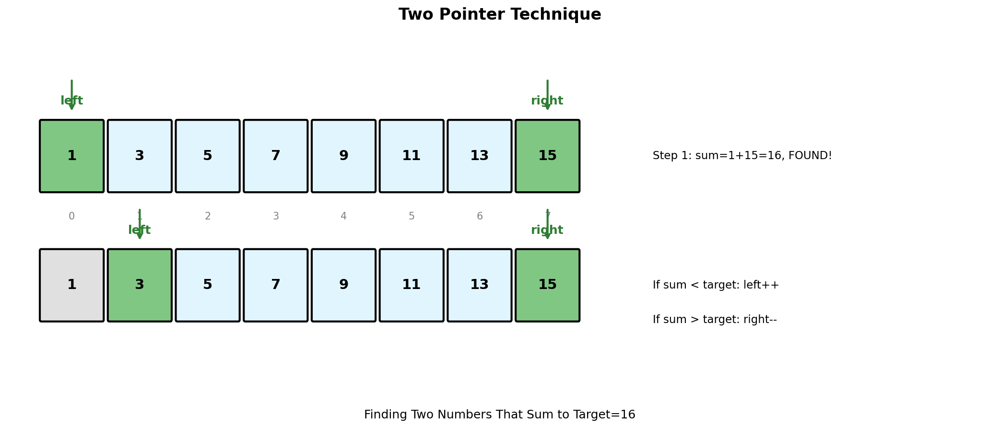
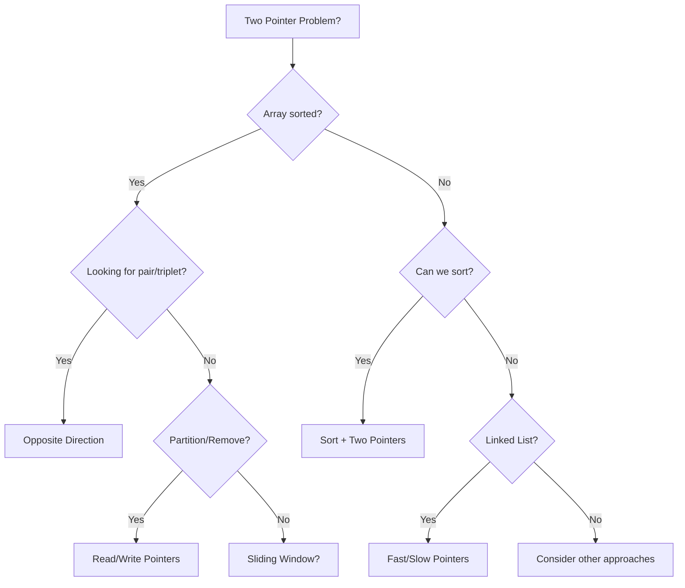

# Two Pointer Technique

> **$O(n)$ array traversal using two coordinated pointers**

---

## Overview

The Two Pointer technique uses two pointers to iterate through a data structure, typically an array or linked list. By coordinating the movement of these pointers, we can solve problems that would otherwise require nested loops in linear time.

### Visual Representation



### When to Use Two Pointers

| Scenario | Pointer Movement | Example Problems |
|----------|-----------------|------------------|
| **Sorted array** | Opposite ends, move toward center | Two Sum II, Container with Most Water |
| **Fast/slow** | Same direction, different speeds | Cycle detection, Middle of linked list |
| **Partition** | One scans, one tracks boundary | Remove duplicates, Move zeros |
| **Merge** | Both move forward through separate arrays | Merge sorted arrays |

---

## Core Patterns

### Pattern 1: Opposite Direction (Converging Pointers)

Used when working with sorted arrays to find pairs that satisfy a condition.

```python
def two_sum_sorted(nums: list[int], target: int) -> list[int]:
    """
    Find two numbers in a sorted array that sum to target.

    Args:
        nums: Sorted array of integers
        target: Target sum

    Returns:
        [index1, index2] (1-indexed) or [-1, -1] if not found

    Time: O(n), Space: O(1)
    """
    left, right = 0, len(nums) - 1

    while left < right:
        current_sum = nums[left] + nums[right]

        if current_sum == target:
            return [left + 1, right + 1]  # 1-indexed
        elif current_sum < target:
            left += 1   # Need larger sum, move left pointer right
        else:
            right -= 1  # Need smaller sum, move right pointer left

    return [-1, -1]


# Example usage
nums = [2, 7, 11, 15]
print(two_sum_sorted(nums, 9))   # Output: [1, 2]
print(two_sum_sorted(nums, 22))  # Output: [2, 4]
```

::: info Complexity: Time O(n) · Space O(1)
- **Time:** Each iteration moves at least one pointer, and pointers only move inward, guaranteeing at most n iterations total
- **Space:** Only uses constant variables for two pointers and sum calculation
:::

### Pattern 2: Same Direction (Fast/Slow Pointers)

Used for cycle detection, finding middle element, or partitioning.

```python
def find_middle(head):
    """
    Find the middle node of a linked list.

    Uses slow/fast pointer technique:
    - Slow moves 1 step at a time
    - Fast moves 2 steps at a time
    - When fast reaches end, slow is at middle

    Time: O(n), Space: O(1)
    """
    if not head:
        return None

    slow = fast = head

    while fast and fast.next:
        slow = slow.next
        fast = fast.next.next

    return slow


def has_cycle(head) -> bool:
    """
    Detect if a linked list has a cycle (Floyd's Algorithm).

    If there's a cycle, fast pointer will eventually meet slow pointer.

    Time: O(n), Space: O(1)
    """
    if not head:
        return False

    slow = fast = head

    while fast and fast.next:
        slow = slow.next
        fast = fast.next.next
        if slow == fast:
            return True

    return False


def find_cycle_start(head):
    """
    Find the node where the cycle begins.

    After detection:
    1. Reset one pointer to head
    2. Move both at same speed
    3. They meet at cycle start

    Time: O(n), Space: O(1)
    """
    if not head:
        return None

    slow = fast = head

    # Detect cycle
    while fast and fast.next:
        slow = slow.next
        fast = fast.next.next
        if slow == fast:
            break
    else:
        return None  # No cycle

    # Find cycle start
    slow = head
    while slow != fast:
        slow = slow.next
        fast = fast.next

    return slow
```

::: info Complexity: Time O(n) · Space O(1)
- **Time:** find_middle and has_cycle traverse the list once; find_cycle_start adds at most another O(n) pass to find the entrance
- **Space:** All three algorithms use only two pointer variables regardless of list size
:::

### Pattern 3: Partition (Read/Write Pointers)

Used to modify arrays in-place by separating elements.

```python
def remove_duplicates(nums: list[int]) -> int:
    """
    Remove duplicates from sorted array in-place.

    Uses write pointer to track position for next unique element.

    Args:
        nums: Sorted array with duplicates

    Returns:
        Length of array with duplicates removed

    Time: O(n), Space: O(1)
    """
    if not nums:
        return 0

    write = 1  # Position to write next unique element

    for read in range(1, len(nums)):
        if nums[read] != nums[read - 1]:
            nums[write] = nums[read]
            write += 1

    return write


def move_zeros(nums: list[int]) -> None:
    """
    Move all zeros to the end while maintaining relative order.

    Uses write pointer to track position for next non-zero element.

    Time: O(n), Space: O(1)
    """
    write = 0  # Position to write next non-zero

    # Move all non-zeros to the front
    for read in range(len(nums)):
        if nums[read] != 0:
            nums[write] = nums[read]
            write += 1

    # Fill remaining positions with zeros
    while write < len(nums):
        nums[write] = 0
        write += 1


def move_zeros_swap(nums: list[int]) -> None:
    """
    Alternative: Swap approach (maintains relative order).

    Time: O(n), Space: O(1)
    """
    write = 0

    for read in range(len(nums)):
        if nums[read] != 0:
            nums[write], nums[read] = nums[read], nums[write]
            write += 1


# Example usage
arr = [0, 1, 0, 3, 12]
move_zeros(arr)
print(arr)  # Output: [1, 3, 12, 0, 0]
```

::: info Complexity: Time O(n) · Space O(1)
- **Time:** remove_duplicates and move_zeros both make a single pass through the array with read pointer
- **Space:** In-place modifications using only write and read pointer variables
:::

---

## Classic Problems

### Three Sum

```python
def three_sum(nums: list[int]) -> list[list[int]]:
    """
    Find all unique triplets that sum to zero.

    Approach:
    1. Sort the array
    2. Fix one element, use two pointers for remaining two
    3. Skip duplicates to avoid duplicate triplets

    Time: O(n^2), Space: O(1) excluding output
    """
    nums.sort()
    result = []
    n = len(nums)

    for i in range(n - 2):
        # Skip duplicates for first element
        if i > 0 and nums[i] == nums[i - 1]:
            continue

        # Early termination: if smallest is positive, no solution possible
        if nums[i] > 0:
            break

        left, right = i + 1, n - 1
        target = -nums[i]

        while left < right:
            current_sum = nums[left] + nums[right]

            if current_sum == target:
                result.append([nums[i], nums[left], nums[right]])

                # Skip duplicates
                while left < right and nums[left] == nums[left + 1]:
                    left += 1
                while left < right and nums[right] == nums[right - 1]:
                    right -= 1

                left += 1
                right -= 1
            elif current_sum < target:
                left += 1
            else:
                right -= 1

    return result


# Example usage
print(three_sum([-1, 0, 1, 2, -1, -4]))
# Output: [[-1, -1, 2], [-1, 0, 1]]
```

::: info Complexity: Time O(n^2) · Space O(1) excluding output
- **Time:** Outer loop iterates n times; inner two-pointer search takes O(n) per iteration, giving O(n^2) total
- **Space:** Only uses constant space for pointers and indices; output list not counted
:::

### Container With Most Water

```python
def max_area(height: list[int]) -> int:
    """
    Find the container that holds most water.

    Two pointers start at ends. Move the shorter line inward
    because moving the taller line cannot increase area.

    Time: O(n), Space: O(1)
    """
    left, right = 0, len(height) - 1
    max_water = 0

    while left < right:
        # Calculate area
        width = right - left
        h = min(height[left], height[right])
        area = width * h
        max_water = max(max_water, area)

        # Move the shorter line
        if height[left] < height[right]:
            left += 1
        else:
            right -= 1

    return max_water


# Example usage
heights = [1, 8, 6, 2, 5, 4, 8, 3, 7]
print(max_area(heights))  # Output: 49
```

::: info Complexity: Time O(n) · Space O(1)
- **Time:** Single pass with two pointers converging from both ends; each iteration moves one pointer inward
- **Space:** Only constant space for pointers and max area tracking
:::

### Trapping Rain Water

```python
def trap_rain_water(height: list[int]) -> int:
    """
    Calculate water trapped between bars.

    Two pointer approach:
    - Track left_max and right_max
    - Water at position = min(left_max, right_max) - height[i]
    - Process the side with smaller max first

    Time: O(n), Space: O(1)
    """
    if not height:
        return 0

    left, right = 0, len(height) - 1
    left_max = right_max = 0
    water = 0

    while left < right:
        if height[left] < height[right]:
            if height[left] >= left_max:
                left_max = height[left]
            else:
                water += left_max - height[left]
            left += 1
        else:
            if height[right] >= right_max:
                right_max = height[right]
            else:
                water += right_max - height[right]
            right -= 1

    return water


# Example usage
heights = [0, 1, 0, 2, 1, 0, 1, 3, 2, 1, 2, 1]
print(trap_rain_water(heights))  # Output: 6
```

::: info Complexity: Time O(n) · Space O(1)
- **Time:** Two pointers converge in single pass; water at each position computed in O(1) using tracked max heights
- **Space:** Only constant space for left/right pointers and left_max/right_max variables
:::

### Valid Palindrome

```python
def is_palindrome(s: str) -> bool:
    """
    Check if string is palindrome (considering only alphanumeric).

    Two pointers from both ends, skip non-alphanumeric characters.

    Time: O(n), Space: O(1)
    """
    left, right = 0, len(s) - 1

    while left < right:
        # Skip non-alphanumeric from left
        while left < right and not s[left].isalnum():
            left += 1
        # Skip non-alphanumeric from right
        while left < right and not s[right].isalnum():
            right -= 1

        if s[left].lower() != s[right].lower():
            return False

        left += 1
        right -= 1

    return True


# Example usage
print(is_palindrome("A man, a plan, a canal: Panama"))  # True
print(is_palindrome("race a car"))  # False
```

::: info Complexity: Time O(n) · Space O(1)
- **Time:** Two pointers traverse string once, skipping non-alphanumeric characters; each character compared at most once
- **Space:** Only constant space for two pointer indices
:::

### Sort Colors (Dutch National Flag)

```python
def sort_colors(nums: list[int]) -> None:
    """
    Sort array containing only 0, 1, 2 in-place.

    Three-way partitioning using three pointers:
    - left: boundary for 0s (next position for 0)
    - right: boundary for 2s (next position for 2)
    - current: scanning pointer

    Time: O(n), Space: O(1)
    """
    left, current, right = 0, 0, len(nums) - 1

    while current <= right:
        if nums[current] == 0:
            nums[left], nums[current] = nums[current], nums[left]
            left += 1
            current += 1
        elif nums[current] == 2:
            nums[current], nums[right] = nums[right], nums[current]
            right -= 1
            # Don't increment current, need to check swapped element
        else:  # nums[current] == 1
            current += 1


# Example usage
colors = [2, 0, 2, 1, 1, 0]
sort_colors(colors)
print(colors)  # Output: [0, 0, 1, 1, 2, 2]
```

::: info Complexity: Time O(n) · Space O(1)
- **Time:** Single pass through array; each element examined at most twice (once by current, once after swap)
- **Space:** Only three pointer variables (left, current, right) used for in-place partitioning
:::

---

## Algorithm Selection Guide



---

## Common Mistakes

### 1. Not Handling Duplicates

```python
# WRONG: Will return duplicate triplets
for i in range(n - 2):
    left, right = i + 1, n - 1
    # ... missing duplicate skip

# CORRECT: Skip duplicates
for i in range(n - 2):
    if i > 0 and nums[i] == nums[i - 1]:
        continue
    # Also skip duplicates for left/right pointers
```

### 2. Wrong Loop Termination

```python
# WRONG: Should be < not <=
while left <= right:  # Pointers should not cross
    if left == right:  # Same element, not a pair!
        # ...

# CORRECT: Stop when pointers meet
while left < right:
    # ...
```

### 3. Forgetting to Increment/Decrement After Found

```python
# WRONG: Infinite loop when match found
if nums[left] + nums[right] == target:
    result.append([nums[left], nums[right]])
    # Missing: left += 1 and right -= 1

# CORRECT: Move both pointers after finding match
if nums[left] + nums[right] == target:
    result.append([nums[left], nums[right]])
    left += 1
    right -= 1
```

---

## Complexity Summary

| Pattern | Time | Space | Key Use Cases |
|---------|------|-------|---------------|
| Opposite Direction | $O(n)$ | $O(1)$ | Sorted arrays, pair finding |
| Fast/Slow | $O(n)$ | $O(1)$ | Cycle detection, find middle |
| Read/Write | $O(n)$ | $O(1)$ | In-place modification |
| Three Pointers | $O(n)$ | $O(1)$ | Three-way partition |

---

## Related LeetCode Problems

| Problem | Difficulty | Pattern |
|---------|------------|---------|
| Two Sum II | Medium | [Opposite Direction](https://leetcode.com/problems/two-sum-ii-input-array-is-sorted/) |
| 3Sum | Medium | [Opposite Direction](https://leetcode.com/problems/3sum/) |
| Container With Most Water | Medium | [Opposite Direction](https://leetcode.com/problems/container-with-most-water/) |
| Trapping Rain Water | Hard | [Opposite Direction](https://leetcode.com/problems/trapping-rain-water/) |
| Remove Duplicates from Sorted Array | Easy | [Read/Write](https://leetcode.com/problems/remove-duplicates-from-sorted-array/) |
| Move Zeroes | Easy | [Read/Write](https://leetcode.com/problems/move-zeroes/) |
| Sort Colors | Medium | [Three Pointers](https://leetcode.com/problems/sort-colors/) |
| Linked List Cycle | Easy | [Fast/Slow](https://leetcode.com/problems/linked-list-cycle/) |
| Valid Palindrome | Easy | [Opposite Direction](https://leetcode.com/problems/valid-palindrome/) |

---

## Interview Tips

1. **Identify the pattern**: Sorted array? Linked list cycle? In-place modification?
2. **Consider sorting**: If unsorted but can be sorted, two pointers might apply
3. **Handle edge cases**: Empty array, single element, all same elements
4. **Think about duplicates**: Do you need to skip them?
5. **Explain pointer movement**: Why move left vs right? Why fast vs slow?

---

## References

- [Two Pointers - Tech Interview Handbook](https://www.techinterviewhandbook.org/algorithms/two-pointers/)
- [Two Pointer Technique - GeeksforGeeks](https://www.geeksforgeeks.org/two-pointers-technique/)
- [Floyd's Cycle Detection - Wikipedia](https://en.wikipedia.org/wiki/Cycle_detection#Floyd's_tortoise_and_hare)
