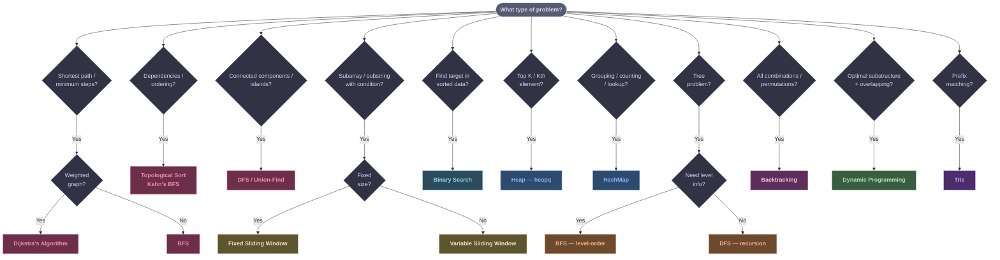

# Code Templates --- Your Interview Arsenal

Everything you need, nothing you don't. Memorize these templates and you can solve 80%+ of SDE coding questions by pattern-matching.

## Which Pattern Should I Use?



::: tip WHEN STUCK
Many problems combine patterns. If nothing fits cleanly, try **BFS/DFS + HashMap** as a starting point.
:::

---

## Quick-Reference Table

| Pattern | Template | When to Use |
|---------|----------|-------------|
| BFS (grid) | `deque` + 4-direction loop | Shortest path on unweighted grid, flood fill, connected components |
| BFS (adj list) | `deque` + visited set | Shortest path on unweighted graph, word ladder |
| DFS (recursive) | Call stack + visited | Tree traversal, connected components, backtracking |
| DFS (iterative) | Explicit stack + visited | Same as recursive DFS, avoids stack overflow |
| Topological Sort | Kahn's BFS + indegree array | Course schedule, build order, dependency resolution |
| Dijkstra's | Min-heap + dist array | Shortest path on weighted graph (non-negative weights) |
| Tree DFS | Recursive pre/in/post order | Path sums, diameter, max depth, validate BST |
| Tree BFS | `deque` level-order | Level-order traversal, zigzag, right side view |
| Sliding Window | Two pointers + window state | Longest/shortest substring, subarray with constraint |
| Monotonic Deque | `deque` maintaining order | Sliding window maximum/minimum |
| 1D DP | `dp[i]` array | Coin change, house robber, LIS |
| 2D Grid DP | `dp[i][j]` matrix | Unique paths, min path sum |
| DFS + Memo | `@cache` or dict | Longest increasing path, word break, tree DP on grid |
| Binary Search | `lo, hi` + midpoint | Search rotated array, find peak, left/right bound |
| Heap (Top-K) | `heapq` min-heap of size K | Top-K frequent, merge K sorted, Kth largest |
| HashMap Grouping | `defaultdict(list)` | Group anagrams, group by pattern |
| Trie | Nested dicts or TrieNode | Prefix search, autocomplete, IP matching |
| Backtracking | DFS + mark/unmark visited | Word search, permutations, combinations |

---

## Graph Templates

### BFS on a Grid

::: code-group

```python [Python]
from collections import deque

def bfs_grid(grid, start_r, start_c):
    """BFS on 2D grid. Use for shortest path, flood fill, connected components."""
    rows, cols = len(grid), len(grid[0])
    queue = deque([(start_r, start_c)])
    visited = set()
    visited.add((start_r, start_c))
    directions = [(0, 1), (0, -1), (1, 0), (-1, 0)]

    while queue:
        r, c = queue.popleft()
        for dr, dc in directions:
            nr, nc = r + dr, c + dc
            if 0 <= nr < rows and 0 <= nc < cols and (nr, nc) not in visited and grid[nr][nc] != 0:
                visited.add((nr, nc))
                queue.append((nr, nc))

    return visited
```

```java [Java]
import java.util.*;

void bfsGrid(int[][] grid, int startR, int startC) {
    int rows = grid.length, cols = grid[0].length;
    int[][] directions = {{0,1},{0,-1},{1,0},{-1,0}};
    Deque<int[]> queue = new ArrayDeque<>();
    Set<String> visited = new HashSet<>();

    queue.offer(new int[]{startR, startC});
    visited.add(startR + "," + startC);

    while (!queue.isEmpty()) {
        int[] cur = queue.poll();
        int r = cur[0], c = cur[1];
        for (int[] d : directions) {
            int nr = r + d[0], nc = c + d[1];
            String key = nr + "," + nc;
            if (nr >= 0 && nr < rows && nc >= 0 && nc < cols
                    && !visited.contains(key) && grid[nr][nc] != 0) {
                visited.add(key);
                queue.offer(new int[]{nr, nc});
            }
        }
    }
}
```

:::

### BFS on Adjacency List

::: code-group

```python [Python]
from collections import deque

def bfs(graph, start):
    """BFS on adjacency list. Returns visited set. O(V + E)."""
    queue = deque([start])
    visited = {start}

    while queue:
        node = queue.popleft()
        for neighbor in graph[node]:
            if neighbor not in visited:
                visited.add(neighbor)
                queue.append(neighbor)

    return visited
```

```java [Java]
Set<Integer> bfs(Map<Integer, List<Integer>> graph, int start) {
    Deque<Integer> queue = new ArrayDeque<>();
    Set<Integer> visited = new HashSet<>();
    queue.offer(start);
    visited.add(start);

    while (!queue.isEmpty()) {
        int node = queue.poll();
        for (int neighbor : graph.getOrDefault(node, Collections.emptyList())) {
            if (!visited.contains(neighbor)) {
                visited.add(neighbor);
                queue.offer(neighbor);
            }
        }
    }
    return visited;
}
```

:::

### DFS --- Recursive

::: code-group

```python [Python]
def dfs_recursive(graph, node, visited):
    """DFS on adjacency list. Modify the body for your problem."""
    visited.add(node)
    for neighbor in graph[node]:
        if neighbor not in visited:
            dfs_recursive(graph, neighbor, visited)
```

```java [Java]
void dfsRecursive(Map<Integer, List<Integer>> graph, int node, Set<Integer> visited) {
    visited.add(node);
    for (int neighbor : graph.getOrDefault(node, Collections.emptyList())) {
        if (!visited.contains(neighbor)) {
            dfsRecursive(graph, neighbor, visited);
        }
    }
}
```

:::

### DFS --- Iterative

::: code-group

```python [Python]
def dfs_iterative(graph, start):
    """Iterative DFS using explicit stack. Avoids recursion limit."""
    stack = [start]
    visited = set()

    while stack:
        node = stack.pop()
        if node in visited:
            continue
        visited.add(node)
        for neighbor in graph[node]:
            if neighbor not in visited:
                stack.append(neighbor)

    return visited
```

```java [Java]
Set<Integer> dfsIterative(Map<Integer, List<Integer>> graph, int start) {
    Deque<Integer> stack = new ArrayDeque<>();
    Set<Integer> visited = new HashSet<>();
    stack.push(start);

    while (!stack.isEmpty()) {
        int node = stack.pop();
        if (visited.contains(node)) continue;
        visited.add(node);
        for (int neighbor : graph.getOrDefault(node, Collections.emptyList())) {
            if (!visited.contains(neighbor)) {
                stack.push(neighbor);
            }
        }
    }
    return visited;
}
```

:::

### Topological Sort --- Kahn's Algorithm (BFS)

::: code-group

```python [Python]
from collections import deque, defaultdict

def topo_sort(num_nodes, edges):
    """Kahn's algorithm. Returns topological order or [] if cycle exists. O(V + E)."""
    indegree = [0] * num_nodes
    adj = defaultdict(list)

    for u, v in edges:
        adj[u].append(v)
        indegree[v] += 1

    queue = deque([i for i in range(num_nodes) if indegree[i] == 0])
    order = []

    while queue:
        node = queue.popleft()
        order.append(node)
        for nei in adj[node]:
            indegree[nei] -= 1
            if indegree[nei] == 0:
                queue.append(nei)

    return order if len(order) == num_nodes else []  # empty = cycle detected
```

```java [Java]
List<Integer> topoSort(int numNodes, int[][] edges) {
    int[] indegree = new int[numNodes];
    Map<Integer, List<Integer>> adj = new HashMap<>();
    for (int i = 0; i < numNodes; i++) adj.put(i, new ArrayList<>());

    for (int[] e : edges) {
        adj.get(e[0]).add(e[1]);
        indegree[e[1]]++;
    }

    Deque<Integer> queue = new ArrayDeque<>();
    for (int i = 0; i < numNodes; i++) {
        if (indegree[i] == 0) queue.offer(i);
    }

    List<Integer> order = new ArrayList<>();
    while (!queue.isEmpty()) {
        int node = queue.poll();
        order.add(node);
        for (int nei : adj.get(node)) {
            if (--indegree[nei] == 0) queue.offer(nei);
        }
    }
    return order.size() == numNodes ? order : Collections.emptyList();
}
```

:::

### Dijkstra's Algorithm

::: code-group

```python [Python]
import heapq
from collections import defaultdict

def dijkstra(graph, start, n):
    """
    Shortest path from start to all nodes. graph = {u: [(v, weight), ...]}.
    Returns dist array. O((V + E) log V).
    """
    dist = [float('inf')] * n
    dist[start] = 0
    heap = [(0, start)]  # (distance, node)

    while heap:
        d, u = heapq.heappop(heap)
        if d > dist[u]:
            continue  # skip stale entries
        for v, w in graph[u]:
            if dist[u] + w < dist[v]:
                dist[v] = dist[u] + w
                heapq.heappush(heap, (dist[v], v))

    return dist
```

```java [Java]
int[] dijkstra(Map<Integer, List<int[]>> graph, int start, int n) {
    // graph: node -> list of [neighbor, weight]
    int[] dist = new int[n];
    Arrays.fill(dist, Integer.MAX_VALUE);
    dist[start] = 0;
    // min-heap: [distance, node]
    PriorityQueue<int[]> heap = new PriorityQueue<>(Comparator.comparingInt(a -> a[0]));
    heap.offer(new int[]{0, start});

    while (!heap.isEmpty()) {
        int[] cur = heap.poll();
        int d = cur[0], u = cur[1];
        if (d > dist[u]) continue;  // stale entry
        for (int[] edge : graph.getOrDefault(u, Collections.emptyList())) {
            int v = edge[0], w = edge[1];
            if (dist[u] + w < dist[v]) {
                dist[v] = dist[u] + w;
                heap.offer(new int[]{dist[v], v});
            }
        }
    }
    return dist;
}
```

:::

---

## Tree Templates

### TreeNode Class

```python
class TreeNode:
    def __init__(self, val=0, left=None, right=None):
        self.val = val
        self.left = left
        self.right = right
```

### DFS Traversals --- Recursive

::: code-group

```python [Python]
def preorder(root):
    """Root -> Left -> Right. Use for: serialization, copying tree."""
    if not root:
        return []
    return [root.val] + preorder(root.left) + preorder(root.right)

def inorder(root):
    """Left -> Root -> Right. Use for: BST gives sorted order."""
    if not root:
        return []
    return inorder(root.left) + [root.val] + inorder(root.right)

def postorder(root):
    """Left -> Right -> Root. Use for: delete tree, evaluate expression tree."""
    if not root:
        return []
    return postorder(root.left) + postorder(root.right) + [root.val]
```

```java [Java]
// Preorder: Root -> Left -> Right
void preorder(TreeNode node, List<Integer> result) {
    if (node == null) return;
    result.add(node.val);
    preorder(node.left, result);
    preorder(node.right, result);
}

// Inorder: Left -> Root -> Right (BST gives sorted order)
void inorder(TreeNode node, List<Integer> result) {
    if (node == null) return;
    inorder(node.left, result);
    result.add(node.val);
    inorder(node.right, result);
}

// Postorder: Left -> Right -> Root
void postorder(TreeNode node, List<Integer> result) {
    if (node == null) return;
    postorder(node.left, result);
    postorder(node.right, result);
    result.add(node.val);
}
```

:::

### BFS Level-Order Traversal

::: code-group

```python [Python]
from collections import deque

def level_order(root):
    """Returns list of lists, one per level. O(n)."""
    if not root:
        return []
    result = []
    queue = deque([root])

    while queue:
        level_size = len(queue)
        level = []
        for _ in range(level_size):
            node = queue.popleft()
            level.append(node.val)
            if node.left:
                queue.append(node.left)
            if node.right:
                queue.append(node.right)
        result.append(level)

    return result
```

```java [Java]
List<List<Integer>> levelOrder(TreeNode root) {
    List<List<Integer>> result = new ArrayList<>();
    if (root == null) return result;
    Deque<TreeNode> queue = new ArrayDeque<>();
    queue.offer(root);

    while (!queue.isEmpty()) {
        int levelSize = queue.size();
        List<Integer> level = new ArrayList<>();
        for (int i = 0; i < levelSize; i++) {
            TreeNode node = queue.poll();
            level.add(node.val);
            if (node.left != null) queue.offer(node.left);
            if (node.right != null) queue.offer(node.right);
        }
        result.add(level);
    }
    return result;
}
```

:::

### BST Search and Insert

:::code-group

```python [Python]
def bst_search(root, target):
    """O(h) search in BST. Returns node or None."""
    while root:
        if target == root.val:
            return root
        elif target < root.val:
            root = root.left
        else:
            root = root.right
    return None

def bst_insert(root, val):
    """O(h) insert into BST. Returns root."""
    if not root:
        return TreeNode(val)
    if val < root.val:
        root.left = bst_insert(root.left, val)
    else:
        root.right = bst_insert(root.right, val)
    return root
```

```java [Java]
// O(h) search in BST
TreeNode bstSearch(TreeNode root, int target) {
    while (root != null) {
        if (target == root.val) return root;
        else if (target < root.val) root = root.left;
        else root = root.right;
    }
    return null;
}

// O(h) insert into BST
TreeNode bstInsert(TreeNode root, int val) {
    if (root == null) return new TreeNode(val);
    if (val < root.val) root.left = bstInsert(root.left, val);
    else root.right = bstInsert(root.right, val);
    return root;
}
```

:::

---

## Sliding Window Templates

### Universal Sliding Window

::: code-group

```python [Python]
def sliding_window(s):
    """
    Expand right pointer, shrink left pointer when window is invalid.
    Modify INVALID_CONDITION and result tracking for your problem.
    """
    left = 0
    window = {}  # track character counts or other window state
    result = 0

    for right in range(len(s)):
        # --- EXPAND: add s[right] to window ---
        window[s[right]] = window.get(s[right], 0) + 1

        # --- SHRINK: while window violates the constraint ---
        while INVALID_CONDITION:  # e.g., len(window) > k, or duplicates exist
            window[s[left]] -= 1
            if window[s[left]] == 0:
                del window[s[left]]
            left += 1

        # --- UPDATE RESULT ---
        result = max(result, right - left + 1)

    return result
```

```java [Java]
int slidingWindow(String s) {
    int left = 0, result = 0;
    Map<Character, Integer> window = new HashMap<>();

    for (int right = 0; right < s.length(); right++) {
        // --- EXPAND ---
        char r = s.charAt(right);
        window.merge(r, 1, Integer::sum);

        // --- SHRINK: while window violates the constraint ---
        while (/* INVALID_CONDITION */ false) {
            char l = s.charAt(left);
            window.merge(l, -1, Integer::sum);
            if (window.get(l) == 0) window.remove(l);
            left++;
        }

        // --- UPDATE RESULT ---
        result = Math.max(result, right - left + 1);
    }
    return result;
}
```

:::

### Monotonic Deque --- Sliding Window Maximum

::: code-group

```python [Python]
from collections import deque

def max_sliding_window(nums, k):
    """
    Returns max of each window of size k. O(n).
    Deque stores indices. Front = index of current max.
    """
    dq = deque()  # stores indices, values are decreasing
    result = []

    for i in range(len(nums)):
        # remove indices outside the window
        while dq and dq[0] < i - k + 1:
            dq.popleft()

        # remove smaller elements from back (they'll never be the max)
        while dq and nums[dq[-1]] <= nums[i]:
            dq.pop()

        dq.append(i)

        # window is full, record the max
        if i >= k - 1:
            result.append(nums[dq[0]])

    return result
```

```java [Java]
int[] maxSlidingWindow(int[] nums, int k) {
    int n = nums.length;
    int[] result = new int[n - k + 1];
    Deque<Integer> dq = new ArrayDeque<>(); // stores indices, decreasing values

    for (int i = 0; i < n; i++) {
        // remove indices outside window
        while (!dq.isEmpty() && dq.peekFirst() < i - k + 1) dq.pollFirst();

        // maintain decreasing order
        while (!dq.isEmpty() && nums[dq.peekLast()] <= nums[i]) dq.pollLast();

        dq.offerLast(i);

        if (i >= k - 1) result[i - k + 1] = nums[dq.peekFirst()];
    }
    return result;
}
```

:::

---

## DP Templates

### 1D DP

::: code-group

```python [Python]
def dp_1d(nums):
    """
    Generic 1D DP. Modify base case and transition for your problem.
    Examples: Coin Change, House Robber, LIS.
    """
    n = len(nums)
    dp = [0] * (n + 1)  # dp[i] = answer considering first i elements

    # base case
    dp[0] = BASE_VALUE  # e.g., 0 for sums, 1 for counts

    for i in range(1, n + 1):
        # transition: dp[i] depends on previous states
        dp[i] = TRANSITION(dp, nums, i)  # e.g., max(dp[i-1], dp[i-2] + nums[i-1])

    return dp[n]
```

```java [Java]
// Generic 1D DP scaffold — adapt for Coin Change, House Robber, LIS
int dp1D(int[] nums) {
    int n = nums.length;
    int[] dp = new int[n + 1];
    dp[0] = 0; // base case

    for (int i = 1; i <= n; i++) {
        // dp[i] = TRANSITION — e.g., Math.max(dp[i-1], dp[i-2] + nums[i-1])
    }
    return dp[n];
}
```

:::

**Coin Change (concrete example):**

::: code-group

```python [Python]
def coin_change(coins, amount):
    """Minimum coins to make amount. O(amount * len(coins))."""
    dp = [float('inf')] * (amount + 1)
    dp[0] = 0

    for a in range(1, amount + 1):
        for coin in coins:
            if coin <= a:
                dp[a] = min(dp[a], dp[a - coin] + 1)

    return dp[amount] if dp[amount] != float('inf') else -1
```

```java [Java]
int coinChange(int[] coins, int amount) {
    int[] dp = new int[amount + 1];
    Arrays.fill(dp, amount + 1); // sentinel for "impossible"
    dp[0] = 0;

    for (int a = 1; a <= amount; a++) {
        for (int coin : coins) {
            if (coin <= a) {
                dp[a] = Math.min(dp[a], dp[a - coin] + 1);
            }
        }
    }
    return dp[amount] > amount ? -1 : dp[amount];
}
```

:::

### 2D Grid DP

::: code-group

```python [Python]
def grid_dp(grid):
    """
    Generic 2D grid DP. Modify for min path sum, unique paths, etc.
    """
    rows, cols = len(grid), len(grid[0])
    dp = [[0] * cols for _ in range(rows)]

    # base case: first cell
    dp[0][0] = grid[0][0]

    # fill first row
    for c in range(1, cols):
        dp[0][c] = dp[0][c - 1] + grid[0][c]

    # fill first column
    for r in range(1, rows):
        dp[r][0] = dp[r - 1][0] + grid[r][0]

    # fill rest
    for r in range(1, rows):
        for c in range(1, cols):
            dp[r][c] = grid[r][c] + min(dp[r - 1][c], dp[r][c - 1])

    return dp[rows - 1][cols - 1]
```

```java [Java]
int gridDp(int[][] grid) {
    int rows = grid.length, cols = grid[0].length;
    int[][] dp = new int[rows][cols];
    dp[0][0] = grid[0][0];

    for (int c = 1; c < cols; c++) dp[0][c] = dp[0][c - 1] + grid[0][c];
    for (int r = 1; r < rows; r++) dp[r][0] = dp[r - 1][0] + grid[r][0];

    for (int r = 1; r < rows; r++) {
        for (int c = 1; c < cols; c++) {
            dp[r][c] = grid[r][c] + Math.min(dp[r - 1][c], dp[r][c - 1]);
        }
    }
    return dp[rows - 1][cols - 1];
}
```

:::

### Top-Down DFS + Memoization

:::code-group

```python [Python]
from functools import lru_cache

def dfs_memo(matrix):
    """
    DFS with memoization on a grid. Used for: Longest Increasing Path in Matrix.
    O(m * n), each cell computed once.
    """
    rows, cols = len(matrix), len(matrix[0])
    directions = [(0, 1), (0, -1), (1, 0), (-1, 0)]

    @lru_cache(maxsize=None)
    def dfs(r, c):
        best = 1  # at minimum, the cell itself
        for dr, dc in directions:
            nr, nc = r + dr, c + dc
            if 0 <= nr < rows and 0 <= nc < cols and matrix[nr][nc] > matrix[r][c]:
                best = max(best, 1 + dfs(nr, nc))
        return best

    return max(dfs(r, c) for r in range(rows) for c in range(cols))
```

```java [Java]
// DFS with memoization on a grid — Longest Increasing Path in Matrix pattern
int dfsMemo(int[][] matrix) {
    int rows = matrix.length, cols = matrix[0].length;
    int[][] memo = new int[rows][cols];
    int[][] dirs = {{0,1},{0,-1},{1,0},{-1,0}};
    int result = 0;

    for (int r = 0; r < rows; r++)
        for (int c = 0; c < cols; c++)
            result = Math.max(result, dfs(matrix, memo, dirs, r, c));
    return result;
}

private int dfs(int[][] matrix, int[][] memo, int[][] dirs, int r, int c) {
    if (memo[r][c] != 0) return memo[r][c];
    int best = 1;
    for (int[] d : dirs) {
        int nr = r + d[0], nc = c + d[1];
        if (nr >= 0 && nr < matrix.length && nc >= 0 && nc < matrix[0].length
                && matrix[nr][nc] > matrix[r][c]) {
            best = Math.max(best, 1 + dfs(matrix, memo, dirs, nr, nc));
        }
    }
    return memo[r][c] = best;
}
```

:::

---

## Data Structure Templates

### Binary Search --- Left Bound and Right Bound

::: code-group

```python [Python]
def binary_search_left(nums, target):
    """
    Find the leftmost index where target could be inserted (bisect_left).
    Returns first index i where nums[i] >= target.
    """
    lo, hi = 0, len(nums)
    while lo < hi:
        mid = (lo + hi) // 2
        if nums[mid] < target:
            lo = mid + 1
        else:
            hi = mid
    return lo

def binary_search_right(nums, target):
    """
    Find the rightmost index where target could be inserted (bisect_right).
    Returns first index i where nums[i] > target.
    """
    lo, hi = 0, len(nums)
    while lo < hi:
        mid = (lo + hi) // 2
        if nums[mid] <= target:
            lo = mid + 1
        else:
            hi = mid
    return lo
```

```java [Java]
// Left bound: first index i where nums[i] >= target
int binarySearchLeft(int[] nums, int target) {
    int lo = 0, hi = nums.length;
    while (lo < hi) {
        int mid = lo + (hi - lo) / 2;
        if (nums[mid] < target) lo = mid + 1;
        else hi = mid;
    }
    return lo;
}

// Right bound: first index i where nums[i] > target
int binarySearchRight(int[] nums, int target) {
    int lo = 0, hi = nums.length;
    while (lo < hi) {
        int mid = lo + (hi - lo) / 2;
        if (nums[mid] <= target) lo = mid + 1;
        else hi = mid;
    }
    return lo;
}
```

:::

### Heap --- Top-K Pattern

:::code-group

```python [Python]
import heapq

def top_k_frequent(nums, k):
    """
    Return the k most frequent elements. O(n log k).
    Use a min-heap of size k to track the top-k.
    """
    from collections import Counter
    count = Counter(nums)

    # min-heap of size k: (frequency, element)
    return heapq.nlargest(k, count.keys(), key=count.get)

# Manual min-heap approach (more general):
def top_k_manual(nums, k):
    from collections import Counter
    count = Counter(nums)
    heap = []

    for num, freq in count.items():
        heapq.heappush(heap, (freq, num))
        if len(heap) > k:
            heapq.heappop(heap)  # remove smallest frequency

    return [num for freq, num in heap]
```

```java [Java]
// Return the k most frequent elements. O(n log k).
List<Integer> topKFrequent(int[] nums, int k) {
    Map<Integer, Integer> count = new HashMap<>();
    for (int num : nums) count.merge(num, 1, Integer::sum);

    // min-heap of size k: [frequency, element] -- root = smallest freq of top-k
    PriorityQueue<int[]> heap = new PriorityQueue<>(Comparator.comparingInt(a -> a[0]));
    for (Map.Entry<Integer, Integer> e : count.entrySet()) {
        heap.offer(new int[]{e.getValue(), e.getKey()});
        if (heap.size() > k) heap.poll();  // remove smallest frequency
    }

    List<Integer> result = new ArrayList<>();
    while (!heap.isEmpty()) result.add(heap.poll()[1]);
    return result;
}
```

:::

### HashMap Grouping Pattern

:::code-group

```python [Python]
from collections import defaultdict

def group_by_pattern(items):
    """
    Group items by a computed key. Used for: Group Anagrams, group by frequency, etc.
    """
    groups = defaultdict(list)

    for item in items:
        key = compute_key(item)  # e.g., tuple(sorted(item)) for anagrams
        groups[key].append(item)

    return list(groups.values())

# Concrete example: Group Anagrams
def group_anagrams(strs):
    groups = defaultdict(list)
    for s in strs:
        key = tuple(sorted(s))
        groups[key].append(s)
    return list(groups.values())
```

```java [Java]
// Group items by a computed key. Used for: Group Anagrams, group by frequency, etc.
Map<String, List<String>> groupByPattern(List<String> items) {
    Map<String, List<String>> groups = new HashMap<>();
    for (String item : items) {
        String key = computeKey(item);  // e.g., sorted chars for anagrams
        groups.computeIfAbsent(key, k -> new ArrayList<>()).add(item);
    }
    return groups;
}

// Concrete example: Group Anagrams
List<List<String>> groupAnagrams(String[] strs) {
    Map<String, List<String>> groups = new HashMap<>();
    for (String s : strs) {
        char[] chars = s.toCharArray();
        Arrays.sort(chars);
        String key = new String(chars);
        groups.computeIfAbsent(key, k -> new ArrayList<>()).add(s);
    }
    return new ArrayList<>(groups.values());
}
```

:::

---

## String Templates

### Trie (Prefix Tree)

::: code-group

```python [Python]
class TrieNode:
    def __init__(self):
        self.children = {}
        self.is_end = False

class Trie:
    def __init__(self):
        self.root = TrieNode()

    def insert(self, word):
        """Insert a word into the trie. O(m) where m = len(word)."""
        node = self.root
        for ch in word:
            if ch not in node.children:
                node.children[ch] = TrieNode()
            node = node.children[ch]
        node.is_end = True

    def search(self, word):
        """Return True if word is in the trie. O(m)."""
        node = self.root
        for ch in word:
            if ch not in node.children:
                return False
            node = node.children[ch]
        return node.is_end

    def starts_with(self, prefix):
        """Return True if any word starts with prefix. O(m)."""
        node = self.root
        for ch in prefix:
            if ch not in node.children:
                return False
            node = node.children[ch]
        return True
```

```java [Java]
class TrieNode {
    Map<Character, TrieNode> children = new HashMap<>();
    boolean isEnd = false;
}

class Trie {
    private final TrieNode root = new TrieNode();

    void insert(String word) {
        TrieNode node = root;
        for (char ch : word.toCharArray()) {
            node.children.putIfAbsent(ch, new TrieNode());
            node = node.children.get(ch);
        }
        node.isEnd = true;
    }

    boolean search(String word) {
        TrieNode node = root;
        for (char ch : word.toCharArray()) {
            if (!node.children.containsKey(ch)) return false;
            node = node.children.get(ch);
        }
        return node.isEnd;
    }

    boolean startsWith(String prefix) {
        TrieNode node = root;
        for (char ch : prefix.toCharArray()) {
            if (!node.children.containsKey(ch)) return false;
            node = node.children.get(ch);
        }
        return true;
    }
}
```

:::

### Backtracking on Grid

::: code-group

```python [Python]
def word_search(board, word):
    """
    Search for word in grid using backtracking. O(m * n * 4^L).
    Mark cells visited by modifying in-place, then restore.
    """
    rows, cols = len(board), len(board[0])

    def backtrack(r, c, idx):
        if idx == len(word):
            return True
        if r < 0 or r >= rows or c < 0 or c >= cols:
            return False
        if board[r][c] != word[idx]:
            return False

        # mark visited
        temp = board[r][c]
        board[r][c] = '#'

        # explore 4 directions
        found = (backtrack(r + 1, c, idx + 1) or
                 backtrack(r - 1, c, idx + 1) or
                 backtrack(r, c + 1, idx + 1) or
                 backtrack(r, c - 1, idx + 1))

        # restore
        board[r][c] = temp
        return found

    for r in range(rows):
        for c in range(cols):
            if backtrack(r, c, 0):
                return True
    return False
```

```java [Java]
boolean wordSearch(char[][] board, String word) {
    int rows = board.length, cols = board[0].length;

    for (int r = 0; r < rows; r++) {
        for (int c = 0; c < cols; c++) {
            if (backtrack(board, word, r, c, 0)) return true;
        }
    }
    return false;
}

boolean backtrack(char[][] board, String word, int r, int c, int idx) {
    if (idx == word.length()) return true;
    if (r < 0 || r >= board.length || c < 0 || c >= board[0].length) return false;
    if (board[r][c] != word.charAt(idx)) return false;

    char temp = board[r][c];
    board[r][c] = '#';  // mark visited

    boolean found = backtrack(board, word, r + 1, c, idx + 1) ||
                    backtrack(board, word, r - 1, c, idx + 1) ||
                    backtrack(board, word, r, c + 1, idx + 1) ||
                    backtrack(board, word, r, c - 1, idx + 1);

    board[r][c] = temp;  // restore
    return found;
}
```

:::

---

## Union-Find Template

::: code-group

```python [Python]
class UnionFind:
    def __init__(self, n):
        self.parent = list(range(n))
        self.rank = [0] * n

    def find(self, x):
        if self.parent[x] != x:
            self.parent[x] = self.find(self.parent[x])  # path compression
        return self.parent[x]

    def union(self, x, y):
        px, py = self.find(x), self.find(y)
        if px == py:
            return False  # already in same component
        if self.rank[px] < self.rank[py]:
            px, py = py, px
        self.parent[py] = px
        if self.rank[px] == self.rank[py]:
            self.rank[px] += 1
        return True
```

```java [Java]
class UnionFind {
    private final int[] parent, rank;

    UnionFind(int n) {
        parent = new int[n];
        rank = new int[n];
        for (int i = 0; i < n; i++) parent[i] = i;
    }

    int find(int x) {
        if (parent[x] != x) parent[x] = find(parent[x]); // path compression
        return parent[x];
    }

    boolean union(int x, int y) {
        int px = find(x), py = find(y);
        if (px == py) return false;
        if (rank[px] < rank[py]) { int tmp = px; px = py; py = tmp; }
        parent[py] = px;
        if (rank[px] == rank[py]) rank[px]++;
        return true;
    }
}
```

:::

---

## How to Use These in a Plain Text Editor

::: tip WRITING CODE WITHOUT AN IDE
1. **Indent with spaces, not tabs** --- plain text editors handle spaces more predictably. Use 4 spaces per level.

2. **Write helper functions** --- Break your solution into small functions. It shows design sense and makes dry-running easier.

3. **Use descriptive variable names** --- `left`, `right`, `queue`, `visited` are clear. Avoid `i`, `j`, `k` unless iterating simple loops.

4. **Skip imports in the interview** --- Your interviewer knows you need `deque`. Focus on logic, mention imports verbally.

5. **Leave blank lines between logical blocks** --- It makes your code readable when there is no syntax highlighting.

6. **Comment sparingly but strategically** --- A one-line comment above tricky logic shows you know it is tricky. Do not comment obvious lines.

7. **Write the function signature first** --- Before filling in the body, write `def solve(grid):` and the return statement. This anchors your solution.

8. **Practice typing your templates from memory** --- Open a plain text editor, write BFS from scratch, then sliding window, then topo sort. Repeat until it is muscle memory.
:::

---

## Complexity Quick Reference


| Data Structure | Access | Search | Insert | Delete | Notes |
|---------------|--------|--------|--------|--------|-------|
| **Array** | O(1) | O(n) | O(n) | O(n) | O(1) insert/delete at end |
| **Hash Map** | -- | O(1) avg | O(1) avg | O(1) avg | O(n) worst case |
| **Hash Set** | -- | O(1) avg | O(1) avg | O(1) avg | O(n) worst case |
| **Heap (Min/Max)** | O(1) top | O(n) | O(log n) | O(log n) | `heapq` in Python is min-heap |
| **BST (balanced)** | -- | O(log n) | O(log n) | O(log n) | Worst case O(n) if unbalanced |
| **Stack** | O(1) top | O(n) | O(1) | O(1) | LIFO |
| **Queue** | O(1) front | O(n) | O(1) | O(1) | FIFO, use `deque` not `list` |
| **Deque** | O(1) ends | O(n) | O(1) | O(1) | Double-ended, use for BFS + monotonic |
| **Trie** | -- | O(m) | O(m) | O(m) | m = word length |

| Algorithm | Time | Space | When to Use |
|-----------|------|-------|-------------|
| **BFS** | O(V + E) | O(V) | Shortest path (unweighted) |
| **DFS** | O(V + E) | O(V) | Connected components, cycle detection |
| **Dijkstra's** | O((V + E) log V) | O(V) | Shortest path (weighted, non-negative) |
| **Topological Sort** | O(V + E) | O(V) | DAG ordering, dependency resolution |
| **Binary Search** | O(log n) | O(1) | Sorted array, monotonic condition |
| **Merge Sort** | O(n log n) | O(n) | Stable sort, linked list sort |
| **Quick Sort** | O(n log n) avg | O(log n) | In-place sort, quickselect |
| **Sliding Window** | O(n) | O(k) | Substring/subarray with constraint |
| **DP (1D)** | O(n) | O(n) | Optimal substructure, overlapping subproblems |
| **DP (2D)** | O(m * n) | O(m * n) | Grid problems, two-sequence problems |


