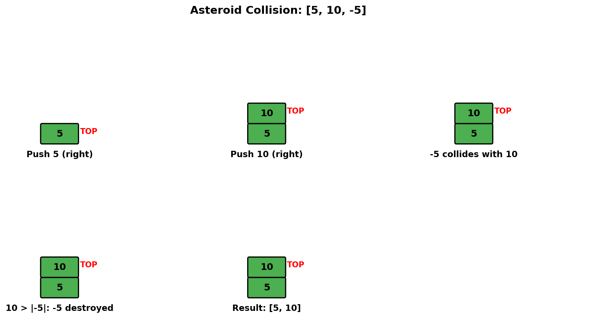
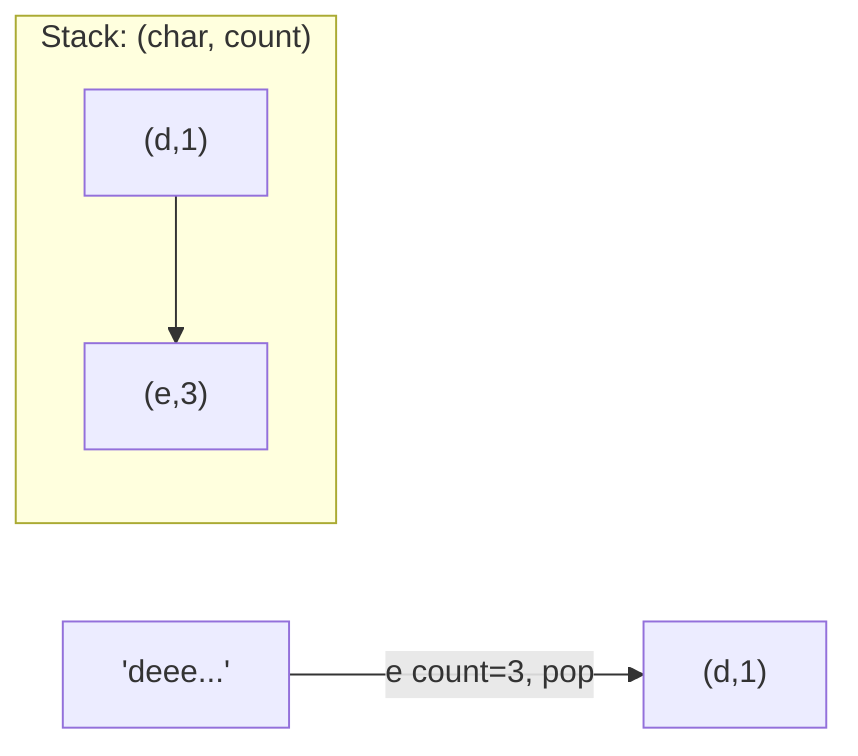
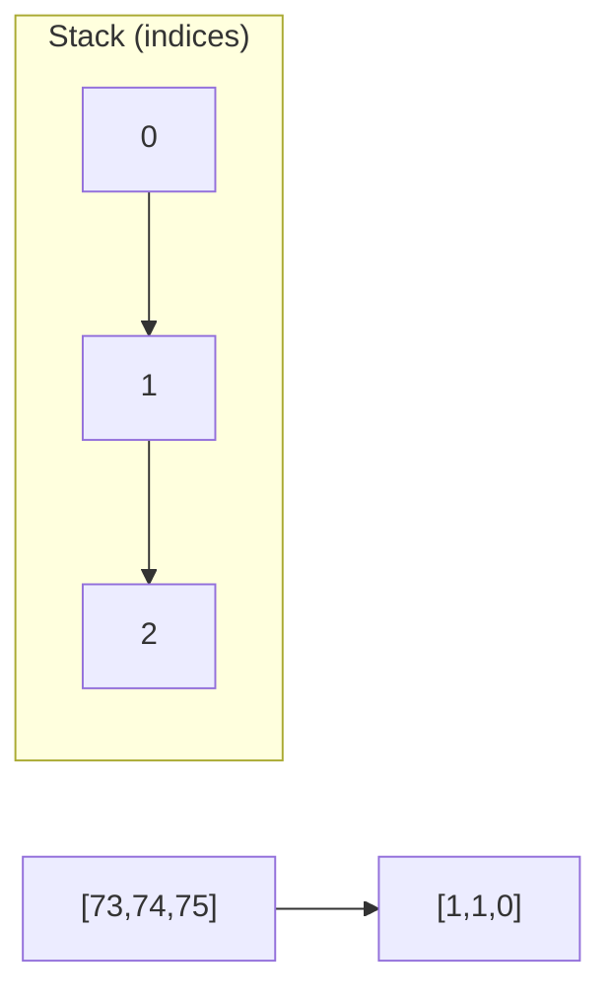
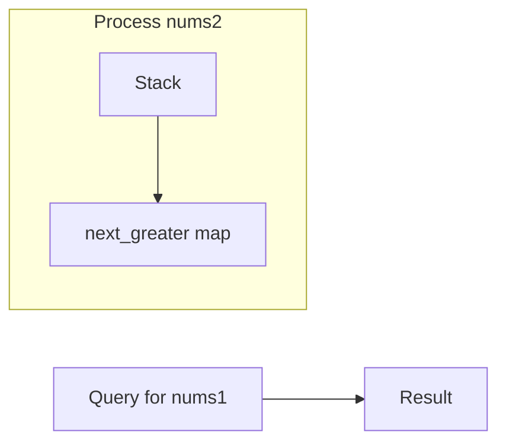
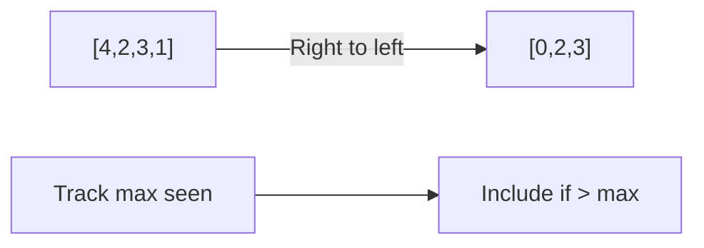

# Asteroid Collision

> **LeetCode 735** | Difficulty: Medium | Pattern: Stack Simulation

---

## Problem Statement

We are given an array `asteroids` of integers representing asteroids in a row.

For each asteroid, the absolute value represents its size, and the sign represents its direction (positive meaning right, negative meaning left). Each asteroid moves at the same speed.

Find out the state of the asteroids after all collisions. If two asteroids meet, the smaller one will explode. If both are the same size, both will explode. Two asteroids moving in the same direction will never meet.

### Examples

**Example 1:**
```
Input: asteroids = [5,10,-5]
Output: [5,10]
Explanation: The 10 and -5 collide, 10 survives. 5 and 10 never collide.
```

**Example 2:**
```
Input: asteroids = [8,-8]
Output: []
Explanation: 8 and -8 collide and both explode.
```

**Example 3:**
```
Input: asteroids = [10,2,-5]
Output: [10]
Explanation: 2 and -5 collide, -5 survives. Then 10 and -5 collide, 10 survives.
```

### Constraints

- `2 <= asteroids.length <= 10^4`
- `-1000 <= asteroids[i] <= 1000`
- `asteroids[i] != 0`

---

## Intuition

Collisions only happen when a positive (right-moving) asteroid is followed by a negative (left-moving) asteroid. Two same-direction asteroids never collide.

**Key Insight**: Use a stack to track asteroids. When we see a negative asteroid, check if it collides with positive asteroids on the stack.

---

## Visualization



For `[5, 10, -5]`:

```
Process 5 (right-moving):
  Stack: [5]

Process 10 (right-moving):
  Stack: [5, 10]

Process -5 (left-moving):
  Stack top is 10 (right-moving) -> COLLISION!
  |10| > |-5|, so -5 explodes, 10 survives
  Stack: [5, 10]

Result: [5, 10]
```

---

## Solution

::: code-group

```python [Python]
def asteroidCollision(asteroids: list[int]) -> list[int]:
    """
    Simulate asteroid collisions using stack.

    Collision happens when: stack top > 0 and current < 0
    (right-moving meets left-moving)

    Time: O(n) - each asteroid added/removed at most once
    Space: O(n) - stack size
    """
    stack = []

    for asteroid in asteroids:
        alive = True

        # Check for collision: stack has right-moving, current is left-moving
        while alive and stack and asteroid < 0 < stack[-1]:
            # Compare sizes (absolute values)
            if stack[-1] < -asteroid:
                # Stack top explodes, current survives (for now)
                stack.pop()
            elif stack[-1] == -asteroid:
                # Both explode
                stack.pop()
                alive = False
            else:
                # Current asteroid explodes
                alive = False

        if alive:
            stack.append(asteroid)

    return stack
```

```java [Java]
public int[] asteroidCollision(int[] asteroids) {
    Deque<Integer> stack = new ArrayDeque<>();

    for (int asteroid : asteroids) {
        boolean alive = true;

        while (alive && !stack.isEmpty() && asteroid < 0 && stack.peek() > 0) {
            if (stack.peek() < -asteroid) {
                stack.pop();
            } else if (stack.peek() == -asteroid) {
                stack.pop();
                alive = false;
            } else {
                alive = false;
            }
        }

        if (alive) {
            stack.push(asteroid);
        }
    }

    int[] result = new int[stack.size()];
    for (int i = result.length - 1; i >= 0; i--) {
        result[i] = stack.pop();
    }
    return result;
}
```

:::

::: info Complexity: Time O(n) · Space O(n)
- **Time:** Each asteroid is pushed onto the stack at most once and popped at most once, giving O(n) total operations regardless of collisions
- **Space:** In the worst case (all asteroids moving same direction), all n elements remain in the stack
:::

---

## Why Only Right-then-Left Collisions?

```
Case 1: Both moving right (+, +)
  5 -> 10 ->
  Never meet (10 is ahead and both move right)

Case 2: Both moving left (-, -)
  <- -5 <- -10
  Never meet (-10 is ahead and both move left)

Case 3: Left then right (-, +)
  <- -5   10 ->
  Moving apart, never meet

Case 4: Right then left (+, -)
  5 ->   <- -10
  Moving toward each other, COLLISION!
```

---

## Step-by-Step Walkthrough

For `[10, 2, -5]`:

```
Initial: stack = []

asteroid = 10 (right):
  No collision check needed (stack empty)
  stack = [10]

asteroid = 2 (right):
  No collision (both moving right)
  stack = [10, 2]

asteroid = -5 (left):
  Collision check: stack[-1]=2 > 0, asteroid=-5 < 0 -> COLLISION!
  |2| < |-5|, so 2 explodes, -5 survives
  stack = [10]

  Collision check: stack[-1]=10 > 0, asteroid=-5 < 0 -> COLLISION!
  |10| > |-5|, so -5 explodes
  alive = False
  stack = [10]

Result: [10]
```

---

## Edge Cases

```python
def test_asteroid_collision():
    # No collisions (all same direction)
    assert asteroidCollision([1, 2, 3]) == [1, 2, 3]
    assert asteroidCollision([-1, -2, -3]) == [-1, -2, -3]

    # Moving apart
    assert asteroidCollision([-1, 1]) == [-1, 1]

    # Complete annihilation
    assert asteroidCollision([1, -1]) == []
    assert asteroidCollision([1, 2, -2, -1]) == []

    # Chain reaction
    assert asteroidCollision([10, 2, -5]) == [10]

    # Large destroys many small
    assert asteroidCollision([1, 2, 3, -10]) == [-10]

    # Equal size collision
    assert asteroidCollision([5, -5]) == []

    # Left-moving survives
    assert asteroidCollision([1, -2]) == [-2]
```

---

## Complexity Analysis

| Aspect | Complexity | Explanation |
|--------|------------|-------------|
| **Time** | O(n) | Each asteroid pushed/popped at most once |
| **Space** | O(n) | Stack can hold all asteroids |

---

## Alternative: More Explicit Logic

```python
def asteroidCollision(asteroids: list[int]) -> list[int]:
    """Alternative with more explicit collision handling."""
    stack = []

    for asteroid in asteroids:
        # Process collisions
        while stack and asteroid < 0 and stack[-1] > 0:
            diff = stack[-1] + asteroid  # e.g., 10 + (-5) = 5

            if diff < 0:
                # Left asteroid is larger, destroy right
                stack.pop()
            elif diff > 0:
                # Right asteroid is larger, destroy left (current)
                asteroid = 0  # Mark as destroyed
            else:
                # Equal size, both destroy
                stack.pop()
                asteroid = 0

        # Add surviving asteroid
        if asteroid != 0:
            stack.append(asteroid)

    return stack
```

::: info Complexity: Time O(n) · Space O(n)
- **Time:** Each asteroid processed once; diff calculation is O(1) per iteration
- **Space:** Stack holds up to n asteroids when no collisions occur
:::

---

## Common Mistakes

1. **Forgetting the while loop**
   ```python
   # One left asteroid can destroy multiple right ones
   # [-10, 1, 2, 3] -> while loop needed, not just if
   ```

2. **Wrong collision condition**
   ```python
   # Only collide when: stack[-1] > 0 AND asteroid < 0
   # Not: opposite signs (that includes moving apart)
   ```

3. **Not handling equal size**
   ```python
   # Both should explode when |a| == |b|
   # Don't forget alive = False and stack.pop()
   ```

---

## Interview Tips

### What Interviewers Look For

1. **Collision Logic**: Understand which asteroids collide
2. **Stack Usage**: Natural fit for sequential processing
3. **Edge Cases**: Equal size, chain reactions, no collisions

### Common Follow-up Questions

1. **"What if asteroids have different speeds?"**
   - Faster asteroids might catch slower ones
   - Need time-based simulation

2. **"What if there are multiple rows?"**
   - 2D simulation, check collisions in each row

3. **"Return the order of explosions?"**
   - Track which asteroid destroyed which
   - Return collision pairs

4. **"What if asteroids can merge instead of explode?"**
   ```python
   # Instead of destroying smaller one:
   merged = stack[-1] + asteroid  # Or some merge function
   stack.pop()
   stack.append(merged)
   ```

---

## Variations

### 1. Count Collisions

```python
def countCollisions(asteroids: list[int]) -> int:
    """Count total number of collisions."""
    stack = []
    collisions = 0

    for asteroid in asteroids:
        while stack and asteroid < 0 < stack[-1]:
            collisions += 1
            if stack[-1] < -asteroid:
                stack.pop()
            elif stack[-1] == -asteroid:
                stack.pop()
                asteroid = 0
                break
            else:
                asteroid = 0
                break

        if asteroid != 0:
            stack.append(asteroid)

    return collisions
```

::: info Complexity: Time O(n) · Space O(n)
- **Time:** Same O(n) as main solution; counting collisions adds O(1) per collision
- **Space:** Stack stores surviving asteroids, up to n in worst case
:::

### 2. Return Collision History

```python
def collisionHistory(asteroids: list[int]) -> list[tuple]:
    """Return list of (winner, loser) for each collision."""
    stack = []
    history = []

    for i, asteroid in enumerate(asteroids):
        while stack and asteroid < 0 < stack[-1][0]:
            top, top_idx = stack[-1]
            if top < -asteroid:
                stack.pop()
                history.append((asteroid, top))
            elif top == -asteroid:
                stack.pop()
                history.append((None, (top, asteroid)))  # Both explode
                asteroid = 0
                break
            else:
                history.append((top, asteroid))
                asteroid = 0
                break

        if asteroid != 0:
            stack.append((asteroid, i))

    return history
```

::: info Complexity: Time O(n) · Space O(n)
- **Time:** Each asteroid visited once; history append is O(1) amortized
- **Space:** Stack stores (asteroid, index) pairs; history list grows with collision count
:::

---

## Related Problems

::: details Remove All Adjacent Duplicates II (LeetCode 1209)
**Problem:** Remove k adjacent duplicates repeatedly. "deeedbbcccbdaa", k=3 -> "aa".

**Key Insight:** Stack tracks (char, count). Increment count for same char, pop when reaches k.



**Approach:** Stack stores pairs. On same char, increment count. If count == k, pop the pair.

**Complexity:** O(n) time, O(n) space
:::

::: details Daily Temperatures (LeetCode 739)
**Problem:** Return days until warmer temperature for each day.

**Key Insight:** Next greater element pattern with index difference calculation.



**Approach:** Monotonic decreasing stack of indices. Pop and record difference when warmer found.

**Complexity:** O(n) time, O(n) space
:::

::: details Next Greater Element I (LeetCode 496)
**Problem:** For each element in nums1, find next greater element in nums2.

**Key Insight:** Build hashmap of next greater for all nums2 elements using monotonic stack.



**Approach:** Monotonic decreasing stack on nums2. When popping, record next greater in hashmap.

**Complexity:** O(n + m) time, O(n) space
:::

::: details Buildings With Ocean View (LeetCode 1762)
**Problem:** Return indices of buildings with ocean view (no taller building to the right).

**Key Insight:** Scan right to left tracking max height, or use monotonic decreasing stack.



**Approach:** Iterate right to left, track max height. Building has view if taller than max.

**Complexity:** O(n) time, O(1) space (excluding output)
:::

---

## References

- [LeetCode 735 - Asteroid Collision](https://leetcode.com/problems/asteroid-collision/)
- [NeetCode Solution](https://neetcode.io/solutions/asteroid-collision)
- [Stack Pattern - LeetCode](https://leetcode.com/discuss/study-guide/1688903/Solved-all-Stack-problems)
