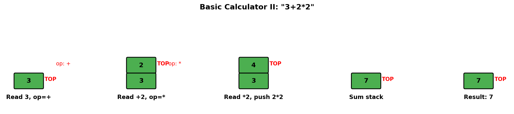
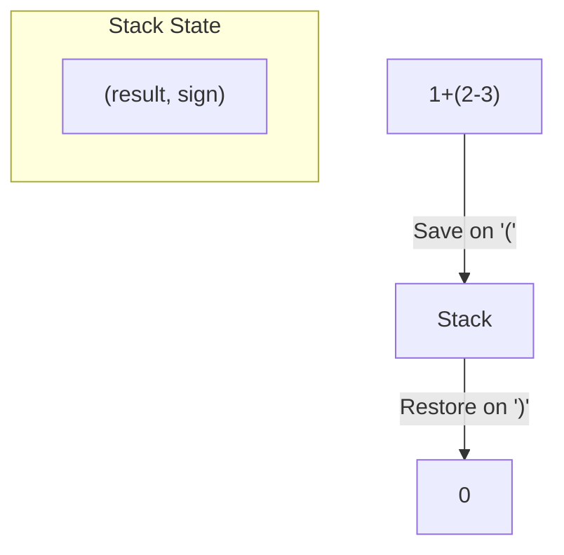
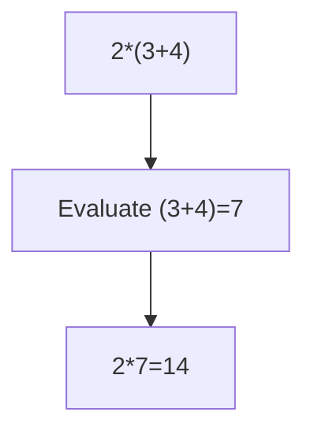
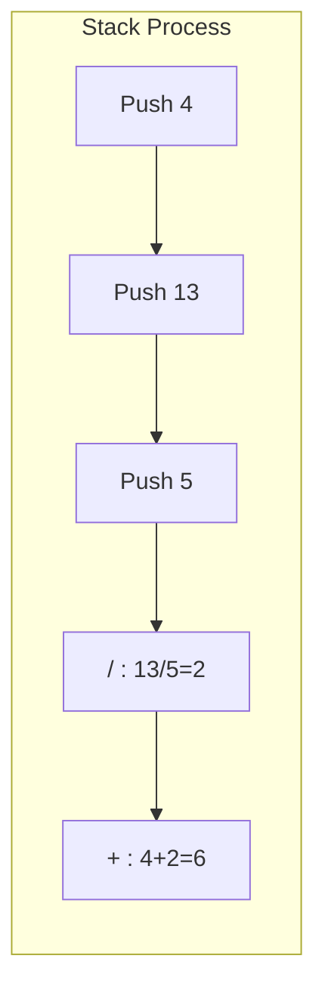
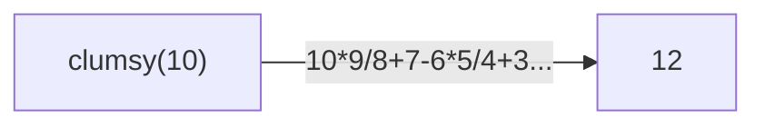

# Basic Calculator II

> **LeetCode 227** | Difficulty: Medium | Pattern: Stack + Parsing

---

## Problem Statement

Given a string `s` which represents an expression, evaluate this expression and return its value.

The integer division should truncate toward zero.

You may assume that the given expression is always valid. All intermediate results will be in the range of `[-2^31, 2^31 - 1]`.

### Operators Supported

- `+` (addition)
- `-` (subtraction)
- `*` (multiplication)
- `/` (division, truncates toward zero)

**Note:** No parentheses in this problem.

### Examples

**Example 1:**
```
Input: s = "3+2*2"
Output: 7
```

**Example 2:**
```
Input: s = " 3/2 "
Output: 1
```

**Example 3:**
```
Input: s = " 3+5 / 2 "
Output: 5
```

### Constraints

- `1 <= s.length <= 3 * 10^5`
- `s` consists of integers and operators `('+', '-', '*', '/')` separated by spaces
- `s` represents a valid expression
- All integers are non-negative

---

## Intuition

Without parentheses, we only need to handle **operator precedence**: `*` and `/` bind tighter than `+` and `-`.

**Key Insight**: Process multiplication and division immediately, but defer addition and subtraction to the end.

**Strategy**:
1. When we see `+` or `-`, push the previous number to stack (with sign)
2. When we see `*` or `/`, pop from stack, apply operator, push result
3. Sum the stack at the end

---

## Stack State Visualization



For expression `3 + 2 * 2`:

```
Process "3":
  num = 3, prev_op = '+' (implicit)

Process "+":
  Push +3 to stack (prev_op was '+')
  Stack: [3]
  prev_op = '+'

Process "2":
  num = 2

Process "*":
  Push +2 to stack (prev_op was '+')
  Stack: [3, 2]
  prev_op = '*'

Process "2":
  num = 2

End of string:
  prev_op is '*', so: pop 2, calculate 2*2=4, push 4
  Stack: [3, 4]

Sum stack: 3 + 4 = 7
```

---

## Solution

::: code-group

```python [Python]
def calculate(s: str) -> int:
    """
    Evaluate expression with +, -, *, /.

    Approach:
    - Use stack to defer + and - operations
    - Apply * and / immediately
    - Sum stack at the end

    Time: O(n)
    Space: O(n) for stack
    """
    stack = []
    num = 0
    prev_op = '+'  # Start with implicit '+' before first number
    s += '+'  # Sentinel to process last number

    for char in s:
        if char.isdigit():
            num = num * 10 + int(char)

        elif char in '+-*/':
            # Apply previous operator
            if prev_op == '+':
                stack.append(num)
            elif prev_op == '-':
                stack.append(-num)
            elif prev_op == '*':
                stack.append(stack.pop() * num)
            elif prev_op == '/':
                # Truncate toward zero
                stack.append(int(stack.pop() / num))

            # Reset for next number
            num = 0
            prev_op = char

        # Ignore spaces

    return sum(stack)
```

```java [Java]
public int calculate(String s) {
    Deque<Integer> stack = new ArrayDeque<>();
    int num = 0;
    char prevOp = '+';
    String padded = s + "+";

    for (char c : padded.toCharArray()) {
        if (Character.isDigit(c)) {
            num = num * 10 + (c - '0');
        } else if (c == '+' || c == '-' || c == '*' || c == '/') {
            if (prevOp == '+') {
                stack.push(num);
            } else if (prevOp == '-') {
                stack.push(-num);
            } else if (prevOp == '*') {
                stack.push(stack.pop() * num);
            } else { // '/'
                int top = stack.pop();
                stack.push((int)(top / (double) num)); // truncate toward zero
            }
            num = 0;
            prevOp = c;
        }
        // ignore spaces
    }

    int result = 0;
    while (!stack.isEmpty()) result += stack.pop();
    return result;
}
```

:::

::: info Complexity: Time O(n) · Space O(n)
- **Time:** Single pass through string; each character processed once with O(1) operations
- **Space:** Stack can hold up to n/2 numbers (alternating digits and operators), so O(n)
:::

---

## Alternative: O(1) Space Solution

```python
def calculate(s: str) -> int:
    """
    O(1) space solution - track running sum and pending operand.

    Time: O(n)
    Space: O(1)
    """
    result = 0      # Final result (sum of all terms)
    last_num = 0    # Last number pushed (for * and /)
    num = 0         # Current number being parsed
    prev_op = '+'

    for i, char in enumerate(s + '+'):
        if char.isdigit():
            num = num * 10 + int(char)

        elif char in '+-*/':
            if prev_op == '+':
                result += last_num
                last_num = num
            elif prev_op == '-':
                result += last_num
                last_num = -num
            elif prev_op == '*':
                last_num *= num
            elif prev_op == '/':
                last_num = int(last_num / num)

            num = 0
            prev_op = char

    return result + last_num
```

::: info Complexity: Time O(n) · Space O(1)
- **Time:** Single pass through string with O(1) work per character
- **Space:** Only uses fixed variables (result, last_num, num, prev_op) regardless of input size
:::

---

## Step-by-Step Walkthrough

For expression `3 + 5 / 2`:

```
Initial: stack=[], num=0, prev_op='+'

char='3':
  num = 3

char='+':
  prev_op is '+', push num (3)
  stack = [3]
  num = 0, prev_op = '+'

char='5':
  num = 5

char='/':
  prev_op is '+', push num (5)
  stack = [3, 5]
  num = 0, prev_op = '/'

char='2':
  num = 2

Sentinel '+':
  prev_op is '/', pop 5, calculate 5/2=2, push 2
  stack = [3, 2]

Sum stack: 3 + 2 = 5
```

---

## Why This Works

The key insight is **delayed evaluation**:

1. `+` and `-` are low precedence, so we just store their operands
2. `*` and `/` are high precedence, so we combine them with the previous operand immediately
3. At the end, all high-precedence operations are done, we just sum

```
Expression: 2 + 3 * 4 + 5

Parse 2, see +: push 2       Stack: [2]
Parse 3, see *: push 3       Stack: [2, 3]
Parse 4, see +: pop 3, push 3*4=12  Stack: [2, 12]
Parse 5, end:   push 5       Stack: [2, 12, 5]

Sum: 2 + 12 + 5 = 19
```

---

## Complexity Analysis

| Approach | Time | Space |
|----------|------|-------|
| **Stack** | O(n) | O(n) |
| **O(1) Space** | O(n) | O(1) |

---

## Edge Cases

```python
def test_calculator_ii():
    # Single number
    assert calculate("42") == 42

    # Simple operations
    assert calculate("3+2") == 5
    assert calculate("3-2") == 1
    assert calculate("3*2") == 6
    assert calculate("3/2") == 1

    # Mixed operations
    assert calculate("3+2*2") == 7
    assert calculate("3*2+2") == 8
    assert calculate("3+2*2-1") == 6

    # Division truncates toward zero
    assert calculate("7/3") == 2
    assert calculate("7/-3") == -2  # If negative numbers allowed

    # Spaces
    assert calculate("  3  +  2  ") == 5

    # Multiple same operators
    assert calculate("1+2+3+4") == 10
    assert calculate("2*3*4") == 24
```

---

## Division Toward Zero

Python's `//` floors toward negative infinity, but we need truncation toward zero:

```python
# Python's // behavior
-7 // 2   # = -4 (floor toward -inf)

# We need truncation toward zero
int(-7 / 2)  # = -3

# In our code
stack.append(int(stack.pop() / num))
```

---

## Interview Tips

### What Interviewers Look For

1. **Operator Precedence**: Handle `*` and `/` before `+` and `-`
2. **Clean Code**: Clear separation of parsing and evaluation
3. **Edge Cases**: Empty string, single number, only one operator type

### Common Follow-up Questions

1. **"How would you add parentheses?"**
   - Combine with Basic Calculator I approach
   - Use stack to save state on `(`, restore on `)`

2. **"How would you add exponentiation?"**
   - Add `^` with higher precedence than `*` and `/`
   - Right-associative: `2^3^2` = `2^(3^2)` = `2^9` = 512

3. **"Can you solve it without the sentinel?"**
   ```python
   # Process last number after the loop
   for char in s:
       # ... same logic ...

   # Handle last number with prev_op
   if prev_op == '+':
       stack.append(num)
   # ... etc
   ```

4. **"How would you handle unary minus?"**
   - Treat `-` at start or after operator as unary
   - Multiply next number by -1

---

## Comparison: Calculator Problems

| Problem | Operators | Parentheses | Key Technique |
|---------|-----------|-------------|---------------|
| **Calculator I** (LC 224) | `+` `-` | Yes | Stack for state save/restore |
| **Calculator II** (LC 227) | `+ - * /` | No | Stack for deferred +/- |
| **Calculator III** (LC 772) | `+ - * /` | Yes | Combine both techniques |

---

## Complete Calculator III Solution

```python
def calculateIII(s: str) -> int:
    """
    Calculator with +, -, *, / and parentheses.
    Combines approaches from Calculator I and II.
    """
    def helper(s: list) -> int:
        stack = []
        num = 0
        prev_op = '+'

        while s:
            char = s.pop(0)

            if char.isdigit():
                num = num * 10 + int(char)

            if char == '(':
                num = helper(s)  # Recursive call

            if char in '+-*/)' or not s:
                if prev_op == '+':
                    stack.append(num)
                elif prev_op == '-':
                    stack.append(-num)
                elif prev_op == '*':
                    stack.append(stack.pop() * num)
                elif prev_op == '/':
                    stack.append(int(stack.pop() / num))

                num = 0
                prev_op = char

            if char == ')':
                break

        return sum(stack)

    return helper(list(s.replace(' ', '')))
```

::: info Complexity: Time O(n) · Space O(n)
- **Time:** Each character processed once; recursion depth bounded by parenthesis nesting
- **Space:** Recursion stack depth proportional to max nesting level; each level maintains its own stack of numbers
:::

---

## Related Problems

::: details Basic Calculator (LeetCode 224)
**Problem:** Evaluate expression with +, - operators and parentheses (no * or /).

**Key Insight:** Stack saves state (result, sign) when entering '(', restores when exiting ')'.



**Approach:** Track result and sign. Push state on '(', pop and combine on ')'.

**Complexity:** O(n) time, O(n) space
:::

::: details Basic Calculator III (LeetCode 772)
**Problem:** Evaluate expression with all four operators (+, -, *, /) and parentheses.

**Key Insight:** Combine operator precedence handling with parentheses state saving.



**Approach:** Recursive helper processes parenthesized subexpressions. Use stack for operator precedence.

**Complexity:** O(n) time, O(n) space
:::

::: details Evaluate Reverse Polish Notation (LeetCode 150)
**Problem:** Evaluate expression in postfix notation (operators follow operands).

**Key Insight:** No precedence or parentheses needed - stack handles everything naturally.



**Approach:** Push numbers. On operator, pop two, apply, push result. Final stack top is answer.

**Complexity:** O(n) time, O(n) space
:::

::: details Clumsy Factorial (LeetCode 1006)
**Problem:** Compute "clumsy factorial" using fixed operator cycle: * / + - * / + - ...

**Key Insight:** Same precedence handling as Calculator II, but operators are predetermined.



**Approach:** Process groups of 4 numbers with fixed * / + - pattern. Handle precedence as usual.

**Complexity:** O(n) time, O(1) space possible
:::

---

## References

- [LeetCode 227 - Basic Calculator II](https://leetcode.com/problems/basic-calculator-ii/)
- [NeetCode Solution](https://neetcode.io/solutions/basic-calculator-ii)
- [Operator Precedence - Wikipedia](https://en.wikipedia.org/wiki/Order_of_operations)
