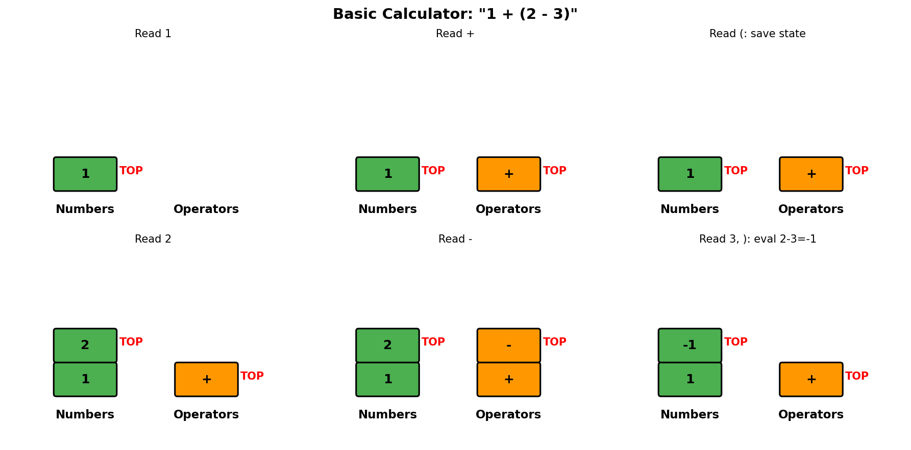
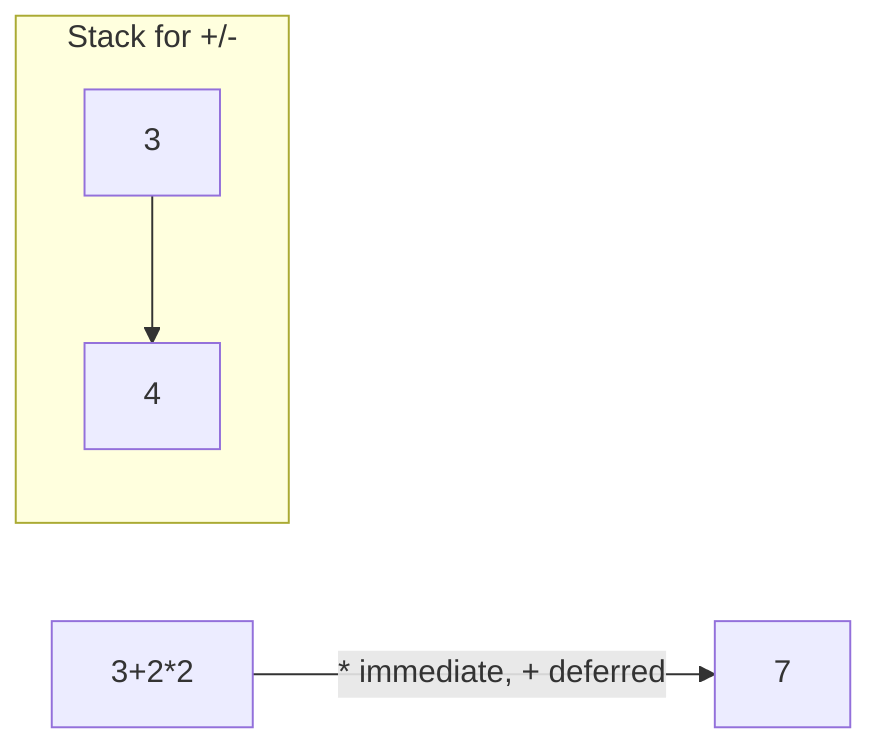
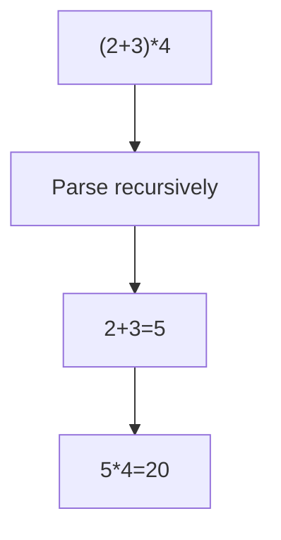
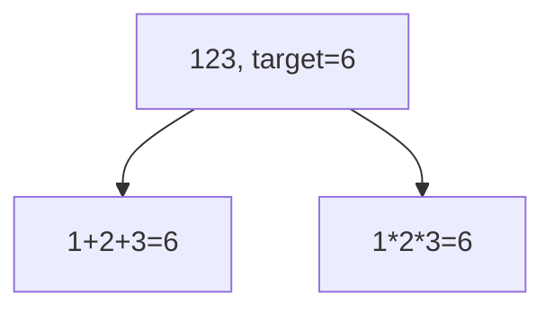
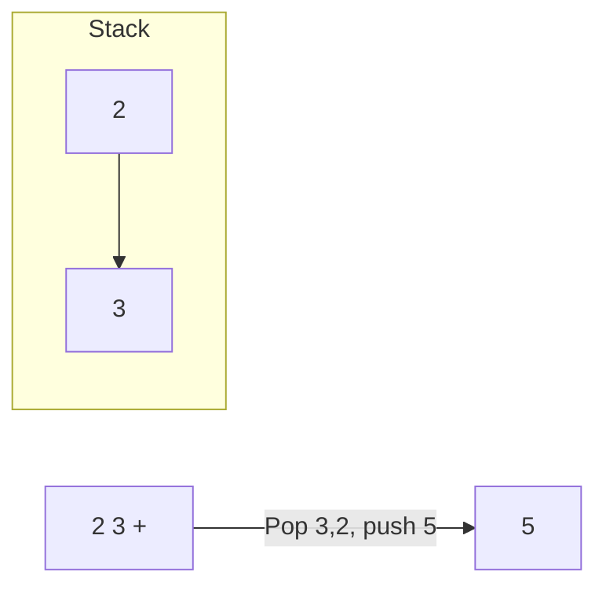
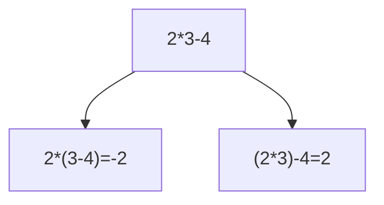

# Basic Calculator

> **LeetCode 224** | Difficulty: Hard | Pattern: Stack + Parsing

---

## Problem Statement

Given a string `s` representing a valid expression, implement a basic calculator to evaluate it, and return the result of the evaluation.

**Note:** You are not allowed to use any built-in function which evaluates strings as mathematical expressions, such as `eval()`.

### Operators Supported

- `+` (addition)
- `-` (subtraction)
- `(` `)` (parentheses for grouping)

### Examples

**Example 1:**
```
Input: s = "1 + 1"
Output: 2
```

**Example 2:**
```
Input: s = " 2-1 + 2 "
Output: 3
```

**Example 3:**
```
Input: s = "(1+(4+5+2)-3)+(6+8)"
Output: 23
```

### Constraints

- `1 <= s.length <= 3 * 10^5`
- `s` consists of digits, `'+'`, `'-'`, `'('`, `')'`, and `' '`
- `s` represents a valid expression
- `'+'` is not used as unary operation (e.g., `"+1"` is not valid)
- `'-'` could be used as unary negation (e.g., `"-1"`)
- No two operators are adjacent

---

## Intuition

The challenge is handling nested parentheses. When we enter a `(`, we need to save our current state and start fresh. When we exit with `)`, we combine the inner result with the saved state.

**Key Insight**: Use a stack to save state (current result and sign) when entering parentheses. The sign before `(` affects the entire parenthesized expression.

---

## Stack State Visualization



For expression `1 + (2 - 3)`:

```
Process "1":
  result = 1, sign = 1

Process "+":
  sign = 1 (next number will be added)

Process "(":
  Push (result=1, sign=1) to stack
  Reset: result = 0, sign = 1
  Stack: [(1, 1)]

Process "2":
  result = 0 + 1*2 = 2

Process "-":
  sign = -1

Process "3":
  result = 2 + (-1)*3 = -1

Process ")":
  Pop (prev_result=1, prev_sign=1)
  result = prev_result + prev_sign * result
  result = 1 + 1*(-1) = 0

Final result: 0
```

---

## Solution

::: code-group

```python [Python]
def calculate(s: str) -> int:
    """
    Evaluate expression with +, -, and parentheses.

    Approach:
    - Track current result and sign
    - Use stack to save state on '(' and restore on ')'

    Time: O(n)
    Space: O(n) for stack depth
    """
    stack = []
    result = 0
    num = 0
    sign = 1  # 1 for positive, -1 for negative

    for char in s:
        if char.isdigit():
            num = num * 10 + int(char)

        elif char == '+':
            result += sign * num
            num = 0
            sign = 1

        elif char == '-':
            result += sign * num
            num = 0
            sign = -1

        elif char == '(':
            # Save current state and start fresh
            stack.append(result)
            stack.append(sign)
            result = 0
            sign = 1

        elif char == ')':
            # Finish current expression
            result += sign * num
            num = 0
            # Apply saved state
            result *= stack.pop()  # sign before (
            result += stack.pop()  # result before (

        # Ignore spaces

    # Don't forget the last number
    result += sign * num

    return result
```

```java [Java]
public int calculate(String s) {
    Deque<Integer> stack = new ArrayDeque<>();
    int result = 0;
    int num = 0;
    int sign = 1;

    for (char c : s.toCharArray()) {
        if (Character.isDigit(c)) {
            num = num * 10 + (c - '0');
        } else if (c == '+') {
            result += sign * num;
            num = 0;
            sign = 1;
        } else if (c == '-') {
            result += sign * num;
            num = 0;
            sign = -1;
        } else if (c == '(') {
            stack.push(result);
            stack.push(sign);
            result = 0;
            sign = 1;
        } else if (c == ')') {
            result += sign * num;
            num = 0;
            result *= stack.pop(); // sign before '('
            result += stack.pop(); // result before '('
        }
        // ignore spaces
    }

    result += sign * num;
    return result;
}
```

:::

::: info Complexity: Time O(n) · Space O(n)
- **Time:** Single pass through string; each character processed with O(1) operations
- **Space:** Stack stores 2 values per open parenthesis; max depth = n/2 for deeply nested expressions like (((...)))
:::

---

## Alternative: Single Pass with Clearer Logic

```python
def calculate(s: str) -> int:
    """Alternative implementation with explicit number parsing."""
    stack = []
    result = 0
    sign = 1
    i = 0
    n = len(s)

    while i < n:
        char = s[i]

        if char.isdigit():
            # Parse complete number
            num = 0
            while i < n and s[i].isdigit():
                num = num * 10 + int(s[i])
                i += 1
            result += sign * num
            continue  # Don't increment i again

        elif char == '+':
            sign = 1

        elif char == '-':
            sign = -1

        elif char == '(':
            # Push current state
            stack.append(result)
            stack.append(sign)
            # Reset for inner expression
            result = 0
            sign = 1

        elif char == ')':
            # Combine with saved state
            prev_sign = stack.pop()
            prev_result = stack.pop()
            result = prev_result + prev_sign * result

        i += 1

    return result
```

::: info Complexity: Time O(n) · Space O(n)
- **Time:** While loop with index-based iteration; each character visited once
- **Space:** Stack depth equals parenthesis nesting depth, at most O(n)
:::

---

## Step-by-Step Walkthrough

For expression `(1+(4+5+2)-3)+(6+8)`:

```
i=0, char='(':
  Push result=0, sign=1
  Reset: result=0, sign=1
  Stack: [0, 1]

i=1, char='1':
  num = 1

i=2, char='+':
  result = 0 + 1*1 = 1
  num = 0, sign = 1

i=3, char='(':
  Push result=1, sign=1
  Reset: result=0, sign=1
  Stack: [0, 1, 1, 1]

i=4, char='4':
  num = 4

i=5, char='+':
  result = 0 + 1*4 = 4
  sign = 1

i=6, char='5':
  num = 5

i=7, char='+':
  result = 4 + 1*5 = 9
  sign = 1

i=8, char='2':
  num = 2

i=9, char=')':
  result = 9 + 1*2 = 11
  Pop sign=1, result=1
  result = 1 + 1*11 = 12
  Stack: [0, 1]

i=10, char='-':
  sign = -1

i=11, char='3':
  num = 3

i=12, char=')':
  result = 12 + (-1)*3 = 9
  Pop sign=1, result=0
  result = 0 + 1*9 = 9
  Stack: []

i=13, char='+':
  sign = 1

i=14, char='(':
  Push result=9, sign=1
  Reset: result=0, sign=1
  Stack: [9, 1]

i=15, char='6':
  num = 6

i=16, char='+':
  result = 0 + 1*6 = 6
  sign = 1

i=17, char='8':
  num = 8

i=18, char=')':
  result = 6 + 1*8 = 14
  Pop sign=1, result=9
  result = 9 + 1*14 = 23

Final result: 23
```

---

## Handling Unary Minus

For expressions like `-1 + 2` or `1 - (-2)`:

```python
def calculate_with_unary(s: str) -> int:
    """Handle unary minus like -1 or (-2)."""
    stack = []
    result = 0
    num = 0
    sign = 1
    prev_was_operator_or_start = True  # Track if - is unary

    for i, char in enumerate(s):
        if char.isdigit():
            num = num * 10 + int(char)
            prev_was_operator_or_start = False

        elif char == '+':
            result += sign * num
            num = 0
            sign = 1
            prev_was_operator_or_start = True

        elif char == '-':
            result += sign * num
            num = 0
            if prev_was_operator_or_start:
                sign = -1  # Unary minus
            else:
                sign = -1  # Binary minus
            prev_was_operator_or_start = True

        elif char == '(':
            stack.append(result)
            stack.append(sign)
            result = 0
            sign = 1
            prev_was_operator_or_start = True

        elif char == ')':
            result += sign * num
            num = 0
            result *= stack.pop()
            result += stack.pop()
            prev_was_operator_or_start = False

    result += sign * num
    return result
```

::: info Complexity: Time O(n) · Space O(n)
- **Time:** Single pass; tracking prev_was_operator_or_start adds O(1) overhead per character
- **Space:** Stack grows with nesting depth; worst case O(n) for maximally nested input
:::

---

## Complexity Analysis

| Aspect | Complexity | Explanation |
|--------|------------|-------------|
| **Time** | O(n) | Single pass through string |
| **Space** | O(n) | Stack depth for nested parentheses |

### Stack Depth

- Maximum stack depth = 2 * (max nesting level)
- We push 2 items (result, sign) for each `(`
- Worst case: `((((1))))` with n/2 parentheses

---

## Edge Cases

```python
def test_calculator():
    # Simple operations
    assert calculate("1 + 1") == 2
    assert calculate("2 - 1") == 1

    # Spaces
    assert calculate("  3  +  2  ") == 5

    # Nested parentheses
    assert calculate("((1))") == 1
    assert calculate("(1 + (2 + 3))") == 6

    # Unary minus
    assert calculate("-1 + 2") == 1  # If supported
    assert calculate("1 - (-2)") == 3

    # Large numbers
    assert calculate("999999999 + 1") == 1000000000

    # Long expression
    assert calculate("1+2+3+4+5+6+7+8+9+10") == 55
```

---

## Common Mistakes

1. **Forgetting the last number**
   ```python
   # Missing: result += sign * num at the end
   # Expression "1 + 2" would return 1 instead of 3
   ```

2. **Wrong order when popping**
   ```python
   # Wrong: prev_result = stack.pop(); prev_sign = stack.pop()
   # Correct: prev_sign = stack.pop(); prev_result = stack.pop()
   # Because we push (result, sign) in that order
   ```

3. **Not resetting num after operations**
   ```python
   # Must set num = 0 after using it
   ```

---

## Interview Tips

### What Interviewers Look For

1. **State Management**: Handle state transitions cleanly
2. **Edge Cases**: Spaces, unary operators, nested parens
3. **Clean Code**: Separate concerns, readable logic

### Common Follow-up Questions

1. **"How would you add multiplication and division?"**
   - See Basic Calculator II - need operator precedence

2. **"How would you validate the expression first?"**
   - Check balanced parentheses
   - Check no consecutive operators
   - Check expression starts/ends correctly

3. **"How would you show intermediate steps?"**
   - Print stack state and current values at each step

---

## Expression Validator

```python
def isValidExpression(s: str) -> bool:
    """Validate expression before evaluation."""
    paren_count = 0
    prev_type = 'START'  # START, NUM, OP, OPEN, CLOSE

    for char in s:
        if char == ' ':
            continue

        if char.isdigit():
            curr_type = 'NUM'
        elif char in '+-':
            curr_type = 'OP'
        elif char == '(':
            paren_count += 1
            curr_type = 'OPEN'
        elif char == ')':
            paren_count -= 1
            if paren_count < 0:
                return False
            curr_type = 'CLOSE'
        else:
            return False  # Invalid character

        # Check valid transitions
        if prev_type == 'OP' and curr_type == 'OP':
            return False
        if prev_type == 'OPEN' and curr_type == 'CLOSE':
            return False  # Empty parens ()

        prev_type = curr_type

    return paren_count == 0 and prev_type in ('NUM', 'CLOSE')
```

::: info Complexity: Time O(n) · Space O(1)
- **Time:** Single pass validation checking each character once
- **Space:** Only tracks paren_count and prev_type variables, constant space
:::

---

## Related Problems

::: details Basic Calculator II (LeetCode 227)
**Problem:** Evaluate expression with +, -, *, / operators (no parentheses).

**Key Insight:** Handle precedence by processing * and / immediately, deferring + and - to end.



**Approach:** Stack stores terms. * and / modify stack top immediately. Sum stack at end for + and -.

**Complexity:** O(n) time, O(n) space
:::

::: details Basic Calculator III (LeetCode 772)
**Problem:** Evaluate expression with +, -, *, / and parentheses.

**Key Insight:** Combine approaches: stack for precedence (like II) + recursion/stack for parentheses (like I).



**Approach:** Recursive descent or use stack to handle both precedence and nesting.

**Complexity:** O(n) time, O(n) space
:::

::: details Expression Add Operators (LeetCode 282)
**Problem:** Insert +, -, * between digits to evaluate to target value.

**Key Insight:** Backtracking with careful handling of multiplication precedence (need to track prev operand).



**Approach:** Backtrack all operator insertions. Track previous operand for * rollback.

**Complexity:** O(4^n) time (3 operators + no-op between digits)
:::

::: details Evaluate Reverse Polish Notation (LeetCode 150)
**Problem:** Evaluate expression in postfix notation (operators after operands).

**Key Insight:** Stack naturally evaluates RPN - push numbers, pop two and apply on operator.



**Approach:** Numbers push to stack. Operators pop two operands, compute, push result.

**Complexity:** O(n) time, O(n) space
:::

::: details Different Ways to Add Parentheses (LeetCode 241)
**Problem:** Return all possible results from computing different ways to group expression.

**Key Insight:** Divide and conquer at each operator. Combine all left/right subresults.



**Approach:** Recursively split at each operator. Combine all pairs of left/right results.

**Complexity:** O(Catalan(n)) results, exponential time
:::

---

## References

- [LeetCode 224 - Basic Calculator](https://leetcode.com/problems/basic-calculator/)
- [NeetCode Solution](https://neetcode.io/solutions/basic-calculator)
- [Expression Parsing - GeeksforGeeks](https://www.geeksforgeeks.org/expression-evaluation/)
