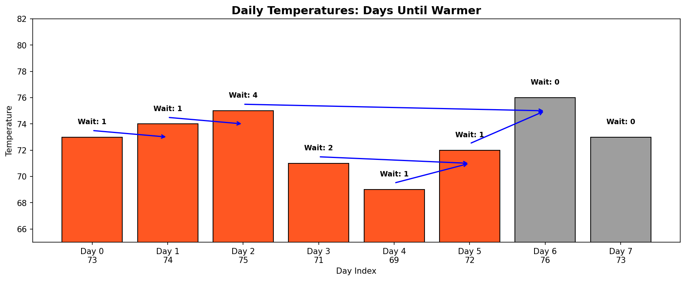
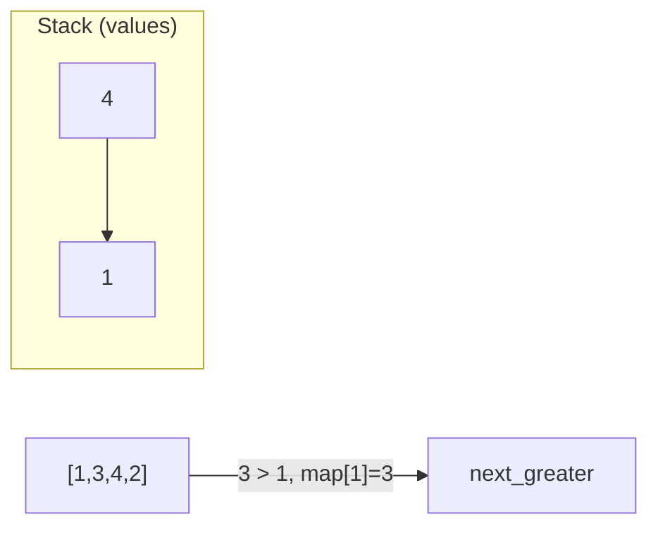
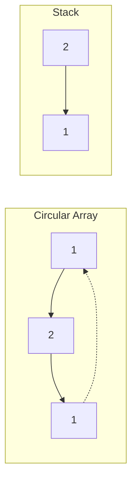
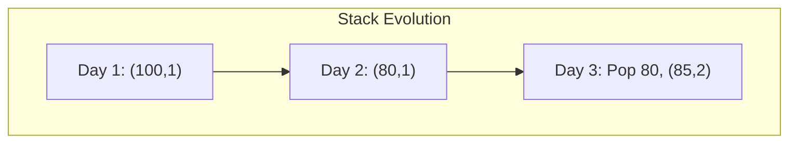
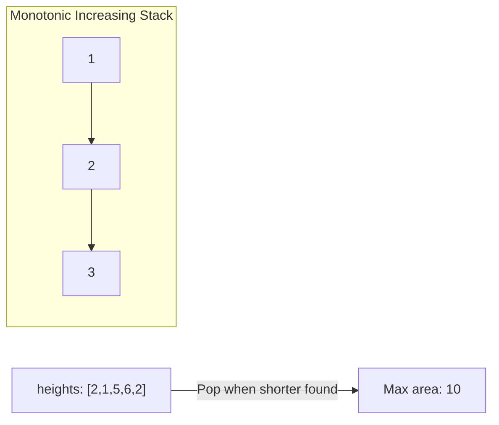

# Daily Temperatures

> **LeetCode 739** | Difficulty: Medium | Pattern: Monotonic Stack

---

## Problem Statement

Given an array of integers `temperatures` represents the daily temperatures, return an array `answer` such that `answer[i]` is the number of days you have to wait after the `i-th` day to get a warmer temperature.

If there is no future day for which this is possible, keep `answer[i] == 0` instead.

### Examples

**Example 1:**
```
Input: temperatures = [73,74,75,71,69,72,76,73]
Output: [1,1,4,2,1,1,0,0]
```

**Example 2:**
```
Input: temperatures = [30,40,50,60]
Output: [1,1,1,0]
```

**Example 3:**
```
Input: temperatures = [30,60,90]
Output: [1,1,0]
```

### Constraints

- `1 <= temperatures.length <= 10^5`
- `30 <= temperatures[i] <= 100`

---

## Intuition

This is a classic **Next Greater Element** problem with a twist: instead of returning the greater value, we return the **distance** (number of days) to that element.

**Key Insight**: Use a monotonic decreasing stack to track indices of temperatures waiting for a warmer day. When we find a warmer temperature, calculate the index difference.

---

## Visualization



```
temperatures = [73, 74, 75, 71, 69, 72, 76, 73]
                 0   1   2   3   4   5   6   7

Day 0 (73): Wait 1 day for 74
Day 1 (74): Wait 1 day for 75
Day 2 (75): Wait 4 days for 76
Day 3 (71): Wait 2 days for 72
Day 4 (69): Wait 1 day for 72
Day 5 (72): Wait 1 day for 76
Day 6 (76): No warmer day (0)
Day 7 (73): No warmer day (0)

Output: [1, 1, 4, 2, 1, 1, 0, 0]
```

---

## Solution: Monotonic Stack

::: code-group

```python [Python]
def dailyTemperatures(temperatures: list[int]) -> list[int]:
    """
    Find days until warmer temperature using monotonic decreasing stack.

    Stack stores indices of temperatures waiting for a warmer day.
    When we find warmer temp, pop and calculate day difference.

    Time: O(n) - each element pushed and popped at most once
    Space: O(n) - stack size in worst case
    """
    n = len(temperatures)
    result = [0] * n
    stack = []  # Monotonic decreasing stack of indices

    for i in range(n):
        # Pop all temperatures smaller than current (they found warmer day)
        while stack and temperatures[stack[-1]] < temperatures[i]:
            prev_idx = stack.pop()
            result[prev_idx] = i - prev_idx  # Days until warmer

        stack.append(i)

    # Remaining indices in stack have no warmer day (result stays 0)
    return result
```

```java [Java]
public int[] dailyTemperatures(int[] temperatures) {
    int n = temperatures.length;
    int[] result = new int[n];
    Deque<Integer> stack = new ArrayDeque<>(); // monotonic decreasing stack of indices

    for (int i = 0; i < n; i++) {
        while (!stack.isEmpty() && temperatures[stack.peek()] < temperatures[i]) {
            int prevIdx = stack.pop();
            result[prevIdx] = i - prevIdx;
        }
        stack.push(i);
    }

    return result;
}
```

:::

::: info Complexity: Time O(n) · Space O(n)
- **Time:** Each index pushed exactly once and popped at most once, totaling 2n operations = O(n)
- **Space:** Stack can hold all n indices in worst case (strictly decreasing temperatures like [76, 75, 74, 73])
:::

---

## Step-by-Step Walkthrough

```
temperatures = [73, 74, 75, 71, 69, 72, 76, 73]
result = [0, 0, 0, 0, 0, 0, 0, 0]
stack = []

i=0, temp=73:
  Stack empty, push 0
  stack = [0]

i=1, temp=74:
  74 > 73 (temp at index 0)
  Pop 0, result[0] = 1-0 = 1
  Stack empty, push 1
  stack = [1]
  result = [1, 0, 0, 0, 0, 0, 0, 0]

i=2, temp=75:
  75 > 74 (temp at index 1)
  Pop 1, result[1] = 2-1 = 1
  Stack empty, push 2
  stack = [2]
  result = [1, 1, 0, 0, 0, 0, 0, 0]

i=3, temp=71:
  71 < 75, push 3
  stack = [2, 3]

i=4, temp=69:
  69 < 71, push 4
  stack = [2, 3, 4]

i=5, temp=72:
  72 > 69 (temp at index 4)
  Pop 4, result[4] = 5-4 = 1
  72 > 71 (temp at index 3)
  Pop 3, result[3] = 5-3 = 2
  72 < 75, push 5
  stack = [2, 5]
  result = [1, 1, 0, 2, 1, 0, 0, 0]

i=6, temp=76:
  76 > 72 (temp at index 5)
  Pop 5, result[5] = 6-5 = 1
  76 > 75 (temp at index 2)
  Pop 2, result[2] = 6-2 = 4
  Stack empty, push 6
  stack = [6]
  result = [1, 1, 4, 2, 1, 1, 0, 0]

i=7, temp=73:
  73 < 76, push 7
  stack = [6, 7]

Done! Indices 6, 7 remain in stack (no warmer day)
Final result = [1, 1, 4, 2, 1, 1, 0, 0]
```

---

## Alternative: Process Right to Left

```python
def dailyTemperatures(temperatures: list[int]) -> list[int]:
    """
    Process from right to left.
    For each day, look at previously processed days to find next warmer.

    Time: O(n) - not immediately obvious, but each comparison
          leads to jumping forward, amortized O(n)
    """
    n = len(temperatures)
    result = [0] * n

    for i in range(n - 2, -1, -1):
        j = i + 1

        while j < n:
            if temperatures[j] > temperatures[i]:
                result[i] = j - i
                break
            elif result[j] == 0:
                # No warmer day after j, so no warmer day after i either
                result[i] = 0
                break
            else:
                # Jump to the next potentially warmer day
                j += result[j]

    return result
```

::: info Complexity: Time O(n) · Space O(1)
- **Time:** O(n) amortized; jumping via result[j] skips already-processed elements, each element visited at most twice
- **Space:** O(1) excluding the result array; no auxiliary data structure needed
:::

---

## Complexity Analysis

| Approach | Time | Space |
|----------|------|-------|
| **Brute Force** | O(n^2) | O(1) |
| **Monotonic Stack** | O(n) | O(n) |
| **Right to Left** | O(n) | O(1)* |

*Output array not counted as extra space

### Why Monotonic Stack is O(n)?

- Each index is pushed onto stack exactly once
- Each index is popped from stack at most once
- Total operations: 2n = O(n)

---

## Edge Cases

```python
def test_daily_temperatures():
    # All same temperatures
    assert dailyTemperatures([70, 70, 70]) == [0, 0, 0]

    # Strictly increasing
    assert dailyTemperatures([70, 71, 72, 73]) == [1, 1, 1, 0]

    # Strictly decreasing
    assert dailyTemperatures([73, 72, 71, 70]) == [0, 0, 0, 0]

    # Single element
    assert dailyTemperatures([70]) == [0]

    # Two elements
    assert dailyTemperatures([70, 71]) == [1, 0]
    assert dailyTemperatures([71, 70]) == [0, 0]

    # Valley pattern
    assert dailyTemperatures([73, 71, 72]) == [0, 1, 0]
```

---

## Common Mistakes

1. **Returning temperature instead of days**
   ```python
   # Wrong: result[prev_idx] = temperatures[i]
   # Correct: result[prev_idx] = i - prev_idx
   ```

2. **Using <= instead of <**
   ```python
   # Wrong: while stack and temperatures[stack[-1]] <= temperatures[i]
   # This would treat equal temperatures as "warmer"
   ```

3. **Forgetting remaining stack elements**
   - Elements left in stack have no warmer day
   - They correctly default to 0 from initialization

---

## Variations

### Days Until Colder Temperature

```python
def daysUntilColder(temperatures: list[int]) -> list[int]:
    """Monotonic INCREASING stack."""
    n = len(temperatures)
    result = [0] * n
    stack = []

    for i in range(n):
        while stack and temperatures[stack[-1]] > temperatures[i]:
            prev_idx = stack.pop()
            result[prev_idx] = i - prev_idx
        stack.append(i)

    return result
```

::: info Complexity: Time O(n) · Space O(n)
- **Time:** Same O(n) as main solution; condition change does not affect iteration count
- **Space:** Monotonic increasing stack stores up to n indices
:::

### Circular Temperatures

```python
def dailyTemperaturesCircular(temperatures: list[int]) -> list[int]:
    """Allow wrap-around to find warmer day."""
    n = len(temperatures)
    result = [0] * n
    stack = []

    for i in range(2 * n):
        idx = i % n
        while stack and temperatures[stack[-1]] < temperatures[idx]:
            prev_idx = stack.pop()
            result[prev_idx] = (idx - prev_idx) % n or n
        if i < n:
            stack.append(idx)

    return result
```

::: info Complexity: Time O(n) · Space O(n)
- **Time:** O(2n) = O(n); iterates array twice to handle circular wrap-around
- **Space:** Stack holds at most n indices from the first pass
:::

---

## Interview Tips

### What Interviewers Look For

1. **Pattern Recognition**: Identify as Next Greater Element variant
2. **Monotonic Stack**: Know when to use decreasing vs increasing
3. **Index vs Value**: Track indices, return distance

### Common Follow-up Questions

1. **"Can you solve it with O(1) space?"**
   - Yes, using right-to-left approach with jumping

2. **"What if we need the actual warmer temperature, not days?"**
   - Store and return `temperatures[i]` instead of `i - prev_idx`

3. **"What about circular temperatures?"**
   - Iterate 2n times, use modulo for index

4. **"How would you handle real-time streaming data?"**
   - Maintain the stack, process new temperatures as they arrive

---

## Related Problems

::: details Next Greater Element I (LeetCode 496)
**Problem:** Given nums1 (subset of nums2), find the next greater element in nums2 for each element of nums1.

**Key Insight:** Build hashmap of next greater elements for all nums2 elements, then lookup for nums1.



**Approach:** Monotonic decreasing stack on nums2. When current > stack top, record mapping. Query map for nums1.

**Complexity:** O(n + m) time, O(n) space
:::

::: details Next Greater Element II (LeetCode 503)
**Problem:** Given a circular array, find the next greater element for each element.

**Key Insight:** Iterate array twice (2n) to simulate circular behavior with monotonic decreasing stack.



**Approach:** Loop 2n times using i % n for index. Only push indices in first pass.

**Complexity:** O(n) time, O(n) space
:::

::: details Online Stock Span (LeetCode 901)
**Problem:** Return span (consecutive days with price <= today) for each daily price in stream.

**Key Insight:** Previous greater element problem. Stack stores (price, span), accumulate spans when popping.



**Approach:** Monotonic decreasing stack. Pop prices <= current, sum their spans + 1 for result.

**Complexity:** O(1) amortized per call
:::

::: details Largest Rectangle in Histogram (LeetCode 84)
**Problem:** Given histogram bar heights, find the largest rectangle area.

**Key Insight:** For each bar, find left and right boundaries (first shorter bar). Area = height * width.



**Approach:** Monotonic increasing stack of indices. When popping, calculate area with popped height and width from boundaries.

**Complexity:** O(n) time, O(n) space
:::

---

## References

- [LeetCode 739 - Daily Temperatures](https://leetcode.com/problems/daily-temperatures/)
- [NeetCode Solution](https://neetcode.io/solutions/daily-temperatures)
- [Monotonic Stack Pattern](https://leetcode.com/discuss/study-guide/5148505/monotonic-stack-guide)
