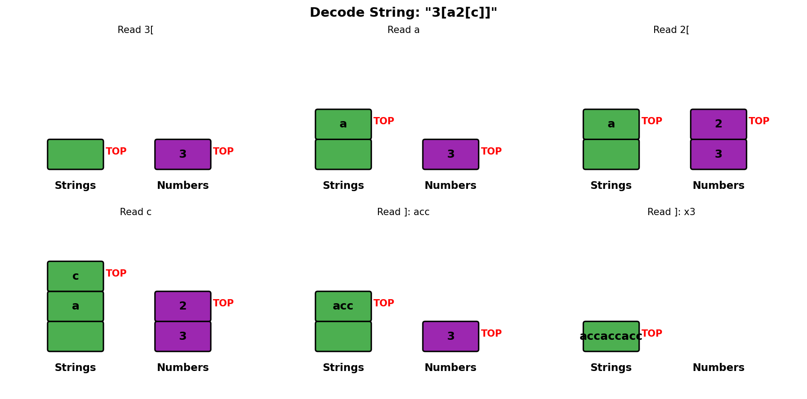
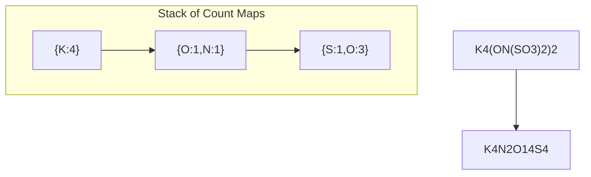
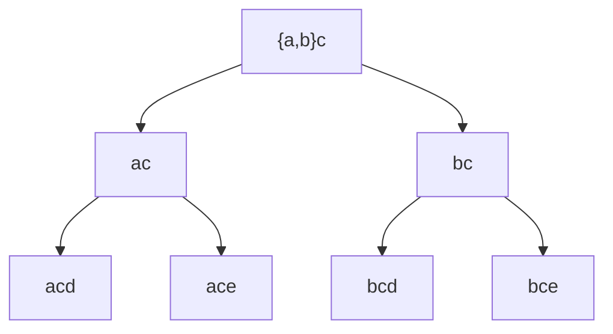
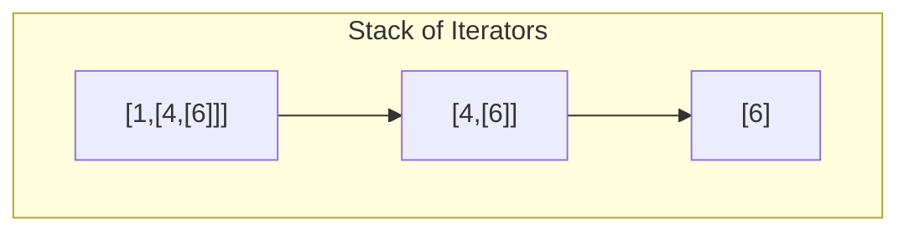
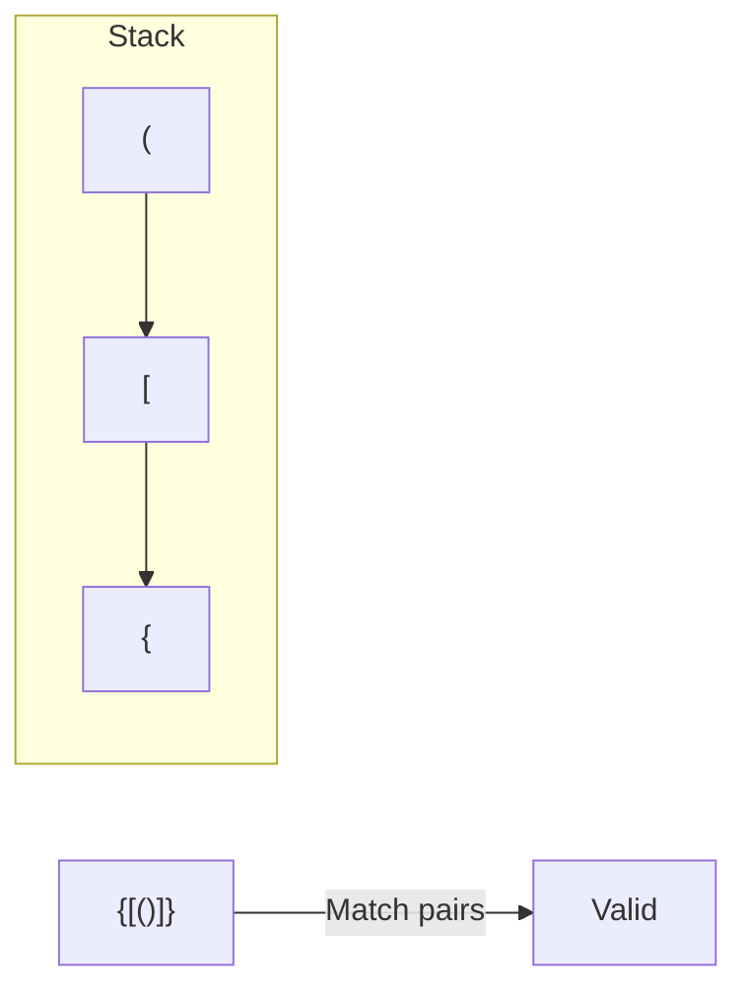

# Decode String

> **LeetCode 394** | Difficulty: Medium | Pattern: Stack Recursion

---

## Problem Statement

Given an encoded string, return its decoded string.

The encoding rule is: `k[encoded_string]`, where the `encoded_string` inside the square brackets is being repeated exactly `k` times. Note that `k` is guaranteed to be a positive integer.

You may assume that the input string is always valid; no extra white spaces, square brackets are well-formed, etc. Furthermore, you may assume that the original data does not contain any digits and that digits are only for those repeat numbers, `k`. For example, there will not be input like `3a` or `2[4]`.

The test cases are generated so that the length of the output will never exceed `10^5`.

### Examples

**Example 1:**
```
Input: s = "3[a]2[bc]"
Output: "aaabcbc"
```

**Example 2:**
```
Input: s = "3[a2[c]]"
Output: "accaccacc"
```

**Example 3:**
```
Input: s = "2[abc]3[cd]ef"
Output: "abcabccdcdcdef"
```

### Constraints

- `1 <= s.length <= 30`
- `s` consists of lowercase English letters, digits, and square brackets `'[]'`
- `s` is guaranteed to be a valid input
- All the integers in `s` are in the range `[1, 300]`

---

## Intuition

When we see `[`, we need to remember our current state (string so far, multiplier) and start fresh. When we see `]`, we combine the inner result with the saved state.

**Key Insight**: This is similar to evaluating nested expressions. Use a stack to save context when entering nested brackets.

---

## Stack State Visualization



For `3[a2[c]]`:

```
Process '3':
  num = 3

Process '[':
  Push ("", 3) to stack
  Reset: current_str = "", num = 0
  Stack: [("", 3)]

Process 'a':
  current_str = "a"

Process '2':
  num = 2

Process '[':
  Push ("a", 2) to stack
  Reset: current_str = "", num = 0
  Stack: [("", 3), ("a", 2)]

Process 'c':
  current_str = "c"

Process ']':
  Pop (prev_str="a", k=2)
  current_str = "a" + "c"*2 = "acc"
  Stack: [("", 3)]

Process ']':
  Pop (prev_str="", k=3)
  current_str = "" + "acc"*3 = "accaccacc"
  Stack: []

Result: "accaccacc"
```

---

## Solution: Stack Approach

::: code-group

```python [Python]
def decodeString(s: str) -> str:
    """
    Decode encoded string using stack.

    Stack stores (previous_string, multiplier) when entering [
    On ], combine current string with saved context.

    Time: O(n * max_k) where max_k is maximum repeat count
    Space: O(n) for stack
    """
    stack = []
    current_str = ""
    num = 0

    for char in s:
        if char.isdigit():
            num = num * 10 + int(char)

        elif char == '[':
            # Save current state and start fresh
            stack.append((current_str, num))
            current_str = ""
            num = 0

        elif char == ']':
            # Pop saved state and combine
            prev_str, k = stack.pop()
            current_str = prev_str + current_str * k

        else:  # Letter
            current_str += char

    return current_str
```

```java [Java]
public String decodeString(String s) {
    Deque<String> strStack = new ArrayDeque<>();
    Deque<Integer> numStack = new ArrayDeque<>();
    StringBuilder current = new StringBuilder();
    int num = 0;

    for (char c : s.toCharArray()) {
        if (Character.isDigit(c)) {
            num = num * 10 + (c - '0');
        } else if (c == '[') {
            strStack.push(current.toString());
            numStack.push(num);
            current = new StringBuilder();
            num = 0;
        } else if (c == ']') {
            int k = numStack.pop();
            String prev = strStack.pop();
            String repeated = current.toString().repeat(k);
            current = new StringBuilder(prev + repeated);
        } else {
            current.append(c);
        }
    }

    return current.toString();
}
```

:::

::: info Complexity: Time O(maxK * n) · Space O(n)
- **Time:** Output length dominates; each character in final output created once. For input like "300[a]", output is 300 chars
- **Space:** Stack depth equals max bracket nesting level; worst case O(n) for deeply nested input
:::

---

## Solution: Recursive Approach

```python
def decodeString(s: str) -> str:
    """
    Recursive solution using index tracking.

    Time: O(n * max_k)
    Space: O(n) for recursion depth
    """
    def decode(s: str, i: int) -> tuple[str, int]:
        """Returns (decoded_string, next_index)"""
        result = ""
        num = 0

        while i < len(s):
            char = s[i]

            if char.isdigit():
                num = num * 10 + int(char)

            elif char == '[':
                # Recursively decode inner string
                inner_str, i = decode(s, i + 1)
                result += inner_str * num
                num = 0

            elif char == ']':
                # Return to caller
                return result, i

            else:  # Letter
                result += char

            i += 1

        return result, i

    return decode(s, 0)[0]
```

::: info Complexity: Time O(maxK * n) · Space O(n)
- **Time:** Same as iterative; recursion processes each character once, output creation is the bottleneck
- **Space:** Recursion call stack depth equals bracket nesting level; each frame stores local result string
:::

---

## Solution: Two Stacks (More Explicit)

```python
def decodeString(s: str) -> str:
    """
    Use two stacks: one for strings, one for numbers.

    More explicit than single stack with tuples.
    """
    str_stack = []
    num_stack = []
    current_str = ""
    num = 0

    for char in s:
        if char.isdigit():
            num = num * 10 + int(char)

        elif char == '[':
            str_stack.append(current_str)
            num_stack.append(num)
            current_str = ""
            num = 0

        elif char == ']':
            prev_str = str_stack.pop()
            k = num_stack.pop()
            current_str = prev_str + current_str * k

        else:
            current_str += char

    return current_str
```

::: info Complexity: Time O(maxK * n) · Space O(n)
- **Time:** Same complexity; two stacks vs one tuple-stack is stylistic, not algorithmic difference
- **Space:** Two stacks together hold same data as single stack with tuples; total space unchanged
:::

---

## Step-by-Step Walkthrough

For `2[abc]3[cd]ef`:

```
Initial: current_str = "", num = 0, stack = []

char = '2':
  num = 2

char = '[':
  Push ("", 2)
  current_str = "", num = 0
  stack = [("", 2)]

char = 'a': current_str = "a"
char = 'b': current_str = "ab"
char = 'c': current_str = "abc"

char = ']':
  Pop ("", 2)
  current_str = "" + "abc"*2 = "abcabc"
  stack = []

char = '3':
  num = 3

char = '[':
  Push ("abcabc", 3)
  current_str = "", num = 0
  stack = [("abcabc", 3)]

char = 'c': current_str = "c"
char = 'd': current_str = "cd"

char = ']':
  Pop ("abcabc", 3)
  current_str = "abcabc" + "cd"*3 = "abcabccdcdcd"
  stack = []

char = 'e': current_str = "abcabccdcdcde"
char = 'f': current_str = "abcabccdcdcdef"

Result: "abcabccdcdcdef"
```

---

## Complexity Analysis

| Aspect | Complexity | Explanation |
|--------|------------|-------------|
| **Time** | O(sum of k_i * n_i) | Each character in output is created once |
| **Space** | O(n) | Stack depth = nesting level |

### Time Complexity Details

- Let `S` be the length of the decoded string
- We create each character in `S` exactly once
- Time is O(S), but S can be much larger than input

For `300[a]`, input is 6 characters, output is 300 characters.

---

## Edge Cases

```python
def test_decode_string():
    # No encoding
    assert decodeString("abc") == "abc"

    # Simple encoding
    assert decodeString("3[a]") == "aaa"

    # Multiple groups
    assert decodeString("2[a]3[b]") == "aabbb"

    # Nested encoding
    assert decodeString("2[a2[b]]") == "abbabb"

    # Multi-digit numbers
    assert decodeString("10[a]") == "aaaaaaaaaa"

    # Deep nesting
    assert decodeString("2[2[2[a]]]") == "aaaaaaaa"

    # Letters between groups
    assert decodeString("2[a]b3[c]") == "aabccc"
```

---

## Common Mistakes

1. **Forgetting multi-digit numbers**
   ```python
   # Wrong: num = int(char)
   # Correct: num = num * 10 + int(char)
   ```

2. **Not resetting state on '['**
   ```python
   # Must reset both current_str and num
   current_str = ""
   num = 0
   ```

3. **String concatenation inefficiency**
   ```python
   # For very long strings, use list and join
   chars = []
   chars.append(char)
   return ''.join(chars)
   ```

---

## Optimized for Long Strings

```python
def decodeString(s: str) -> str:
    """
    Optimized version using list for string building.
    Avoids O(n^2) string concatenation.
    """
    stack = []
    current = []  # List of characters
    num = 0

    for char in s:
        if char.isdigit():
            num = num * 10 + int(char)
        elif char == '[':
            stack.append((''.join(current), num))
            current = []
            num = 0
        elif char == ']':
            prev_str, k = stack.pop()
            current_str = ''.join(current)
            current = list(prev_str + current_str * k)
        else:
            current.append(char)

    return ''.join(current)
```

::: info Complexity: Time O(maxK * n) · Space O(n)
- **Time:** List append is O(1) amortized; avoids O(n^2) string concatenation overhead of naive approach
- **Space:** Same O(n) stack depth; list-based string building uses similar memory to direct concatenation
:::

---

## Interview Tips

### What Interviewers Look For

1. **Stack for Nesting**: Recognize the pattern of saving/restoring state
2. **Edge Cases**: Multi-digit numbers, deep nesting, letters outside brackets
3. **Clean Code**: Clear variable names, well-structured logic

### Common Follow-up Questions

1. **"How would you handle invalid input?"**
   ```python
   def decodeString(s: str) -> str:
       # Validate before processing
       bracket_count = 0
       for char in s:
           if char == '[':
               bracket_count += 1
           elif char == ']':
               bracket_count -= 1
               if bracket_count < 0:
                   raise ValueError("Unbalanced brackets")
       if bracket_count != 0:
           raise ValueError("Unbalanced brackets")
       # ... proceed with decoding
   ```

2. **"What if k could be 0?"**
   - `0[abc]` should produce empty string
   - Our solution handles this correctly

3. **"Can you solve it iteratively without a stack?"**
   - Find innermost brackets, decode, replace, repeat
   - Less efficient but possible

4. **"How would you encode a string?"**
   ```python
   def encodeString(s: str) -> str:
       # Find repeated patterns and encode them
       # This is much harder - requires pattern matching
       pass
   ```

---

## Similar Pattern Problems

| Problem | What to Save on Stack |
|---------|----------------------|
| **Decode String** | (previous string, multiplier) |
| **Basic Calculator** | (previous result, sign) |
| **Nested List Weight Sum** | (current depth) |
| **Number of Atoms** | (previous count map) |

---

## Related Problems

::: details Number of Atoms (LeetCode 726)
**Problem:** Parse chemical formula like "K4(ON(SO3)2)2" and return atom counts sorted alphabetically.

**Key Insight:** Similar nested structure. Stack stores count maps. On ')', multiply inner counts and merge with outer.



**Approach:** Stack stores dictionaries. Parse element names and numbers. On ')', pop and multiply counts.

**Complexity:** O(n^2) worst case for string operations, O(n) space
:::

::: details Brace Expansion (LeetCode 1087)
**Problem:** Given string like "{a,b}c{d,e}f", generate all possible strings in sorted order.

**Key Insight:** Backtracking or iterative expansion. Track options at each position.



**Approach:** Parse groups and literals. Use backtracking or BFS to generate all combinations.

**Complexity:** O(n * k^m) where k = max options per group, m = number of groups
:::

::: details Flatten Nested List Iterator (LeetCode 341)
**Problem:** Implement iterator over nested list structure supporting hasNext() and next().

**Key Insight:** Use stack to track position in nested structure. On hasNext(), flatten until integer found.



**Approach:** Stack stores iterators. Flatten lazily - only process when hasNext() called.

**Complexity:** O(1) amortized per operation, O(d) space for depth d
:::

::: details Valid Parentheses (LeetCode 20)
**Problem:** Check if string with '()', '{}', '[]' has balanced and properly nested brackets.

**Key Insight:** Stack matches closing brackets with most recent opening bracket (LIFO property).



**Approach:** Push opening brackets, pop and verify match on closing brackets. Valid if stack empty at end.

**Complexity:** O(n) time, O(n) space
:::

---

## References

- [LeetCode 394 - Decode String](https://leetcode.com/problems/decode-string/)
- [NeetCode Solution](https://neetcode.io/solutions/decode-string)
- [Stack for Nested Structures](https://leetcode.com/discuss/study-guide/1688903/Solved-all-Decode-String-problems)
