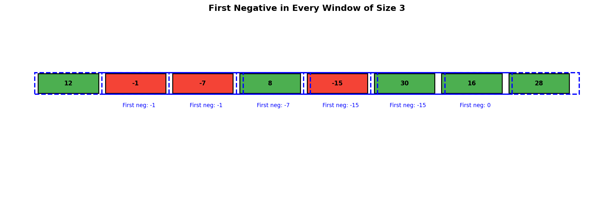
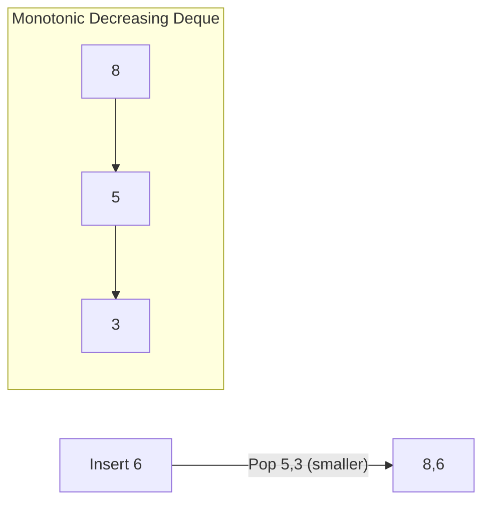
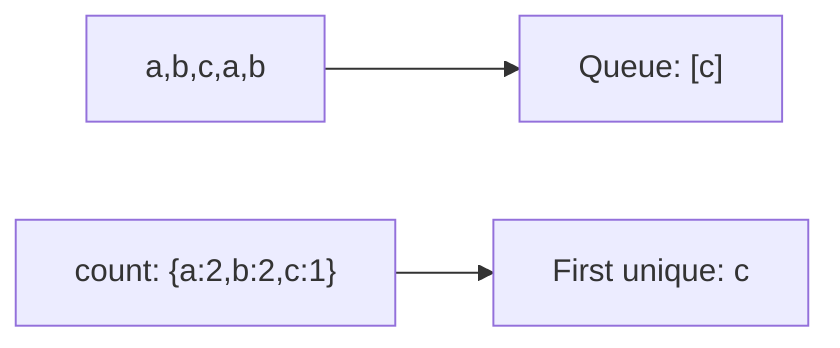
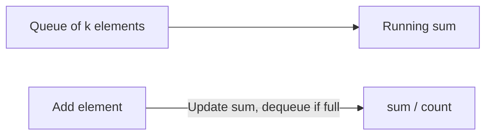
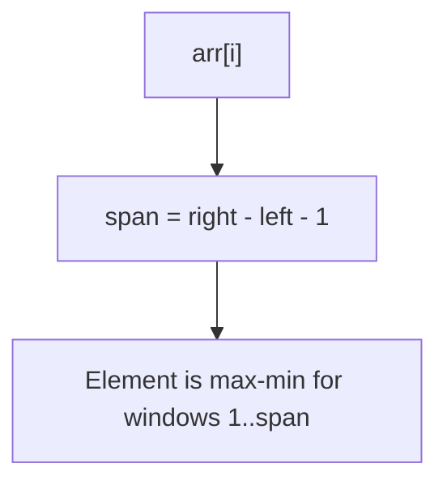

# First Negative in Every Window of Size K

> **GeeksforGeeks** | Difficulty: Medium | Pattern: Queue / Deque

---

## Problem Statement

Given an array `arr[]` of size `N` and a positive integer `k`, find the first negative integer for each and every window (contiguous subarray) of size `k`.

If a window does not contain a negative integer, output `0` for that window.

### Examples

**Example 1:**
```
Input: arr = [12, -1, -7, 8, -15, 30, 16, 28], k = 3
Output: [-1, -1, -7, -15, -15, 0]

Window [12, -1, -7]:    First negative = -1
Window [-1, -7, 8]:     First negative = -1
Window [-7, 8, -15]:    First negative = -7
Window [8, -15, 30]:    First negative = -15
Window [-15, 30, 16]:   First negative = -15
Window [30, 16, 28]:    No negative, output 0
```

**Example 2:**
```
Input: arr = [1, 2, 3, 4, 5], k = 2
Output: [0, 0, 0, 0]

No negative numbers, all windows output 0
```

### Constraints

- `1 <= N <= 10^5`
- `1 <= k <= N`
- `-10^5 <= arr[i] <= 10^5`

---

## Intuition

We need to track negative numbers in each window. A deque (double-ended queue) is perfect for this:
- Add new negative indices to the back
- Remove indices that fall outside the window from the front
- The front of the deque is always the first negative in the current window

**Key Insight**: Only store indices of negative numbers. If deque is empty for a window, output 0.

---

## Visualization



For `arr = [12, -1, -7, 8, -15, 30, 16, 28]`, k = 3:

```
Window [12, -1, -7] (indices 0-2):
  Deque: [1, 2]  (indices of -1, -7)
  First negative at index 1: -1

Window [-1, -7, 8] (indices 1-3):
  Deque: [1, 2]
  First negative at index 1: -1

Window [-7, 8, -15] (indices 2-4):
  Index 1 out of window, popleft
  Deque: [2, 4]
  First negative at index 2: -7

Window [8, -15, 30] (indices 3-5):
  Index 2 out of window, popleft
  Deque: [4]
  First negative at index 4: -15

Window [-15, 30, 16] (indices 4-6):
  Deque: [4]
  First negative at index 4: -15

Window [30, 16, 28] (indices 5-7):
  Index 4 out of window, popleft
  Deque: []
  No negative, output 0
```

---

## Solution

```python
from collections import deque

def firstNegative(arr: list[int], k: int) -> list[int]:
    """
    Find first negative integer in each window of size k.

    Uses deque to track indices of negative numbers.

    Time: O(n) - each element added/removed at most once
    Space: O(k) - deque stores at most k indices
    """
    n = len(arr)
    result = []
    dq = deque()  # Stores indices of negative numbers

    # Process first window
    for i in range(k):
        if arr[i] < 0:
            dq.append(i)

    # First window result
    result.append(arr[dq[0]] if dq else 0)

    # Process remaining windows
    for i in range(k, n):
        # Remove index outside window
        while dq and dq[0] <= i - k:
            dq.popleft()

        # Add current index if negative
        if arr[i] < 0:
            dq.append(i)

        # Append first negative (or 0)
        result.append(arr[dq[0]] if dq else 0)

    return result
```

::: info Complexity: Time O(n) · Space O(k)
- **Time:** Each element added to deque at most once and removed at most once; total operations = 2n = O(n)
- **Space:** Deque stores only indices of negative numbers within current window, at most k indices
:::

---

## Alternative: Simplified Version

```python
from collections import deque

def firstNegative(arr: list[int], k: int) -> list[int]:
    """
    Simplified version with unified loop.
    """
    n = len(arr)
    result = []
    dq = deque()

    for i in range(n):
        # Add current if negative
        if arr[i] < 0:
            dq.append(i)

        # Process window once we have k elements
        if i >= k - 1:
            # Remove elements outside window
            while dq and dq[0] < i - k + 1:
                dq.popleft()

            # First negative or 0
            result.append(arr[dq[0]] if dq else 0)

    return result
```

::: info Complexity: Time O(n) · Space O(k)
- **Time:** Unified loop processes each element once; same O(n) amortized as two-phase version
- **Space:** Deque bounded by window size k; stores at most k negative indices
:::

---

## Step-by-Step Walkthrough

For `arr = [12, -1, -7, 8, -15, 30]`, k = 3:

```
Initial: dq = [], result = []

i=0, arr[0]=12:
  12 >= 0, don't add to dq
  i < k-1, no result yet

i=1, arr[1]=-1:
  -1 < 0, add 1 to dq
  dq = [1]
  i < k-1, no result yet

i=2, arr[2]=-7:
  -7 < 0, add 2 to dq
  dq = [1, 2]
  i >= k-1, window ready
  First negative at index 1: -1
  result = [-1]

i=3, arr[3]=8:
  8 >= 0, don't add
  dq = [1, 2]
  Check window [1, 3]: index 1 in window
  First negative at index 1: -1
  result = [-1, -1]

i=4, arr[4]=-15:
  -15 < 0, add 4 to dq
  dq = [1, 2, 4]
  Check window [2, 4]:
    - index 1 < 2, popleft -> dq = [2, 4]
  First negative at index 2: -7
  result = [-1, -1, -7]

i=5, arr[5]=30:
  30 >= 0, don't add
  dq = [2, 4]
  Check window [3, 5]:
    - index 2 < 3, popleft -> dq = [4]
  First negative at index 4: -15
  result = [-1, -1, -7, -15]

Final result = [-1, -1, -7, -15]
```

---

## Complexity Analysis

| Aspect | Complexity | Explanation |
|--------|------------|-------------|
| **Time** | O(n) | Each element added/removed at most once |
| **Space** | O(k) | Deque holds at most k elements |

---

## Edge Cases

```python
def test_first_negative():
    # All positive
    assert firstNegative([1, 2, 3, 4], 2) == [0, 0, 0]

    # All negative
    assert firstNegative([-1, -2, -3, -4], 2) == [-1, -2, -3]

    # Single element windows
    assert firstNegative([1, -2, 3, -4], 1) == [0, -2, 0, -4]

    # Window size equals array length
    assert firstNegative([1, 2, -3, 4], 4) == [-3]

    # Negative at start
    assert firstNegative([-1, 2, 3, 4, 5], 3) == [-1, 0, 0]

    # Negative at end
    assert firstNegative([1, 2, 3, 4, -5], 3) == [0, 0, -5]
```

---

## Variations

### 1. Last Negative in Every Window

```python
def lastNegative(arr: list[int], k: int) -> list[int]:
    """Last negative in each window."""
    n = len(arr)
    result = []
    dq = deque()

    for i in range(n):
        if arr[i] < 0:
            dq.append(i)

        if i >= k - 1:
            while dq and dq[0] < i - k + 1:
                dq.popleft()

            # Return last in deque (not first)
            result.append(arr[dq[-1]] if dq else 0)

    return result
```

::: info Complexity: Time O(n) · Space O(k)
- **Time:** Same O(n) pattern; accessing dq[-1] instead of dq[0] is still O(1)
- **Space:** Deque stores same indices; accessing from back does not change space usage
:::

### 2. Count of Negatives in Every Window

```python
def countNegatives(arr: list[int], k: int) -> list[int]:
    """Count negatives in each window."""
    n = len(arr)
    result = []
    count = 0

    # Count in first window
    for i in range(k):
        if arr[i] < 0:
            count += 1
    result.append(count)

    # Slide window
    for i in range(k, n):
        # Add new element
        if arr[i] < 0:
            count += 1
        # Remove old element
        if arr[i - k] < 0:
            count -= 1
        result.append(count)

    return result
```

::: info Complexity: Time O(n) · Space O(1)
- **Time:** Single pass with O(1) operations per element (increment/decrement count)
- **Space:** Only maintains count variable and result array; no deque needed for counting
:::

### 3. First Positive in Every Window

```python
def firstPositive(arr: list[int], k: int) -> list[int]:
    """First positive in each window."""
    n = len(arr)
    result = []
    dq = deque()

    for i in range(n):
        if arr[i] > 0:  # Changed condition
            dq.append(i)

        if i >= k - 1:
            while dq and dq[0] < i - k + 1:
                dq.popleft()
            result.append(arr[dq[0]] if dq else 0)

    return result
```

::: info Complexity: Time O(n) · Space O(k)
- **Time:** Identical to first negative; only condition (arr[i] > 0) changes, not algorithm structure
- **Space:** Deque stores positive indices instead of negative; same k-bounded space
:::

---

## Comparison with Sliding Window Maximum

| Aspect | First Negative | Sliding Window Maximum |
|--------|----------------|----------------------|
| **Store in Deque** | Indices of negatives only | All indices (decreasing order) |
| **Deque Order** | Any order (just track presence) | Monotonic decreasing |
| **Remove from Back** | No | Yes (smaller elements) |
| **Empty Deque Result** | 0 | N/A (always has max) |

---

## Interview Tips

### What Interviewers Look For

1. **Deque Usage**: Know when deque is appropriate
2. **Window Tracking**: Properly slide the window
3. **Edge Cases**: All positive, all negative, single element

### Common Follow-up Questions

1. **"What if we need all negatives in the window?"**
   - Return the deque contents for each window

2. **"How would you handle streaming data?"**
   ```python
   class NegativeTracker:
       def __init__(self, k):
           self.k = k
           self.window = deque()
           self.negatives = deque()
           self.current_start = 0

       def add(self, num):
           self.window.append(num)
           if num < 0:
               self.negatives.append(len(self.window) - 1)

           if len(self.window) > self.k:
               if self.negatives and self.negatives[0] == self.current_start:
                   self.negatives.popleft()
               self.window.popleft()
               self.current_start += 1

       def getFirstNegative(self):
           if len(self.window) < self.k:
               return None
           return self.window[self.negatives[0] - self.current_start] if self.negatives else 0
   ```

3. **"What about finding the first number divisible by x?"**
   - Same pattern, change the condition

---

## Related Problems

::: details Sliding Window Maximum (LeetCode 239)
**Problem:** Return maximum element in each sliding window of size k.

**Key Insight:** Monotonic decreasing deque. Front is always max. Remove smaller elements on insert.



**Approach:** Deque stores indices. Popleft if outside window. Pop smaller elements before push.

**Complexity:** O(n) time, O(k) space
:::

::: details First Unique Character in Stream
**Problem:** Return first non-repeating character in stream at each point.

**Key Insight:** Queue of candidates + hashmap of counts. Dequeue from front until unique found.



**Approach:** Queue stores order, hashmap tracks counts. Pop from front while count > 1.

**Complexity:** O(1) amortized per character
:::

::: details Moving Average from Data Stream (LeetCode 346)
**Problem:** Calculate moving average of last k elements in stream.

**Key Insight:** Simpler than first negative - just track sum and queue of k elements.



**Approach:** Queue maintains window. Track running sum. Average = sum / min(count, k).

**Complexity:** O(1) per call
:::

::: details Maximum of Minimum for Every Window Size
**Problem:** For each window size 1 to n, find maximum of all window minimums.

**Key Insight:** For each element, find window sizes where it's the minimum (using prev/next smaller).



**Approach:** Find left/right boundaries (smaller elements). Fill result array for those window sizes.

**Complexity:** O(n) time, O(n) space
:::

---

## References

- [GeeksforGeeks - First Negative in Every Window](https://www.geeksforgeeks.org/first-negative-integer-every-window-size-k/)
- [Sliding Window Technique](https://www.geeksforgeeks.org/window-sliding-technique/)
- [Deque in Python](https://docs.python.org/3/library/collections.html#collections.deque)
