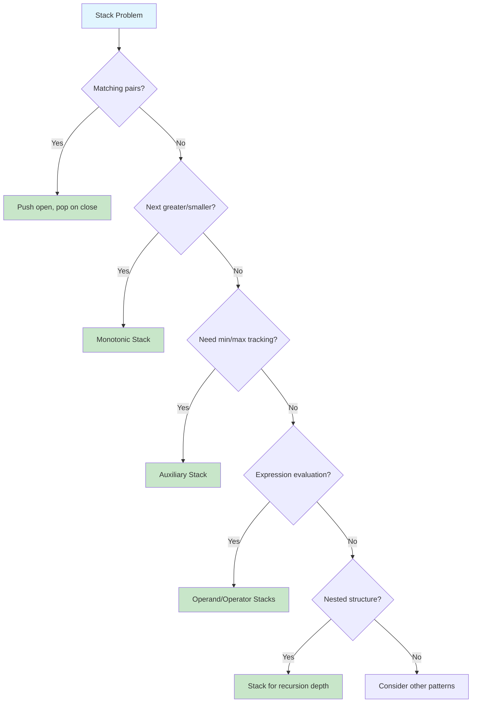

# Stacks & Queues

> **LIFO and FIFO data structures for order-sensitive operations**

---

## Overview

**Stacks** and **Queues** are fundamental linear data structures that manage elements based on their insertion order. While conceptually simple, they form the backbone of many complex algorithms and are frequently tested in Google SDE interviews.

### Stack (LIFO - Last In, First Out)

A **stack** operates like a stack of plates - you can only add or remove from the top. The last element added is the first one removed.

```
Push 1, 2, 3:          Pop:
    +---+             +---+
    | 3 | <- TOP      | 2 | <- TOP (3 removed)
    +---+             +---+
    | 2 |             | 1 |
    +---+             +---+
    | 1 |
    +---+
```

**Key Operations:**
- `push(x)` - Add element to top (O(1))
- `pop()` - Remove and return top element (O(1))
- `peek()/top()` - View top element without removing (O(1))
- `isEmpty()` - Check if stack is empty (O(1))

### Queue (FIFO - First In, First Out)

A **queue** operates like a line at a store - elements are added at the rear and removed from the front.

```
Enqueue 1, 2, 3:              Dequeue:
FRONT                 REAR    FRONT                 REAR
  +---+---+---+                 +---+---+
  | 1 | 2 | 3 |    ->           | 2 | 3 |  (1 removed)
  +---+---+---+                 +---+---+
```

**Key Operations:**
- `enqueue(x)` - Add element to rear (O(1))
- `dequeue()` - Remove and return front element (O(1))
- `peek()/front()` - View front element without removing (O(1))
- `isEmpty()` - Check if queue is empty (O(1))

### When to Use Each

| Use Case | Stack | Queue |
|----------|-------|-------|
| Undo operations | Yes | - |
| Expression parsing | Yes | - |
| DFS traversal | Yes | - |
| BFS traversal | - | Yes |
| Task scheduling | - | Yes |
| Print queue | - | Yes |
| Backtracking | Yes | - |
| Level-order traversal | - | Yes |
| Next greater element | Yes | - |
| Sliding window problems | - | Yes (Deque) |

---

## Document Structure

| Problem | Difficulty | Pattern | Link |
|---------|------------|---------|------|
| Valid Parentheses | Easy | Matching Pairs | [Link](./valid-parentheses) |
| Implement Queue using Stacks | Easy | Stack Simulation | [Link](./queue-using-stacks) |
| Implement Stack using Queues | Easy | Queue Simulation | [Link](./stack-using-queues) |
| Min Stack | Medium | Auxiliary Stack | [Link](./min-stack) |
| Next Greater Element I | Easy | Monotonic Stack | [Link](./next-greater-element) |
| Daily Temperatures | Medium | Monotonic Stack | [Link](./daily-temperatures) |
| Evaluate Reverse Polish Notation | Medium | Stack Evaluation | [Link](./reverse-polish-notation) |
| Basic Calculator | Hard | Stack + Parsing | [Link](./basic-calculator) |
| Basic Calculator II | Medium | Stack + Parsing | [Link](./basic-calculator-ii) |
| Decode String | Medium | Stack Recursion | [Link](./decode-string) |
| Largest Rectangle in Histogram | Hard | Monotonic Stack | [Link](./largest-rectangle-histogram) |
| Trapping Rain Water | Hard | Monotonic Stack / Two Pointer | [Link](./trapping-rain-water) |
| Sliding Window Maximum | Hard | Monotonic Deque | [Link](./sliding-window-maximum) |
| Remove K Digits | Medium | Monotonic Stack | [Link](./remove-k-digits) |
| Simplify Path | Medium | Stack Processing | [Link](./simplify-path) |
| Asteroid Collision | Medium | Stack Simulation | [Link](./asteroid-collision) |
| Task Scheduler | Medium | Queue + Greedy | [Link](./task-scheduler) |
| First Negative in Every Window | Medium | Queue | [Link](./first-negative-window) |
| Rotting Oranges | Medium | BFS Queue | [Link](./rotting-oranges) |
| Stock Span Problem | Medium | Monotonic Stack | [Link](./stock-span) |

---

## Stack vs Queue

| Aspect | Stack | Queue |
|--------|-------|-------|
| **Order** | LIFO (Last In, First Out) | FIFO (First In, First Out) |
| **Add Operation** | push() - add to top | enqueue() - add to rear |
| **Remove Operation** | pop() - remove from top | dequeue() - remove from front |
| **Python Implementation** | `list.append()` / `list.pop()` | `collections.deque` |
| **Access Pattern** | One end only | Two ends (front and rear) |
| **Use Cases** | Undo, parsing, DFS, backtracking | BFS, scheduling, buffering |
| **Memory** | Typically contiguous | Can be linked or array-based |
| **Visualization** | Vertical stack of plates | Horizontal line of people |

---

## Python Implementation

### Stack Using List

```python
# Stack implementation using Python list
stack = []

# Push - O(1) amortized
stack.append(1)
stack.append(2)
stack.append(3)

# Pop - O(1)
top = stack.pop()      # Returns 3, stack = [1, 2]

# Peek - O(1)
top = stack[-1]        # Returns 2 (doesn't remove)

# Check empty - O(1)
is_empty = len(stack) == 0

# Size - O(1)
size = len(stack)
```

### Queue Using Deque

```python
from collections import deque

# Queue implementation using deque (double-ended queue)
queue = deque()

# Enqueue - O(1)
queue.append(1)        # Add to rear
queue.append(2)
queue.append(3)

# Dequeue - O(1)
front = queue.popleft()  # Returns 1, queue = deque([2, 3])

# Peek front - O(1)
front = queue[0]       # Returns 2 (doesn't remove)

# Peek rear - O(1)
rear = queue[-1]       # Returns 3

# Check empty - O(1)
is_empty = len(queue) == 0

# Size - O(1)
size = len(queue)
```

### Why Not Use List for Queue?

```python
# DON'T DO THIS - O(n) dequeue operation!
queue = []
queue.append(1)
queue.append(2)
queue.pop(0)  # O(n) - shifts all elements!

# USE deque instead - O(1) for both ends
from collections import deque
queue = deque()
queue.append(1)
queue.popleft()  # O(1)
```

### Deque as Double-Ended Structure

```python
from collections import deque

d = deque()

# Add to either end - O(1)
d.append(1)       # Add to right: [1]
d.appendleft(0)   # Add to left: [0, 1]
d.append(2)       # [0, 1, 2]

# Remove from either end - O(1)
d.pop()           # Remove from right: [0, 1]
d.popleft()       # Remove from left: [1]

# Useful for sliding window problems
d.extend([2, 3, 4])     # Add multiple to right
d.extendleft([0, -1])   # Add multiple to left (reversed)
```

---

## Common Stack Patterns

### Pattern Selection Flowchart



### Pattern 1: Matching Pairs (Parentheses)

```python
def is_valid_parentheses(s: str) -> bool:
    """Check if parentheses are balanced."""
    stack = []
    mapping = {')': '(', '}': '{', ']': '['}

    for char in s:
        if char in mapping:  # Closing bracket
            if not stack or stack[-1] != mapping[char]:
                return False
            stack.pop()
        else:  # Opening bracket
            stack.append(char)

    return len(stack) == 0

# Example: "({[]})" -> True, "([)]" -> False
```

### Pattern 2: Monotonic Stack Template

```python
def next_greater_element(nums: list) -> list:
    """Find the next greater element for each element in the array.

    Monotonic Decreasing Stack: Elements in stack are in decreasing order
    from bottom to top. When we find a larger element, pop smaller ones.
    """
    n = len(nums)
    result = [-1] * n  # Default: no greater element found
    stack = []         # Stores indices, not values

    for i in range(n):
        # While current element is greater than stack top
        while stack and nums[stack[-1]] < nums[i]:
            idx = stack.pop()
            result[idx] = nums[i]  # nums[i] is next greater for nums[idx]
        stack.append(i)

    return result

# Example: [2, 1, 2, 4, 3] -> [4, 2, 4, -1, -1]
```

### Pattern 3: Auxiliary Stack (Min Stack)

```python
class MinStack:
    """Stack that supports O(1) retrieval of minimum element."""

    def __init__(self):
        self.stack = []
        self.min_stack = []  # Tracks minimum at each level

    def push(self, val: int) -> None:
        self.stack.append(val)
        # Push to min_stack if empty or val <= current min
        if not self.min_stack or val <= self.min_stack[-1]:
            self.min_stack.append(val)

    def pop(self) -> None:
        if self.stack.pop() == self.min_stack[-1]:
            self.min_stack.pop()

    def top(self) -> int:
        return self.stack[-1]

    def getMin(self) -> int:
        return self.min_stack[-1]
```

### Pattern 4: Expression Evaluation

```python
def eval_rpn(tokens: list) -> int:
    """Evaluate Reverse Polish Notation expression.

    Push numbers to stack, apply operators to top two elements.
    """
    stack = []
    operators = {
        '+': lambda a, b: a + b,
        '-': lambda a, b: a - b,
        '*': lambda a, b: a * b,
        '/': lambda a, b: int(a / b)  # Truncate toward zero
    }

    for token in tokens:
        if token in operators:
            b = stack.pop()  # Second operand (popped first)
            a = stack.pop()  # First operand
            stack.append(operators[token](a, b))
        else:
            stack.append(int(token))

    return stack[0]

# Example: ["2", "1", "+", "3", "*"] -> (2 + 1) * 3 = 9
```

---

## Common Queue Patterns

### Pattern 1: BFS Template (Level Order)

```python
from collections import deque

def bfs_template(root):
    """BFS using queue - useful for shortest path, level-order traversal."""
    if not root:
        return []

    queue = deque([root])
    result = []

    while queue:
        level_size = len(queue)
        level = []

        for _ in range(level_size):
            node = queue.popleft()
            level.append(node.val)

            if node.left:
                queue.append(node.left)
            if node.right:
                queue.append(node.right)

        result.append(level)

    return result
```

### Pattern 2: Monotonic Deque (Sliding Window Maximum)

```python
from collections import deque

def max_sliding_window(nums: list, k: int) -> list:
    """Find maximum in each sliding window of size k.

    Monotonic Decreasing Deque: Front always has the maximum.
    """
    result = []
    dq = deque()  # Stores indices

    for i, num in enumerate(nums):
        # Remove elements outside the window
        while dq and dq[0] <= i - k:
            dq.popleft()

        # Remove smaller elements (they can never be max)
        while dq and nums[dq[-1]] < num:
            dq.pop()

        dq.append(i)

        # Add to result once we have a full window
        if i >= k - 1:
            result.append(nums[dq[0]])

    return result

# Example: nums = [1,3,-1,-3,5,3,6,7], k = 3
# Output: [3, 3, 5, 5, 6, 7]
```

### Pattern 3: Multi-Source BFS

```python
from collections import deque

def oranges_rotting(grid: list) -> int:
    """Multi-source BFS - all rotten oranges spread simultaneously."""
    rows, cols = len(grid), len(grid[0])
    queue = deque()
    fresh = 0

    # Find all rotten oranges and count fresh
    for r in range(rows):
        for c in range(cols):
            if grid[r][c] == 2:
                queue.append((r, c, 0))  # (row, col, time)
            elif grid[r][c] == 1:
                fresh += 1

    directions = [(0, 1), (0, -1), (1, 0), (-1, 0)]
    max_time = 0

    while queue:
        r, c, time = queue.popleft()
        max_time = max(max_time, time)

        for dr, dc in directions:
            nr, nc = r + dr, c + dc
            if 0 <= nr < rows and 0 <= nc < cols and grid[nr][nc] == 1:
                grid[nr][nc] = 2  # Mark as rotten
                fresh -= 1
                queue.append((nr, nc, time + 1))

    return max_time if fresh == 0 else -1
```

---

## Monotonic Stack Deep Dive

### What is a Monotonic Stack?

A **monotonic stack** is a stack that maintains elements in either strictly increasing or decreasing order. When a new element violates this property, we pop elements until the property is restored.

### Types of Monotonic Stacks

| Type | Order | Use Case | Example Problem |
|------|-------|----------|-----------------|
| **Monotonic Decreasing** | Top is smallest | Next Greater Element | Daily Temperatures |
| **Monotonic Increasing** | Top is largest | Next Smaller Element | Largest Rectangle |

### Monotonic Stack Patterns

```python
# Pattern: Next Greater Element (Decreasing Stack)
def next_greater(nums):
    """Stack stores indices in decreasing order of their values."""
    result = [-1] * len(nums)
    stack = []  # Decreasing stack

    for i, num in enumerate(nums):
        while stack and nums[stack[-1]] < num:
            idx = stack.pop()
            result[idx] = num
        stack.append(i)

    return result

# Pattern: Next Smaller Element (Increasing Stack)
def next_smaller(nums):
    """Stack stores indices in increasing order of their values."""
    result = [-1] * len(nums)
    stack = []  # Increasing stack

    for i, num in enumerate(nums):
        while stack and nums[stack[-1]] > num:
            idx = stack.pop()
            result[idx] = num
        stack.append(i)

    return result

# Pattern: Previous Greater Element
def previous_greater(nums):
    """Process left to right, check stack before pushing."""
    result = [-1] * len(nums)
    stack = []  # Decreasing stack

    for i, num in enumerate(nums):
        while stack and nums[stack[-1]] <= num:
            stack.pop()
        if stack:
            result[i] = nums[stack[-1]]
        stack.append(i)

    return result

# Pattern: Previous Smaller Element
def previous_smaller(nums):
    """Process left to right, check stack before pushing."""
    result = [-1] * len(nums)
    stack = []  # Increasing stack

    for i, num in enumerate(nums):
        while stack and nums[stack[-1]] >= num:
            stack.pop()
        if stack:
            result[i] = nums[stack[-1]]
        stack.append(i)

    return result
```

### Classic Monotonic Stack Problems

#### Largest Rectangle in Histogram

```python
def largest_rectangle_area(heights: list) -> int:
    """Find largest rectangle in histogram using monotonic increasing stack."""
    stack = []  # Stores indices
    max_area = 0
    heights.append(0)  # Sentinel to force final calculation

    for i, h in enumerate(heights):
        while stack and heights[stack[-1]] > h:
            height = heights[stack.pop()]
            width = i if not stack else i - stack[-1] - 1
            max_area = max(max_area, height * width)
        stack.append(i)

    heights.pop()  # Remove sentinel
    return max_area

# Example: [2, 1, 5, 6, 2, 3] -> 10 (rectangle of height 5, width 2)
```

#### Trapping Rain Water

```python
def trap(height: list) -> int:
    """Calculate trapped water using monotonic stack."""
    stack = []  # Stores indices
    water = 0

    for i, h in enumerate(height):
        while stack and height[stack[-1]] < h:
            bottom = height[stack.pop()]
            if not stack:
                break
            # Calculate trapped water
            width = i - stack[-1] - 1
            bounded_height = min(h, height[stack[-1]]) - bottom
            water += width * bounded_height
        stack.append(i)

    return water

# Example: [0,1,0,2,1,0,1,3,2,1,2,1] -> 6
```

---

## Operations Complexity

| Operation | Stack (list) | Queue (deque) | Notes |
|-----------|--------------|---------------|-------|
| Push/Enqueue | O(1)* | O(1) | *amortized for list |
| Pop/Dequeue | O(1) | O(1) | |
| Peek | O(1) | O(1) | |
| Search | O(n) | O(n) | Must traverse |
| Size | O(1) | O(1) | |
| isEmpty | O(1) | O(1) | |

### Space Complexity

| Structure | Implementation | Space |
|-----------|----------------|-------|
| Stack | Python list | O(n) |
| Queue | deque | O(n) |
| Min Stack | Two stacks | O(n) |
| Monotonic Stack | Single stack | O(n) worst case |

---

## Google Interview Focus

Based on recent Google SDE interview patterns (2025-2026), these stack and queue topics are most frequently tested:

### High Priority Topics

1. **Monotonic Stack** - Next greater/smaller element, largest rectangle, trapping rain water
2. **Expression Evaluation** - Calculator problems, parsing mathematical expressions
3. **Parentheses Matching** - Valid parentheses, longest valid parentheses, remove invalid
4. **Queue for BFS** - Level order traversal, shortest path, rotting oranges
5. **Stack for DFS** - Iterative DFS, tree traversals without recursion

### Common Google Stack/Queue Questions

| Question Type | Example Problem | Key Insight |
|--------------|-----------------|-------------|
| Parentheses | "Valid Parentheses" | Stack with matching pairs map |
| Expression | "Basic Calculator" | Stack for operands and operators |
| Monotonic | "Daily Temperatures" | Decreasing stack, process right to left |
| Rectangle | "Largest Rectangle in Histogram" | Increasing stack, calculate area on pop |
| BFS | "Rotting Oranges" | Multi-source BFS with queue |
| Sliding Window | "Sliding Window Maximum" | Monotonic deque maintains max |
| Design | "Min Stack" | Auxiliary stack tracks minimum |

### Recent Google Interview Examples

From 2025-2026 interview reports:
- **Calculator with Parentheses**: Parse and evaluate expressions with `+`, `-`, `*`, `/` and nested parentheses
- **Next Greater Element II**: Circular array variant, iterate twice
- **Remove K Digits**: Make smallest number by removing k digits using monotonic stack
- **Task Scheduler**: Queue with cooldown period tracking

### What Interviewers Look For

1. **Pattern Recognition**
   - Quickly identify if problem needs monotonic stack
   - Know when to use increasing vs decreasing stack
   - Recognize BFS vs DFS situations

2. **Edge Cases**
   - Empty input
   - Single element
   - All same elements
   - Descending/ascending order input

3. **Optimization Questions**
   - "Can you solve it in one pass?"
   - "Can you reduce space complexity?"
   - "What if the input is very large?"

4. **Follow-up Variations**
   - Circular arrays
   - Multiple queries
   - Online vs offline processing

---

## Practice Progression

### Week 1: Foundations

| Day | Focus | Problems |
|-----|-------|----------|
| 1 | Basic Stack | Valid Parentheses, Min Stack |
| 2 | Basic Queue | Implement Queue using Stacks, Implement Stack using Queues |
| 3 | BFS Applications | Binary Tree Level Order, Rotting Oranges |

### Week 2: Intermediate

| Day | Focus | Problems |
|-----|-------|----------|
| 4 | Monotonic Stack Intro | Next Greater Element I, Daily Temperatures |
| 5 | Expression Evaluation | Evaluate RPN, Basic Calculator II |
| 6 | Stack Applications | Decode String, Simplify Path |

### Week 3: Advanced

| Day | Focus | Problems |
|-----|-------|----------|
| 7 | Advanced Monotonic | Largest Rectangle in Histogram, Trapping Rain Water |
| 8 | Monotonic Deque | Sliding Window Maximum, Shortest Subarray with Sum >= K |
| 9 | Mixed Practice | Basic Calculator, Remove K Digits, Asteroid Collision |

---

## Quick Reference Card

### Pattern Recognition Triggers

| If you see... | Think about... |
|--------------|----------------|
| "Matching/balanced brackets" | Stack with matching pairs |
| "Next greater/smaller" | Monotonic Stack |
| "Expression evaluation" | Stack for operands/operators |
| "Sliding window max/min" | Monotonic Deque |
| "Shortest path unweighted" | BFS with Queue |
| "Level by level" | BFS with Queue |
| "Undo operation" | Stack |
| "Process in reverse order" | Stack |
| "FIFO processing" | Queue |
| "Track minimum/maximum" | Auxiliary Stack |

### Time Complexity Summary

```
Stack Operations:     O(1) for push, pop, peek
Queue Operations:     O(1) for enqueue, dequeue, peek
Monotonic Stack:      O(n) total - each element pushed/popped once
BFS Traversal:        O(V + E) for graphs
Sliding Window Max:   O(n) with monotonic deque
```

### Common Mistakes to Avoid

1. Using `list.pop(0)` for queue (O(n)) instead of `deque.popleft()` (O(1))
2. Forgetting to handle empty stack before `pop()` or `peek()`
3. Not clearing stack between test cases
4. Confusing increasing vs decreasing monotonic stack
5. Off-by-one errors in sliding window size

---

## Resources

### Recommended Practice

- [LeetCode Stack Problems](https://leetcode.com/tag/stack/)
- [LeetCode Queue Problems](https://leetcode.com/tag/queue/)
- [LeetCode Monotonic Stack](https://leetcode.com/problem-list/monotonic-stack/)
- [NeetCode Stack Playlist](https://neetcode.io/roadmap)

### Further Reading

- [GeeksforGeeks - Top 50 Stack Problems](https://www.geeksforgeeks.org/top-50-problems-on-stack-data-structure-asked-in-interviews/)
- [GeeksforGeeks - Top 50 Queue Problems](https://www.geeksforgeeks.org/top-50-problems-on-queue-data-structure-asked-in-sde-interviews/)
- [TakeUforward - Stack and Queue Interview Questions](https://takeuforward.org/stack-and-queue/top-stack-and-queue-interview-questions-structured-path-with-video-solutions)
- [LeetCode Monotonic Stack Guide](https://leetcode.com/discuss/study-guide/5148505/Monotonic-Stack-Guide-+-List-of-Problems/)
- [Google SDE Sheet - GeeksforGeeks](https://www.geeksforgeeks.org/google-sde-sheet-interview-questions-and-answers/)

---

*Last updated: January 2026*

*Stacks and queues may seem simple, but mastering patterns like monotonic stacks and understanding when to use each structure will give you a significant advantage in technical interviews. Focus on recognizing these patterns quickly and implementing them cleanly.*
