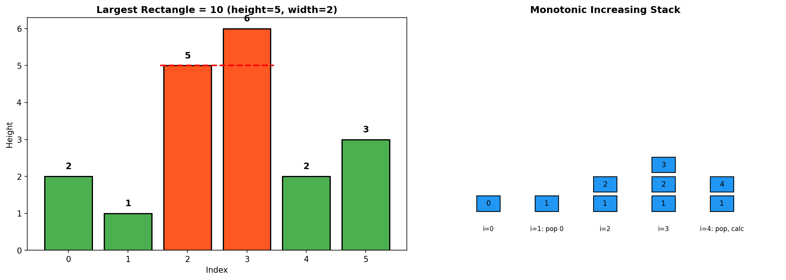
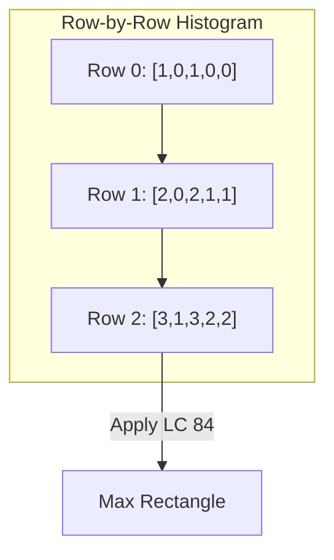
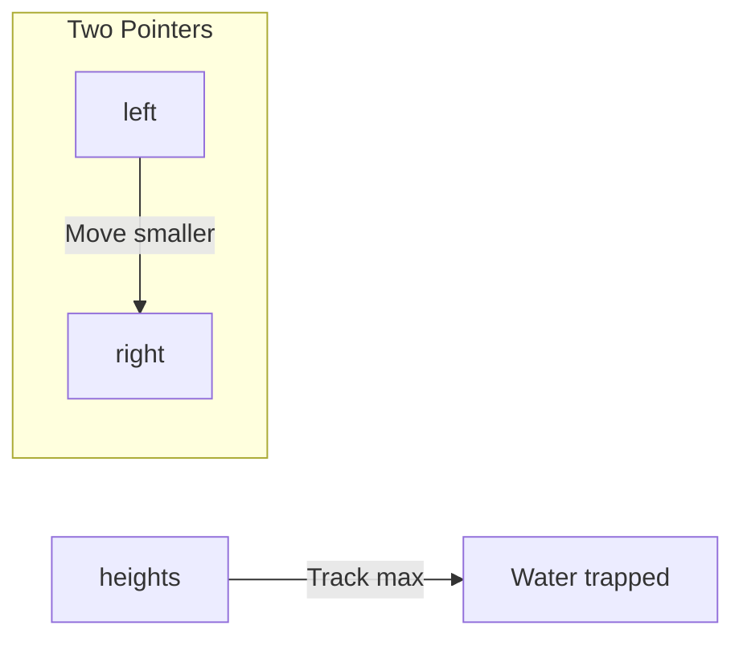
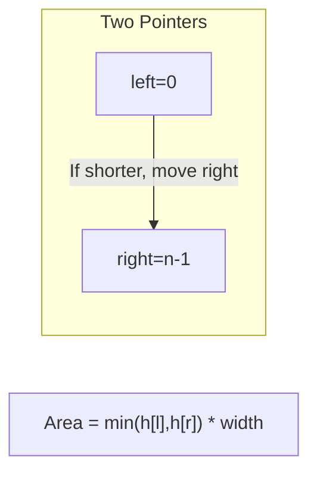
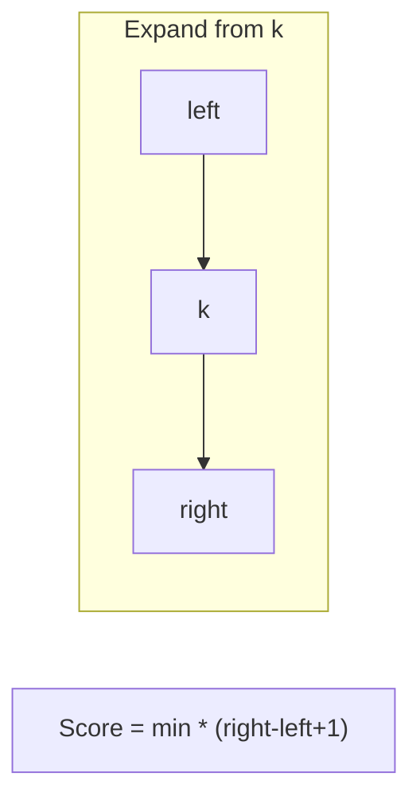

# Largest Rectangle in Histogram

> **LeetCode 84** | Difficulty: Hard | Pattern: Monotonic Stack

---

## Problem Statement

Given an array of integers `heights` representing the histogram's bar height where the width of each bar is `1`, return the area of the largest rectangle in the histogram.

### Examples

**Example 1:**
```
Input: heights = [2,1,5,6,2,3]
Output: 10
Explanation: The largest rectangle has area = 10 units (height=5, width=2)
```

```
     6
   5 _
   _| |
  |   | 2 3
 2| 1 |_|_|_|
 _|_|_|_|_|_|
 0 1 2 3 4 5
```

**Example 2:**
```
Input: heights = [2,4]
Output: 4
```

### Constraints

- `1 <= heights.length <= 10^5`
- `0 <= heights[i] <= 10^4`

---

## Intuition

For each bar, the largest rectangle with that bar as the minimum height extends:
- **Left**: until we hit a shorter bar
- **Right**: until we hit a shorter bar

**Key Insight**: Use a monotonic increasing stack. When we find a shorter bar, all taller bars in the stack have found their right boundary. Pop them and calculate their rectangle areas.

---

## Visualization



For `heights = [2, 1, 5, 6, 2, 3]`:

```
Monotonic Increasing Stack tracks indices where heights can extend right.

When we see height 2 at index 4:
- Pop height 6 (index 3): width = 4-2-1 = 1, area = 6*1 = 6
- Pop height 5 (index 2): width = 4-1-1 = 2, area = 5*2 = 10  <- MAX!

This means the rectangle of height 5 extends from index 2 to 3.
```

---

## Solution: Monotonic Stack

```python
def largestRectangleArea(heights: list[int]) -> int:
    """
    Find largest rectangle using monotonic increasing stack.

    Stack stores indices. Pop when we find a shorter bar.
    The popped bar's rectangle extends from stack top to current index.

    Time: O(n)
    Space: O(n)
    """
    stack = []  # Monotonic increasing stack of indices
    max_area = 0
    n = len(heights)

    for i in range(n + 1):
        # Use height 0 as sentinel to flush remaining bars
        h = heights[i] if i < n else 0

        while stack and heights[stack[-1]] > h:
            height = heights[stack.pop()]
            # Width: from stack top (left boundary) to current i (right boundary)
            width = i if not stack else i - stack[-1] - 1
            max_area = max(max_area, height * width)

        stack.append(i)

    return max_area
```

::: info Complexity: Time O(n) · Space O(n)
- **Time:** Each index is pushed onto the stack exactly once and popped at most once, giving 2n total operations
- **Space:** The stack stores indices; in the worst case (strictly increasing heights), all n indices are stored simultaneously
:::

---

## Why This Works

For each bar at index `i` that we pop:
- **Right boundary**: Current index (the shorter bar that caused the pop)
- **Left boundary**: The index below it in the stack (last bar shorter than it on the left)
- **Width**: `right - left - 1`

```
Stack: [1, 2, 3] (heights: 1, 5, 6)
Current: index 4, height 2

Pop index 3 (height 6):
  Right boundary: 4
  Left boundary: 2 (stack top after pop)
  Width: 4 - 2 - 1 = 1
  Area: 6 * 1 = 6

Pop index 2 (height 5):
  Right boundary: 4
  Left boundary: 1 (stack top after pop)
  Width: 4 - 1 - 1 = 2
  Area: 5 * 2 = 10
```

---

## Step-by-Step Walkthrough

For `heights = [2, 1, 5, 6, 2, 3]`:

```
Initial: stack = [], max_area = 0

i=0, h=2:
  Stack empty, push 0
  stack = [0]

i=1, h=1:
  heights[0]=2 > 1, pop 0
  height = 2, width = 1 (stack empty, width = i = 1)
  area = 2 * 1 = 2, max_area = 2
  Push 1
  stack = [1]

i=2, h=5:
  heights[1]=1 < 5, push 2
  stack = [1, 2]

i=3, h=6:
  heights[2]=5 < 6, push 3
  stack = [1, 2, 3]

i=4, h=2:
  heights[3]=6 > 2, pop 3
  height = 6, width = 4 - 2 - 1 = 1
  area = 6, max_area = 6

  heights[2]=5 > 2, pop 2
  height = 5, width = 4 - 1 - 1 = 2
  area = 10, max_area = 10

  heights[1]=1 < 2, push 4
  stack = [1, 4]

i=5, h=3:
  heights[4]=2 < 3, push 5
  stack = [1, 4, 5]

i=6 (sentinel h=0):
  Pop 5: height=3, width=6-4-1=1, area=3
  Pop 4: height=2, width=6-1-1=4, area=8
  Pop 1: height=1, width=6, area=6

Final max_area = 10
```

---

## Alternative: Two-Pass Approach

```python
def largestRectangleArea(heights: list[int]) -> int:
    """
    Find left and right boundaries separately, then calculate areas.

    Time: O(n)
    Space: O(n)
    """
    n = len(heights)

    # For each bar, find index of first shorter bar on left
    left_boundary = [-1] * n
    stack = []
    for i in range(n):
        while stack and heights[stack[-1]] >= heights[i]:
            stack.pop()
        left_boundary[i] = stack[-1] if stack else -1
        stack.append(i)

    # For each bar, find index of first shorter bar on right
    right_boundary = [n] * n
    stack = []
    for i in range(n - 1, -1, -1):
        while stack and heights[stack[-1]] >= heights[i]:
            stack.pop()
        right_boundary[i] = stack[-1] if stack else n
        stack.append(i)

    # Calculate max area
    max_area = 0
    for i in range(n):
        width = right_boundary[i] - left_boundary[i] - 1
        max_area = max(max_area, heights[i] * width)

    return max_area
```

::: info Complexity: Time O(n) · Space O(n)
- **Time:** Two separate O(n) passes to compute left and right boundaries, plus one O(n) pass to compute areas = O(3n) = O(n)
- **Space:** Three arrays of size n (left_boundary, right_boundary, and stack at any time) = O(3n) = O(n)
:::

---

## Complexity Analysis

| Approach | Time | Space |
|----------|------|-------|
| **Brute Force** | O(n^2) | O(1) |
| **Monotonic Stack** | O(n) | O(n) |
| **Two-Pass** | O(n) | O(n) |
| **Divide & Conquer** | O(n log n) | O(log n) |

### Why O(n)?

- Each index is pushed once and popped once
- Total operations: 2n = O(n)

---

## Edge Cases

```python
def test_largest_rectangle():
    # Single bar
    assert largestRectangleArea([5]) == 5

    # All same height
    assert largestRectangleArea([3, 3, 3, 3]) == 12

    # Increasing
    assert largestRectangleArea([1, 2, 3, 4]) == 6  # 2*3 or 3*2

    # Decreasing
    assert largestRectangleArea([4, 3, 2, 1]) == 6

    # Valley
    assert largestRectangleArea([3, 1, 3]) == 3

    # Peak
    assert largestRectangleArea([1, 3, 1]) == 3

    # Contains zero
    assert largestRectangleArea([2, 0, 2]) == 2
```

---

## Common Mistakes

1. **Forgetting the sentinel**
   ```python
   # Without sentinel, bars remaining in stack aren't processed
   # Must iterate to n (inclusive) with h=0 sentinel
   ```

2. **Wrong width calculation**
   ```python
   # When stack is empty after pop:
   width = i  # Not i - (-1) - 1
   ```

3. **Using `>=` instead of `>`**
   ```python
   # For equal heights, we want to keep them in stack
   # Pop only when strictly greater
   ```

---

## Applications

### 1. Maximal Rectangle in Binary Matrix (LeetCode 85)

```python
def maximalRectangle(matrix: list[list[str]]) -> int:
    """
    Treat each row as base of histogram.
    Heights accumulate for consecutive 1s.
    """
    if not matrix:
        return 0

    n = len(matrix[0])
    heights = [0] * n
    max_area = 0

    for row in matrix:
        for i in range(n):
            # Update heights: reset to 0 if '0', else add 1
            heights[i] = heights[i] + 1 if row[i] == '1' else 0

        max_area = max(max_area, largestRectangleArea(heights))

    return max_area
```

::: info Complexity: Time O(m * n) · Space O(n)
- **Time:** For each of m rows, we update n heights in O(n) and run the histogram algorithm in O(n), giving O(m * n) total
- **Space:** The heights array stores n values, and the stack within largestRectangleArea uses O(n) space
:::

### 2. Maximum Score of a Good Subarray (LeetCode 1793)

Similar histogram approach with additional constraint on including index k.

---

## Interview Tips

### What Interviewers Look For

1. **Monotonic Stack Pattern**: Recognize when to use it
2. **Boundary Calculation**: Understand left and right boundaries
3. **Edge Cases**: Handle empty stack, equal heights, zeros

### Common Follow-up Questions

1. **"Explain why the stack is monotonic increasing"**
   - Decreasing elements have found their right boundary
   - We need to track potential left boundaries

2. **"What if we want the rectangle with maximum width instead of area?"**
   - Find minimum height in range, binary search or segment tree

3. **"How would you handle negative heights?"**
   - Shift all heights by minimum value

4. **"Can you do it with O(1) extra space?"**
   - No, need to track left/right boundaries somehow

---

## Related Problems

::: details Maximal Rectangle (LeetCode 85)
**Problem:** Given a binary matrix, find the largest rectangle containing only 1s.

**Key Insight:** Treat each row as the base of a histogram. Heights accumulate for consecutive 1s, reset on 0s.



**Approach:** For each row, build histogram heights, then apply Largest Rectangle in Histogram algorithm.

**Complexity:** O(m * n) time, O(n) space
:::

::: details Trapping Rain Water (LeetCode 42)
**Problem:** Given elevation map, compute how much water can be trapped after raining.

**Key Insight:** Water at position i = min(left_max, right_max) - height[i]. Can use two pointers or monotonic stack.



**Approach:** Two pointer: move pointer with smaller max toward center, calculate water as you go.

**Complexity:** O(n) time, O(1) space (two pointer)
:::

::: details Container With Most Water (LeetCode 11)
**Problem:** Given heights array, find two lines that form container holding most water.

**Key Insight:** Area = min(height[i], height[j]) * (j - i). Move pointer of shorter line inward.



**Approach:** Greedy two pointers. Width decreases, so only move shorter line hoping for taller one.

**Complexity:** O(n) time, O(1) space
:::

::: details Maximum Score of Good Subarray (LeetCode 1793)
**Problem:** Find max score of subarray containing index k, where score = min(subarray) * length.

**Key Insight:** Similar to histogram problem but must include index k. Expand from k while tracking minimum.



**Approach:** Two pointers starting at k. Expand toward larger neighbor to maximize minimum.

**Complexity:** O(n) time, O(1) space
:::

---

## References

- [LeetCode 84 - Largest Rectangle in Histogram](https://leetcode.com/problems/largest-rectangle-in-histogram/)
- [NeetCode Solution](https://neetcode.io/solutions/largest-rectangle-in-histogram)
- [Monotonic Stack - LeetCode Discuss](https://leetcode.com/discuss/study-guide/5148505/monotonic-stack-guide)
