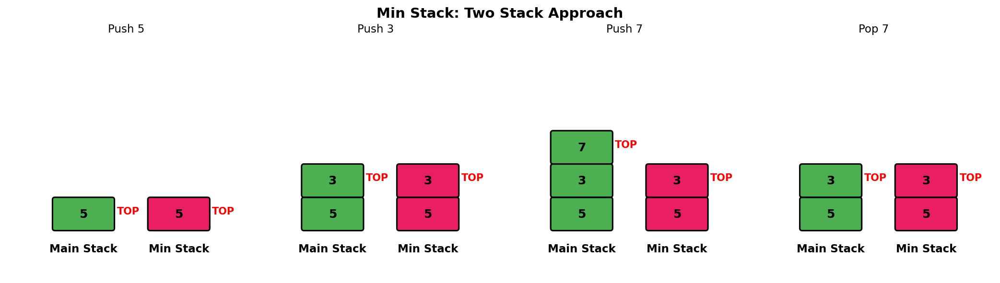
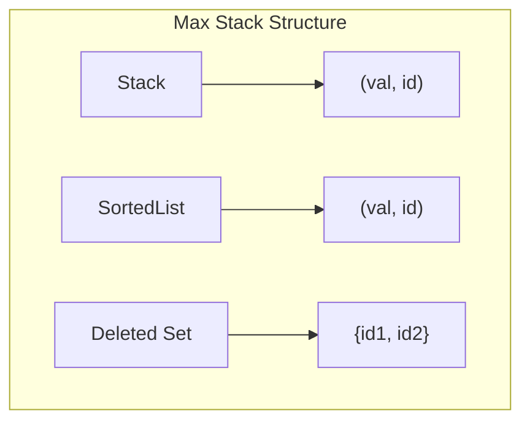
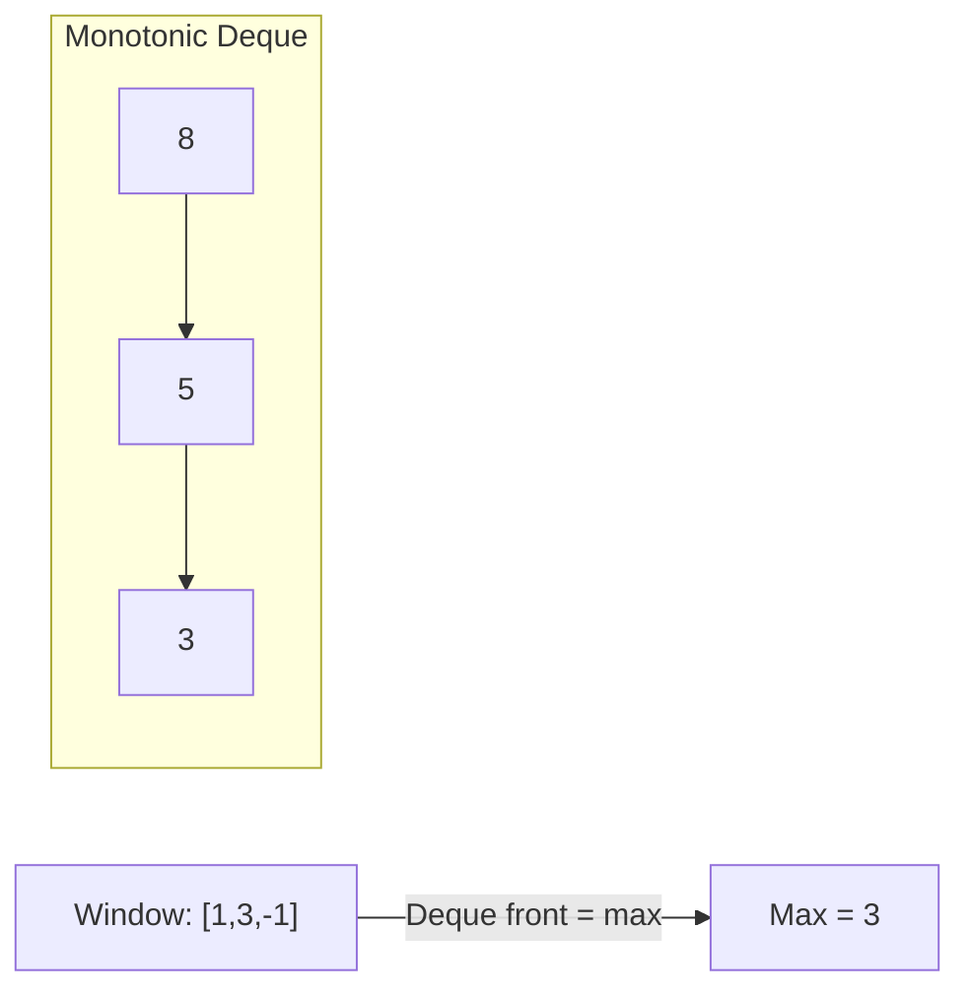
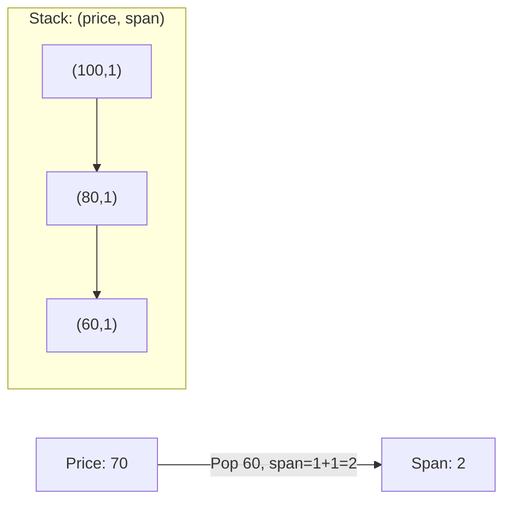
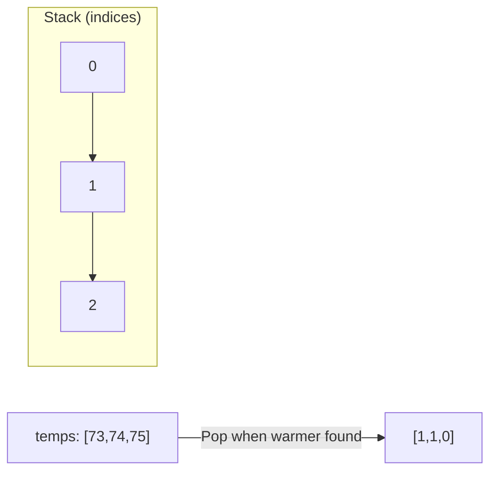

# Min Stack

> **LeetCode 155** | Difficulty: Medium | Pattern: Auxiliary Stack

---

## Problem Statement

Design a stack that supports push, pop, top, and retrieving the minimum element in **constant time**.

Implement the `MinStack` class:

- `MinStack()` initializes the stack object
- `void push(int val)` pushes the element val onto the stack
- `void pop()` removes the element on the top of the stack
- `int top()` gets the top element of the stack
- `int getMin()` retrieves the minimum element in the stack

You must implement a solution with **O(1)** time complexity for each function.

### Examples

**Example 1:**
```
Input:
["MinStack","push","push","push","getMin","pop","top","getMin"]
[[],[-2],[0],[-3],[],[],[],[]]

Output: [null,null,null,null,-3,null,0,-2]

Explanation:
MinStack minStack = new MinStack();
minStack.push(-2);
minStack.push(0);
minStack.push(-3);
minStack.getMin(); // return -3
minStack.pop();
minStack.top();    // return 0
minStack.getMin(); // return -2
```

### Constraints

- `-2^31 <= val <= 2^31 - 1`
- Methods `pop`, `top` and `getMin` operations will always be called on non-empty stacks
- At most `3 * 10^4` calls will be made to `push`, `pop`, `top`, and `getMin`

---

## Intuition

The challenge is tracking the minimum efficiently. A naive approach would scan the stack on every `getMin()` call - O(n). Instead, we track the minimum at each "level" of the stack.

**Key Insight**: The minimum can only change when we push or pop. By storing the current minimum with each element (or in a separate stack), we always know the minimum in O(1).

---

## Stack State Visualization



```
Operations: push(-2), push(0), push(-3), pop()

Push -2:
  Main Stack:  [-2]
  Min Stack:   [-2]    <- -2 is minimum

Push 0:
  Main Stack:  [-2, 0]
  Min Stack:   [-2]    <- -2 still minimum (0 > -2)

Push -3:
  Main Stack:  [-2, 0, -3]
  Min Stack:   [-2, -3]  <- -3 is new minimum

getMin() -> -3

Pop:
  Main Stack:  [-2, 0]
  Min Stack:   [-2]    <- -3 removed, -2 is minimum again

getMin() -> -2
```

---

## Solution 1: Two Stack Approach

::: code-group

```python [Python]
class MinStack:
    """
    Track minimum using auxiliary stack.

    min_stack only grows when we see a new minimum.
    """

    def __init__(self):
        self.stack = []
        self.min_stack = []

    def push(self, val: int) -> None:
        """O(1) - Push to main stack, update min_stack if needed"""
        self.stack.append(val)
        # Push to min_stack if it's empty OR val is new minimum
        if not self.min_stack or val <= self.min_stack[-1]:
            self.min_stack.append(val)

    def pop(self) -> None:
        """O(1) - Pop from main stack, update min_stack if needed"""
        if self.stack.pop() == self.min_stack[-1]:
            self.min_stack.pop()

    def top(self) -> int:
        """O(1) - Return top of main stack"""
        return self.stack[-1]

    def getMin(self) -> int:
        """O(1) - Return top of min_stack"""
        return self.min_stack[-1]
```

```java [Java]
class MinStack {
    private Deque<Integer> stack;
    private Deque<Integer> minStack;

    public MinStack() {
        stack = new ArrayDeque<>();
        minStack = new ArrayDeque<>();
    }

    public void push(int val) {
        stack.push(val);
        if (minStack.isEmpty() || val <= minStack.peek()) {
            minStack.push(val);
        }
    }

    public void pop() {
        int popped = stack.pop();
        if (popped == minStack.peek()) {
            minStack.pop();
        }
    }

    public int top() {
        return stack.peek();
    }

    public int getMin() {
        return minStack.peek();
    }
}
```

:::

::: info Complexity: Time O(1) per operation · Space O(n)
- **Time:** All operations (push, pop, top, getMin) are single array access or append/pop operations, each O(1)
- **Space:** Main stack uses O(n); min_stack uses O(k) where k is the number of times a new minimum was pushed (worst case O(n) for decreasing sequence)
:::

### Why `<=` Not `<`?

Using `<=` handles duplicates correctly:
```
push(1), push(1), pop()
With <=: min_stack = [1, 1] -> [1] after pop, correct!
With <:  min_stack = [1] -> [] after pop, WRONG!
```

---

## Solution 2: Stack of Pairs

```python
class MinStack:
    """
    Store (value, current_minimum) pairs.

    Pros: Simpler logic
    Cons: More space (stores min with every element)
    """

    def __init__(self):
        self.stack = []  # Each element: (val, current_min)

    def push(self, val: int) -> None:
        """O(1)"""
        if not self.stack:
            self.stack.append((val, val))
        else:
            current_min = min(val, self.stack[-1][1])
            self.stack.append((val, current_min))

    def pop(self) -> None:
        """O(1)"""
        self.stack.pop()

    def top(self) -> int:
        """O(1)"""
        return self.stack[-1][0]

    def getMin(self) -> int:
        """O(1)"""
        return self.stack[-1][1]
```

::: info Complexity: Time O(1) per operation · Space O(2n)
- **Time:** All operations involve single tuple access or min comparison, each O(1)
- **Space:** Each element stores a tuple of (value, current_min), doubling storage to O(2n) compared to a simple stack
:::

---

## Solution 3: Single Stack with Encoding

```python
class MinStack:
    """
    Space-optimized: Store difference from minimum.

    When val < min: store (val - min) which is negative
    This negative value signals that val was a new minimum.

    Pros: O(1) extra space for min tracking
    Cons: Complex logic, potential integer overflow
    """

    def __init__(self):
        self.stack = []
        self.min_val = float('inf')

    def push(self, val: int) -> None:
        """O(1)"""
        if not self.stack:
            self.stack.append(0)  # Difference from itself
            self.min_val = val
        else:
            diff = val - self.min_val
            self.stack.append(diff)
            if val < self.min_val:
                self.min_val = val

    def pop(self) -> None:
        """O(1)"""
        diff = self.stack.pop()
        if diff < 0:
            # This was the minimum, restore previous min
            self.min_val = self.min_val - diff

        if not self.stack:
            self.min_val = float('inf')

    def top(self) -> int:
        """O(1)"""
        diff = self.stack[-1]
        if diff < 0:
            return self.min_val  # This element was the minimum
        return diff + self.min_val

    def getMin(self) -> int:
        """O(1)"""
        return self.min_val
```

::: info Complexity: Time O(1) per operation · Space O(n) + O(1) for min tracking
- **Time:** All operations are arithmetic or single array access, each O(1)
- **Space:** Stack stores n difference values; only a single variable tracks the minimum, making min tracking O(1) extra space
:::

### How Encoding Works

```
Push 5: min = 5, stack = [0]        (5-5=0)
Push 3: min = 3, stack = [0, -2]    (3-5=-2, negative!)
Push 7: min = 3, stack = [0, -2, 4] (7-3=4)

Pop 7: diff=4 >= 0, actual = 4+3=7
Pop 3: diff=-2 < 0, actual = min=3, restore min = 3-(-2)=5
```

---

## Algorithm Comparison

| Approach | Push | Pop | Top | getMin | Space |
|----------|------|-----|-----|--------|-------|
| **Two Stacks** | O(1) | O(1) | O(1) | O(1) | O(n) |
| **Stack of Pairs** | O(1) | O(1) | O(1) | O(1) | O(2n) |
| **Encoding** | O(1) | O(1) | O(1) | O(1) | O(n) + O(1) |

**Recommendation**: Two Stack approach - good balance of simplicity and efficiency.

---

## Step-by-Step Walkthrough

```
Operations: push(-2), push(0), push(-3), getMin(), pop(), getMin()

push(-2):
  stack = [-2]
  min_stack = [-2]  (empty, so push)

push(0):
  stack = [-2, 0]
  min_stack = [-2]  (0 > -2, don't push)

push(-3):
  stack = [-2, 0, -3]
  min_stack = [-2, -3]  (-3 <= -2, push)

getMin():
  return min_stack[-1] = -3

pop():
  popped = -3
  stack = [-2, 0]
  -3 == min_stack[-1], so pop min_stack too
  min_stack = [-2]

getMin():
  return min_stack[-1] = -2
```

---

## Complexity Analysis

| Operation | Time | Space | Notes |
|-----------|------|-------|-------|
| `push` | O(1) | - | Constant time append |
| `pop` | O(1) | - | Constant time pop |
| `top` | O(1) | - | Array index access |
| `getMin` | O(1) | - | Array index access |

**Overall Space**: O(n) for main stack + O(k) for min_stack where k is number of times minimum decreased.

**Worst case for min_stack**: O(n) when elements are in decreasing order (e.g., [5, 4, 3, 2, 1]).

---

## Edge Cases

```python
def test_min_stack():
    ms = MinStack()

    # Single element
    ms.push(5)
    assert ms.getMin() == 5
    assert ms.top() == 5

    # Duplicate minimums
    ms = MinStack()
    ms.push(1)
    ms.push(1)
    ms.push(1)
    ms.pop()
    assert ms.getMin() == 1  # Still works

    # Decreasing sequence
    ms = MinStack()
    ms.push(3)
    ms.push(2)
    ms.push(1)
    assert ms.getMin() == 1
    ms.pop()
    assert ms.getMin() == 2

    # Large values
    ms = MinStack()
    ms.push(2**31 - 1)
    ms.push(-2**31)
    assert ms.getMin() == -2**31
```

---

## Common Variations

### 1. Max Stack (LeetCode 716)

```python
class MaxStack:
    """Support peekMax() and popMax() in addition to regular operations."""

    def __init__(self):
        from sortedcontainers import SortedList
        self.stack = []
        self.sorted_vals = SortedList()  # For O(log n) max operations
        self.id = 0

    # popMax is tricky - need to find and remove from middle of stack
    # Use soft delete or sorted container with lazy removal
```

### 2. Min Queue

```python
from collections import deque

class MinQueue:
    """Queue with O(1) getMin using monotonic deque."""

    def __init__(self):
        self.queue = deque()
        self.min_deque = deque()  # Monotonic increasing

    def enqueue(self, val):
        self.queue.append(val)
        while self.min_deque and self.min_deque[-1] > val:
            self.min_deque.pop()
        self.min_deque.append(val)

    def dequeue(self):
        val = self.queue.popleft()
        if val == self.min_deque[0]:
            self.min_deque.popleft()
        return val

    def getMin(self):
        return self.min_deque[0]
```

---

## Interview Tips

### What Interviewers Look For

1. **O(1) all operations**: Must achieve constant time
2. **Space trade-offs**: Discuss different approaches
3. **Edge cases**: Handle duplicates, empty stack

### Common Follow-up Questions

1. **"What if we also need getMax()?"**
   - Add another auxiliary stack for maximum
   - Or use stack of tuples: (val, min, max)

2. **"Can you optimize space?"**
   - Encoding approach uses O(1) extra for min tracking
   - But has overflow risks and complex logic

3. **"What about a Min Queue?"**
   - Use monotonic deque (discussed above)
   - Sliding window maximum/minimum uses this

4. **"How would you handle concurrent access?"**
   - Lock-based: mutex around all operations
   - Lock-free: atomic operations, more complex

---

## Related Problems

::: details Max Stack (LeetCode 716)
**Problem:** Design a stack that supports push, pop, top, peekMax, and popMax operations.

**Key Insight:** popMax() is tricky - need to find and remove from middle of stack. Use soft deletion or sorted container.



**Approach:** Use stack + sorted container (TreeMap/SortedList) + lazy deletion with unique IDs for each element.

**Complexity:** O(log n) for push/pop/peekMax/popMax
:::

::: details Sliding Window Maximum (LeetCode 239)
**Problem:** Given array and window size k, return max element in each sliding window position.

**Key Insight:** Monotonic decreasing deque - front is always the max. Remove elements outside window and smaller elements.



**Approach:** Deque stores indices in decreasing order of values. Popleft when outside window, pop when smaller than current.

**Complexity:** O(n) time, O(k) space
:::

::: details Online Stock Span (LeetCode 901)
**Problem:** Design class that returns span (consecutive days with price <= today) for each new price.

**Key Insight:** Previous greater element problem. Monotonic decreasing stack accumulates spans of popped elements.



**Approach:** Stack stores (price, span). Pop prices <= current, sum their spans + 1.

**Complexity:** O(1) amortized time per call, O(n) space total
:::

::: details Daily Temperatures (LeetCode 739)
**Problem:** Given daily temperatures, return array where answer[i] = days until warmer temperature.

**Key Insight:** Next greater element pattern. Monotonic decreasing stack of indices, calculate index difference.



**Approach:** Stack stores indices. When current temp > stack top, pop and record day difference.

**Complexity:** O(n) time, O(n) space
:::

---

## References

- [LeetCode 155 - Min Stack](https://leetcode.com/problems/min-stack/)
- [NeetCode Solution](https://neetcode.io/solutions/min-stack)
- [GeeksforGeeks - Min Stack O(1) Space](https://www.geeksforgeeks.org/design-a-stack-that-supports-getmin-in-o1-time-and-o1-extra-space/)
