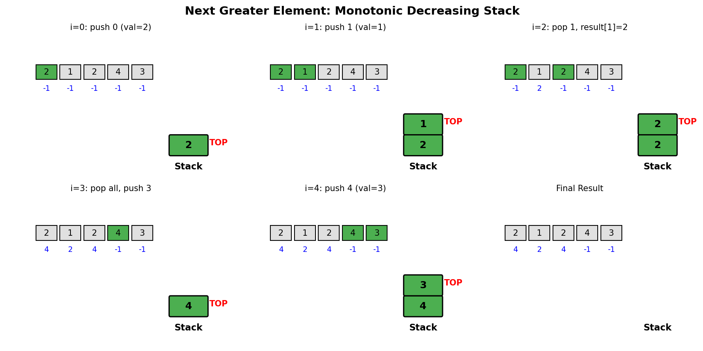
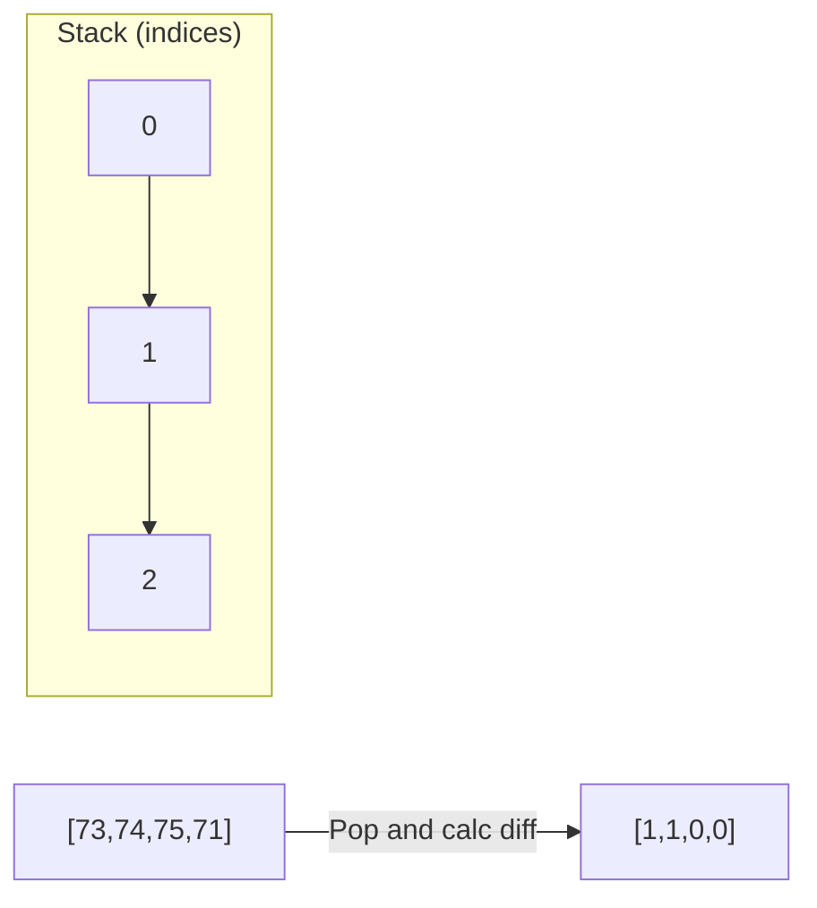
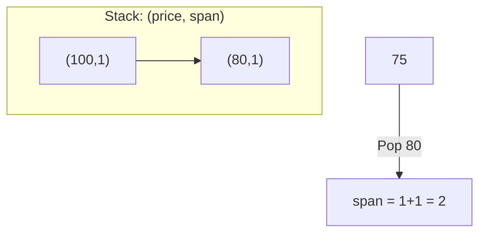
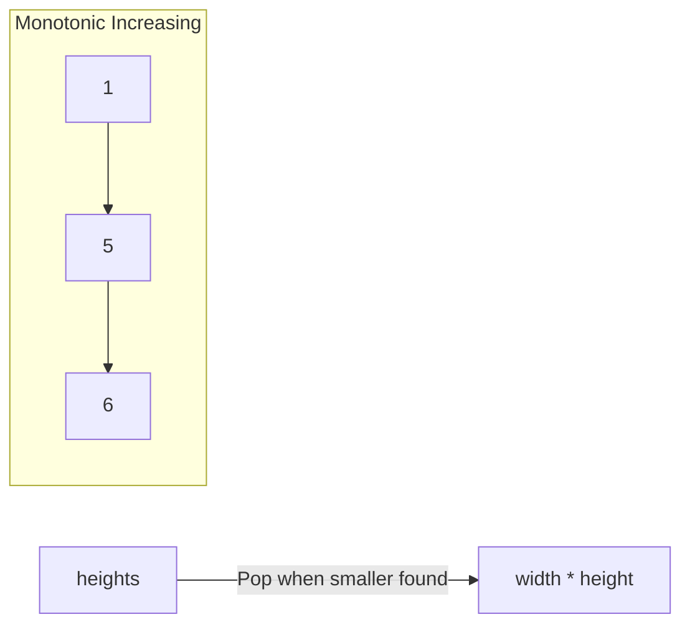
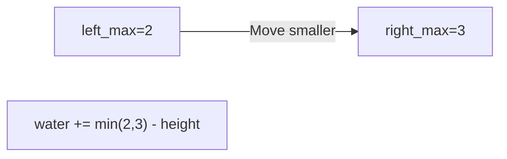
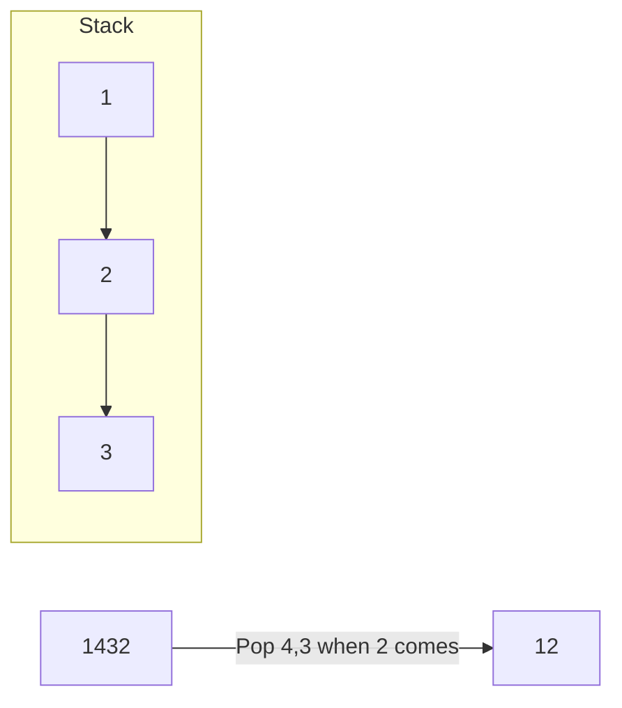

# Next Greater Element

> **LeetCode 496, 503** | Difficulty: Easy/Medium | Pattern: Monotonic Stack

---

## Problem Statement

### Next Greater Element I (LeetCode 496)

The **next greater element** of some element `x` in an array is the **first greater** element that is **to the right** of `x` in the same array.

You are given two **distinct 0-indexed** integer arrays `nums1` and `nums2`, where `nums1` is a subset of `nums2`.

For each `0 <= i < nums1.length`, find the index `j` such that `nums1[i] == nums2[j]` and determine the next greater element of `nums2[j]` in `nums2`. If there is no next greater element, the answer is `-1`.

Return an array `ans` of length `nums1.length` such that `ans[i]` is the next greater element for `nums1[i]`.

### Examples

**Example 1:**
```
Input: nums1 = [4,1,2], nums2 = [1,3,4,2]
Output: [-1,3,-1]
Explanation:
- For 4: No element greater than 4 to its right in nums2. Answer: -1
- For 1: Next greater element is 3. Answer: 3
- For 2: No element greater than 2 to its right. Answer: -1
```

**Example 2:**
```
Input: nums1 = [2,4], nums2 = [1,2,3,4]
Output: [3,-1]
```

### Constraints

- `1 <= nums1.length <= nums2.length <= 1000`
- `0 <= nums1[i], nums2[i] <= 10^4`
- All integers in `nums1` and `nums2` are unique
- All integers of `nums1` also appear in `nums2`

---

## Intuition: Monotonic Stack

The brute force approach checks every element to the right for each element - O(n^2). We can do better with a **monotonic decreasing stack**.

**Key Insight**: Maintain a stack of elements for which we haven't found the next greater element yet. When we encounter a larger element, it's the "next greater" for all smaller elements on the stack.

---

## Stack State Visualization



For array `[2, 1, 2, 4, 3]`:

```
i=0, val=2:
  Stack empty, push 0
  Stack: [0] (values: [2])

i=1, val=1:
  1 < 2 (stack top), push 1
  Stack: [0, 1] (values: [2, 1])

i=2, val=2:
  2 > 1, pop index 1, result[1] = 2
  2 == 2 (stack top), push 2
  Stack: [0, 2] (values: [2, 2])

i=3, val=4:
  4 > 2, pop index 2, result[2] = 4
  4 > 2, pop index 0, result[0] = 4
  Stack empty, push 3
  Stack: [3] (values: [4])

i=4, val=3:
  3 < 4 (stack top), push 4
  Stack: [3, 4] (values: [4, 3])

Done: result = [4, 2, 4, -1, -1]
```

---

## Solution: Next Greater Element I

```python
def nextGreaterElement(nums1: list[int], nums2: list[int]) -> list[int]:
    """
    Find next greater element for each element in nums1.

    Approach:
    1. Build a map of next greater elements for all elements in nums2
    2. Look up each element of nums1 in the map

    Time: O(n + m) where n = len(nums1), m = len(nums2)
    Space: O(m) for the stack and hashmap
    """
    # Map: element -> its next greater element
    next_greater = {}
    stack = []  # Monotonic decreasing stack

    for num in nums2:
        # Pop elements smaller than current - they found their next greater
        while stack and stack[-1] < num:
            smaller = stack.pop()
            next_greater[smaller] = num
        stack.append(num)

    # Elements remaining in stack have no next greater
    # They default to -1 (not in next_greater map)

    return [next_greater.get(num, -1) for num in nums1]
```

::: info Complexity: Time O(n + m) · Space O(m)
- **Time:** Single pass through nums2 (m elements), each element pushed/popped at most once = O(m); lookup for n elements in nums1 = O(n)
- **Space:** HashMap stores at most m key-value pairs; stack holds at most m elements at any time
:::

---

## Solution: Next Greater Element II (Circular Array)

For circular arrays, iterate twice through the array.

```python
def nextGreaterElements(nums: list[int]) -> list[int]:
    """
    LeetCode 503: Circular array version.

    Iterate through array twice to handle wrap-around.

    Time: O(n)
    Space: O(n)
    """
    n = len(nums)
    result = [-1] * n
    stack = []  # Store indices

    # Iterate twice (2n iterations for circular)
    for i in range(2 * n):
        idx = i % n

        while stack and nums[stack[-1]] < nums[idx]:
            result[stack.pop()] = nums[idx]

        # Only push indices in first pass
        if i < n:
            stack.append(idx)

    return result
```

::: info Complexity: Time O(n) · Space O(n)
- **Time:** Loop runs 2n iterations; each index is pushed once (first pass only) and popped at most once = O(2n) = O(n)
- **Space:** Result array uses O(n); stack stores at most n indices (all elements if strictly decreasing)
:::

**Example for circular `[1, 2, 1]`:**
```
First pass (i=0,1,2):
  i=0: push 0, stack=[0]
  i=1: 2>1, pop 0, result[0]=2, push 1, stack=[1]
  i=2: 1<2, push 2, stack=[1,2]

Second pass (i=3,4,5 -> idx=0,1,2):
  i=3 (idx=0): 1<2, no pop
  i=4 (idx=1): 2==2, no pop
  i=5 (idx=2): 1<2, no pop

result = [2, -1, 2]
Wait, let's recalculate...

Actually for [1,2,1]:
  i=5 (idx=2): nums[1]=2, nums[2]=1, 2>1? No

Hmm, result[1] stays -1 (no greater in circular)
result[2]=2 from second pass when we see nums[1]=2

Correct: [2, -1, 2]
```

---

## Generic Template: Next Greater/Smaller

```python
def nextGreater(nums: list[int]) -> list[int]:
    """Find next greater element for each position."""
    n = len(nums)
    result = [-1] * n
    stack = []  # Monotonic DECREASING stack (stores indices)

    for i in range(n):
        while stack and nums[stack[-1]] < nums[i]:
            result[stack.pop()] = nums[i]
        stack.append(i)

    return result


def nextSmaller(nums: list[int]) -> list[int]:
    """Find next smaller element for each position."""
    n = len(nums)
    result = [-1] * n
    stack = []  # Monotonic INCREASING stack

    for i in range(n):
        while stack and nums[stack[-1]] > nums[i]:
            result[stack.pop()] = nums[i]
        stack.append(i)

    return result


def prevGreater(nums: list[int]) -> list[int]:
    """Find previous greater element for each position."""
    n = len(nums)
    result = [-1] * n
    stack = []  # Monotonic DECREASING stack

    for i in range(n):
        while stack and nums[stack[-1]] <= nums[i]:
            stack.pop()
        if stack:
            result[i] = nums[stack[-1]]
        stack.append(i)

    return result


def prevSmaller(nums: list[int]) -> list[int]:
    """Find previous smaller element for each position."""
    n = len(nums)
    result = [-1] * n
    stack = []  # Monotonic INCREASING stack

    for i in range(n):
        while stack and nums[stack[-1]] >= nums[i]:
            stack.pop()
        if stack:
            result[i] = nums[stack[-1]]
        stack.append(i)

    return result
```

::: info Complexity: Time O(n) · Space O(n) for each function
- **Time:** Each element is pushed exactly once and popped at most once, giving O(2n) = O(n) operations
- **Space:** Result array is O(n); stack can hold up to n indices in worst case (e.g., strictly decreasing for nextGreater)
:::

---

## Monotonic Stack Types

| Type | Stack Order | Use Case | Pop Condition |
|------|-------------|----------|---------------|
| **Decreasing** | Top is smallest | Next Greater | `stack[-1] < current` |
| **Increasing** | Top is largest | Next Smaller | `stack[-1] > current` |

### Visual Comparison

```
Decreasing Stack for Next Greater:
Array: [3, 1, 4, 2]

i=0: stack=[3]
i=1: stack=[3,1]     (1<3, keep 3)
i=2: 4>1, pop 1 (next greater=4)
     4>3, pop 3 (next greater=4)
     stack=[4]
i=3: stack=[4,2]     (2<4)

Next Greater: [4, 4, -1, -1]
```

---

## Complexity Analysis

| Approach | Time | Space |
|----------|------|-------|
| **Brute Force** | O(n^2) | O(1) |
| **Monotonic Stack** | O(n) | O(n) |

**Why O(n)?** Each element is pushed and popped at most once.

---

## Edge Cases

```python
def test_next_greater():
    # All same elements
    assert nextGreater([1, 1, 1, 1]) == [-1, -1, -1, -1]

    # Strictly increasing
    assert nextGreater([1, 2, 3, 4]) == [2, 3, 4, -1]

    # Strictly decreasing
    assert nextGreater([4, 3, 2, 1]) == [-1, -1, -1, -1]

    # Single element
    assert nextGreater([5]) == [-1]

    # Two elements
    assert nextGreater([1, 2]) == [2, -1]
    assert nextGreater([2, 1]) == [-1, -1]
```

---

## Related Applications

### 1. Daily Temperatures

```python
def dailyTemperatures(temperatures: list[int]) -> list[int]:
    """Days until warmer temperature (index difference, not value)."""
    n = len(temperatures)
    result = [0] * n
    stack = []

    for i in range(n):
        while stack and temperatures[stack[-1]] < temperatures[i]:
            prev_idx = stack.pop()
            result[prev_idx] = i - prev_idx  # Days difference
        stack.append(i)

    return result
```

::: info Complexity: Time O(n) · Space O(n)
- **Time:** Each index pushed once, popped at most once when a warmer day is found = O(n) total operations
- **Space:** Result array O(n); stack stores indices of days waiting for warmer temperature, at most n
:::

### 2. Stock Span

```python
def stockSpan(prices: list[int]) -> list[int]:
    """Days including today where price was <= today's price."""
    n = len(prices)
    result = [1] * n
    stack = []  # Stores indices

    for i in range(n):
        while stack and prices[stack[-1]] <= prices[i]:
            stack.pop()
        result[i] = i - stack[-1] if stack else i + 1
        stack.append(i)

    return result
```

::: info Complexity: Time O(n) · Space O(n)
- **Time:** Each index pushed once and popped at most once when a higher price appears = O(n) amortized
- **Space:** Result array O(n); stack stores indices of prices not yet "spanned over," at most n
:::

---

## Google Interview Tips

### What Interviewers Look For

1. **Pattern Recognition**: Identify monotonic stack applicability
2. **Stack Type**: Know when to use increasing vs decreasing
3. **Edge Cases**: Handle all same, sorted, reverse sorted arrays

### Common Follow-up Questions

1. **"What if we need both next greater AND previous greater?"**
   - Run monotonic stack twice, or compute both in single pass

2. **"How would you handle duplicates?"**
   - Decide on strict (`<`) vs non-strict (`<=`) comparison

3. **"Can you find the next greater element's INDEX instead of value?"**
   - Store indices in stack, return indices instead of values

4. **"What's the intuition behind monotonic stack?"**
   - We maintain a "waiting list" of elements looking for their answer
   - When a larger element comes, it resolves all smaller waiting elements

---

## Common Mistakes

1. **Storing values instead of indices**: Usually need indices for calculations
2. **Wrong comparison**: `<` vs `<=` matters for duplicates
3. **Forgetting remaining stack elements**: They have no next greater (return -1)
4. **Circular array**: Remember to iterate twice, but only push once

---

## Related Problems

::: details Daily Temperatures (LeetCode 739)
**Problem:** Given temperatures array, return days until warmer temperature for each day.

**Key Insight:** Next greater element but return index difference instead of value.



**Approach:** Monotonic decreasing stack of indices. When current > stack top, result = current_idx - popped_idx.

**Complexity:** O(n) time, O(n) space
:::

::: details Online Stock Span (LeetCode 901)
**Problem:** Design class returning span (consecutive days <= today's price) for streaming prices.

**Key Insight:** Previous greater element pattern. Accumulate spans of popped elements.



**Approach:** Stack stores (price, accumulated_span). Pop all <= current, sum their spans + 1.

**Complexity:** O(1) amortized per call
:::

::: details Largest Rectangle in Histogram (LeetCode 84)
**Problem:** Find largest rectangular area in histogram.

**Key Insight:** Need both previous smaller and next smaller for each bar to determine width.



**Approach:** Monotonic increasing stack. When popping, left boundary = stack top, right boundary = current index.

**Complexity:** O(n) time, O(n) space
:::

::: details Trapping Rain Water (LeetCode 42)
**Problem:** Calculate water trapped between bars in elevation map.

**Key Insight:** Water bounded by min(left_max, right_max). Two pointers optimal, stack also works.



**Approach:** Two pointers from ends. Move pointer with smaller max, calculate water at that position.

**Complexity:** O(n) time, O(1) space
:::

::: details Remove K Digits (LeetCode 402)
**Problem:** Remove k digits from number string to get smallest possible result.

**Key Insight:** Greedy with monotonic increasing stack. Remove larger preceding digits.



**Approach:** Monotonic increasing stack. Pop larger digits when smaller digit found (counts as removal).

**Complexity:** O(n) time, O(n) space
:::

---

## References

- [LeetCode 496 - Next Greater Element I](https://leetcode.com/problems/next-greater-element-i/)
- [LeetCode 503 - Next Greater Element II](https://leetcode.com/problems/next-greater-element-ii/)
- [Monotonic Stack Guide](https://leetcode.com/discuss/study-guide/5148505/monotonic-stack-guide)
- [NeetCode Solution](https://neetcode.io/solutions/next-greater-element-i)
