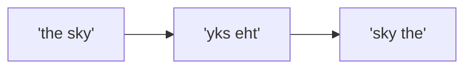
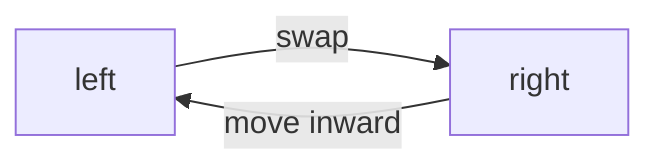
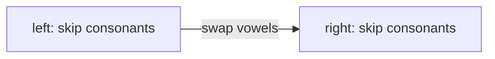

# Valid Parentheses, Min Stack & Reverse Sentence

> **Classic stack applications** - These problems demonstrate fundamental stack operations and are frequently asked in SDE interviews.

---

## Valid Parentheses

### Problem Statement
Given a string containing just `'('`, `')'`, `'{'`, `'}'`, `'['`, `']'`, determine if the input string is valid.

A string is valid if:
1. Every open bracket is closed by the same type of close bracket
2. Open brackets are closed in the correct order
3. Every close bracket has a corresponding open bracket of the same type

### Why Use a Stack?

A stack is ideal for this problem because of its **LIFO (Last In, First Out)** behavior, which matches the requirement that the most recently opened parenthesis must be the first to close.

**Why Simple Counting Doesn't Work:** An example like `[(])` has an equivalent number of each type, but the alignment of those types does not form a valid set of parentheses. The stack data structure maintains the ordering of characters.

### Solution

::: code-group

```python [Python]
def isValid(s: str) -> bool:
    stack = []
    mapping = {')': '(', '}': '{', ']': '['}

    for char in s:
        if char in mapping:
            # Closing bracket - check if it matches top of stack
            if not stack or stack.pop() != mapping[char]:
                return False
        else:
            # Opening bracket - push to stack
            stack.append(char)

    # Valid only if all brackets matched (empty stack)
    return len(stack) == 0
```

```java [Java]
public boolean isValid(String s) {
    Deque<Character> stack = new ArrayDeque<>();
    Map<Character, Character> mapping = new HashMap<>();
    mapping.put(')', '(');
    mapping.put('}', '{');
    mapping.put(']', '[');

    for (char c : s.toCharArray()) {
        if (mapping.containsKey(c)) {
            if (stack.isEmpty() || !stack.pop().equals(mapping.get(c))) return false;
        } else {
            stack.push(c);
        }
    }
    return stack.isEmpty();
}
```

:::

::: info Complexity: Time O(n) · Space O(n)
- **Time:** Single pass through the string; each character involves O(1) hash lookup and stack operation
- **Space:** Stack stores opening brackets; worst case all n characters are opening brackets (e.g., "((((")
:::

### Algorithm Steps
1. Create a hash map mapping closing parentheses to their corresponding opening parentheses
2. Initialize an empty stack to store opening parentheses
3. For each character:
   - If opening bracket: push to stack
   - If closing bracket: check if top of stack has matching opening bracket
4. Return `True` if stack is empty (all brackets matched)

### Complexity
- **Time:** O(n) - single traversal of string
- **Space:** O(n) - worst case, all opening brackets stored in stack

### Variations
| Problem | Description | Difficulty |
|---------|-------------|------------|
| **Generate Valid Parentheses** | Generate all valid combinations of n pairs | Medium |
| **Remove Invalid Parentheses** | Remove minimum number to make valid | Hard |
| **Longest Valid Parentheses** | Find length of longest valid substring | Hard |
| **Valid Parenthesis String** | With `*` as wildcard | Medium |

### Generate Valid Parentheses (Variation)
```python
def generateParenthesis(n: int) -> list[str]:
    result = []

    def backtrack(curr: str, open_count: int, close_count: int):
        if len(curr) == 2 * n:
            result.append(curr)
            return

        if open_count < n:
            backtrack(curr + '(', open_count + 1, close_count)
        if close_count < open_count:
            backtrack(curr + ')', open_count, close_count + 1)

    backtrack('', 0, 0)
    return result
```

::: info Complexity: Time O(4^n / sqrt(n)) · Space O(n)
- **Time:** Generates the nth Catalan number of valid combinations; each combination takes O(n) to build
- **Space:** Recursion depth is 2n (length of each result); result storage is O(Catalan(n) * n) but typically counted separately
:::

---

## Min Stack

### Problem Statement
Design a stack that supports `push`, `pop`, `top`, and retrieving the minimum element in **O(1)** time complexity.

Implement the `MinStack` class:
- `MinStack()` initializes the stack object
- `push(val)` pushes element val onto the stack
- `pop()` removes the element on top of the stack
- `top()` gets the top element
- `getMin()` retrieves the minimum element in the stack

### Approach
The key insight is to track the minimum value at each "level" of the stack. When an element is pushed, we store the current minimum alongside it. This way, even after pops, we always know the minimum of the remaining elements.

**Two approaches:**
1. **Auxiliary Stack:** Use a second stack to track minimums at each level
2. **Differential Encoding:** Store difference from minimum (O(1) extra space for min tracking)

### Solution 1: Two Stack Approach

::: code-group

```python [Python]
class MinStack:
    def __init__(self):
        self.stack = []
        self.min_stack = []

    def push(self, val: int) -> None:
        self.stack.append(val)
        # Push to min_stack if empty or val is new minimum
        if not self.min_stack or val <= self.min_stack[-1]:
            self.min_stack.append(val)

    def pop(self) -> None:
        # If popped value was the minimum, also pop from min_stack
        if self.stack.pop() == self.min_stack[-1]:
            self.min_stack.pop()

    def top(self) -> int:
        return self.stack[-1]

    def getMin(self) -> int:
        return self.min_stack[-1]
```

```java [Java]
class MinStack {
    private Deque<Integer> stack;
    private Deque<Integer> minStack;

    public MinStack() {
        stack = new ArrayDeque<>();
        minStack = new ArrayDeque<>();
    }

    public void push(int val) {
        stack.push(val);
        if (minStack.isEmpty() || val <= minStack.peek()) minStack.push(val);
    }

    public void pop() {
        if (stack.pop().equals(minStack.peek())) minStack.pop();
    }

    public int top() { return stack.peek(); }

    public int getMin() { return minStack.peek(); }
}
```

:::

::: info Complexity: Time O(1) per operation · Space O(n)
- **Time:** Each method performs constant-time stack operations (append, pop, index access)
- **Space:** Main stack O(n); min_stack stores new minimums only, O(n) worst case for decreasing sequence
:::

### Complexity (Two Stack)
- **Time:** O(1) for all operations
- **Space:** O(n) for the auxiliary min stack

### Solution 2: Space-Optimized (Store Difference)
```python
class MinStack:
    def __init__(self):
        self.stack = []
        self.min_val = float('inf')

    def push(self, val: int) -> None:
        if not self.stack:
            self.stack.append(0)  # Difference is 0 for first element
            self.min_val = val
        else:
            # Store difference from current minimum
            self.stack.append(val - self.min_val)
            self.min_val = min(self.min_val, val)

    def pop(self) -> None:
        diff = self.stack.pop()
        if diff < 0:
            # This was the minimum, restore previous min
            self.min_val = self.min_val - diff

    def top(self) -> int:
        diff = self.stack[-1]
        # If diff < 0, the actual value is min_val
        return self.min_val if diff < 0 else diff + self.min_val

    def getMin(self) -> int:
        return self.min_val
```

::: info Complexity: Time O(1) per operation · Space O(n) + O(1) for min
- **Time:** Each operation involves constant arithmetic and single stack operation
- **Space:** Stack stores n difference values; only one variable (min_val) tracks the minimum, giving O(1) extra for min tracking
:::

### Why Differential Encoding Works
- When `diff < 0`: The pushed value was smaller than the previous minimum
- We store the difference `val - min_val`; this is negative exactly when `val` is a new minimum, which signals that the minimum changed at this level
- On pop, if `diff < 0`, we recover previous min: `previous_min = current_min - diff`

### Solution 3: Stack with Pairs (Cleanest)
```python
class MinStack:
    def __init__(self):
        # Each element: (value, current_minimum)
        self.stack = []

    def push(self, val: int) -> None:
        current_min = min(val, self.stack[-1][1]) if self.stack else val
        self.stack.append((val, current_min))

    def pop(self) -> None:
        self.stack.pop()

    def top(self) -> int:
        return self.stack[-1][0]

    def getMin(self) -> int:
        return self.stack[-1][1]
```

::: info Complexity: Time O(1) per operation · Space O(2n)
- **Time:** Each operation accesses tuple elements or computes min of two values, all O(1)
- **Space:** Each of n elements stored as (value, current_min) tuple, using 2n storage
:::

### Comparison of Approaches
| Approach | Time | Space | Pros | Cons |
|----------|------|-------|------|------|
| Two Stacks | O(1) | O(n) | Simple, intuitive | Extra stack |
| Differential | O(1) | O(n)* | Less space overhead | Complex logic, integer overflow risk |
| Pairs | O(1) | O(2n) | Very clean code | Stores min with every element |

*Space for min tracking is O(1), but main stack is still O(n)

---

## Reverse a Sentence (Words)

### Problem Statement
Reverse the order of words in a string.

**Example:**
- Input: `"the sky is blue"`
- Output: `"blue is sky the"`

**Constraints:**
- Words are separated by single or multiple spaces
- Leading/trailing spaces should be removed
- Multiple spaces between words should be reduced to single space

### Solution - Using Stack

::: code-group

```python [Python]
def reverseWords(s: str) -> str:
    # Using stack - demonstrates LIFO for reversal
    stack = []
    words = s.split()

    for word in words:
        stack.append(word)

    result = []
    while stack:
        result.append(stack.pop())

    return ' '.join(result)
```

```java [Java]
public String reverseWords(String s) {
    Deque<String> stack = new ArrayDeque<>();
    for (String word : s.trim().split("\\s+")) {
        stack.push(word);
    }
    StringBuilder sb = new StringBuilder();
    while (!stack.isEmpty()) {
        sb.append(stack.pop());
        if (!stack.isEmpty()) sb.append(' ');
    }
    return sb.toString();
}
```

:::

::: info Complexity: Time O(n) · Space O(n)
- **Time:** split() is O(n), pushing n words is O(n), popping and joining is O(n)
- **Space:** Stack stores all words; result list stores all words; each is O(n) where n is string length
:::

### One-Liner Solutions
```python
# Using slicing
def reverseWords_v2(s: str) -> str:
    return ' '.join(s.split()[::-1])

# Using reversed()
def reverseWords_v3(s: str) -> str:
    return ' '.join(reversed(s.split()))
```

::: info Complexity: Time O(n) · Space O(n)
- **Time:** split() creates word list in O(n); slicing or reversed() iterates in O(n); join() is O(n)
- **Space:** split() creates list of words using O(n) space; the reversed view is O(1) but join creates new O(n) string
:::

### In-Place Reversal (O(1) Extra Space)
```python
def reverseWords_inplace(s: str) -> str:
    # Step 1: Reverse entire string
    # Step 2: Reverse each word
    # Step 3: Clean up spaces

    chars = list(s)

    # Helper to reverse portion of list
    def reverse(left: int, right: int):
        while left < right:
            chars[left], chars[right] = chars[right], chars[left]
            left += 1
            right -= 1

    # Reverse entire string
    reverse(0, len(chars) - 1)

    # Reverse each word and handle spaces
    n = len(chars)
    left = right = 0
    result = []

    while right < n:
        # Skip leading spaces
        while left < n and chars[left] == ' ':
            left += 1
        right = left

        # Find end of word
        while right < n and chars[right] != ' ':
            right += 1

        if left < right:
            reverse(left, right - 1)
            result.append(''.join(chars[left:right]))

        left = right

    return ' '.join(result)
```

::: info Complexity: Time O(n) · Space O(n) (O(1) if string mutable)
- **Time:** Reversing entire string O(n), reversing each word O(n) total, building result O(n)
- **Space:** chars list is O(n) in Python (strings immutable); if string were mutable (e.g., char array), would be O(1) extra
:::

### Complexity
- **Time:** O(n) - single pass through string
- **Space:**
  - Stack solution: O(n)
  - In-place: O(1) extra space (if string is mutable)

### Related Problems

::: details Reverse Words in a String II (LeetCode 186)
**Problem:** Reverse words in-place given a mutable character array.

**Key Insight:** Two-step reversal: reverse entire string, then reverse each word.



**Approach:** Reverse all chars, then reverse each word individually.

**Complexity:** O(n) time, O(1) space
:::

::: details Reverse String (LeetCode 344)
**Problem:** Reverse a string in-place.

**Key Insight:** Two pointers from ends, swap and move inward.



**Approach:** Two pointers, swap s[left] and s[right], increment/decrement until they meet.

**Complexity:** O(n) time, O(1) space
:::

::: details Reverse Vowels of a String (LeetCode 345)
**Problem:** Reverse only the vowels in a string.

**Key Insight:** Two pointers, skip non-vowels, swap vowels.



**Approach:** Two pointers find vowels from both ends, swap, continue until pointers meet.

**Complexity:** O(n) time, O(1) space
:::

---

## Interview Applications

These stack problems appear frequently in technical interviews due to their ability to test:

### Core Concepts Tested
1. **Stack Data Structure Understanding**
   - LIFO principle
   - When to push vs. pop
   - Stack as auxiliary storage

2. **Problem Decomposition**
   - Breaking down problems into push/pop operations
   - Recognizing when stack is the right tool

3. **Space-Time Tradeoffs**
   - Two-stack vs. single-stack solutions
   - In-place vs. extra space approaches

### Common Follow-Up Questions

**Valid Parentheses:**
- "How would you handle custom bracket types?"
- "What if the string can contain other characters?"
- "Can you solve it with O(1) space?" (Only for simple `()` case)

**Min Stack:**
- "What if we also need getMax()?"
- "How would you handle concurrent access?"
- "Can you implement a queue with min/max in O(1)?"

**Reverse Words:**
- "Do it in-place with O(1) space"
- "What if words can be separated by multiple spaces?"
- "Reverse only every k words"

### Google-Specific Patterns
```python
# Pattern: Using stack for matching pairs
def is_balanced(s: str, pairs: dict) -> bool:
    """Generic solution for any bracket types."""
    stack = []
    openers = set(pairs.values())

    for char in s:
        if char in openers:
            stack.append(char)
        elif char in pairs:
            if not stack or stack.pop() != pairs[char]:
                return False

    return len(stack) == 0

# Example usage with custom brackets
pairs = {'>': '<', ')': '(', ']': '[', '}': '{'}
print(is_balanced("<([])>", pairs))  # True
```

::: info Complexity: Time O(n) · Space O(n)
- **Time:** Single pass through string; each character involves O(1) set/dict lookup and stack operation
- **Space:** Stack stores unmatched openers; worst case all n characters are openers
:::

---

## Practice Checklist

- [ ] Implement Valid Parentheses without looking at solution
- [ ] Implement MinStack with two-stack approach
- [ ] Implement MinStack with differential encoding
- [ ] Reverse words in-place with O(1) extra space
- [ ] Generate all valid parentheses combinations
- [ ] Solve Longest Valid Parentheses (Hard)

---

## References

- [LeetCode 20: Valid Parentheses](https://leetcode.com/problems/valid-parentheses/)
- [LeetCode 155: Min Stack](https://leetcode.com/problems/min-stack/)
- [NeetCode - Valid Parentheses Solution](https://neetcode.io/solutions/valid-parentheses)
- [NeetCode - Min Stack Solution](https://neetcode.io/solutions/min-stack)
- [Algo.Monster - Valid Parentheses Explanation](https://algo.monster/liteproblems/20)
- [Algo.Monster - Min Stack Explanation](https://algo.monster/liteproblems/155)
- [GeeksforGeeks - Stack with O(1) getMin](https://www.geeksforgeeks.org/dsa/design-a-stack-that-supports-getmin-in-o1-time-and-o1-extra-space/)
