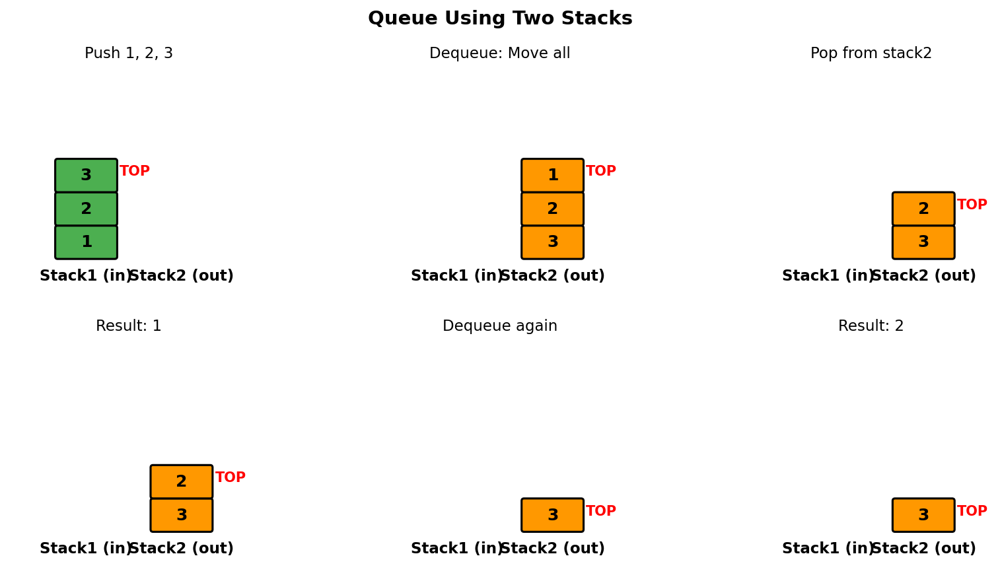
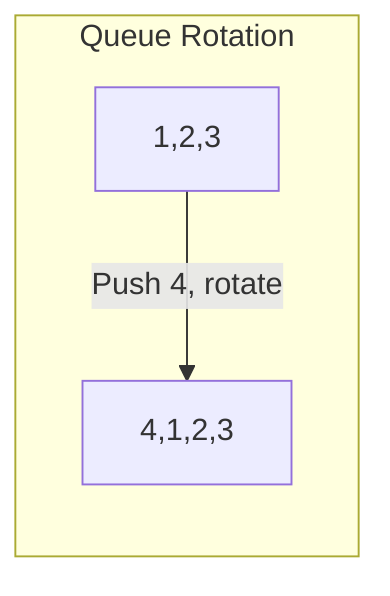
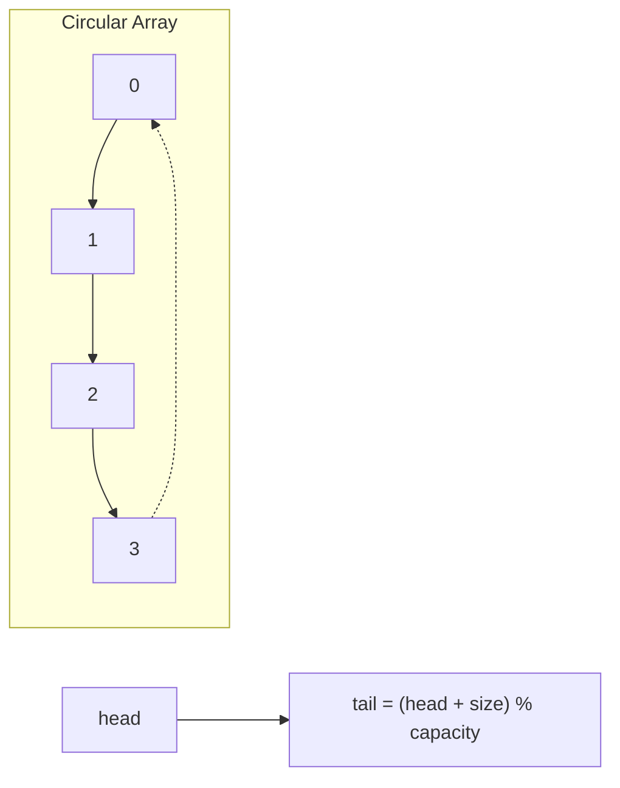
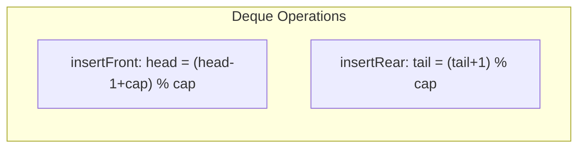
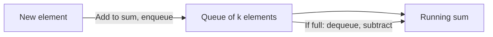

# Implement Queue using Stacks

> **LeetCode 232** | Difficulty: Easy | Pattern: Stack Simulation

---

## Problem Statement

Implement a first in first out (FIFO) queue using only two stacks. The implemented queue should support all the functions of a normal queue (`push`, `peek`, `pop`, and `empty`).

Implement the `MyQueue` class:

- `void push(int x)` - Pushes element x to the back of the queue
- `int pop()` - Removes the element from the front of the queue and returns it
- `int peek()` - Returns the element at the front of the queue
- `boolean empty()` - Returns true if the queue is empty, false otherwise

### Examples

**Example 1:**
```
Input:
["MyQueue", "push", "push", "peek", "pop", "empty"]
[[], [1], [2], [], [], []]

Output: [null, null, null, 1, 1, false]

Explanation:
MyQueue myQueue = new MyQueue();
myQueue.push(1); // queue is: [1]
myQueue.push(2); // queue is: [1, 2]
myQueue.peek();  // return 1
myQueue.pop();   // return 1, queue is [2]
myQueue.empty(); // return false
```

### Constraints

- `1 <= x <= 9`
- At most 100 calls will be made to `push`, `pop`, `peek`, and `empty`
- All the calls to `pop` and `peek` are valid

### Follow-up

Can you implement the queue such that each operation is amortized O(1) time complexity?

---

## Intuition

A stack is LIFO (Last In, First Out), but a queue is FIFO (First In, First Out). To simulate FIFO behavior using LIFO stacks, we need to reverse the order of elements.

**Key Insight**: If you push elements onto stack1 and then pop them all onto stack2, the order is reversed - making stack2 behave like a queue's front!

---

## Stack State Visualization



```
Push 1, 2, 3 to Queue:
  Stack1 (input):  [1, 2, 3]  <- TOP is 3
  Stack2 (output): []

Dequeue (pop from front):
  Step 1: Move all from Stack1 to Stack2
    Stack1: []
    Stack2: [3, 2, 1]  <- TOP is 1 (originally first!)

  Step 2: Pop from Stack2
    Return: 1
    Stack2: [3, 2]

Next Dequeue:
  Stack2 not empty, just pop
  Return: 2
  Stack2: [3]
```

---

## Solution 1: Amortized O(1) Dequeue

::: code-group

```python [Python]
class MyQueue:
    """
    Queue implementation using two stacks.

    Approach: Lazy transfer
    - stack_in: for push operations
    - stack_out: for pop/peek operations
    - Only transfer when stack_out is empty
    """

    def __init__(self):
        self.stack_in = []   # For pushing new elements
        self.stack_out = []  # For popping/peeking (reversed order)

    def push(self, x: int) -> None:
        """Push element to back of queue. O(1)"""
        self.stack_in.append(x)

    def pop(self) -> int:
        """Remove and return front element. Amortized O(1)"""
        self._transfer()
        return self.stack_out.pop()

    def peek(self) -> int:
        """Return front element without removing. Amortized O(1)"""
        self._transfer()
        return self.stack_out[-1]

    def empty(self) -> bool:
        """Check if queue is empty. O(1)"""
        return not self.stack_in and not self.stack_out

    def _transfer(self) -> None:
        """Transfer elements from stack_in to stack_out if needed."""
        if not self.stack_out:
            while self.stack_in:
                self.stack_out.append(self.stack_in.pop())
```

```java [Java]
class MyQueue {
    private Deque<Integer> stackIn;
    private Deque<Integer> stackOut;

    public MyQueue() {
        stackIn = new ArrayDeque<>();
        stackOut = new ArrayDeque<>();
    }

    public void push(int x) {
        stackIn.push(x);
    }

    public int pop() {
        transfer();
        return stackOut.pop();
    }

    public int peek() {
        transfer();
        return stackOut.peek();
    }

    public boolean empty() {
        return stackIn.isEmpty() && stackOut.isEmpty();
    }

    private void transfer() {
        if (stackOut.isEmpty()) {
            while (!stackIn.isEmpty()) stackOut.push(stackIn.pop());
        }
    }
}
```

:::

::: info Complexity: Time Amortized O(1) · Space O(n)
- **Time:** push is O(1); pop/peek are amortized O(1) because each element is moved from stack_in to stack_out exactly once over its lifetime
- **Space:** Both stacks together hold all n elements; at any time, elements are distributed between stack_in and stack_out
:::

### Why Amortized O(1)?

Each element is:
1. Pushed onto `stack_in` once: O(1)
2. Popped from `stack_in` once: O(1)
3. Pushed onto `stack_out` once: O(1)
4. Popped from `stack_out` once: O(1)

Total: 4 operations per element = O(4n) for n elements = O(1) amortized per operation.

---

## Solution 2: O(1) Push, O(n) Pop

```python
class MyQueue:
    """
    Alternative: Make push O(1), pop O(n).
    Transfer on every pop operation.
    """

    def __init__(self):
        self.stack1 = []
        self.stack2 = []

    def push(self, x: int) -> None:
        """O(1) - Just push to stack1"""
        self.stack1.append(x)

    def pop(self) -> int:
        """O(n) - Transfer all, pop, transfer back"""
        # Transfer all to stack2
        while self.stack1:
            self.stack2.append(self.stack1.pop())

        # Pop the front element
        result = self.stack2.pop()

        # Transfer back to stack1
        while self.stack2:
            self.stack1.append(self.stack2.pop())

        return result

    def peek(self) -> int:
        """O(n) - Similar to pop but don't remove"""
        while self.stack1:
            self.stack2.append(self.stack1.pop())

        result = self.stack2[-1]

        while self.stack2:
            self.stack1.append(self.stack2.pop())

        return result

    def empty(self) -> bool:
        return len(self.stack1) == 0
```

::: info Complexity: Time O(1) push, O(n) pop/peek · Space O(n)
- **Time:** push is O(1) append; pop/peek transfer all n elements twice (to stack2 and back) = O(2n) = O(n)
- **Space:** Both stacks combined hold n elements; during transfer, all elements temporarily in stack2
:::

---

## Solution 3: O(n) Push, O(1) Pop

```python
class MyQueue:
    """
    Alternative: Make push O(n), pop O(1).
    Maintain elements in correct queue order in one stack.
    """

    def __init__(self):
        self.stack1 = []
        self.stack2 = []

    def push(self, x: int) -> None:
        """O(n) - Reverse stack, add element, reverse back"""
        # Move all to stack2
        while self.stack1:
            self.stack2.append(self.stack1.pop())

        # Push new element to stack1 (will be at bottom)
        self.stack1.append(x)

        # Move all back from stack2
        while self.stack2:
            self.stack1.append(self.stack2.pop())

    def pop(self) -> int:
        """O(1) - Just pop from stack1"""
        return self.stack1.pop()

    def peek(self) -> int:
        """O(1) - Just peek stack1"""
        return self.stack1[-1]

    def empty(self) -> bool:
        return len(self.stack1) == 0
```

::: info Complexity: Time O(n) push, O(1) pop/peek · Space O(n)
- **Time:** push moves all n elements to stack2, adds new element, moves all back = O(2n) = O(n); pop/peek are O(1) direct access
- **Space:** During push, stack2 temporarily holds all n elements; stack1 always contains elements in queue order
:::

---

## Algorithm Comparison

| Approach | Push | Pop | Peek | Space |
|----------|------|-----|------|-------|
| **Amortized (Lazy Transfer)** | O(1) | Amortized O(1) | Amortized O(1) | O(n) |
| **O(1) Push** | O(1) | O(n) | O(n) | O(n) |
| **O(1) Pop** | O(n) | O(1) | O(1) | O(n) |

**Best Choice**: Amortized approach (Solution 1) - all operations are amortized O(1).

---

## Step-by-Step Walkthrough

For operations: push(1), push(2), peek(), pop(), push(3), pop()

```
Operation: push(1)
  stack_in:  [1]
  stack_out: []

Operation: push(2)
  stack_in:  [1, 2]
  stack_out: []

Operation: peek()
  stack_out empty, transfer!
  stack_in:  []
  stack_out: [2, 1]  <- 1 is at top (front of queue)
  Return: 1

Operation: pop()
  stack_out not empty
  Pop from stack_out
  stack_out: [2]
  Return: 1

Operation: push(3)
  stack_in:  [3]
  stack_out: [2]

Operation: pop()
  stack_out not empty
  Pop from stack_out
  stack_out: []
  Return: 2
```

---

## Complexity Analysis

### Amortized Analysis (Solution 1)

| Operation | Time Complexity | Explanation |
|-----------|----------------|-------------|
| `push` | O(1) | Direct append to stack_in |
| `pop` | Amortized O(1) | Each element transferred at most once |
| `peek` | Amortized O(1) | Same as pop |
| `empty` | O(1) | Check both stacks |

**Space Complexity**: O(n) where n is number of elements in queue

### Worst Case for Single Operation

A single `pop()` can take O(n) if all n elements need to be transferred. But this transfer benefits all subsequent pops until stack_out is empty again.

---

## Edge Cases

```python
# Test cases
def test_queue():
    q = MyQueue()

    # Empty queue
    assert q.empty() == True

    # Single element
    q.push(1)
    assert q.peek() == 1
    assert q.pop() == 1
    assert q.empty() == True

    # Multiple elements
    q.push(1)
    q.push(2)
    q.push(3)
    assert q.pop() == 1  # FIFO order
    assert q.pop() == 2

    # Interleaved operations
    q.push(4)
    assert q.pop() == 3
    assert q.pop() == 4
```

---

## Interview Tips

### What Interviewers Look For

1. **Understanding of data structures**: Stack (LIFO) vs Queue (FIFO)
2. **Amortized analysis**: Explain why lazy transfer gives O(1) amortized
3. **Trade-offs**: Discuss different approaches and their complexities

### Common Follow-up Questions

1. **"How does amortized O(1) work?"**
   - Each element is moved at most twice (into stack_in, into stack_out)
   - Total work is O(2n) for n operations = O(1) per operation

2. **"What if we have many more pushes than pops?"**
   - Lazy transfer is efficient since we don't transfer until needed
   - O(1) pop approach would waste work on every push

3. **"Can you do this with one stack?"**
   - Yes, using recursion (call stack as second stack)
   - But recursion uses O(n) space on call stack

### One Stack Solution (Using Recursion)

```python
class MyQueue:
    def __init__(self):
        self.stack = []

    def push(self, x: int) -> None:
        self.stack.append(x)

    def pop(self) -> int:
        if len(self.stack) == 1:
            return self.stack.pop()

        # Remove top
        top = self.stack.pop()
        # Recursively get bottom element
        result = self.pop()
        # Put top back
        self.stack.append(top)
        return result

    def peek(self) -> int:
        result = self.pop()
        self.push(result)
        return result

    def empty(self) -> bool:
        return len(self.stack) == 0
```

::: info Complexity: Time O(n) pop/peek · Space O(n) including call stack
- **Time:** pop recursively removes and restores n-1 elements = O(n); peek calls pop then push = O(n)
- **Space:** Single stack holds n elements; recursion uses O(n) call stack space during pop operation
:::

---

## Related Problems

::: details Implement Stack using Queues (LeetCode 225)
**Problem:** Implement LIFO stack using only queue operations.

**Key Insight:** Reverse problem. Need to make newest element accessible first - rotate queue on push.



**Approach:** After push, rotate queue n-1 times to put new element at front.

**Complexity:** O(n) push, O(1) pop/top
:::

::: details Design Circular Queue (LeetCode 622)
**Problem:** Implement fixed-size circular queue with array.

**Key Insight:** Use head/tail pointers with modulo arithmetic for wrap-around.



**Approach:** Track head index and count. Tail computed as (head + count) % capacity.

**Complexity:** O(1) all operations
:::

::: details Design Circular Deque (LeetCode 641)
**Problem:** Double-ended queue with add/remove from both front and rear.

**Key Insight:** Extension of circular queue. Front moves backward (with wrap), rear moves forward.



**Approach:** Doubly-linked list or circular array with bidirectional pointer movement.

**Complexity:** O(1) all operations
:::

::: details Moving Average from Data Stream (LeetCode 346)
**Problem:** Calculate moving average of last k elements in stream.

**Key Insight:** Queue maintains window. Sum updates incrementally on add/remove.



**Approach:** Queue for window, track running sum. Average = sum / min(count, k).

**Complexity:** O(1) per call
:::

---

## References

- [LeetCode 232 - Implement Queue using Stacks](https://leetcode.com/problems/implement-queue-using-stacks/)
- [NeetCode Solution](https://neetcode.io/solutions/implement-queue-using-stacks)
- [Amortized Analysis - Wikipedia](https://en.wikipedia.org/wiki/Amortized_analysis)
