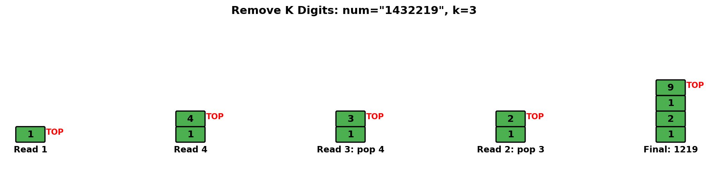
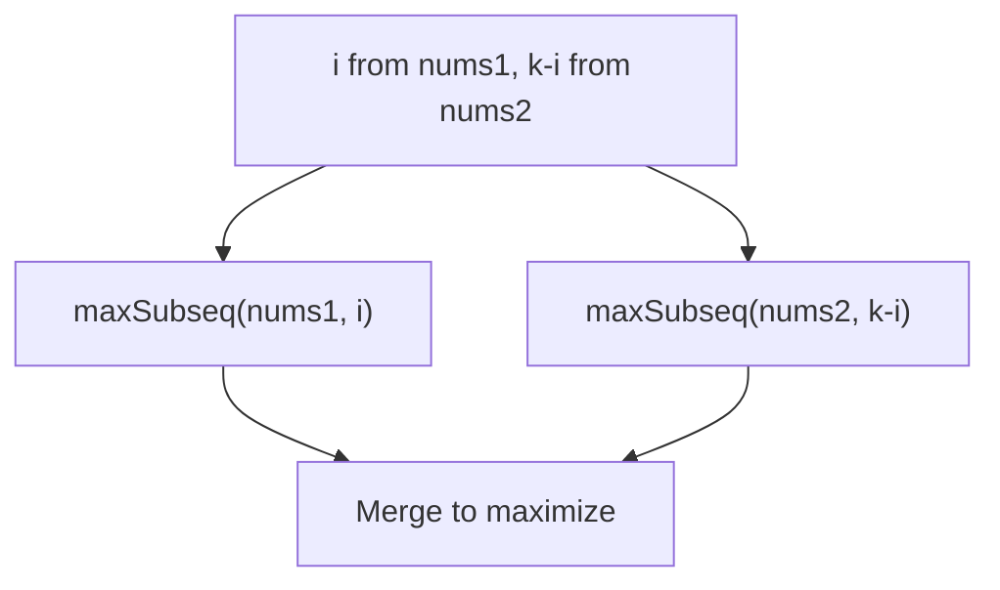
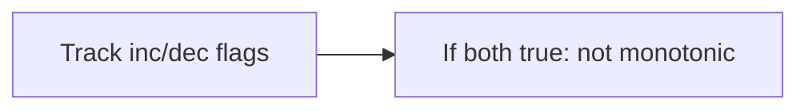
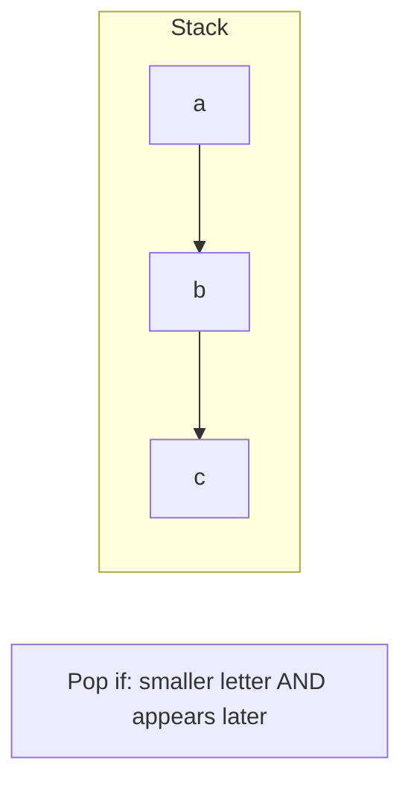
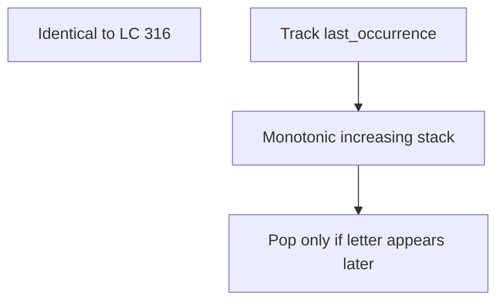

# Remove K Digits

> **LeetCode 402** | Difficulty: Medium | Pattern: Monotonic Stack

---

## Problem Statement

Given string `num` representing a non-negative integer `num`, and an integer `k`, return the smallest possible integer after removing `k` digits from `num`.

### Examples

**Example 1:**
```
Input: num = "1432219", k = 3
Output: "1219"
Explanation: Remove 4, 3, and 2 to form "1219", the smallest possible.
```

**Example 2:**
```
Input: num = "10200", k = 1
Output: "200"
Explanation: Remove the leading 1, result is "0200" which becomes "200".
```

**Example 3:**
```
Input: num = "10", k = 2
Output: "0"
Explanation: Remove both digits, nothing left but "0".
```

### Constraints

- `1 <= k <= num.length <= 10^5`
- `num` consists of only digits
- `num` does not have any leading zeros except for the zero itself

---

## Intuition

To minimize a number, we want smaller digits to appear first. Specifically:
- If we see digits `ab` where `a > b`, removing `a` gives a smaller number
- Remove digits from left that are larger than the next digit

**Key Insight**: Maintain a monotonic **increasing** stack. When current digit is smaller than stack top, pop the larger digit (counts as one removal).

---

## Visualization



For `num = "1432219"`, k = 3:

```
Process '1': stack = ['1']
Process '4': stack = ['1', '4']
Process '3': 3 < 4, pop '4' (k=2), stack = ['1', '3']
Process '2': 2 < 3, pop '3' (k=1), stack = ['1', '2']
Process '2': stack = ['1', '2', '2']
Process '1': 1 < 2, pop '2' (k=0), stack = ['1', '2', '1']
Process '9': stack = ['1', '2', '1', '9']

Result: "1219"
```

---

## Solution

```python
def removeKdigits(num: str, k: int) -> str:
    """
    Remove k digits to form smallest number using monotonic increasing stack.

    Time: O(n) - each digit pushed/popped at most once
    Space: O(n) - stack size
    """
    stack = []

    for digit in num:
        # Pop larger digits (they make the number bigger)
        while k > 0 and stack and stack[-1] > digit:
            stack.pop()
            k -= 1
        stack.append(digit)

    # If k > 0, remove from end (remaining digits are in increasing order)
    if k > 0:
        stack = stack[:-k]

    # Remove leading zeros and handle empty result
    result = ''.join(stack).lstrip('0')

    return result if result else '0'
```

::: info Complexity: Time O(n) · Space O(n)
- **Time:** Each digit is pushed onto the stack at most once and popped at most once, giving O(n) total operations across all iterations
- **Space:** Stack stores at most n digits when no removals occur (e.g., strictly increasing sequence)
:::

---

## Step-by-Step Walkthrough

For `num = "1432219"`, k = 3:

```
Initial: stack = [], k = 3

digit = '1':
  Stack empty, push '1'
  stack = ['1']

digit = '4':
  '4' > '1', just push
  stack = ['1', '4']

digit = '3':
  '3' < '4', pop '4', k = 2
  '3' > '1', push '3'
  stack = ['1', '3']

digit = '2':
  '2' < '3', pop '3', k = 1
  '2' > '1', push '2'
  stack = ['1', '2']

digit = '2':
  '2' == '2', just push
  stack = ['1', '2', '2']

digit = '1':
  '1' < '2', pop '2', k = 0
  Push '1'
  stack = ['1', '2', '1']

digit = '9':
  k = 0, can't pop
  Push '9'
  stack = ['1', '2', '1', '9']

k = 0, no trimming needed
Result = "1219"
```

---

## Why Monotonic Increasing Stack?

Consider number `abc...` where `a > b`:
- Original: `abc...`
- After removing `a`: `bc...`

Since `a > b`, `bc... < ac...`, so removing `a` is beneficial.

By maintaining an increasing stack, we ensure:
1. Larger digits followed by smaller ones are removed
2. We process left-to-right, so leftmost (most significant) digits are optimized first

---

## Edge Cases

```python
def test_remove_k_digits():
    # Remove all digits
    assert removeKdigits("10", 2) == "0"

    # No removal needed (k=0)
    assert removeKdigits("123", 0) == "123"

    # Remove from end (increasing sequence)
    assert removeKdigits("12345", 2) == "123"

    # Remove all but one
    assert removeKdigits("9", 1) == "0"

    # Leading zeros after removal
    assert removeKdigits("10200", 1) == "200"
    assert removeKdigits("10001", 1) == "1"

    # All same digits
    assert removeKdigits("1111", 2) == "11"

    # Decreasing then increasing
    assert removeKdigits("54321", 2) == "321"
```

---

## Alternative: Using List as Stack with Cleanup

```python
def removeKdigits(num: str, k: int) -> str:
    """Alternative with explicit list operations."""
    result = []

    for digit in num:
        while k and result and result[-1] > digit:
            result.pop()
            k -= 1
        result.append(digit)

    # Remove remaining k digits from the end
    result = result[:len(result) - k] if k else result

    # Convert to string and remove leading zeros
    return ''.join(result).lstrip('0') or '0'
```

::: info Complexity: Time O(n) · Space O(n)
- **Time:** Each digit pushed/popped at most once; slicing and joining are O(n) but don't change overall linear complexity
- **Space:** Result list holds at most n elements; lstrip creates a new string of at most n characters
:::

---

## Complexity Analysis

| Aspect | Complexity | Explanation |
|--------|------------|-------------|
| **Time** | O(n) | Each digit pushed and popped at most once |
| **Space** | O(n) | Stack stores up to n digits |

---

## Common Mistakes

1. **Forgetting to remove from end when k > 0**
   ```python
   # Input: "12345", k = 2
   # After loop: stack = ['1', '2', '3', '4', '5'], k = 2
   # Must remove last 2: ['1', '2', '3']
   ```

2. **Not handling leading zeros**
   ```python
   # Input: "10200", k = 1
   # After removal: ['0', '2', '0', '0']
   # Must strip leading zeros: "200"
   ```

3. **Not returning "0" for empty result**
   ```python
   # Input: "10", k = 2
   # After removal: []
   # Must return "0", not ""
   ```

---

## Variations

### 1. Remove K Digits to Get Largest Number

```python
def removeKdigitsLargest(num: str, k: int) -> str:
    """Remove k digits to form largest number."""
    stack = []

    for digit in num:
        # Pop SMALLER digits (opposite of min problem)
        while k > 0 and stack and stack[-1] < digit:
            stack.pop()
            k -= 1
        stack.append(digit)

    if k > 0:
        stack = stack[:-k]

    result = ''.join(stack).lstrip('0')
    return result if result else '0'
```

::: info Complexity: Time O(n) · Space O(n)
- **Time:** Each digit pushed/popped at most once using monotonic decreasing stack (opposite direction from minimum)
- **Space:** Stack stores at most n digits when sequence is strictly decreasing
:::

### 2. Create Maximum Number (LC 321)

Given two arrays, create the maximum number of length k using at most all digits from both arrays.

```python
def maxNumber(nums1: list[int], nums2: list[int], k: int) -> list[int]:
    """
    Select i from nums1, k-i from nums2, merge to maximize.
    """
    def maxSubarray(nums, length):
        """Get max subsequence of given length."""
        drop = len(nums) - length
        stack = []
        for num in nums:
            while drop and stack and stack[-1] < num:
                stack.pop()
                drop -= 1
            stack.append(num)
        return stack[:length]

    def merge(nums1, nums2):
        """Merge two arrays to form largest number."""
        result = []
        while nums1 or nums2:
            if nums1 > nums2:
                result.append(nums1.pop(0))
            else:
                result.append(nums2.pop(0))
        return result

    best = []
    for i in range(max(0, k - len(nums2)), min(len(nums1), k) + 1):
        candidate = merge(maxSubarray(nums1, i), maxSubarray(nums2, k - i))
        if candidate > best:
            best = candidate

    return best
```

::: info Complexity: Time O(k * (m + n + k)) · Space O(m + n)
- **Time:** Try O(k) splits; each maxSubarray is O(m) or O(n); merge is O(k) for comparing/building result
- **Space:** Stack in maxSubarray holds up to min(length, array size); merged result is O(k)
:::

---

## Interview Tips

### What Interviewers Look For

1. **Greedy + Stack Pattern**: Recognize this as monotonic stack
2. **Edge Cases**: Leading zeros, remove all, k = 0
3. **Clean Code**: Handle edge cases without many if-statements

### Common Follow-up Questions

1. **"What if we want to keep exactly k digits instead?"**
   ```python
   # Remove n - k digits instead
   removeKdigits(num, len(num) - k)
   ```

2. **"What if the number can have a leading negative sign?"**
   - Handle sign separately, apply algorithm to absolute value

3. **"How would you minimize a number with at most k removals?"**
   - Same algorithm, but can stop early if we've made enough removals

4. **"What about Create Maximum Number (LC 321)?"**
   - Combine subsequences from two arrays to maximize

---

## Related Problems

::: details Create Maximum Number (LeetCode 321)
**Problem:** Given two arrays, create max number of length k using digits from both (preserving order).

**Key Insight:** Try all splits: i from nums1, k-i from nums2. Get max subsequence from each, merge optimally.



**Approach:** For each valid split, extract max subsequence using monotonic stack, then greedy merge.

**Complexity:** O(k * (m + n + k)) time
:::

::: details Monotonic Array (LeetCode 896)
**Problem:** Check if array is monotonic (entirely non-increasing or non-decreasing).

**Key Insight:** Track if we've seen increase and decrease. Can't have both.



**Approach:** Single pass tracking whether we've seen any increase or decrease.

**Complexity:** O(n) time, O(1) space
:::

::: details Remove Duplicate Letters (LeetCode 316)
**Problem:** Remove duplicates to get smallest lexicographic string with one of each letter.

**Key Insight:** Monotonic increasing stack, but only pop if that letter appears later.



**Approach:** Track last occurrence of each letter. Pop larger letters only if they appear again later.

**Complexity:** O(n) time, O(1) space (26 letters max)
:::

::: details Smallest Subsequence of Distinct Characters (LeetCode 1081)
**Problem:** Same as Remove Duplicate Letters - smallest lexicographic string with unique characters.

**Key Insight:** Identical problem. Monotonic stack with last occurrence tracking.



**Approach:** Same algorithm as LC 316. Stack + seen set + last occurrence map.

**Complexity:** O(n) time, O(1) space
:::

---

## Remove Duplicate Letters (Similar Pattern)

```python
def removeDuplicateLetters(s: str) -> str:
    """
    Return smallest lexicographic string with each letter once.
    Uses monotonic increasing stack with additional constraints.
    """
    last_occurrence = {c: i for i, c in enumerate(s)}
    stack = []
    seen = set()

    for i, c in enumerate(s):
        if c in seen:
            continue

        # Pop if: current is smaller AND we'll see the popped char again
        while stack and c < stack[-1] and last_occurrence[stack[-1]] > i:
            seen.remove(stack.pop())

        stack.append(c)
        seen.add(c)

    return ''.join(stack)
```

::: info Complexity: Time O(n) · Space O(n)
- **Time:** Single pass through string; each character pushed/popped at most once from stack
- **Space:** Stack stores at most 26 characters (unique letters); last_occurrence dict is O(26); seen set is O(26)
:::

---

## References

- [LeetCode 402 - Remove K Digits](https://leetcode.com/problems/remove-k-digits/)
- [NeetCode Solution](https://neetcode.io/solutions/remove-k-digits)
- [Monotonic Stack Guide](https://leetcode.com/discuss/study-guide/5148505/monotonic-stack-guide)
