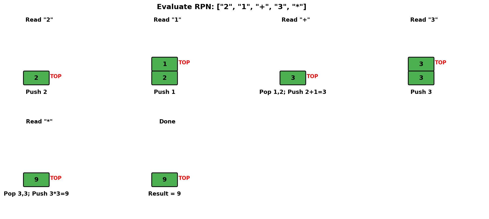
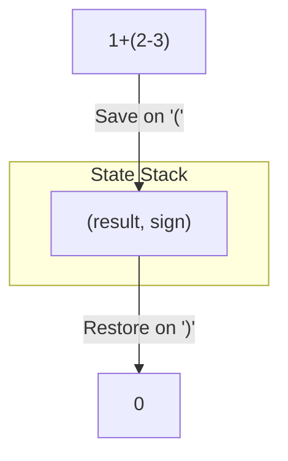
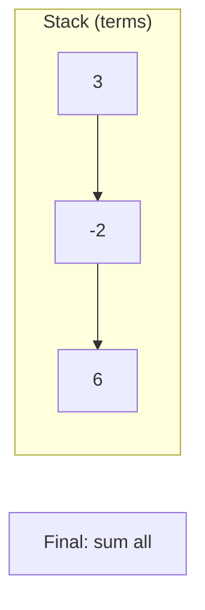
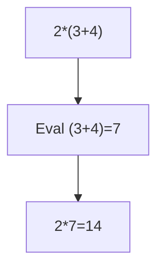
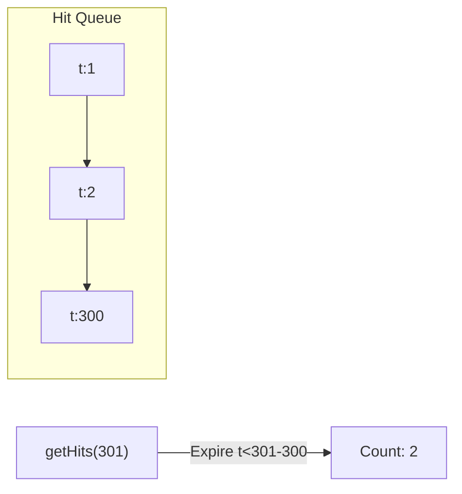

# Evaluate Reverse Polish Notation

> **LeetCode 150** | Difficulty: Medium | Pattern: Stack Evaluation

---

## Problem Statement

You are given an array of strings `tokens` that represents an arithmetic expression in **Reverse Polish Notation** (RPN).

Evaluate the expression. Return an integer that represents the value of the expression.

**Note:**
- The valid operators are `'+'`, `'-'`, `'*'`, and `'/'`
- Each operand may be an integer or another expression
- The division between two integers always truncates toward zero
- There will not be any division by zero
- The input represents a valid RPN expression
- The answer and all intermediate calculations fit in a 32-bit signed integer

### What is Reverse Polish Notation?

RPN (postfix notation) places operators after their operands. No parentheses are needed.

```
Infix:   (2 + 1) * 3
RPN:     2 1 + 3 *

Infix:   4 + 13 / 5
RPN:     4 13 5 / +
```

### Examples

**Example 1:**
```
Input: tokens = ["2","1","+","3","*"]
Output: 9
Explanation: ((2 + 1) * 3) = 9
```

**Example 2:**
```
Input: tokens = ["4","13","5","/","+"]
Output: 6
Explanation: (4 + (13 / 5)) = 6
```

**Example 3:**
```
Input: tokens = ["10","6","9","3","+","-11","*","/","*","17","+","5","+"]
Output: 22
Explanation:
  ((10 * (6 / ((9 + 3) * -11))) + 17) + 5
= ((10 * (6 / (12 * -11))) + 17) + 5
= ((10 * (6 / -132)) + 17) + 5
= ((10 * 0) + 17) + 5
= 22
```

### Constraints

- `1 <= tokens.length <= 10^4`
- `tokens[i]` is either an operator or an integer in range `[-200, 200]`

---

## Intuition

RPN is designed for stack-based evaluation:
1. When we see a **number**, push it onto the stack
2. When we see an **operator**, pop two operands, apply the operator, push the result

**Key Insight**: The stack naturally handles operator precedence and parentheses - they're encoded in the token order!

---

## Stack State Visualization



For `["2", "1", "+", "3", "*"]`:

```
Token "2":
  Push 2
  Stack: [2]

Token "1":
  Push 1
  Stack: [2, 1]

Token "+":
  Pop 1, Pop 2
  Calculate: 2 + 1 = 3
  Push 3
  Stack: [3]

Token "3":
  Push 3
  Stack: [3, 3]

Token "*":
  Pop 3, Pop 3
  Calculate: 3 * 3 = 9
  Push 9
  Stack: [9]

Result: 9
```

---

## Solution

```python
def evalRPN(tokens: list[str]) -> int:
    """
    Evaluate Reverse Polish Notation expression.

    Time: O(n) - process each token once
    Space: O(n) - stack can hold up to n/2 operands
    """
    stack = []
    operators = {
        '+': lambda a, b: a + b,
        '-': lambda a, b: a - b,
        '*': lambda a, b: a * b,
        '/': lambda a, b: int(a / b)  # Truncate toward zero
    }

    for token in tokens:
        if token in operators:
            # Pop operands (order matters for - and /)
            b = stack.pop()  # Second operand (popped first)
            a = stack.pop()  # First operand
            result = operators[token](a, b)
            stack.append(result)
        else:
            # It's a number
            stack.append(int(token))

    return stack[0]
```

::: info Complexity: Time O(n) · Space O(n)
- **Time:** Process each token exactly once; all stack/dictionary operations are O(1)
- **Space:** Stack holds at most (n+1)/2 operands in worst case (all numbers pushed before any operator)
:::

### Why `int(a / b)` for Division?

Python's `//` operator floors toward negative infinity, but we need truncation toward zero:

```python
# Python // behavior
7 // -3   # = -3 (floor)
-7 // 3   # = -3 (floor)

# We need truncation toward zero
int(7 / -3)   # = -2 (truncate)
int(-7 / 3)   # = -2 (truncate)
```

---

## Alternative Solutions

### Using If-Else

```python
def evalRPN(tokens: list[str]) -> int:
    stack = []

    for token in tokens:
        if token == '+':
            b, a = stack.pop(), stack.pop()
            stack.append(a + b)
        elif token == '-':
            b, a = stack.pop(), stack.pop()
            stack.append(a - b)
        elif token == '*':
            b, a = stack.pop(), stack.pop()
            stack.append(a * b)
        elif token == '/':
            b, a = stack.pop(), stack.pop()
            stack.append(int(a / b))
        else:
            stack.append(int(token))

    return stack[0]
```

::: info Complexity: Time O(n) · Space O(n)
- **Time:** Single pass through tokens; each operator/operand processed in O(1)
- **Space:** Stack size bounded by (n+1)/2 where n is token count (valid RPN has more operands than operators by 1)
:::

### Using eval() (Not Recommended for Interviews)

```python
def evalRPN(tokens: list[str]) -> int:
    stack = []

    for token in tokens:
        if token in '+-*/':
            b, a = stack.pop(), stack.pop()
            if token == '/':
                stack.append(int(a / b))
            else:
                stack.append(eval(f'{a}{token}{b}'))
        else:
            stack.append(int(token))

    return stack[0]
```

::: info Complexity: Time O(n) · Space O(n)
- **Time:** Each token processed once; eval() adds negligible overhead for simple expressions
- **Space:** Stack stores at most (n+1)/2 intermediate results
:::

---

## Step-by-Step Walkthrough

For `["4", "13", "5", "/", "+"]`:

```
Initial: stack = []

Token "4":
  Is "4" an operator? No
  Push int("4") = 4
  stack = [4]

Token "13":
  Is "13" an operator? No
  Push int("13") = 13
  stack = [4, 13]

Token "5":
  Is "5" an operator? No
  Push int("5") = 5
  stack = [4, 13, 5]

Token "/":
  Is "/" an operator? Yes
  b = pop() = 5
  a = pop() = 13
  result = int(13 / 5) = 2
  Push 2
  stack = [4, 2]

Token "+":
  Is "+" an operator? Yes
  b = pop() = 2
  a = pop() = 4
  result = 4 + 2 = 6
  Push 6
  stack = [6]

Done! Return stack[0] = 6
```

---

## Complexity Analysis

| Aspect | Complexity | Explanation |
|--------|------------|-------------|
| **Time** | O(n) | Process each token once |
| **Space** | O(n) | Stack holds at most (n+1)/2 operands |

### Space Analysis

- In valid RPN, if there are `n` tokens:
  - Operators: (n-1)/2
  - Operands: (n+1)/2
- Maximum stack size: (n+1)/2 (when all operands pushed before any operator)

---

## Edge Cases

```python
def test_eval_rpn():
    # Single number
    assert evalRPN(["42"]) == 42

    # Negative numbers
    assert evalRPN(["-5", "3", "+"]) == -2

    # Division truncates toward zero
    assert evalRPN(["7", "-3", "/"]) == -2   # Not -3
    assert evalRPN(["-7", "3", "/"]) == -2   # Not -3

    # Complex expression
    assert evalRPN(["10", "6", "9", "3", "+", "-11", "*", "/", "*", "17", "+", "5", "+"]) == 22

    # All same operator
    assert evalRPN(["1", "2", "+", "3", "+", "4", "+"]) == 10
```

---

## Converting Infix to RPN (Shunting Yard Algorithm)

```python
def infixToRPN(expression: str) -> list[str]:
    """
    Convert infix expression to RPN using Shunting Yard algorithm.
    Example: "3 + 4 * 2" -> ["3", "4", "2", "*", "+"]
    """
    precedence = {'+': 1, '-': 1, '*': 2, '/': 2}
    output = []
    operator_stack = []

    tokens = expression.split()

    for token in tokens:
        if token.lstrip('-').isdigit():  # Number (including negative)
            output.append(token)
        elif token in precedence:  # Operator
            while (operator_stack and
                   operator_stack[-1] != '(' and
                   operator_stack[-1] in precedence and
                   precedence[operator_stack[-1]] >= precedence[token]):
                output.append(operator_stack.pop())
            operator_stack.append(token)
        elif token == '(':
            operator_stack.append(token)
        elif token == ')':
            while operator_stack and operator_stack[-1] != '(':
                output.append(operator_stack.pop())
            operator_stack.pop()  # Remove '('

    while operator_stack:
        output.append(operator_stack.pop())

    return output
```

::: info Complexity: Time O(n) · Space O(n)
- **Time:** Each token processed once; stack operations are O(1); total work proportional to input length
- **Space:** Operator stack can hold up to n/2 operators; output list holds all tokens
:::

---

## Interview Tips

### What Interviewers Look For

1. **Stack Usage**: Natural fit for RPN evaluation
2. **Operator Order**: Remember second operand is popped first
3. **Division Behavior**: Truncation toward zero, not floor

### Common Follow-up Questions

1. **"How would you handle more operators like ^?"**
   ```python
   operators = {
       '+': lambda a, b: a + b,
       '-': lambda a, b: a - b,
       '*': lambda a, b: a * b,
       '/': lambda a, b: int(a / b),
       '^': lambda a, b: a ** b
   }
   ```

2. **"How would you convert infix to RPN?"**
   - Use Shunting Yard algorithm (shown above)
   - Handle parentheses and operator precedence

3. **"How would you evaluate infix directly?"**
   - Use two stacks: one for operands, one for operators
   - This is Basic Calculator problem

4. **"What if the expression is invalid?"**
   - Check stack has exactly one element at end
   - Catch exceptions for insufficient operands

### Error Handling

```python
def evalRPN_safe(tokens: list[str]) -> int:
    stack = []
    operators = {'+', '-', '*', '/'}

    for token in tokens:
        if token in operators:
            if len(stack) < 2:
                raise ValueError("Invalid expression: insufficient operands")
            b, a = stack.pop(), stack.pop()
            if token == '/' and b == 0:
                raise ValueError("Division by zero")
            # ... rest of evaluation
        else:
            try:
                stack.append(int(token))
            except ValueError:
                raise ValueError(f"Invalid token: {token}")

    if len(stack) != 1:
        raise ValueError("Invalid expression: extra operands")

    return stack[0]
```

::: info Complexity: Time O(n) · Space O(n)
- **Time:** Same as basic solution; additional validation checks are O(1) per token
- **Space:** Stack size bounded by number of operands; error checking uses O(1) extra
:::

---

## Why RPN?

1. **No Parentheses Needed**: Order of operations is explicit
2. **Simple to Evaluate**: Just a stack and O(n) time
3. **Used in Calculators**: HP calculators use RPN
4. **Compiler Intermediate**: Many compilers use postfix for expression evaluation

---

## Related Problems

::: details Basic Calculator (LeetCode 224)
**Problem:** Evaluate infix expression with +, -, and parentheses.

**Key Insight:** Stack saves state (result, sign) on '(', restores and combines on ')'.



**Approach:** Track running result and current sign. Push state on '(', pop and apply on ')'.

**Complexity:** O(n) time, O(n) space
:::

::: details Basic Calculator II (LeetCode 227)
**Problem:** Evaluate infix expression with +, -, *, / (no parentheses).

**Key Insight:** Handle precedence: * and / apply immediately to stack top, + and - defer.



**Approach:** Stack stores signed terms. Multiply/divide modify top. Sum stack at end.

**Complexity:** O(n) time, O(n) space
:::

::: details Basic Calculator III (LeetCode 772)
**Problem:** Evaluate infix with all operators and parentheses.

**Key Insight:** Combine precedence handling (like II) with recursion for parentheses (like I).



**Approach:** Recursive helper for parenthesized subexpressions. Stack for operator precedence.

**Complexity:** O(n) time, O(n) space
:::

::: details Design Hit Counter (LeetCode 362)
**Problem:** Count hits in past 5 minutes for a logging system.

**Key Insight:** Queue or circular buffer with timestamp-based expiration.



**Approach:** Queue stores timestamps. On query, dequeue expired hits, return queue size.

**Complexity:** O(1) amortized hit, O(n) getHits worst case
:::

---

## References

- [LeetCode 150 - Evaluate Reverse Polish Notation](https://leetcode.com/problems/evaluate-reverse-polish-notation/)
- [NeetCode Solution](https://neetcode.io/solutions/evaluate-reverse-polish-notation)
- [Reverse Polish Notation - Wikipedia](https://en.wikipedia.org/wiki/Reverse_Polish_notation)
- [Shunting Yard Algorithm](https://en.wikipedia.org/wiki/Shunting_yard_algorithm)
