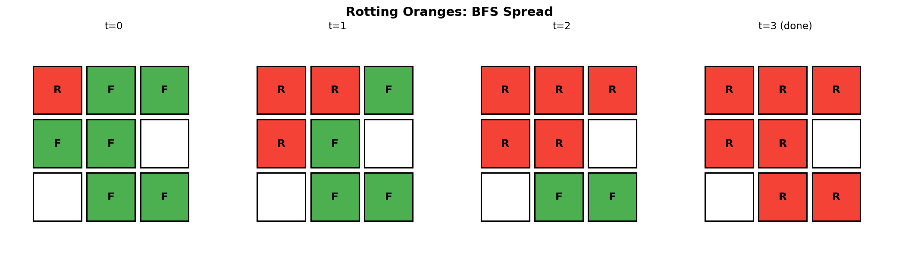
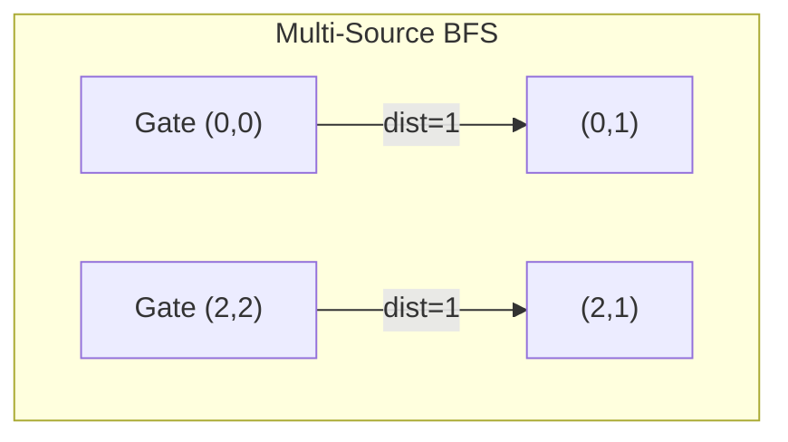
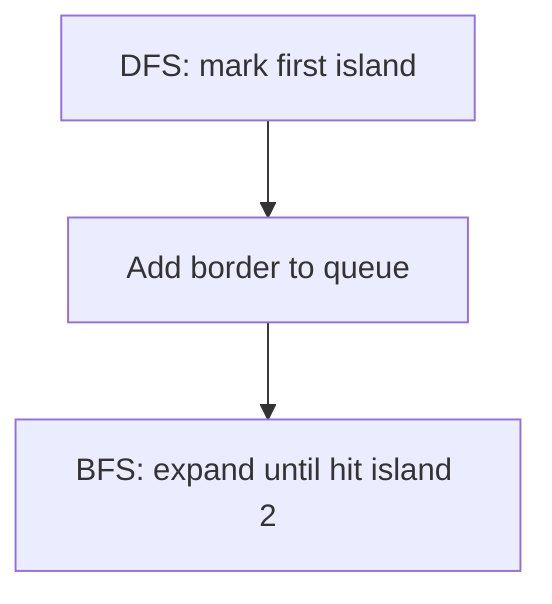
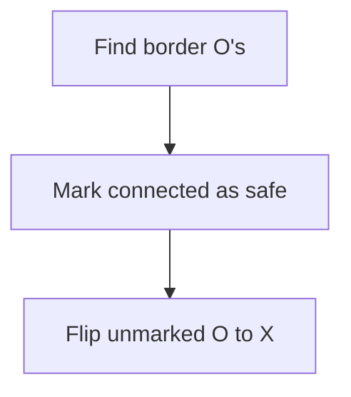
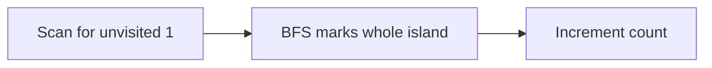

# Rotting Oranges

> **LeetCode 994** | Difficulty: Medium | Pattern: BFS Queue / Multi-Source BFS

---

## Problem Statement

You are given an `m x n` grid where each cell can have one of three values:
- `0` representing an empty cell
- `1` representing a fresh orange
- `2` representing a rotten orange

Every minute, any fresh orange that is **4-directionally adjacent** to a rotten orange becomes rotten.

Return the minimum number of minutes that must elapse until no cell has a fresh orange. If this is impossible, return `-1`.

### Examples

**Example 1:**
```
Input: grid = [[2,1,1],[1,1,0],[0,1,1]]
Output: 4

Initial:        After 1 min:    After 2 min:
2 1 1           2 2 1           2 2 2
1 1 0    ->     2 1 0    ->     2 2 0    -> ...
0 1 1           0 1 1           0 1 1
```

**Example 2:**
```
Input: grid = [[2,1,1],[0,1,1],[1,0,1]]
Output: -1
Explanation: The orange in the bottom left corner is never reached.
```

**Example 3:**
```
Input: grid = [[0,2]]
Output: 0
Explanation: No fresh oranges to rot.
```

### Constraints

- `m == grid.length`
- `n == grid[i].length`
- `1 <= m, n <= 10`
- `grid[i][j]` is `0`, `1`, or `2`

---

## Intuition

This is a **Multi-Source BFS** problem. All rotten oranges spread simultaneously, like ripples from multiple stones dropped in water.

**Key Insight**: Start BFS from ALL rotten oranges at once. Track the time (level) when each fresh orange becomes rotten.

---

## Visualization



```
Initial Grid:
2 1 1
1 1 0
0 1 1

t=0: Rotten = {(0,0)}

t=1: (0,0) rots (0,1) and (1,0)
2 2 1
2 1 0
0 1 1

t=2: (0,1) rots (0,2), (1,0) rots (1,1)
2 2 2
2 2 0
0 1 1

t=3: (1,1) rots (2,1)
2 2 2
2 2 0
0 2 1

t=4: (2,1) rots (2,2)
2 2 2
2 2 0
0 2 2

All fresh oranges rotted in 4 minutes.
```

---

## Solution: Multi-Source BFS

::: code-group

```python [Python]
from collections import deque

def orangesRotting(grid: list[list[int]]) -> int:
    """
    Multi-source BFS from all rotten oranges.

    Time: O(m * n) - visit each cell at most once
    Space: O(m * n) - queue can hold all cells
    """
    rows, cols = len(grid), len(grid[0])
    queue = deque()
    fresh_count = 0

    # Find all rotten oranges and count fresh ones
    for r in range(rows):
        for c in range(cols):
            if grid[r][c] == 2:
                queue.append((r, c))
            elif grid[r][c] == 1:
                fresh_count += 1

    # No fresh oranges to rot
    if fresh_count == 0:
        return 0

    directions = [(0, 1), (0, -1), (1, 0), (-1, 0)]
    minutes = 0

    while queue:
        minutes += 1
        # Process all oranges at current time level
        for _ in range(len(queue)):
            r, c = queue.popleft()

            for dr, dc in directions:
                nr, nc = r + dr, c + dc

                if (0 <= nr < rows and 0 <= nc < cols and
                    grid[nr][nc] == 1):
                    grid[nr][nc] = 2  # Mark as rotten
                    fresh_count -= 1
                    queue.append((nr, nc))

        # Check if all fresh oranges rotted
        if fresh_count == 0:
            return minutes

    # Some fresh oranges unreachable
    return -1
```

```java [Java]
public int orangesRotting(int[][] grid) {
    int rows = grid.length, cols = grid[0].length;
    Deque<int[]> queue = new ArrayDeque<>();
    int freshCount = 0;

    for (int r = 0; r < rows; r++) {
        for (int c = 0; c < cols; c++) {
            if (grid[r][c] == 2) queue.offer(new int[]{r, c});
            else if (grid[r][c] == 1) freshCount++;
        }
    }

    if (freshCount == 0) return 0;

    int[][] dirs = {{0,1},{0,-1},{1,0},{-1,0}};
    int minutes = 0;

    while (!queue.isEmpty()) {
        minutes++;
        int size = queue.size();
        for (int i = 0; i < size; i++) {
            int[] cell = queue.poll();
            for (int[] d : dirs) {
                int nr = cell[0] + d[0], nc = cell[1] + d[1];
                if (nr >= 0 && nr < rows && nc >= 0 && nc < cols && grid[nr][nc] == 1) {
                    grid[nr][nc] = 2;
                    freshCount--;
                    queue.offer(new int[]{nr, nc});
                }
            }
        }
        if (freshCount == 0) return minutes;
    }

    return -1;
}
```

:::

::: info Complexity: Time O(m * n) · Space O(m * n)
- **Time:** Initial scan is O(m*n); BFS visits each cell at most once; each cell enqueued/dequeued at most once
- **Space:** Queue can hold all cells in worst case (e.g., all initially rotten spreading simultaneously)
:::

---

## Alternative: Track Time per Orange

```python
from collections import deque

def orangesRotting(grid: list[list[int]]) -> int:
    """
    Alternative: Include time in queue tuple.
    """
    rows, cols = len(grid), len(grid[0])
    queue = deque()
    fresh_count = 0

    for r in range(rows):
        for c in range(cols):
            if grid[r][c] == 2:
                queue.append((r, c, 0))  # (row, col, time)
            elif grid[r][c] == 1:
                fresh_count += 1

    if fresh_count == 0:
        return 0

    directions = [(0, 1), (0, -1), (1, 0), (-1, 0)]
    max_time = 0

    while queue:
        r, c, time = queue.popleft()
        max_time = max(max_time, time)

        for dr, dc in directions:
            nr, nc = r + dr, c + dc

            if (0 <= nr < rows and 0 <= nc < cols and
                grid[nr][nc] == 1):
                grid[nr][nc] = 2
                fresh_count -= 1
                queue.append((nr, nc, time + 1))

    return max_time if fresh_count == 0 else -1
```

::: info Complexity: Time O(m * n) · Space O(m * n)
- **Time:** Each cell processed at most once; storing time in tuple doesn't affect asymptotic complexity
- **Space:** Queue stores (row, col, time) tuples; at most m*n entries; tuple overhead is O(1) per entry
:::

---

## Step-by-Step Walkthrough

For grid `[[2,1,1],[1,1,0],[0,1,1]]`:

```
Initial:
  queue = [(0,0)]  # Rotten orange at (0,0)
  fresh_count = 6

Minute 1:
  Process (0,0):
    - (0,1) is fresh, rot it, add to queue
    - (1,0) is fresh, rot it, add to queue
  queue = [(0,1), (1,0)]
  fresh_count = 4
  Grid:
    2 2 1
    2 1 0
    0 1 1

Minute 2:
  Process (0,1): rot (0,2)
  Process (1,0): rot (1,1)
  queue = [(0,2), (1,1)]
  fresh_count = 2
  Grid:
    2 2 2
    2 2 0
    0 1 1

Minute 3:
  Process (0,2): no fresh neighbors
  Process (1,1): rot (2,1)
  queue = [(2,1)]
  fresh_count = 1
  Grid:
    2 2 2
    2 2 0
    0 2 1

Minute 4:
  Process (2,1): rot (2,2)
  queue = [(2,2)]
  fresh_count = 0
  Return 4
```

---

## Complexity Analysis

| Aspect | Complexity | Explanation |
|--------|------------|-------------|
| **Time** | O(m * n) | Visit each cell at most once |
| **Space** | O(m * n) | Queue can hold all cells in worst case |

---

## Edge Cases

```python
def test_rotting_oranges():
    # No fresh oranges
    assert orangesRotting([[2, 0], [0, 2]]) == 0
    assert orangesRotting([[0]]) == 0

    # No rotten oranges but fresh exist
    assert orangesRotting([[1, 1], [1, 1]]) == -1

    # Single rotten, no fresh
    assert orangesRotting([[2]]) == 0

    # All already rotten
    assert orangesRotting([[2, 2], [2, 2]]) == 0

    # Isolated fresh orange
    assert orangesRotting([[2, 1, 1], [0, 1, 1], [1, 0, 1]]) == -1

    # Linear spread
    assert orangesRotting([[2, 1, 1, 1, 1]]) == 4
```

---

## Why BFS, Not DFS?

**BFS** processes level by level, naturally tracking the minimum time for each orange to rot.

**DFS** would explore one path fully before backtracking, making it harder to track simultaneous rotting.

```
BFS (correct):          DFS (wrong approach):
Level 0: Source         Explore one path first
Level 1: All at dist 1  Would give non-optimal times
Level 2: All at dist 2
...
```

---

## Common Mistakes

1. **Forgetting to check fresh_count initially**
   ```python
   if fresh_count == 0:
       return 0  # No fresh oranges to rot
   ```

2. **Off-by-one in minute counting**
   ```python
   # Increment minutes at start of each level
   # Or track time with each orange in queue
   ```

3. **Not checking all rotten oranges initially**
   ```python
   # Must add ALL rotten oranges to queue, not just one
   ```

4. **Modifying grid while iterating**
   ```python
   # Mark as rotten immediately to prevent revisiting
   grid[nr][nc] = 2
   ```

---

## Interview Tips

### What Interviewers Look For

1. **BFS Recognition**: Identify multi-source BFS pattern
2. **Level Tracking**: Properly count time/minutes
3. **Edge Cases**: No fresh, no rotten, isolated cells

### Common Follow-up Questions

1. **"What if rotting spreads at different speeds?"**
   - Use priority queue (Dijkstra's-like approach)
   - Each rotten orange has a "speed" attribute

2. **"What about 8-directional spread?"**
   ```python
   directions = [
       (0, 1), (0, -1), (1, 0), (-1, 0),
       (1, 1), (1, -1), (-1, 1), (-1, -1)
   ]
   ```

3. **"Return the order oranges rot?"**
   ```python
   def rottingOrder(grid):
       order = []
       # Track when each orange rots
       while queue:
           r, c, time = queue.popleft()
           if grid[r][c] == 1:  # Was fresh
               order.append(((r, c), time))
           # ... rest of BFS
       return order
   ```

4. **"What if we can place one additional rotten orange?"**
   - Try placing at each fresh position
   - Run BFS for each, find minimum time

---

## Similar Multi-Source BFS Problems

| Problem | Sources | Goal |
|---------|---------|------|
| **Rotting Oranges** | All rotten oranges | Time to rot all |
| **Walls and Gates (LC 286)** | All gates | Distance to nearest gate |
| **01 Matrix (LC 542)** | All 0s | Distance to nearest 0 |
| **Shortest Bridge (LC 934)** | One island | Distance to other island |

---

## 01 Matrix (Similar Pattern)

```python
def updateMatrix(mat: list[list[int]]) -> list[list[int]]:
    """
    Find distance to nearest 0 for each cell.
    Multi-source BFS from all 0s.
    """
    rows, cols = len(mat), len(mat[0])
    queue = deque()

    for r in range(rows):
        for c in range(cols):
            if mat[r][c] == 0:
                queue.append((r, c))
            else:
                mat[r][c] = float('inf')  # Mark as unvisited

    directions = [(0, 1), (0, -1), (1, 0), (-1, 0)]

    while queue:
        r, c = queue.popleft()
        for dr, dc in directions:
            nr, nc = r + dr, c + dc
            if 0 <= nr < rows and 0 <= nc < cols:
                if mat[nr][nc] > mat[r][c] + 1:
                    mat[nr][nc] = mat[r][c] + 1
                    queue.append((nr, nc))

    return mat
```

::: info Complexity: Time O(m * n) · Space O(m * n)
- **Time:** Initial scan is O(m*n); BFS visits each cell at most once to update distance
- **Space:** Queue can hold all cells; modifies input matrix in-place for distances
:::

---

## Related Problems

::: details Walls and Gates (LeetCode 286)
**Problem:** Fill each empty room with distance to nearest gate (0). Walls are -1.

**Key Insight:** Multi-source BFS from all gates. Spread outward, first visit = shortest distance.



**Approach:** Initialize queue with all gates. BFS fills rooms with distance level.

**Complexity:** O(mn) time, O(mn) space
:::

::: details 01 Matrix (LeetCode 542)
**Problem:** Return matrix where each cell contains distance to nearest 0.

**Key Insight:** Same as Walls and Gates. Multi-source BFS from all 0s.


**Approach:** Initialize all 0s in queue, all 1s as infinity. BFS updates distances.

**Complexity:** O(mn) time, O(mn) space
:::

::: details Shortest Bridge (LeetCode 934)
**Problem:** Find minimum flips to connect two islands (1s) in binary matrix.

**Key Insight:** DFS to find one island, BFS to expand toward other island.



**Approach:** DFS marks first island and queues its boundary. BFS expands until reaching second island.

**Complexity:** O(mn) time, O(mn) space
:::

::: details Surrounded Regions (LeetCode 130)
**Problem:** Capture all 'O' regions completely surrounded by 'X' (not touching border).

**Key Insight:** Border-connected 'O's survive. BFS/DFS from border 'O's, flip the rest.



**Approach:** BFS/DFS from border 'O's marking as safe. Then flip all unmarked 'O' to 'X'.

**Complexity:** O(mn) time, O(mn) space
:::

::: details Number of Islands (LeetCode 200)
**Problem:** Count number of islands (connected 1s) in grid.

**Key Insight:** Classic BFS/DFS flood fill. Count number of times we start a new traversal.



**Approach:** For each unvisited 1, BFS/DFS to mark entire island, increment count.

**Complexity:** O(mn) time, O(mn) space
:::

---

## References

- [LeetCode 994 - Rotting Oranges](https://leetcode.com/problems/rotting-oranges/)
- [NeetCode Solution](https://neetcode.io/solutions/rotting-oranges)
- [Multi-Source BFS Pattern](https://leetcode.com/discuss/study-guide/1727849/BFS-guide)
