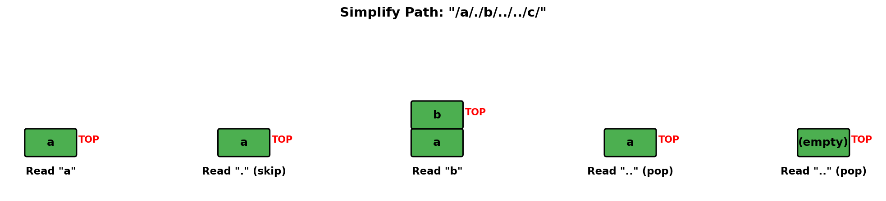
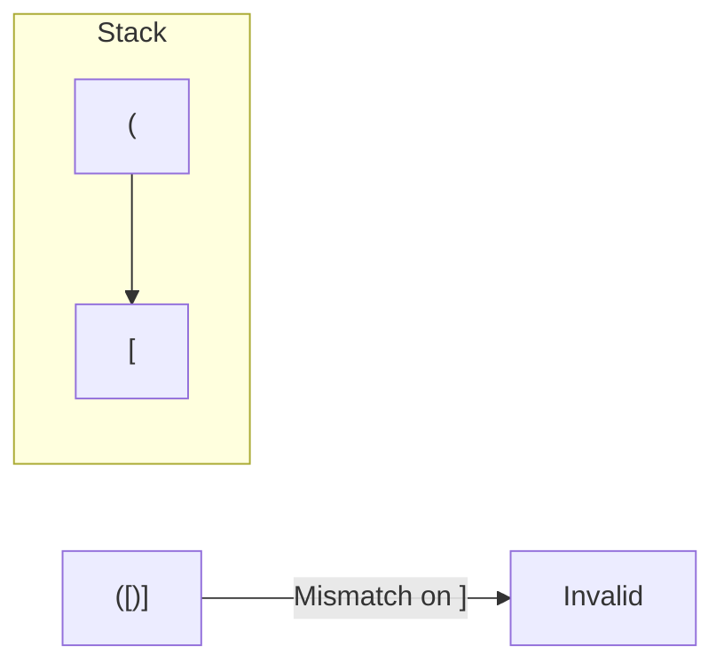
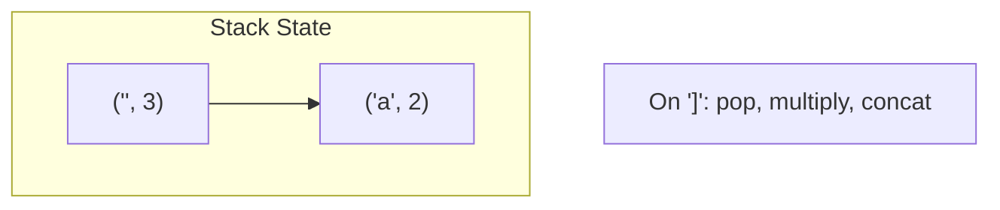
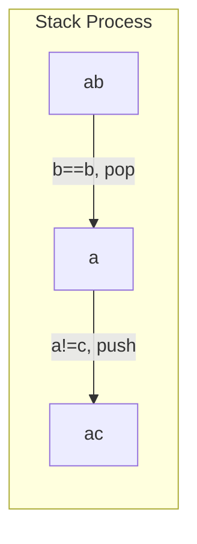
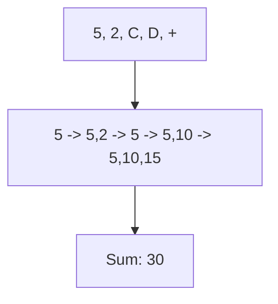

# Simplify Path

> **LeetCode 71** | Difficulty: Medium | Pattern: Stack Processing

---

## Problem Statement

Given a string `path`, which is an **absolute path** (starting with a slash `'/'`) to a file or directory in a Unix-style file system, convert it to the simplified **canonical path**.

In a Unix-style file system:
- A period `'.'` refers to the current directory
- A double period `'..'` refers to the parent directory
- Multiple consecutive slashes `'//'` are treated as a single slash `'/'`

The canonical path should:
- Start with a single slash `'/'`
- Not end with a trailing slash (unless it's the root)
- Not have any `.` or `..` segments
- Directories are separated by a single `/`

### Examples

**Example 1:**
```
Input: path = "/home/"
Output: "/home"
```

**Example 2:**
```
Input: path = "/../"
Output: "/"
Explanation: Going one level up from root still results in root
```

**Example 3:**
```
Input: path = "/home//foo/"
Output: "/home/foo"
Explanation: Multiple slashes are treated as one
```

**Example 4:**
```
Input: path = "/a/./b/../../c/"
Output: "/c"
```

### Constraints

- `1 <= path.length <= 3000`
- `path` consists of English letters, digits, period `.`, slash `/` or underscore `_`
- `path` is a valid absolute Unix path

---

## Intuition

Process path components one by one:
- Skip empty components and `.` (current directory)
- For `..`, pop the last directory (go up)
- For other names, push to stack

**Key Insight**: Use a stack to track the directory hierarchy. `..` pops, valid names push.

---

## Visualization



For path `/a/./b/../../c/`:

```
Split: ['a', '.', 'b', '..', '..', 'c']

Process 'a':  stack = ['a']
Process '.':  skip (current dir)
Process 'b':  stack = ['a', 'b']
Process '..': pop, stack = ['a']
Process '..': pop, stack = []
Process 'c':  stack = ['c']

Result: '/c'
```

---

## Solution

::: code-group

```python [Python]
def simplifyPath(path: str) -> str:
    """
    Simplify Unix-style path using stack.

    Time: O(n) - process each character once
    Space: O(n) - stack can hold all components
    """
    stack = []

    # Split by '/' - handles multiple slashes
    components = path.split('/')

    for component in components:
        if component == '' or component == '.':
            # Empty (from '//' or trailing /) or current dir - skip
            continue
        elif component == '..':
            # Parent directory - go up if possible
            if stack:
                stack.pop()
        else:
            # Valid directory/file name
            stack.append(component)

    return '/' + '/'.join(stack)
```

```java [Java]
public String simplifyPath(String path) {
    Deque<String> stack = new ArrayDeque<>();

    for (String component : path.split("/")) {
        if (component.isEmpty() || component.equals(".")) {
            continue;
        } else if (component.equals("..")) {
            if (!stack.isEmpty()) stack.pop();
        } else {
            stack.push(component);
        }
    }

    StringBuilder sb = new StringBuilder();
    // stack is LIFO, so rebuild in order using a list
    List<String> parts = new ArrayList<>(stack);
    Collections.reverse(parts);
    for (String part : parts) sb.append('/').append(part);
    return sb.length() == 0 ? "/" : sb.toString();
}
```

:::

::: info Complexity: Time O(n) · Space O(n)
- **Time:** split() is O(n); iterating components is O(n); join() is O(n) where n is path length
- **Space:** Split creates list of components (O(n) total chars); stack stores directory names (O(n) worst case)
:::

---

## Alternative: Manual Parsing

```python
def simplifyPath(path: str) -> str:
    """
    Parse path character by character.
    More control but more verbose.
    """
    stack = []
    i = 0
    n = len(path)

    while i < n:
        # Skip slashes
        while i < n and path[i] == '/':
            i += 1

        if i >= n:
            break

        # Extract component
        j = i
        while j < n and path[j] != '/':
            j += 1

        component = path[i:j]
        i = j

        if component == '.':
            continue
        elif component == '..':
            if stack:
                stack.pop()
        else:
            stack.append(component)

    return '/' + '/'.join(stack)
```

::: info Complexity: Time O(n) · Space O(n)
- **Time:** Two-pointer scan through path is O(n); each character examined at most twice (once for slash, once for component)
- **Space:** Stack stores directory names; in worst case (no ".." operations), all components stored
:::

---

## Step-by-Step Walkthrough

For path `/home/../usr/./bin/./`:

```
Split by '/': ['', 'home', '..', 'usr', '.', 'bin', '.', '']

Component '': empty, skip
Component 'home': push, stack = ['home']
Component '..': pop, stack = []
Component 'usr': push, stack = ['usr']
Component '.': current dir, skip
Component 'bin': push, stack = ['usr', 'bin']
Component '.': current dir, skip
Component '': empty, skip

Result: '/usr/bin'
```

---

## Edge Cases

```python
def test_simplify_path():
    # Root
    assert simplifyPath("/") == "/"

    # Go above root
    assert simplifyPath("/../") == "/"
    assert simplifyPath("/../../..") == "/"

    # Current directory
    assert simplifyPath("/./") == "/"
    assert simplifyPath("/a/./b/./c") == "/a/b/c"

    # Multiple slashes
    assert simplifyPath("//") == "/"
    assert simplifyPath("/a//b") == "/a/b"

    # Hidden files (start with .)
    assert simplifyPath("/.hidden") == "/.hidden"
    assert simplifyPath("/...") == "/..."  # Three dots is a valid name

    # Complex path
    assert simplifyPath("/a/b/c/../d/./e/../../f") == "/a/b/f"

    # Just a name
    assert simplifyPath("/home") == "/home"
```

---

## Common Mistakes

1. **Not handling `.` and `..` correctly**
   ```python
   # '.' is skip, '..' is pop
   # '...' is a valid directory name!
   if component == '..':  # Not component.startswith('..')
   ```

2. **Popping from empty stack**
   ```python
   # '/../' should return '/', not crash
   if stack:
       stack.pop()
   ```

3. **Forgetting leading slash in result**
   ```python
   return '/' + '/'.join(stack)  # Not '/'.join(stack)
   ```

4. **Not handling trailing slash**
   ```python
   # '/home/' split gives [..., '']
   # Empty strings should be skipped
   ```

---

## Complexity Analysis

| Aspect | Complexity | Explanation |
|--------|------------|-------------|
| **Time** | O(n) | Split is O(n), process each component once |
| **Space** | O(n) | Stack and split result can hold O(n) chars |

---

## Real-World Applications

1. **File System Navigation**: `cd` command processing
2. **URL Normalization**: Simplify paths in URLs
3. **Symbolic Link Resolution**: Resolve relative paths
4. **Build Systems**: Normalize include paths

---

## Variations

### 1. Relative Path Simplification

```python
def simplifyRelativePath(path: str, base: str = "/") -> str:
    """
    Simplify a relative path from a base directory.
    """
    if path.startswith('/'):
        return simplifyPath(path)

    full_path = base.rstrip('/') + '/' + path
    return simplifyPath(full_path)
```

::: info Complexity: Time O(n) · Space O(n)
- **Time:** String concatenation is O(n); simplifyPath is O(n) where n is combined path length
- **Space:** Creates combined path string; simplifyPath uses O(n) for stack
:::

### 2. Check if Paths Are Equivalent

```python
def areEquivalent(path1: str, path2: str) -> bool:
    """Check if two paths point to the same location."""
    return simplifyPath(path1) == simplifyPath(path2)
```

::: info Complexity: Time O(n + m) · Space O(n + m)
- **Time:** Simplify both paths O(n) + O(m); string comparison is O(min(n, m))
- **Space:** Each simplifyPath call uses O(path length) for stack and result
:::

### 3. Get Relative Path

```python
def getRelativePath(from_path: str, to_path: str) -> str:
    """Get relative path from one location to another."""
    from_parts = simplifyPath(from_path).split('/')[1:]
    to_parts = simplifyPath(to_path).split('/')[1:]

    # Find common prefix
    i = 0
    while i < len(from_parts) and i < len(to_parts):
        if from_parts[i] != to_parts[i]:
            break
        i += 1

    # Go up from source, then down to target
    ups = ['..'] * (len(from_parts) - i)
    downs = to_parts[i:]

    relative = ups + downs
    return '/'.join(relative) if relative else '.'
```

::: info Complexity: Time O(n + m) · Space O(n + m)
- **Time:** Simplify both paths; find common prefix in O(min(n, m)); build result lists
- **Space:** Store split path components for both paths; result list for relative path
:::

---

## Interview Tips

### What Interviewers Look For

1. **Edge Case Handling**: Root, empty, `.`, `..`
2. **Clean Code**: Use split vs manual parsing appropriately
3. **Understanding**: Know what each component means

### Common Follow-up Questions

1. **"How would you handle symbolic links?"**
   - Need to resolve symlinks, might need filesystem access
   - Could recurse on the link target

2. **"What if the path doesn't start with `/`?"**
   - It's a relative path, prepend current working directory

3. **"How would you validate if the path exists?"**
   - Use `os.path.exists()` or filesystem API

4. **"What about Windows paths?"**
   - Handle drive letters (`C:`), backslashes, UNC paths

---

## Related Problems

::: details Valid Parentheses (LeetCode 20)
**Problem:** Check if string with brackets '()', '{}', '[]' is properly nested and balanced.

**Key Insight:** Stack matches closing brackets with most recent opening bracket.



**Approach:** Push opening brackets. On closing, check stack top matches. Valid if empty at end.

**Complexity:** O(n) time, O(n) space
:::

::: details Decode String (LeetCode 394)
**Problem:** Decode "3[a2[c]]" to "accaccacc". Nested repetition with brackets.

**Key Insight:** Stack saves state (string so far, multiplier) when entering '['.



**Approach:** Track current string and number. Push on '[', pop and combine on ']'.

**Complexity:** O(output length) time, O(depth) space
:::

::: details Remove All Adjacent Duplicates (LeetCode 1047)
**Problem:** Remove adjacent duplicates repeatedly until none remain. "abbaca" -> "ca".

**Key Insight:** Stack naturally handles cascading removals. Don't push if matches top.



**Approach:** If current char equals stack top, pop (cancel pair). Else push.

**Complexity:** O(n) time, O(n) space
:::

::: details Baseball Game (LeetCode 682)
**Problem:** Calculate score with operations: number (add), '+' (sum last two), 'D' (double last), 'C' (remove last).

**Key Insight:** Stack tracks valid scores. Operations modify stack accordingly.



**Approach:** Stack of scores. Apply each operation, sum stack at end.

**Complexity:** O(n) time, O(n) space
:::

---

## Unix Path Rules Summary

| Component | Meaning | Stack Action |
|-----------|---------|--------------|
| Empty `''` | Multiple slashes | Skip |
| `.` | Current directory | Skip |
| `..` | Parent directory | Pop (if not root) |
| Name | Directory/file | Push |

---

## References

- [LeetCode 71 - Simplify Path](https://leetcode.com/problems/simplify-path/)
- [NeetCode Solution](https://neetcode.io/solutions/simplify-path)
- [Unix File System Paths](https://en.wikipedia.org/wiki/Path_(computing))
