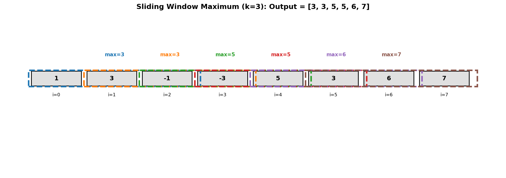
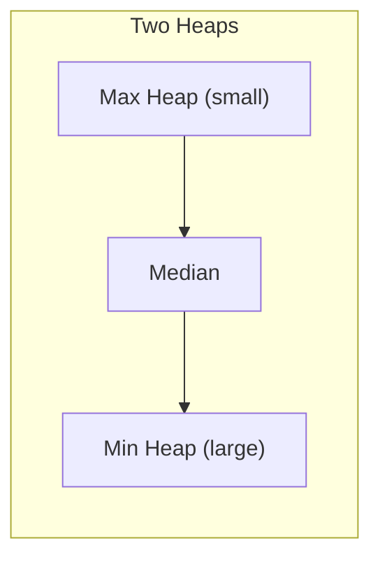
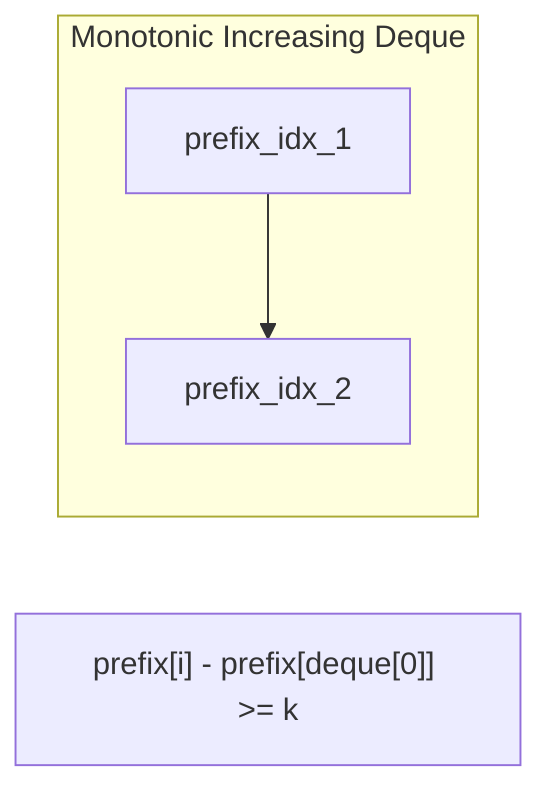
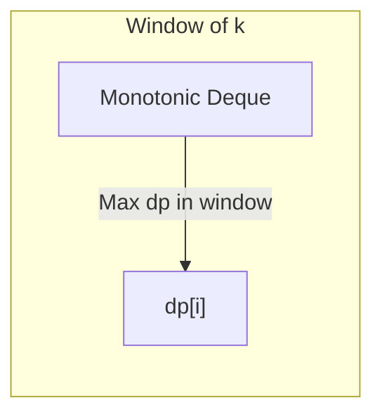
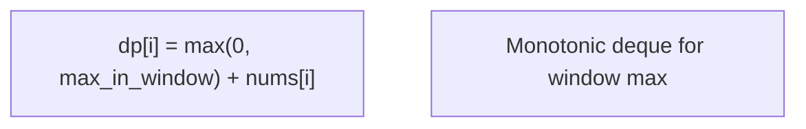
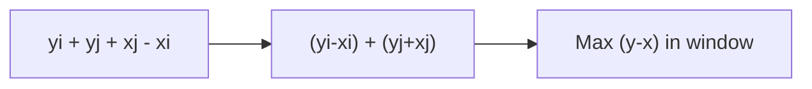

# Sliding Window Maximum

> **LeetCode 239** | Difficulty: Hard | Pattern: Monotonic Deque

---

## Problem Statement

You are given an array of integers `nums`, there is a sliding window of size `k` which is moving from the very left of the array to the very right. You can only see the `k` numbers in the window. Each time the sliding window moves right by one position.

Return the max sliding window.

### Examples

**Example 1:**
```
Input: nums = [1,3,-1,-3,5,3,6,7], k = 3
Output: [3,3,5,5,6,7]

Window position                Max
---------------               -----
[1  3  -1] -3  5  3  6  7       3
 1 [3  -1  -3] 5  3  6  7       3
 1  3 [-1  -3  5] 3  6  7       5
 1  3  -1 [-3  5  3] 6  7       5
 1  3  -1  -3 [5  3  6] 7       6
 1  3  -1  -3  5 [3  6  7]      7
```

**Example 2:**
```
Input: nums = [1], k = 1
Output: [1]
```

### Constraints

- `1 <= nums.length <= 10^5`
- `-10^4 <= nums[i] <= 10^4`
- `1 <= k <= nums.length`

---

## Intuition

Brute force: For each window, find max in O(k) time. Total: O(n*k).

**Optimization**: Use a **monotonic decreasing deque** that maintains elements in decreasing order. The front is always the maximum. Remove elements that:
1. Fall outside the window (from front)
2. Are smaller than the current element (from back)

---

## Visualization



```
nums = [1, 3, -1, -3, 5, 3, 6, 7], k = 3

Window [1, 3, -1]:
  Deque: [3, -1]  (1 removed because 3 > 1)
  Max = 3

Window [3, -1, -3]:
  Deque: [3, -1, -3]
  Max = 3

Window [-1, -3, 5]:
  Deque: [5]  (3, -1, -3 all removed because 5 > all)
  Max = 5
```

---

## Solution: Monotonic Deque

::: code-group

```python [Python]
from collections import deque

def maxSlidingWindow(nums: list[int], k: int) -> list[int]:
    """
    Find maximum in each sliding window using monotonic decreasing deque.

    Deque stores indices (not values) in decreasing order of their values.
    Front of deque is always the maximum.

    Time: O(n) - each element added and removed at most once
    Space: O(k) - deque never exceeds window size
    """
    dq = deque()  # Stores indices, values are in decreasing order
    result = []

    for i, num in enumerate(nums):
        # Remove indices outside the window
        while dq and dq[0] <= i - k:
            dq.popleft()

        # Remove smaller elements (they can never be max)
        while dq and nums[dq[-1]] < num:
            dq.pop()

        dq.append(i)

        # Add to result once we have a full window
        if i >= k - 1:
            result.append(nums[dq[0]])

    return result
```

```java [Java]
public int[] maxSlidingWindow(int[] nums, int k) {
    int n = nums.length;
    int[] result = new int[n - k + 1];
    Deque<Integer> dq = new ArrayDeque<>(); // monotonic decreasing; stores indices

    for (int i = 0; i < n; i++) {
        // Remove indices outside the window
        while (!dq.isEmpty() && dq.peekFirst() <= i - k) dq.pollFirst();
        // Remove smaller elements
        while (!dq.isEmpty() && nums[dq.peekLast()] < nums[i]) dq.pollLast();
        dq.offerLast(i);
        if (i >= k - 1) result[i - k + 1] = nums[dq.peekFirst()];
    }

    return result;
}
```

:::

::: info Complexity: Time O(n) · Space O(k)
- **Time:** Each element added to deque exactly once and removed at most once; total operations 2n = O(n)
- **Space:** Deque stores at most k indices (elements outside window are removed from front)
:::

---

## Why Monotonic Decreasing?

We maintain elements in **decreasing order** because:

1. **Front is always max**: The largest element is always at the front
2. **Smaller elements are useless**: If `nums[j] < nums[i]` and `j < i`, then `nums[j]` can never be the maximum while `nums[i]` is in the window

```
If window contains [5, 3, 4]:
- We only need to track [5, 4]
- 3 is useless because 4 > 3 and 4 entered later
- When 5 leaves, 4 becomes max
```

---

## Step-by-Step Walkthrough

For `nums = [1, 3, -1, -3, 5, 3, 6, 7]`, k = 3:

```
i=0, num=1:
  Deque empty, append 0
  deque = [0] (values: [1])
  i < k-1, no result yet

i=1, num=3:
  nums[0]=1 < 3, pop 0
  Append 1
  deque = [1] (values: [3])
  i < k-1, no result yet

i=2, num=-1:
  nums[1]=3 > -1, no pop
  Append 2
  deque = [1, 2] (values: [3, -1])
  i >= k-1, result.append(nums[1]) = 3
  result = [3]

i=3, num=-3:
  Index 1 not outside window (1 > 3-3=0)
  nums[2]=-1 > -3, no pop
  Append 3
  deque = [1, 2, 3] (values: [3, -1, -3])
  result.append(nums[1]) = 3
  result = [3, 3]

i=4, num=5:
  Index 1 outside window (1 <= 4-3=1), popleft
  nums[3]=-3 < 5, pop 3
  nums[2]=-1 < 5, pop 2
  Append 4
  deque = [4] (values: [5])
  result.append(nums[4]) = 5
  result = [3, 3, 5]

i=5, num=3:
  Index 4 not outside window
  nums[4]=5 > 3, no pop
  Append 5
  deque = [4, 5] (values: [5, 3])
  result.append(nums[4]) = 5
  result = [3, 3, 5, 5]

i=6, num=6:
  Index 4 not outside window (4 > 6-3=3)
  nums[5]=3 < 6, pop 5
  nums[4]=5 < 6, pop 4
  Append 6
  deque = [6] (values: [6])
  result.append(nums[6]) = 6
  result = [3, 3, 5, 5, 6]

i=7, num=7:
  Index 6 not outside window
  nums[6]=6 < 7, pop 6
  Append 7
  deque = [7] (values: [7])
  result.append(nums[7]) = 7
  result = [3, 3, 5, 5, 6, 7]
```

---

## Complexity Analysis

| Aspect | Complexity | Explanation |
|--------|------------|-------------|
| **Time** | O(n) | Each element added/removed at most once |
| **Space** | O(k) | Deque size bounded by window size |

### Why O(n)?

- Each index is added to deque exactly once
- Each index is removed from deque at most once
- Total operations: 2n = O(n)

---

## Edge Cases

```python
def test_sliding_window_max():
    # Window size equals array length
    assert maxSlidingWindow([1, 3, 2], 3) == [3]

    # Window size 1
    assert maxSlidingWindow([1, 3, 2], 1) == [1, 3, 2]

    # All same elements
    assert maxSlidingWindow([5, 5, 5, 5], 2) == [5, 5, 5]

    # Decreasing array
    assert maxSlidingWindow([5, 4, 3, 2, 1], 3) == [5, 4, 3]

    # Increasing array
    assert maxSlidingWindow([1, 2, 3, 4, 5], 3) == [3, 4, 5]

    # Negative numbers
    assert maxSlidingWindow([-1, -3, -5], 2) == [-1, -3]
```

---

## Sliding Window Minimum

Same approach, but maintain **monotonic increasing** deque:

```python
from collections import deque

def minSlidingWindow(nums: list[int], k: int) -> list[int]:
    """Minimum in each sliding window."""
    dq = deque()
    result = []

    for i, num in enumerate(nums):
        while dq and dq[0] <= i - k:
            dq.popleft()

        # Change: remove LARGER elements
        while dq and nums[dq[-1]] > num:
            dq.pop()

        dq.append(i)

        if i >= k - 1:
            result.append(nums[dq[0]])

    return result
```

::: info Complexity: Time O(n) · Space O(k)
- **Time:** Same amortized analysis as maximum version; each element pushed/popped once
- **Space:** Monotonic increasing deque bounded by window size k
:::

---

## Applications

### 1. Shortest Subarray with Sum >= K (LC 862)

Uses monotonic deque with prefix sums.

```python
from collections import deque

def shortestSubarray(nums: list[int], k: int) -> int:
    """Find shortest subarray with sum >= k."""
    n = len(nums)
    prefix = [0] * (n + 1)
    for i in range(n):
        prefix[i + 1] = prefix[i] + nums[i]

    dq = deque()  # Monotonic increasing of prefix sums
    min_len = float('inf')

    for i in range(n + 1):
        # Check if current position gives valid subarray
        while dq and prefix[i] - prefix[dq[0]] >= k:
            min_len = min(min_len, i - dq.popleft())

        # Maintain monotonic increasing
        while dq and prefix[dq[-1]] >= prefix[i]:
            dq.pop()

        dq.append(i)

    return min_len if min_len != float('inf') else -1
```

::: info Complexity: Time O(n) · Space O(n)
- **Time:** Build prefix sums O(n); each index added/removed from deque once; total O(n) deque operations
- **Space:** Prefix array is O(n); deque can hold up to n indices in worst case
:::

### 2. Jump Game VI (LC 1696)

```python
def maxResult(nums: list[int], k: int) -> int:
    """Maximum score to reach end with at most k jumps."""
    n = len(nums)
    dp = [0] * n
    dp[0] = nums[0]
    dq = deque([0])  # Track max dp values in window

    for i in range(1, n):
        # Remove indices outside window
        while dq and dq[0] < i - k:
            dq.popleft()

        dp[i] = nums[i] + dp[dq[0]]

        # Maintain monotonic decreasing
        while dq and dp[dq[-1]] <= dp[i]:
            dq.pop()

        dq.append(i)

    return dp[-1]
```

::: info Complexity: Time O(n) · Space O(n)
- **Time:** Single pass computing dp values; deque operations amortized O(1) per element
- **Space:** dp array is O(n); deque stores at most k indices representing window
:::

---

## Interview Tips

### What Interviewers Look For

1. **Deque Usage**: Know when monotonic deque applies
2. **Index vs Value**: Store indices to handle window bounds
3. **Invariant Maintenance**: Explain why deque stays monotonic

### Common Follow-up Questions

1. **"Why store indices instead of values?"**
   - Need to check if elements are within window
   - Can't determine position from value alone

2. **"How would you find the k-th largest instead of max?"**
   - Use a data structure like sorted list or balanced BST
   - Can't do with just a deque

3. **"What about sliding window median?"**
   - Use two heaps (max heap for smaller half, min heap for larger)
   - LeetCode 480

4. **"How about a 2D sliding window?"**
   - Apply 1D solution row-wise, then column-wise
   - O(m * n) time for m x n matrix

---

## Common Mistakes

1. **Not removing elements outside window first**
   ```python
   # Must check popleft BEFORE pop from back
   while dq and dq[0] <= i - k:
       dq.popleft()
   ```

2. **Wrong comparison for back removal**
   ```python
   # For max: remove elements < current
   # For min: remove elements > current
   ```

3. **Adding to result too early**
   ```python
   # Only add when i >= k - 1 (full window)
   if i >= k - 1:
       result.append(nums[dq[0]])
   ```

---

## Related Problems

::: details Sliding Window Median (LeetCode 480)
**Problem:** Return median of each sliding window of size k.

**Key Insight:** Two heaps - max heap for smaller half, min heap for larger half. Rebalance on slide.



**Approach:** Maintain two heaps with lazy deletion. Median is max-heap top (odd k) or average of both tops.

**Complexity:** O(n log k) time, O(k) space
:::

::: details Shortest Subarray with Sum >= K (LeetCode 862)
**Problem:** Find shortest subarray with sum at least k (can have negative numbers).

**Key Insight:** Prefix sums + monotonic increasing deque. Valid subarray when prefix[i] - prefix[deque[0]] >= k.



**Approach:** Deque stores indices with increasing prefix sums. Check valid subarrays, maintain monotonicity.

**Complexity:** O(n) time, O(n) space
:::

::: details Jump Game VI (LeetCode 1696)
**Problem:** Maximum score to reach end, can jump 1 to k steps. Score = sum of values at positions visited.

**Key Insight:** DP with sliding window maximum. dp[i] = nums[i] + max(dp[i-k:i]).



**Approach:** Monotonic decreasing deque tracks max dp value in window of k previous positions.

**Complexity:** O(n) time, O(k) space
:::

::: details Constrained Subsequence Sum (LeetCode 1425)
**Problem:** Max sum of subsequence where consecutive elements are at most k indices apart.

**Key Insight:** Similar to Jump Game VI. DP with monotonic deque for window maximum.



**Approach:** dp[i] = nums[i] + max(0, max dp in window). Use deque for O(1) window max.

**Complexity:** O(n) time, O(k) space
:::

::: details Max Value of Equation (LeetCode 1499)
**Problem:** Find max value of yi + yj + |xi - xj| for points with |xi - xj| <= k.

**Key Insight:** Rewrite as (yi - xi) + (yj + xj). Maximize first term in sliding window.



**Approach:** Monotonic decreasing deque stores (y-x, x). For each point, compute max equation value.

**Complexity:** O(n) time, O(n) space
:::

---

## References

- [LeetCode 239 - Sliding Window Maximum](https://leetcode.com/problems/sliding-window-maximum/)
- [NeetCode Solution](https://neetcode.io/solutions/sliding-window-maximum)
- [Monotonic Deque Guide](https://leetcode.com/discuss/study-guide/1688903/Solved-all-Deque-related-problems)
