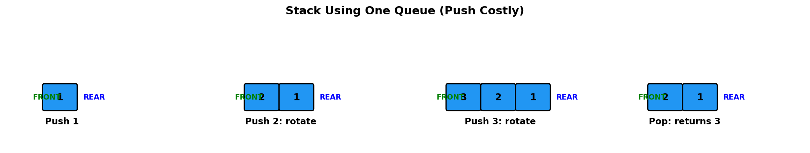
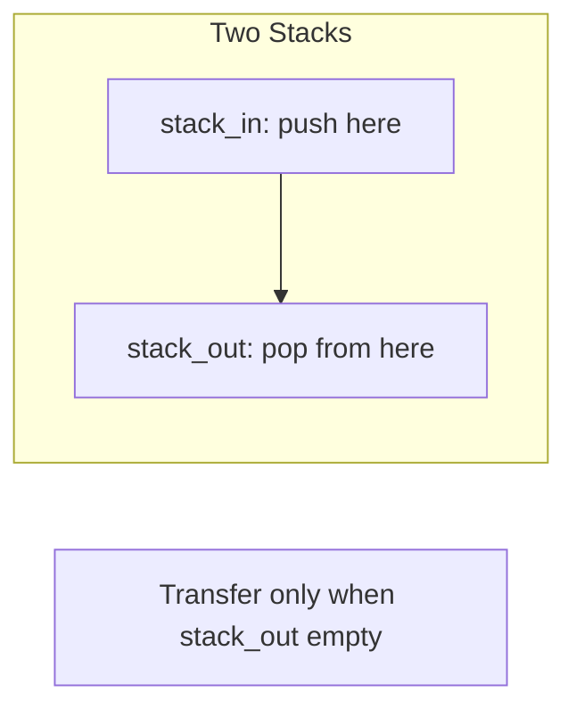
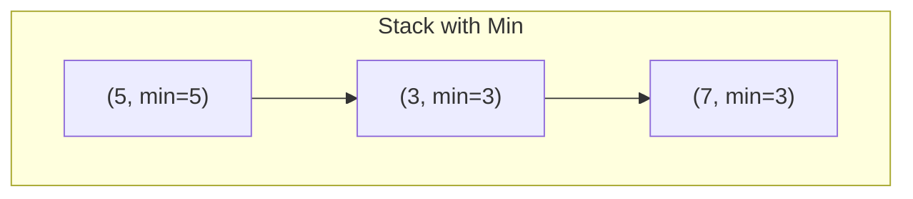
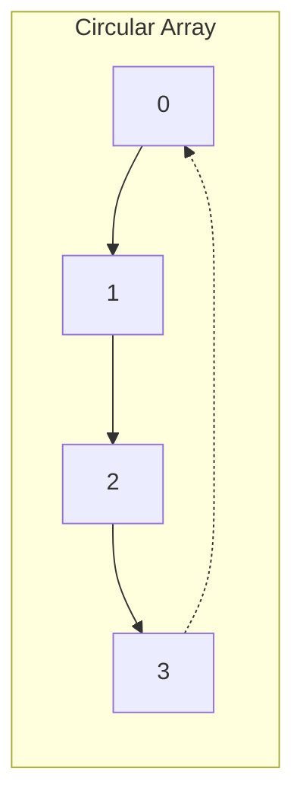
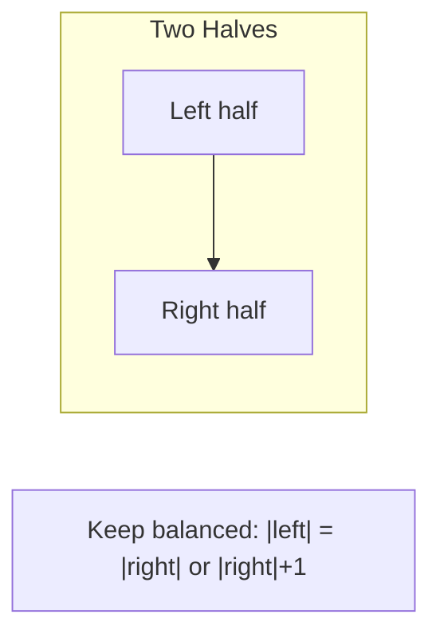

# Implement Stack using Queues

> **LeetCode 225** | Difficulty: Easy | Pattern: Queue Simulation

---

## Problem Statement

Implement a last-in-first-out (LIFO) stack using only two queues. The implemented stack should support all the functions of a normal stack (`push`, `top`, `pop`, and `empty`).

Implement the `MyStack` class:

- `void push(int x)` - Pushes element x to the top of the stack
- `int pop()` - Removes the element on the top of the stack and returns it
- `int top()` - Returns the element on the top of the stack
- `boolean empty()` - Returns true if the stack is empty, false otherwise

### Examples

**Example 1:**
```
Input:
["MyStack", "push", "push", "top", "pop", "empty"]
[[], [1], [2], [], [], []]

Output: [null, null, null, 2, 2, false]

Explanation:
MyStack myStack = new MyStack();
myStack.push(1); // stack is: [1]
myStack.push(2); // stack is: [1, 2]
myStack.top();   // return 2
myStack.pop();   // return 2, stack is [1]
myStack.empty(); // return false
```

### Constraints

- `1 <= x <= 9`
- At most 100 calls will be made to `push`, `pop`, `top`, and `empty`
- All the calls to `pop` and `top` are valid

### Follow-up

Can you implement the stack using only one queue?

---

## Intuition

A queue is FIFO (First In, First Out), but a stack is LIFO (Last In, First Out). To simulate LIFO using FIFO, we need to ensure the most recently added element is at the front.

**Key Insight**: After adding an element, rotate all previous elements to the back, making the new element the front (which will be "popped" first).

---

## Stack State Visualization



```
Using One Queue (Push Costly):

Push 1:
  Queue: [1]

Push 2:
  Add 2: [1, 2]
  Rotate 1 time: dequeue 1, enqueue 1
  Queue: [2, 1]  <- 2 is at front (stack top!)

Push 3:
  Add 3: [2, 1, 3]
  Rotate 2 times: [1, 3, 2] -> [3, 2, 1]
  Queue: [3, 2, 1]  <- 3 is at front!

Pop:
  Dequeue front
  Return: 3
  Queue: [2, 1]
```

---

## Solution 1: One Queue (Push O(n))

::: code-group

```python [Python]
from collections import deque

class MyStack:
    """
    Stack using single queue.

    Approach: Make push O(n), pop O(1)
    After each push, rotate queue so new element is at front.
    """

    def __init__(self):
        self.queue = deque()

    def push(self, x: int) -> None:
        """O(n) - Add and rotate to make it front"""
        self.queue.append(x)
        # Rotate n-1 elements to back
        for _ in range(len(self.queue) - 1):
            self.queue.append(self.queue.popleft())

    def pop(self) -> int:
        """O(1) - Front is the top of stack"""
        return self.queue.popleft()

    def top(self) -> int:
        """O(1) - Peek front"""
        return self.queue[0]

    def empty(self) -> bool:
        """O(1)"""
        return len(self.queue) == 0
```

```java [Java]
class MyStack {
    private Deque<Integer> queue;

    public MyStack() {
        queue = new ArrayDeque<>();
    }

    public void push(int x) {
        queue.offer(x);
        // rotate n-1 elements so new element is at front
        for (int i = 0; i < queue.size() - 1; i++) {
            queue.offer(queue.poll());
        }
    }

    public int pop() {
        return queue.poll();
    }

    public int top() {
        return queue.peek();
    }

    public boolean empty() {
        return queue.isEmpty();
    }
}
```

:::

::: info Complexity: Push O(n) · Pop O(1) · Top O(1) · Space O(n)
- **Push:** Rotates n-1 elements to back after adding new element, ensuring LIFO order
- **Pop/Top:** Front of queue is always the most recently pushed element (stack top)
- **Space:** Single queue stores all n elements
:::

---

## Solution 2: One Queue (Pop O(n))

```python
from collections import deque

class MyStack:
    """
    Stack using single queue.

    Approach: Make push O(1), pop O(n)
    On pop, rotate n-1 elements to access the last one.
    """

    def __init__(self):
        self.queue = deque()

    def push(self, x: int) -> None:
        """O(1) - Just enqueue"""
        self.queue.append(x)

    def pop(self) -> int:
        """O(n) - Rotate n-1 elements, then dequeue"""
        for _ in range(len(self.queue) - 1):
            self.queue.append(self.queue.popleft())
        return self.queue.popleft()

    def top(self) -> int:
        """O(n) - Pop and push back"""
        result = self.pop()
        self.queue.append(result)
        # Rotate to maintain order
        for _ in range(len(self.queue) - 1):
            self.queue.append(self.queue.popleft())
        return result

    def empty(self) -> bool:
        return len(self.queue) == 0
```

::: info Complexity: Push O(1) · Pop O(n) · Top O(n) · Space O(n)
- **Push:** Simply enqueue to back, no rotation needed
- **Pop:** Rotates n-1 elements to access the last (most recent) element
- **Top:** Performs pop then re-inserts and rotates to maintain order
- **Space:** Single queue stores all n elements
:::

---

## Solution 3: Two Queues

```python
from collections import deque

class MyStack:
    """
    Stack using two queues.

    Approach: Use second queue as temporary storage.
    """

    def __init__(self):
        self.q1 = deque()
        self.q2 = deque()

    def push(self, x: int) -> None:
        """O(n) - Make new element front of queue"""
        # Add to empty q2
        self.q2.append(x)

        # Move all from q1 to q2
        while self.q1:
            self.q2.append(self.q1.popleft())

        # Swap q1 and q2
        self.q1, self.q2 = self.q2, self.q1

    def pop(self) -> int:
        """O(1) - Dequeue from q1"""
        return self.q1.popleft()

    def top(self) -> int:
        """O(1) - Peek q1"""
        return self.q1[0]

    def empty(self) -> bool:
        return len(self.q1) == 0
```

::: info Complexity: Push O(n) · Pop O(1) · Top O(1) · Space O(n)
- **Push:** New element goes to empty q2, then all elements transferred from q1 to q2, then swap
- **Pop/Top:** q1 front is always the stack top after the swap rearrangement
- **Space:** Two queues together hold n elements; at any time one is empty, one has all elements
:::

---

## Algorithm Comparison

| Approach | Push | Pop | Top | Space |
|----------|------|-----|-----|-------|
| **One Queue (Push O(n))** | O(n) | O(1) | O(1) | O(n) |
| **One Queue (Pop O(n))** | O(1) | O(n) | O(n) | O(n) |
| **Two Queues** | O(n) | O(1) | O(1) | O(n) |

**Best Choice**: One Queue with O(n) push - simpler to implement and O(1) pop/top.

---

## Step-by-Step Walkthrough (One Queue, Push O(n))

```
Operation: push(1)
  Add 1: queue = [1]
  Rotate 0 times (size-1 = 0)
  queue = [1]

Operation: push(2)
  Add 2: queue = [1, 2]
  Rotate 1 time:
    - Dequeue 1, Enqueue 1
    - queue = [2, 1]
  queue = [2, 1]  <- 2 at front (top)

Operation: push(3)
  Add 3: queue = [2, 1, 3]
  Rotate 2 times:
    - Dequeue 2, Enqueue 2: [1, 3, 2]
    - Dequeue 1, Enqueue 1: [3, 2, 1]
  queue = [3, 2, 1]  <- 3 at front (top)

Operation: top()
  Return queue[0] = 3

Operation: pop()
  Dequeue front
  Return: 3
  queue = [2, 1]

Operation: pop()
  Dequeue front
  Return: 2
  queue = [1]
```

---

## Complexity Analysis

### One Queue (Push O(n)) - Recommended

| Operation | Time | Space | Explanation |
|-----------|------|-------|-------------|
| `push` | O(n) | O(1) | Rotate n-1 elements |
| `pop` | O(1) | O(1) | Dequeue front |
| `top` | O(1) | O(1) | Peek front |
| `empty` | O(1) | O(1) | Check size |

**Overall Space**: O(n) for storing n elements

---

## Edge Cases

```python
def test_stack():
    s = MyStack()

    # Empty stack
    assert s.empty() == True

    # Single element
    s.push(1)
    assert s.top() == 1
    assert s.pop() == 1
    assert s.empty() == True

    # LIFO order
    s.push(1)
    s.push(2)
    s.push(3)
    assert s.pop() == 3  # Last in, first out
    assert s.pop() == 2
    assert s.pop() == 1

    # Interleaved operations
    s.push(1)
    s.push(2)
    assert s.pop() == 2
    s.push(3)
    assert s.pop() == 3
    assert s.pop() == 1
```

---

## Why This Is Harder Than Queue Using Stacks

| Aspect | Queue Using Stacks | Stack Using Queues |
|--------|-------------------|-------------------|
| **Amortized O(1)** | Yes (lazy transfer) | No |
| **Reason** | Elements only need to move once | Elements need repositioning on every push |
| **Best Complexity** | All O(1) amortized | At least one O(n) operation |

The fundamental difference is that reversing order (stack to queue) can be done lazily, but maintaining reverse order (queue to stack) requires immediate action.

---

## Interview Tips

### What Interviewers Look For

1. **Trade-off discussion**: Which operation should be O(n)?
2. **Single queue solution**: Can you do it with one queue?
3. **Clean implementation**: Handle the rotation correctly

### Common Follow-up Questions

1. **"Why can't we get amortized O(1) like Queue Using Stacks?"**
   - In queue-from-stacks, we can lazily transfer
   - In stack-from-queues, new elements must immediately become accessible
   - The "top" changes with every push

2. **"Which approach is better: O(n) push or O(n) pop?"**
   - Depends on usage pattern
   - More pushes than pops: O(n) pop is better
   - More pops than pushes: O(n) push is better
   - Equal operations: O(n) push (simpler implementation)

3. **"Can you implement with zero extra space?"**
   - Need at least one queue/deque
   - Recursion could use call stack but that's also space

---

## Related Problems

::: details Implement Queue using Stacks (LeetCode 232)
**Problem:** Implement FIFO queue using only stack operations.

**Key Insight:** Two stacks with lazy transfer achieves amortized O(1) for all operations.



**Approach:** Push to stack_in. On pop/peek, if stack_out empty, transfer all from stack_in.

**Complexity:** O(1) amortized all operations
:::

::: details Min Stack (LeetCode 155)
**Problem:** Stack with O(1) push, pop, top, and getMin operations.

**Key Insight:** Track minimum at each stack level. Use auxiliary min stack or store pairs.



**Approach:** Store (value, current_min) pairs, or use separate min_stack that tracks minimums.

**Complexity:** O(1) all operations
:::

::: details Design Circular Queue (LeetCode 622)
**Problem:** Fixed-size circular queue with array implementation.

**Key Insight:** Use modulo arithmetic for wrap-around. Track head and size.



**Approach:** head index + count, tail = (head + count) % capacity.

**Complexity:** O(1) all operations
:::

::: details Design Front Middle Back Queue (LeetCode 1670)
**Problem:** Queue with push/pop from front, middle, and back.

**Key Insight:** Two deques/lists, keep balanced. Middle operations split at center.



**Approach:** Two deques. Rebalance after each operation to maintain middle access.

**Complexity:** O(1) all operations with careful balancing
:::

---

## References

- [LeetCode 225 - Implement Stack using Queues](https://leetcode.com/problems/implement-stack-using-queues/)
- [NeetCode Solution](https://neetcode.io/solutions/implement-stack-using-queues)
- [Queue Data Structure - GeeksforGeeks](https://www.geeksforgeeks.org/queue-data-structure/)
