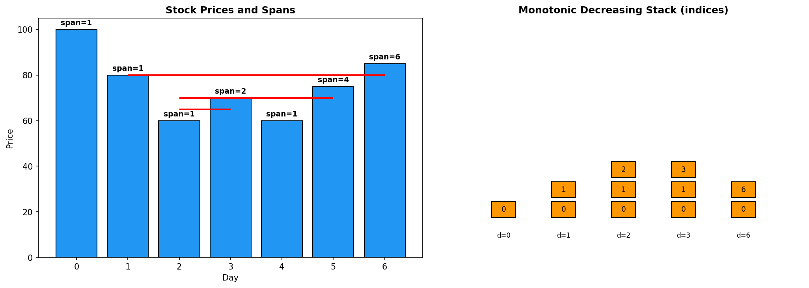
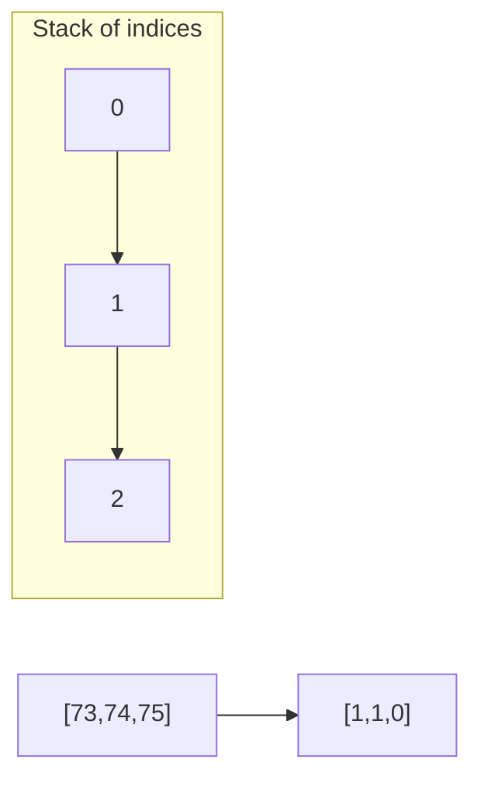
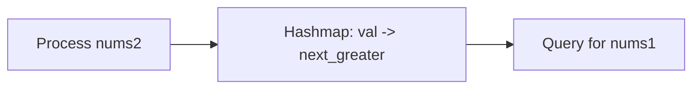
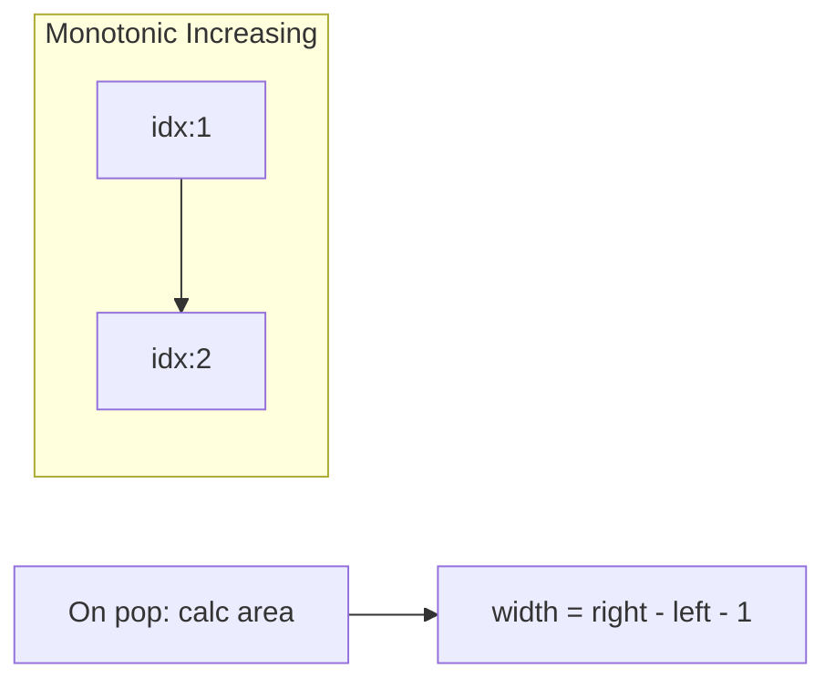
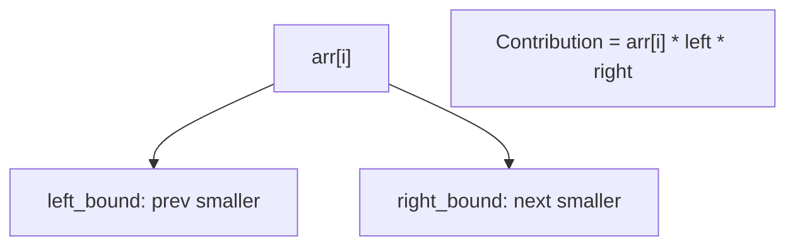
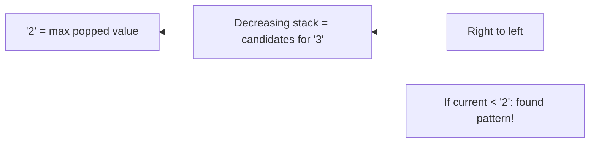

# Stock Span Problem

> **LeetCode 901** | Difficulty: Medium | Pattern: Monotonic Stack

---

## Problem Statement

Design an algorithm that collects daily price quotes for some stock and returns the **span** of that stock's price for the current day.

The **span** of the stock's price today is defined as the maximum number of consecutive days (starting from today and going backward) for which the stock price was less than or equal to today's price.

Implement the `StockSpanner` class:
- `StockSpanner()` Initializes the object of the class
- `int next(int price)` Returns the span of the stock's price given that today's price is `price`

### Examples

**Example 1:**
```
Input:
["StockSpanner", "next", "next", "next", "next", "next", "next", "next"]
[[], [100], [80], [60], [70], [60], [75], [85]]

Output: [null, 1, 1, 1, 2, 1, 4, 6]

Explanation:
StockSpanner stockSpanner = new StockSpanner();
stockSpanner.next(100); // return 1
stockSpanner.next(80);  // return 1
stockSpanner.next(60);  // return 1
stockSpanner.next(70);  // return 2 (70 >= 60)
stockSpanner.next(60);  // return 1
stockSpanner.next(75);  // return 4 (75 >= 60, 70, 60, so span = 4)
stockSpanner.next(85);  // return 6 (85 >= 75, 60, 70, 60, 80)
```

### Constraints

- `1 <= price <= 10^5`
- At most `10^4` calls will be made to `next`

---

## Intuition

The span is essentially finding the **previous greater element** - how many consecutive days back (including today) have prices <= today's price.

**Key Insight**: Use a monotonic decreasing stack. Pop elements with price <= current price, accumulating their spans. The current span is the sum of popped spans + 1.

---

## Visualization



```
Prices: [100, 80, 60, 70, 60, 75, 85]

Day 0 (100): No previous, span = 1
  Stack: [(100, 1)]

Day 1 (80): 80 < 100, span = 1
  Stack: [(100, 1), (80, 1)]

Day 2 (60): 60 < 80, span = 1
  Stack: [(100, 1), (80, 1), (60, 1)]

Day 3 (70): 70 > 60, pop (60,1), span = 1+1 = 2
  Stack: [(100, 1), (80, 1), (70, 2)]

Day 4 (60): 60 < 70, span = 1
  Stack: [(100, 1), (80, 1), (70, 2), (60, 1)]

Day 5 (75): 75 > 60, pop (60,1), 75 > 70, pop (70,2), span = 1+1+2 = 4
  Stack: [(100, 1), (80, 1), (75, 4)]

Day 6 (85): 85 > 75, pop (75,4), 85 > 80, pop (80,1), span = 1+4+1 = 6
  Stack: [(100, 1), (85, 6)]
```

---

## Solution

```python
class StockSpanner:
    """
    Calculate stock span using monotonic decreasing stack.

    Stack stores (price, span) tuples.
    Pop all prices <= current, sum their spans.
    """

    def __init__(self):
        self.stack = []  # (price, span)

    def next(self, price: int) -> int:
        """
        Return span for today's price.

        Time: Amortized O(1) - each element pushed/popped at most once
        Space: O(n) - stack can hold all prices
        """
        span = 1

        # Pop prices <= current price, accumulate spans
        while self.stack and self.stack[-1][0] <= price:
            span += self.stack.pop()[1]

        self.stack.append((price, span))
        return span
```

::: info Complexity: Time Amortized O(1) per call · Space O(n) total
- **Time:** Each price is pushed exactly once and popped at most once across all calls. Over n calls, total operations = 2n = O(n), giving O(1) amortized per `next()` call
- **Space:** Stack can hold all n prices in worst case (strictly decreasing prices like [100, 90, 80, ...])
:::

---

## Alternative: Store Indices

```python
class StockSpanner:
    """
    Alternative: Store indices instead of spans.
    Span = current_index - previous_greater_index
    """

    def __init__(self):
        self.stack = []  # (price, index)
        self.day = 0

    def next(self, price: int) -> int:
        # Pop smaller or equal prices
        while self.stack and self.stack[-1][0] <= price:
            self.stack.pop()

        # Span is distance to previous greater (or all days if none)
        if self.stack:
            span = self.day - self.stack[-1][1]
        else:
            span = self.day + 1

        self.stack.append((price, self.day))
        self.day += 1
        return span
```

::: info Complexity: Time Amortized O(1) per call · Space O(n) total
- **Time:** Same amortized analysis as main solution - each element enters and leaves the stack at most once
- **Space:** Stack stores (price, index) tuples; at most n elements in worst case when prices are strictly decreasing
:::

---

## Step-by-Step Walkthrough

For prices `[100, 80, 60, 70, 60, 75, 85]`:

```
next(100):
  Stack empty
  span = 1
  Push (100, 1)
  Stack: [(100, 1)]
  Return 1

next(80):
  Stack top (100, 1), 100 > 80, no pop
  span = 1
  Push (80, 1)
  Stack: [(100, 1), (80, 1)]
  Return 1

next(60):
  Stack top (80, 1), 80 > 60, no pop
  span = 1
  Push (60, 1)
  Stack: [(100, 1), (80, 1), (60, 1)]
  Return 1

next(70):
  Stack top (60, 1), 60 <= 70, pop, span = 1 + 1 = 2
  Stack top (80, 1), 80 > 70, stop
  Push (70, 2)
  Stack: [(100, 1), (80, 1), (70, 2)]
  Return 2

next(60):
  Stack top (70, 2), 70 > 60, no pop
  span = 1
  Push (60, 1)
  Stack: [(100, 1), (80, 1), (70, 2), (60, 1)]
  Return 1

next(75):
  Stack top (60, 1), 60 <= 75, pop, span = 1 + 1 = 2
  Stack top (70, 2), 70 <= 75, pop, span = 2 + 2 = 4
  Stack top (80, 1), 80 > 75, stop
  Push (75, 4)
  Stack: [(100, 1), (80, 1), (75, 4)]
  Return 4

next(85):
  Stack top (75, 4), 75 <= 85, pop, span = 1 + 4 = 5
  Stack top (80, 1), 80 <= 85, pop, span = 5 + 1 = 6
  Stack top (100, 1), 100 > 85, stop
  Push (85, 6)
  Stack: [(100, 1), (85, 6)]
  Return 6
```

---

## Complexity Analysis

| Operation | Time | Space |
|-----------|------|-------|
| `__init__` | O(1) | O(1) |
| `next` | Amortized O(1) | O(n) total |

### Why Amortized O(1)?

- Each price is pushed onto the stack exactly once
- Each price is popped at most once
- Over n calls: n pushes + n pops = O(2n) total = O(1) amortized per call

---

## Batch Version (Array Input)

```python
def calculateSpan(prices: list[int]) -> list[int]:
    """
    Calculate span for all prices at once.
    Equivalent to calling next() for each price.
    """
    n = len(prices)
    spans = [1] * n
    stack = []  # Stores indices

    for i in range(n):
        while stack and prices[stack[-1]] <= prices[i]:
            stack.pop()

        # Span = distance to previous greater element
        spans[i] = i - stack[-1] if stack else i + 1

        stack.append(i)

    return spans

# Example:
# prices = [100, 80, 60, 70, 60, 75, 85]
# spans  = [1,   1,  1,  2,  1,  4,  6]
```

::: info Complexity: Time O(n) · Space O(n)
- **Time:** Each index is pushed once and popped at most once, so total operations across all n elements is O(2n) = O(n)
- **Space:** Stack stores indices; worst case holds all n indices when prices are strictly decreasing
:::

---

## Edge Cases

```python
def test_stock_span():
    spanner = StockSpanner()

    # Single price
    assert spanner.next(100) == 1

    # Increasing prices
    spanner = StockSpanner()
    assert spanner.next(10) == 1
    assert spanner.next(20) == 2
    assert spanner.next(30) == 3

    # Decreasing prices
    spanner = StockSpanner()
    assert spanner.next(30) == 1
    assert spanner.next(20) == 1
    assert spanner.next(10) == 1

    # All same prices
    spanner = StockSpanner()
    assert spanner.next(50) == 1
    assert spanner.next(50) == 2
    assert spanner.next(50) == 3

    # Valley
    spanner = StockSpanner()
    assert spanner.next(50) == 1
    assert spanner.next(30) == 1
    assert spanner.next(60) == 3
```

---

## Relation to Other Problems

| Problem | Stack Type | What We Find |
|---------|------------|--------------|
| **Stock Span** | Decreasing | Previous Greater Element (count) |
| **Next Greater Element** | Decreasing | Next Greater Element (value) |
| **Daily Temperatures** | Decreasing | Next Greater Element (index diff) |
| **Largest Rectangle** | Increasing | Next/Prev Smaller Element |

---

## Common Mistakes

1. **Using `<` instead of `<=`**
   ```python
   # Wrong: while self.stack and self.stack[-1][0] < price
   # Correct: while self.stack and self.stack[-1][0] <= price
   # Equal prices should also be included in span
   ```

2. **Forgetting to add 1 for current day**
   ```python
   span = 1  # Start with 1 for today
   ```

3. **Not storing span information**
   ```python
   # Must store (price, span) or (price, index)
   # Just storing price loses accumulated span info
   ```

---

## Interview Tips

### What Interviewers Look For

1. **Monotonic Stack**: Recognize the pattern
2. **Online Algorithm**: Handle streaming data
3. **Amortized Analysis**: Explain O(1) amortized complexity

### Common Follow-up Questions

1. **"What if we also need the maximum span so far?"**
   ```python
   def __init__(self):
       self.stack = []
       self.max_span = 0

   def next(self, price):
       span = 1
       while self.stack and self.stack[-1][0] <= price:
           span += self.stack.pop()[1]
       self.stack.append((price, span))
       self.max_span = max(self.max_span, span)
       return span

   def getMaxSpan(self):
       return self.max_span
   ```

2. **"How would you handle deleting the oldest price?"**
   - Use a deque with (price, span, index) tuples
   - More complex to maintain

3. **"What about finding span for k days back only?"**
   - Maintain a window of k days
   - Similar to sliding window maximum

---

## Related Problems

::: details Daily Temperatures (LeetCode 739)
**Problem:** Return days until warmer temperature for each day.

**Key Insight:** Next greater element (looking forward) vs stock span (looking backward).



**Approach:** Monotonic decreasing stack. Pop when current > top, record index difference.

**Complexity:** O(n) time, O(n) space
:::

::: details Next Greater Element I (LeetCode 496)
**Problem:** For nums1 subset, find next greater element in nums2.

**Key Insight:** Precompute next greater for all nums2, query for nums1.



**Approach:** Monotonic stack on nums2 builds hashmap. Lookup for each nums1 element.

**Complexity:** O(n + m) time
:::

::: details Largest Rectangle in Histogram (LeetCode 84)
**Problem:** Find largest rectangular area in histogram.

**Key Insight:** For each bar, need both previous and next smaller elements for boundaries.



**Approach:** Monotonic increasing stack. On pop, calculate area using popped height and boundaries.

**Complexity:** O(n) time, O(n) space
:::

::: details Sum of Subarray Minimums (LeetCode 907)
**Problem:** Sum of minimum elements of all subarrays.

**Key Insight:** Contribution technique - each element contributes to multiple subarrays as minimum.



**Approach:** Find prev/next smaller for each. Contribution = value * count of subarrays where it's minimum.

**Complexity:** O(n) time, O(n) space
:::

::: details 132 Pattern (LeetCode 456)
**Problem:** Find i < j < k where nums[i] < nums[k] < nums[j].

**Key Insight:** Track max "2" (nums[k]) seen while scanning right-to-left with monotonic stack.



**Approach:** Monotonic decreasing stack stores candidates for "3". Track max "2" from pops.

**Complexity:** O(n) time, O(n) space
:::

---

## References

- [LeetCode 901 - Online Stock Span](https://leetcode.com/problems/online-stock-span/)
- [NeetCode Solution](https://neetcode.io/solutions/online-stock-span)
- [Monotonic Stack - LeetCode Guide](https://leetcode.com/discuss/study-guide/5148505/monotonic-stack-guide)
- [Stock Span - GeeksforGeeks](https://www.geeksforgeeks.org/the-stock-span-problem/)
