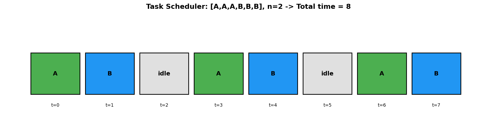
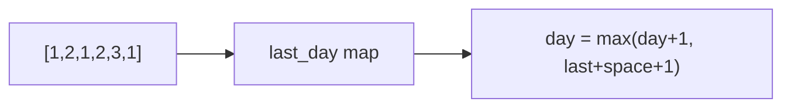
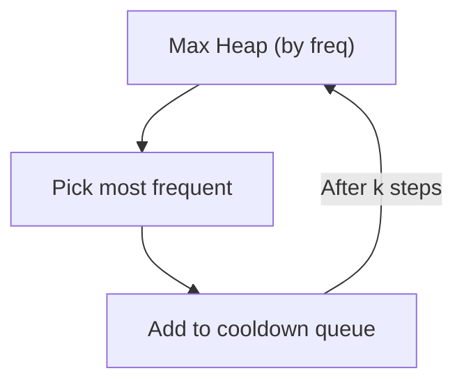
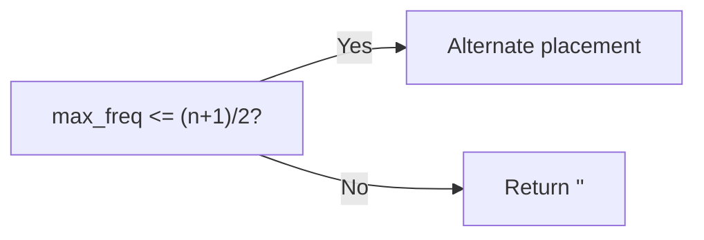
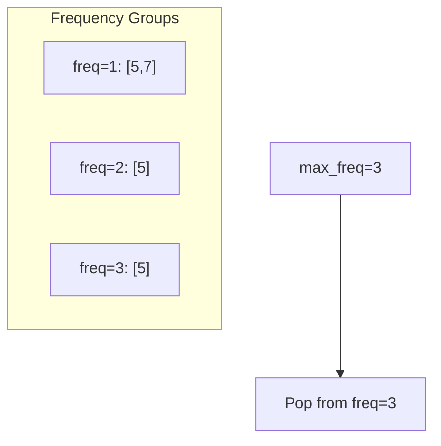

# Task Scheduler

> **LeetCode 621** | Difficulty: Medium | Pattern: Queue + Greedy

---

## Problem Statement

Given a characters array `tasks`, representing the tasks a CPU needs to do, where each letter represents a different task. Tasks could be done in any order. Each task is done in one unit of time. For each unit of time, the CPU could complete either one task or just be idle.

However, there is a non-negative integer `n` that represents the cooldown period between two **same tasks** (the same letter in the array), that is that there must be at least `n` units of time between any two same tasks.

Return the least number of units of times that the CPU will take to finish all the given tasks.

### Examples

**Example 1:**
```
Input: tasks = ["A","A","A","B","B","B"], n = 2
Output: 8
Explanation:
A -> B -> idle -> A -> B -> idle -> A -> B
```

**Example 2:**
```
Input: tasks = ["A","A","A","B","B","B"], n = 0
Output: 6
Explanation: No cooldown needed, any order works.
```

**Example 3:**
```
Input: tasks = ["A","A","A","A","A","A","B","C","D","E","F","G"], n = 2
Output: 16
Explanation:
A -> B -> C -> A -> D -> E -> A -> F -> G -> A -> idle -> idle -> A -> idle -> idle -> A
```

### Constraints

- `1 <= tasks.length <= 10^4`
- `tasks[i]` is an uppercase English letter
- `0 <= n <= 100`

---

## Intuition

The task with the **maximum frequency** determines the minimum time. We need to fill gaps between same tasks with other tasks or idle time.

**Key Insight**: If the most frequent task appears `max_freq` times, we need at least `(max_freq - 1) * (n + 1) + count_of_max_freq_tasks` time units.

---

## Visualization



For `tasks = [A,A,A,B,B,B]`, n = 2:

```
A appears 3 times, B appears 3 times
max_freq = 3

Create (max_freq - 1) = 2 intervals of size (n + 1) = 3:

|  A  |  B  | idle |  <- interval 1
|  A  |  B  | idle |  <- interval 2
|  A  |  B  |         <- last partial

Rearranged: A B idle A B idle A B
Total: 8 time units
```

---

## Solution 1: Mathematical Formula

```python
from collections import Counter

def leastInterval(tasks: list[str], n: int) -> int:
    """
    Calculate minimum time using formula.

    Formula: max(len(tasks), (max_freq - 1) * (n + 1) + num_max_tasks)

    Time: O(n) - count frequencies
    Space: O(1) - at most 26 letters
    """
    freq = Counter(tasks)
    max_freq = max(freq.values())

    # Count tasks with maximum frequency
    num_max_tasks = sum(1 for f in freq.values() if f == max_freq)

    # Minimum slots needed
    # (max_freq - 1) intervals of (n + 1) slots + last row with max_freq tasks
    min_slots = (max_freq - 1) * (n + 1) + num_max_tasks

    # Result is max of calculated slots and total tasks
    # (we might have enough tasks to fill all gaps)
    return max(len(tasks), min_slots)
```

::: info Complexity: Time O(n) · Space O(1)
- **Time:** O(n) to count task frequencies using Counter, O(26) to find max and count max-frequency tasks. Since 26 is constant, overall is O(n)
- **Space:** O(1) because there are at most 26 unique uppercase letters, so the frequency counter has bounded size regardless of input length
:::

### Why This Formula Works

```
Example: A A A B B B C, n = 2

max_freq = 3 (A and B both appear 3 times)
num_max_tasks = 2

Visual:
A B _ | A B _ | A B   <- (max_freq - 1) intervals + last row
      ^ gaps can be filled with C or idle

Intervals: 2 intervals of 3 slots each = 6
Last row: 2 tasks (A and B) = 2
Total minimum: 8

But we only have 7 tasks!
C fills one gap: A B C | A B _ | A B = 8 (with 1 idle)

If we had more tasks:
A A A B B B C D E F, n = 2
A B C | A B D | A B | E F = 10 tasks (no idle needed)
Result = max(10, 8) = 10
```

---

## Solution 2: Simulation with Max Heap

```python
from collections import Counter
import heapq

def leastInterval(tasks: list[str], n: int) -> int:
    """
    Simulate scheduling using max heap and cooldown queue.

    Always pick the task with highest remaining count.

    Time: O(t * log(26)) where t is total time
    Space: O(26) = O(1)
    """
    freq = Counter(tasks)
    # Max heap (negate for max behavior)
    max_heap = [-f for f in freq.values()]
    heapq.heapify(max_heap)

    # Queue: (available_time, remaining_count)
    cooldown = []
    time = 0

    while max_heap or cooldown:
        time += 1

        if max_heap:
            # Process task with highest frequency
            count = heapq.heappop(max_heap) + 1  # +1 because negated

            if count < 0:  # Still has remaining tasks
                cooldown.append((time + n, count))
        # else: idle (nothing to process, but cooldown not ready)

        # Check if any task is ready to be scheduled again
        if cooldown and cooldown[0][0] == time:
            _, count = cooldown.pop(0)
            heapq.heappush(max_heap, count)

    return time
```

::: info Complexity: Time O(t * log 26) = O(t) · Space O(26) = O(1)
- **Time:** Loop runs for t total time units. Each iteration does heap operations on at most 26 elements (unique task types), so each operation is O(log 26) = O(1). Using list pop(0) for cooldown is O(k) per call but k <= 26
- **Space:** Heap and cooldown queue each hold at most 26 entries (one per unique task type), so space is O(1) regardless of total task count
:::

---

## Solution 3: Simulation with Deque

```python
from collections import Counter, deque
import heapq

def leastInterval(tasks: list[str], n: int) -> int:
    """
    More efficient simulation using deque for cooldown.
    """
    freq = Counter(tasks)
    max_heap = [-f for f in freq.values()]
    heapq.heapify(max_heap)

    cooldown = deque()  # (available_time, count)
    time = 0

    while max_heap or cooldown:
        time += 1

        if max_heap:
            count = heapq.heappop(max_heap) + 1
            if count < 0:
                cooldown.append((time + n, count))

        if cooldown and cooldown[0][0] == time:
            heapq.heappush(max_heap, cooldown.popleft()[1])

    return time
```

::: info Complexity: Time O(t) · Space O(1)
- **Time:** Same as Solution 2, but deque.popleft() is O(1) vs list.pop(0) which is O(k). Total time is O(t) where t is the answer (total time units)
- **Space:** O(26) = O(1) for heap and deque, as both are bounded by the number of unique task types (uppercase letters)
:::

---

## Step-by-Step Walkthrough (Formula)

For `tasks = [A,A,A,A,A,A,B,C,D,E,F,G]`, n = 2:

```
Count: A=6, B=1, C=1, D=1, E=1, F=1, G=1
max_freq = 6
num_max_tasks = 1 (only A has freq 6)

Calculate:
min_slots = (6 - 1) * (2 + 1) + 1 = 5 * 3 + 1 = 16
total_tasks = 12

Result = max(12, 16) = 16

Visual:
| A | B | C |   <- interval 1
| A | D | E |   <- interval 2
| A | F | G |   <- interval 3
| A | _ | _ |   <- interval 4 (2 idle)
| A | _ | _ |   <- interval 5 (2 idle)
| A |           <- last row (1 task)

Total: 16 slots (12 tasks + 4 idle)
```

---

## Complexity Analysis

| Approach | Time | Space |
|----------|------|-------|
| **Formula** | O(n) | O(1) |
| **Heap Simulation** | O(t log 26) | O(1) |

Where n is number of tasks and t is total time.

Formula approach is O(n) because we just count frequencies and apply formula.

---

## Edge Cases

```python
def test_task_scheduler():
    # No cooldown
    assert leastInterval(["A", "B", "C"], 0) == 3

    # Single task type
    assert leastInterval(["A", "A", "A"], 2) == 7  # A _ _ A _ _ A

    # All different tasks
    assert leastInterval(["A", "B", "C", "D"], 2) == 4

    # More tasks than gaps
    assert leastInterval(["A", "A", "B", "B", "C", "C", "D"], 2) == 7

    # Large cooldown
    assert leastInterval(["A", "A"], 10) == 12  # A _ _ _ _ _ _ _ _ _ _ A

    # Equal frequencies
    assert leastInterval(["A", "A", "B", "B", "C", "C"], 2) == 6  # A B C A B C
```

---

## Common Mistakes

1. **Forgetting the max with total tasks**
   ```python
   # When we have many different tasks, no idle needed
   return max(len(tasks), calculated_slots)  # Not just calculated_slots
   ```

2. **Wrong interval calculation**
   ```python
   # Intervals: (max_freq - 1), not max_freq
   # Each interval: (n + 1) slots, not n
   ```

3. **Not counting all max frequency tasks**
   ```python
   # A A A B B B has 2 tasks with max frequency
   num_max_tasks = sum(1 for f in freq.values() if f == max_freq)
   ```

---

## Interview Tips

### What Interviewers Look For

1. **Pattern Recognition**: Identify as greedy scheduling
2. **Mathematical Insight**: Derive the formula
3. **Both Approaches**: Know formula and simulation

### Common Follow-up Questions

1. **"What if tasks have different durations?"**
   - Need dynamic programming or more complex scheduling
   - Priority queue with finish times

2. **"What if we want the actual schedule, not just time?"**
   ```python
   def scheduleWithDetails(tasks, n):
       # Use simulation approach and track actual assignments
       schedule = []
       # ... (similar to heap approach but append task names)
       return schedule
   ```

3. **"What about dependencies between tasks?"**
   - Topological sort + scheduling
   - Like course schedule with cooldowns

4. **"Minimum number of workers to finish in given time?"**
   - Binary search on number of workers
   - Check if schedule is feasible

---

## Variations

### Task Scheduler II (LC 2365)

```python
def taskSchedulerII(tasks: list[int], space: int) -> int:
    """
    Tasks are numbered, each must wait 'space' days after same task.
    """
    last_day = {}
    day = 0

    for task in tasks:
        day += 1
        if task in last_day:
            # Must wait at least 'space' days
            day = max(day, last_day[task] + space + 1)
        last_day[task] = day

    return day
```

::: info Complexity: Time O(n) · Space O(k)
- **Time:** O(n) single pass through the tasks array, with O(1) dictionary operations per task
- **Space:** O(k) where k is the number of unique task types. Dictionary stores the last execution day for each unique task
:::

---

## Related Problems

::: details Task Scheduler II (LeetCode 2365)
**Problem:** Tasks in fixed order, same task needs 'space' days gap. Return total days.

**Key Insight:** Track last execution day per task. Current day = max(day+1, last_day + space + 1).



**Approach:** HashMap tracks last execution. For each task, compute earliest possible day.

**Complexity:** O(n) time, O(k) space for k unique tasks
:::

::: details Rearrange String k Distance Apart (LeetCode 358)
**Problem:** Rearrange string so same characters are at least k distance apart.

**Key Insight:** Greedy with max heap + cooldown queue. Always pick most frequent available.



**Approach:** Max heap for frequency. Cooldown queue delays reuse. Return "" if impossible.

**Complexity:** O(n log 26) time
:::

::: details Reorganize String (LeetCode 767)
**Problem:** Rearrange string so no two adjacent characters are same.

**Key Insight:** Special case of k=2. Most frequent char can't exceed (n+1)/2.



**Approach:** Check feasibility, then interleave using heap or direct placement at even/odd indices.

**Complexity:** O(n) time possible with direct placement
:::

::: details Maximum Frequency Stack (LeetCode 895)
**Problem:** Stack that pops most frequent element (LIFO for ties).

**Key Insight:** Group by frequency. Track max frequency. Pop from highest frequency group.



**Approach:** Map frequency -> stack of elements. Track each element's frequency. Pop from max freq stack.

**Complexity:** O(1) push and pop
:::

---

## References

- [LeetCode 621 - Task Scheduler](https://leetcode.com/problems/task-scheduler/)
- [NeetCode Solution](https://neetcode.io/solutions/task-scheduler)
- [Greedy Scheduling Algorithms](https://en.wikipedia.org/wiki/Greedy_algorithm#Scheduling)
