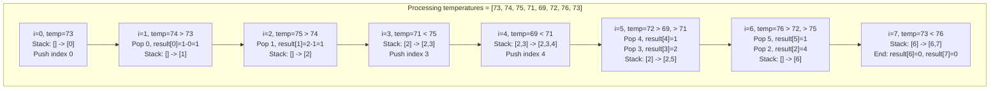
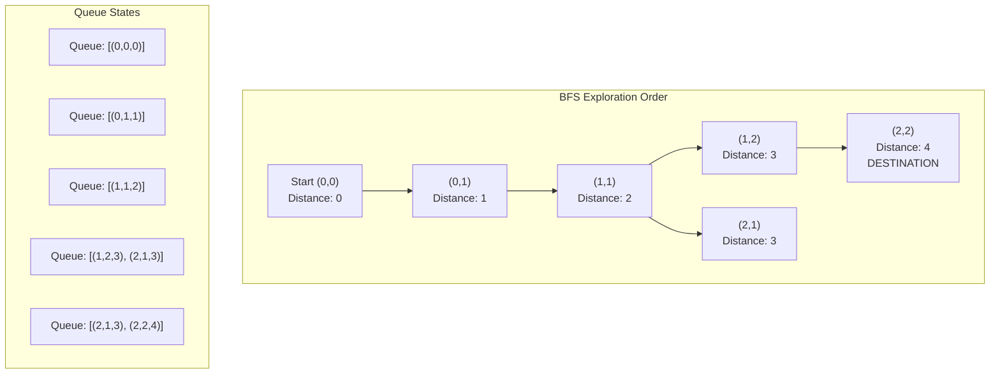
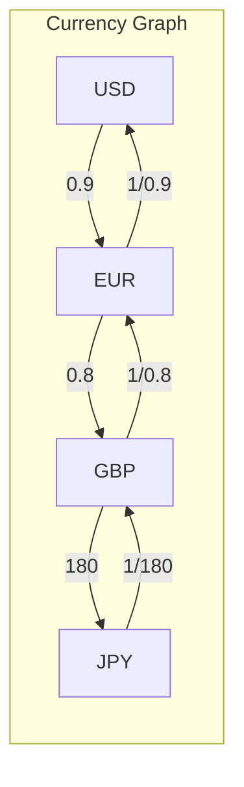

# Daily Temperatures, Shortest Path & Conversions

> **Monotonic stack and BFS queue applications**

---

## Visual Guides

### Next Greater Element


### Daily Temperatures


### Monotonic Stack Evolution


### Largest Rectangle in Histogram


### Increasing vs Decreasing Stack


---

## Daily Temperatures

### Problem Statement
Given an array of integers `temperatures` representing daily temperatures, return an array `answer` such that `answer[i]` is the number of days you have to wait after the `i`th day to get a warmer temperature. If there is no future day for which this is possible, keep `answer[i] == 0` instead.

### Example
```
Input: [73, 74, 75, 71, 69, 72, 76, 73]
Output: [1, 1, 4, 2, 1, 1, 0, 0]
```

**Explanation:**
- Day 0 (73): Next warmer is day 1 (74) -> wait 1 day
- Day 1 (74): Next warmer is day 2 (75) -> wait 1 day
- Day 2 (75): Next warmer is day 6 (76) -> wait 4 days
- Day 3 (71): Next warmer is day 5 (72) -> wait 2 days
- Day 4 (69): Next warmer is day 5 (72) -> wait 1 day
- Day 5 (72): Next warmer is day 6 (76) -> wait 1 day
- Day 6 (76): No warmer day -> 0
- Day 7 (73): No warmer day -> 0

### Approach: Monotonic Decreasing Stack

This is a classic "Next Greater Element" problem. A monotonic decreasing stack efficiently finds the next element greater than the current element for each position.

**Why Monotonic Stack?**
- Brute force would check every future element: O(n^2)
- Monotonic stack processes each element once: O(n)
- The stack stores indices of unresolved temperatures (waiting for a warmer day)

**Key Insight:** When we encounter a temperature warmer than the stack's top, we've found the answer for that index. We can resolve multiple indices in one iteration since the current temperature might be the "next greater" for several previous days.

### Mermaid Diagram



### Solution

::: code-group

```python [Python]
def dailyTemperatures(temperatures: list[int]) -> list[int]:
    n = len(temperatures)
    result = [0] * n
    stack = []  # Stores indices of unresolved temperatures

    for i, temp in enumerate(temperatures):
        # While current temp is warmer than temp at stack's top index
        while stack and temperatures[stack[-1]] < temp:
            prev_idx = stack.pop()
            result[prev_idx] = i - prev_idx  # Days to wait
        stack.append(i)

    # Remaining indices in stack have no warmer future day (already 0)
    return result
```

```java [Java]
public int[] dailyTemperatures(int[] temperatures) {
    int n = temperatures.length;
    int[] result = new int[n];
    Deque<Integer> stack = new ArrayDeque<>();

    for (int i = 0; i < n; i++) {
        while (!stack.isEmpty() && temperatures[stack.peek()] < temperatures[i]) {
            int prevIdx = stack.pop();
            result[prevIdx] = i - prevIdx;
        }
        stack.push(i);
    }

    return result;
}
```

:::

::: info Complexity: Time O(n) · Space O(n)
- **Time:** Each index is pushed onto the stack exactly once and popped at most once. Total operations = 2n = O(n)
- **Space:** Stack stores indices of unresolved temperatures. Worst case is strictly decreasing temperatures (e.g., [100, 99, 98, ...]) where all n indices remain in stack
:::

### Step-by-Step Trace

```
temperatures = [73, 74, 75, 71, 69, 72, 76, 73]

i=0: temp=73, stack=[], push 0 -> stack=[0]
i=1: temp=74 > temps[0]=73, pop 0, result[0]=1, push 1 -> stack=[1]
i=2: temp=75 > temps[1]=74, pop 1, result[1]=1, push 2 -> stack=[2]
i=3: temp=71 < temps[2]=75, push 3 -> stack=[2,3]
i=4: temp=69 < temps[3]=71, push 4 -> stack=[2,3,4]
i=5: temp=72 > temps[4]=69, pop 4, result[4]=1
      temp=72 > temps[3]=71, pop 3, result[3]=2
      temp=72 < temps[2]=75, push 5 -> stack=[2,5]
i=6: temp=76 > temps[5]=72, pop 5, result[5]=1
      temp=76 > temps[2]=75, pop 2, result[2]=4
      push 6 -> stack=[6]
i=7: temp=73 < temps[6]=76, push 7 -> stack=[6,7]

Final result = [1, 1, 4, 2, 1, 1, 0, 0]
```

### Complexity
- **Time:** O(n) - each index is pushed and popped at most once
- **Space:** O(n) - stack can hold all indices in worst case (descending temps)

### Variations
- **Next Greater Element I/II**: Same pattern, return values instead of distances
- **Stock Span Problem**: Use monotonic stack for "previous greater element"

---

## Shortest Cell Path (BFS in Grid)

### Problem Statement
Given a 2D grid where `0` represents a passable cell and `1` represents an obstacle, find the shortest path from a source cell to a destination cell. Return the number of steps, or `-1` if no path exists.

### Example
```
Grid:         Source: (0,0)  Destination: (2,2)
[0, 0, 1]
[1, 0, 0]     Shortest path: (0,0) -> (0,1) -> (1,1) -> (1,2) -> (2,2)
[0, 0, 0]     Answer: 4 steps
```

### Approach: Breadth-First Search (BFS)

**Why BFS guarantees the shortest path?**
- BFS explores nodes level by level (by distance from source)
- When we first reach the destination, we've found the shortest path
- This works because all edges have equal weight (1 step)

**Algorithm:**
1. Start from source, add to queue with distance 0
2. For each cell, explore all 4 directions
3. Add unvisited, passable neighbors to queue with distance + 1
4. First time we reach destination = shortest path

### Mermaid Diagram



### Solution

::: code-group

```python [Python]
from collections import deque

def shortestPath(grid: list[list[int]], start: tuple, end: tuple) -> int:
    # Edge cases
    if not grid or grid[start[0]][start[1]] == 1:
        return -1
    if start == end:
        return 0

    rows, cols = len(grid), len(grid[0])
    directions = [(0, 1), (0, -1), (1, 0), (-1, 0)]  # right, left, down, up

    # BFS: queue stores (row, col, distance)
    queue = deque([(start[0], start[1], 0)])
    visited = {start}

    while queue:
        r, c, dist = queue.popleft()

        # Check if we reached destination
        if (r, c) == end:
            return dist

        # Explore all 4 directions
        for dr, dc in directions:
            nr, nc = r + dr, c + dc

            # Check bounds, obstacles, and visited
            if (0 <= nr < rows and 0 <= nc < cols and
                grid[nr][nc] == 0 and (nr, nc) not in visited):
                visited.add((nr, nc))
                queue.append((nr, nc, dist + 1))

    return -1  # No path found
```

```java [Java]
public int shortestPath(int[][] grid, int[] start, int[] end) {
    if (grid == null || grid[start[0]][start[1]] == 1) return -1;
    if (start[0] == end[0] && start[1] == end[1]) return 0;

    int rows = grid.length, cols = grid[0].length;
    int[][] dirs = {{0,1},{0,-1},{1,0},{-1,0}};
    boolean[][] visited = new boolean[rows][cols];
    Deque<int[]> queue = new ArrayDeque<>(); // {row, col, dist}
    queue.offer(new int[]{start[0], start[1], 0});
    visited[start[0]][start[1]] = true;

    while (!queue.isEmpty()) {
        int[] cur = queue.poll();
        int r = cur[0], c = cur[1], dist = cur[2];
        if (r == end[0] && c == end[1]) return dist;
        for (int[] d : dirs) {
            int nr = r + d[0], nc = c + d[1];
            if (nr >= 0 && nr < rows && nc >= 0 && nc < cols
                    && grid[nr][nc] == 0 && !visited[nr][nc]) {
                visited[nr][nc] = true;
                queue.offer(new int[]{nr, nc, dist + 1});
            }
        }
    }
    return -1;
}
```

:::

::: info Complexity: Time O(m * n) · Space O(m * n)
- **Time:** Each cell is visited at most once. BFS processes each cell by checking 4 neighbors, so total work is O(4 * m * n) = O(m * n)
- **Space:** Visited set can hold all m * n cells. Queue in worst case (open grid) can hold O(m + n) cells at the frontier, but visited set dominates
:::

### BFS vs DFS for Shortest Path

| Aspect | BFS | DFS |
|--------|-----|-----|
| Shortest Path | Guaranteed in unweighted graph | Not guaranteed |
| Space | O(width of graph) | O(depth of graph) |
| When to use | Finding shortest path | Exploring all paths, cycle detection |

### 8-Directional Movement Variant

```python
def shortestPath8Dir(grid: list[list[int]], start: tuple, end: tuple) -> int:
    """Allows diagonal movement (8 directions)"""
    if not grid or grid[start[0]][start[1]] == 1:
        return -1

    rows, cols = len(grid), len(grid[0])
    # 8 directions including diagonals
    directions = [(0, 1), (0, -1), (1, 0), (-1, 0),
                  (1, 1), (1, -1), (-1, 1), (-1, -1)]

    queue = deque([(start[0], start[1], 0)])
    visited = {start}

    while queue:
        r, c, dist = queue.popleft()

        if (r, c) == end:
            return dist

        for dr, dc in directions:
            nr, nc = r + dr, c + dc
            if (0 <= nr < rows and 0 <= nc < cols and
                grid[nr][nc] == 0 and (nr, nc) not in visited):
                visited.add((nr, nc))
                queue.append((nr, nc, dist + 1))

    return -1
```

::: info Complexity: Time O(m * n) · Space O(m * n)
- **Time:** Same as 4-directional BFS. Each cell visited once, checking 8 neighbors per cell = O(8 * m * n) = O(m * n)
- **Space:** O(m * n) for visited set. Queue frontier may be larger with diagonals but still bounded by grid size
:::

### Complexity
- **Time:** O(m * n) - each cell visited at most once
- **Space:** O(m * n) - for visited set and queue in worst case

---

## Conversion Ratios (Graph BFS)

### Problem Statement
Given a list of currency conversion rates, find the conversion ratio between two currencies. If no conversion path exists, return `-1.0`.

### Example
```python
rates = [["USD", "EUR", 0.9], ["EUR", "GBP", 0.8], ["GBP", "JPY", 180.0]]

Query: USD to GBP
Path: USD -> EUR -> GBP
Ratio: 0.9 * 0.8 = 0.72

Query: USD to JPY
Path: USD -> EUR -> GBP -> JPY
Ratio: 0.9 * 0.8 * 180.0 = 129.6

Query: USD to CNY
No path exists -> -1.0
```

### Approach: Graph Traversal

**Key Insight:** This is a graph problem where:
- Nodes = currencies
- Edges = conversion rates (bidirectional with inverse ratio)
- We need to find a path and multiply all edge weights

**Why BFS/DFS?**
- Build adjacency list with rates
- Traverse from source to target
- Multiply ratios along the path

### Mermaid Diagram



### Solution

::: code-group

```python [Python]
from collections import defaultdict, deque

def conversion_ratio(rates: list, source: str, target: str) -> float:
    """
    Find conversion ratio from source to target currency.

    Args:
        rates: List of [currency_a, currency_b, ratio] where 1 unit of a = ratio units of b
        source: Source currency
        target: Target currency

    Returns:
        Conversion ratio or -1.0 if no path exists
    """
    if source == target:
        return 1.0

    # Build bidirectional graph
    graph = defaultdict(list)
    for a, b, ratio in rates:
        graph[a].append((b, ratio))       # a to b: multiply by ratio
        graph[b].append((a, 1 / ratio))   # b to a: multiply by 1/ratio

    # Check if source exists in graph
    if source not in graph:
        return -1.0

    # BFS to find path and accumulate ratio
    queue = deque([(source, 1.0)])  # (currency, accumulated_ratio)
    visited = {source}

    while queue:
        currency, ratio = queue.popleft()

        for neighbor, rate in graph[currency]:
            new_ratio = ratio * rate

            if neighbor == target:
                return new_ratio

            if neighbor not in visited:
                visited.add(neighbor)
                queue.append((neighbor, new_ratio))

    return -1.0  # No conversion path found
```

```java [Java]
public double conversionRatio(List<String[]> rates, String source, String target) {
    if (source.equals(target)) return 1.0;

    Map<String, List<double[]>> graph = new HashMap<>(); // node -> [[neighborIdx, ratio]]
    Map<String, Integer> idx = new HashMap<>();
    // Build adjacency list using string keys
    Map<String, List<Object[]>> adj = new HashMap<>();
    for (String[] rate : rates) {
        String a = rate[0], b = rate[1];
        double ratio = Double.parseDouble(rate[2]);
        adj.computeIfAbsent(a, k -> new ArrayList<>()).add(new Object[]{b, ratio});
        adj.computeIfAbsent(b, k -> new ArrayList<>()).add(new Object[]{a, 1.0 / ratio});
    }

    if (!adj.containsKey(source)) return -1.0;

    Deque<Object[]> queue = new ArrayDeque<>(); // {currency, accumulated_ratio}
    Set<String> visited = new HashSet<>();
    queue.offer(new Object[]{source, 1.0});
    visited.add(source);

    while (!queue.isEmpty()) {
        Object[] cur = queue.poll();
        String currency = (String) cur[0];
        double ratio = (double) cur[1];
        for (Object[] edge : adj.getOrDefault(currency, Collections.emptyList())) {
            String neighbor = (String) edge[0];
            double newRatio = ratio * (double) edge[1];
            if (neighbor.equals(target)) return newRatio;
            if (!visited.contains(neighbor)) {
                visited.add(neighbor);
                queue.offer(new Object[]{neighbor, newRatio});
            }
        }
    }
    return -1.0;
}
```

:::

::: info Complexity: Time O(V + E) · Space O(V + E)
- **Time:** BFS visits each currency (vertex) at most once and traverses each rate (edge) at most once. Building the graph is O(E)
- **Space:** O(V + E) for adjacency list storage (bidirectional edges double the storage). Visited set and queue are O(V)
:::

### DFS Alternative

```python
def conversion_ratio_dfs(rates: list, source: str, target: str) -> float:
    """DFS approach - useful when you need all possible paths"""
    if source == target:
        return 1.0

    graph = defaultdict(list)
    for a, b, ratio in rates:
        graph[a].append((b, ratio))
        graph[b].append((a, 1 / ratio))

    def dfs(node: str, ratio: float, visited: set) -> float:
        if node == target:
            return ratio

        visited.add(node)

        for neighbor, rate in graph[node]:
            if neighbor not in visited:
                result = dfs(neighbor, ratio * rate, visited)
                if result != -1.0:
                    return result

        return -1.0

    return dfs(source, 1.0, set())
```

::: info Complexity: Time O(V + E) · Space O(V + E)
- **Time:** Same as BFS - each vertex and edge visited at most once. Recursion depth is at most V
- **Space:** O(V + E) for graph storage. O(V) for recursion call stack and visited set
:::

### Handling Multiple Queries Efficiently

```python
class CurrencyConverter:
    """
    Efficient converter for multiple queries using Union-Find with weighted edges.
    """
    def __init__(self, rates: list):
        self.graph = defaultdict(list)
        for a, b, ratio in rates:
            self.graph[a].append((b, ratio))
            self.graph[b].append((a, 1 / ratio))

    def convert(self, source: str, target: str) -> float:
        if source == target:
            return 1.0
        if source not in self.graph:
            return -1.0

        # BFS
        queue = deque([(source, 1.0)])
        visited = {source}

        while queue:
            curr, ratio = queue.popleft()
            for neighbor, rate in self.graph[curr]:
                if neighbor == target:
                    return ratio * rate
                if neighbor not in visited:
                    visited.add(neighbor)
                    queue.append((neighbor, ratio * rate))

        return -1.0

# Usage
converter = CurrencyConverter([
    ["USD", "EUR", 0.9],
    ["EUR", "GBP", 0.8],
    ["GBP", "JPY", 180.0]
])

print(converter.convert("USD", "JPY"))  # 129.6
print(converter.convert("JPY", "USD"))  # 0.00771...
print(converter.convert("USD", "CNY"))  # -1.0
```

::: info Complexity: Time O(E) init + O(V + E) per query · Space O(V + E)
- **Time:** Constructor builds graph in O(E). Each convert() query does BFS in O(V + E) worst case
- **Space:** O(V + E) for graph adjacency list stored in the object. Each query uses O(V) temporary space for visited set and queue
:::

### Complexity
- **Time:** O(V + E) where V = currencies, E = conversion rates
- **Space:** O(V + E) for graph storage

---

## Interview Applications

### Common Patterns to Recognize

| Pattern | Data Structure | Example Problems |
|---------|---------------|------------------|
| Next Greater/Smaller Element | Monotonic Stack | Daily Temperatures, Stock Span |
| Shortest Path (Unweighted) | BFS Queue | Grid Navigation, Word Ladder |
| Path Finding with Constraints | BFS + State | Shortest Path with Obstacles Elimination |
| Graph Ratio/Weight Traversal | BFS/DFS + Multiplication | Currency Conversion, Evaluate Division |

### Interview Tips

1. **Monotonic Stack Recognition:**
   - "Next greater/smaller element" -> Monotonic stack
   - "How many days/elements until..." -> Monotonic stack
   - O(n^2) brute force -> O(n) with monotonic stack

2. **BFS for Shortest Path:**
   - Unweighted graph -> BFS guarantees shortest path
   - Weighted graph -> Dijkstra's algorithm
   - Grid problems are often graph problems in disguise

3. **Graph Traversal with Computation:**
   - Build adjacency list first
   - Track visited nodes to avoid cycles
   - Accumulate values (multiply/add) along path

### Related LeetCode Problems

- **Monotonic Stack:**
  - [739. Daily Temperatures](https://leetcode.com/problems/daily-temperatures/)
  - [496. Next Greater Element I](https://leetcode.com/problems/next-greater-element-i/)
  - [503. Next Greater Element II](https://leetcode.com/problems/next-greater-element-ii/)
  - [84. Largest Rectangle in Histogram](https://leetcode.com/problems/largest-rectangle-in-histogram/)

- **BFS Grid:**
  - [1091. Shortest Path in Binary Matrix](https://leetcode.com/problems/shortest-path-in-binary-matrix/)
  - [1293. Shortest Path in Grid with Obstacles Elimination](https://leetcode.com/problems/shortest-path-in-a-grid-with-obstacles-elimination/)
  - [542. 01 Matrix](https://leetcode.com/problems/01-matrix/)

- **Graph Conversion/Ratio:**
  - [399. Evaluate Division](https://leetcode.com/problems/evaluate-division/)

---

## References

- [Daily Temperatures - LeetCode](https://leetcode.com/problems/daily-temperatures/)
- [Daily Temperatures Monotonic Stack Explanation - Medium](https://medium.com/@utkarshbarde2/739-daily-temperatures-leetcode-monotonic-stack-problem-dfe8dced09f5)
- [Monotonic Stack Code Template - labuladong](https://labuladong.online/en/algo/data-structure/monotonic-stack/)
- [Shortest Path in Grid with Obstacles - GeeksforGeeks](https://www.geeksforgeeks.org/dsa/shortest-path-in-grid-with-obstacles/)
- [BFS Shortest Path Problem on a Grid - Medium](https://kelvinjose.medium.com/graph-theory-bfs-shortest-path-problem-on-a-grid-1437d5cb4023)
- [Shortest Distance Between Two Cells - GeeksforGeeks](https://www.geeksforgeeks.org/dsa/shortest-distance-two-cells-matrix-grid/)
