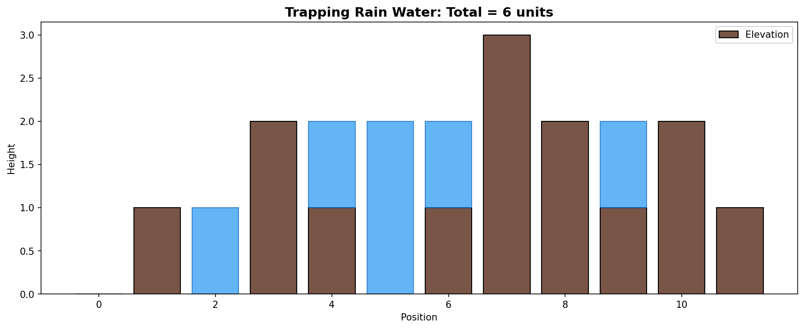
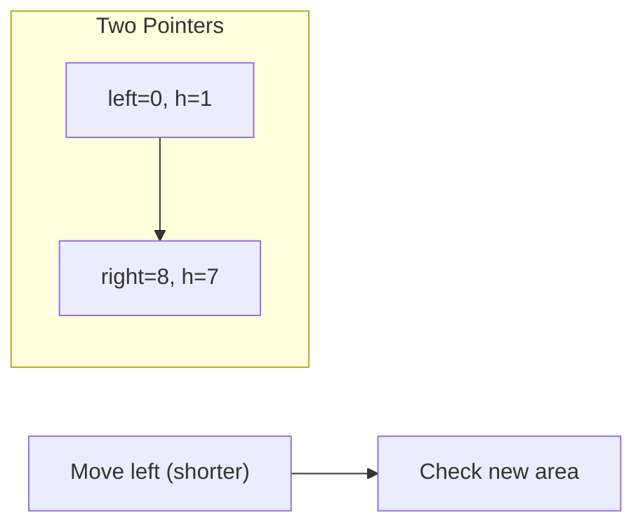
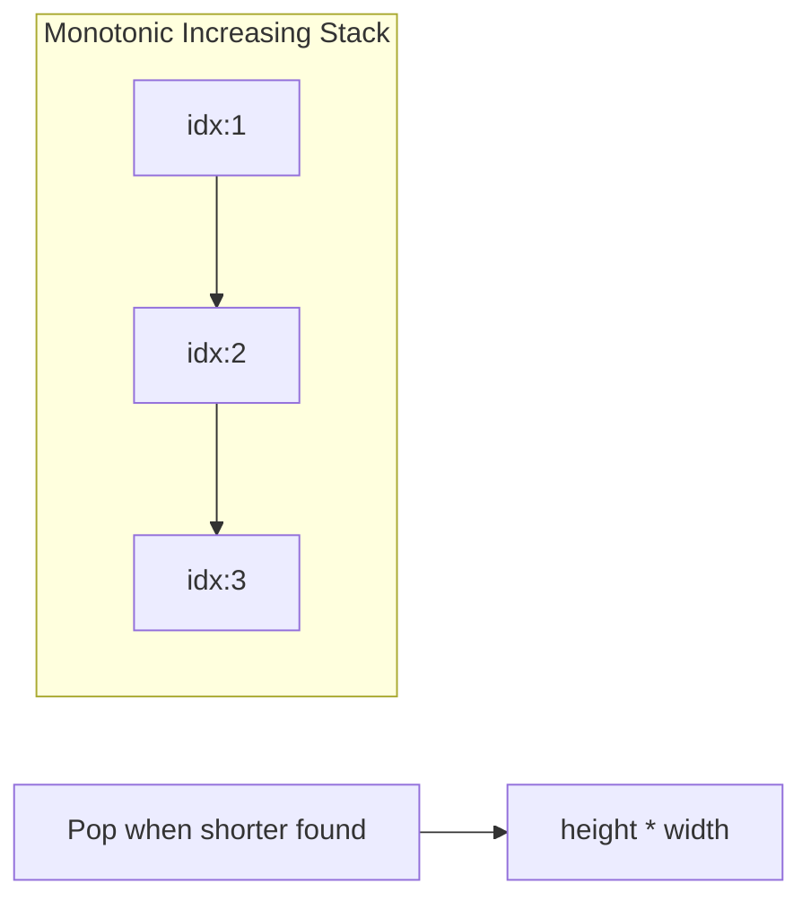
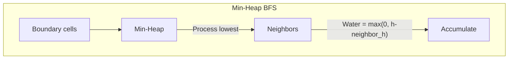
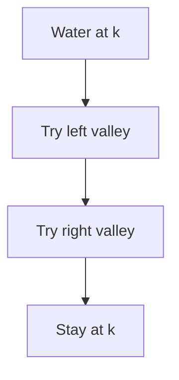

# Trapping Rain Water

> **LeetCode 42** | Difficulty: Hard | Pattern: Monotonic Stack / Two Pointers

---

## Problem Statement

Given `n` non-negative integers representing an elevation map where the width of each bar is `1`, compute how much water it can trap after raining.

### Examples

**Example 1:**
```
Input: height = [0,1,0,2,1,0,1,3,2,1,2,1]
Output: 6
```

```
       |
   |   ||_|
 |_||_|||||||
[0,1,0,2,1,0,1,3,2,1,2,1]

Water trapped = 6 units (shown as spaces between bars)
```

**Example 2:**
```
Input: height = [4,2,0,3,2,5]
Output: 9
```

### Constraints

- `n == height.length`
- `1 <= n <= 2 * 10^4`
- `0 <= height[i] <= 10^5`

---

## Intuition

Water at each position depends on:
- The maximum height to its **left**
- The maximum height to its **right**
- Water level = `min(left_max, right_max) - height[i]`

**Key Insight**: Water is trapped in "valleys" - the minimum of the two surrounding maximums determines the water level.

---

## Visualization



```
For height = [0,1,0,2,1,0,1,3,2,1,2,1]:

Position 2 (height=0):
  left_max = 1, right_max = 3
  water = min(1, 3) - 0 = 1

Position 5 (height=0):
  left_max = 2, right_max = 3
  water = min(2, 3) - 0 = 2

Total = 6
```

---

## Solution 1: Two Pointer (Optimal)

```python
def trap(height: list[int]) -> int:
    """
    Two pointer approach - O(n) time, O(1) space.

    Move the pointer with smaller max, because water at that side
    is determined by its own max (the smaller one).
    """
    if not height:
        return 0

    left, right = 0, len(height) - 1
    left_max, right_max = 0, 0
    water = 0

    while left < right:
        if height[left] < height[right]:
            # Water at left is bounded by left_max
            if height[left] >= left_max:
                left_max = height[left]
            else:
                water += left_max - height[left]
            left += 1
        else:
            # Water at right is bounded by right_max
            if height[right] >= right_max:
                right_max = height[right]
            else:
                water += right_max - height[right]
            right -= 1

    return water
```

::: info Complexity: Time O(n) · Space O(1)
- **Time:** Single pass with two pointers moving toward center. Each element is processed exactly once
- **Space:** Only 4 variables (left, right, left_max, right_max) regardless of input size - no auxiliary data structures needed
:::

### Why This Works

When `height[left] < height[right]`:
- There's definitely a wall on the right that's >= `height[right]`
- So water at `left` is bounded by `left_max` (the bottleneck is on the left)
- We can safely calculate water at `left` and move on

---

## Solution 2: Monotonic Stack

```python
def trap(height: list[int]) -> int:
    """
    Monotonic decreasing stack approach.

    When we find a bar taller than stack top, we can trap water
    in the valley formed.

    Time: O(n)
    Space: O(n)
    """
    stack = []  # Stores indices
    water = 0

    for i, h in enumerate(height):
        while stack and height[stack[-1]] < h:
            bottom = stack.pop()

            if not stack:
                break  # No left boundary

            # Calculate water trapped above 'bottom'
            left_idx = stack[-1]
            width = i - left_idx - 1
            bounded_height = min(h, height[left_idx]) - height[bottom]
            water += width * bounded_height

        stack.append(i)

    return water
```

::: info Complexity: Time O(n) · Space O(n)
- **Time:** Each index is pushed exactly once and popped at most once. Inner while loop across all iterations totals O(n) pops
- **Space:** Stack can hold all n indices in worst case (strictly decreasing heights like [5, 4, 3, 2, 1])
:::

### Stack Approach Visualization

```
height = [0, 1, 0, 2]

i=0, h=0: stack=[0]
i=1, h=1:
  h > height[0], pop 0
  No left boundary, break
  stack=[1]

i=2, h=0: stack=[1, 2]

i=3, h=2:
  h > height[2], pop 2
  left_idx=1, bottom height=0
  width = 3-1-1 = 1
  bounded_height = min(2, 1) - 0 = 1
  water += 1

  h > height[1], pop 1
  No left boundary, break
  stack=[3]

Total water = 1
```

---

## Solution 3: Dynamic Programming

```python
def trap(height: list[int]) -> int:
    """
    Precompute left_max and right_max for each position.

    Time: O(n)
    Space: O(n)
    """
    if not height:
        return 0

    n = len(height)

    # left_max[i] = max height to the left of i (inclusive)
    left_max = [0] * n
    left_max[0] = height[0]
    for i in range(1, n):
        left_max[i] = max(left_max[i-1], height[i])

    # right_max[i] = max height to the right of i (inclusive)
    right_max = [0] * n
    right_max[-1] = height[-1]
    for i in range(n-2, -1, -1):
        right_max[i] = max(right_max[i+1], height[i])

    # Calculate water at each position
    water = 0
    for i in range(n):
        water += min(left_max[i], right_max[i]) - height[i]

    return water
```

::: info Complexity: Time O(n) · Space O(n)
- **Time:** Three separate O(n) passes: compute left_max array, compute right_max array, calculate total water
- **Space:** Two auxiliary arrays of size n (left_max and right_max) to store precomputed maximums
:::

---

## Complexity Comparison

| Approach | Time | Space | Notes |
|----------|------|-------|-------|
| **Brute Force** | O(n^2) | O(1) | For each i, find left/right max |
| **DP** | O(n) | O(n) | Precompute left/right max arrays |
| **Monotonic Stack** | O(n) | O(n) | Calculate water layer by layer |
| **Two Pointer** | O(n) | O(1) | Optimal space |

---

## Step-by-Step: Two Pointer

For `height = [4, 2, 0, 3, 2, 5]`:

```
Initial: left=0, right=5, left_max=0, right_max=0, water=0

Step 1: height[0]=4 < height[5]=5
  height[0]=4 >= left_max=0, update left_max=4
  left=1

Step 2: height[1]=2 < height[5]=5
  height[1]=2 < left_max=4
  water += 4-2 = 2
  left=2

Step 3: height[2]=0 < height[5]=5
  height[2]=0 < left_max=4
  water += 4-0 = 4 (total: 6)
  left=3

Step 4: height[3]=3 < height[5]=5
  height[3]=3 < left_max=4
  water += 4-3 = 1 (total: 7)
  left=4

Step 5: height[4]=2 < height[5]=5
  height[4]=2 < left_max=4
  water += 4-2 = 2 (total: 9)
  left=5

left == right, done!
Total water = 9
```

---

## Edge Cases

```python
def test_trap():
    # No trapping possible
    assert trap([]) == 0
    assert trap([1]) == 0
    assert trap([1, 2]) == 0
    assert trap([1, 2, 3]) == 0  # Increasing
    assert trap([3, 2, 1]) == 0  # Decreasing

    # Simple valley
    assert trap([1, 0, 1]) == 1
    assert trap([2, 0, 2]) == 2

    # Multiple valleys
    assert trap([3, 0, 2, 0, 4]) == 7

    # Flat sections
    assert trap([1, 1, 1]) == 0

    # Large values
    assert trap([100000, 0, 100000]) == 100000
```

---

## Common Mistakes

1. **Not handling empty or single element arrays**
   ```python
   if len(height) < 3:
       return 0  # Need at least 3 bars to trap water
   ```

2. **Wrong water calculation**
   ```python
   # Water can't be negative
   water_at_i = max(0, min(left_max, right_max) - height[i])
   ```

3. **Off-by-one in two pointer**
   ```python
   # Use < not <= in while condition
   while left < right:  # Not left <= right
   ```

---

## Google Interview Tips

### What Interviewers Look For

1. **Multiple Approaches**: Know at least 2 solutions
2. **Space Optimization**: Start with DP, optimize to two pointer
3. **Edge Cases**: Handle empty, single element, no valleys

### Common Follow-up Questions

1. **"Can you solve it in O(1) space?"**
   - Yes, use two pointer approach

2. **"What if the bars have varying widths?"**
   - Track x-coordinates, adjust width calculation

3. **"What about 3D trapping rain water?"**
   - Use priority queue (heap) with BFS from boundary
   - LeetCode 407: Trapping Rain Water II

4. **"What if water can flow out the sides?"**
   - Only trap between the first and last non-zero bars

---

## 3D Trapping Rain Water (LC 407)

```python
import heapq

def trapRainWater(heightMap: list[list[int]]) -> int:
    """
    Use min-heap BFS from boundary.
    Water level is determined by minimum boundary.
    """
    if not heightMap or not heightMap[0]:
        return 0

    m, n = len(heightMap), len(heightMap[0])
    visited = [[False] * n for _ in range(m)]
    heap = []  # (height, row, col)

    # Add boundary cells to heap
    for i in range(m):
        for j in range(n):
            if i == 0 or i == m-1 or j == 0 or j == n-1:
                heapq.heappush(heap, (heightMap[i][j], i, j))
                visited[i][j] = True

    water = 0
    directions = [(0, 1), (0, -1), (1, 0), (-1, 0)]

    while heap:
        h, r, c = heapq.heappop(heap)

        for dr, dc in directions:
            nr, nc = r + dr, c + dc
            if 0 <= nr < m and 0 <= nc < n and not visited[nr][nc]:
                visited[nr][nc] = True
                # Water trapped at (nr, nc)
                water += max(0, h - heightMap[nr][nc])
                # New cell's effective height is max of its height and water level
                heapq.heappush(heap, (max(h, heightMap[nr][nc]), nr, nc))

    return water
```

::: info Complexity: Time O(m * n * log(m * n)) · Space O(m * n)
- **Time:** Each cell is pushed/popped from heap once. Heap operations on m*n elements cost O(log(m*n)) each
- **Space:** Visited array is O(m * n). Heap can hold O(m * n) boundary cells in worst case
:::

---

## Related Problems

::: details Container With Most Water (LeetCode 11)
**Problem:** Find two lines that together with x-axis form container with most water.

**Key Insight:** Area = min(heights) * width. Greedy: move shorter line inward hoping for taller.



**Approach:** Start pointers at ends. Move pointer with smaller height. Track max area.

**Complexity:** O(n) time, O(1) space
:::

::: details Largest Rectangle in Histogram (LeetCode 84)
**Problem:** Find largest rectangular area in histogram of bar heights.

**Key Insight:** For each bar, find how far it extends left and right (until shorter bar).



**Approach:** Monotonic increasing stack. On pop, calculate area with popped height as minimum.

**Complexity:** O(n) time, O(n) space
:::

::: details Trapping Rain Water II (LeetCode 407)
**Problem:** 3D version - given height map grid, compute water trapped.

**Key Insight:** Water level determined by minimum boundary. Process from outside in using min-heap BFS.



**Approach:** Add boundary to min-heap. Process lowest, spread inward, track water trapped.

**Complexity:** O(mn log(mn)) time, O(mn) space
:::

::: details Pour Water (LeetCode 755)
**Problem:** Simulate water droplets falling at position k, settling in valleys.

**Key Insight:** Each droplet finds lowest position (prefer left, then right, else stay).



**Approach:** Simulate each droplet. Scan left for valley, then right, settle at lowest found.

**Complexity:** O(V * n) where V = water volume
:::

---

## References

- [LeetCode 42 - Trapping Rain Water](https://leetcode.com/problems/trapping-rain-water/)
- [NeetCode Solution](https://neetcode.io/solutions/trapping-rain-water)
- [Two Pointer Technique](https://leetcode.com/discuss/study-guide/1688903/Two-Pointers-Pattern)
