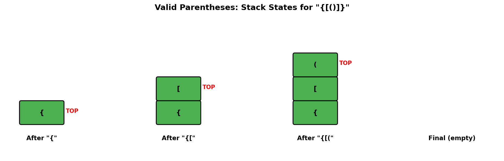
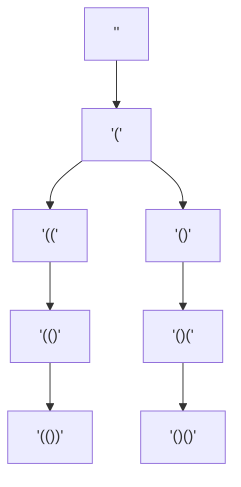
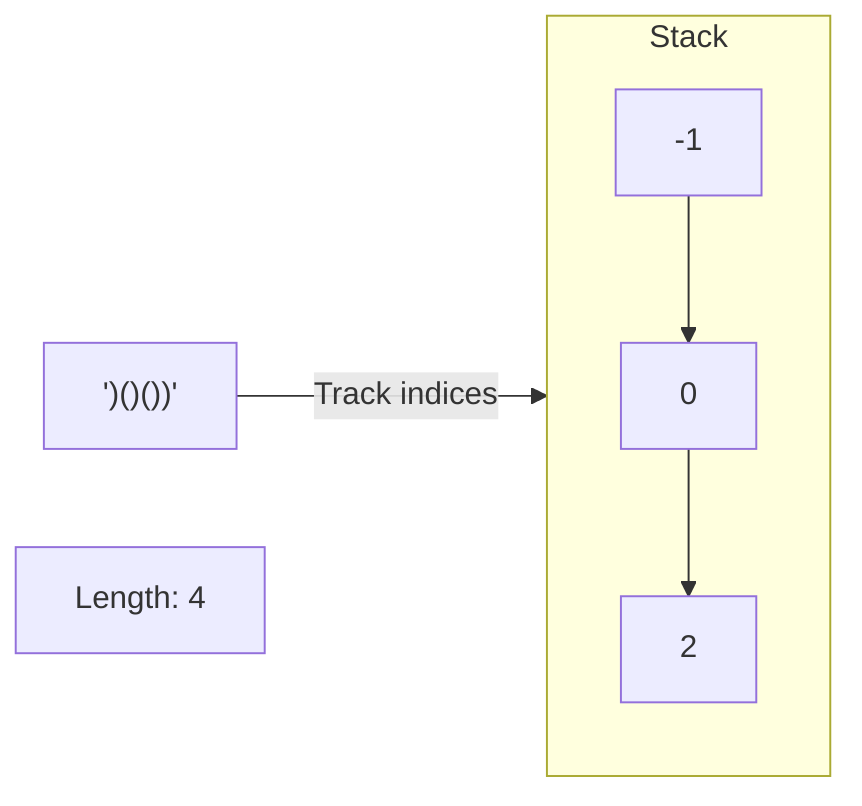
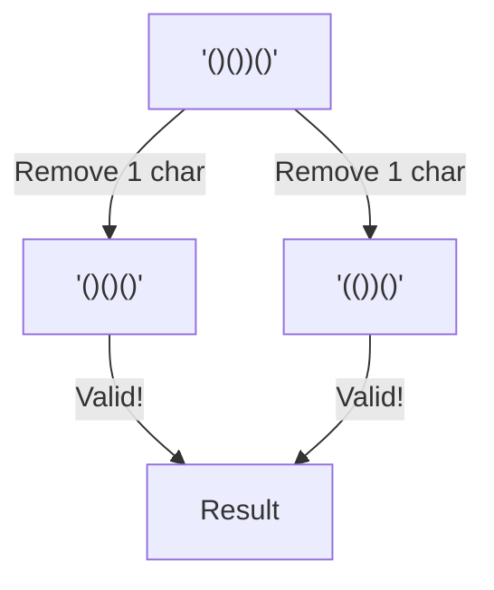
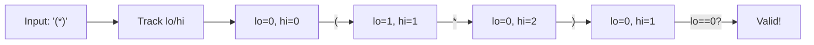

# Valid Parentheses

> **LeetCode 20** | Difficulty: Easy | Pattern: Stack Matching Pairs

---

## Problem Statement

Given a string `s` containing just the characters `'('`, `')'`, `'{'`, `'}'`, `'['` and `']'`, determine if the input string is valid.

An input string is valid if:

1. Open brackets must be closed by the same type of brackets
2. Open brackets must be closed in the correct order
3. Every close bracket has a corresponding open bracket of the same type

### Examples

**Example 1:**
```
Input: s = "()"
Output: true
```

**Example 2:**
```
Input: s = "()[]{}"
Output: true
```

**Example 3:**
```
Input: s = "(]"
Output: false
```

**Example 4:**
```
Input: s = "([)]"
Output: false
```

**Example 5:**
```
Input: s = "{[]}"
Output: true
```

### Constraints

- `1 <= s.length <= 10^4`
- `s` consists of parentheses only `'()[]{}'`

---

## Why Use a Stack?

A stack is perfect for this problem because of its **LIFO (Last In, First Out)** property. The most recently opened bracket must be the first one to close.

### Why Simple Counting Fails

Consider `[(])`:
- Count of `[` = 1, count of `]` = 1
- Count of `(` = 1, count of `)` = 1

Counts are balanced, but the string is **invalid** because brackets are not properly nested.

---

## Stack State Visualization



For input `"{[()]}"`:

```
Step 1: Read '{'
Stack: ['{']

Step 2: Read '['
Stack: ['{', '[']

Step 3: Read '('
Stack: ['{', '[', '(']

Step 4: Read ')' - matches '('
Stack: ['{', '[']

Step 5: Read ']' - matches '['
Stack: ['{']

Step 6: Read '}' - matches '{'
Stack: []

Result: Stack empty -> VALID
```

For input `"([)]"`:

```
Step 1: Read '('
Stack: ['(']

Step 2: Read '['
Stack: ['(', '[']

Step 3: Read ')' - expects '[' but got ')'
MISMATCH! Return False

Result: INVALID
```

---

## Solution

```python
def isValid(s: str) -> bool:
    """
    Check if the parentheses in string s are valid.

    Args:
        s: String containing only '(){}[]'

    Returns:
        True if parentheses are balanced and properly nested
    """
    stack = []
    # Map closing brackets to their corresponding opening brackets
    mapping = {')': '(', '}': '{', ']': '['}

    for char in s:
        if char in mapping:
            # It's a closing bracket
            # Check if stack is empty or top doesn't match
            if not stack or stack[-1] != mapping[char]:
                return False
            stack.pop()  # Match found, remove the opening bracket
        else:
            # It's an opening bracket, push to stack
            stack.append(char)

    # Valid only if all brackets were matched (empty stack)
    return len(stack) == 0
```

::: info Complexity: Time O(n) · Space O(n)
- **Time:** Single pass through string. Each character involves O(1) operations: dictionary lookup, stack push/pop
- **Space:** Stack can hold up to n/2 opening brackets. Worst case is all opening brackets like "((((((" where stack grows to n elements
:::

### Alternative: Using Set for Opening Brackets

```python
def isValid(s: str) -> bool:
    stack = []
    mapping = {')': '(', '}': '{', ']': '['}
    opening = set('([{')

    for char in s:
        if char in opening:
            stack.append(char)
        elif char in mapping:
            if not stack or stack.pop() != mapping[char]:
                return False

    return not stack
```

::: info Complexity: Time O(n) · Space O(n)
- **Time:** Same as main solution - O(n) single pass. Set lookup for opening brackets is O(1) with 3-element set
- **Space:** O(n) for stack. The set and mapping are O(1) since they have fixed size (3 bracket types)
:::

---

## Algorithm Walkthrough

### Step-by-Step Process

1. **Initialize** an empty stack and a mapping of closing to opening brackets
2. **Iterate** through each character in the string:
   - If it's an **opening bracket** (`(`, `[`, `{`): push to stack
   - If it's a **closing bracket** (`)`, `]`, `}`):
     - If stack is empty: return `False` (no matching opener)
     - If top of stack doesn't match: return `False`
     - If top matches: pop from stack (brackets matched)
3. **Return** `True` if stack is empty, `False` otherwise

---

## Complexity Analysis

| Aspect | Complexity | Explanation |
|--------|------------|-------------|
| **Time** | O(n) | Single pass through the string |
| **Space** | O(n) | Worst case: all opening brackets (e.g., "((((") |

### Best/Worst Cases

- **Best Case**: O(1) space - alternating open/close like `()()()`
- **Worst Case**: O(n) space - all opening brackets like `((((((`

---

## Edge Cases

```python
# Test cases to consider
test_cases = [
    ("", True),           # Empty string is valid
    ("(", False),         # Single opening bracket
    (")", False),         # Single closing bracket
    ("()", True),         # Simple pair
    ("([])", True),       # Nested different types
    ("([)]", False),      # Interleaved (invalid)
    ("((()))", True),     # Deep nesting
    ("(()())", True),     # Same level siblings
]
```

---

## Common Variations

### 1. Valid Parenthesis String (with `*`)

The `*` can represent `(`, `)`, or empty string.

```python
def checkValidString(s: str) -> bool:
    """LeetCode 678: * can be (, ), or empty."""
    lo = hi = 0  # Range of possible open bracket count

    for char in s:
        if char == '(':
            lo += 1
            hi += 1
        elif char == ')':
            lo = max(lo - 1, 0)
            hi -= 1
        else:  # char == '*'
            lo = max(lo - 1, 0)  # * acts as )
            hi += 1              # * acts as (

        if hi < 0:  # Too many closing brackets
            return False

    return lo == 0
```

::: info Complexity: Time O(n) · Space O(1)
- **Time:** Single pass through the string with O(1) operations per character
- **Space:** Only two integer variables (lo, hi) regardless of input size - no stack needed due to greedy range tracking
:::

### 2. Minimum Remove to Make Valid

```python
def minRemoveToMakeValid(s: str) -> str:
    """LeetCode 1249: Remove minimum brackets to make valid."""
    s = list(s)
    stack = []  # Stores indices of '('

    for i, char in enumerate(s):
        if char == '(':
            stack.append(i)
        elif char == ')':
            if stack:
                stack.pop()
            else:
                s[i] = ''  # Mark for removal

    # Remove unmatched '('
    for i in stack:
        s[i] = ''

    return ''.join(s)
```

::: info Complexity: Time O(n) · Space O(n)
- **Time:** Two passes - first to identify mismatches O(n), second to mark unmatched '(' O(k) where k <= n. Final join is O(n)
- **Space:** O(n) to convert string to list for in-place modification. Stack holds at most n/2 indices of '(' characters
:::

### 3. Longest Valid Parentheses

```python
def longestValidParentheses(s: str) -> int:
    """LeetCode 32: Find longest valid substring."""
    stack = [-1]  # Base index
    max_len = 0

    for i, char in enumerate(s):
        if char == '(':
            stack.append(i)
        else:
            stack.pop()
            if not stack:
                stack.append(i)  # New base
            else:
                max_len = max(max_len, i - stack[-1])

    return max_len
```

::: info Complexity: Time O(n) · Space O(n)
- **Time:** Single pass through string. Each character involves O(1) stack operations and length calculation
- **Space:** Stack stores indices; worst case is all '(' characters where stack grows to n+1 elements (including base -1)
:::

---

## Interview Tips

### What Interviewers Look For

1. **Pattern Recognition**: Quickly identify this as a stack problem
2. **Edge Cases**: Handle empty string, single character, unbalanced brackets
3. **Clean Code**: Use a mapping for bracket pairs

### Common Follow-Up Questions

1. "What if the string contains other characters?"
   - Skip non-bracket characters

2. "Can you solve it with O(1) space?"
   - Only for single bracket type `()` using counter

3. "How would you handle custom bracket types?"
   - Pass the mapping as a parameter

---

## Related Problems

::: details Generate Parentheses (LeetCode 22)
**Problem:** Given n pairs of parentheses, generate all combinations of well-formed parentheses.

**Key Insight:** Use backtracking with two counters (open and close). Add '(' if open < n, add ')' if close < open.



**Approach:** Backtracking - build string character by character, pruning invalid paths early.

**Complexity:** O(4^n / sqrt(n)) time (Catalan number), O(n) recursion depth
:::

::: details Longest Valid Parentheses (LeetCode 32)
**Problem:** Given a string containing just '(' and ')', find the length of the longest valid parentheses substring.

**Key Insight:** Use stack to track indices. Initialize with -1 as base. On ')', pop and calculate length from current stack top.



**Approach:** Stack stores indices of '(' characters. When matching ')', calculate substring length = current_index - stack_top.

**Complexity:** O(n) time, O(n) space
:::

::: details Remove Invalid Parentheses (LeetCode 301)
**Problem:** Remove the minimum number of invalid parentheses to make the input string valid. Return all unique valid strings.

**Key Insight:** BFS level-by-level removal. First level with valid strings = minimum removals needed.



**Approach:** BFS explores all strings with k removals before k+1. Stop at first level containing valid strings.

**Complexity:** O(2^n) time (with pruning), O(n) space
:::

::: details Valid Parenthesis String (LeetCode 678)
**Problem:** String contains '(', ')', and '*' (wildcard that can be '(', ')', or empty). Determine if valid.

**Key Insight:** Track range of possible open bracket counts (lo, hi). '*' expands the range.



**Approach:** Greedy with range tracking. lo = min possible open, hi = max possible open. Valid if lo reaches 0.

**Complexity:** O(n) time, O(1) space
:::

---

## References

- [LeetCode 20 - Valid Parentheses](https://leetcode.com/problems/valid-parentheses/)
- [NeetCode Solution](https://neetcode.io/solutions/valid-parentheses)
