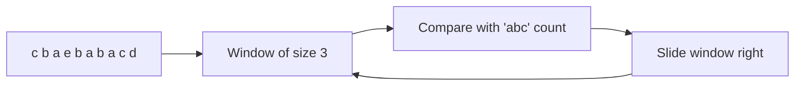
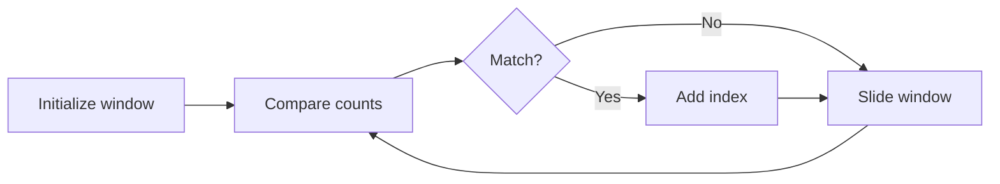

# Anagram Problems

> **Character counting and hash map techniques**

Anagram problems are among the most frequently asked string questions in technical interviews. They test your understanding of character frequency counting, hash maps, and efficient comparison techniques.

---

## What is an Anagram?

An **anagram** is a word or phrase formed by rearranging the letters of another word or phrase, using all the original letters exactly once.

Examples:
- "listen" and "silent" are anagrams
- "anagram" and "nagaram" are anagrams
- "rat" and "car" are NOT anagrams (different letters)

---

## Problem 1: Valid Anagram

### Problem Statement

Given two strings `s` and `t`, return `true` if `t` is an anagram of `s`, and `false` otherwise.

This is [LeetCode Problem #242](https://leetcode.com/problems/valid-anagram/) - an Easy difficulty problem.

### Examples

| s | t | Output | Explanation |
|---|---|--------|-------------|
| `"anagram"` | `"nagaram"` | `true` | Same letters, same counts |
| `"rat"` | `"car"` | `false` | Different letters |
| `"a"` | `"ab"` | `false` | Different lengths |
| `""` | `""` | `true` | Both empty |

### Approach 1: Character Counting

The most efficient approach uses character frequency counting:

1. If lengths differ, return false immediately
2. Count character frequencies in both strings
3. Compare the frequency maps

```mermaid
flowchart TD
    A[Start] --> B{len(s) == len(t)?}
    B -->|No| C[Return False]
    B -->|Yes| D[Count chars in s]
    D --> E[Count chars in t]
    E --> F{Counts equal?}
    F -->|Yes| G[Return True]
    F -->|No| C

    style G fill:#c8e6c9
    style C fill:#ffcdd2
```

### Solution: Character Counting

```python
from collections import Counter

def isAnagram(s: str, t: str) -> bool:
    """
    Check if t is an anagram of s using Counter.

    Time: O(n) where n = len(s)
    Space: O(k) where k = number of unique characters
    """
    if len(s) != len(t):
        return False

    return Counter(s) == Counter(t)
```

::: info Complexity: Time O(n) - Space O(k)
- **Time:** O(n) where n is string length. Counter creation and comparison both linear.
- **Space:** O(k) where k is number of unique characters (at most 26 for lowercase).
:::

```python
def isAnagram_array(s: str, t: str) -> bool:
    """
    Check anagram using array (for lowercase letters only).

    Time: O(n)
    Space: O(1) - fixed 26 characters
    """
    if len(s) != len(t):
        return False

    count = [0] * 26

    for i in range(len(s)):
        count[ord(s[i]) - ord('a')] += 1
        count[ord(t[i]) - ord('a')] -= 1

    return all(c == 0 for c in count)
```

::: info Complexity: Time O(n) - Space O(1)
- **Time:** O(n) - single pass through both strings simultaneously.
- **Space:** O(1) - fixed 26-element array regardless of input size.
:::

### Approach 2: Sorting

A simpler but less efficient approach:

```python
def isAnagram_sorting(s: str, t: str) -> bool:
    """
    Check anagram by sorting both strings.

    Time: O(n log n)
    Space: O(n) for sorted strings
    """
    return sorted(s) == sorted(t)
```

::: info Complexity: Time O(n log n) - Space O(n)
- **Time:** O(n log n) dominated by sorting both strings.
- **Space:** O(n) for creating sorted copies of both strings.
:::

### Complexity Comparison

| Approach | Time | Space | Best For |
|----------|------|-------|----------|
| Counter | O(n) | O(k) | General use |
| Array (26) | O(n) | O(1) | Lowercase only |
| Sorting | O(n log n) | O(n) | Simple implementation |

---

## Problem 2: Find All Anagrams in a String

### Problem Statement

Given two strings `s` and `p`, return an array of all the start indices of `p`'s anagrams in `s`. You may return the answer in any order.

This is [LeetCode Problem #438](https://leetcode.com/problems/find-all-anagrams-in-a-string/) - a Medium difficulty problem.

### Examples

| s | p | Output | Explanation |
|---|---|--------|-------------|
| `"cbaebabacd"` | `"abc"` | `[0, 6]` | "cba" at 0, "bac" at 6 |
| `"abab"` | `"ab"` | `[0, 1, 2]` | "ab" at 0, "ba" at 1, "ab" at 2 |

### Approach: Sliding Window

Use a sliding window of size `len(p)` and compare character counts:



### Solution: Sliding Window

```python
from collections import Counter

def findAnagrams(s: str, p: str) -> list[int]:
    """
    Find all starting indices of anagrams of p in s.

    Time: O(n) where n = len(s)
    Space: O(k) where k = unique characters in p
    """
    if len(p) > len(s):
        return []

    p_count = Counter(p)
    window_count = Counter(s[:len(p)])
    result = []

    # Check first window
    if window_count == p_count:
        result.append(0)

    # Slide the window
    for i in range(len(p), len(s)):
        # Add new character
        window_count[s[i]] += 1

        # Remove old character
        old_char = s[i - len(p)]
        window_count[old_char] -= 1
        if window_count[old_char] == 0:
            del window_count[old_char]

        # Check if anagram
        if window_count == p_count:
            result.append(i - len(p) + 1)

    return result
```

::: info Complexity: Time O(n) - Space O(k)
- **Time:** O(n) where n = len(s). Each character added/removed once, Counter comparison is O(k) for unique chars.
- **Space:** O(k) where k is unique characters in p (at most 26 for lowercase).
:::

### Optimized Solution: Match Counter

```python
def findAnagrams_optimized(s: str, p: str) -> list[int]:
    """
    Optimized using a 'matches' counter to avoid comparing entire dicts.

    Time: O(n)
    Space: O(1) - at most 26 characters
    """
    if len(p) > len(s):
        return []

    p_count = [0] * 26
    s_count = [0] * 26
    result = []

    # Count characters in p
    for c in p:
        p_count[ord(c) - ord('a')] += 1

    for i in range(len(s)):
        # Add current character
        s_count[ord(s[i]) - ord('a')] += 1

        # Remove character outside window
        if i >= len(p):
            s_count[ord(s[i - len(p)]) - ord('a')] -= 1

        # Compare counts
        if i >= len(p) - 1 and s_count == p_count:
            result.append(i - len(p) + 1)

    return result
```

::: info Complexity: Time O(n) - Space O(1)
- **Time:** O(n) with O(1) array comparison (comparing 26 elements is constant time).
- **Space:** O(1) - two fixed 26-element arrays regardless of input size.
:::

---

## Problem 3: Valid Anagram with Unicode

### Problem Statement

**Follow-up:** What if the inputs contain Unicode characters?

### Solution

```python
from collections import Counter

def isAnagram_unicode(s: str, t: str) -> bool:
    """
    Valid anagram check supporting Unicode characters.

    Uses Counter which handles any hashable character.

    Time: O(n)
    Space: O(k) where k = unique characters
    """
    if len(s) != len(t):
        return False

    # Counter works with any Unicode characters
    return Counter(s) == Counter(t)


# Test with Unicode
print(isAnagram_unicode("cafe", "face"))  # True
print(isAnagram_unicode("cafe", "face"))  # True with accented characters
```

::: info Complexity: Time O(n) - Space O(k)
- **Time:** O(n) for Counter creation and comparison.
- **Space:** O(k) where k is number of unique Unicode characters in the input.
:::

---

## Problem 4: Minimum Number of Steps to Make Two Strings Anagram

### Problem Statement

Given two strings `s` and `t` of the same length, return the minimum number of steps to make `t` an anagram of `s`.

In one step, you can replace any character in `t` with any character.

This is [LeetCode Problem #1347](https://leetcode.com/problems/minimum-number-of-steps-to-make-two-strings-anagram/).

### Example

| s | t | Output | Explanation |
|---|---|--------|-------------|
| `"bab"` | `"aba"` | `1` | Replace 'a' in t with 'b' |
| `"leetcode"` | `"practice"` | `5` | Need to change 5 characters |

### Solution

```python
from collections import Counter

def minSteps(s: str, t: str) -> int:
    """
    Find minimum replacements to make t an anagram of s.

    Key insight: Count excess characters in t that aren't needed.

    Time: O(n)
    Space: O(k)
    """
    s_count = Counter(s)
    t_count = Counter(t)

    steps = 0
    for char, count in t_count.items():
        # If t has more of this char than s needs
        if count > s_count.get(char, 0):
            steps += count - s_count.get(char, 0)

    return steps
```

::: info Complexity: Time O(n) - Space O(k)
- **Time:** O(n) to create both Counters and iterate through t_count.
- **Space:** O(k) where k is unique characters across both strings.
:::

```python
def minSteps_optimized(s: str, t: str) -> int:
    """
    Optimized: just count what s has that t is missing.
    """
    count = [0] * 26

    for i in range(len(s)):
        count[ord(s[i]) - ord('a')] += 1
        count[ord(t[i]) - ord('a')] -= 1

    # Sum of positive values = chars s has that t needs
    return sum(c for c in count if c > 0)
```

::: info Complexity: Time O(n) - Space O(1)
- **Time:** O(n) for single pass through both strings.
- **Space:** O(1) - fixed 26-element array for lowercase letters only.
:::

---

## Common Patterns and Techniques

### Pattern 1: Character Count Comparison

```python
# Using Counter (most Pythonic)
from collections import Counter
is_anagram = Counter(s) == Counter(t)

# Using array (O(1) space for known charset)
def char_count(s):
    count = [0] * 26
    for c in s:
        count[ord(c) - ord('a')] += 1
    return count

# Using defaultdict
from collections import defaultdict
count = defaultdict(int)
for c in s:
    count[c] += 1
```

### Pattern 2: Single Pass with Increment/Decrement

```python
def is_anagram_single_pass(s: str, t: str) -> bool:
    """
    Increment for s, decrement for t in one pass.
    """
    if len(s) != len(t):
        return False

    count = {}
    for i in range(len(s)):
        count[s[i]] = count.get(s[i], 0) + 1
        count[t[i]] = count.get(t[i], 0) - 1

    return all(v == 0 for v in count.values())
```

### Pattern 3: Canonical Form

```python
def canonical_form(s: str) -> str:
    """Convert string to its 'canonical' anagram form."""
    return ''.join(sorted(s))

# Two strings are anagrams if they have the same canonical form
def are_anagrams(s: str, t: str) -> bool:
    return canonical_form(s) == canonical_form(t)
```

---

## Edge Cases

| Case | Example | Handling |
|------|---------|----------|
| Different lengths | `"ab"` vs `"abc"` | Return False immediately |
| Empty strings | `""` vs `""` | Return True (both empty) |
| Single character | `"a"` vs `"a"` | Direct comparison |
| Same string | `"abc"` vs `"abc"` | True (anagram of itself) |
| Case sensitivity | `"Ab"` vs `"aB"` | Usually case-sensitive |
| Spaces | `"a b"` vs `"ab "` | Usually consider spaces |

---

## Interview Tips

1. **Clarify the character set**: ASCII? Lowercase only? Unicode?
2. **Ask about case sensitivity**: Should 'A' and 'a' be treated the same?
3. **Consider space handling**: Are spaces significant?
4. **Start with Counter**: It's the most readable O(n) solution
5. **Mention array optimization**: For lowercase-only, use 26-element array

### Time-Space Trade-offs

| Constraint | Best Approach | Space |
|------------|---------------|-------|
| Lowercase only | 26-element array | O(1) |
| ASCII only | 128-element array | O(1) |
| Unicode | Counter/dict | O(k) |
| Memory critical | Sorting | O(n) time trade-off |

---

## Related Problems

::: details Valid Anagram (LeetCode 242)
**Problem:** Given two strings s and t, return true if t is an anagram of s, and false otherwise.

**Key Insight:** Anagrams have identical character frequency distributions.

**Approach:** Use Counter comparison or array-based counting with increment/decrement in single pass.

**Complexity:** O(n) time, O(1) space for fixed character set
:::

::: details Group Anagrams (LeetCode 49)
**Problem:** Given an array of strings, group anagrams together. Return groups in any order.

**Key Insight:** Use a canonical form (sorted string or character count tuple) as hash key.

**Approach:** For each string, compute its sorted form or count tuple. Use as key in hash map to group strings.

**Complexity:** O(n * k log k) with sorting, O(n * k) with counting
:::

::: details Find All Anagrams in a String (LeetCode 438)
**Problem:** Given strings s and p, find all start indices of p's anagrams in s.

**Key Insight:** Fixed-size sliding window with frequency comparison.

**Approach:** Slide a window of size len(p) over s. Use two frequency arrays/maps and compare as window moves.



**Complexity:** O(n) time, O(1) space
:::

::: details Permutation in String (LeetCode 567)
**Problem:** Return true if s2 contains any permutation of s1 as a substring.

**Key Insight:** Same as Find All Anagrams but return boolean on first match.

**Approach:** Fixed sliding window with character frequency matching. Early return on first valid window.

**Complexity:** O(n) time, O(1) space
:::

::: details Minimum Steps to Make Two Strings Anagram (LeetCode 1347)
**Problem:** Given two equal-length strings s and t, return minimum steps to make t an anagram of s (can replace any character in t).

**Key Insight:** Count characters that t has in excess of what s needs.

**Approach:** Count frequencies in both strings. Sum the positive differences (characters t needs to change).

**Complexity:** O(n) time, O(1) space
:::

---

## Summary

| Concept | Key Insight |
|---------|-------------|
| Anagram Check | Compare character frequencies |
| Best Structure | Counter or 26-element array |
| Sliding Window | Fixed-size window for finding anagrams |
| Canonical Form | sorted(s) gives unique representation |

**Key Takeaway:** Anagram problems are fundamentally about character counting. Master the Counter class and the 26-element array pattern for lowercase strings. For sliding window variants, maintain a running count that you update as the window moves.

---

## References

- [LeetCode - Valid Anagram](https://leetcode.com/problems/valid-anagram/)
- [LeetCode - Find All Anagrams in a String](https://leetcode.com/problems/find-all-anagrams-in-a-string/)
- [GeeksforGeeks - Anagram Problems](https://www.geeksforgeeks.org/check-whether-two-strings-are-anagram-of-each-other/)
