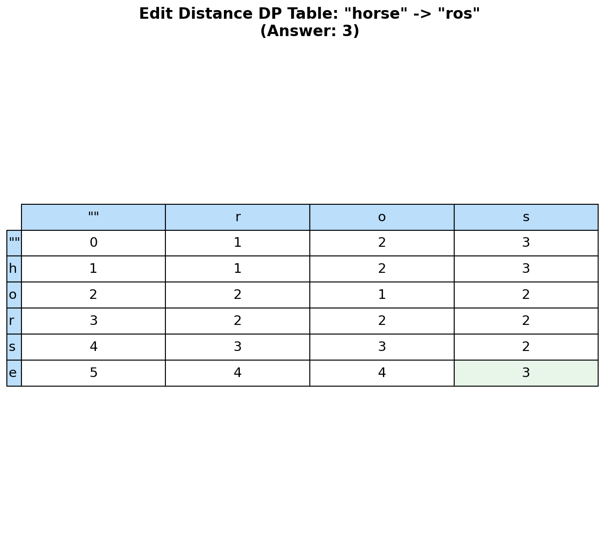

# Edit Distance (Levenshtein Distance)

> **Classic 2D dynamic programming for string transformation**

Edit Distance is one of the most fundamental dynamic programming problems and appears frequently in technical interviews. It measures the minimum number of operations required to transform one string into another.

---

## Problem Statement

Given two strings `word1` and `word2`, return the **minimum number of operations** required to convert `word1` to `word2`.

You have the following three operations permitted on a word:

1. **Insert** a character
2. **Delete** a character
3. **Replace** a character

This is [LeetCode Problem #72](https://leetcode.com/problems/edit-distance/) - a Medium difficulty problem (often considered Hard).

### Examples

| word1 | word2 | Output | Operations |
|-------|-------|--------|------------|
| `"horse"` | `"ros"` | `3` | horse -> rorse -> rose -> ros |
| `"intention"` | `"execution"` | `5` | Multiple operations |
| `""` | `"abc"` | `3` | Insert a, b, c |
| `"abc"` | `"abc"` | `0` | Already equal |

### Constraints

- `0 <= word1.length, word2.length <= 500`
- `word1` and `word2` consist of lowercase English letters

---

## DP Table Visualization



---

## Approach: Dynamic Programming

### Key Insight

Define `dp[i][j]` as the minimum edit distance between:
- First `i` characters of `word1` (i.e., `word1[0:i]`)
- First `j` characters of `word2` (i.e., `word2[0:j]`)

### Recurrence Relation

For each position, we have two cases:

**Case 1: Characters match** (`word1[i-1] == word2[j-1]`)
- No operation needed: `dp[i][j] = dp[i-1][j-1]`

**Case 2: Characters differ**
- **Replace**: `dp[i-1][j-1] + 1` (replace char in word1)
- **Delete**: `dp[i-1][j] + 1` (delete from word1)
- **Insert**: `dp[i][j-1] + 1` (insert into word1)
- Take minimum of all three

### Base Cases

- `dp[0][j] = j` (transform empty string to word2[0:j] requires j insertions)
- `dp[i][0] = i` (transform word1[0:i] to empty string requires i deletions)

### Mermaid Diagram

```mermaid
flowchart TD
    A[dp[i][j] = ?] --> B{word1[i-1] == word2[j-1]?}
    B -->|Yes| C["dp[i][j] = dp[i-1][j-1]<br/>(no operation)"]
    B -->|No| D[Take minimum of:]
    D --> E["dp[i-1][j-1] + 1<br/>(replace)"]
    D --> F["dp[i-1][j] + 1<br/>(delete)"]
    D --> G["dp[i][j-1] + 1<br/>(insert)"]

    style C fill:#c8e6c9
```

---

## Solution: 2D DP

```python
def minDistance(word1: str, word2: str) -> int:
    """
    Calculate minimum edit distance between two strings.

    Args:
        word1: Source string
        word2: Target string

    Returns:
        Minimum number of operations to transform word1 to word2

    Time: O(m * n) where m = len(word1), n = len(word2)
    Space: O(m * n) for the DP table
    """
    m, n = len(word1), len(word2)

    # Create DP table
    # dp[i][j] = min operations to convert word1[0:i] to word2[0:j]
    dp = [[0] * (n + 1) for _ in range(m + 1)]

    # Base cases
    # Converting empty string to word2[0:j] requires j insertions
    for j in range(n + 1):
        dp[0][j] = j

    # Converting word1[0:i] to empty string requires i deletions
    for i in range(m + 1):
        dp[i][0] = i

    # Fill the table
    for i in range(1, m + 1):
        for j in range(1, n + 1):
            if word1[i - 1] == word2[j - 1]:
                # Characters match - no operation needed
                dp[i][j] = dp[i - 1][j - 1]
            else:
                # Take minimum of three operations
                dp[i][j] = 1 + min(
                    dp[i - 1][j - 1],  # Replace
                    dp[i - 1][j],      # Delete
                    dp[i][j - 1]       # Insert
                )

    return dp[m][n]
```

::: info Complexity: Time O(m * n) - Space O(m * n)
- **Time:** O(m * n) to fill the 2D DP table where m and n are the lengths of word1 and word2.
- **Space:** O(m * n) for the 2D DP table storing edit distances for all (i, j) subproblems.
:::

---

## Visual Walkthrough

For `word1 = "horse"`, `word2 = "ros"`:

```
        ""    r    o    s
   ""    0    1    2    3
    h    1    1    2    3
    o    2    2    1    2
    r    3    2    2    2
    s    4    3    3    2
    e    5    4    4    3

Reading the table:
- dp[5][3] = 3 (answer)

Path (backtracking):
- (5,3) -> (4,3) -> (3,3) -> (2,2) -> (1,1) -> (0,0)
- Operations: delete 'e', replace 'h' with 'r', delete 'r'
- Or: horse -> rorse (replace) -> rose (delete) -> ros (delete)
```

---

## Space-Optimized Solution: O(n) Space

Since we only need the previous row to compute the current row:

```python
def minDistance_optimized(word1: str, word2: str) -> int:
    """
    Space-optimized edit distance using single row.

    Time: O(m * n)
    Space: O(n) - only store one row
    """
    m, n = len(word1), len(word2)

    # Use only two rows
    prev = list(range(n + 1))  # dp[i-1]
    curr = [0] * (n + 1)       # dp[i]

    for i in range(1, m + 1):
        curr[0] = i  # Base case for this row

        for j in range(1, n + 1):
            if word1[i - 1] == word2[j - 1]:
                curr[j] = prev[j - 1]
            else:
                curr[j] = 1 + min(
                    prev[j - 1],  # Replace
                    prev[j],      # Delete
                    curr[j - 1]   # Insert
                )

        prev, curr = curr, prev  # Swap rows

    return prev[n]


def minDistance_1d(word1: str, word2: str) -> int:
    """
    Even more space-efficient using single array.

    Time: O(m * n)
    Space: O(min(m, n))
    """
    # Ensure word2 is shorter for space optimization
    if len(word1) < len(word2):
        word1, word2 = word2, word1

    m, n = len(word1), len(word2)
    dp = list(range(n + 1))

    for i in range(1, m + 1):
        prev_diagonal = dp[0]
        dp[0] = i

        for j in range(1, n + 1):
            temp = dp[j]

            if word1[i - 1] == word2[j - 1]:
                dp[j] = prev_diagonal
            else:
                dp[j] = 1 + min(prev_diagonal, dp[j], dp[j - 1])

            prev_diagonal = temp

    return dp[n]
```

::: info Complexity: Time O(m * n) - Space O(n) / O(min(m, n))
- **Time:** O(m * n) - same as 2D version, but with better cache locality.
- **Space:** O(n) for two-row version, O(min(m, n)) for single-row version by swapping word1/word2 if needed.
:::

---

## Reconstructing the Operations

To get the actual sequence of operations:

```python
def minDistance_with_operations(word1: str, word2: str) -> tuple[int, list[str]]:
    """
    Return both minimum distance and the operations performed.

    Time: O(m * n)
    Space: O(m * n)
    """
    m, n = len(word1), len(word2)

    # Build DP table
    dp = [[0] * (n + 1) for _ in range(m + 1)]

    for j in range(n + 1):
        dp[0][j] = j
    for i in range(m + 1):
        dp[i][0] = i

    for i in range(1, m + 1):
        for j in range(1, n + 1):
            if word1[i - 1] == word2[j - 1]:
                dp[i][j] = dp[i - 1][j - 1]
            else:
                dp[i][j] = 1 + min(dp[i - 1][j - 1], dp[i - 1][j], dp[i][j - 1])

    # Backtrack to find operations
    operations = []
    i, j = m, n

    while i > 0 or j > 0:
        if i > 0 and j > 0 and word1[i - 1] == word2[j - 1]:
            i -= 1
            j -= 1
        elif i > 0 and j > 0 and dp[i][j] == dp[i - 1][j - 1] + 1:
            operations.append(f"Replace '{word1[i-1]}' with '{word2[j-1]}' at position {i-1}")
            i -= 1
            j -= 1
        elif i > 0 and dp[i][j] == dp[i - 1][j] + 1:
            operations.append(f"Delete '{word1[i-1]}' at position {i-1}")
            i -= 1
        else:
            operations.append(f"Insert '{word2[j-1]}' at position {i}")
            j -= 1

    operations.reverse()
    return dp[m][n], operations
```

::: info Complexity: Time O(m * n) - Space O(m * n)
- **Time:** O(m * n) for filling DP table plus O(m + n) for backtracking.
- **Space:** O(m * n) for DP table plus O(m + n) for the operations list.
:::

---

## Memoization Approach (Top-Down DP)

```python
from functools import lru_cache

def minDistance_memo(word1: str, word2: str) -> int:
    """
    Top-down DP with memoization.

    Time: O(m * n)
    Space: O(m * n) for memoization
    """
    @lru_cache(maxsize=None)
    def dp(i: int, j: int) -> int:
        # Base cases
        if i == 0:
            return j
        if j == 0:
            return i

        # Characters match
        if word1[i - 1] == word2[j - 1]:
            return dp(i - 1, j - 1)

        # Take minimum of three operations
        return 1 + min(
            dp(i - 1, j - 1),  # Replace
            dp(i - 1, j),      # Delete
            dp(i, j - 1)       # Insert
        )

    return dp(len(word1), len(word2))
```

::: info Complexity: Time O(m * n) - Space O(m * n)
- **Time:** O(m * n) - each unique (i, j) state computed once due to memoization.
- **Space:** O(m * n) for memoization cache plus O(m + n) for recursion call stack.
:::

---

## Complexity Analysis

| Approach | Time | Space |
|----------|------|-------|
| 2D DP | O(m * n) | O(m * n) |
| Optimized (2 rows) | O(m * n) | O(n) |
| Optimized (1 row) | O(m * n) | O(min(m, n)) |
| Memoization | O(m * n) | O(m * n) |

---

## Applications

1. **Spell Checking**: Suggest corrections for misspelled words
2. **DNA Sequence Alignment**: Measure similarity between genetic sequences
3. **Plagiarism Detection**: Find similar documents
4. **Fuzzy String Matching**: Search with typo tolerance
5. **Version Control**: Diff algorithms use similar concepts

---

## Variations

### 1. Minimum ASCII Delete Sum (LeetCode 712)

Instead of counting operations, minimize the sum of ASCII values of deleted characters.

```python
def minimumDeleteSum(s1: str, s2: str) -> int:
    """Minimize ASCII sum of deleted characters."""
    m, n = len(s1), len(s2)
    dp = [[0] * (n + 1) for _ in range(m + 1)]

    # Base cases: sum of ASCII values
    for i in range(1, m + 1):
        dp[i][0] = dp[i-1][0] + ord(s1[i-1])
    for j in range(1, n + 1):
        dp[0][j] = dp[0][j-1] + ord(s2[j-1])

    for i in range(1, m + 1):
        for j in range(1, n + 1):
            if s1[i-1] == s2[j-1]:
                dp[i][j] = dp[i-1][j-1]
            else:
                dp[i][j] = min(
                    dp[i-1][j] + ord(s1[i-1]),  # Delete from s1
                    dp[i][j-1] + ord(s2[j-1])   # Delete from s2
                )

    return dp[m][n]
```

::: info Complexity: Time O(m * n) - Space O(m * n)
- **Time:** O(m * n) to fill the DP table considering ASCII values.
- **Space:** O(m * n) for the DP table. Can be optimized to O(n) with single row.
:::

### 2. One Edit Distance (LeetCode 161)

Check if two strings are exactly one edit apart.

```python
def isOneEditDistance(s: str, t: str) -> bool:
    """Check if strings are exactly one edit apart."""
    m, n = len(s), len(t)

    # Ensure s is shorter or equal
    if m > n:
        return isOneEditDistance(t, s)

    if n - m > 1:
        return False

    for i in range(m):
        if s[i] != t[i]:
            if m == n:
                return s[i+1:] == t[i+1:]  # Replace
            return s[i:] == t[i+1:]  # Insert/Delete

    return m + 1 == n  # Check if only difference is last char
```

::: info Complexity: Time O(n) - Space O(1)
- **Time:** O(n) for single pass through the strings to find the difference point.
- **Space:** O(1) - only uses a few index variables.
:::

---

## Edge Cases

| Case | word1 | word2 | Output | Note |
|------|-------|-------|--------|------|
| Both empty | `""` | `""` | `0` | No operations |
| One empty | `""` | `"abc"` | `3` | All inserts |
| Equal | `"abc"` | `"abc"` | `0` | Already equal |
| Single char | `"a"` | `"b"` | `1` | One replace |
| All different | `"abc"` | `"xyz"` | `3` | All replaces |

---

## Interview Tips

1. **Start with recurrence**: Explain the three operations clearly
2. **Draw the table**: Visual representation helps understanding
3. **Optimize space**: Mention O(n) space optimization
4. **Know applications**: Spell check, DNA sequencing

### Common Follow-up Questions

- **"Can you optimize space?"** - Yes, use two rows or one row
- **"How to reconstruct operations?"** - Backtrack through DP table
- **"What if costs are different?"** - Modify the +1 to use custom costs

---

## Related Problems

::: details One Edit Distance (LeetCode 161)
**Problem:** Given two strings s and t, return true if they are exactly one edit (insert, delete, or replace) away from each other.

**Key Insight:** Check length difference first. If equal length, look for exactly one mismatch. If differ by 1, check if shorter is subsequence with one skip.

**Approach:** Handle three cases based on length comparison. Use linear scan to find the single difference point.

**Complexity:** O(n) time, O(1) space
:::

::: details Delete Operation for Two Strings (LeetCode 583)
**Problem:** Given two strings word1 and word2, return the minimum number of steps to make them the same. Each step deletes one character from either string.

**Key Insight:** Minimum deletions = (len(word1) + len(word2)) - 2 * LCS(word1, word2).

**Approach:** Find the Longest Common Subsequence. The answer is the sum of lengths minus twice the LCS length.

**Complexity:** O(m * n) time, O(m * n) space (can optimize to O(n))
:::

::: details Minimum ASCII Delete Sum (LeetCode 712)
**Problem:** Given two strings s1 and s2, return the lowest ASCII sum of deleted characters to make the strings equal.

**Key Insight:** Similar to Edit Distance but minimize ASCII sum instead of operation count.

**Approach:** Use DP where dp[i][j] is minimum ASCII sum to make s1[0:i] and s2[0:j] equal. Delete operations add character's ASCII value.

**Complexity:** O(m * n) time, O(m * n) space
:::

::: details Longest Common Subsequence (LeetCode 1143)
**Problem:** Given two strings text1 and text2, return the length of their longest common subsequence.

**Key Insight:** Classic 2D DP where dp[i][j] represents LCS of text1[0:i] and text2[0:j].

**Approach:** If characters match, dp[i][j] = dp[i-1][j-1] + 1. Otherwise, take max of excluding either character.

**Complexity:** O(m * n) time, O(m * n) space (can optimize to O(n))
:::

---

## Summary

| Key Point | Details |
|-----------|---------|
| Pattern | 2D String DP |
| State | `dp[i][j]` = min ops for `word1[0:i]` to `word2[0:j]` |
| Operations | Insert, Delete, Replace |
| Time | O(m * n) |
| Space | O(m * n) or O(n) optimized |

**Takeaway:** Edit Distance is a foundational DP problem. Master the recurrence relation (match/replace/delete/insert) and be prepared to optimize space. The same pattern applies to many string transformation problems.

---

## References

- [LeetCode - Edit Distance](https://leetcode.com/problems/edit-distance/)
- [Wikipedia - Levenshtein Distance](https://en.wikipedia.org/wiki/Levenshtein_distance)
- [GeeksforGeeks - Edit Distance](https://www.geeksforgeeks.org/edit-distance-dp-5/)
